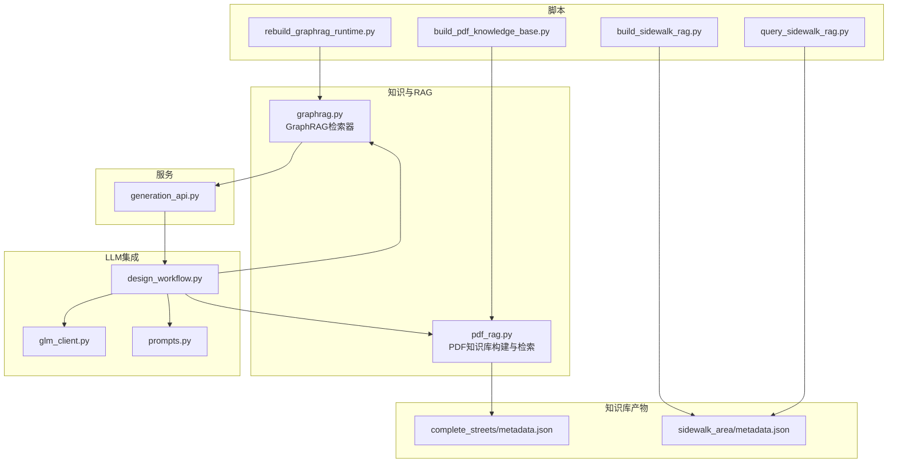
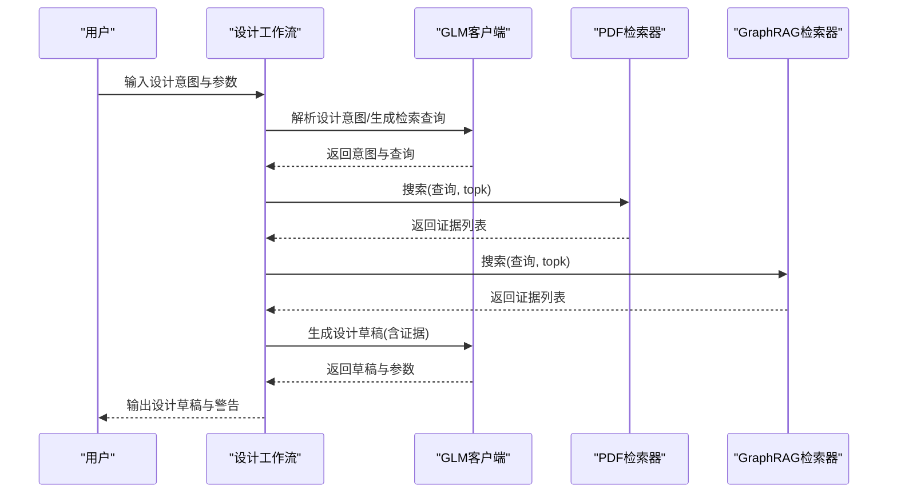
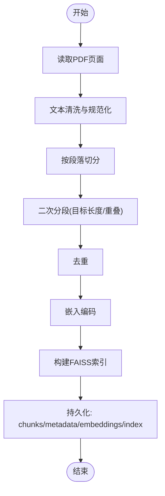
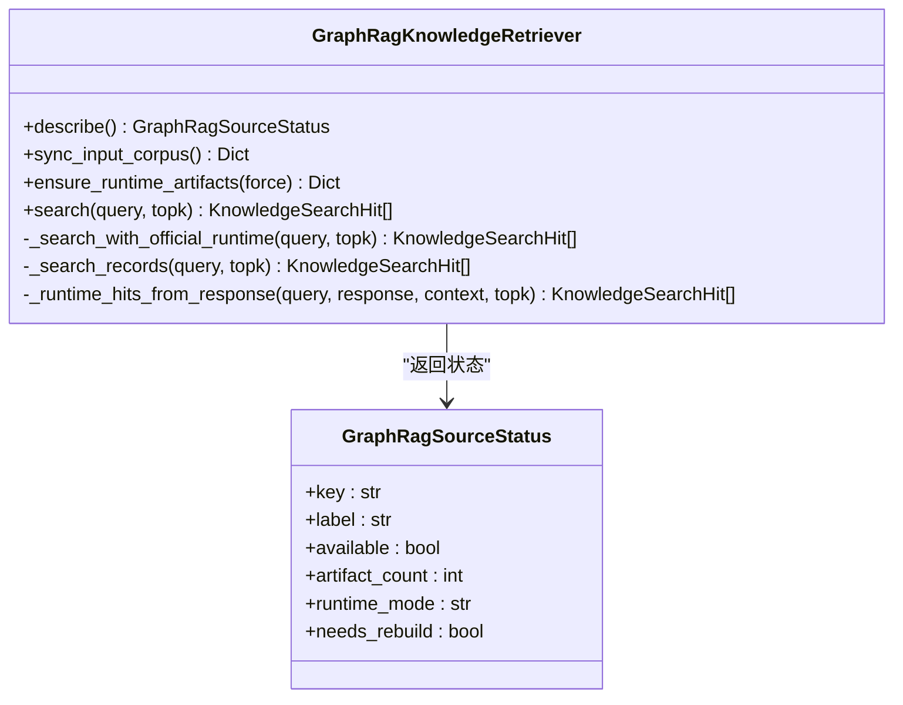
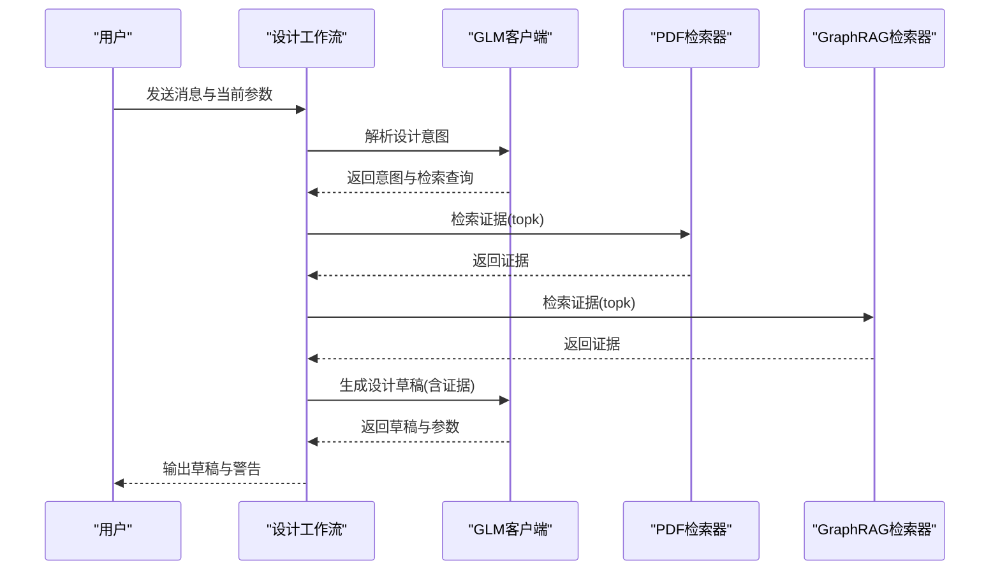
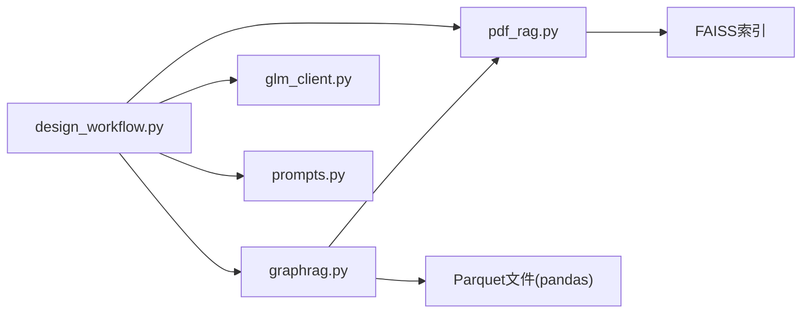

# 知识与RAG系统

<cite>
**本文档引用的文件**
- [pdf_rag.py](file://src/roadgen3d/knowledge/pdf_rag.py)
- [graphrag.py](file://src/roadgen3d/knowledge/graphrag.py)
- [build_pdf_knowledge_base.py](file://scripts/knowledge/build_pdf_knowledge_base.py)
- [build_sidewalk_rag.py](file://scripts/knowledge/build_sidewalk_rag.py)
- [query_sidewalk_rag.py](file://scripts/knowledge/query_sidewalk_rag.py)
- [design_workflow.py](file://src/roadgen3d/llm/design_workflow.py)
- [glm_client.py](file://src/roadgen3d/llm/glm_client.py)
- [prompts.py](file://src/roadgen3d/llm/prompts.py)
- [generation_api.py](file://src/roadgen3d/services/generation_api.py)
- [metadata.json（完整街道）](file://knowledge/complete_streets/metadata.json)
- [metadata.json（人行道区域）](file://knowledge/sidewalk_area/metadata.json)
- [test_pdf_rag.py](file://tests/test_pdf_rag.py)
- [test_graphrag_retriever.py](file://tests/test_graphrag_retriever.py)
- [README.md](file://README.md)
- [rebuild_graphrag_runtime.py](file://scripts/knowledge/rebuild_graphrag_runtime.py)
</cite>

## 目录
1. [简介](#简介)
2. [项目结构](#项目结构)
3. [核心组件](#核心组件)
4. [架构总览](#架构总览)
5. [详细组件分析](#详细组件分析)
6. [依赖分析](#依赖分析)
7. [性能考虑](#性能考虑)
8. [故障排查指南](#故障排查指南)
9. [结论](#结论)
10. [附录](#附录)

## 简介
本文件系统化梳理 RoadGen3D 的知识与 RAG（检索增强生成）体系，覆盖 Complete Streets 设计指南的知识库构建流程（PDF 解析、文本分段与向量化存储）、RAG 检索机制（查询理解、相似性搜索与答案生成）、知识检索 API 使用方法（查询优化、结果排序与上下文增强）、知识库维护（增量更新、版本管理与质量控制）、与 LLM 的集成（提示工程、上下文管理与输出过滤），以及性能优化（索引策略、缓存与并发）。同时提供扩展知识库内容与新增文档类型的实践指导。

## 项目结构
- 知识与 RAG 核心位于 src/roadgen3d/knowledge 下，包含 PDF 文档的 FAISS 索引构建与检索（pdf_rag.py），以及 GraphRAG 的检索器（graphrag.py）。
- 脚本目录 scripts/knowledge 提供知识库构建与查询的命令行工具。
- LLM 集成位于 src/roadgen3d/llm，包含设计工作流（design_workflow.py）、GLM 客户端（glm_client.py）与提示模板（prompts.py）。
- 服务层提供生成 API（generation_api.py）与设计运行时接口。
- 知识库产物位于 knowledge 目录，包含 complete_streets 与 sidewalk_area 的 chunks、metadata、embeddings 与 FAISS 索引。

图表来源
- [pdf_rag.py](file://src/roadgen3d/knowledge/pdf_rag.py)
- [graphrag.py](file://src/roadgen3d/knowledge/graphrag.py)
- [build_pdf_knowledge_base.py](file://scripts/knowledge/build_pdf_knowledge_base.py)
- [build_sidewalk_rag.py](file://scripts/knowledge/build_sidewalk_rag.py)
- [query_sidewalk_rag.py](file://scripts/knowledge/query_sidewalk_rag.py)
- [design_workflow.py](file://src/roadgen3d/llm/design_workflow.py)
- [glm_client.py](file://src/roadgen3d/llm/glm_client.py)
- [prompts.py](file://src/roadgen3d/llm/prompts.py)
- [generation_api.py](file://src/roadgen3d/services/generation_api.py)
- [metadata.json（完整街道）](file://knowledge/complete_streets/metadata.json)
- [metadata.json（人行道区域）](file://knowledge/sidewalk_area/metadata.json)

章节来源
- [README.md: 107-130:107-130](file://README.md#L107-L130)

## 核心组件
- PDF 知识库构建与检索：负责从 PDF 提取文本、分段、去重、嵌入与 FAISS 向量索引的完整流水线，支持多种嵌入后端（Sentence-Transformers 与 CLIP）。
- GraphRAG 检索器：优先使用官方 GraphRAG 运行时，若不可用则回退至合并的 txt/社区产物，提供输入同步、运行时构建与检索。
- 设计工作流：整合 LLM 与 RAG，完成意图解析、检索查询生成、证据检索、草稿生成与场景生成。
- LLM 客户端与提示：封装 GLM OpenAI 兼容接口，提供设计意图、查询翻译、参数跟进与设计草稿的提示模板。
- 服务 API：提供场景生成的 REST 接口，便于前端与工作台调用。

章节来源
- [pdf_rag.py: 258-446:258-446](file://src/roadgen3d/knowledge/pdf_rag.py#L258-L446)
- [graphrag.py: 230-800:230-800](file://src/roadgen3d/knowledge/graphrag.py#L230-L800)
- [design_workflow.py: 62-800:62-800](file://src/roadgen3d/llm/design_workflow.py#L62-L800)
- [glm_client.py: 41-149:41-149](file://src/roadgen3d/llm/glm_client.py#L41-L149)
- [prompts.py: 11-200:11-200](file://src/roadgen3d/llm/prompts.py#L11-L200)
- [generation_api.py: 1-294:1-294](file://src/roadgen3d/services/generation_api.py#L1-L294)

## 架构总览
RAG 系统由“知识库构建—检索—生成”三层组成。知识库构建阶段将 PDF 文本切分为段落并嵌入，存储为 chunks、metadata、embeddings 与 FAISS 索引；检索阶段通过 LLM 将用户查询转化为检索词，进行向量相似性搜索或文本匹配；生成阶段将检索证据注入提示，驱动 LLM 输出设计草稿与参数建议。

图表来源
- [design_workflow.py: 112-239:112-239](file://src/roadgen3d/llm/design_workflow.py#L112-L239)
- [pdf_rag.py: 409-423:409-423](file://src/roadgen3d/knowledge/pdf_rag.py#L409-L423)
- [graphrag.py: 403-422:403-422](file://src/roadgen3d/knowledge/graphrag.py#L403-L422)
- [glm_client.py: 98-109:98-109](file://src/roadgen3d/llm/glm_client.py#L98-L109)

## 详细组件分析

### PDF 知识库构建与检索
- PDF 解析与清洗：读取 PDF 页面文本，规范化空白与换行，去除异常字符。
- 分段策略：按段落切分，再以目标长度与重叠长度进行二次切分，去重后形成知识块。
- 嵌入与索引：支持 Sentence-Transformers 与 CLIP 两种嵌入后端，最终写入 FAISS IndexFlatIP 并持久化元数据。
- 检索流程：加载 chunks、index 与 metadata，将查询向量化后进行 top-k 搜索，返回带分数的证据。

图表来源
- [pdf_rag.py: 157-256:157-256](file://src/roadgen3d/knowledge/pdf_rag.py#L157-L256)
- [pdf_rag.py: 275-342:275-342](file://src/roadgen3d/knowledge/pdf_rag.py#L275-L342)

章节来源
- [pdf_rag.py: 14-102:14-102](file://src/roadgen3d/knowledge/pdf_rag.py#L14-L102)
- [pdf_rag.py: 157-256:157-256](file://src/roadgen3d/knowledge/pdf_rag.py#L157-L256)
- [pdf_rag.py: 258-342:258-342](file://src/roadgen3d/knowledge/pdf_rag.py#L258-L342)
- [pdf_rag.py: 344-423:344-423](file://src/roadgen3d/knowledge/pdf_rag.py#L344-L423)
- [build_pdf_knowledge_base.py: 52-87:52-87](file://scripts/knowledge/build_pdf_knowledge_base.py#L52-L87)
- [metadata.json（完整街道）: 1-11:1-11](file://knowledge/complete_streets/metadata.json#L1-L11)

### GraphRAG 检索器
- 输入同步：将 txt 来源文件同步到 GraphRAG quickstart 的 input 目录，记录清单与指纹，避免重复拷贝。
- 运行时构建：检测官方 GraphRAG 运行时可用性与构建状态，必要时重建；支持 local 与 basic 模式查询。
- 检索回退：若官方运行时不可用，则回退到合并的 txt/社区产物进行词法评分与截取。
- 结果归一：统一将检索结果转换为知识证据，支持响应文本与上下文记录的组合输出。

图表来源
- [graphrag.py: 230-800:230-800](file://src/roadgen3d/knowledge/graphrag.py#L230-L800)

章节来源
- [graphrag.py: 269-423:269-423](file://src/roadgen3d/knowledge/graphrag.py#L269-L423)
- [graphrag.py: 459-590:459-590](file://src/roadgen3d/knowledge/graphrag.py#L459-L590)
- [graphrag.py: 667-787:667-787](file://src/roadgen3d/knowledge/graphrag.py#L667-L787)
- [rebuild_graphrag_runtime.py: 43-99:43-99](file://scripts/knowledge/rebuild_graphrag_runtime.py#L43-L99)

### 设计工作流与 LLM 集成
- 意图解析：将用户消息与历史对话转为 JSON，提取用户目标、风格偏好、安全优先级与检索查询。
- 查询理解：对中英文混合查询进行翻译与规范化，生成多条检索查询。
- 证据检索：按知识源（hybrid/pdf/graph）分别检索，合并去重并按分数排序。
- 草稿生成：将检索证据注入提示，生成设计草稿与参数建议，并进行默认值填充与引用校验。
- 场景生成：提交生成作业，支持同步与异步查询。

图表来源
- [design_workflow.py: 112-239:112-239](file://src/roadgen3d/llm/design_workflow.py#L112-L239)
- [prompts.py: 11-164:11-164](file://src/roadgen3d/llm/prompts.py#L11-L164)
- [glm_client.py: 98-109:98-109](file://src/roadgen3d/llm/glm_client.py#L98-L109)

章节来源
- [design_workflow.py: 62-800:62-800](file://src/roadgen3d/llm/design_workflow.py#L62-L800)
- [prompts.py: 11-200:11-200](file://src/roadgen3d/llm/prompts.py#L11-L200)
- [glm_client.py: 41-149:41-149](file://src/roadgen3d/llm/glm_client.py#L41-L149)

### 知识检索 API 使用
- 查询优化：支持中英混合查询的自动翻译与规范化，生成多条检索查询以提升召回。
- 结果排序：按检索分数降序排列，支持 topk 控制与去重。
- 上下文增强：将检索证据注入提示，结合参数提示词（如人行道宽度、车道数等）提升生成质量。
- 缓存机制：对相同输入与知识源的草稿进行缓存，命中时跳过检索与 LLM 计算，显著降低延迟。

章节来源
- [design_workflow.py: 507-540:507-540](file://src/roadgen3d/llm/design_workflow.py#L507-L540)
- [design_workflow.py: 615-634:615-634](file://src/roadgen3d/llm/design_workflow.py#L615-L634)
- [design_workflow.py: 368-460:368-460](file://src/roadgen3d/llm/design_workflow.py#L368-L460)

### 知识库维护与扩展
- 增量更新：GraphRAG 支持输入文件同步与指纹校验，仅在变更时重建运行时产物。
- 版本管理：通过稳定哈希与清单文件记录输入与构建状态，便于回滚与一致性验证。
- 质量控制：测试用例覆盖 PDF 知识库构建产物与 GraphRAG 回退检索，确保检索稳定性。
- 扩展新文档类型：参考 sidewalk_area 的构建脚本，实现自定义解析规则与元数据写入。

章节来源
- [graphrag.py: 340-398:340-398](file://src/roadgen3d/knowledge/graphrag.py#L340-L398)
- [build_sidewalk_rag.py: 159-227:159-227](file://scripts/knowledge/build_sidewalk_rag.py#L159-L227)
- [test_pdf_rag.py: 39-93:39-93](file://tests/test_pdf_rag.py#L39-L93)
- [test_graphrag_retriever.py: 16-61:16-61](file://tests/test_graphrag_retriever.py#L16-L61)

## 依赖分析
- 组件耦合：设计工作流依赖 PDF 与 GraphRAG 检索器，检索器依赖嵌入后端与索引文件；LLM 客户端提供 JSON 输出能力。
- 外部依赖：FAISS 用于向量检索，pandas/pyarrow 用于 GraphRAG parquet 读取，sentence-transformers 与 CLIP 用于嵌入。
- 潜在循环：未发现直接循环依赖；检索器与工作流通过协议与数据类解耦。

图表来源
- [design_workflow.py: 11-26:11-26](file://src/roadgen3d/llm/design_workflow.py#L11-L26)
- [pdf_rag.py: 21-26:21-26](file://src/roadgen3d/knowledge/pdf_rag.py#L21-L26)
- [graphrag.py: 161-169:161-169](file://src/roadgen3d/knowledge/graphrag.py#L161-L169)

章节来源
- [design_workflow.py: 11-26:11-26](file://src/roadgen3d/llm/design_workflow.py#L11-L26)
- [pdf_rag.py: 21-26:21-26](file://src/roadgen3d/knowledge/pdf_rag.py#L21-L26)
- [graphrag.py: 161-169:161-169](file://src/roadgen3d/knowledge/graphrag.py#L161-L169)

## 性能考虑
- 索引策略：使用 FAISS IndexFlatIP 进行内积相似性搜索；GraphRAG 优先使用官方运行时以获得更优的检索与推理性能。
- 缓存机制：设计工作流对相同输入与知识源的草稿进行缓存，命中时直接返回，减少重复计算。
- 并发处理：GraphRAG 检索器内部使用线程锁保护运行时构建过程，避免竞态；服务层可扩展为任务队列以支持高并发。
- 嵌入后端选择：在资源受限环境下可使用 CLIP 本地嵌入作为回退方案，保证检索可用性。

章节来源
- [pdf_rag.py: 300-303:300-303](file://src/roadgen3d/knowledge/pdf_rag.py#L300-L303)
- [graphrag.py: 267-268:267-268](file://src/roadgen3d/knowledge/graphrag.py#L267-L268)
- [design_workflow.py: 368-460:368-460](file://src/roadgen3d/llm/design_workflow.py#L368-L460)

## 故障排查指南
- PDF 知识库构建失败：检查嵌入后端安装与模型路径，必要时切换到 CLIP 回退方案；确认 PDF 可读且有文本内容。
- GraphRAG 运行时不可用：检查 quickstart 设置文件与输出目录是否存在；通过重建脚本进行强制重建与烟雾测试。
- 检索结果为空：确认查询是否为空或纯噪声；尝试增加 topk 或调整查询；检查知识库是否已构建成功。
- LLM 输出格式错误：确认提示模板与 JSON 解析逻辑；检查 GLM 客户端响应头与超时设置。

章节来源
- [build_pdf_knowledge_base.py: 59-78:59-78](file://scripts/knowledge/build_pdf_knowledge_base.py#L59-L78)
- [rebuild_graphrag_runtime.py: 54-70:54-70](file://scripts/knowledge/rebuild_graphrag_runtime.py#L54-L70)
- [design_workflow.py: 507-540:507-540](file://src/roadgen3d/llm/design_workflow.py#L507-L540)
- [glm_client.py: 98-109:98-109](file://src/roadgen3d/llm/glm_client.py#L98-L109)

## 结论
RoadGen3D 的知识与 RAG 系统通过 PDF 与 GraphRAG 双通道构建知识库，结合 LLM 的意图解析与检索查询生成，实现了从设计意图到可执行参数的高效转化。系统具备良好的可维护性（增量同步、版本管理）与可扩展性（多文档类型、多嵌入后端），并通过缓存与索引策略保障了检索性能。未来可在任务队列与分布式部署方面进一步提升并发能力，并持续扩展知识库内容以覆盖更广泛的街道设计场景。

## 附录
- 常用命令
  - 构建 PDF 知识库：python scripts/knowledge/build_pdf_knowledge_base.py
  - 构建人行道 RAG：python scripts/knowledge/build_sidewalk_rag.py --pdf-path PATH
  - 查询人行道 RAG：python scripts/knowledge/query_sidewalk_rag.py "查询语句"
  - 重建 GraphRAG 运行时：python scripts/knowledge/rebuild_graphrag_runtime.py
- 关键文件
  - 知识库元数据：knowledge/complete_streets/metadata.json、knowledge/sidewalk_area/metadata.json
  - 测试用例：tests/test_pdf_rag.py、tests/test_graphrag_retriever.py