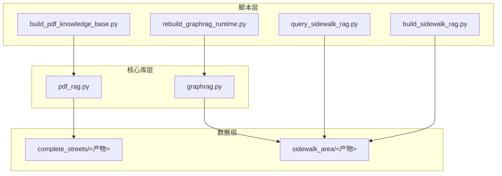
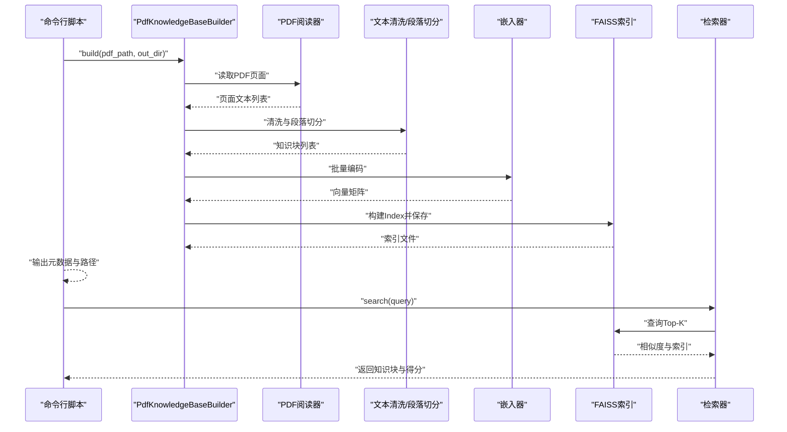
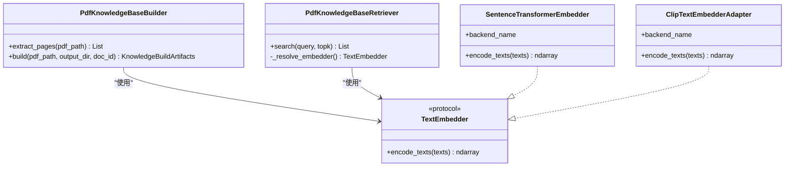
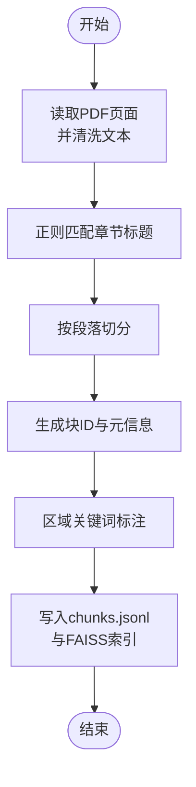
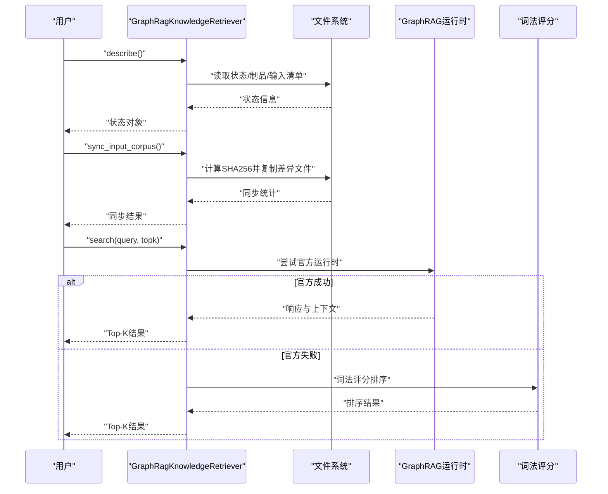
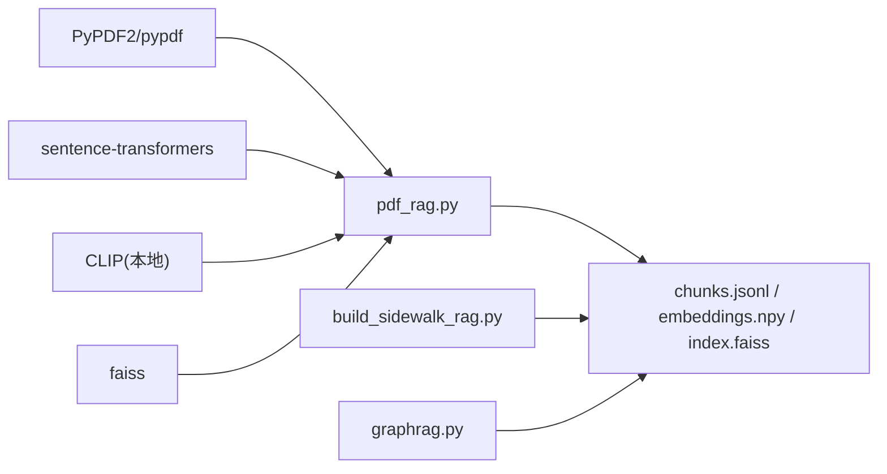

# 知识库构建

<cite>
**本文档引用的文件**
- [build_pdf_knowledge_base.py](file://scripts/knowledge/build_pdf_knowledge_base.py)
- [build_sidewalk_rag.py](file://scripts/knowledge/build_sidewalk_rag.py)
- [pdf_rag.py](file://src/roadgen3d/knowledge/pdf_rag.py)
- [graphrag.py](file://src/roadgen3d/knowledge/graphrag.py)
- [rebuild_graphrag_runtime.py](file://scripts/knowledge/rebuild_graphrag_runtime.py)
- [query_sidewalk_rag.py](file://scripts/knowledge/query_sidewalk_rag.py)
- [metadata.json（完整街道）](file://knowledge/complete_streets/metadata.json)
- [metadata.json（人行道区域）](file://knowledge/sidewalk_area/metadata.json)
- [chunks.jsonl（完整街道）](file://knowledge/complete_streets/chunks.jsonl)
- [chunks.jsonl（人行道区域）](file://knowledge/sidewalk_area/chunks.jsonl)
</cite>

## 目录
1. [简介](#简介)
2. [项目结构](#项目结构)
3. [核心组件](#核心组件)
4. [架构总览](#架构总览)
5. [详细组件分析](#详细组件分析)
6. [依赖关系分析](#依赖关系分析)
7. [性能考虑](#性能考虑)
8. [故障排除指南](#故障排除指南)
9. [结论](#结论)
10. [附录](#附录)

## 简介
本文件系统性阐述 RoadGen3D 中知识库构建与检索体系，重点覆盖以下方面：
- Complete Streets 设计指南 PDF 的解析流程：文本提取、格式清理、段落切分与结构化处理。
- 知识库组织架构：书籍分类、章节划分、元数据管理与持久化。
- PDF 到文本的转换：基于 PyPDF2/pypdf 的文本抽取、CLIP/Sentence-Transformers 嵌入、FAISS 向量索引。
- 增量更新机制：版本控制、变更检测与自动同步策略建议。
- 人行道区域知识库的特殊处理：区域分割、语义标注与质量控制。
- 维护最佳实践：内容验证、格式标准化与存储优化。

## 项目结构
知识库相关目录与脚本分布如下：
- 脚本层：位于 scripts/knowledge，提供命令行工具用于构建与查询知识库。
- 核心库层：位于 src/roadgen3d/knowledge，封装通用的 PDF 文本解析、嵌入与检索能力。
- 数据层：位于 knowledge，按主题组织知识库产物（chunks、embeddings、FAISS 索引、元数据）。

**图表来源**
- [build_pdf_knowledge_base.py:1-92](file://scripts/knowledge/build_pdf_knowledge_base.py#L1-L92)
- [build_sidewalk_rag.py:1-252](file://scripts/knowledge/build_sidewalk_rag.py#L1-L252)
- [pdf_rag.py:1-446](file://src/roadgen3d/knowledge/pdf_rag.py#L1-L446)
- [graphrag.py:1-800](file://src/roadgen3d/knowledge/graphrag.py#L1-L800)

**章节来源**
- [build_pdf_knowledge_base.py:1-92](file://scripts/knowledge/build_pdf_knowledge_base.py#L1-L92)
- [build_sidewalk_rag.py:1-252](file://scripts/knowledge/build_sidewalk_rag.py#L1-L252)
- [pdf_rag.py:1-446](file://src/roadgen3d/knowledge/pdf_rag.py#L1-L446)
- [graphrag.py:1-800](file://src/roadgen3d/knowledge/graphrag.py#L1-L800)

## 核心组件
- PDF 文本解析与嵌入（通用管线）
  - 支持 PyPDF2/pypdf 文本抽取、统一的文本清洗、段落切分与去重、可插拔嵌入器（Sentence-Transformers 或 CLIP）。
  - 输出：chunks.jsonl、embeddings.npy、FAISS Index、metadata.json。
- 人行道区域专用构建器
  - 基于正则识别章节标题，按段落切分为固定长度块，附加区域关键词标注，生成带语义标签的块集合。
- GraphRAG 检索器
  - 优先使用官方 GraphRAG 运行时；若不可用则回退至合并后的 txt 社区制品。
  - 提供输入同步、状态描述与查询接口。

**章节来源**
- [pdf_rag.py:1-446](file://src/roadgen3d/knowledge/pdf_rag.py#L1-L446)
- [build_sidewalk_rag.py:1-252](file://scripts/knowledge/build_sidewalk_rag.py#L1-L252)
- [graphrag.py:1-800](file://src/roadgen3d/knowledge/graphrag.py#L1-L800)

## 架构总览
下图展示从 PDF 到检索结果的整体流程，涵盖文本抽取、清洗、切分、嵌入、索引与查询。

**图表来源**
- [pdf_rag.py:258-441](file://src/roadgen3d/knowledge/pdf_rag.py#L258-L441)
- [build_pdf_knowledge_base.py:52-87](file://scripts/knowledge/build_pdf_knowledge_base.py#L52-L87)

## 详细组件分析

### 组件A：通用 PDF 知识库构建器
- 功能要点
  - PDF 页面读取与文本清洗（去除空字符、替换乱码符号、规范化空白）。
  - 段落识别与切分（按目标字符数与重叠字符数进行滑动窗口切分，并去重）。
  - 可插拔嵌入器：默认优先使用 Sentence-Transformers，失败时回退 CLIP（本地模型离线可用）。
  - 产物持久化：chunks.jsonl（每行一条知识块）、embeddings.npy、FAISS Index、metadata.json。
- 关键类与方法
  - PdfKnowledgeBaseBuilder.build：主入口，负责构建与持久化。
  - PdfKnowledgeBaseRetriever.search：查询入口，支持自动选择嵌入器后检索。
  - TextEmbedder 协议：抽象嵌入器接口，便于扩展其他后端。

**图表来源**
- [pdf_rag.py:14-102](file://src/roadgen3d/knowledge/pdf_rag.py#L14-L102)
- [pdf_rag.py:258-441](file://src/roadgen3d/knowledge/pdf_rag.py#L258-L441)

**章节来源**
- [pdf_rag.py:1-446](file://src/roadgen3d/knowledge/pdf_rag.py#L1-L446)

### 组件B：人行道区域知识库构建器
- 特殊处理逻辑
  - 正则匹配章节标题（形如“4.x 某某”），按段落切分并生成固定编号的块 ID。
  - 区域关键词标注：frontage、pedestrian、amenity、flex 等，辅助检索时过滤。
  - 输出字段：chunk_id、section_id、heading、text、page_start/page_end、zones、source。
- 查询流程
  - 加载 chunks.jsonl 与 FAISS Index，使用 Sentence-Transformers 编码查询词，返回 Top-K 结果。

**图表来源**
- [build_sidewalk_rag.py:72-177](file://scripts/knowledge/build_sidewalk_rag.py#L72-L177)

**章节来源**
- [build_sidewalk_rag.py:1-252](file://scripts/knowledge/build_sidewalk_rag.py#L1-L252)

### 组件C：GraphRAG 检索器
- 运行模式
  - 优先使用官方 GraphRAG 运行时（local/basic 搜索），若不可用则回退至合并 txt 与社区制品。
  - 输入同步：根据源 txt 文件指纹与 SHA256 决定是否复制更新。
  - 查询：先尝试官方运行时，失败则回退到本地记录的词法评分排序。
- 关键接口
  - describe：返回状态、制品数量、输入同步情况等。
  - sync_input_corpus：同步输入语料，生成清单与哈希。
  - search：执行查询并返回标准化的知识块与得分。

**图表来源**
- [graphrag.py:269-423](file://src/roadgen3d/knowledge/graphrag.py#L269-L423)
- [graphrag.py:459-590](file://src/roadgen3d/knowledge/graphrag.py#L459-L590)

**章节来源**
- [graphrag.py:1-800](file://src/roadgen3d/knowledge/graphrag.py#L1-L800)

## 依赖关系分析
- 外部依赖
  - PDF 解析：pypdf 或 PyPDF2。
  - 嵌入：sentence-transformers 或本地 CLIP（离线可用）。
  - 检索：faiss（CPU）。
  - GraphRAG：官方运行时（可选）。
- 内部耦合
  - pdf_rag.py 作为通用模块被脚本与 GraphRAG 检索器复用。
  - 人行道区域构建器独立于通用管线，但共享 FAISS 与 JSONL 格式约定。

**图表来源**
- [pdf_rag.py:21-37](file://src/roadgen3d/knowledge/pdf_rag.py#L21-L37)
- [build_sidewalk_rag.py:21-24](file://scripts/knowledge/build_sidewalk_rag.py#L21-L24)
- [graphrag.py:1-35](file://src/roadgen3d/knowledge/graphrag.py#L1-L35)

**章节来源**
- [pdf_rag.py:1-446](file://src/roadgen3d/knowledge/pdf_rag.py#L1-L446)
- [build_sidewalk_rag.py:1-252](file://scripts/knowledge/build_sidewalk_rag.py#L1-L252)
- [graphrag.py:1-800](file://src/roadgen3d/knowledge/graphrag.py#L1-L800)

## 性能考虑
- 文本清洗与切分
  - 使用正则与滑动窗口切分，避免过长块导致嵌入维度浪费；重叠字符有助于跨边界语义连贯。
- 嵌入与索引
  - 建议在 CPU 上使用 Sentence-Transformers 获取更佳语义质量；若资源受限可使用 CLIP 本地模型。
  - FAISS IndexFlatIP 在小到中等规模数据上表现稳定；大规模场景可评估分片或倒排索引方案。
- 查询效率
  - 预先构建 FAISS 索引，查询时仅需一次向量编码与最近邻搜索。
  - GraphRAG 回退路径采用词法评分，适合快速响应与无运行时环境。

[本节为通用指导，不直接分析具体文件]

## 故障排除指南
- PDF 解析失败
  - 确认安装 pypdf 或 PyPDF2；若版本冲突，优先使用 pypdf。
  - 若出现乱码字符，检查文本清洗规则是否覆盖对应编码。
- 嵌入器导入错误
  - sentence-transformers 或 faiss 未安装会触发运行时异常；按提示安装依赖。
  - CLIP 模型路径与设备设置需正确，确保本地离线可用。
- GraphRAG 运行时不可用
  - 检查 settings.yaml 是否存在、输入目录是否同步、缓存状态是否成功。
  - 使用 rebuild_graphrag_runtime.py 手动重建并执行烟雾测试查询。
- 人行道区域构建为空
  - 章节正则可能与 PDF 格式不匹配；调整 SECTION_RE 或检查页面文本清洗结果。

**章节来源**
- [pdf_rag.py:21-37](file://src/roadgen3d/knowledge/pdf_rag.py#L21-L37)
- [build_sidewalk_rag.py:27-33](file://scripts/knowledge/build_sidewalk_rag.py#L27-L33)
- [rebuild_graphrag_runtime.py:43-104](file://scripts/knowledge/rebuild_graphrag_runtime.py#L43-L104)

## 结论
该知识库系统以通用 PDF 管线为核心，结合人行道区域的结构化与语义标注，形成从 PDF 到检索的完整链路。GraphRAG 检索器提供了运行时优先与回退稳定的双轨策略。通过标准化的产物格式（JSONL、npy、FAISS）与清晰的元数据管理，系统具备良好的可维护性与扩展性。

[本节为总结性内容，不直接分析具体文件]

## 附录

### 附录A：知识库产物与元数据
- 通用知识库（完整街道）
  - 产物：chunks.jsonl、embeddings.npy、index.faiss、metadata.json。
  - 元数据示例字段：doc_id、source_path、chunk_count、embedding_dim、embedding_backend、clip_model_dir、paths。
- 人行道区域知识库
  - 产物：chunks.jsonl、index.faiss、metadata.json、chunk_ids.json、embeddings.npy。
  - 元数据示例字段：pdf、chunk_count、embedding_dim、paths。

**章节来源**
- [metadata.json（完整街道）:1-11](file://knowledge/complete_streets/metadata.json#L1-L11)
- [metadata.json（人行道区域）:1-8](file://knowledge/sidewalk_area/metadata.json#L1-L8)

### 附录B：命令行使用示例
- 构建通用 PDF 知识库
  - 脚本入口：scripts/knowledge/build_pdf_knowledge_base.py
  - 参数：--pdf-path、--out-dir、--embedder-backend、--clip-model-dir、--target-chars、--overlap-chars
- 构建人行道区域知识库
  - 脚本入口：scripts/knowledge/build_sidewalk_rag.py
  - 参数：--pdf-path、--out-dir、--model
- 查询人行道区域知识库
  - 脚本入口：scripts/knowledge/query_sidewalk_rag.py
  - 参数：query、--artifact-dir、--model、--topk
- 重建 GraphRAG 运行时
  - 脚本入口：scripts/knowledge/rebuild_graphrag_runtime.py
  - 参数：--project-dir、--force、--query、--skip-query

**章节来源**
- [build_pdf_knowledge_base.py:21-49](file://scripts/knowledge/build_pdf_knowledge_base.py#L21-L49)
- [build_sidewalk_rag.py:229-234](file://scripts/knowledge/build_sidewalk_rag.py#L229-L234)
- [query_sidewalk_rag.py:45-52](file://scripts/knowledge/query_sidewalk_rag.py#L45-L52)
- [rebuild_graphrag_runtime.py:18-40](file://scripts/knowledge/rebuild_graphrag_runtime.py#L18-L40)