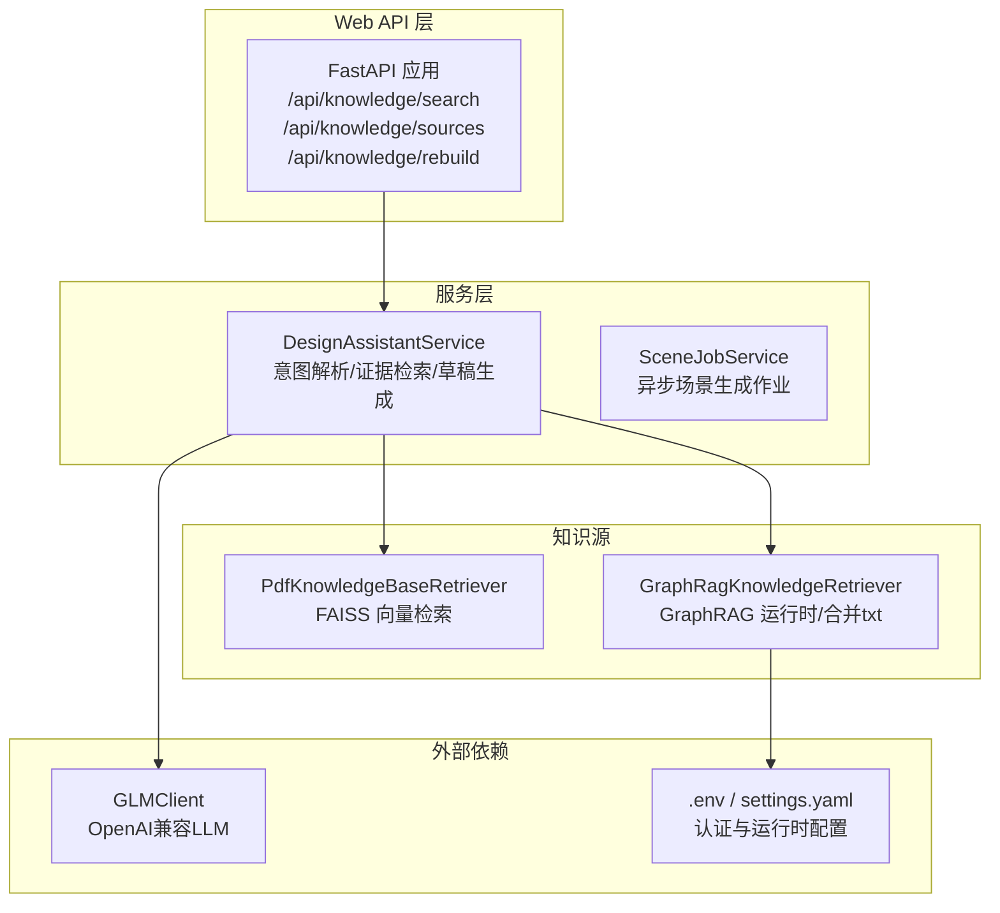
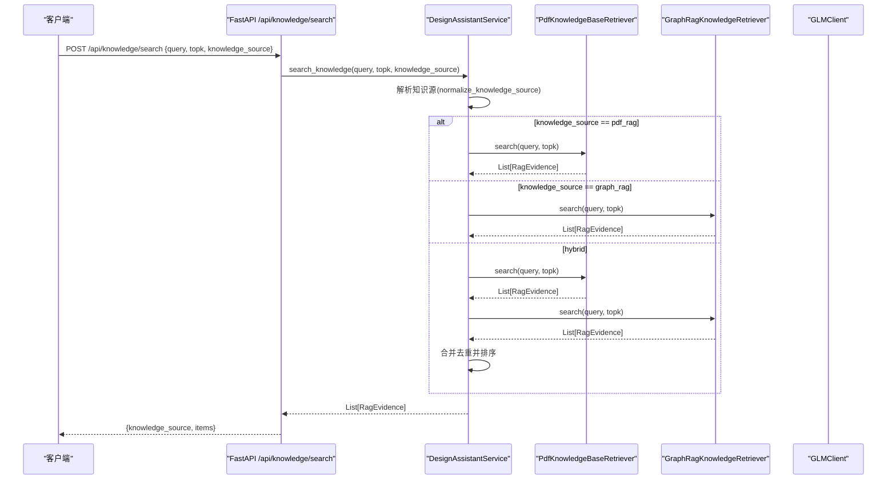
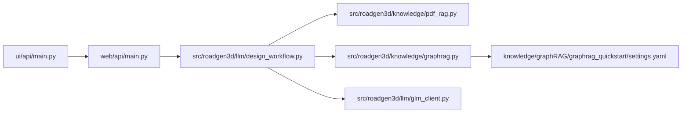

# 知识检索API

<cite>
**本文档引用的文件**
- [web/api/main.py](file://web/api/main.py)
- [src/roadgen3d/llm/design_workflow.py](file://src/roadgen3d/llm/design_workflow.py)
- [src/roadgen3d/knowledge/pdf_rag.py](file://src/roadgen3d/knowledge/pdf_rag.py)
- [src/roadgen3d/knowledge/graphrag.py](file://src/roadgen3d/knowledge/graphrag.py)
- [src/roadgen3d/llm/glm_client.py](file://src/roadgen3d/llm/glm_client.py)
- [src/roadgen3d/services/design_types.py](file://src/roadgen3d/services/design_types.py)
- [src/roadgen3d/services/design_runtime.py](file://src/roadgen3d/services/design_runtime.py)
- [scripts/knowledge/build_sidewalk_rag.py](file://scripts/knowledge/build_sidewalk_rag.py)
- [scripts/knowledge/query_sidewalk_rag.py](file://scripts/knowledge/query_sidewalk_rag.py)
- [tests/test_pdf_rag.py](file://tests/test_pdf_rag.py)
- [tests/test_graphrag_retriever.py](file://tests/test_graphrag_retriever.py)
- [knowledge/graphRAG/graphrag_quickstart/settings.yaml](file://knowledge/graphRAG/graphrag_quickstart/settings.yaml)
- [ui/api/main.py](file://ui/api/main.py)
- [README_M1.md](file://README_M1.md)
</cite>

## 目录
1. [简介](#简介)
2. [项目结构](#项目结构)
3. [核心组件](#核心组件)
4. [架构总览](#架构总览)
5. [详细组件分析](#详细组件分析)
6. [依赖关系分析](#依赖关系分析)
7. [性能考虑](#性能考虑)
8. [故障排除指南](#故障排除指南)
9. [结论](#结论)
10. [附录](#附录)

## 简介
本文件面向知识检索API的使用者与维护者，系统性阐述基于RoadGen3D项目的知识检索能力。该API通过统一的FastAPI入口提供REST接口，支持两类知识源：PDF RAG（基于FAISS向量检索）与GraphRAG（基于官方GraphRAG运行时与本地txt合并）。API涵盖端点定义、请求/响应格式、调用流程、参数配置、集成示例、性能特征、监控与调试工具、版本管理策略以及安全最佳实践。

## 项目结构
知识检索API位于Web应用层，核心逻辑由设计工作流服务协调，检索器分别对接PDF RAG与GraphRAG两种知识源，并通过LLM客户端进行意图解析与查询优化。

图表来源
- [web/api/main.py:223-253](file://web/api/main.py#L223-L253)
- [src/roadgen3d/llm/design_workflow.py:62-309](file://src/roadgen3d/llm/design_workflow.py#L62-L309)
- [src/roadgen3d/knowledge/pdf_rag.py:344-422](file://src/roadgen3d/knowledge/pdf_rag.py#L344-L422)
- [src/roadgen3d/knowledge/graphrag.py:230-490](file://src/roadgen3d/knowledge/graphrag.py#L230-L490)
- [src/roadgen3d/llm/glm_client.py:41-108](file://src/roadgen3d/llm/glm_client.py#L41-L108)

章节来源
- [web/api/main.py:81-267](file://web/api/main.py#L81-L267)
- [src/roadgen3d/llm/design_workflow.py:62-309](file://src/roadgen3d/llm/design_workflow.py#L62-L309)

## 核心组件
- Web API入口：提供健康检查、知识源列表、重建知识库、知识检索等端点。
- 设计工作流服务：封装意图解析、证据检索、草稿生成与场景生成作业调度。
- PDF RAG检索器：基于FAISS的向量检索，支持自定义嵌入模型与重叠分块策略。
- GraphRAG检索器：优先使用官方GraphRAG运行时，若不可用则回退至合并txt社区数据。
- LLM客户端：封装OpenAI兼容的聊天接口，支持JSON模式解析。

章节来源
- [web/api/main.py:223-253](file://web/api/main.py#L223-L253)
- [src/roadgen3d/llm/design_workflow.py:62-309](file://src/roadgen3d/llm/design_workflow.py#L62-L309)
- [src/roadgen3d/knowledge/pdf_rag.py:344-422](file://src/roadgen3d/knowledge/pdf_rag.py#L344-L422)
- [src/roadgen3d/knowledge/graphrag.py:230-490](file://src/roadgen3d/knowledge/graphrag.py#L230-L490)
- [src/roadgen3d/llm/glm_client.py:41-108](file://src/roadgen3d/llm/glm_client.py#L41-L108)

## 架构总览
知识检索API采用分层架构：Web层负责HTTP路由与参数校验，服务层负责业务编排，检索层负责具体的知识检索，外部依赖负责LLM与运行时配置。

图表来源
- [web/api/main.py:239-253](file://web/api/main.py#L239-L253)
- [src/roadgen3d/llm/design_workflow.py:255-309](file://src/roadgen3d/llm/design_workflow.py#L255-L309)
- [src/roadgen3d/knowledge/pdf_rag.py:409-422](file://src/roadgen3d/knowledge/pdf_rag.py#L409-L422)
- [src/roadgen3d/knowledge/graphrag.py:403-422](file://src/roadgen3d/knowledge/graphrag.py#L403-L422)

## 详细组件分析

### Web API端点定义
- GET /api/health：返回服务健康状态与默认知识库路径。
- GET /api/knowledge/sources：列出可用知识源（hybrid/pdf_rag/graph_rag）及其状态。
- POST /api/knowledge/rebuild：重建PDF知识库（支持指定PDF路径与输出目录）。
- POST /api/knowledge/search：执行知识检索，返回证据列表。

请求/响应模型
- 请求模型：KnowledgeSearchRequestModel（query, topk, knowledge_source）
- 响应模型：包含knowledge_source与items（RagEvidence数组）

章节来源
- [web/api/main.py:92-99](file://web/api/main.py#L92-L99)
- [web/api/main.py:234-237](file://web/api/main.py#L234-L237)
- [web/api/main.py:223-233](file://web/api/main.py#L223-L233)
- [web/api/main.py:239-253](file://web/api/main.py#L239-L253)
- [src/roadgen3d/services/design_types.py:131-175](file://src/roadgen3d/services/design_types.py#L131-L175)

### 设计工作流服务（检索编排）
- 知识源规范化：支持hybrid/pdf_rag/graph_rag三种模式。
- 查询准备：根据对话消息与用户输入生成检索查询，必要时进行语言翻译。
- 证据检索：按topk聚合来自不同知识源的证据，去重并按分数排序。
- 结果转换：将检索命中转换为RagEvidence，附带参数提示与来源标记。

章节来源
- [src/roadgen3d/llm/design_workflow.py:241-309](file://src/roadgen3d/llm/design_workflow.py#L241-L309)
- [src/roadgen3d/llm/design_workflow.py:507-540](file://src/roadgen3d/llm/design_workflow.py#L507-L540)
- [src/roadgen3d/llm/design_workflow.py:704-723](file://src/roadgen3d/llm/design_workflow.py#L704-L723)

### PDF RAG检索器
- 构建阶段：从PDF提取页面、分段、构建知识块、计算嵌入并持久化FAISS索引。
- 检索阶段：对查询向量进行相似度搜索，返回带分数的证据。
- 可插拔嵌入器：支持Sentence-Transformers与CLIP适配器。

章节来源
- [src/roadgen3d/knowledge/pdf_rag.py:258-341](file://src/roadgen3d/knowledge/pdf_rag.py#L258-L341)
- [src/roadgen3d/knowledge/pdf_rag.py:344-422](file://src/roadgen3d/knowledge/pdf_rag.py#L344-L422)
- [src/roadgen3d/knowledge/pdf_rag.py:40-102](file://src/roadgen3d/knowledge/pdf_rag.py#L40-L102)

### GraphRAG检索器
- 输入同步：将txt源文件同步到GraphRAG quickstart的input目录。
- 运行时检测：优先使用官方GraphRAG运行时（local/basic），若不可用则回退至合并txt。
- 命中转换：将运行时响应与上下文记录转换为统一证据格式。

章节来源
- [src/roadgen3d/knowledge/graphrag.py:340-397](file://src/roadgen3d/knowledge/graphrag.py#L340-L397)
- [src/roadgen3d/knowledge/graphrag.py:459-537](file://src/roadgen3d/knowledge/graphrag.py#L459-L537)
- [src/roadgen3d/knowledge/graphrag.py:539-589](file://src/roadgen3d/knowledge/graphrag.py#L539-L589)

### LLM客户端
- 支持OpenAI兼容端点，自动处理Authorization头与JSON负载。
- 提供chat与chat_json方法，后者用于抽取JSON响应。

章节来源
- [src/roadgen3d/llm/glm_client.py:41-108](file://src/roadgen3d/llm/glm_client.py#L41-L108)

### 数据模型与证据格式
- RagEvidence：检索证据的标准载体，包含chunk_id、doc_id、section_title、页码范围、文本、来源路径、分数、相关性说明、知识源标识与参数提示。
- KnowledgeChunk/KnowledgeSearchHit：内部检索命中结构，用于统一不同知识源的输出。

章节来源
- [src/roadgen3d/services/design_types.py:157-175](file://src/roadgen3d/services/design_types.py#L157-L175)
- [src/roadgen3d/knowledge/pdf_rag.py:116-154](file://src/roadgen3d/knowledge/pdf_rag.py#L116-L154)
- [src/roadgen3d/knowledge/graphrag.py:218-228](file://src/roadgen3d/knowledge/graphrag.py#L218-L228)

### 调用流程与参数配置
- 端点：POST /api/knowledge/search
- 请求参数：
  - query：检索关键词
  - topk：返回证据数量上限（默认6）
  - knowledge_source：知识源选择（hybrid/pdf_rag/graph_rag）
- 响应字段：
  - knowledge_source：实际使用的知识源
  - items：证据数组，每项包含chunk_id、doc_id、section_title、页码、文本、来源路径、分数、相关性说明、知识源标识与参数提示

章节来源
- [web/api/main.py:65-69](file://web/api/main.py#L65-L69)
- [web/api/main.py:239-253](file://web/api/main.py#L239-L253)
- [src/roadgen3d/llm/design_workflow.py:255-266](file://src/roadgen3d/llm/design_workflow.py#L255-L266)

### 集成示例与错误处理
- 客户端集成要点：
  - 使用POST /api/knowledge/search发送查询
  - 根据knowledge_source选择合适的检索策略
  - 对返回的items进行展示与二次处理
- 错误处理：
  - HTTP 400：参数无效或检索失败
  - HTTP 503：LLM配置或响应异常
  - 知识源不可用：抛出运行时错误并提示

章节来源
- [web/api/main.py:242-249](file://web/api/main.py#L242-L249)
- [src/roadgen3d/llm/design_workflow.py:486-505](file://src/roadgen3d/llm/design_workflow.py#L486-L505)

### 重试机制与缓存
- 设计草稿缓存：针对相同prompt与知识源的重复请求，服务端会缓存并复用结果，减少重复LLM与检索开销。
- GraphRAG运行时重建：当输入或设置变化时自动重建，确保检索质量。

章节来源
- [src/roadgen3d/llm/design_workflow.py:368-460](file://src/roadgen3d/llm/design_workflow.py#L368-L460)
- [src/roadgen3d/knowledge/graphrag.py:399-401](file://src/roadgen3d/knowledge/graphrag.py#L399-L401)

## 依赖关系分析

图表来源
- [web/api/main.py:81-267](file://web/api/main.py#L81-L267)
- [src/roadgen3d/llm/design_workflow.py:62-309](file://src/roadgen3d/llm/design_workflow.py#L62-L309)
- [src/roadgen3d/knowledge/pdf_rag.py:344-422](file://src/roadgen3d/knowledge/pdf_rag.py#L344-L422)
- [src/roadgen3d/knowledge/graphrag.py:230-490](file://src/roadgen3d/knowledge/graphrag.py#L230-L490)
- [src/roadgen3d/llm/glm_client.py:41-108](file://src/roadgen3d/llm/glm_client.py#L41-L108)
- [ui/api/main.py:1-6](file://ui/api/main.py#L1-L6)

章节来源
- [web/api/main.py:81-267](file://web/api/main.py#L81-L267)
- [src/roadgen3d/llm/design_workflow.py:62-309](file://src/roadgen3d/llm/design_workflow.py#L62-L309)

## 性能考虑
- 检索性能
  - PDF RAG：FAISS索引查询近似最近邻，适合大规模文本检索；topk越大，查询耗时越高。
  - GraphRAG：官方运行时具备更复杂的检索与图谱增强能力，但依赖LLM与向量化资源。
- 并发与吞吐
  - API层未显式配置并发池，建议在生产环境中结合反向代理或ASGI服务器进行并发控制。
- 缓存与重建
  - 设计草稿缓存显著降低重复请求成本；GraphRAG输入同步与重建避免陈旧数据影响。
- 资源消耗
  - LLM调用与向量嵌入是主要开销；可通过调整topk与知识源策略平衡质量与性能。

[本节为通用性能讨论，无需特定文件引用]

## 故障排除指南
- 常见问题
  - 知识源不可用：检查PDF知识库与GraphRAG运行时是否就绪。
  - LLM配置错误：确认GLM相关环境变量与端点配置。
  - 检索无结果：增大topk或切换知识源；检查查询是否包含关键术语。
- 调试工具
  - 健康检查端点：GET /api/health
  - 知识源状态：GET /api/knowledge/sources
  - 重建知识库：POST /api/knowledge/rebuild
- 单元测试参考
  - PDF RAG构建与检索测试
  - GraphRAG检索器测试

章节来源
- [web/api/main.py:92-99](file://web/api/main.py#L92-L99)
- [web/api/main.py:234-237](file://web/api/main.py#L234-L237)
- [web/api/main.py:223-233](file://web/api/main.py#L223-L233)
- [tests/test_pdf_rag.py:39-93](file://tests/test_pdf_rag.py#L39-L93)
- [tests/test_graphrag_retriever.py:16-61](file://tests/test_graphrag_retriever.py#L16-L61)

## 结论
知识检索API通过统一的REST接口整合PDF RAG与GraphRAG两大知识源，配合LLM进行意图解析与查询优化，形成完整的检索-证据-草稿工作流。其设计强调可扩展性与可维护性，支持混合检索与缓存优化，在保证质量的同时兼顾性能与易用性。

[本节为总结性内容，无需特定文件引用]

## 附录

### API端点一览
- GET /api/health：服务健康检查
- GET /api/knowledge/sources：知识源状态列表
- POST /api/knowledge/rebuild：重建PDF知识库
- POST /api/knowledge/search：知识检索

章节来源
- [web/api/main.py:92-99](file://web/api/main.py#L92-L99)
- [web/api/main.py:234-237](file://web/api/main.py#L234-L237)
- [web/api/main.py:223-233](file://web/api/main.py#L223-L233)
- [web/api/main.py:239-253](file://web/api/main.py#L239-L253)

### 认证与安全
- 当前API未实现内置认证/授权中间件，CORS允许跨域访问。
- 建议在生产环境中：
  - 配置API密钥与JWT认证
  - 限制来源域名与HTTP方法
  - 为LLM端点配置速率限制与超时
  - 对敏感环境变量（如GRAPHRAG_API_KEY）进行安全存储与轮换

章节来源
- [web/api/main.py:83-89](file://web/api/main.py#L83-L89)
- [knowledge/graphRAG/graphrag_quickstart/settings.yaml:6-26](file://knowledge/graphRAG/graphrag_quickstart/settings.yaml#L6-L26)

### 版本管理与迁移
- API版本：在FastAPI应用中声明版本号，便于演进与兼容性管理。
- 迁移建议：
  - 保持请求/响应字段稳定，新增字段向后兼容
  - 对废弃端点提供过渡期与替代方案
  - 通过文档与变更日志明确破坏性变更

章节来源
- [web/api/main.py](file://web/api/main.py#L82)

### 监控与调试
- 日志与指标：建议在API层增加请求计数、响应时间与错误率统计。
- 性能分析：对LLM调用与FAISS查询进行采样分析，识别瓶颈。
- 故障诊断：利用健康检查与知识源状态端点快速定位问题。

[本节为通用指导，无需特定文件引用]

### CLI工具参考
- 构建与查询Sidewalk Area RAG索引的脚本，可用于验证与演示。

章节来源
- [scripts/knowledge/build_sidewalk_rag.py:229-252](file://scripts/knowledge/build_sidewalk_rag.py#L229-L252)
- [scripts/knowledge/query_sidewalk_rag.py:45-70](file://scripts/knowledge/query_sidewalk_rag.py#L45-L70)