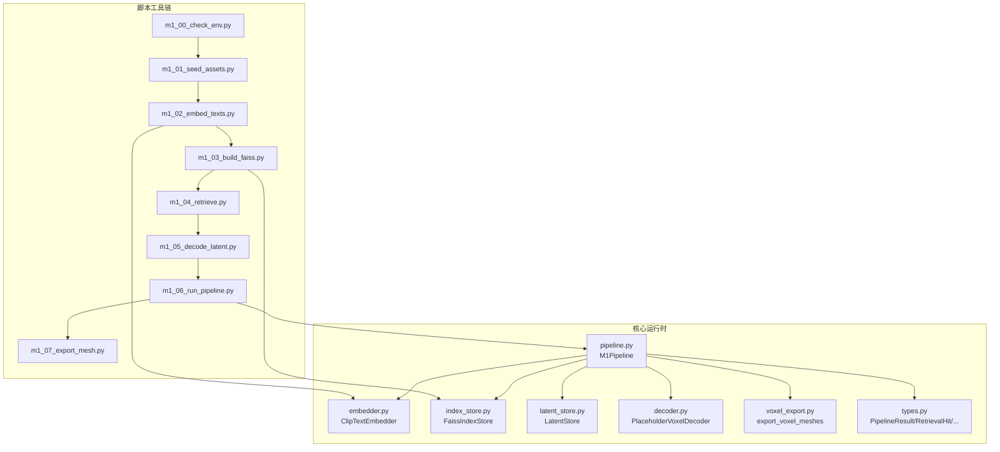
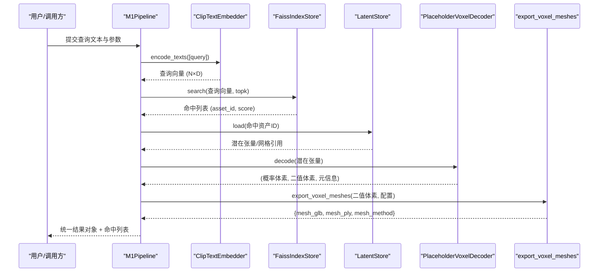
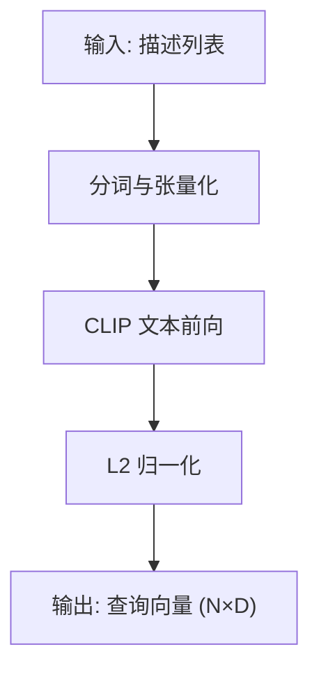
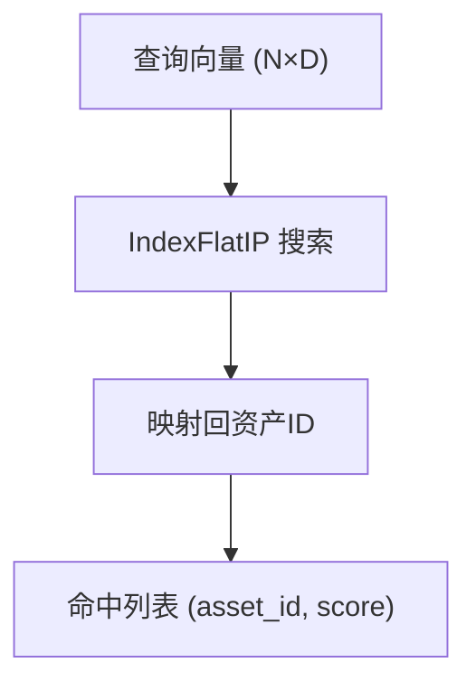
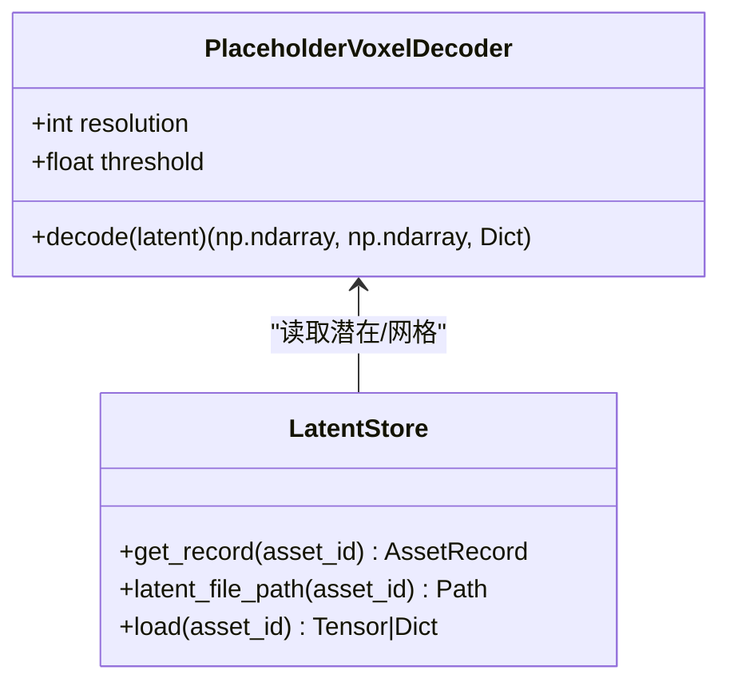
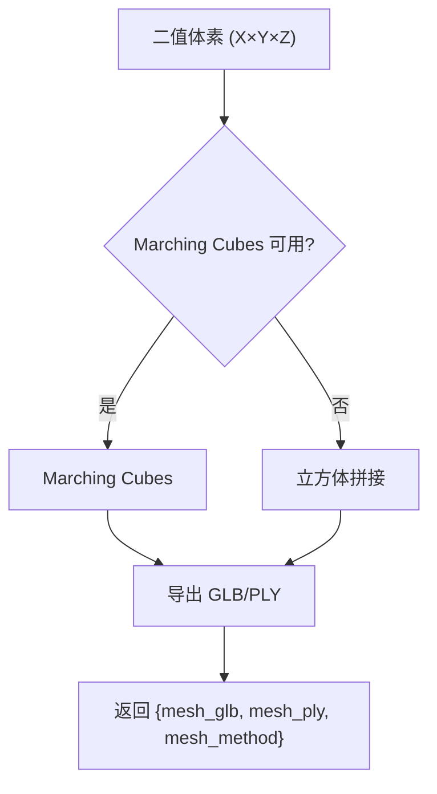
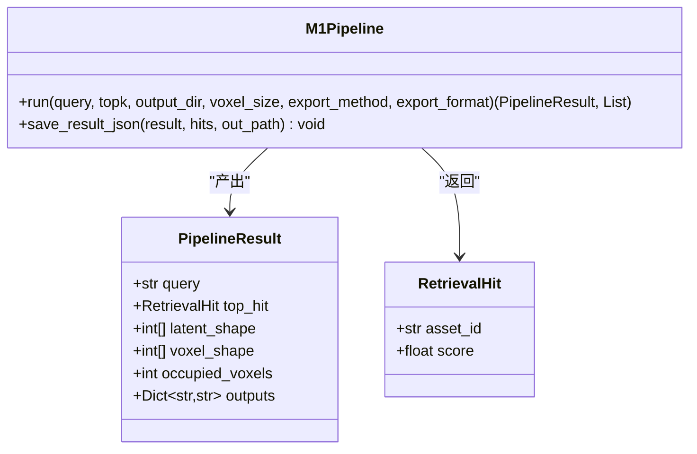
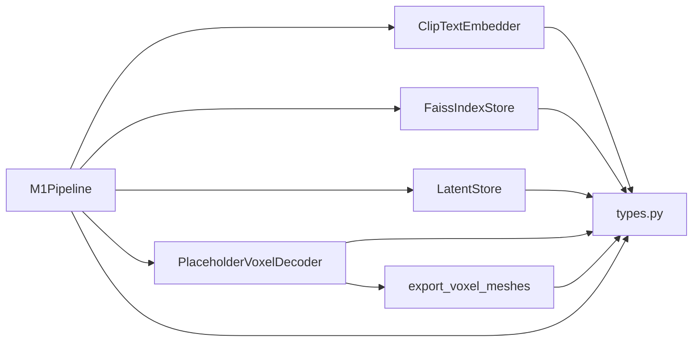

# 数据流架构

<cite>
**本文引用的文件**
- [src/roadgen3d/pipeline.py](file://src/roadgen3d/pipeline.py)
- [src/roadgen3d/embedder.py](file://src/roadgen3d/embedder.py)
- [src/roadgen3d/index_store.py](file://src/roadgen3d/index_store.py)
- [src/roadgen3d/latent_store.py](file://src/roadgen3d/latent_store.py)
- [src/roadgen3d/decoder.py](file://src/roadgen3d/decoder.py)
- [src/roadgen3d/voxel_export.py](file://src/roadgen3d/voxel_export.py)
- [src/roadgen3d/types.py](file://src/roadgen3d/types.py)
- [scripts/m1_00_check_env.py](file://scripts/m1_00_check_env.py)
- [scripts/m1_01_seed_assets.py](file://scripts/m1_01_seed_assets.py)
- [scripts/m1_02_embed_texts.py](file://scripts/m1_02_embed_texts.py)
- [scripts/m1_03_build_faiss.py](file://scripts/m1_03_build_faiss.py)
- [scripts/m1_04_retrieve.py](file://scripts/m1_04_retrieve.py)
- [scripts/m1_05_decode_latent.py](file://scripts/m1_05_decode_latent.py)
- [scripts/m1_06_run_pipeline.py](file://scripts/m1_06_run_pipeline.py)
- [scripts/m1_07_export_mesh.py](file://scripts/m1_07_export_mesh.py)
</cite>

## 目录
1. [引言](#引言)
2. [项目结构](#项目结构)
3. [核心组件](#核心组件)
4. [架构总览](#架构总览)
5. [详细组件分析](#详细组件分析)
6. [依赖关系分析](#依赖关系分析)
7. [性能考量](#性能考量)
8. [故障排查指南](#故障排查指南)
9. [结论](#结论)
10. [附录](#附录)

## 引言
本文档面向 RoadGen3D 的数据流架构，聚焦于从“文本输入”到“最终3D场景输出”的完整数据流程，覆盖以下关键环节：
- 文本预处理与归一化
- CLIP 嵌入生成（文本特征提取）
- FAISS 向量检索（基于余弦相似度的最近邻搜索）
- 潜在空间解码（从潜在向量到体素概率/二值体积）
- 体素网格转换（Marching Cubes 或立方体拼接）
- 中间产物存储与导出（Numpy 数组、GLB/PLY 网格）
- 数据验证规则与错误处理
- 缓存策略与性能优化
- 版本控制与一致性保障

该文档既提供系统级架构视图，也给出关键模块的类图、序列图与流程图，帮助读者快速理解数据在系统中的流转路径。

## 项目结构
本仓库围绕“Milestone-1 文本到3D资产”的端到端流水线组织代码，主要分为三部分：
- 核心运行时模块：位于 src/roadgen3d，包含嵌入器、索引存储、潜在存储、解码器、体素导出、类型定义与主流水线。
- 脚本工具链：位于 scripts/m1_*，提供环境检查、种子数据生成、嵌入计算、索引构建、检索、解码与整线运行等命令行工具。
- 数据与资源：位于 data/ 与 artifacts/，前者存放资产元数据与潜在向量，后者存放中间产物与最终导出。

图表来源
- [scripts/m1_00_check_env.py:1-79](file://scripts/m1_00_check_env.py#L1-L79)
- [scripts/m1_01_seed_assets.py:1-97](file://scripts/m1_01_seed_assets.py#L1-L97)
- [scripts/m1_02_embed_texts.py:1-87](file://scripts/m1_02_embed_texts.py#L1-L87)
- [scripts/m1_03_build_faiss.py:1-50](file://scripts/m1_03_build_faiss.py#L1-L50)
- [scripts/m1_04_retrieve.py:1-71](file://scripts/m1_04_retrieve.py#L1-L71)
- [scripts/m1_05_decode_latent.py:1-72](file://scripts/m1_05_decode_latent.py#L1-L72)
- [scripts/m1_06_run_pipeline.py:1-107](file://scripts/m1_06_run_pipeline.py#L1-L107)
- [scripts/m1_07_export_mesh.py:1-64](file://scripts/m1_07_export_mesh.py#L1-L64)
- [src/roadgen3d/pipeline.py:1-133](file://src/roadgen3d/pipeline.py#L1-L133)
- [src/roadgen3d/embedder.py:1-100](file://src/roadgen3d/embedder.py#L1-L100)
- [src/roadgen3d/index_store.py:1-96](file://src/roadgen3d/index_store.py#L1-L96)
- [src/roadgen3d/latent_store.py:1-81](file://src/roadgen3d/latent_store.py#L1-L81)
- [src/roadgen3d/decoder.py:1-65](file://src/roadgen3d/decoder.py#L1-L65)
- [src/roadgen3d/voxel_export.py:1-142](file://src/roadgen3d/voxel_export.py#L1-L142)
- [src/roadgen3d/types.py:1-120](file://src/roadgen3d/types.py#L1-L120)

章节来源
- [scripts/m1_00_check_env.py:1-79](file://scripts/m1_00_check_env.py#L1-L79)
- [scripts/m1_01_seed_assets.py:1-97](file://scripts/m1_01_seed_assets.py#L1-L97)
- [scripts/m1_02_embed_texts.py:1-87](file://scripts/m1_02_embed_texts.py#L1-L87)
- [scripts/m1_03_build_faiss.py:1-50](file://scripts/m1_03_build_faiss.py#L1-L50)
- [scripts/m1_04_retrieve.py:1-71](file://scripts/m1_04_retrieve.py#L1-L71)
- [scripts/m1_05_decode_latent.py:1-72](file://scripts/m1_05_decode_latent.py#L1-L72)
- [scripts/m1_06_run_pipeline.py:1-107](file://scripts/m1_06_run_pipeline.py#L1-L107)
- [scripts/m1_07_export_mesh.py:1-64](file://scripts/m1_07_export_mesh.py#L1-L64)
- [src/roadgen3d/pipeline.py:1-133](file://src/roadgen3d/pipeline.py#L1-L133)
- [src/roadgen3d/embedder.py:1-100](file://src/roadgen3d/embedder.py#L1-L100)
- [src/roadgen3d/index_store.py:1-96](file://src/roadgen3d/index_store.py#L1-L96)
- [src/roadgen3d/latent_store.py:1-81](file://src/roadgen3d/latent_store.py#L1-L81)
- [src/roadgen3d/decoder.py:1-65](file://src/roadgen3d/decoder.py#L1-L65)
- [src/roadgen3d/voxel_export.py:1-142](file://src/roadgen3d/voxel_export.py#L1-L142)
- [src/roadgen3d/types.py:1-120](file://src/roadgen3d/types.py#L1-L120)

## 核心组件
- 文本嵌入器（ClipTextEmbedder）：负责将文本描述编码为标准化的 CLIP 文本特征向量。
- FAISS 索引存储（FaissIndexStore）：持久化保存向量索引与资产 ID 映射，支持 top-k 搜索。
- 潜在存储（LatentStore）：根据资产 ID 解析并加载潜在张量或参考网格路径。
- 解码器（PlaceholderVoxelDecoder）：将潜在向量映射为体素概率与二值体积，并返回元信息。
- 体素导出（export_voxel_meshes）：将二值体素转换为 GLB/PLY 网格，支持 Marching Cubes 与立方体拼接两种方法。
- 主流水线（M1Pipeline）：编排查询嵌入、检索、解码与网格导出，产出统一结果对象与命中列表。
- 类型定义（types.py）：定义 PipelineResult、RetrievalHit 等数据契约，确保跨模块数据一致性。

章节来源
- [src/roadgen3d/embedder.py:33-100](file://src/roadgen3d/embedder.py#L33-L100)
- [src/roadgen3d/index_store.py:33-96](file://src/roadgen3d/index_store.py#L33-L96)
- [src/roadgen3d/latent_store.py:35-81](file://src/roadgen3d/latent_store.py#L35-L81)
- [src/roadgen3d/decoder.py:24-65](file://src/roadgen3d/decoder.py#L24-L65)
- [src/roadgen3d/voxel_export.py:79-142](file://src/roadgen3d/voxel_export.py#L79-L142)
- [src/roadgen3d/pipeline.py:30-133](file://src/roadgen3d/pipeline.py#L30-L133)
- [src/roadgen3d/types.py:12-44](file://src/roadgen3d/types.py#L12-L44)

## 架构总览
下图展示了从文本输入到最终网格输出的端到端数据流，包括数据格式变化、中间产物与导出位置：

图表来源
- [src/roadgen3d/pipeline.py:39-125](file://src/roadgen3d/pipeline.py#L39-L125)
- [src/roadgen3d/embedder.py:84-99](file://src/roadgen3d/embedder.py#L84-L99)
- [src/roadgen3d/index_store.py:79-95](file://src/roadgen3d/index_store.py#L79-L95)
- [src/roadgen3d/latent_store.py:57-80](file://src/roadgen3d/latent_store.py#L57-L80)
- [src/roadgen3d/decoder.py:40-64](file://src/roadgen3d/decoder.py#L40-L64)
- [src/roadgen3d/voxel_export.py:79-140](file://src/roadgen3d/voxel_export.py#L79-L140)

## 详细组件分析

### 文本预处理与 CLIP 嵌入
- 输入：文本描述序列（通常来自资产元数据）。
- 处理：使用 CLIP 文本编码器进行分词、前向推理与 L2 归一化；输出为 N×D 的浮点矩阵。
- 设备与模型：自动解析设备后端与具体设备，支持 CPU/GPU；模型来源可本地或远程。
- 输出：查询向量用于后续检索。

图表来源
- [src/roadgen3d/embedder.py:84-99](file://src/roadgen3d/embedder.py#L84-L99)

章节来源
- [src/roadgen3d/embedder.py:1-100](file://src/roadgen3d/embedder.py#L1-L100)

### FAISS 向量检索
- 输入：N×D 查询向量、已构建的 IndexFlatIP 索引与资产 ID 映射。
- 处理：执行 top-k 搜索，返回按分数排序的命中列表。
- 存储：索引与 ID 映射分别持久化为 .faiss 与 JSON 文件。
- 输出：资产 ID 与相似度分数。

图表来源
- [src/roadgen3d/index_store.py:79-95](file://src/roadgen3d/index_store.py#L79-L95)
- [src/roadgen3d/index_store.py:54-74](file://src/roadgen3d/index_store.py#L54-L74)

章节来源
- [src/roadgen3d/index_store.py:1-96](file://src/roadgen3d/index_store.py#L1-L96)

### 潜在空间解码
- 输入：由 LatentStore 加载的潜在张量或网格引用。
- 处理：PlaceholderVoxelDecoder 将潜在向量映射为三维体素体积（概率与二值），并返回解码器元信息。
- 输出：概率体素、二值体素与元信息字典（包含解码器名称、分辨率、阈值等）。

图表来源
- [src/roadgen3d/decoder.py:24-65](file://src/roadgen3d/decoder.py#L24-L65)
- [src/roadgen3d/latent_store.py:35-81](file://src/roadgen3d/latent_store.py#L35-L81)

章节来源
- [src/roadgen3d/decoder.py:1-65](file://src/roadgen3d/decoder.py#L1-L65)
- [src/roadgen3d/latent_store.py:1-81](file://src/roadgen3d/latent_store.py#L1-L81)

### 体素网格转换
- 输入：二值体素（三维布尔数组）。
- 处理：优先使用 Marching Cubes 生成平滑网格；若失败则回退到立方体拼接方法。
- 输出：GLB/PLY 网格文件路径与实际使用的导出方法。

图表来源
- [src/roadgen3d/voxel_export.py:79-140](file://src/roadgen3d/voxel_export.py#L79-L140)

章节来源
- [src/roadgen3d/voxel_export.py:1-142](file://src/roadgen3d/voxel_export.py#L1-L142)

### 主流水线与结果聚合
- 输入：查询文本、topk、输出目录、体素尺寸、导出方法与格式。
- 处理：校验索引非空、执行嵌入、检索、解码、导出网格；收集解码器元信息与导出错误。
- 输出：统一结果对象（包含查询、命中、潜向量形状、体素形状、占用体素数、输出文件路径等）与命中列表。

图表来源
- [src/roadgen3d/pipeline.py:30-133](file://src/roadgen3d/pipeline.py#L30-L133)
- [src/roadgen3d/types.py:21-44](file://src/roadgen3d/types.py#L21-L44)

章节来源
- [src/roadgen3d/pipeline.py:1-133](file://src/roadgen3d/pipeline.py#L1-L133)
- [src/roadgen3d/types.py:12-44](file://src/roadgen3d/types.py#L12-L44)

## 依赖关系分析
- 组件耦合：M1Pipeline 通过接口契约依赖嵌入器、索引存储、潜在存储与解码器；解码器与导出模块彼此独立但共同消费二值体素。
- 外部依赖：FAISS（向量检索）、PyTorch（张量运算与模型）、Transformers（CLIP）、scikit-image（Marching Cubes）、trimesh（网格导出）。
- 环境兼容：脚本 m1_00_check_env.py 可生成环境报告，便于诊断缺失包与设备可用性。

图表来源
- [src/roadgen3d/pipeline.py:30-38](file://src/roadgen3d/pipeline.py#L30-L38)
- [src/roadgen3d/embedder.py:33-83](file://src/roadgen3d/embedder.py#L33-L83)
- [src/roadgen3d/index_store.py:33-78](file://src/roadgen3d/index_store.py#L33-L78)
- [src/roadgen3d/latent_store.py:35-60](file://src/roadgen3d/latent_store.py#L35-L60)
- [src/roadgen3d/decoder.py:24-40](file://src/roadgen3d/decoder.py#L24-L40)
- [src/roadgen3d/voxel_export.py:79-105](file://src/roadgen3d/voxel_export.py#L79-L105)
- [src/roadgen3d/types.py:12-44](file://src/roadgen3d/types.py#L12-L44)

章节来源
- [scripts/m1_00_check_env.py:1-79](file://scripts/m1_00_check_env.py#L1-L79)
- [src/roadgen3d/pipeline.py:30-38](file://src/roadgen3d/pipeline.py#L30-L38)
- [src/roadgen3d/embedder.py:33-83](file://src/roadgen3d/embedder.py#L33-L83)
- [src/roadgen3d/index_store.py:33-78](file://src/roadgen3d/index_store.py#L33-L78)
- [src/roadgen3d/latent_store.py:35-60](file://src/roadgen3d/latent_store.py#L35-L60)
- [src/roadgen3d/decoder.py:24-40](file://src/roadgen3d/decoder.py#L24-L40)
- [src/roadgen3d/voxel_export.py:79-105](file://src/roadgen3d/voxel_export.py#L79-L105)
- [src/roadgen3d/types.py:12-44](file://src/roadgen3d/types.py#L12-L44)

## 性能考量
- 设备选择：优先使用 GPU（CUDA/MPS）以加速嵌入与解码；脚本提供设备参数与环境检查。
- 线程与并发：FAISS 索引构建与搜索默认使用单线程，避免与 PyTorch 的 OpenMP 冲突；如需更高吞吐，可在外部批量查询时并行调用。
- 索引规模：FAISS IndexFlatIP 适合中小规模索引；大规模场景建议评估更高效的索引结构（如 IVF/PQ）。
- 导出策略：Marching Cubes 生成更平滑网格，但计算开销较大；立方体拼接更快但几何较粗糙，可作为回退方案。
- I/O 优化：中间产物（嵌入、索引、体素、网格）均以二进制/文本形式持久化，便于快速复用与调试。

## 故障排查指南
- 模型加载失败：CLIP 模型加载异常会抛出明确错误，提示安装 requirements-m1.txt 并检查本地权重文件完整性。
- FAISS 不可用：未安装 FAISS 时会抛出错误；请先安装对应依赖。
- 空索引：运行前检查索引大小；空索引会导致检索失败。
- 无效输入：查询为空、topk 非法、体素尺寸非正、导出格式非法等都会触发校验错误。
- 解码器异常：潜在张量形状不匹配或缺失时会报错；网格导出失败时记录错误到结果元信息。
- 环境诊断：使用 m1_00_check_env.py 生成环境报告，确认包版本与设备可用性。

章节来源
- [src/roadgen3d/embedder.py:43-80](file://src/roadgen3d/embedder.py#L43-L80)
- [src/roadgen3d/index_store.py:21-30](file://src/roadgen3d/index_store.py#L21-L30)
- [src/roadgen3d/pipeline.py:48-62](file://src/roadgen3d/pipeline.py#L48-L62)
- [src/roadgen3d/voxel_export.py:19-38](file://src/roadgen3d/voxel_export.py#L19-L38)

## 结论
本数据流架构以清晰的模块边界与稳定的类型契约串联起文本嵌入、向量检索、潜在解码与网格导出的全流程。通过严格的输入校验、错误捕获与回退策略，系统在易用性与鲁棒性之间取得平衡。配合脚本化的工具链与中间产物持久化，开发者可以高效地迭代与调试各阶段的实现。

## 附录

### 数据格式与中间产物清单
- 文本描述：字符串列表，用于嵌入与检索。
- 嵌入矩阵：N×D 浮点数组，保存为 numpy 文件。
- 资产 ID 列表：JSON 文件，与嵌入矩阵一一对应。
- FAISS 索引：.faiss 文件；ID 映射：JSON 文件。
- 潜在张量：.pt 文件（PyTorch 权重），或包含网格路径的字典。
- 体素体积：概率与二值体素（Numpy 数组）。
- 网格文件：GLB/PLY（可选其一或两者），由导出函数生成。

章节来源
- [scripts/m1_02_embed_texts.py:50-63](file://scripts/m1_02_embed_texts.py#L50-L63)
- [scripts/m1_03_build_faiss.py:32-38](file://scripts/m1_03_build_faiss.py#L32-L38)
- [scripts/m1_05_decode_latent.py:46-59](file://scripts/m1_05_decode_latent.py#L46-L59)
- [scripts/m1_07_export_mesh.py:34-58](file://scripts/m1_07_export_mesh.py#L34-L58)
- [src/roadgen3d/latent_store.py:57-80](file://src/roadgen3d/latent_store.py#L57-L80)
- [src/roadgen3d/voxel_export.py:79-140](file://src/roadgen3d/voxel_export.py#L79-L140)

### 版本控制与一致性保障
- 类型契约：通过 dataclass 定义 PipelineResult、RetrievalHit 等，确保跨模块字段一致。
- 运行时校验：流水线在关键步骤进行输入合法性检查与异常捕获，避免脏数据进入下游。
- 中间产物命名与路径：所有导出文件采用稳定命名与绝对路径，便于追踪与复现。
- 环境报告：提供自动化环境检查脚本，便于在不同机器上保持一致的运行条件。

章节来源
- [src/roadgen3d/types.py:12-44](file://src/roadgen3d/types.py#L12-L44)
- [src/roadgen3d/pipeline.py:48-62](file://src/roadgen3d/pipeline.py#L48-L62)
- [scripts/m1_00_check_env.py:29-59](file://scripts/m1_00_check_env.py#L29-L59)