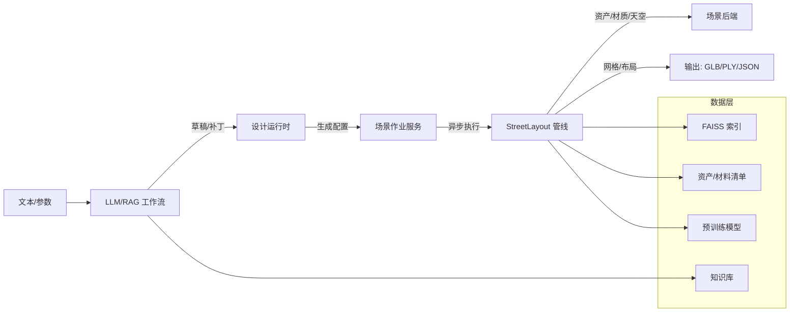
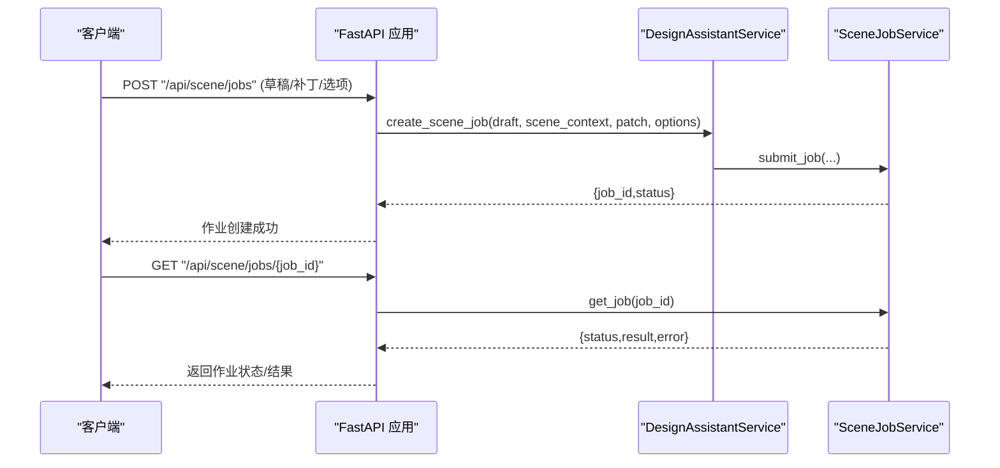
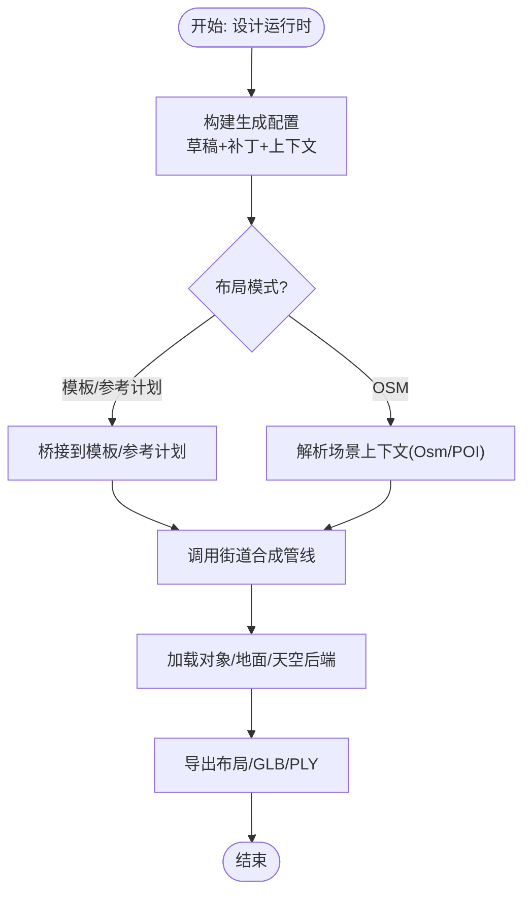
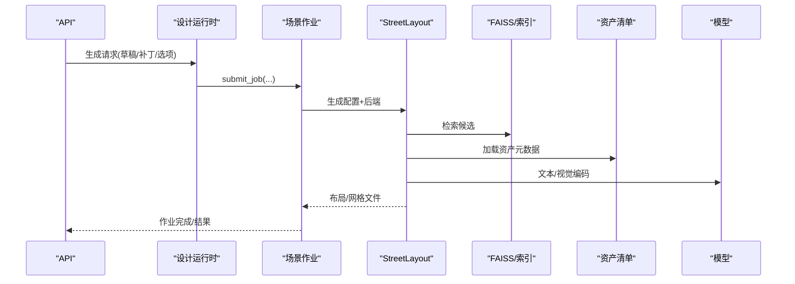
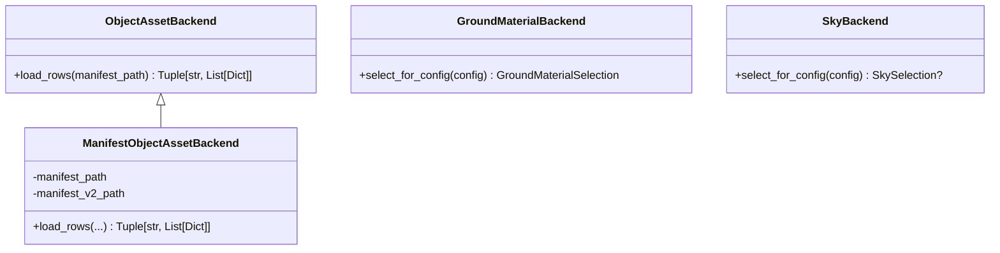
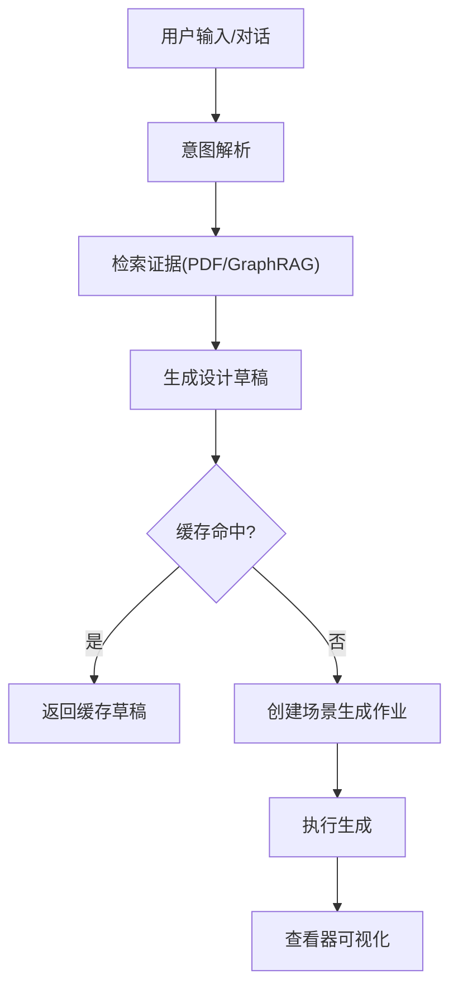
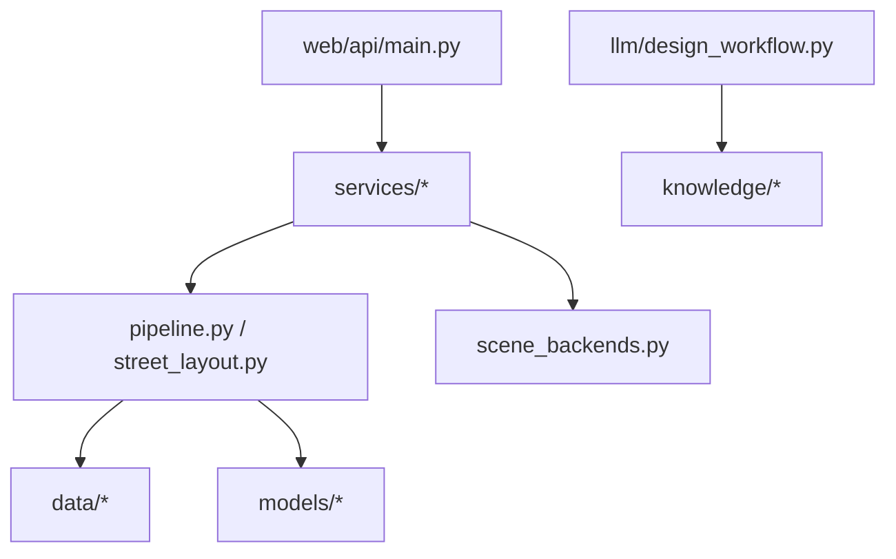

# 整体架构设计

<cite>
**本文引用的文件**
- [README.md](file://README.md)
- [src/roadgen3d/__init__.py](file://src/roadgen3d/__init__.py)
- [web/api/main.py](file://web/api/main.py)
- [ui/api/main.py](file://ui/api/main.py)
- [src/roadgen3d/services/__init__.py](file://src/roadgen3d/services/__init__.py)
- [src/roadgen3d/services/design_runtime.py](file://src/roadgen3d/services/design_runtime.py)
- [src/roadgen3d/services/scene_jobs.py](file://src/roadgen3d/services/scene_jobs.py)
- [src/roadgen3d/services/scene_backends.py](file://src/roadgen3d/services/scene_backends.py)
- [src/roadgen3d/pipeline.py](file://src/roadgen3d/pipeline.py)
- [src/roadgen3d/street_layout.py](file://src/roadgen3d/street_layout.py)
- [src/roadgen3d/llm/design_workflow.py](file://src/roadgen3d/llm/design_workflow.py)
- [docs/current_system_review.md](file://docs/current_system_review.md)
- [docs/architecture_decisions.md](file://docs/architecture_decisions.md)
- [web/viewer/package.json](file://web/viewer/package.json)
- [web/workbench/package.json](file://web/workbench/package.json)
- [requirements-m1.txt](file://requirements-m1.txt)
</cite>

## 目录
1. [引言](#引言)
2. [项目结构](#项目结构)
3. [核心组件](#核心组件)
4. [架构总览](#架构总览)
5. [详细组件分析](#详细组件分析)
6. [依赖分析](#依赖分析)
7. [性能考量](#性能考量)
8. [故障排查指南](#故障排查指南)
9. [结论](#结论)
10. [附录](#附录)

## 引言
本文件系统化阐述 RoadGen3D 的整体架构设计，聚焦其分层架构（数据层→服务层→API层）与“神经符号中间表示 + 管道引擎”的管道模式。系统以“准备 → 生成 → 研究”为主线，结合 OSM/POI 驱动的街道生成、可解释的中间表示（StreetProgram/ConstraintSet/LayoutSolver）、以及资产检索与渲染管线，形成从文本到 3D 场景的端到端工作台。

技术栈选择上，后端采用 Python（FastAPI 提供 API、多模块服务与管线），前端使用 React/Vite（工作台与查看器），推理与视觉基础能力依托 PyTorch/CLIP/FAISS 等。架构决策强调可解释性、可运行性与可扩展性，并通过“总览 + 决策 + 路线图”三件套文档体系支撑演进。

## 项目结构
项目采用“多子系统 + 分层模块”的组织方式：
- web/api：FastAPI 后端入口，提供设计助手与场景作业管理接口
- src/roadgen3d：核心 Python 库，包含管线、服务、场景合成、资产后端、LLM/RAG 工作流等
- web/workbench：React/Vite 工作台前端
- web/viewer：Three.js 场景查看器前端
- data/ 与 models/：资产清单、材料清单、预训练模型等静态资源
- scripts/：里程碑脚本与工具
- knowledge/：知识库构建与检索
- tests/：测试套件

```mermaid
graph TB
subgraph "前端"
WB["Web 工作台<br/>React/Vite"]
VR["Web 查看器<br/>Three.js"]
end
subgraph "后端"
API["FastAPI 应用<br/>web/api/main.py"]
SRV["服务层<br/>design_runtime/scene_jobs/scene_backends"]
PIPE["管线层<br/>M1Pipeline/street_layout"]
LLM["LLM/RAG 工作流<br/>design_workflow.py"]
end
subgraph "数据与资源"
DATA["资产与材料清单<br/>data/*"]
MODELS["预训练模型<br/>models/*"]
KNOW["知识库<br/>knowledge/*"]
end
WB --> API
VR --> API
API --> SRV
SRV --> PIPE
SRV --> LLM
PIPE --> DATA
PIPE --> MODELS
LLM --> KNOW
```

图表来源
- [web/api/main.py:1-286](file://web/api/main.py#L1-L286)
- [src/roadgen3d/services/design_runtime.py:1-397](file://src/roadgen3d/services/design_runtime.py#L1-L397)
- [src/roadgen3d/services/scene_jobs.py:1-205](file://src/roadgen3d/services/scene_jobs.py#L1-L205)
- [src/roadgen3d/services/scene_backends.py:1-527](file://src/roadgen3d/services/scene_backends.py#L1-L527)
- [src/roadgen3d/pipeline.py:1-133](file://src/roadgen3d/pipeline.py#L1-L133)
- [src/roadgen3d/street_layout.py:1-200](file://src/roadgen3d/street_layout.py#L1-L200)
- [src/roadgen3d/llm/design_workflow.py:1-200](file://src/roadgen3d/llm/design_workflow.py#L1-L200)

章节来源
- [README.md:107-130](file://README.md#L107-L130)
- [docs/current_system_review.md:117-134](file://docs/current_system_review.md#L117-L134)

## 核心组件
- Web API 层（FastAPI）
  - 提供健康检查、参考方案与图模板列表、知识库重建与检索、场景作业提交/查询、最近场景列表、场景评估等接口
  - 采用 CORS 中间件，支持跨域访问；请求体使用 Pydantic 模型进行参数校验
- 服务层（DesignRuntime/SceneJobs/SceneBackends）
  - 设计运行时：将确认的设计草稿转换为具体生成配置，解析场景上下文，桥接到不同布局模式（模板/参考计划/OSM），调用场景合成管线
  - 场景作业服务：基于线程池与队列的内存作业队列，支持异步提交、轮询、同步等待与结果回传
  - 场景后端：对象资产、地面材质、天空的清单式后端，支持按查询语义自动选择纹理与材质
- 管道引擎层（M1Pipeline、StreetLayout）
  - M1Pipeline：查询嵌入、FAISS 检索、潜在向量解码、体素网格导出
  - StreetLayout：街道级场景合成，含 POI-aware 横断面合成、布局求解、风格化与纹理、评估指标计算
- 资产管理层（Manifest 后端）
  - 对象资产清单（v1/v2）合并、字段清洗与路径解析；地面材质与天空的评分与选择策略
- 渲染层（Web 查看器）
  - 基于 Three.js 的 3D 场景查看器，配合后端缓存的布局文件进行可视化
- LLM/RAG 工作流
  - 设计意图解析、证据检索（PDF/GraphRAG）、草稿生成、草稿缓存与增量检索、场景生成作业调度

章节来源
- [web/api/main.py:81-267](file://web/api/main.py#L81-L267)
- [src/roadgen3d/services/design_runtime.py:336-397](file://src/roadgen3d/services/design_runtime.py#L336-L397)
- [src/roadgen3d/services/scene_jobs.py:42-205](file://src/roadgen3d/services/scene_jobs.py#L42-L205)
- [src/roadgen3d/services/scene_backends.py:205-527](file://src/roadgen3d/services/scene_backends.py#L205-L527)
- [src/roadgen3d/pipeline.py:30-133](file://src/roadgen3d/pipeline.py#L30-L133)
- [src/roadgen3d/street_layout.py:1-200](file://src/roadgen3d/street_layout.py#L1-L200)
- [src/roadgen3d/llm/design_workflow.py:62-200](file://src/roadgen3d/llm/design_workflow.py#L62-L200)
- [web/viewer/package.json:1-20](file://web/viewer/package.json#L1-L20)

## 架构总览
系统采用“分层 + 管道”的混合架构：
- 分层架构
  - 数据层：资产清单、材料清单、知识库、FAISS 索引、预训练模型
  - 服务层：设计运行时、场景作业、场景后端、管线编排
  - API 层：FastAPI 提供 REST 接口，统一对外暴露能力
- 管道模式
  - M1 单资产流水线（检索→解码→网格导出）
  - M3 多资产街道合成流水线（OSM/POI→横断面合成→StreetProgram→ConstraintSet→LayoutSolver→资产检索与摆放→导出）
  - LLM/RAG 流水线（意图→证据→草稿→生成作业）

图表来源
- [src/roadgen3d/llm/design_workflow.py:112-200](file://src/roadgen3d/llm/design_workflow.py#L112-L200)
- [src/roadgen3d/services/design_runtime.py:336-397](file://src/roadgen3d/services/design_runtime.py#L336-L397)
- [src/roadgen3d/services/scene_jobs.py:138-178](file://src/roadgen3d/services/scene_jobs.py#L138-L178)
- [src/roadgen3d/street_layout.py:1-200](file://src/roadgen3d/street_layout.py#L1-L200)
- [src/roadgen3d/services/scene_backends.py:205-527](file://src/roadgen3d/services/scene_backends.py#L205-L527)

章节来源
- [docs/current_system_review.md:117-134](file://docs/current_system_review.md#L117-L134)
- [docs/architecture_decisions.md:49-74](file://docs/architecture_decisions.md#L49-L74)

## 详细组件分析

### Web API 层（FastAPI）
- 职责
  - 对外提供健康检查、参考计划/图模板管理、知识库重建与检索、场景作业管理、最近场景列表、场景评估等接口
  - 使用 Pydantic 模型进行请求/响应校验，返回 JSON 安全化包装
- 关键交互
  - 设计草稿与生成：POST /api/design/draft → POST /api/design/generate
  - 作业流：POST /api/scene/jobs → GET /api/scene/jobs → GET /api/scene/jobs/{job_id}
  - 知识库：POST /api/knowledge/rebuild → POST /api/knowledge/search
  - 资源：GET /api/reference-plans → GET /api/graph-templates

图表来源
- [web/api/main.py:188-215](file://web/api/main.py#L188-L215)
- [src/roadgen3d/llm/design_workflow.py:112-174](file://src/roadgen3d/llm/design_workflow.py#L112-L174)
- [src/roadgen3d/services/scene_jobs.py:57-101](file://src/roadgen3d/services/scene_jobs.py#L57-L101)

章节来源
- [web/api/main.py:81-267](file://web/api/main.py#L81-L267)
- [ui/api/main.py:1-6](file://ui/api/main.py#L1-L6)

### 服务层（设计运行时、场景作业、场景后端）
- 设计运行时
  - 将草稿与补丁合并为生成配置，解析场景上下文（模板/参考计划/OSM），桥接到不同布局模式
  - 构建对象/地面/天空后端，调用街道合成管线，产出布局与网格文件，并生成查看器 URL
- 场景作业服务
  - 单进程后台工作者，基于队列与条件变量管理作业生命周期（排队→运行→成功/失败）
  - 支持同步等待与超时控制，异常被捕获并回传错误信息
- 场景后端
  - 对象资产：v1/v2 清单合并，字段清洗与路径解析
  - 地面材质：按表面角色与查询语义评分选择材质与纹理
  - 天空：按时间/天气/光照标签评分选择 HDRI

图表来源
- [src/roadgen3d/services/design_runtime.py:60-397](file://src/roadgen3d/services/design_runtime.py#L60-L397)
- [src/roadgen3d/services/scene_jobs.py:42-178](file://src/roadgen3d/services/scene_jobs.py#L42-L178)
- [src/roadgen3d/services/scene_backends.py:205-527](file://src/roadgen3d/services/scene_backends.py#L205-L527)

章节来源
- [src/roadgen3d/services/design_runtime.py:1-397](file://src/roadgen3d/services/design_runtime.py#L1-L397)
- [src/roadgen3d/services/scene_jobs.py:1-205](file://src/roadgen3d/services/scene_jobs.py#L1-L205)
- [src/roadgen3d/services/scene_backends.py:1-527](file://src/roadgen3d/services/scene_backends.py#L1-L527)

### 管道引擎层（M1 与 M3）
- M1 单资产流水线
  - 查询嵌入 → FAISS 检索 → 加载潜在向量 → 解码（Placeholder/Shape-E）→ 体素网格导出 → 输出 GLB/PLY
- M3 多资产街道合成
  - OSM/POI → POI-aware 横断面合成 → StreetProgram → ConstraintSet → LayoutSolver → 资产检索与摆放 → 导出与评估

图表来源
- [src/roadgen3d/pipeline.py:30-133](file://src/roadgen3d/pipeline.py#L30-L133)
- [src/roadgen3d/street_layout.py:1-200](file://src/roadgen3d/street_layout.py#L1-L200)
- [src/roadgen3d/services/design_runtime.py:336-397](file://src/roadgen3d/services/design_runtime.py#L336-L397)

章节来源
- [src/roadgen3d/pipeline.py:1-133](file://src/roadgen3d/pipeline.py#L1-L133)
- [src/roadgen3d/street_layout.py:1-200](file://src/roadgen3d/street_layout.py#L1-L200)

### 资产管理层（清单后端）
- 对象资产后端
  - 支持 v1 与 v2 清单合并，字段清洗与绝对路径解析，自动回退策略
- 地面材质后端
  - 按表面角色与查询语义评分，提供纹理覆盖与数据集来源
- 天空后端
  - 按时间/天气/光照标签评分，选择 HDRI 与预览

图表来源
- [src/roadgen3d/services/scene_backends.py:96-527](file://src/roadgen3d/services/scene_backends.py#L96-L527)

章节来源
- [src/roadgen3d/services/scene_backends.py:1-527](file://src/roadgen3d/services/scene_backends.py#L1-L527)

### 渲染层（Web 查看器）
- 基于 Three.js 的查看器，通过后端缓存的布局文件进行场景可视化
- 前端工程配置包含依赖与构建脚本

章节来源
- [web/viewer/package.json:1-20](file://web/viewer/package.json#L1-L20)

### LLM/RAG 工作流
- 设计意图解析：将对话消息与用户输入转化为设计意图
- 知识检索：支持 PDF RAG 与 GraphRAG，可混合检索
- 草稿生成：结合意图与证据生成设计草稿，支持补丁覆盖与参数追问
- 作业调度：将草稿转换为场景生成作业，支持缓存命中提示

图表来源
- [src/roadgen3d/llm/design_workflow.py:112-200](file://src/roadgen3d/llm/design_workflow.py#L112-L200)

章节来源
- [src/roadgen3d/llm/design_workflow.py:1-200](file://src/roadgen3d/llm/design_workflow.py#L1-L200)

## 依赖分析
- 外部依赖
  - Python 生态：FastAPI、Pydantic、NumPy、PyTorch、transformers、faiss-cpu、pytest
  - 前端生态：React/Vite、Three.js、TypeScript
- 内部耦合
  - API 层依赖服务层；服务层依赖管线层与场景后端；管线层依赖数据与模型；LLM/RAG 依赖知识库与模型
- 潜在风险
  - 作业队列为单进程内存队列，生产扩展需持久化与分布式队列
  - 场景后端对清单格式与路径解析较为敏感，需完善校验与回退

图表来源
- [web/api/main.py:81-267](file://web/api/main.py#L81-L267)
- [src/roadgen3d/services/design_runtime.py:1-397](file://src/roadgen3d/services/design_runtime.py#L1-L397)
- [src/roadgen3d/pipeline.py:1-133](file://src/roadgen3d/pipeline.py#L1-L133)
- [src/roadgen3d/street_layout.py:1-200](file://src/roadgen3d/street_layout.py#L1-L200)
- [src/roadgen3d/services/scene_backends.py:1-527](file://src/roadgen3d/services/scene_backends.py#L1-L527)
- [src/roadgen3d/llm/design_workflow.py:1-200](file://src/roadgen3d/llm/design_workflow.py#L1-L200)

章节来源
- [requirements-m1.txt:1-7](file://requirements-m1.txt#L1-L7)
- [web/workbench/package.json:1-16](file://web/workbench/package.json#L1-L16)
- [web/viewer/package.json:1-20](file://web/viewer/package.json#L1-L20)

## 性能考量
- 异步处理
  - 场景作业采用线程池与队列，避免阻塞 API；适合 CPU 密集型与 I/O 并存的任务
- 检索与解码
  - FAISS 内积检索与 CLIP 文本编码为瓶颈；建议在生产环境使用 GPU 加速与索引优化
- 渲染与导出
  - 体素网格导出与场景拼接为计算密集；建议分批导出与缓存布局文件
- 可扩展性
  - 当前作业队列为单进程内存队列；建议引入消息队列（如 Redis/RabbitMQ）与持久化存储

## 故障排查指南
- 常见问题
  - FAISS 索引为空：检查资产清单与索引构建是否完成
  - 无检索命中：确认查询文本与索引内容匹配度，调整 topk
  - 生成失败：查看作业错误信息，关注布局冲突、POI 锚点丢失、fallback 原因
  - 材质/天空选择异常：检查清单字段完整性与评分逻辑
- 定位方法
  - 通过 /api/scene/jobs/{job_id} 获取作业状态与错误
  - 检查生成配置与场景上下文的 Sanitize 结果
  - 校验资产清单路径与权限

章节来源
- [src/roadgen3d/pipeline.py:56-68](file://src/roadgen3d/pipeline.py#L56-L68)
- [src/roadgen3d/services/scene_jobs.py:162-170](file://src/roadgen3d/services/scene_jobs.py#L162-L170)
- [src/roadgen3d/services/scene_backends.py:319-350](file://src/roadgen3d/services/scene_backends.py#L319-L350)

## 结论
RoadGen3D 以“可解释的中间表示 + 管道引擎”为核心，结合 LLM/RAG 与 OSM/POI 驱动，构建了从文本到 3D 街道场景的完整工作台。分层架构确保职责清晰，管道模式保证流程可扩展。未来可在作业队列持久化、GPU 加速、知识库与资产清单治理等方面进一步增强。

## 附录
- 系统边界与外部依赖
  - 系统边界：数据与环境准备、街道生成与场景导出、研究与训练回放
  - 外部依赖：FAISS、PyTorch、transformers、Three.js、GraphRAG/PDF RAG
- 技术栈选择理由
  - Python + FastAPI：高开发效率与生态成熟，适合快速迭代
  - React/Vite：现代前端开发体验，便于工作台与查看器迭代
  - PyTorch：深度学习推理与训练统一，便于集成 CLIP/Shape-E 等模型

章节来源
- [docs/current_system_review.md:1-226](file://docs/current_system_review.md#L1-L226)
- [docs/architecture_decisions.md:1-255](file://docs/architecture_decisions.md#L1-L255)
- [README.md:132-157](file://README.md#L132-L157)