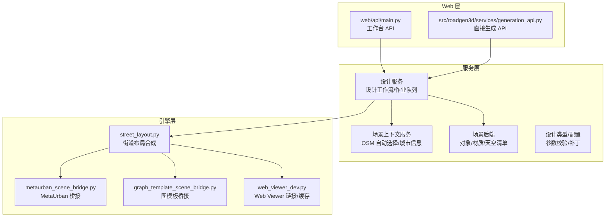
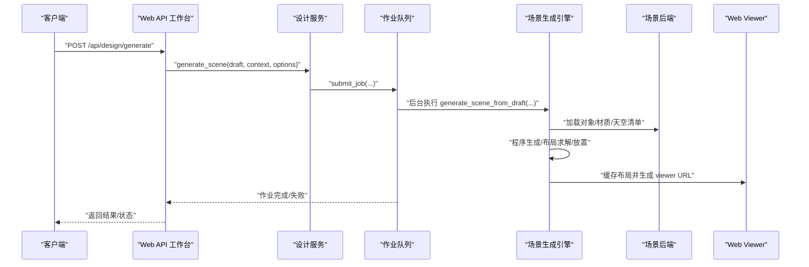
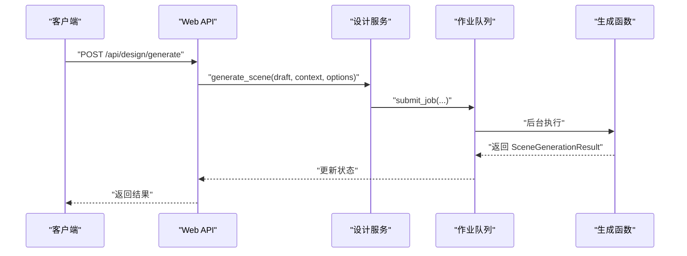
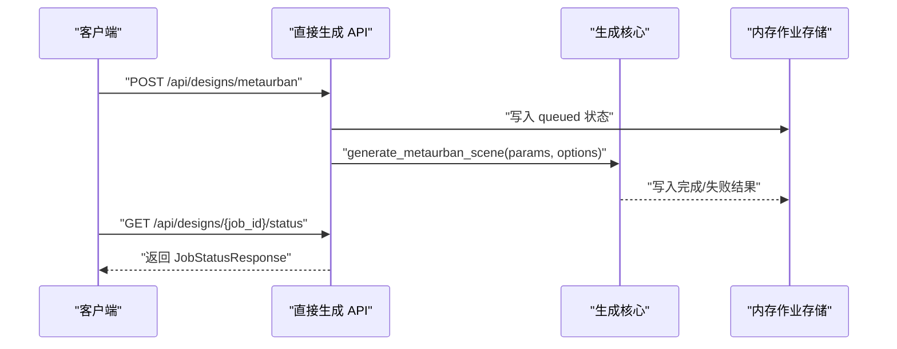
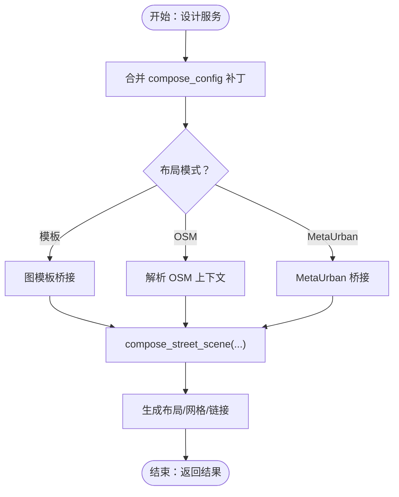
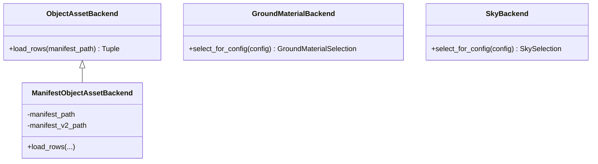
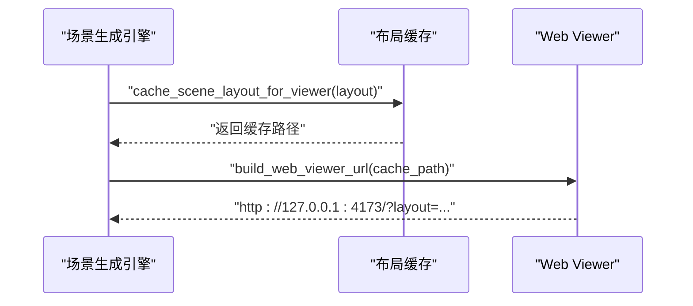
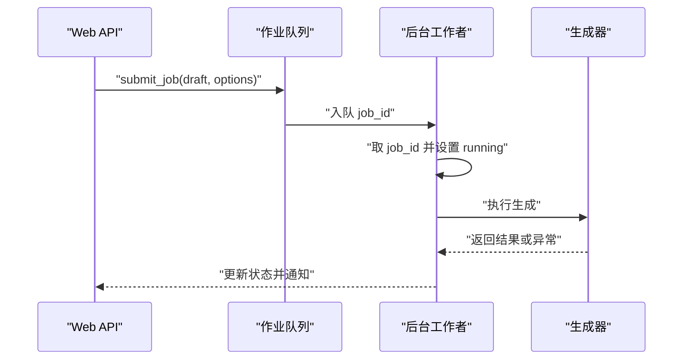
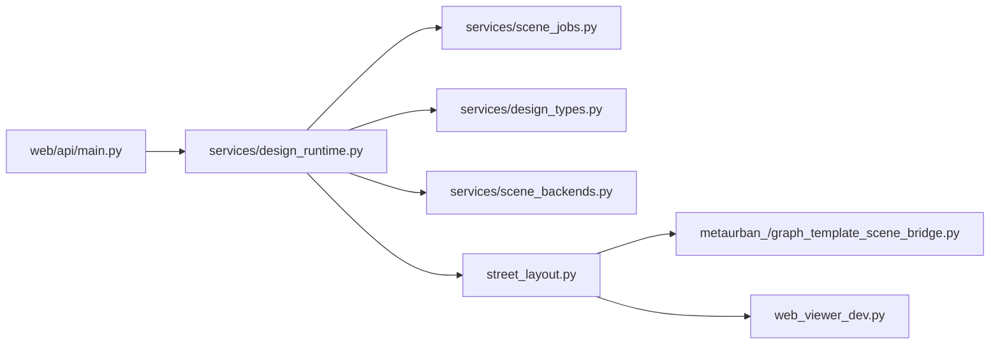

# 核心组件交互

<cite>
**本文档引用的文件**
- [web/api/main.py](file://web/api/main.py)
- [src/roadgen3d/services/generation_api.py](file://src/roadgen3d/services/generation_api.py)
- [src/roadgen3d/services/design_runtime.py](file://src/roadgen3d/services/design_runtime.py)
- [src/roadgen3d/services/generation_core.py](file://src/roadgen3d/services/generation_core.py)
- [src/roadgen3d/services/scene_jobs.py](file://src/roadgen3d/services/scene_jobs.py)
- [src/roadgen3d/services/scene_backends.py](file://src/roadgen3d/services/scene_backends.py)
- [src/roadgen3d/services/scene_context_service.py](file://src/roadgen3d/services/scene_context_service.py)
- [src/roadgen3d/services/design_types.py](file://src/roadgen3d/services/design_types.py)
- [src/roadgen3d/street_layout.py](file://src/roadgen3d/street_layout.py)
- [src/roadgen3d/types.py](file://src/roadgen3d/types.py)
- [src/roadgen3d/web_viewer_dev.py](file://src/roadgen3d/web_viewer_dev.py)
- [src/roadgen3d/metaurban_scene_bridge.py](file://src/roadgen3d/metaurban_scene_bridge.py)
- [src/roadgen3d/graph_template_scene_bridge.py](file://src/roadgen3d/graph_template_scene_bridge.py)
</cite>

## 目录
1. [引言](#引言)
2. [项目结构](#项目结构)
3. [核心组件](#核心组件)
4. [架构总览](#架构总览)
5. [详细组件分析](#详细组件分析)
6. [依赖关系分析](#依赖关系分析)
7. [性能考虑](#性能考虑)
8. [故障排除指南](#故障排除指南)
9. [结论](#结论)

## 引言
本文件面向 RoadGen3D 的核心组件交互，系统性梳理 Web API、设计服务、场景生成流水线、资产存储与渲染系统的协作关系。重点覆盖：
- Web API 与设计服务的通信协议与数据流
- 设计服务与场景生成引擎的协调机制
- 场景生成引擎与资产存储（对象/材质/天空）的交互
- 渲染系统与前端 Web Viewer 的连接方式
- 接口定义、数据传递格式、错误处理与生命周期管理
- 异步任务队列与后台工作流
- 组件解耦策略与依赖注入模式

## 项目结构
RoadGen3D 的核心由三层构成：
- Web 层：提供 REST API 入口，分别服务于工作台与直接场景生成
- 服务层：封装设计工作流、作业队列、上下文解析与运行时配置
- 引擎层：执行街道布局合成、放置策略、渲染与导出

**图表来源**
- [web/api/main.py:1-286](file://web/api/main.py#L1-L286)
- [src/roadgen3d/services/generation_api.py:1-294](file://src/roadgen3d/services/generation_api.py#L1-L294)
- [src/roadgen3d/services/design_runtime.py:1-397](file://src/roadgen3d/services/design_runtime.py#L1-L397)
- [src/roadgen3d/services/scene_jobs.py:1-205](file://src/roadgen3d/services/scene_jobs.py#L1-L205)
- [src/roadgen3d/services/scene_context_service.py:1-332](file://src/roadgen3d/services/scene_context_service.py#L1-L332)
- [src/roadgen3d/services/scene_backends.py:1-527](file://src/roadgen3d/services/scene_backends.py#L1-L527)
- [src/roadgen3d/street_layout.py:1-800](file://src/roadgen3d/street_layout.py#L1-L800)
- [src/roadgen3d/metaurban_scene_bridge.py:1-242](file://src/roadgen3d/metaurban_scene_bridge.py#L1-L242)
- [src/roadgen3d/graph_template_scene_bridge.py:1-67](file://src/roadgen3d/graph_template_scene_bridge.py#L1-L67)
- [src/roadgen3d/web_viewer_dev.py:1-307](file://src/roadgen3d/web_viewer_dev.py#L1-L307)

**章节来源**
- [web/api/main.py:1-286](file://web/api/main.py#L1-L286)
- [src/roadgen3d/services/generation_api.py:1-294](file://src/roadgen3d/services/generation_api.py#L1-L294)
- [src/roadgen3d/services/design_runtime.py:1-397](file://src/roadgen3d/services/design_runtime.py#L1-L397)
- [src/roadgen3d/services/scene_jobs.py:1-205](file://src/roadgen3d/services/scene_jobs.py#L1-L205)
- [src/roadgen3d/services/scene_context_service.py:1-332](file://src/roadgen3d/services/scene_context_service.py#L1-L332)
- [src/roadgen3d/services/scene_backends.py:1-527](file://src/roadgen3d/services/scene_backends.py#L1-L527)
- [src/roadgen3d/street_layout.py:1-800](file://src/roadgen3d/street_layout.py#L1-L800)
- [src/roadgen3d/metaurban_scene_bridge.py:1-242](file://src/roadgen3d/metaurban_scene_bridge.py#L1-L242)
- [src/roadgen3d/graph_template_scene_bridge.py:1-67](file://src/roadgen3d/graph_template_scene_bridge.py#L1-L67)
- [src/roadgen3d/web_viewer_dev.py:1-307](file://src/roadgen3d/web_viewer_dev.py#L1-L307)

## 核心组件
- Web API（工作台）
  - 路由入口：提供健康检查、知识检索、草稿生成、作业队列等接口
  - 依赖注入：通过应用状态注入设计服务实例
- Web API（直接生成）
  - 提供无需 LLM 的直连场景生成接口，支持 MetaUrban、图模板与占位的 OSM
  - 内置内存作业存储与状态查询
- 设计服务（工作台）
  - 草稿解析、场景生成、作业队列管理、最近场景列表
  - 基于线程池的后台作业执行器
- 场景上下文服务
  - 解析 AOI、城市、自动选择 OSM 道路、POI 评估与缓存
- 场景后端
  - 对象清单（v1/v2）、地面材质清单、天空清单的加载与选择
- 街道布局引擎
  - 程序生成、布局求解、放置策略、网格/空间特征、纹理与美化
- 桥接层
  - MetaUrban 参考计划到道路段图的桥接
  - 图模板到参考注释再到布局桥接
- Web Viewer 集成
  - 场景布局缓存、URL 构建、开发命令生成

**章节来源**
- [web/api/main.py:81-267](file://web/api/main.py#L81-L267)
- [src/roadgen3d/services/generation_api.py:131-290](file://src/roadgen3d/services/generation_api.py#L131-L290)
- [src/roadgen3d/services/design_runtime.py:336-397](file://src/roadgen3d/services/design_runtime.py#L336-L397)
- [src/roadgen3d/services/scene_jobs.py:42-178](file://src/roadgen3d/services/scene_jobs.py#L42-L178)
- [src/roadgen3d/services/scene_context_service.py:279-331](file://src/roadgen3d/services/scene_context_service.py#L279-L331)
- [src/roadgen3d/services/scene_backends.py:205-316](file://src/roadgen3d/services/scene_backends.py#L205-L316)
- [src/roadgen3d/street_layout.py:1-800](file://src/roadgen3d/street_layout.py#L1-L800)
- [src/roadgen3d/metaurban_scene_bridge.py:163-234](file://src/roadgen3d/metaurban_scene_bridge.py#L163-L234)
- [src/roadgen3d/graph_template_scene_bridge.py:28-60](file://src/roadgen3d/graph_template_scene_bridge.py#L28-L60)
- [src/roadgen3d/web_viewer_dev.py:194-276](file://src/roadgen3d/web_viewer_dev.py#L194-L276)

## 架构总览
下图展示了从 Web 请求到最终渲染输出的全链路交互。

**图表来源**
- [web/api/main.py:173-186](file://web/api/main.py#L173-L186)
- [src/roadgen3d/services/design_runtime.py:336-397](file://src/roadgen3d/services/design_runtime.py#L336-L397)
- [src/roadgen3d/services/scene_jobs.py:57-79](file://src/roadgen3d/services/scene_jobs.py#L57-L79)
- [src/roadgen3d/services/scene_jobs.py:144-178](file://src/roadgen3d/services/scene_jobs.py#L144-L178)
- [src/roadgen3d/services/scene_backends.py:205-316](file://src/roadgen3d/services/scene_backends.py#L205-L316)
- [src/roadgen3d/web_viewer_dev.py:194-276](file://src/roadgen3d/web_viewer_dev.py#L194-L276)

## 详细组件分析

### Web API（工作台）与设计服务
- 接口职责
  - 草稿生成：接收对话消息与当前补丁，调用设计服务生成草稿
  - 场景生成：直接调用设计服务进行场景生成
  - 作业管理：提交作业、查询作业、列出最近场景
  - 知识检索：重建知识库、搜索知识源
- 数据模型
  - 请求/响应模型均使用 Pydantic，确保输入校验与序列化安全
- 错误处理
  - LLM 配置/响应错误映射为 503；运行时错误映射为 400；未找到映射为 404
- 依赖注入
  - 应用状态持有设计服务实例，支持外部注入或默认构造

**图表来源**
- [web/api/main.py:173-186](file://web/api/main.py#L173-L186)
- [src/roadgen3d/services/design_runtime.py:336-397](file://src/roadgen3d/services/design_runtime.py#L336-L397)
- [src/roadgen3d/services/scene_jobs.py:57-79](file://src/roadgen3d/services/scene_jobs.py#L57-L79)
- [src/roadgen3d/services/scene_jobs.py:144-178](file://src/roadgen3d/services/scene_jobs.py#L144-L178)

**章节来源**
- [web/api/main.py:81-267](file://web/api/main.py#L81-L267)
- [src/roadgen3d/services/design_runtime.py:336-397](file://src/roadgen3d/services/design_runtime.py#L336-L397)
- [src/roadgen3d/services/scene_jobs.py:42-178](file://src/roadgen3d/services/scene_jobs.py#L42-L178)

### Web API（直接生成）与场景生成核心
- 接口职责
  - 直连生成：MetaUrban、图模板、占位 OSM
  - 状态查询：根据 job_id 查询进度与结果
  - 健康检查：返回服务健康状态
- 当前实现
  - 采用内存作业存储；生成逻辑在当前线程执行（未来计划迁移到任务队列）
- 数据模型
  - 请求体使用 Pydantic 模型进行字段校验与默认值处理
  - 响应体包含 job_id、状态、时间戳与结果载荷

**图表来源**
- [src/roadgen3d/services/generation_api.py:131-290](file://src/roadgen3d/services/generation_api.py#L131-L290)
- [src/roadgen3d/services/generation_core.py:267-343](file://src/roadgen3d/services/generation_core.py#L267-L343)

**章节来源**
- [src/roadgen3d/services/generation_api.py:1-294](file://src/roadgen3d/services/generation_api.py#L1-L294)
- [src/roadgen3d/services/generation_core.py:1-445](file://src/roadgen3d/services/generation_core.py#L1-L445)

### 设计服务与场景生成引擎的协调
- 设计服务
  - 将草稿转换为运行时配置，合并补丁与上下文
  - 选择布局模式（模板/OSM/MetaUrban/图模板），必要时解析 OSM 上下文
  - 调用运行时生成函数，产出场景布局与渲染产物路径
- 场景生成引擎
  - 读取清单，构建对象/材质/天空后端
  - 通过桥接层生成道路段图与投影特征
  - 执行街道布局合成、程序生成、布局求解与放置策略
  - 输出布局 JSON、GLB/Ply，并生成 Web Viewer URL

**图表来源**
- [src/roadgen3d/services/design_runtime.py:60-94](file://src/roadgen3d/services/design_runtime.py#L60-L94)
- [src/roadgen3d/services/design_runtime.py:336-397](file://src/roadgen3d/services/design_runtime.py#L336-L397)
- [src/roadgen3d/services/scene_context_service.py:279-331](file://src/roadgen3d/services/scene_context_service.py#L279-L331)
- [src/roadgen3d/metaurban_scene_bridge.py:163-234](file://src/roadgen3d/metaurban_scene_bridge.py#L163-L234)
- [src/roadgen3d/graph_template_scene_bridge.py:28-60](file://src/roadgen3d/graph_template_scene_bridge.py#L28-L60)
- [src/roadgen3d/street_layout.py:1-800](file://src/roadgen3d/street_layout.py#L1-L800)

**章节来源**
- [src/roadgen3d/services/design_runtime.py:1-397](file://src/roadgen3d/services/design_runtime.py#L1-L397)
- [src/roadgen3d/services/scene_context_service.py:1-332](file://src/roadgen3d/services/scene_context_service.py#L1-L332)
- [src/roadgen3d/metaurban_scene_bridge.py:1-242](file://src/roadgen3d/metaurban_scene_bridge.py#L1-L242)
- [src/roadgen3d/graph_template_scene_bridge.py:1-67](file://src/roadgen3d/graph_template_scene_bridge.py#L1-L67)
- [src/roadgen3d/street_layout.py:1-800](file://src/roadgen3d/street_layout.py#L1-L800)

### 场景生成引擎与资产存储的交互
- 后端抽象
  - 对象资产后端：支持 v1 与 v2 清单叠加
  - 地面材质后端：按表面角色与查询语义评分选择
  - 天空后端：按时间/天气/光照标签评分选择
- 加载与选择
  - 读取 JSONL 清单，解析绝对/相对路径
  - 评分与回退策略保证可用性
- 运行时集成
  - 在生成阶段传入后端实例，驱动候选选择与纹理应用

**图表来源**
- [src/roadgen3d/services/scene_backends.py:96-316](file://src/roadgen3d/services/scene_backends.py#L96-L316)

**章节来源**
- [src/roadgen3d/services/scene_backends.py:1-527](file://src/roadgen3d/services/scene_backends.py#L1-L527)

### 渲染系统与前端的连接
- Web Viewer 集成
  - 缓存场景布局到本地目录，避免跨目录访问
  - 构建 viewer URL，支持本地开发命令与静态资源校验
  - 支持生产步骤清单与默认相机姿态
- 文件与内容类型
  - 自动推断 GLB 等二进制模型 MIME 类型
  - 严格限制 viewer 资产必须位于 dist 目录内

**图表来源**
- [src/roadgen3d/web_viewer_dev.py:194-276](file://src/roadgen3d/web_viewer_dev.py#L194-L276)

**章节来源**
- [src/roadgen3d/web_viewer_dev.py:1-307](file://src/roadgen3d/web_viewer_dev.py#L1-L307)

### 异步处理机制与任务队列管理
- 作业队列
  - 使用线程池与条件变量，支持提交、轮询、等待与批量查询
  - 状态包括 queued/running/succeeded/failed，携带时间戳与错误信息
- 生命周期管理
  - 单线程后台工作者循环消费队列，串行执行生成任务
  - 条件变量用于通知与超时等待，避免忙轮询
- 与 Web API 的配合
  - 工作台 API 通过作业队列实现异步生成与状态查询
  - 直接生成 API 当前为同步阻塞（未来迁移）

**图表来源**
- [src/roadgen3d/services/scene_jobs.py:42-178](file://src/roadgen3d/services/scene_jobs.py#L42-L178)

**章节来源**
- [src/roadgen3d/services/scene_jobs.py:1-205](file://src/roadgen3d/services/scene_jobs.py#L1-L205)

### 组件解耦策略与依赖注入模式
- 解耦策略
  - 通过抽象后端接口隔离清单加载细节
  - 桥接层将不同来源（MetaUrban/图模板/OSM）统一为通用数据结构
  - Web API 仅负责路由与状态，业务逻辑集中在服务层
- 依赖注入
  - Web API 应用状态持有设计服务实例，支持外部注入
  - 生成核心与运行时函数接受可选选项对象，便于测试与替换

**章节来源**
- [web/api/main.py:81-90](file://web/api/main.py#L81-L90)
- [src/roadgen3d/services/generation_core.py:85-134](file://src/roadgen3d/services/generation_core.py#L85-L134)
- [src/roadgen3d/services/design_runtime.py:97-148](file://src/roadgen3d/services/design_runtime.py#L97-L148)

## 依赖关系分析
- 组件耦合
  - 设计服务与作业队列强耦合（通过回调生成器），但对外暴露统一接口
  - 场景生成引擎依赖桥接层与后端抽象，保持对具体来源的低耦合
- 外部依赖
  - trimesh 用于网格处理与归一化
  - shapely 用于几何运算（在布局引擎中使用）
- 循环依赖
  - 未发现循环导入；模块间通过函数调用与数据传递解耦

**图表来源**
- [web/api/main.py:1-286](file://web/api/main.py#L1-L286)
- [src/roadgen3d/services/design_runtime.py:1-397](file://src/roadgen3d/services/design_runtime.py#L1-L397)
- [src/roadgen3d/services/scene_jobs.py:1-205](file://src/roadgen3d/services/scene_jobs.py#L1-L205)
- [src/roadgen3d/services/scene_backends.py:1-527](file://src/roadgen3d/services/scene_backends.py#L1-L527)
- [src/roadgen3d/street_layout.py:1-800](file://src/roadgen3d/street_layout.py#L1-L800)
- [src/roadgen3d/metaurban_scene_bridge.py:1-242](file://src/roadgen3d/metaurban_scene_bridge.py#L1-L242)
- [src/roadgen3d/graph_template_scene_bridge.py:1-67](file://src/roadgen3d/graph_template_scene_bridge.py#L1-L67)
- [src/roadgen3d/web_viewer_dev.py:1-307](file://src/roadgen3d/web_viewer_dev.py#L1-L307)

**章节来源**
- [src/roadgen3d/types.py:1-800](file://src/roadgen3d/types.py#L1-L800)

## 性能考虑
- 网格归一化与缓存
  - 在加载网格时进行 Y 轴归一化，减少后续缩放与碰撞计算开销
  - 布局缓存避免重复序列化与跨目录访问
- 清单加载优化
  - v2 清单与 v1 清单叠加，减少重复扫描
  - 材质与天空评分基于关键词匹配，建议控制查询词长度与复杂度
- 并发与阻塞
  - 作业队列采用单线程工作者，避免共享状态竞争；若需并发，建议引入持久化队列与多进程
- I/O 与磁盘
  - 输出目录与缓存目录建议使用高性能存储，避免频繁小文件写入

## 故障排除指南
- 常见错误与定位
  - LLM 配置/响应错误：映射为 503，检查模型配置与网络
  - 运行时错误：映射为 400，查看作业错误字段
  - 未找到资源：映射为 404，检查路径是否在仓库根目录内
- 日志与诊断
  - 作业状态包含 created_at/started_at/finished_at，便于追踪耗时
  - 布局元数据包含生成器与选择策略，便于复现问题
- 修复建议
  - 确保 Web Viewer 构建产物存在且完整
  - 检查清单文件完整性与路径解析
  - 对于 OSM 模式，确认 AOI 与缓存目录有效

**章节来源**
- [web/api/main.py:167-171](file://web/api/main.py#L167-L171)
- [src/roadgen3d/services/scene_jobs.py:162-170](file://src/roadgen3d/services/scene_jobs.py#L162-L170)
- [src/roadgen3d/web_viewer_dev.py:70-80](file://src/roadgen3d/web_viewer_dev.py#L70-L80)

## 结论
RoadGen3D 的核心组件以清晰的分层与抽象实现了高内聚、低耦合的系统架构。Web API 作为入口负责请求处理与状态管理，设计服务承担业务编排与作业调度，引擎层专注于街道布局与渲染，后端与桥接层提供可扩展的数据来源与格式适配。通过作业队列与异步执行，系统具备良好的可扩展性与可维护性。建议后续在直接生成 API 中引入持久化队列与并发执行，进一步提升吞吐能力与稳定性。