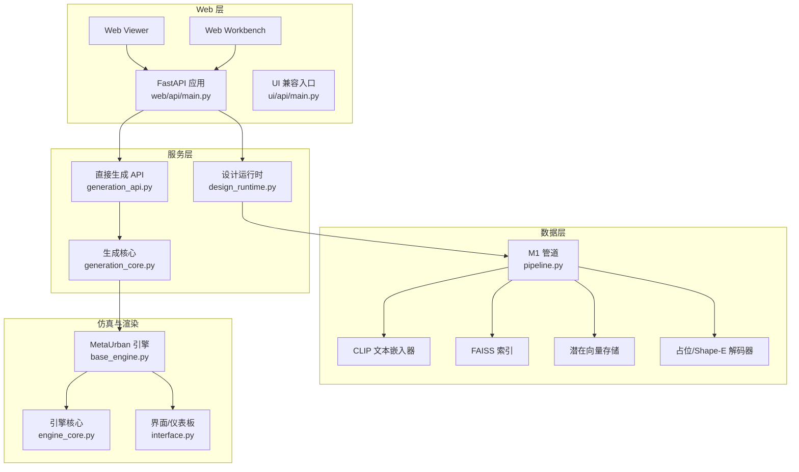
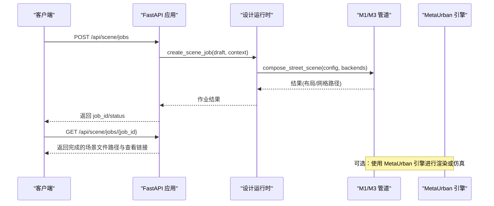
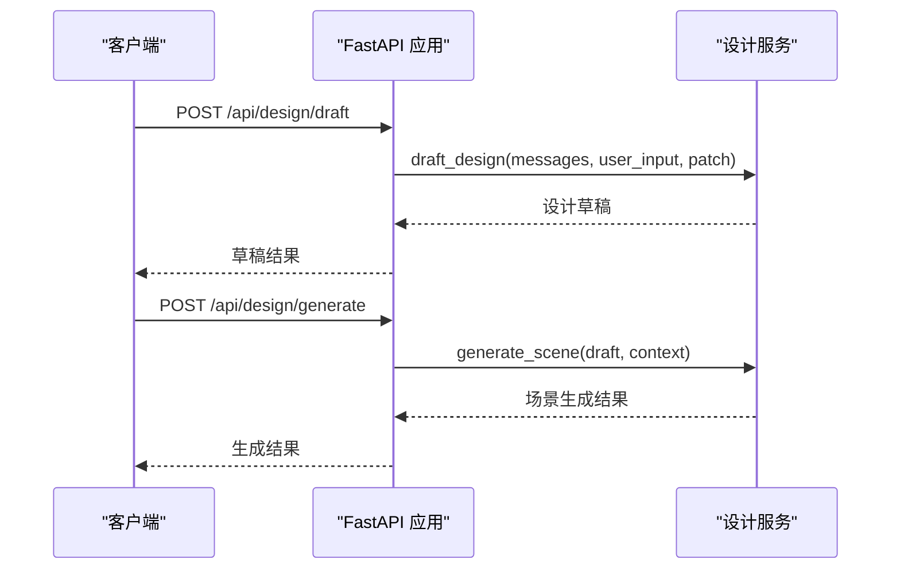
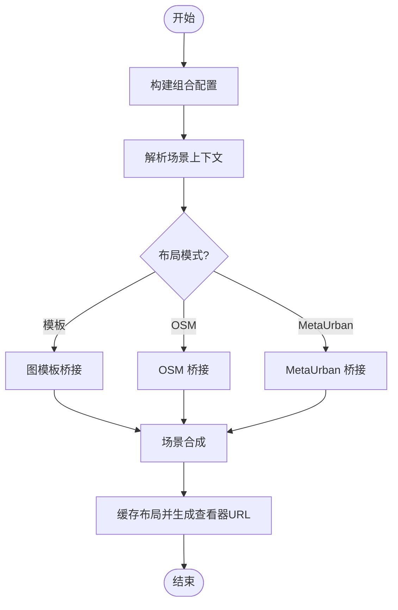
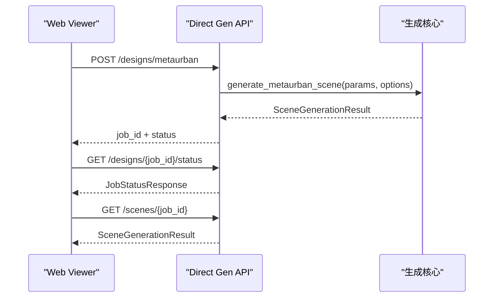
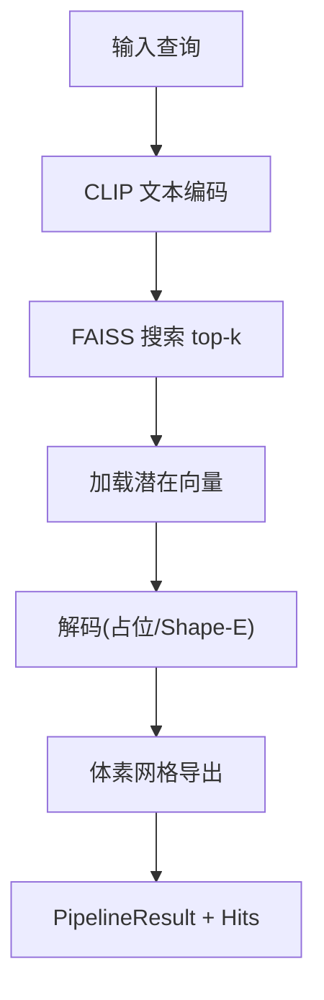
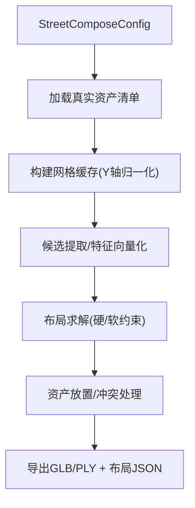
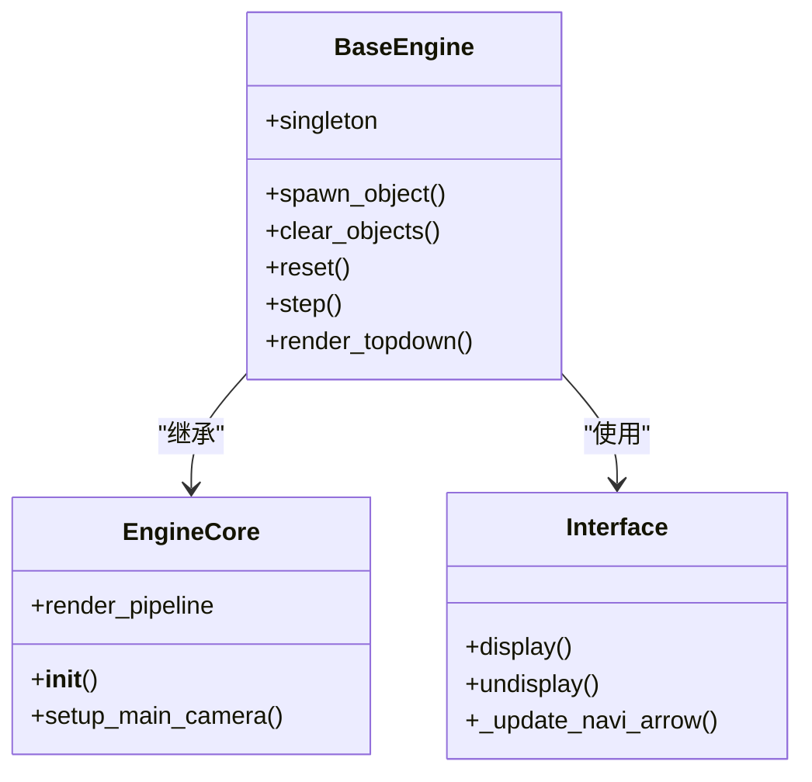
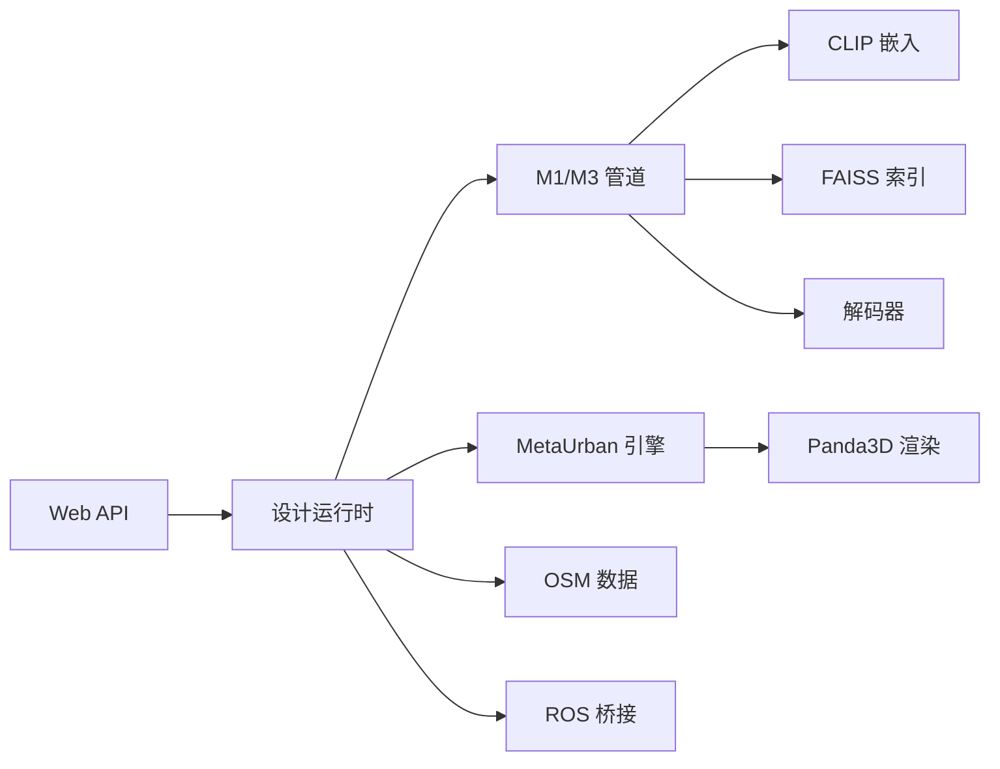
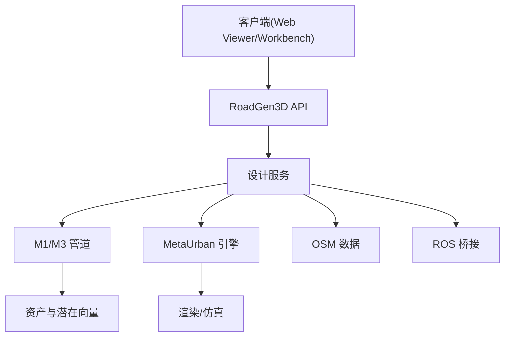

# 系统架构

<cite>
**本文引用的文件**
- [README.md](file://README.md)
- [web/api/main.py](file://web/api/main.py)
- [ui/api/main.py](file://ui/api/main.py)
- [src/roadgen3d/services/generation_api.py](file://src/roadgen3d/services/generation_api.py)
- [src/roadgen3d/services/generation_core.py](file://src/roadgen3d/services/generation_core.py)
- [src/roadgen3d/services/design_runtime.py](file://src/roadgen3d/services/design_runtime.py)
- [src/roadgen3d/pipeline.py](file://src/roadgen3d/pipeline.py)
- [src/roadgen3d/street_layout.py](file://src/roadgen3d/street_layout.py)
- [metaurban/README.md](file://metaurban/README.md)
- [metaurban/metaurban/engine/base_engine.py](file://metaurban/metaurban/engine/base_engine.py)
- [metaurban/metaurban/engine/interface.py](file://metaurban/metaurban/engine/interface.py)
- [metaurban/metaurban/engine/core/engine_core.py](file://metaurban/metaurban/engine/core/engine_core.py)
</cite>

## 目录
1. [引言](#引言)
2. [项目结构](#项目结构)
3. [核心组件](#核心组件)
4. [架构总览](#架构总览)
5. [详细组件分析](#详细组件分析)
6. [依赖分析](#依赖分析)
7. [性能考量](#性能考量)
8. [故障排查指南](#故障排查指南)
9. [结论](#结论)
10. [附录](#附录)

## 引言
本文件面向 RoadGen3D 的系统架构，聚焦于“文本到 3D 街景”的端到端管线，阐述高层设计与架构模式（分层架构与管道模式），并系统化说明 Web API、设计服务、管道引擎、资产与渲染系统的交互关系。文档还覆盖数据流路径（从文本输入到最终 3D 场景输出）、系统边界与集成点（MetaUrban 仿真、ROS 桥接、OSM 数据）、技术决策与权衡、基础设施与可扩展性建议以及部署拓扑。

## 项目结构
RoadGen3D 采用模块化分层组织：
- web/api：FastAPI 入口，提供工作台与 Viewer 的统一 API
- src/roadgen3d：核心 Python 库，包含检索、解码、布局规划、场景合成等能力
- metaurban：外部仿真引擎子模块，提供渲染、物理与传感器接口
- data、models、artifacts：数据与模型资源目录
- web/viewer、web/workbench：前端可视化与工作台
- scripts：里程碑脚本与工具

图表来源
- [web/api/main.py:1-286](file://web/api/main.py#L1-L286)
- [src/roadgen3d/services/design_runtime.py:1-397](file://src/roadgen3d/services/design_runtime.py#L1-L397)
- [src/roadgen3d/services/generation_api.py:1-294](file://src/roadgen3d/services/generation_api.py#L1-L294)
- [src/roadgen3d/services/generation_core.py:1-445](file://src/roadgen3d/services/generation_core.py#L1-L445)
- [src/roadgen3d/pipeline.py:1-133](file://src/roadgen3d/pipeline.py#L1-L133)
- [metaurban/metaurban/engine/base_engine.py:1-800](file://metaurban/metaurban/engine/base_engine.py#L1-L800)
- [metaurban/metaurban/engine/core/engine_core.py:1-200](file://metaurban/metaurban/engine/core/engine_core.py#L1-L200)
- [metaurban/metaurban/engine/interface.py:1-220](file://metaurban/metaurban/engine/interface.py#L1-L220)

章节来源
- [README.md:107-130](file://README.md#L107-L130)
- [web/api/main.py:1-286](file://web/api/main.py#L1-L286)
- [src/roadgen3d/services/design_runtime.py:1-397](file://src/roadgen3d/services/design_runtime.py#L1-L397)

## 核心组件
- Web API 层
  - FastAPI 应用提供健康检查、草稿生成、作业管理、知识检索、场景评估等接口
  - 兼容旧版 UI 入口
- 设计服务层
  - 将确认的设计草稿转换为可执行的场景配置，构建资产后端与输出目录，调用场景合成
- 管道引擎层
  - M1 单体资产管线：文本查询 → CLIP 嵌入 → FAISS 检索 → 潜在向量解码 → 体素网格导出
  - M3 多资产街景管线：布局规划（含设计规则）→ 资产选择与放置 → 导出 GLB/PLY
- 仿真与渲染层
  - MetaUrban 引擎封装 Panda3D，提供渲染、物理、传感器与界面
  - 支持离屏/窗口渲染、相机面板、导航箭头等

章节来源
- [web/api/main.py:81-267](file://web/api/main.py#L81-L267)
- [src/roadgen3d/services/generation_api.py:1-294](file://src/roadgen3d/services/generation_api.py#L1-L294)
- [src/roadgen3d/services/generation_core.py:1-445](file://src/roadgen3d/services/generation_core.py#L1-L445)
- [src/roadgen3d/pipeline.py:30-133](file://src/roadgen3d/pipeline.py#L30-L133)
- [metaurban/metaurban/engine/base_engine.py:38-800](file://metaurban/metaurban/engine/base_engine.py#L38-L800)

## 架构总览
系统采用“分层架构 + 管道模式”：
- 分层架构
  - 数据层：文本嵌入、FAISS 索引、潜在向量存储、解码器
  - 服务层：设计运行时、直接生成 API、生成核心
  - API 层：FastAPI 提供 REST 接口与作业调度
- 管道模式
  - M1：检索-解码-网格导出的单资产流水线
  - M3：程序-约束-求解-布局-导出的多资产流水线
- 集成点
  - MetaUrban 仿真与渲染
  - ROS 桥接（通过 ROS 包与 socket 交互）
  - OSM 数据（POI 约束与路网）

图表来源
- [web/api/main.py:188-215](file://web/api/main.py#L188-L215)
- [src/roadgen3d/services/design_runtime.py:336-397](file://src/roadgen3d/services/design_runtime.py#L336-L397)
- [src/roadgen3d/street_layout.py:1-800](file://src/roadgen3d/street_layout.py#L1-L800)
- [metaurban/metaurban/engine/base_engine.py:38-800](file://metaurban/metaurban/engine/base_engine.py#L38-L800)

## 详细组件分析

### Web API 组件
- 职责
  - 提供健康检查、草稿生成、作业创建/查询、最近场景列表、知识重建与检索、场景评估等接口
  - 支持参考方案与图模板的列举与图片访问
- 关键路由
  - /api/health、/api/scene/jobs、/api/scene/jobs/{job_id}、/api/scenes/recent
  - /api/reference-plans、/api/graph-templates
  - /api/knowledge/rebuild、/api/knowledge/search
  - /api/design/draft、/api/design/generate
- 错误处理
  - 对 LLM/GLM 配置错误、参数错误、运行时异常进行分类处理与返回

图表来源
- [web/api/main.py:156-186](file://web/api/main.py#L156-L186)
- [web/api/main.py:173-186](file://web/api/main.py#L173-L186)

章节来源
- [web/api/main.py:81-267](file://web/api/main.py#L81-L267)
- [ui/api/main.py:1-6](file://ui/api/main.py#L1-L6)

### 设计运行时组件
- 职责
  - 将设计草稿与场景上下文合并为可执行的组合配置
  - 构建对象/地面/天空资产后端
  - 根据布局模式（模板/OSM/MetaUrban）调用场景合成
  - 生成 Web 查看器 URL 并缓存布局
- 关键流程
  - 构建组合配置 → 解析场景上下文 → 选择布局模式 → 调用 compose_street_scene → 产出结果与查看链接

图表来源
- [src/roadgen3d/services/design_runtime.py:60-397](file://src/roadgen3d/services/design_runtime.py#L60-L397)

章节来源
- [src/roadgen3d/services/design_runtime.py:1-397](file://src/roadgen3d/services/design_runtime.py#L1-L397)

### 直接生成 API 组件
- 职责
  - 为 Web Viewer 提供绕过 LLM 的直连生成接口
  - 支持 MetaUrban、图模板与 OSM（占位）三种设计模式
  - 内存作业存储与状态查询
- 关键流程
  - 解析请求参数 → 构造设计参数 → 初始化生成选项 → 调用生成函数 → 更新作业状态

图表来源
- [src/roadgen3d/services/generation_api.py:131-285](file://src/roadgen3d/services/generation_api.py#L131-L285)
- [src/roadgen3d/services/generation_core.py:267-444](file://src/roadgen3d/services/generation_core.py#L267-L444)

章节来源
- [src/roadgen3d/services/generation_api.py:1-294](file://src/roadgen3d/services/generation_api.py#L1-L294)
- [src/roadgen3d/services/generation_core.py:1-445](file://src/roadgen3d/services/generation_core.py#L1-L445)

### M1 管道组件
- 职责
  - 单资产管线：文本查询 → CLIP 嵌入 → FAISS 检索 → 潜在向量解码 → 体素网格导出
- 关键点
  - 输入校验、索引非空检查、解码输出规范化、网格导出方法选择与回退

图表来源
- [src/roadgen3d/pipeline.py:30-133](file://src/roadgen3d/pipeline.py#L30-L133)

章节来源
- [src/roadgen3d/pipeline.py:1-133](file://src/roadgen3d/pipeline.py#L1-L133)

### 场景合成与布局组件
- 职责
  - M3 多资产街景合成：根据组合配置与布局模式，执行候选提取、布局求解、冲突检测、资产放置与网格导出
- 关键点
  - 资产过滤与场景可用性判定、网格缓存与 Y 轴归一化、碰撞与车行道侵入检测、纹理与主题推断

图表来源
- [src/roadgen3d/street_layout.py:1-800](file://src/roadgen3d/street_layout.py#L1-L800)

章节来源
- [src/roadgen3d/street_layout.py:1-800](file://src/roadgen3d/street_layout.py#L1-L800)

### MetaUrban 引擎与渲染
- 职责
  - 基于 Panda3D 的仿真引擎，提供渲染、物理、传感器与界面
  - 支持离屏/窗口渲染、相机面板、导航箭头、仪表盘等
- 关键点
  - 单例引擎、对象生命周期管理、颜色映射、任务管理与热身

图表来源
- [metaurban/metaurban/engine/base_engine.py:38-800](file://metaurban/metaurban/engine/base_engine.py#L38-L800)
- [metaurban/metaurban/engine/core/engine_core.py:81-200](file://metaurban/metaurban/engine/core/engine_core.py#L81-L200)
- [metaurban/metaurban/engine/interface.py:19-220](file://metaurban/metaurban/engine/interface.py#L19-L220)

章节来源
- [metaurban/README.md:1-287](file://metaurban/README.md#L1-L287)
- [metaurban/metaurban/engine/base_engine.py:1-800](file://metaurban/metaurban/engine/base_engine.py#L1-L800)
- [metaurban/metaurban/engine/core/engine_core.py:1-200](file://metaurban/metaurban/engine/core/engine_core.py#L1-L200)
- [metaurban/metaurban/engine/interface.py:1-220](file://metaurban/metaurban/engine/interface.py#L1-L220)

## 依赖分析
- 组件耦合
  - Web API 依赖设计服务；设计服务依赖管道引擎与资产后端；生成核心依赖 MetaUrban 引擎
- 外部依赖
  - CLIP 文本嵌入、FAISS 检索、Panda3D 渲染、MetaUrban 资产与仿真
- 集成点
  - MetaUrban 仿真与渲染：通过引擎接口与渲染管线
  - ROS 桥接：通过 ROS 包与 socket 服务器/客户端交互
  - OSM 数据：POI 约束与路网构建，支持 OSM 模式下的布局

图表来源
- [web/api/main.py:1-286](file://web/api/main.py#L1-L286)
- [src/roadgen3d/services/design_runtime.py:1-397](file://src/roadgen3d/services/design_runtime.py#L1-L397)
- [src/roadgen3d/pipeline.py:1-133](file://src/roadgen3d/pipeline.py#L1-L133)
- [metaurban/metaurban/engine/base_engine.py:1-800](file://metaurban/metaurban/engine/base_engine.py#L1-L800)

章节来源
- [README.md:132-193](file://README.md#L132-L193)
- [metaurban/README.md:1-287](file://metaurban/README.md#L1-L287)

## 性能考量
- 计算与内存
  - M1 管道：FAISS 搜索与网格导出是主要开销；建议使用合适的 top-k 与导出方法
  - M3 合成：网格缓存与布局求解复杂度随候选数与约束增多而上升
- 渲染与仿真
  - MetaUrban 引擎支持离屏渲染与多线程渲染；需平衡帧率与质量
- 存储与 I/O
  - 大型网格与潜在向量需高效读写；建议使用 SSD 与合理的缓存策略
- 可扩展性
  - 通过并行化候选特征计算与布局求解提升吞吐
  - 使用分布式任务队列替代内存作业存储以支持高并发

## 故障排查指南
- 常见问题
  - FAISS 索引为空：确保资产清单与索引构建完成后再运行
  - 解码失败：检查解码器输出格式与网格导出错误信息
  - MetaUrban 资产缺失：首次运行会自动下载，若失败请手动更新
  - LLM/GLM 配置错误：检查环境变量与 API Key
- 定位手段
  - 查看作业状态与错误字段
  - 检查日志与调试模式开关
  - 验证资产清单完整性与路径有效性

章节来源
- [src/roadgen3d/pipeline.py:56-68](file://src/roadgen3d/pipeline.py#L56-L68)
- [src/roadgen3d/services/generation_api.py:102-129](file://src/roadgen3d/services/generation_api.py#L102-L129)
- [metaurban/metaurban/engine/base_engine.py:764-779](file://metaurban/metaurban/engine/base_engine.py#L764-L779)

## 结论
RoadGen3D 通过“分层架构 + 管道模式”实现了从文本到 3D 街景的稳定管线：Web API 提供统一入口与作业管理，设计服务负责将草稿转化为可执行配置，管道引擎承担检索、解码与布局合成，MetaUrban 引擎提供高质量渲染与仿真。系统在 M6 中引入了神经符号化表示（StreetProgram/ConstraintSet/LayoutSolver），提升了设计意图的显式性与可编辑性。当前仍存在 OSM 与学习化管线的扩展空间，后续可通过引入更强大的布局模型与学习化程序生成进一步增强。

## 附录
- 系统上下文图（概念性）

- 部署拓扑建议
  - 开发环境：本地启动 API、Viewer、Workbench，使用本地文件系统与 CPU 设备
  - 生产环境：容器化部署 API 与 Viewer，独立的渲染节点或云渲染服务，分布式任务队列承载高并发作业，MetaUrban 渲染节点按需扩展

- 技术决策与权衡
  - 使用 CLIP 文本嵌入与 FAISS 检索以获得快速、稳定的检索效果
  - 采用神经符号化管线以提升设计规则的可解释性与可控性
  - 优先保证场景可用性与一致性，再逐步引入学习化与扩散模型