# 系统架构

<cite>
**本文档引用的文件**
- [README.md](file://README.md)
- [web/api/main.py](file://web/api/main.py)
- [ui/api/main.py](file://ui/api/main.py)
- [src/roadgen3d/services/generation_api.py](file://src/roadgen3d/services/generation_api.py)
- [src/roadgen3d/services/generation_core.py](file://src/roadgen3d/services/generation_core.py)
- [src/roadgen3d/services/design_runtime.py](file://src/roadgen3d/services/design_runtime.py)
- [src/roadgen3d/pipeline.py](file://src/roadgen3d/pipeline.py)
- [src/roadgen3d/street_layout.py](file://src/roadgen3d/street_layout.py)
- [src/roadgen3d/osm_ingest.py](file://src/roadgen3d/osm_ingest.py)
- [src/roadgen3d/poi_rules.py](file://src/roadgen3d/poi_rules.py)
- [src/roadgen3d/poi_taxonomy.py](file://src/roadgen3d/poi_taxonomy.py)
- [src/roadgen3d/street_program.py](file://src/roadgen3d/street_program.py)
- [src/roadgen3d/layout_solver.py](file://src/roadgen3d/layout_solver.py)
- [src/roadgen3d/layout_policy.py](file://src/roadgen3d/layout_policy.py)
- [src/roadgen3d/osm_segment_graph.py](file://src/roadgen3d/osm_segment_graph.py)
- [scripts/m5_01_fetch_osm.py](file://scripts/m5_01_fetch_osm.py)
- [scripts/m5_02_build_placement_zones.py](file://scripts/m5_02_build_placement_zones.py)
- [scripts/m6_01_collect_program_data.py](file://scripts/m6_01_collect_program_data.py)
- [metaurban/README.md](file://metaurban/README.md)
- [metaurban/metaurban/engine/base_engine.py](file://metaurban/metaurban/engine/base_engine.py)
- [metaurban/metaurban/engine/interface.py](file://metaurban/metaurban/engine/interface.py)
- [metaurban/metaurban/engine/core/engine_core.py](file://metaurban/metaurban/engine/core/engine_core.py)
</cite>

## 更新摘要
**所做更改**
- 新增OSM+POI集成架构章节，详细说明道路网络与兴趣点的融合处理
- 更新神经符号管道章节，涵盖StreetProgram生成、约束求解和布局优化
- 新增学习化布局策略章节，介绍基于深度学习的资产选择策略
- 更新数据流架构图，反映OSM数据处理和POI约束集成
- 新增M5-M6工作流图，展示从OSM获取到程序生成的完整流程
- 更新系统边界和集成点，强调OSM数据源和POI约束引擎

## 目录
1. [引言](#引言)
2. [项目结构](#项目结构)
3. [核心组件](#核心组件)
4. [架构总览](#架构总览)
5. [详细组件分析](#详细组件分析)
6. [OSM+POI集成架构](#osmpoi集成架构)
7. [神经符号管道](#神经符号管道)
8. [学习化布局策略](#学习化布局策略)
9. [数据流架构](#数据流架构)
10. [系统边界与集成点](#系统边界与集成点)
11. [依赖分析](#依赖分析)
12. [性能考量](#性能考量)
13. [故障排查指南](#故障排查指南)
14. [结论](#结论)
15. [附录](#附录)

## 引言
本文件面向 RoadGen3D 的系统架构，聚焦于"文本到 3D 街景"的端到端管线，阐述高层设计与架构模式（分层架构与管道模式），并系统化说明 Web API、设计服务、管道引擎、资产与渲染系统的交互关系。文档还覆盖数据流路径（从文本输入到最终 3D 场景输出）、系统边界与集成点（MetaUrban 仿真、ROS 桥接、OSM 数据）、技术决策与权衡、基础设施与可扩展性建议以及部署拓扑。

**更新** 本版本重点更新了OSM+POI集成架构和神经符号管道的设计原则，反映了最新的架构决策和实现细节。

## 项目结构
RoadGen3D 采用模块化分层组织：
- web/api：FastAPI 入口，提供工作台与 Viewer 的统一 API
- src/roadgen3d：核心 Python 库，包含检索、解码、布局规划、场景合成等能力
- metaurban：外部仿真引擎子模块，提供渲染、物理与传感器接口
- data、models、artifacts：数据与模型资源目录
- web/viewer、web/workbench：前端可视化与工作台
- scripts：里程碑脚本与工具

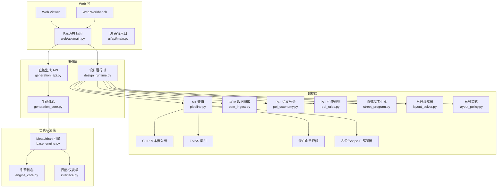

**图表来源**
- [web/api/main.py:1-286](file://web/api/main.py#L1-L286)
- [src/roadgen3d/services/design_runtime.py:1-397](file://src/roadgen3d/services/design_runtime.py#L1-L397)
- [src/roadgen3d/services/generation_api.py:1-294](file://src/roadgen3d/services/generation_api.py#L1-L294)
- [src/roadgen3d/services/generation_core.py:1-445](file://src/roadgen3d/services/generation_core.py#L1-L445)
- [src/roadgen3d/pipeline.py:1-133](file://src/roadgen3d/pipeline.py#L1-L133)
- [src/roadgen3d/osm_ingest.py:1-331](file://src/roadgen3d/osm_ingest.py#L1-L331)
- [src/roadgen3d/poi_taxonomy.py:1-416](file://src/roadgen3d/poi_taxonomy.py#L1-L416)
- [src/roadgen3d/poi_rules.py:1-433](file://src/roadgen3d/poi_rules.py#L1-L433)
- [src/roadgen3d/street_program.py:1-626](file://src/roadgen3d/street_program.py#L1-L626)
- [src/roadgen3d/layout_solver.py:1-200](file://src/roadgen3d/layout_solver.py#L1-L200)
- [src/roadgen3d/layout_policy.py:1-200](file://src/roadgen3d/layout_policy.py#L1-L200)
- [metaurban/metaurban/engine/base_engine.py:1-800](file://metaurban/metaurban/engine/base_engine.py#L1-L800)
- [metaurban/metaurban/engine/core/engine_core.py:1-200](file://metaurban/metaurban/engine/core/engine_core.py#L1-L200)
- [metaurban/metaurban/engine/interface.py:1-220](file://metaurban/metaurban/engine/interface.py#L1-L220)

**章节来源**
- [README.md:107-130](file://README.md#L107-L130)
- [web/api/main.py:1-286](file://web/api/main.py#L1-L286)
- [src/roadgen3d/services/design_runtime.py:1-397](file://src/roadgen3d/services/design_runtime.py#L1-L397)

## 核心组件
- Web API 层
  - FastAPI 应用提供健康检查、草稿生成、作业管理、知识检索、场景评估等接口
  - 兼容旧版 UI 入口
- 设计服务层
  - 将确认的设计草稿转换为可执行的场景配置，构建资产后端与输出目录，调用场景合成
- 管道引擎层
  - M1 单体资产管线：文本查询 → CLIP 嵌入 → FAISS 检索 → 潜在向量解码 → 体素网格导出
  - M3 多资产街景管线：布局规划（含设计规则）→ 资产选择与放置 → 导出 GLB/PLY
  - M5 OSM 数据管线：道路网络获取 → POI 解析 → 空间分区 → 路段图构建
  - M6 程序生成管线：StreetProgram 推断 → 约束求解 → 布局优化 → 学习化策略
- 仿真与渲染层
  - MetaUrban 引擎封装 Panda3D，提供渲染、物理、传感器与界面
  - 支持离屏/窗口渲染、相机面板、导航箭头等

**更新** 新增了M5和M6工作流组件，强化了OSM数据处理和学习化程序生成能力。

**章节来源**
- [web/api/main.py:81-267](file://web/api/main.py#L81-L267)
- [src/roadgen3d/services/generation_api.py:1-294](file://src/roadgen3d/services/generation_api.py#L1-L294)
- [src/roadgen3d/services/generation_core.py:1-445](file://src/roadgen3d/services/generation_core.py#L1-L445)
- [src/roadgen3d/pipeline.py:30-133](file://src/roadgen3d/pipeline.py#L30-L133)
- [src/roadgen3d/osm_ingest.py:1-331](file://src/roadgen3d/osm_ingest.py#L1-L331)
- [src/roadgen3d/street_program.py:1-626](file://src/roadgen3d/street_program.py#L1-L626)
- [src/roadgen3d/layout_solver.py:1-200](file://src/roadgen3d/layout_solver.py#L1-L200)
- [src/roadgen3d/layout_policy.py:1-200](file://src/roadgen3d/layout_policy.py#L1-L200)
- [metaurban/metaurban/engine/base_engine.py:38-800](file://metaurban/metaurban/engine/base_engine.py#L38-L800)

## 架构总览
系统采用"分层架构 + 管道模式"：
- 分层架构
  - 数据层：文本嵌入、FAISS 索引、潜在向量存储、解码器、OSM 数据摄取、POI 语义分类、POI 约束规则
  - 服务层：设计运行时、直接生成 API、生成核心
  - API 层：FastAPI 提供 REST 接口与作业调度
- 管道模式
  - M1：检索-解码-网格导出的单资产流水线
  - M3：程序-约束-求解-布局-导出的多资产流水线
  - M5：OSM 获取-解析-投影-分区的地理数据处理流水线
  - M6：程序生成-约束求解-学习化策略的智能设计流水线
- 集成点
  - MetaUrban 仿真与渲染
  - ROS 桥接（通过 ROS 包与 socket 交互）
  - OSM 数据（POI 约束与路网）

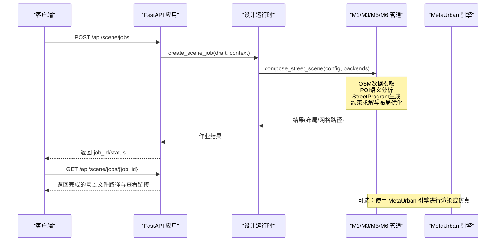

**图表来源**
- [web/api/main.py:188-215](file://web/api/main.py#L188-L215)
- [src/roadgen3d/services/design_runtime.py:336-397](file://src/roadgen3d/services/design_runtime.py#L336-L397)
- [src/roadgen3d/street_layout.py:1-800](file://src/roadgen3d/street_layout.py#L1-L800)
- [metaurban/metaurban/engine/base_engine.py:38-800](file://metaurban/metaurban/engine/base_engine.py#L38-L800)

## 详细组件分析

### Web API 组件
- 职责
  - 提供健康检查、草稿生成、作业创建/查询、最近场景列表、知识重建与检索、场景评估等接口
  - 支持参考方案与图模板的列举与图片访问
- 关键路由
  - /api/health、/api/scene/jobs、/api/scene/jobs/{job_id}、/api/scenes/recent
  - /api/reference-plans、/api/graph-templates
  - /api/knowledge/rebuild、/api/knowledge/search
  - /api/design/draft、/api/design/generate
- 错误处理
  - 对 LLM/GLM 配置错误、参数错误、运行时异常进行分类处理与返回

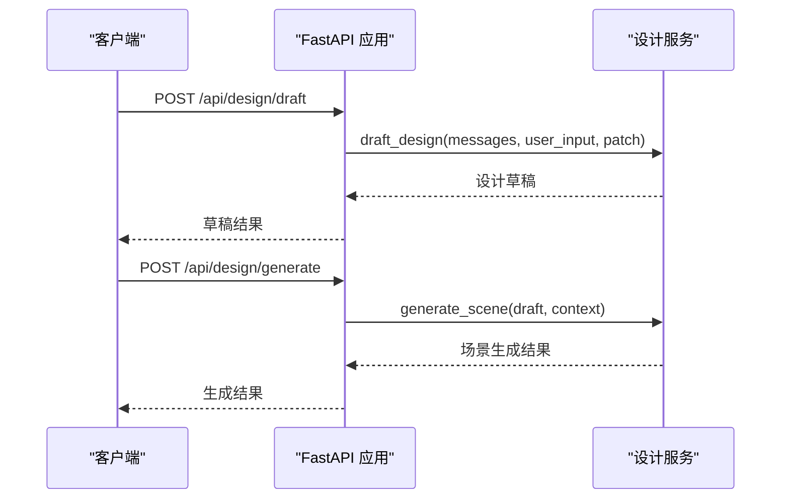

**图表来源**
- [web/api/main.py:156-186](file://web/api/main.py#L156-L186)
- [web/api/main.py:173-186](file://web/api/main.py#L173-L186)

**章节来源**
- [web/api/main.py:81-267](file://web/api/main.py#L81-L267)
- [ui/api/main.py:1-6](file://ui/api/main.py#L1-L6)

### 设计运行时组件
- 职责
  - 将设计草稿与场景上下文合并为可执行的组合配置
  - 构建对象/地面/天空资产后端
  - 根据布局模式（模板/OSM/MetaUrban）调用场景合成
  - 生成 Web 查看器 URL 并缓存布局
- 关键流程
  - 构建组合配置 → 解析场景上下文 → 选择布局模式 → 调用 compose_street_scene → 产出结果与查看链接

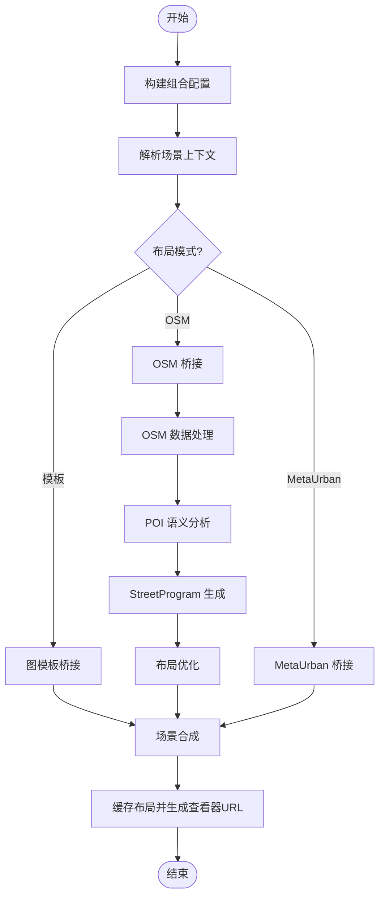

**图表来源**
- [src/roadgen3d/services/design_runtime.py:60-397](file://src/roadgen3d/services/design_runtime.py#L60-L397)

**章节来源**
- [src/roadgen3d/services/design_runtime.py:1-397](file://src/roadgen3d/services/design_runtime.py#L1-L397)

### 直接生成 API 组件
- 职责
  - 为 Web Viewer 提供绕过 LLM 的直连生成接口
  - 支持 MetaUrban、图模板与 OSM（占位）三种设计模式
  - 内存作业存储与状态查询
- 关键流程
  - 解析请求参数 → 构造设计参数 → 初始化生成选项 → 调用生成函数 → 更新作业状态

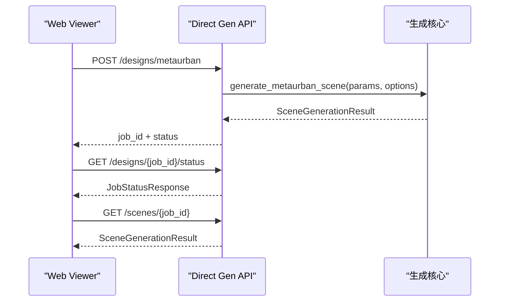

**图表来源**
- [src/roadgen3d/services/generation_api.py:131-285](file://src/roadgen3d/services/generation_api.py#L131-L285)
- [src/roadgen3d/services/generation_core.py:267-444](file://src/roadgen3d/services/generation_core.py#L267-L444)

**章节来源**
- [src/roadgen3d/services/generation_api.py:1-294](file://src/roadgen3d/services/generation_api.py#L1-L294)
- [src/roadgen3d/services/generation_core.py:1-445](file://src/roadgen3d/services/generation_core.py#L1-L445)

### M1 管道组件
- 职责
  - 单资产管线：文本查询 → CLIP 嵌入 → FAISS 检索 → 潜在向量解码 → 体素网格导出
- 关键点
  - 输入校验、索引非空检查、解码输出规范化、网格导出方法选择与回退

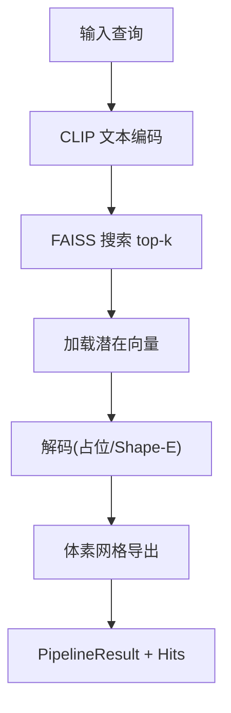

**图表来源**
- [src/roadgen3d/pipeline.py:30-133](file://src/roadgen3d/pipeline.py#L30-L133)

**章节来源**
- [src/roadgen3d/pipeline.py:1-133](file://src/roadgen3d/pipeline.py#L1-L133)

### 场景合成与布局组件
- 职责
  - M3 多资产街景合成：根据组合配置与布局模式，执行候选提取、布局求解、冲突检测、资产放置与网格导出
- 关键点
  - 资产过滤与场景可用性判定、网格缓存与 Y 轴归一化、碰撞与车行道侵入检测、纹理与主题推断

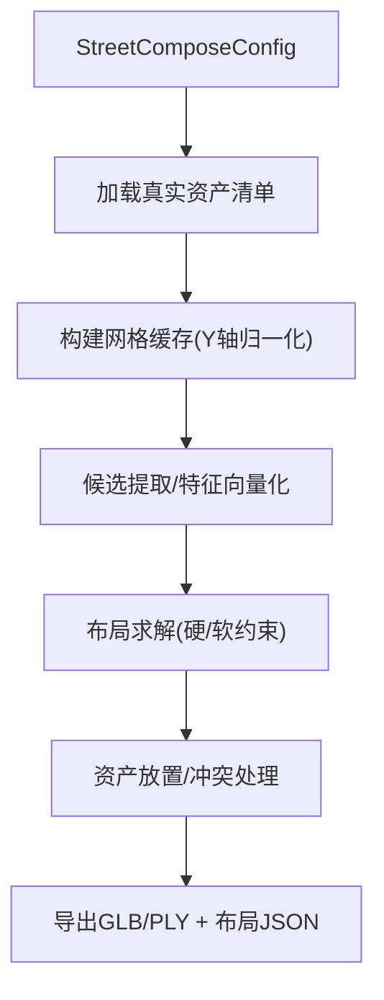

**图表来源**
- [src/roadgen3d/street_layout.py:1-800](file://src/roadgen3d/street_layout.py#L1-L800)

**章节来源**
- [src/roadgen3d/street_layout.py:1-800](file://src/roadgen3d/street_layout.py#L1-L800)

### MetaUrban 引擎与渲染
- 职责
  - 基于 Panda3D 的仿真引擎，提供渲染、物理、传感器与界面
  - 支持离屏/窗口渲染、相机面板、导航箭头、仪表盘等
- 关键点
  - 单例引擎、对象生命周期管理、颜色映射、任务管理与热身

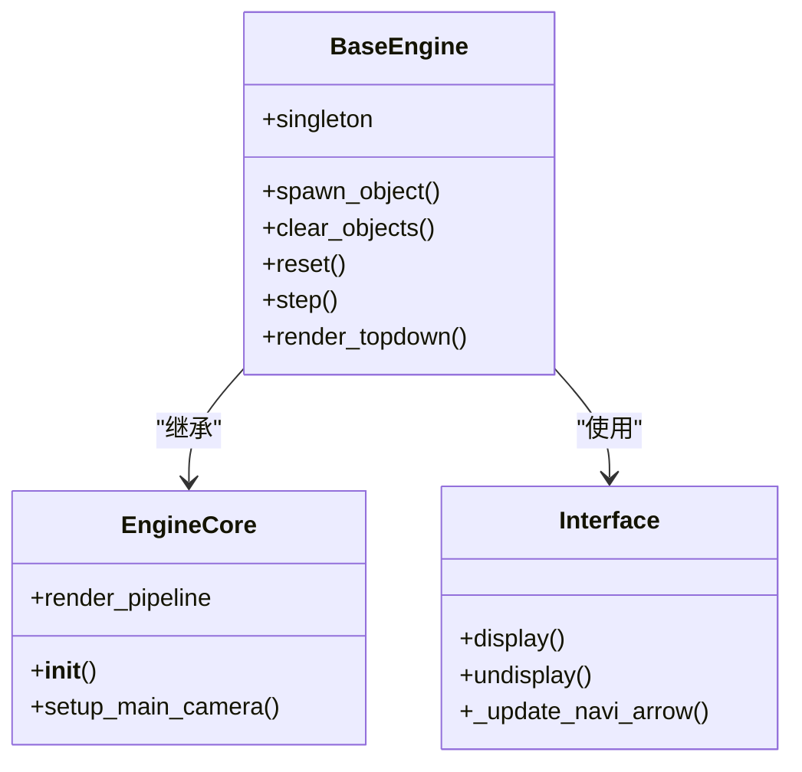

**图表来源**
- [metaurban/metaurban/engine/base_engine.py:38-800](file://metaurban/metaurban/engine/base_engine.py#L38-L800)
- [metaurban/metaurban/engine/core/engine_core.py:81-200](file://metaurban/metaurban/engine/core/engine_core.py#L81-L200)
- [metaurban/metaurban/engine/interface.py:19-220](file://metaurban/metaurban/engine/interface.py#L19-L220)

**章节来源**
- [metaurban/README.md:1-287](file://metaurban/README.md#L1-L287)
- [metaurban/metaurban/engine/base_engine.py:1-800](file://metaurban/metaurban/engine/base_engine.py#L1-L800)
- [metaurban/metaurban/engine/core/engine_core.py:1-200](file://metaurban/metaurban/engine/core/engine_core.py#L1-L200)
- [metaurban/metaurban/engine/interface.py:1-220](file://metaurban/metaurban/engine/interface.py#L1-L220)

## OSM+POI集成架构

### OSM 数据摄取流程
- 职责
  - 从 Overpass API 获取道路网络和兴趣点数据
  - 解析 OSM JSON 响应，提取道路、建筑物和 POI 信息
  - 将 WGS-84 坐标投影到本地 UTM 坐标系
- 关键组件
  - fetch_osm_data：网络请求与缓存管理
  - parse_osm_features：数据解析与标准化
  - project_to_local：坐标投影与变换

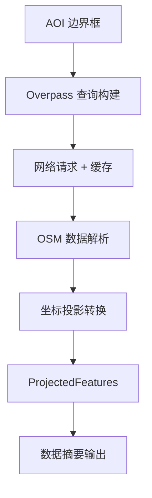

**图表来源**
- [src/roadgen3d/osm_ingest.py:108-167](file://src/roadgen3d/osm_ingest.py#L108-L167)
- [src/roadgen3d/osm_ingest.py:174-258](file://src/roadgen3d/osm_ingest.py#L174-L258)
- [src/roadgen3d/osm_ingest.py:265-331](file://src/roadgen3d/osm_ingest.py#L265-L331)

### POI 语义分类与规则引擎
- 职责
  - 定义 POI 类型规范和权重体系
  - 实现 POI 规则集，包括安全距离、可达性等约束
  - 提供 POI 排斥场计算和可视化
- 关键组件
  - PoiTypeSpec：POI 类型定义
  - PoiRuleSet：规则集合管理
  - score_placement：位置评分与约束检查

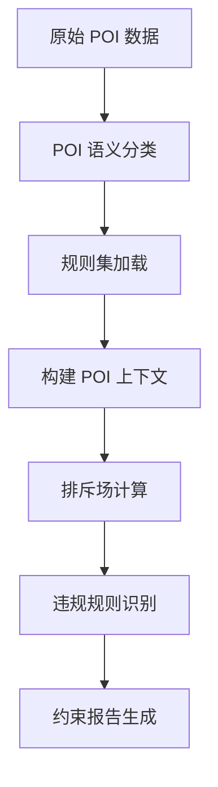

**图表来源**
- [src/roadgen3d/poi_taxonomy.py:50-161](file://src/roadgen3d/poi_taxonomy.py#L50-L161)
- [src/roadgen3d/poi_rules.py:77-198](file://src/roadgen3d/poi_rules.py#L77-L198)
- [src/roadgen3d/poi_rules.py:301-344](file://src/roadgen3d/poi_rules.py#L301-L344)

### 路段图构建
- 职责
  - 基于投影后的 OSM 特征构建离散路段图
  - 计算 POI 类型邻近度和影响范围
  - 支持神经符号布局求解器的空间约束
- 关键算法
  - 最近 POI 类型查找
  - 几何距离计算
  - 影响半径阈值判断

**章节来源**
- [src/roadgen3d/osm_ingest.py:1-331](file://src/roadgen3d/osm_ingest.py#L1-L331)
- [src/roadgen3d/poi_taxonomy.py:1-416](file://src/roadgen3d/poi_taxonomy.py#L1-L416)
- [src/roadgen3d/poi_rules.py:1-433](file://src/roadgen3d/poi_rules.py#L1-L433)
- [src/roadgen3d/osm_segment_graph.py:1-35](file://src/roadgen3d/osm_segment_graph.py#L1-L35)

## 神经符号管道

### StreetProgram 生成
- 职责
  - 将自然语言设计意图转换为结构化的街道程序
  - 推断横截面带结构、家具需求和设计目标
  - 结合观测到的 POI 信息进行约束绑定
- 关键流程
  - 查询理解与道路类型推断
  - 设计目标权重计算
  - 横截面带构建与宽度分配
  - 家具需求估算与约束生成

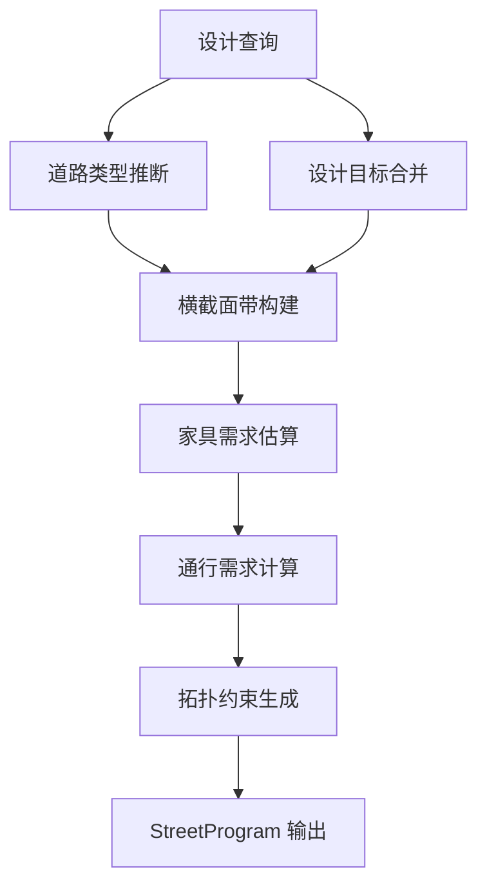

**图表来源**
- [src/roadgen3d/street_program.py:502-626](file://src/roadgen3d/street_program.py#L502-L626)

### 约束求解与布局优化
- 职责
  - 将 StreetProgram 转换为约束满足问题
  - 执行布局求解，生成资产槽位计划
  - 评估布局质量指标和约束满足度
- 关键组件
  - LayoutSolverRuntime：求解器运行时
  - 硬约束与软约束处理
  - 布局质量评估指标

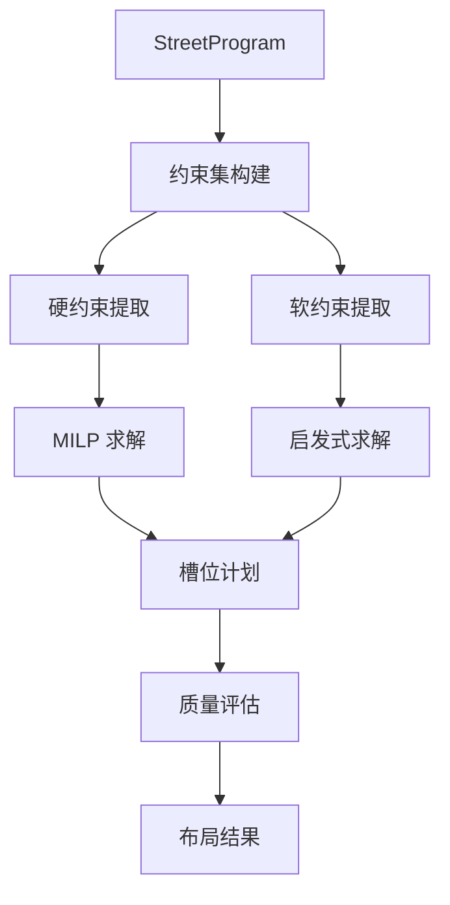

**图表来源**
- [src/roadgen3d/layout_solver.py:1527-1528](file://src/roadgen3d/layout_solver.py#L1527-L1528)

**章节来源**
- [src/roadgen3d/street_program.py:1-626](file://src/roadgen3d/street_program.py#L1-L626)
- [src/roadgen3d/layout_solver.py:1-200](file://src/roadgen3d/layout_solver.py#L1-L200)

## 学习化布局策略

### 布局策略模型
- 职责
  - 基于深度学习的资产选择策略
  - 处理槽位级候选资产的排序和选择
  - 支持在线推理和离线训练
- 关键组件
  - LayoutPolicyMLP：多层感知机模型
  - PolicyTrainConfig：训练配置管理
  - 场景级样本分割策略

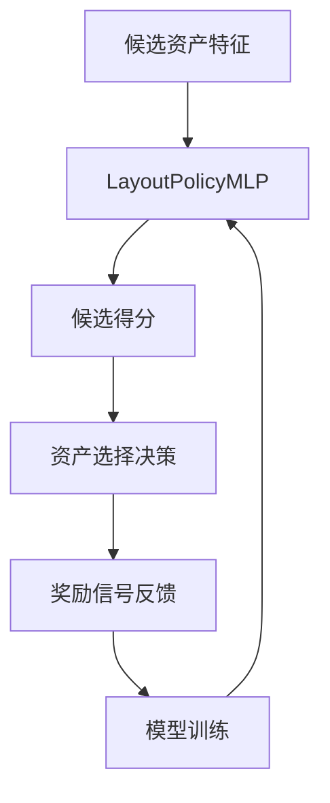

**图表来源**
- [src/roadgen3d/layout_policy.py:36-125](file://src/roadgen3d/layout_policy.py#L36-L125)

### 程序生成数据收集
- 职责
  - 收集用于学习化程序生成的训练数据
  - 支持多种布局模式和约束配置
  - 集成 OSM 数据驱动的场景生成
- 关键流程
  - 查询语句批量处理
  - 几何参数变体生成
  - OSM 边界框批量处理
  - 程序输入向量化

**章节来源**
- [src/roadgen3d/layout_policy.py:1-200](file://src/roadgen3d/layout_policy.py#L1-L200)
- [scripts/m6_01_collect_program_data.py:1-250](file://scripts/m6_01_collect_program_data.py#L1-L250)

## 数据流架构

### M5 工作流（OSM 数据处理）
- 职责
  - 从 OSM 获取道路网络和 POI 数据
  - 构建放置区域和空间分区
  - 生成 GeoJSON 输出供可视化
- 关键步骤
  - 边界框输入验证
  - OSM 数据获取与缓存
  - 数据解析与投影
  - 放置区域构建与导出

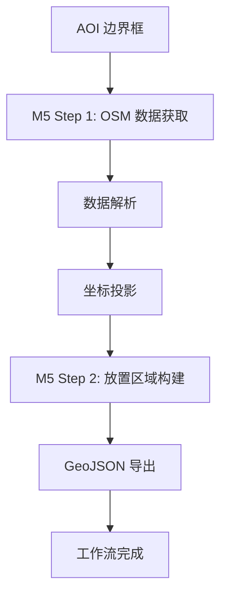

**图表来源**
- [scripts/m5_01_fetch_osm.py:18-66](file://scripts/m5_01_fetch_osm.py#L18-L66)
- [scripts/m5_02_build_placement_zones.py:18-62](file://scripts/m5_02_build_placement_zones.py#L18-L62)

### M6 工作流（程序生成与学习化策略）
- 职责
  - 收集学习化程序生成的训练数据
  - 支持多种约束配置和布局模式
  - 集成 OSM 数据驱动的场景生成
- 关键流程
  - 查询语句加载与验证
  - OSM 边界框批量处理
  - 程序输入向量化
  - 目标变量生成与样本输出

**章节来源**
- [scripts/m5_01_fetch_osm.py:1-66](file://scripts/m5_01_fetch_osm.py#L1-L66)
- [scripts/m5_02_build_placement_zones.py:1-62](file://scripts/m5_02_build_placement_zones.py#L1-L62)
- [scripts/m6_01_collect_program_data.py:1-250](file://scripts/m6_01_collect_program_data.py#L1-L250)

## 系统边界与集成点

### 外部系统集成
- OSM 数据集成
  - Overpass API：道路网络和 POI 数据获取
  - WGS-84 到 UTM 坐标转换
  - 数据缓存与重用机制
- MetaUrban 仿真集成
  - Panda3D 渲染引擎
  - 物理仿真与传感器模拟
  - 离屏渲染支持
- ROS 桥接集成
  - ROS 包与 socket 通信
  - 传感器数据桥接
  - 实时控制指令传输

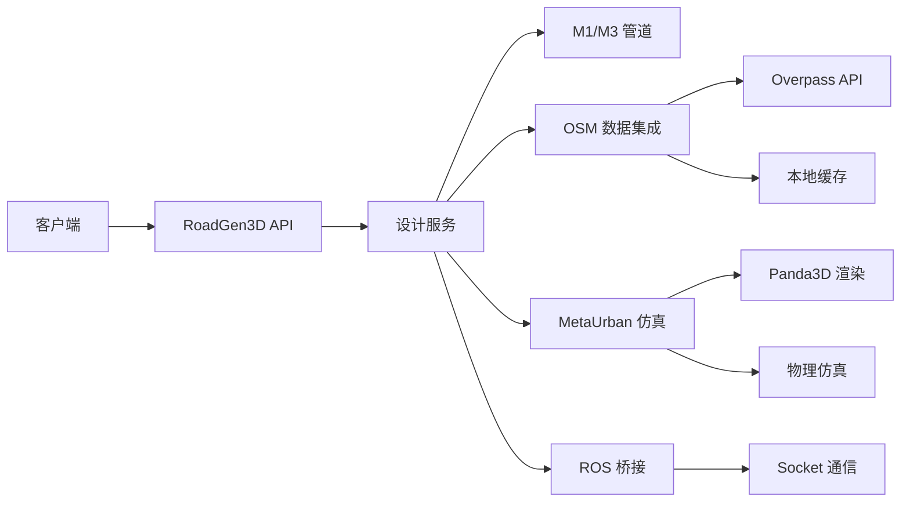

**图表来源**
- [src/roadgen3d/osm_ingest.py:108-167](file://src/roadgen3d/osm_ingest.py#L108-L167)
- [metaurban/metaurban/engine/base_engine.py:1-800](file://metaurban/metaurban/engine/base_engine.py#L1-L800)

### 数据边界管理
- 输入边界
  - 自然语言设计查询
  - AOI 边界框坐标
  - 布局模式配置
  - 约束配置文件
- 输出边界
  - 3D 场景网格文件
  - 布局 JSON 配置
  - 渲染图像序列
  - 性能指标报告

**章节来源**
- [README.md:132-193](file://README.md#L132-L193)
- [metaurban/README.md:1-287](file://metaurban/README.md#L1-L287)

## 依赖分析
- 组件耦合
  - Web API 依赖设计服务；设计服务依赖管道引擎与资产后端；生成核心依赖 MetaUrban 引擎
  - OSM 数据处理依赖 POI 语义分类和约束规则引擎
  - 神经符号管道依赖布局求解器和学习化策略
- 外部依赖
  - CLIP 文本嵌入、FAISS 检索、Panda3D 渲染、MetaUrban 资产与仿真
  - Overpass API、pyproj 坐标转换、torch 深度学习框架
- 集成点
  - MetaUrban 仿真与渲染：通过引擎接口与渲染管线
  - ROS 桥接：通过 ROS 包与 socket 服务器/客户端交互
  - OSM 数据：POI 约束与路网构建，支持 OSM 模式下的布局

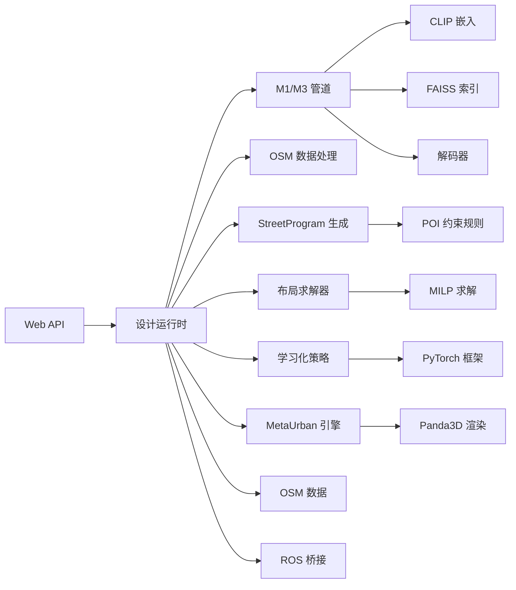

**图表来源**
- [web/api/main.py:1-286](file://web/api/main.py#L1-L286)
- [src/roadgen3d/services/design_runtime.py:1-397](file://src/roadgen3d/services/design_runtime.py#L1-L397)
- [src/roadgen3d/pipeline.py:1-133](file://src/roadgen3d/pipeline.py#L1-L133)
- [src/roadgen3d/osm_ingest.py:1-331](file://src/roadgen3d/osm_ingest.py#L1-L331)
- [src/roadgen3d/street_program.py:1-626](file://src/roadgen3d/street_program.py#L1-L626)
- [src/roadgen3d/layout_solver.py:1-200](file://src/roadgen3d/layout_solver.py#L1-L200)
- [src/roadgen3d/layout_policy.py:1-200](file://src/roadgen3d/layout_policy.py#L1-L200)
- [metaurban/metaurban/engine/base_engine.py:1-800](file://metaurban/metaurban/engine/base_engine.py#L1-L800)

**章节来源**
- [README.md:132-193](file://README.md#L132-L193)
- [metaurban/README.md:1-287](file://metaurban/README.md#L1-L287)

## 性能考量
- 计算与内存
  - M1 管道：FAISS 搜索与网格导出是主要开销；建议使用合适的 top-k 与导出方法
  - M3 合成：网格缓存与布局求解复杂度随候选数与约束增多而上升
  - OSM 数据处理：坐标投影和 POI 分类是主要计算开销
  - 神经符号管道：StreetProgram 生成和布局求解的计算复杂度较高
- 渲染与仿真
  - MetaUrban 引擎支持离屏渲染与多线程渲染；需平衡帧率与质量
- 存储与 I/O
  - 大型网格与潜在向量需高效读写；建议使用 SSD 与合理的缓存策略
  - OSM 数据缓存机制减少网络请求开销
- 可扩展性
  - 通过并行化候选特征计算与布局求解提升吞吐
  - 使用分布式任务队列替代内存作业存储以支持高并发
  - 学习化策略支持增量训练和在线推理

## 故障排查指南
- 常见问题
  - FAISS 索引为空：确保资产清单与索引构建完成后再运行
  - 解码失败：检查解码器输出格式与网格导出错误信息
  - MetaUrban 资产缺失：首次运行会自动下载，若失败请手动更新
  - LLM/GLM 配置错误：检查环境变量与 API Key
  - OSM 数据获取失败：检查网络连接和 Overpass API 可用性
  - POI 规则配置错误：验证 POI 类型规范和权重设置
- 定位手段
  - 查看作业状态与错误字段
  - 检查日志与调试模式开关
  - 验证资产清单完整性与路径有效性
  - 检查 OSM 缓存文件和投影坐标系

**章节来源**
- [src/roadgen3d/pipeline.py:56-68](file://src/roadgen3d/pipeline.py#L56-L68)
- [src/roadgen3d/services/generation_api.py:102-129](file://src/roadgen3d/services/generation_api.py#L102-L129)
- [metaurban/metaurban/engine/base_engine.py:764-779](file://metaurban/metaurban/engine/base_engine.py#L764-L779)

## 结论
RoadGen3D 通过"分层架构 + 管道模式"实现了从文本到 3D 街景的稳定管线：Web API 提供统一入口与作业管理，设计服务负责将草稿转化为可执行配置，管道引擎承担检索、解码与布局合成，MetaUrban 引擎提供高质量渲染与仿真。

**更新** 当前架构已全面整合 OSM+POI 集成和神经符号管道：
- OSM+POI 集成：实现了从 OpenStreetMap 数据获取、解析、投影到空间分区的完整流程，支持 POI 约束规则和排斥场计算
- 神经符号管道：通过 StreetProgram 生成、约束求解和布局优化，提供了可解释性和可控性的设计方法
- 学习化策略：集成了基于深度学习的布局选择策略，支持在线推理和离线训练
- M5-M6 工作流：建立了从地理数据获取到智能程序生成的完整数据处理链路

系统在 M6 中引入了神经符号化表示（StreetProgram/ConstraintSet/LayoutSolver），提升了设计意图的显式性与可编辑性。当前架构在 OSM 数据处理、POI 约束集成和学习化程序生成方面表现突出，为未来的扩展和优化奠定了坚实基础。

## 附录

### 系统上下文图（概念性）
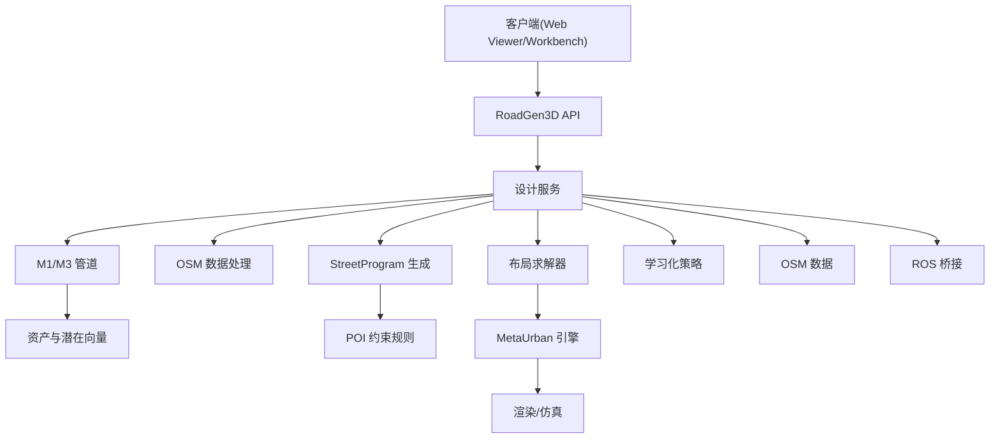

### 部署拓扑建议
- 开发环境：本地启动 API、Viewer、Workbench，使用本地文件系统与 CPU 设备
- 生产环境：容器化部署 API 与 Viewer，独立的渲染节点或云渲染服务，分布式任务队列承载高并发作业，MetaUrban 渲染节点按需扩展
- OSM 数据处理：专用的数据摄取节点，支持缓存和增量更新
- 学习化策略：GPU 加速的训练节点和 CPU 推理节点分离部署

### 技术决策与权衡
- 使用 CLIP 文本嵌入与 FAISS 检索以获得快速、稳定的检索效果
- 采用神经符号化管线以提升设计规则的可解释性与可控性
- 集成 OSM+POI 数据以增强设计的真实性和实用性
- 优先保证场景可用性与一致性，再逐步引入学习化与扩散模型
- 通过模块化设计支持不同布局模式和约束配置的灵活组合