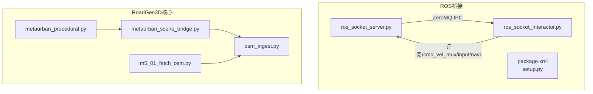
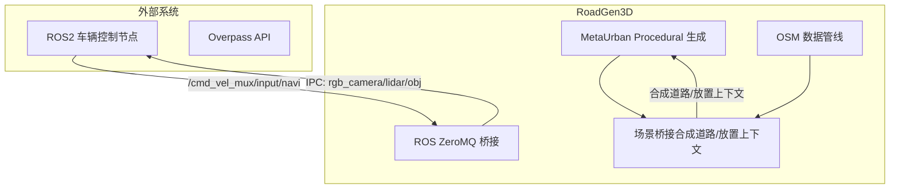
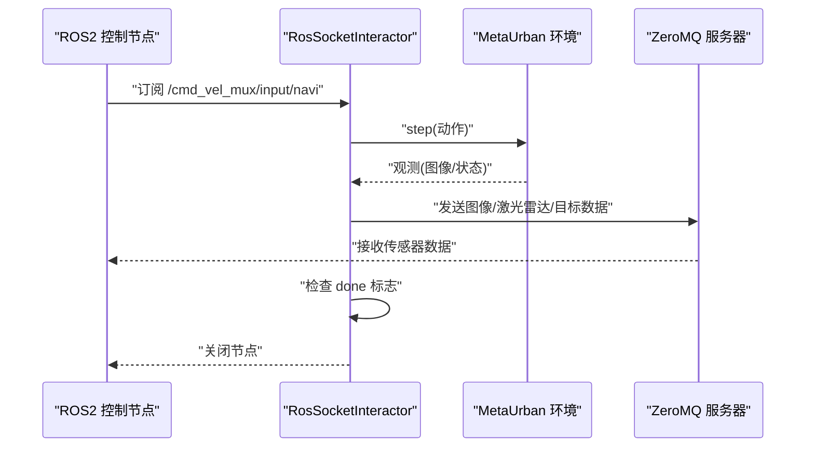
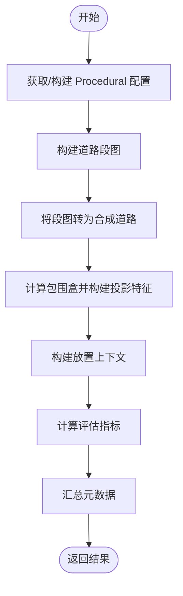
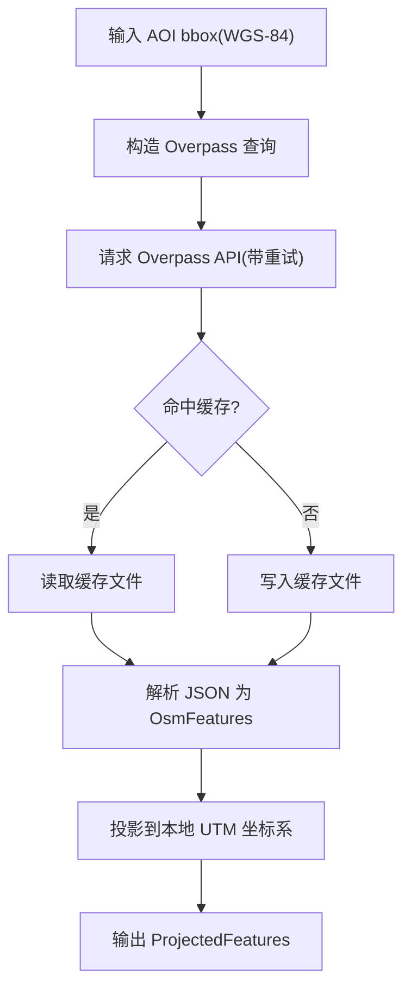
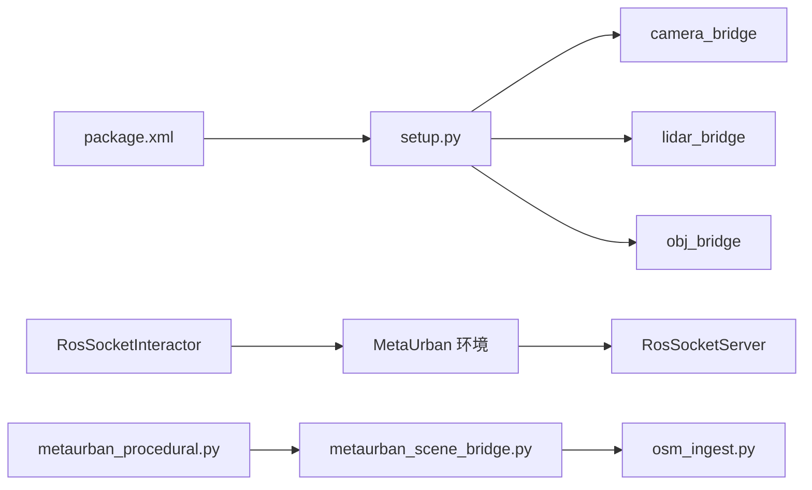

# 系统集成模式

<cite>
**本文引用的文件**
- [ros_socket_interactor.py](file://metaurban/bridges/ros_bridge/ros_socket_interactor.py)
- [ros_socket_server.py](file://metaurban/bridges/ros_bridge/ros_socket_server.py)
- [metaurban_scene_bridge.py](file://src/roadgen3d/metaurban_scene_bridge.py)
- [osm_ingest.py](file://src/roadgen3d/osm_ingest.py)
- [m5_01_fetch_osm.py](file://scripts/m5_01_fetch_osm.py)
- [metaurban_procedural.py](file://src/roadgen3d/metaurban_procedural.py)
- [package.xml](file://metaurban/bridges/ros_bridge/src/metaurban_example_bridge/package.xml)
- [setup.py](file://metaurban/bridges/ros_bridge/src/metaurban_example_bridge/setup.py)
</cite>

## 目录
1. [引言](#引言)
2. [项目结构](#项目结构)
3. [核心组件](#核心组件)
4. [架构总览](#架构总览)
5. [详细组件分析](#详细组件分析)
6. [依赖关系分析](#依赖关系分析)
7. [性能考量](#性能考量)
8. [故障排除指南](#故障排除指南)
9. [结论](#结论)
10. [附录](#附录)

## 引言
本文件面向 RoadGen3D 的系统集成模式，聚焦三大集成方向：
- 与 MetaUrban 仿真平台的集成：通过 Procedural 语法桥接生成道路段图，并将其映射到 RoadGen3D 场景管线。
- 与 ROS 桥接系统的通信协议：基于 ZeroMQ 的 IPC 通道传输相机图像、激光雷达点云与目标信息，同时通过 ROS2 订阅速度指令驱动仿真步进。
- OSM 数据集成：从 Overpass API 获取道路与兴趣点（POI），解析并投影到本地 UTM 坐标系，供布局与放置使用。

文档将阐述集成点的设计原则、数据同步机制、状态管理与错误恢复策略，并给出配置与部署要点、可扩展性与兼容性建议，以及集成测试与故障排除方法。

## 项目结构
RoadGen3D 在系统集成方面涉及以下关键目录与文件：
- metaurban/bridges/ros_bridge：ROS2 桥接示例包，包含 ZeroMQ 服务器与 ROS2 节点交互器。
- src/roadgen3d：核心算法模块，包括 OSM 集成、MetaUrban Procedural 桥接、场景构建等。
- scripts：端到端脚本，如 OSM 数据抓取与缓存。

**图表来源**
- [ros_socket_server.py:1-201](file://metaurban/bridges/ros_bridge/ros_socket_server.py#L1-L201)
- [ros_socket_interactor.py:1-150](file://metaurban/bridges/ros_bridge/ros_socket_interactor.py#L1-L150)
- [metaurban_procedural.py:1-200](file://src/roadgen3d/metaurban_procedural.py#L1-L200)
- [metaurban_scene_bridge.py:1-242](file://src/roadgen3d/metaurban_scene_bridge.py#L1-L242)
- [osm_ingest.py:1-331](file://src/roadgen3d/osm_ingest.py#L1-L331)
- [m5_01_fetch_osm.py:1-66](file://scripts/m5_01_fetch_osm.py#L1-L66)
- [package.xml:1-15](file://metaurban/bridges/ros_bridge/src/metaurban_example_bridge/package.xml#L1-L15)
- [setup.py:1-31](file://metaurban/bridges/ros_bridge/src/metaurban_example_bridge/setup.py#L1-L31)

**章节来源**
- [ros_socket_server.py:1-201](file://metaurban/bridges/ros_bridge/ros_socket_server.py#L1-L201)
- [ros_socket_interactor.py:1-150](file://metaurban/bridges/ros_bridge/ros_socket_interactor.py#L1-L150)
- [metaurban_procedural.py:1-200](file://src/roadgen3d/metaurban_procedural.py#L1-L200)
- [metaurban_scene_bridge.py:1-242](file://src/roadgen3d/metaurban_scene_bridge.py#L1-L242)
- [osm_ingest.py:1-331](file://src/roadgen3d/osm_ingest.py#L1-L331)
- [m5_01_fetch_osm.py:1-66](file://scripts/m5_01_fetch_osm.py#L1-L66)
- [package.xml:1-15](file://metaurban/bridges/ros_bridge/src/metaurban_example_bridge/package.xml#L1-L15)
- [setup.py:1-31](file://metaurban/bridges/ros_bridge/src/metaurban_example_bridge/setup.py#L1-L31)

## 核心组件
- ROS2 与 MetaUrban 的 ZeroMQ 桥接
  - 服务端负责运行仿真环境、采集传感器观测并通过 ZeroMQ 推送图像、激光雷达与目标数据；客户端节点订阅 ROS2 速度指令，驱动仿真步进。
- MetaUrban Procedural 桥接
  - 将参考方案与块序列转换为 RoadGen3D 的道路段图，并生成合成道路与放置上下文。
- OSM 数据管线
  - 抓取 Overpass 数据、解析要素、投影到本地 UTM 坐标系，输出可用于布局的要素集。

**章节来源**
- [ros_socket_server.py:13-189](file://metaurban/bridges/ros_bridge/ros_socket_server.py#L13-L189)
- [ros_socket_interactor.py:12-143](file://metaurban/bridges/ros_bridge/ros_socket_interactor.py#L12-L143)
- [metaurban_procedural.py:59-200](file://src/roadgen3d/metaurban_procedural.py#L59-L200)
- [metaurban_scene_bridge.py:26-234](file://src/roadgen3d/metaurban_scene_bridge.py#L26-L234)
- [osm_ingest.py:42-331](file://src/roadgen3d/osm_ingest.py#L42-L331)

## 架构总览
下图展示了 RoadGen3D 与外部系统的集成架构：ROS2 通过 ZeroMQ 与 MetaUrban 仿真交互，OSM 数据经由 Overpass 获取并投影后进入布局阶段。

**图表来源**
- [ros_socket_interactor.py:24-41](file://metaurban/bridges/ros_bridge/ros_socket_interactor.py#L24-L41)
- [ros_socket_server.py:15-30](file://metaurban/bridges/ros_bridge/ros_socket_server.py#L15-L30)
- [metaurban_procedural.py:179-200](file://src/roadgen3d/metaurban_procedural.py#L179-L200)
- [metaurban_scene_bridge.py:163-234](file://src/roadgen3d/metaurban_scene_bridge.py#L163-L234)
- [osm_ingest.py:126-168](file://src/roadgen3d/osm_ingest.py#L126-L168)

## 详细组件分析

### 组件A：ROS2 与 MetaUrban 的 ZeroMQ 桥接
- 设计原则
  - 使用 ZeroMQ IPC 通道进行高吞吐图像与传感器数据传输，避免网络开销。
  - 通过 ROS2 订阅速度指令驱动仿真步进，实现闭环控制。
- 关键接口
  - 速度指令订阅：/cmd_vel_mux/input/navi（Twist）
  - 图像推送：ipc:///tmp/rgb_camera（尺寸+数据）
  - 激光雷达推送：ipc:///tmp/lidar（点数+xyz）
  - 目标推送：ipc:///tmp/obj（数量+相对坐标与尺寸）
- 数据流
  - ROS2 节点接收速度指令，桥接节点将其转换为仿真动作并执行一步仿真，随后打包观测数据通过 ZeroMQ 发送。
- 错误处理
  - ZeroMQ 发送非阻塞，遇缓冲区满时记录告警；仿真结束标志触发节点关闭。

**图表来源**
- [ros_socket_interactor.py:96-129](file://metaurban/bridges/ros_bridge/ros_socket_interactor.py#L96-L129)
- [ros_socket_server.py:113-181](file://metaurban/bridges/ros_bridge/ros_socket_server.py#L113-L181)

**章节来源**
- [ros_socket_interactor.py:12-143](file://metaurban/bridges/ros_bridge/ros_socket_interactor.py#L12-L143)
- [ros_socket_server.py:13-189](file://metaurban/bridges/ros_bridge/ros_socket_server.py#L13-L189)

### 组件B：MetaUrban Procedural 桥接
- 设计原则
  - 将 MetaUrban 的块序列与参考方案映射为 RoadGen3D 的道路段图，确保生成几何与语义一致。
  - 输出合成道路、投影特征与放置上下文，供后续布局与资产放置使用。
- 关键流程
  - 解析或采样块序列 → 构建段图 → 转换为 OSM 道路对象 → 计算包围盒与评估指标 → 构建放置上下文。
- 数据模型
  - 输入：StreetComposeConfig、可选的 MetaUrbanProceduralConfig
  - 输出：MetaUrbanSceneBridgeResult（包含段图、投影特征、放置上下文、评估指标与元数据）

**图表来源**
- [metaurban_procedural.py:179-200](file://src/roadgen3d/metaurban_procedural.py#L179-L200)
- [metaurban_scene_bridge.py:163-234](file://src/roadgen3d/metaurban_scene_bridge.py#L163-L234)

**章节来源**
- [metaurban_procedural.py:59-200](file://src/roadgen3d/metaurban_procedural.py#L59-L200)
- [metaurban_scene_bridge.py:26-234](file://src/roadgen3d/metaurban_scene_bridge.py#L26-L234)

### 组件C：OSM 数据集成
- 设计原则
  - 以 WGS-84 坐标系抓取道路与 POI，统一投影到本地 UTM 坐标系，保证与仿真/布局的一致性。
  - 缓存 Overpass 结果，支持强制刷新与重试机制。
- 关键流程
  - 构造 Overpass 查询 → 请求 API → 缓存响应 → 解析 JSON → 投影到本地坐标系。
- 数据模型
  - OsmRoad/OsmBuilding/OsmFeatures → ProjectedFeatures（含 roads/buildings/entrances/bus_stops/fire_points/bbox/origin/epsg）

**图表来源**
- [osm_ingest.py:108-168](file://src/roadgen3d/osm_ingest.py#L108-L168)
- [osm_ingest.py:265-331](file://src/roadgen3d/osm_ingest.py#L265-L331)
- [m5_01_fetch_osm.py:18-62](file://scripts/m5_01_fetch_osm.py#L18-L62)

**章节来源**
- [osm_ingest.py:103-331](file://src/roadgen3d/osm_ingest.py#L103-L331)
- [m5_01_fetch_osm.py:18-62](file://scripts/m5_01_fetch_osm.py#L18-L62)

## 依赖关系分析
- ROS 桥接包
  - package.xml 定义了依赖的 vision_msgs 等包，setup.py 注册 console_scripts，便于独立运行桥接节点。
- 组件耦合
  - RosSocketInteractor 与 RosSocketServer 通过 ZeroMQ IPC 协作，解耦 ROS2 与仿真环境。
  - MetaUrbanSceneBridge 依赖 OSM 投影结果与 Procedural 生成的段图，形成“生成→投影→放置”的流水线。

**图表来源**
- [package.xml:1-15](file://metaurban/bridges/ros_bridge/src/metaurban_example_bridge/package.xml#L1-L15)
- [setup.py:1-31](file://metaurban/bridges/ros_bridge/src/metaurban_example_bridge/setup.py#L1-L31)
- [ros_socket_interactor.py:12-41](file://metaurban/bridges/ros_bridge/ros_socket_interactor.py#L12-L41)
- [ros_socket_server.py:13-30](file://metaurban/bridges/ros_bridge/ros_socket_server.py#L13-L30)
- [metaurban_procedural.py:1-200](file://src/roadgen3d/metaurban_procedural.py#L1-L200)
- [metaurban_scene_bridge.py:1-242](file://src/roadgen3d/metaurban_scene_bridge.py#L1-L242)
- [osm_ingest.py:1-331](file://src/roadgen3d/osm_ingest.py#L1-L331)

**章节来源**
- [package.xml:1-15](file://metaurban/bridges/ros_bridge/src/metaurban_example_bridge/package.xml#L1-L15)
- [setup.py:1-31](file://metaurban/bridges/ros_bridge/src/metaurban_example_bridge/setup.py#L1-L31)
- [ros_socket_interactor.py:12-41](file://metaurban/bridges/ros_bridge/ros_socket_interactor.py#L12-L41)
- [ros_socket_server.py:13-30](file://metaurban/bridges/ros_bridge/ros_socket_server.py#L13-L30)
- [metaurban_procedural.py:1-200](file://src/roadgen3d/metaurban_procedural.py#L1-L200)
- [metaurban_scene_bridge.py:1-242](file://src/roadgen3d/metaurban_scene_bridge.py#L1-L242)
- [osm_ingest.py:1-331](file://src/roadgen3d/osm_ingest.py#L1-L331)

## 性能考量
- ZeroMQ 优化
  - 设置发送缓冲与高水位标记，减少丢帧；使用非阻塞发送并在告警中降级处理。
- 仿真步进频率
  - 固定周期步进仿真，平衡实时性与计算负载。
- OSM 抓取
  - 缓存与指数退避重试降低网络抖动影响；仅查询必要 highway 类型与 POI。
- 投影与内存
  - 显式删除大数组以释放内存，避免长时间运行内存累积。

[本节为通用性能建议，不直接分析具体文件]

## 故障排除指南
- ROS2 速度指令无响应
  - 检查订阅主题是否正确，确认桥接节点日志中已显示订阅成功。
  - 确认仿真 done 标志未提前触发。
- 图像/点云/目标数据缺失
  - 检查 ZeroMQ 发送是否因缓冲区满而失败；调整缓冲参数或降低发送频率。
  - 确认 MetaUrban 环境已 reset 并处于非专家接管状态。
- OSM 抓取失败
  - 查看 Overpass 请求日志与重试次数；必要时使用强制刷新参数。
  - 检查 bbox 是否有效，网络连通性是否正常。
- 坐标系不一致
  - 确认投影中心与 UTM 区域匹配；检查 EPSG 与原点偏移。

**章节来源**
- [ros_socket_interactor.py:120-129](file://metaurban/bridges/ros_bridge/ros_socket_interactor.py#L120-L129)
- [ros_socket_server.py:103-111](file://metaurban/bridges/ros_bridge/ros_socket_server.py#L103-L111)
- [osm_ingest.py:150-167](file://src/roadgen3d/osm_ingest.py#L150-L167)

## 结论
RoadGen3D 的系统集成模式围绕三条主线展开：ROS2 与仿真环境的 ZeroMQ 桥接、MetaUrban Procedural 到场景的桥接、以及 OSM 数据的获取与投影。通过明确的接口设计、可靠的数据同步与错误恢复策略，系统在可扩展性与兼容性上具备良好基础。建议在生产环境中进一步完善监控与告警、参数化配置与热插拔能力。

[本节为总结性内容，不直接分析具体文件]

## 附录

### 配置与部署要点
- ROS 桥接
  - 安装依赖包，编译并安装 metaurban_example_bridge 包；注册 console_scripts 后可直接运行桥接节点。
  - 确保 IPC 套接字路径可用且权限允许。
- OSM 数据
  - 准备 AOI bbox，设置缓存目录；首次运行会自动抓取并缓存 Overpass 数据。
- Procedural 生成
  - 提供参考方案 ID 或显式块序列；根据需求调整车道数、人行道宽度与段长等参数。

**章节来源**
- [package.xml:1-15](file://metaurban/bridges/ros_bridge/src/metaurban_example_bridge/package.xml#L1-L15)
- [setup.py:1-31](file://metaurban/bridges/ros_bridge/src/metaurban_example_bridge/setup.py#L1-L31)
- [m5_01_fetch_osm.py:18-37](file://scripts/m5_01_fetch_osm.py#L18-L37)
- [metaurban_procedural.py:179-200](file://src/roadgen3d/metaurban_procedural.py#L179-L200)

### 集成测试策略
- 单元测试
  - 对 OSM 抓取、解析与投影函数进行断言，覆盖边界情况（无效 bbox、空元素、异常标签）。
- 端到端测试
  - 启动 RosSocketServer 与 RosSocketInteractor，验证速度指令驱动仿真步进与传感器数据回传。
  - 执行 M5 脚本，检查生成的 summary 文件与投影结果。
- 兼容性测试
  - 不同 UTM 区域与不同 highway 类型下的投影一致性；不同 ROS2 版本下的消息格式兼容。

**章节来源**
- [osm_ingest.py:126-168](file://src/roadgen3d/osm_ingest.py#L126-L168)
- [m5_01_fetch_osm.py:18-62](file://scripts/m5_01_fetch_osm.py#L18-L62)
- [ros_socket_server.py:31-189](file://metaurban/bridges/ros_bridge/ros_socket_server.py#L31-L189)
- [ros_socket_interactor.py:130-143](file://metaurban/bridges/ros_bridge/ros_socket_interactor.py#L130-L143)