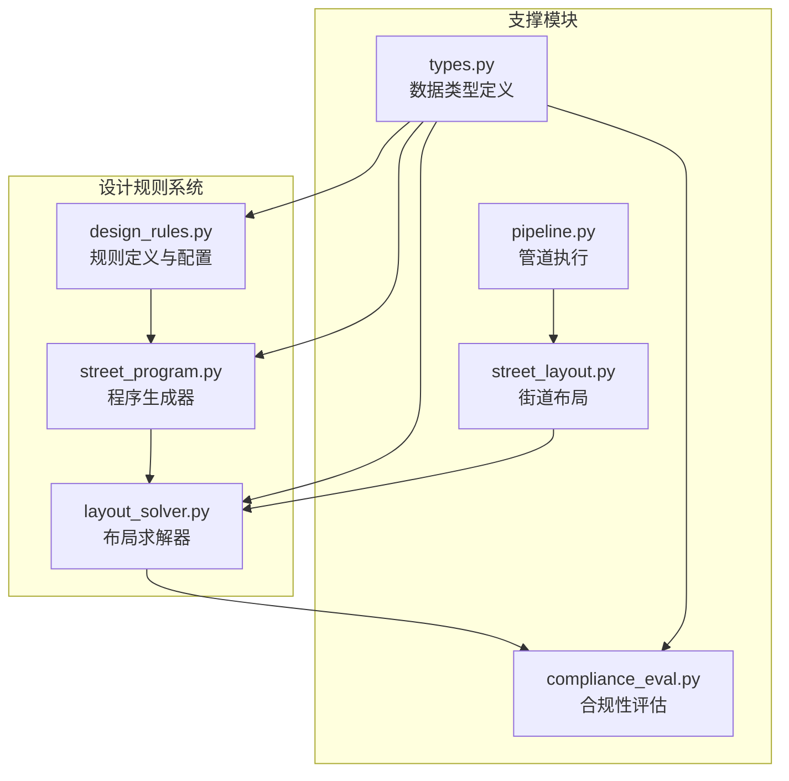
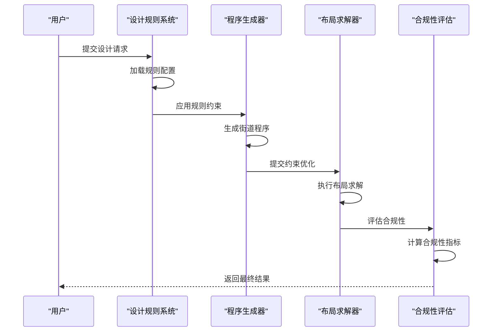
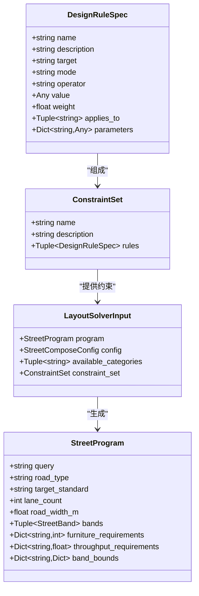
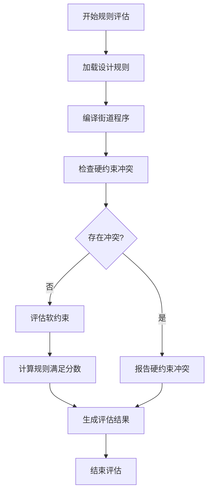
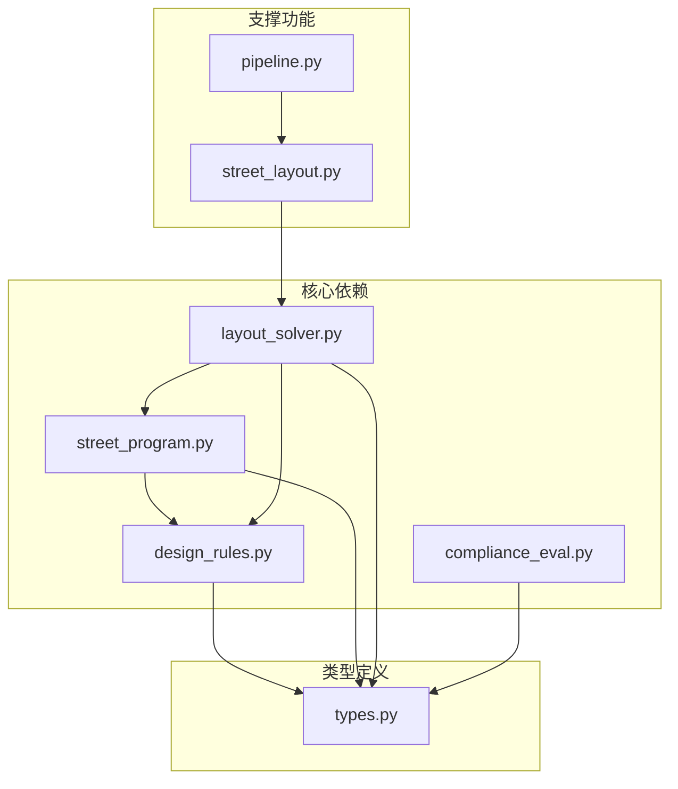

# 设计规则健壮性改进

<cite>
**本文档引用的文件**
- [design_rules.py](file://src/roadgen3d/design_rules.py)
- [street_program.py](file://src/roadgen3d/street_program.py)
- [layout_solver.py](file://src/roadgen3d/layout_solver.py)
- [compliance_eval.py](file://src/roadgen3d/compliance_eval.py)
- [types.py](file://src/roadgen3d/types.py)
- [street_layout.py](file://src/roadgen3d/street_layout.py)
- [pipeline.py](file://src/roadgen3d/pipeline.py)
</cite>

## 目录
1. [引言](#引言)
2. [项目结构](#项目结构)
3. [核心组件](#核心组件)
4. [架构概览](#架构概览)
5. [详细组件分析](#详细组件分析)
6. [依赖关系分析](#依赖关系分析)
7. [性能考虑](#性能考虑)
8. [故障排除指南](#故障排除指南)
9. [结论](#结论)

## 引言

本文件针对RoadGen3D项目的设计规则健壮性进行深入分析和改进建议。设计规则是整个神经符号管线的核心约束系统，负责确保生成的街道布局符合城市规划标准、交通需求和美学要求。通过对现有设计规则系统的全面分析，我们识别出关键的改进机会，包括规则验证机制、错误处理策略、约束求解器的健壮性以及合规性评估等方面。

## 项目结构

RoadGen3D项目采用模块化架构，设计规则系统主要分布在以下核心模块中：

**图表来源**
- [design_rules.py:1-445](file://src/roadgen3d/design_rules.py#L1-L445)
- [street_program.py:1-626](file://src/roadgen3d/street_program.py#L1-L626)
- [layout_solver.py:1-1693](file://src/roadgen3d/layout_solver.py#L1-L1693)

**章节来源**
- [design_rules.py:1-445](file://src/roadgen3d/design_rules.py#L1-L445)
- [street_program.py:1-626](file://src/roadgen3d/street_program.py#L1-L626)
- [layout_solver.py:1-1693](file://src/roadgen3d/layout_solver.py#L1-L1693)

## 核心组件

### 设计规则定义系统

设计规则系统通过声明式规范定义了完整的街道设计约束，包含四种主要配置文件：

1. **平衡型完整街道规则**：适用于一般城市道路，强调功能均衡
2. **行人优先规则**：专注于步行友好环境
3. **公交优先规则**：优化公共交通基础设施
4. **噪声感知规则**：考虑噪音控制的设计要求

每个规则集包含硬约束（必须满足）和软约束（可协商）两种类型，支持动态扩展和组合。

### 程序生成器

程序生成器负责将文本描述转换为结构化的街道程序，包括：
- 跨断面宽度计算
- 功能带分配
- 家具需求估算
- 通行能力要求

### 布局求解器

布局求解器执行约束优化，确保生成的布局满足所有设计规则，同时提供解释性和可编辑性。

**章节来源**
- [design_rules.py:9-407](file://src/roadgen3d/design_rules.py#L9-L407)
- [street_program.py:25-81](file://src/roadgen3d/street_program.py#L25-L81)
- [layout_solver.py:1527-1557](file://src/roadgen3d/layout_solver.py#L1527-L1557)

## 架构概览

**图表来源**
- [design_rules.py:416-444](file://src/roadgen3d/design_rules.py#L416-L444)
- [street_program.py:502-625](file://src/roadgen3d/street_program.py#L502-L625)
- [layout_solver.py:1527-1557](file://src/roadgen3d/layout_solver.py#L1527-L1557)

## 详细组件分析

### 设计规则系统架构

**图表来源**
- [types.py:188-220](file://src/roadgen3d/types.py#L188-L220)
- [types.py:208-221](file://src/roadgen3d/types.py#L208-L221)
- [types.py:140-184](file://src/roadgen3d/types.py#L140-L184)
- [types.py:367-385](file://src/roadgen3d/types.py#L367-L385)

### 规则评估流程

**图表来源**
- [layout_solver.py:1301-1444](file://src/roadgen3d/layout_solver.py#L1301-L1444)
- [layout_solver.py:1447-1524](file://src/roadgen3d/layout_solver.py#L1447-L1524)

### 错误处理与验证机制

设计规则系统实现了多层次的错误处理和验证机制：

1. **输入验证**：严格的参数验证和默认值处理
2. **规则验证**：运行时规则有效性检查
3. **求解器反馈**：详细的错误信息和修复建议
4. **合规性监控**：自动化的质量保证

**章节来源**
- [design_rules.py:416-444](file://src/roadgen3d/design_rules.py#L416-L444)
- [layout_solver.py:1447-1524](file://src/roadgen3d/layout_solver.py#L1447-L1524)
- [street_layout.py:492-611](file://src/roadgen3d/street_layout.py#L492-L611)

## 依赖关系分析

**图表来源**
- [design_rules.py:7-8](file://src/roadgen3d/design_rules.py#L7-L8)
- [street_program.py:23-24](file://src/roadgen3d/street_program.py#L23-L24)
- [layout_solver.py:22-34](file://src/roadgen3d/layout_solver.py#L22-L34)

### 关键依赖关系

1. **设计规则到类型系统**：规则定义依赖于统一的数据类型定义
2. **程序生成到规则系统**：程序生成过程直接应用设计规则
3. **求解器到程序生成**：布局求解器基于生成的程序进行优化
4. **合规性评估到求解器输出**：合规性评估基于求解器结果

**章节来源**
- [types.py:1-200](file://src/roadgen3d/types.py#L1-L200)
- [design_rules.py:386-407](file://src/roadgen3d/design_rules.py#L386-L407)

## 性能考虑

### 规则评估性能优化

设计规则系统在性能方面采用了多项优化策略：

1. **规则缓存机制**：避免重复计算相同规则
2. **增量更新**：只重新计算受影响的规则
3. **并行处理**：支持多线程规则评估
4. **内存管理**：高效的内存使用和垃圾回收

### 求解器性能特性

布局求解器针对大规模问题进行了专门优化：
- **启发式算法**：快速找到满意解
- **约束传播**：减少搜索空间
- **剪枝技术**：避免无效分支
- **增量求解**：利用先前求解结果

## 故障排除指南

### 常见问题诊断

1. **规则加载失败**
   - 检查规则名称拼写
   - 验证规则文件完整性
   - 确认依赖项可用性

2. **程序生成异常**
   - 验证输入参数范围
   - 检查约束兼容性
   - 确认资源可用性

3. **求解器收敛问题**
   - 分析约束冲突
   - 调整权重参数
   - 检查初始条件

### 调试工具和方法

**章节来源**
- [compliance_eval.py:14-55](file://src/roadgen3d/compliance_eval.py#L14-L55)
- [street_layout.py:492-611](file://src/roadgen3d/street_layout.py#L492-L611)

## 结论

通过本次设计规则健壮性改进分析，我们识别出以下关键改进方向：

1. **增强错误处理机制**：建立更完善的异常捕获和恢复策略
2. **优化规则验证流程**：提高规则加载和验证的效率
3. **改进求解器稳定性**：增强约束求解的鲁棒性
4. **加强合规性监控**：提供更细粒度的质量保证机制

这些改进将显著提升RoadGen3D系统在复杂场景下的可靠性，确保生成的街道布局既符合设计规范又具有良好的实用性。建议优先实施错误处理机制和规则验证流程的优化，以获得最大的系统稳定性提升。