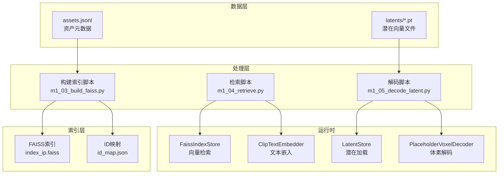
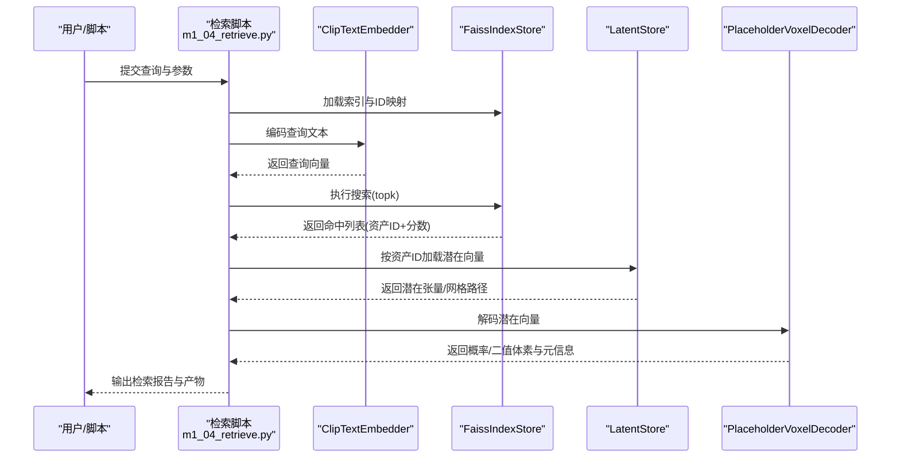
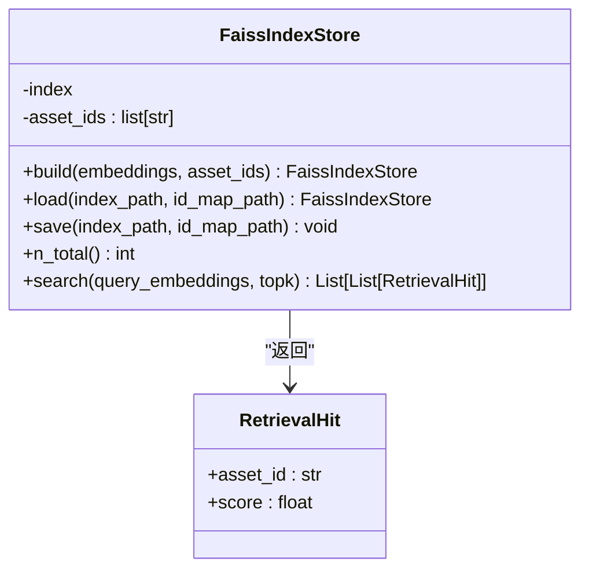
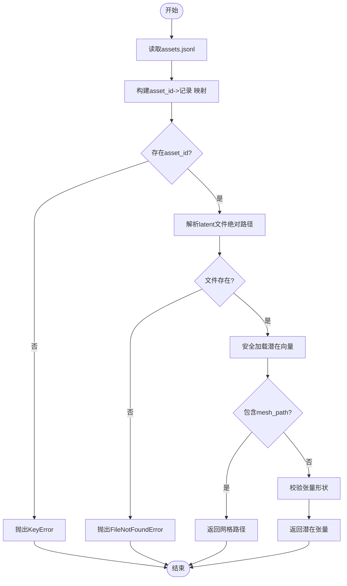
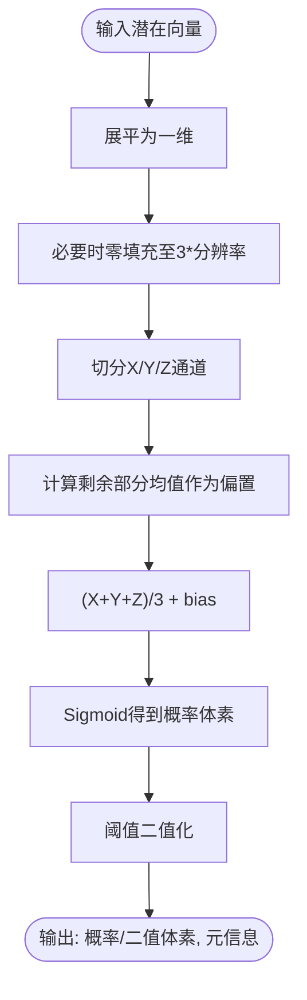
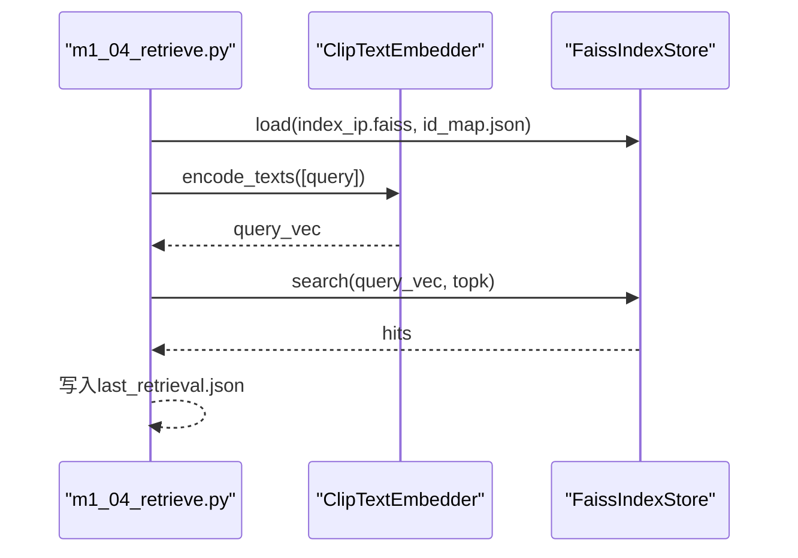
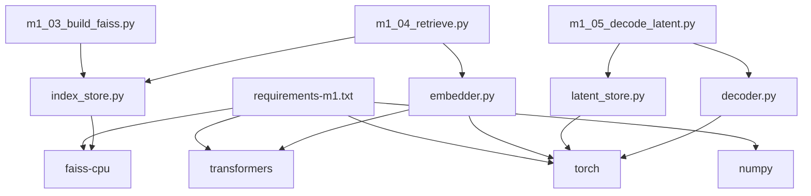

# 资产存储系统

<cite>
**本文引用的文件**   
- [src/roadgen3d/index_store.py](file://src/roadgen3d/index_store.py)
- [src/roadgen3d/latent_store.py](file://src/roadgen3d/latent_store.py)
- [src/roadgen3d/decoder.py](file://src/roadgen3d/decoder.py)
- [src/roadgen3d/embedder.py](file://src/roadgen3d/embedder.py)
- [src/roadgen3d/types.py](file://src/roadgen3d/types.py)
- [scripts/m1_03_build_faiss.py](file://scripts/m1_03_build_faiss.py)
- [scripts/m1_04_retrieve.py](file://scripts/m1_04_retrieve.py)
- [scripts/m1_05_decode_latent.py](file://scripts/m1_05_decode_latent.py)
- [requirements-m1.txt](file://requirements-m1.txt)
- [data/m1/assets.jsonl](file://data/m1/assets.jsonl)
- [artifacts/m1/id_map.json](file://artifacts/m1/id_map.json)
- [artifacts/m1/index_ip.faiss](file://artifacts/m1/index_ip.faiss)
- [artifacts/m1/asset_text_embeds.npy](file://artifacts/m1/asset_text_embeds.npy)
- [artifacts/m1/voxel_prob.npy](file://artifacts/m1/voxel_prob.npy)
- [artifacts/m1/voxel_bin.npy](file://artifacts/m1/voxel_bin.npy)
</cite>

## 目录
1. [简介](#简介)
2. [项目结构](#项目结构)
3. [核心组件](#核心组件)
4. [架构总览](#架构总览)
5. [详细组件分析](#详细组件分析)
6. [依赖关系分析](#依赖关系分析)
7. [性能考量](#性能考量)
8. [故障排查指南](#故障排查指南)
9. [结论](#结论)
10. [附录](#附录)

## 简介
本文件面向RoadGen3D项目的资产存储系统，聚焦以下目标：
- 向量存储与检索：FAISS索引的构建、持久化、加载与查询流程
- 潜在空间存储：Latent编码、压缩存储与快速检索
- 存储架构设计：分布式存储、缓存策略与数据分片（概念性说明）
- 性能优化：读写分离、批量操作、内存映射（概念性说明）
- 容量规划：数据增长预测、存储成本优化与备份策略（概念性说明）
- 监控与运维：指标建议、维护工具与故障恢复机制（概念性说明）

该系统以Milestone-1流水线为例，展示了从文本嵌入到FAISS索引再到潜在空间解码的完整链路。

## 项目结构
围绕资产存储的关键模块与脚本如下：
- 存储与检索
  - 向量索引：FaissIndexStore（封装FAISS索引与ID映射）
  - 潜在空间：LatentStore（基于JSONL元数据解析与加载）
  - 解码器：PlaceholderVoxelDecoder（将潜在向量解码为体素概率/二值图）
  - 嵌入器：ClipTextEmbedder（CLIP文本嵌入，用于检索）
- 数据与制品
  - 元数据：data/m1/assets.jsonl
  - 制品：artifacts/m1/{index_ip.faiss, id_map.json, asset_text_embeds.npy, voxel_prob.npy, voxel_bin.npy}
- 流水线脚本
  - 构建索引：scripts/m1_03_build_faiss.py
  - 文本检索：scripts/m1_04_retrieve.py
  - 潜在解码：scripts/m1_05_decode_latent.py
- 运行时依赖
  - requirements-m1.txt（numpy、torch、transformers、faiss-cpu）

**图表来源**
- [src/roadgen3d/index_store.py:33-95](file://src/roadgen3d/index_store.py#L33-L95)
- [src/roadgen3d/latent_store.py:35-81](file://src/roadgen3d/latent_store.py#L35-L81)
- [src/roadgen3d/decoder.py:24-65](file://src/roadgen3d/decoder.py#L24-L65)
- [src/roadgen3d/embedder.py:33-100](file://src/roadgen3d/embedder.py#L33-L100)
- [scripts/m1_03_build_faiss.py:29-44](file://scripts/m1_03_build_faiss.py#L29-L44)
- [scripts/m1_04_retrieve.py:32-65](file://scripts/m1_04_retrieve.py#L32-L65)
- [scripts/m1_05_decode_latent.py:33-67](file://scripts/m1_05_decode_latent.py#L33-L67)

**章节来源**
- [src/roadgen3d/index_store.py:1-96](file://src/roadgen3d/index_store.py#L1-L96)
- [src/roadgen3d/latent_store.py:1-81](file://src/roadgen3d/latent_store.py#L1-L81)
- [src/roadgen3d/decoder.py:1-65](file://src/roadgen3d/decoder.py#L1-L65)
- [src/roadgen3d/embedder.py:1-100](file://src/roadgen3d/embedder.py#L1-L100)
- [scripts/m1_03_build_faiss.py:1-50](file://scripts/m1_03_build_faiss.py#L1-L50)
- [scripts/m1_04_retrieve.py:1-71](file://scripts/m1_04_retrieve.py#L1-L71)
- [scripts/m1_05_decode_latent.py:1-72](file://scripts/m1_05_decode_latent.py#L1-L72)
- [requirements-m1.txt:1-7](file://requirements-m1.txt#L1-L7)

## 核心组件
- FaissIndexStore：封装FAISS IndexFlatIP，负责索引构建、持久化与查询；通过ID映射将向量ID映射回资产ID。
- LatentStore：基于assets.jsonl元数据，建立asset_id到latent文件路径的映射，并安全加载潜在向量或引用网格路径。
- PlaceholderVoxelDecoder：将潜在向量映射为分辨率固定的体素概率与二值体积，支持阈值二值化。
- ClipTextEmbedder：使用CLIP模型对文本进行嵌入，输出L2归一化的特征矩阵，供FAISS内积检索使用。
- 类型定义：AssetRecord、RetrievalHit等，确保跨模块数据契约一致。

**章节来源**
- [src/roadgen3d/index_store.py:33-95](file://src/roadgen3d/index_store.py#L33-L95)
- [src/roadgen3d/latent_store.py:35-81](file://src/roadgen3d/latent_store.py#L35-L81)
- [src/roadgen3d/decoder.py:24-65](file://src/roadgen3d/decoder.py#L24-L65)
- [src/roadgen3d/embedder.py:33-100](file://src/roadgen3d/embedder.py#L33-L100)
- [src/roadgen3d/types.py:12-27](file://src/roadgen3d/types.py#L12-L27)

## 架构总览
下图展示Milestone-1端到端流水线中的存储与检索路径：文本经嵌入后与FAISS索引匹配，返回资产ID，再通过LatentStore加载潜在向量，最后由Decoder生成体素表示。

**图表来源**
- [scripts/m1_04_retrieve.py:32-65](file://scripts/m1_04_retrieve.py#L32-L65)
- [src/roadgen3d/embedder.py:84-100](file://src/roadgen3d/embedder.py#L84-L100)
- [src/roadgen3d/index_store.py:79-95](file://src/roadgen3d/index_store.py#L79-L95)
- [src/roadgen3d/latent_store.py:57-81](file://src/roadgen3d/latent_store.py#L57-L81)
- [src/roadgen3d/decoder.py:40-65](file://src/roadgen3d/decoder.py#L40-L65)

## 详细组件分析

### 向量存储与检索（FAISS）
- 索引类型：IndexFlatIP（内积相似度），适合CLIP嵌入的L2归一化特征。
- 构建流程：读取预计算的嵌入矩阵与资产ID列表，校验维度一致性后添加至索引。
- 持久化：保存FAISS索引文件与ID映射JSON，便于离线加载。
- 查询流程：输入查询向量（需与训练维度一致），执行topk搜索，过滤无效索引并映射资产ID。
- 线程与性能：设置OpenMP/MKL等环境变量以避免冲突并限制并行度，适配CPU场景。

**图表来源**
- [src/roadgen3d/index_store.py:33-95](file://src/roadgen3d/index_store.py#L33-L95)
- [src/roadgen3d/types.py:21-27](file://src/roadgen3d/types.py#L21-L27)

**章节来源**
- [src/roadgen3d/index_store.py:33-95](file://src/roadgen3d/index_store.py#L33-L95)
- [scripts/m1_03_build_faiss.py:29-44](file://scripts/m1_03_build_faiss.py#L29-L44)
- [scripts/m1_04_retrieve.py:32-65](file://scripts/m1_04_retrieve.py#L32-L65)

### 潜在空间存储（Latent）
- 元数据：assets.jsonl每行一条记录，包含asset_id、description、latent_path。
- 加载策略：按asset_id查找记录，解析latent文件路径，优先使用安全加载方式；若潜在对象包含mesh_path键，则解析为网格路径并返回。
- 错误处理：重复ID、缺失文件、非张量对象等均抛出明确异常。

**图表来源**
- [src/roadgen3d/latent_store.py:12-81](file://src/roadgen3d/latent_store.py#L12-L81)
- [data/m1/assets.jsonl:1-9](file://data/m1/assets.jsonl#L1-L9)

**章节来源**
- [src/roadgen3d/latent_store.py:12-81](file://src/roadgen3d/latent_store.py#L12-L81)
- [data/m1/assets.jsonl:1-9](file://data/m1/assets.jsonl#L1-L9)

### 解码器（潜在→体素）
- 占位实现：将潜在向量的前3个一维投影拼接为XYZ通道，叠加全局均值偏置，经Sigmoid得到概率体素，再按阈值二值化。
- 参数：分辨率resolution与阈值threshold，支持自定义。
- 输出：概率体素、二值体素与解码元信息（包含分辨率、阈值等）。

**图表来源**
- [src/roadgen3d/decoder.py:40-65](file://src/roadgen3d/decoder.py#L40-L65)

**章节来源**
- [src/roadgen3d/decoder.py:24-65](file://src/roadgen3d/decoder.py#L24-L65)
- [scripts/m1_05_decode_latent.py:33-67](file://scripts/m1_05_decode_latent.py#L33-L67)

### 文本嵌入与检索
- 嵌入器：使用CLIPTokenizer与CLIPModel，对文本序列进行分词、编码与L2归一化，输出浮点特征矩阵。
- 检索脚本：加载持久化索引与ID映射，编码查询，执行搜索并将结果写入报告文件。

**图表来源**
- [scripts/m1_04_retrieve.py:32-65](file://scripts/m1_04_retrieve.py#L32-L65)
- [src/roadgen3d/embedder.py:84-100](file://src/roadgen3d/embedder.py#L84-L100)
- [src/roadgen3d/index_store.py:79-95](file://src/roadgen3d/index_store.py#L79-L95)

**章节来源**
- [src/roadgen3d/embedder.py:33-100](file://src/roadgen3d/embedder.py#L33-L100)
- [scripts/m1_04_retrieve.py:20-65](file://scripts/m1_04_retrieve.py#L20-L65)

## 依赖关系分析
- 运行时依赖：numpy、torch、transformers、faiss-cpu，分别用于数值计算、深度学习、文本处理与向量检索。
- 模块耦合：FaissIndexStore与LatentStore分别独立于检索与解码逻辑，通过脚本编排连接；嵌入器与检索脚本强耦合，解码器与检索脚本弱耦合（仅在需要体素产物时）。
- 外部制品：FAISS索引文件与ID映射JSON构成稳定的检索服务接口；潜在向量文件与体素数组构成解码服务接口。

**图表来源**
- [requirements-m1.txt:1-7](file://requirements-m1.txt#L1-L7)
- [src/roadgen3d/embedder.py:33-100](file://src/roadgen3d/embedder.py#L33-L100)
- [src/roadgen3d/index_store.py:25-30](file://src/roadgen3d/index_store.py#L25-L30)
- [src/roadgen3d/latent_store.py:58-61](file://src/roadgen3d/latent_store.py#L58-L61)
- [src/roadgen3d/decoder.py:42-44](file://src/roadgen3d/decoder.py#L42-L44)
- [scripts/m1_03_build_faiss.py:18-18](file://scripts/m1_03_build_faiss.py#L18-L18)
- [scripts/m1_04_retrieve.py:16-17](file://scripts/m1_04_retrieve.py#L16-L17)
- [scripts/m1_05_decode_latent.py:18-19](file://scripts/m1_05_decode_latent.py#L18-L19)

**章节来源**
- [requirements-m1.txt:1-7](file://requirements-m1.txt#L1-L7)

## 性能考量
- 线程与并行
  - 已在FAISS包装中设置OpenMP/MKL线程数为1，避免多后端共享OpenMP运行时导致冲突，适合CPU密集型推理场景。
- 索引规模与查询
  - IndexFlatIP为CPU纯CPU实现，适合中小规模索引；大规模场景可考虑分片索引或替换为GPU索引（需调整依赖与设备）。
- 批量与内存
  - 嵌入与查询均为批量矩阵运算，建议在脚本中合并请求以减少IO与模型开销。
- 存储介质
  - FAISS索引与Numpy数组可直接落盘；对于超大规模数据，可结合内存映射（memmap）降低加载成本（概念性建议）。
- 读写分离
  - 索引只读，检索路径无需写锁；潜在向量与体素产物可采用只读缓存策略（概念性建议）。

**章节来源**
- [src/roadgen3d/index_store.py:14-18](file://src/roadgen3d/index_store.py#L14-L18)
- [src/roadgen3d/embedder.py:84-100](file://src/roadgen3d/embedder.py#L84-L100)

## 故障排查指南
- 模型加载失败
  - 现象：提示transformers或torch未安装，或CLIP模型加载异常。
  - 排查：确认requirements-m1.txt已安装；若本地受限，使用--local-files-only与--model-dir指定离线权重目录。
- FAISS不可用
  - 现象：导入faiss报错。
  - 排查：安装faiss-cpu；检查索引与ID映射文件是否存在且格式正确。
- 资产ID不存在
  - 现象：LatentStore按asset_id查询失败。
  - 排查：核对assets.jsonl中asset_id是否正确；确认latent文件路径相对根目录解析无误。
- 潜在向量格式错误
  - 现象：潜在对象非张量或缺少必要字段。
  - 排查：确认潜在文件为张量或包含mesh_path键；检查文件完整性。
- 查询维度不匹配
  - 现象：查询向量维度与训练维度不一致。
  - 排查：确保嵌入器与索引构建使用相同模型与维度。

**章节来源**
- [src/roadgen3d/embedder.py:53-83](file://src/roadgen3d/embedder.py#L53-L83)
- [src/roadgen3d/index_store.py:55-66](file://src/roadgen3d/index_store.py#L55-L66)
- [src/roadgen3d/latent_store.py:57-81](file://src/roadgen3d/latent_store.py#L57-L81)
- [scripts/m1_04_retrieve.py:54-59](file://scripts/m1_04_retrieve.py#L54-L59)

## 结论
本资产存储系统以轻量、稳定为目标：FAISS索引提供高效的文本到资产检索，LatentStore与PlaceholderVoxelDecoder支撑从潜在空间到体素的快速解码。通过脚本化流水线串联各模块，形成可复现的M1端到端能力。未来可在索引规模、缓存与分片方面进一步扩展，以满足更大体量的资产与更高并发的检索需求。

## 附录
- 关键制品位置
  - 索引与ID映射：artifacts/m1/index_ip.faiss、artifacts/m1/id_map.json
  - 预计算嵌入：artifacts/m1/asset_text_embeds.npy
  - 体素产物：artifacts/m1/voxel_prob.npy、artifacts/m1/voxel_bin.npy
- 元数据位置
  - 资产元数据：data/m1/assets.jsonl