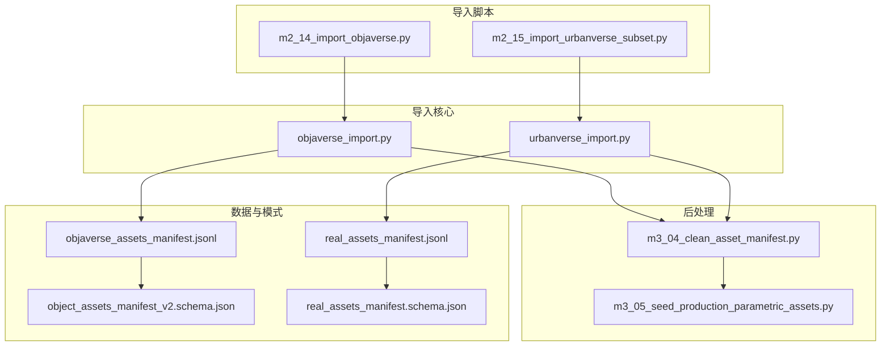
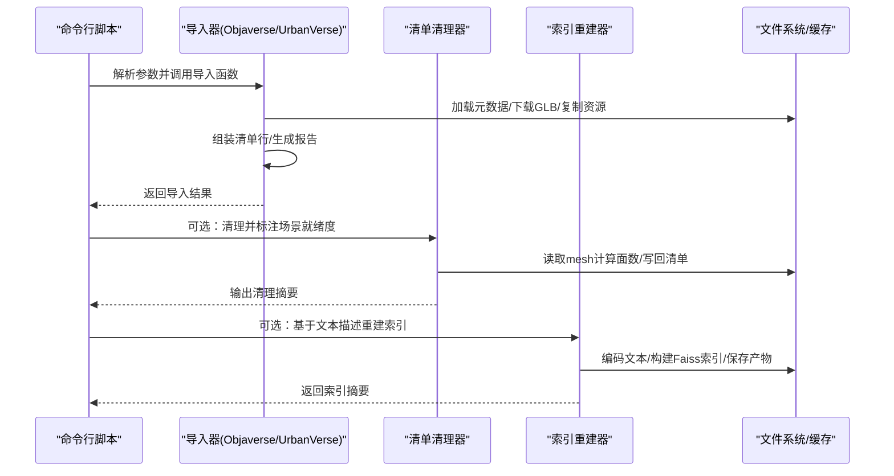
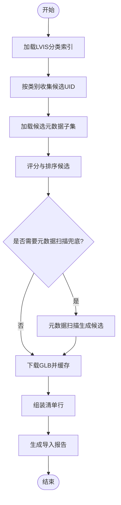
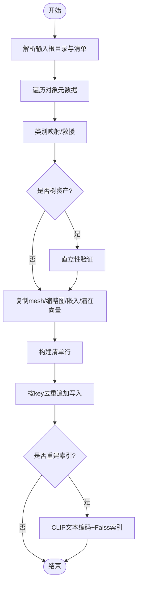
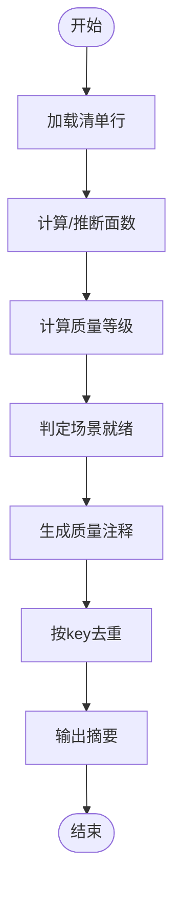
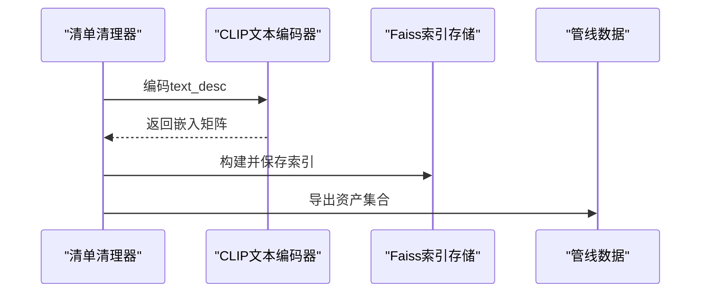
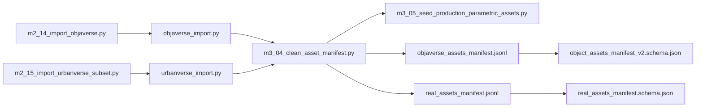

# 资产导入流程

<cite>
**本文档引用的文件**
- [src/roadgen3d/objaverse_import.py](file://src/roadgen3d/objaverse_import.py)
- [src/roadgen3d/urbanverse_import.py](file://src/roadgen3d/urbanverse_import.py)
- [scripts/m2_14_import_objaverse.py](file://scripts/m2_14_import_objaverse.py)
- [scripts/m2_15_import_urbanverse_subset.py](file://scripts/m2_15_import_urbanverse_subset.py)
- [scripts/m3_04_clean_asset_manifest.py](file://scripts/m3_04_clean_asset_manifest.py)
- [scripts/m3_05_seed_production_parametric_assets.py](file://scripts/m3_05_seed_production_parametric_assets.py)
- [data/schemas/object_assets_manifest_v2.schema.json](file://data/schemas/object_assets_manifest_v2.schema.json)
- [data/schemas/real_assets_manifest.schema.json](file://data/schemas/real_assets_manifest.schema.json)
- [data/real/objaverse_assets_manifest.jsonl](file://data/real/objaverse_assets_manifest.jsonl)
- [data/real/real_assets_manifest.jsonl](file://data/real/real_assets_manifest.jsonl)
</cite>

## 目录
1. [简介](#简介)
2. [项目结构](#项目结构)
3. [核心组件](#核心组件)
4. [架构总览](#架构总览)
5. [详细组件分析](#详细组件分析)
6. [依赖关系分析](#依赖关系分析)
7. [性能考虑](#性能考虑)
8. [故障排除指南](#故障排除指南)
9. [结论](#结论)
10. [附录](#附录)

## 简介
本文件系统性地文档化 RoadGen3D 的资产导入流程，覆盖以下关键能力：
- Objaverse 资产导入：从元数据筛选、下载缓存到清单生成与质量标注的完整流水线
- UrbanVerse 子集导入：大规模真实数据处理、增量更新与索引重建
- 资产清单管理：manifest 文件解析、版本控制与依赖追踪
- 真实数据链路：mesh_ref 模式与 Shape-E 集成（如适用）
- 性能优化：并行处理、内存管理与错误恢复
- 工具使用：命令行参数、配置选项与故障排除

## 项目结构
本项目的资产导入相关代码主要分布在以下模块：
- 导入核心逻辑：src/roadgen3d 下的 objaverse_import.py 与 urbanverse_import.py
- 命令行入口：scripts/m2_*_import_*.py
- 清理与索引：scripts/m3_04_clean_asset_manifest.py 与 scripts/m3_05_seed_production_parametric_assets.py
- 数据与模式：data/real 下的 manifest 文件与 data/schemas 下的 JSON Schema

**图表来源**
- [scripts/m2_14_import_objaverse.py:1-223](file://scripts/m2_14_import_objaverse.py#L1-L223)
- [scripts/m2_15_import_urbanverse_subset.py:1-68](file://scripts/m2_15_import_urbanverse_subset.py#L1-L68)
- [src/roadgen3d/objaverse_import.py:1-680](file://src/roadgen3d/objaverse_import.py#L1-L680)
- [src/roadgen3d/urbanverse_import.py:1-886](file://src/roadgen3d/urbanverse_import.py#L1-L886)
- [scripts/m3_04_clean_asset_manifest.py:1-322](file://scripts/m3_04_clean_asset_manifest.py#L1-L322)
- [scripts/m3_05_seed_production_parametric_assets.py:1-344](file://scripts/m3_05_seed_production_parametric_assets.py#L1-L344)
- [data/real/objaverse_assets_manifest.jsonl:1-125](file://data/real/objaverse_assets_manifest.jsonl#L1-L125)
- [data/real/real_assets_manifest.jsonl:1-144](file://data/real/real_assets_manifest.jsonl#L1-L144)
- [data/schemas/object_assets_manifest_v2.schema.json:1-45](file://data/schemas/object_assets_manifest_v2.schema.json#L1-L45)
- [data/schemas/real_assets_manifest.schema.json:1-56](file://data/schemas/real_assets_manifest.schema.json#L1-L56)

**章节来源**
- [scripts/m2_14_import_objaverse.py:1-223](file://scripts/m2_14_import_objaverse.py#L1-L223)
- [scripts/m2_15_import_urbanverse_subset.py:1-68](file://scripts/m2_15_import_urbanverse_subset.py#L1-L68)
- [src/roadgen3d/objaverse_import.py:1-680](file://src/roadgen3d/objaverse_import.py#L1-L680)
- [src/roadgen3d/urbanverse_import.py:1-886](file://src/roadgen3d/urbanverse_import.py#L1-L886)
- [scripts/m3_04_clean_asset_manifest.py:1-322](file://scripts/m3_04_clean_asset_manifest.py#L1-L322)
- [scripts/m3_05_seed_production_parametric_assets.py:1-344](file://scripts/m3_05_seed_production_parametric_assets.py#L1-L344)
- [data/real/objaverse_assets_manifest.jsonl:1-125](file://data/real/objaverse_assets_manifest.jsonl#L1-L125)
- [data/real/real_assets_manifest.jsonl:1-144](file://data/real/real_assets_manifest.jsonl#L1-L144)
- [data/schemas/object_assets_manifest_v2.schema.json:1-45](file://data/schemas/object_assets_manifest_v2.schema.json#L1-L45)
- [data/schemas/real_assets_manifest.schema.json:1-56](file://data/schemas/real_assets_manifest.schema.json#L1-L56)

## 核心组件
- Objaverse 导入器：负责目标类别定义、元数据加载、候选评分、下载与清单生成
- UrbanVerse 导入器：负责子集目录解析、对象/地面/天空三类资产导入、质量检查与增量写入
- 清理器：为 manifest 行补充场景就绪度、质量等级与注释，支持去重与汇总
- 生产种子：生成标准化生产级参数化资产，并重建文本检索索引

**章节来源**
- [src/roadgen3d/objaverse_import.py:13-183](file://src/roadgen3d/objaverse_import.py#L13-L183)
- [src/roadgen3d/urbanverse_import.py:69-283](file://src/roadgen3d/urbanverse_import.py#L69-L283)
- [scripts/m3_04_clean_asset_manifest.py:10-322](file://scripts/m3_04_clean_asset_manifest.py#L10-L322)
- [scripts/m3_05_seed_production_parametric_assets.py:28-304](file://scripts/m3_05_seed_production_parametric_assets.py#L28-L304)

## 架构总览
下图展示从命令行到最终清单与索引的整体流程：

**图表来源**
- [scripts/m2_14_import_objaverse.py:65-135](file://scripts/m2_14_import_objaverse.py#L65-L135)
- [scripts/m2_15_import_urbanverse_subset.py:40-63](file://scripts/m2_15_import_urbanverse_subset.py#L40-L63)
- [src/roadgen3d/objaverse_import.py:474-556](file://src/roadgen3d/objaverse_import.py#L474-L556)
- [src/roadgen3d/urbanverse_import.py:79-283](file://src/roadgen3d/urbanverse_import.py#L79-L283)
- [scripts/m3_04_clean_asset_manifest.py:259-260](file://scripts/m3_04_clean_asset_manifest.py#L259-L260)
- [scripts/m3_05_seed_production_parametric_assets.py:170-217](file://scripts/m3_05_seed_production_parametric_assets.py#L170-L217)

## 详细组件分析

### Objaverse 资产导入流程
- 目标类别与评分规则：通过目标规范定义类别、关键词、主题标签与面数阈值；评分综合正负向关键词命中、标签与许可信息
- 元数据与候选池：加载 LVIS 分类索引，按别名收集候选 UID；对缺失 LVIS 的类别进行元数据扫描兜底
- 下载与缓存：使用配置后的 objaverse 库批量下载 GLB，返回路径映射
- 清单生成：将候选转为 RoadGen3D 清单格式，包含 mesh 路径、潜在向量占位、质量指标与来源信息
- 报告与去重：输出选择统计、下载计数与路径映射；支持按 asset_id 去重追加写入

**图表来源**
- [src/roadgen3d/objaverse_import.py:196-556](file://src/roadgen3d/objaverse_import.py#L196-L556)

**章节来源**
- [src/roadgen3d/objaverse_import.py:66-183](file://src/roadgen3d/objaverse_import.py#L66-L183)
- [src/roadgen3d/objaverse_import.py:204-413](file://src/roadgen3d/objaverse_import.py#L204-L413)
- [src/roadgen3d/objaverse_import.py:415-556](file://src/roadgen3d/objaverse_import.py#L415-L556)
- [scripts/m2_14_import_objaverse.py:65-135](file://scripts/m2_14_import_objaverse.py#L65-L135)

### UrbanVerse 子集导入流程
- 输入与输出：输入为包含 metadata/*.jsonl 与源资产的目录包；输出为对象/地面/天空三类清单与审计文件
- 类别映射与救援：通过别名表与关键词救援实现类别归一化；不支持类别可标记为仅报告
- 质量检查：树资产执行直立性验证；其他资产复制 mesh、缩略图、外观嵌入与潜在向量
- 增量更新：支持将新行按 key 去重追加写入现有清单，保留已有记录
- 索引重建：在追加后可触发基于 CLIP 文本编码的 Faiss 索引重建

**图表来源**
- [src/roadgen3d/urbanverse_import.py:79-283](file://src/roadgen3d/urbanverse_import.py#L79-L283)
- [src/roadgen3d/urbanverse_import.py:509-703](file://src/roadgen3d/urbanverse_import.py#L509-L703)

**章节来源**
- [src/roadgen3d/urbanverse_import.py:29-88](file://src/roadgen3d/urbanverse_import.py#L29-L88)
- [src/roadgen3d/urbanverse_import.py:509-703](file://src/roadgen3d/urbanverse_import.py#L509-L703)
- [scripts/m2_15_import_urbanverse_subset.py:40-63](file://scripts/m2_15_import_urbanverse_subset.py#L40-L63)

### 清单管理与质量标注
- 场景就绪度判定：综合面数阈值、质量等级、预览运行时、树资产直立性等条件
- 质量等级：按类别设定阈值，结合生成器类型与运行时进行升降级
- 注释规范化：去除受控注释，保留自定义注释，统一生成标准注释
- 去重与汇总：按 asset_id 去重，输出场景就绪/阻塞与各等级分布

**图表来源**
- [scripts/m3_04_clean_asset_manifest.py:259-260](file://scripts/m3_04_clean_asset_manifest.py#L259-L260)
- [scripts/m3_04_clean_asset_manifest.py:145-244](file://scripts/m3_04_clean_asset_manifest.py#L145-L244)

**章节来源**
- [scripts/m3_04_clean_asset_manifest.py:10-322](file://scripts/m3_04_clean_asset_manifest.py#L10-L322)

### 真实数据链路与索引重建
- 索引构建：基于文本描述进行 CLIP 编码，保存嵌入与 ID 映射，构建 Faiss 内积索引
- 管道数据：导出用于管线的资产集合，便于检索与组合
- 与导入联动：Objaverse/UrbanVerse 导入后可直接触发索引重建，或在清单清理后进行

**图表来源**
- [scripts/m3_05_seed_production_parametric_assets.py:170-217](file://scripts/m3_05_seed_production_parametric_assets.py#L170-L217)

**章节来源**
- [scripts/m3_05_seed_production_parametric_assets.py:170-304](file://scripts/m3_05_seed_production_parametric_assets.py#L170-L304)

## 依赖关系分析
- 导入脚本依赖对应导入器模块完成具体流程
- 清理器依赖 trimesh 计算 mesh 面数，依赖清单路径解析绝对/相对路径
- 索引重建依赖 CLIP 文本编码器与 Faiss 存储
- 清单模式约束字段与枚举，确保数据一致性

**图表来源**
- [scripts/m2_14_import_objaverse.py:19-27](file://scripts/m2_14_import_objaverse.py#L19-L27)
- [scripts/m2_15_import_urbanverse_subset.py](file://scripts/m2_15_import_urbanverse_subset.py#L19)
- [src/roadgen3d/objaverse_import.py:1-12](file://src/roadgen3d/objaverse_import.py#L1-L12)
- [src/roadgen3d/urbanverse_import.py:1-12](file://src/roadgen3d/urbanverse_import.py#L1-L12)
- [scripts/m3_04_clean_asset_manifest.py:19-32](file://scripts/m3_04_clean_asset_manifest.py#L19-L32)
- [scripts/m3_05_seed_production_parametric_assets.py:21-26](file://scripts/m3_05_seed_production_parametric_assets.py#L21-L26)
- [data/real/objaverse_assets_manifest.jsonl:1-125](file://data/real/objaverse_assets_manifest.jsonl#L1-L125)
- [data/real/real_assets_manifest.jsonl:1-144](file://data/real/real_assets_manifest.jsonl#L1-L144)
- [data/schemas/object_assets_manifest_v2.schema.json:1-45](file://data/schemas/object_assets_manifest_v2.schema.json#L1-L45)
- [data/schemas/real_assets_manifest.schema.json:1-56](file://data/schemas/real_assets_manifest.schema.json#L1-L56)

**章节来源**
- [scripts/m2_14_import_objaverse.py:19-27](file://scripts/m2_14_import_objaverse.py#L19-L27)
- [scripts/m2_15_import_urbanverse_subset.py](file://scripts/m2_15_import_urbanverse_subset.py#L19)
- [scripts/m3_04_clean_asset_manifest.py:19-32](file://scripts/m3_04_clean_asset_manifest.py#L19-L32)
- [scripts/m3_05_seed_production_parametric_assets.py:21-26](file://scripts/m3_05_seed_production_parametric_assets.py#L21-L26)

## 性能考虑
- 并行下载：Objaverse 导入支持多进程下载，显著提升网络 I/O 密集阶段吞吐
- 批量处理：UrbanVerse 导入按阶段批处理，减少重复 IO
- 内存管理：清单清理使用 trimesh 按需加载 mesh，避免一次性加载大场景导致内存峰值过高
- 增量更新：清单追加采用字典去重，避免全量重写，降低磁盘压力
- 索引重建：文本编码与索引构建可配置设备与模型目录，便于离线/本地加速

**章节来源**
- [src/roadgen3d/objaverse_import.py:415-428](file://src/roadgen3d/objaverse_import.py#L415-L428)
- [src/roadgen3d/urbanverse_import.py:304-325](file://src/roadgen3d/urbanverse_import.py#L304-L325)
- [scripts/m3_04_clean_asset_manifest.py:47-72](file://scripts/m3_04_clean_asset_manifest.py#L47-L72)
- [scripts/m3_05_seed_production_parametric_assets.py:170-217](file://scripts/m3_05_seed_production_parametric_assets.py#L170-L217)

## 故障排除指南
- 依赖缺失
  - 清理器缺少 trimesh：安装 trimesh 后重试
  - 索引重建缺少 PyTorch：安装 torch 或使用占位潜向量
- 下载失败
  - 检查网络与缓存路径权限；确认 Objaverse 凭据与可用性
- 清单校验失败
  - 使用 JSON Schema 校验清单字段完整性；关注必需字段与枚举值
- 增量写入异常
  - 确认 key 字段（如 asset_id/material_id/sky_id）唯一且非空
- 索引为空
  - 确认清单非空且包含 text_desc；检查设备与模型目录配置

**章节来源**
- [scripts/m3_04_clean_asset_manifest.py:19-24](file://scripts/m3_04_clean_asset_manifest.py#L19-L24)
- [scripts/m3_05_seed_production_parametric_assets.py:112-119](file://scripts/m3_05_seed_production_parametric_assets.py#L112-L119)
- [data/schemas/object_assets_manifest_v2.schema.json:7-16](file://data/schemas/object_assets_manifest_v2.schema.json#L7-L16)
- [data/schemas/real_assets_manifest.schema.json:7-16](file://data/schemas/real_assets_manifest.schema.json#L7-L16)

## 结论
本流程以模块化方式实现了从外部数据源到场景可用资产的全链路导入与管理。通过目标导向的评分、严格的场景就绪判定与增量更新机制，保障了资产质量与工程效率。配合索引重建，进一步提升了检索与组合能力。

## 附录

### Objaverse 导入工具使用指南
- 主要参数
  - --cache-root：Objaverse 缓存根目录
  - --output-manifest：输出清单路径
  - --append-manifest：追加写入的目标清单（按 asset_id 去重）
  - --latents-dir：潜在向量占位目录
  - --categories：目标类别列表，默认推荐首波类别
  - --max-per-category：每类最大候选数
  - --download-processes：下载并发数
  - --split：数据划分（train/val/test）
  - --clean-manifest：是否清理并标注场景就绪度
  - --rebuild-index：是否重建检索索引
  - --artifacts-dir、--model-name、--model-dir、--local-files-only、--device：索引重建相关

**章节来源**
- [scripts/m2_14_import_objaverse.py:138-189](file://scripts/m2_14_import_objaverse.py#L138-L189)

### UrbanVerse 导入工具使用指南
- 主要参数
  - --input-root：包含 metadata/*.jsonl 与源资产的目录
  - --subset-name：子集名称（用于输出路径与 source_dataset）
  - --output-root、--cache-root：输出与缓存根目录
  - --append-object-manifest、--append-ground-manifest、--append-sky-manifest：三类清单追加目标
  - --rebuild-index、--artifacts-dir、--model-name、--model-dir、--local-files-only、--device：同上

**章节来源**
- [scripts/m2_15_import_urbanverse_subset.py:22-37](file://scripts/m2_15_import_urbanverse_subset.py#L22-L37)

### 清单模式与字段说明
- 对象资产清单（v2）：必需字段包括 asset_id、category、text_desc、mesh_path、latent_path、source_dataset、license、split
- 真实资产清单（v1）：必需字段包括 asset_id、category、text_desc、mesh_path、latent_path、license、source、split

**章节来源**
- [data/schemas/object_assets_manifest_v2.schema.json:7-16](file://data/schemas/object_assets_manifest_v2.schema.json#L7-L16)
- [data/schemas/real_assets_manifest.schema.json:7-16](file://data/schemas/real_assets_manifest.schema.json#L7-L16)