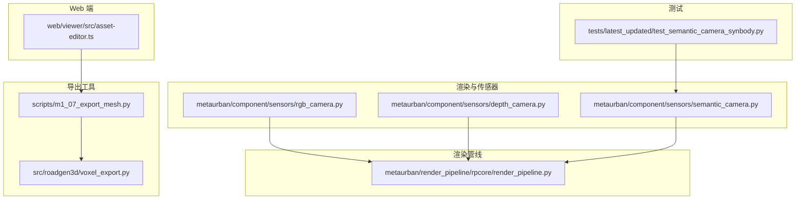
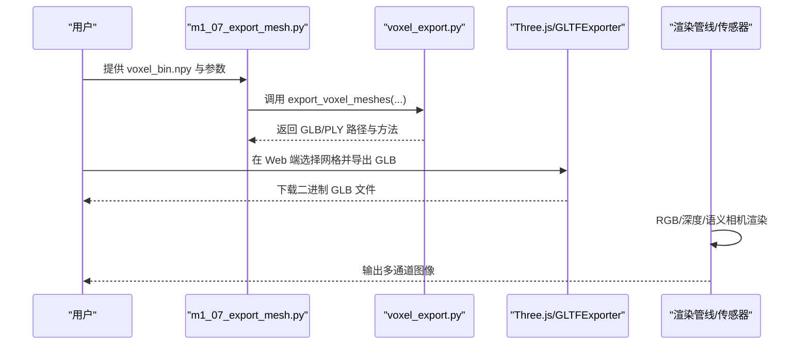
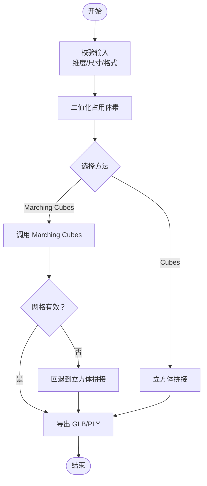
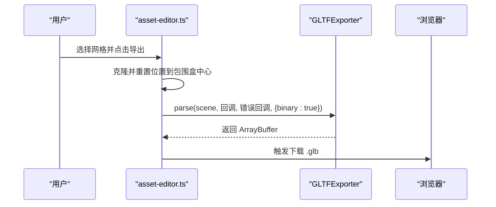
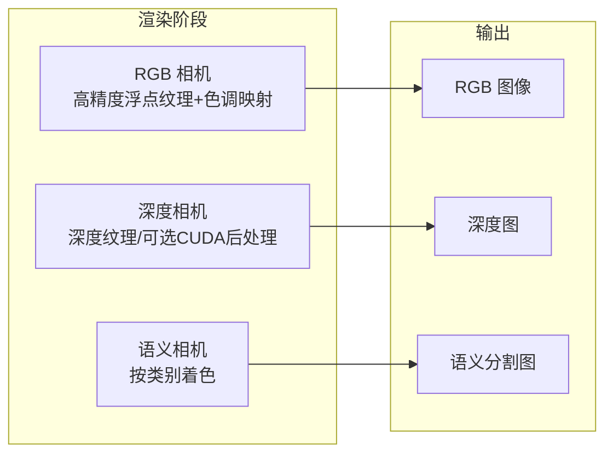
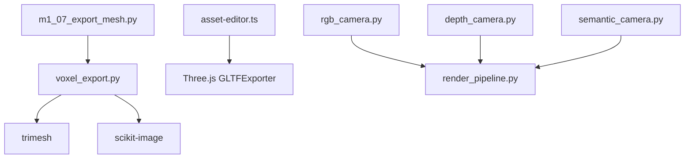

# 资产导出格式

<cite>
**本文引用的文件**
- [voxel_export.py](file://src/roadgen3d/voxel_export.py)
- [m1_07_export_mesh.py](file://scripts/m1_07_export_mesh.py)
- [pipeline.py](file://src/roadgen3d/pipeline.py)
- [asset-editor.ts](file://web/viewer/src/asset-editor.ts)
- [semantic_camera.py](file://metaurban/metaurban/component/sensors/semantic_camera.py)
- [depth_camera.py](file://metaurban/metaurban/component/sensors/depth_camera.py)
- [rgb_camera.py](file://metaurban/metaurban/component/sensors/rgb_camera.py)
- [render_pipeline.py](file://metaurban/metaurban/render_pipeline/rpcore/render_pipeline.py)
- [test_semantic_camera_synbody.py](file://metaurban/metaurban/tests/latest_updated/test_semantic_camera_synbody.py)
</cite>

## 目录
1. [简介](#简介)
2. [项目结构](#项目结构)
3. [核心组件](#核心组件)
4. [架构总览](#架构总览)
5. [详细组件分析](#详细组件分析)
6. [依赖关系分析](#依赖关系分析)
7. [性能考量](#性能考量)
8. [故障排查指南](#故障排查指南)
9. [结论](#结论)
10. [附录](#附录)

## 简介
本技术文档聚焦于 RoadGen3D 项目中的资产导出格式与流程，覆盖以下主题：
- GLB 格式导出：PBR 材质处理、纹理压缩与二进制序列化路径
- PLY 格式导出：顶点属性、法向量与颜色信息的保存策略
- 体素网格导出：体素化算法、分辨率设置与体积重建
- 多通道渲染导出：深度图、法线贴图与语义分割图
- 格式转换工具：批量处理、质量参数配置与性能优化
- 不同格式的适用场景与选择建议

文档在每个涉及具体实现的章节均提供“章节来源”，并在涉及真实代码结构的图表中提供“图表来源”。

## 项目结构
围绕导出能力的关键目录与文件如下：
- 导出工具与脚本：scripts/m1_07_export_mesh.py、src/roadgen3d/voxel_export.py
- Web 端导出：web/viewer/src/asset-editor.ts（GLB 导出）
- 渲染与传感器：metaurban/metaurban/component/sensors/*（RGB、深度、语义相机）
- 渲染管线：metaurban/metaurban/render_pipeline/rpcore/render_pipeline.py
- 测试用例：metaurban/metaurban/tests/latest_updated/test_semantic_camera_synbody.py

**图表来源**
- [m1_07_export_mesh.py:1-64](file://scripts/m1_07_export_mesh.py#L1-L64)
- [voxel_export.py:1-142](file://src/roadgen3d/voxel_export.py#L1-L142)
- [asset-editor.ts:585-597](file://web/viewer/src/asset-editor.ts#L585-L597)
- [rgb_camera.py:1-86](file://metaurban/metaurban/component/sensors/rgb_camera.py#L1-L86)
- [depth_camera.py:30-66](file://metaurban/metaurban/component/sensors/depth_camera.py#L30-L66)
- [semantic_camera.py:1-70](file://metaurban/metaurban/component/sensors/semantic_camera.py#L1-L70)
- [render_pipeline.py:1-200](file://metaurban/metaurban/render_pipeline/rpcore/render_pipeline.py#L1-L200)
- [test_semantic_camera_synbody.py:114-133](file://metaurban/metaurban/tests/latest_updated/test_semantic_camera_synbody.py#L114-L133)

**章节来源**
- [m1_07_export_mesh.py:1-64](file://scripts/m1_07_export_mesh.py#L1-L64)
- [voxel_export.py:1-142](file://src/roadgen3d/voxel_export.py#L1-L142)
- [asset-editor.ts:585-597](file://web/viewer/src/asset-editor.ts#L585-L597)
- [rgb_camera.py:1-86](file://metaurban/metaurban/component/sensors/rgb_camera.py#L1-L86)
- [depth_camera.py:30-66](file://metaurban/metaurban/component/sensors/depth_camera.py#L30-L66)
- [semantic_camera.py:1-70](file://metaurban/metaurban/component/sensors/semantic_camera.py#L1-L70)
- [render_pipeline.py:1-200](file://metaurban/metaurban/render_pipeline/rpcore/render_pipeline.py#L1-L200)
- [test_semantic_camera_synbody.py:114-133](file://metaurban/metaurban/tests/latest_updated/test_semantic_camera_synbody.py#L114-L133)

## 核心组件
- 体素网格导出器：负责将三维占用体素转换为 GLB/PLY 网格，支持 Marching Cubes 与立方体拼接两种方法，并自动回退。
- 批量导出脚本：命令行入口，接收体素二值数组并输出多种格式文件。
- Web 端 GLB 导出：基于 Three.js 的 GLTFExporter，生成二进制 GLB 并触发下载。
- 多通道渲染传感器：RGB、深度、语义相机分别输出对应通道图像，用于下游数据集构建或可视化。

**章节来源**
- [voxel_export.py:79-141](file://src/roadgen3d/voxel_export.py#L79-L141)
- [m1_07_export_mesh.py:21-62](file://scripts/m1_07_export_mesh.py#L21-L62)
- [asset-editor.ts:585-597](file://web/viewer/src/asset-editor.ts#L585-L597)
- [rgb_camera.py:12-86](file://metaurban/metaurban/component/sensors/rgb_camera.py#L12-L86)
- [depth_camera.py:30-66](file://metaurban/metaurban/component/sensors/depth_camera.py#L30-L66)
- [semantic_camera.py:10-70](file://metaurban/metaurban/component/sensors/semantic_camera.py#L10-L70)

## 架构总览
下图展示从体素到网格再到多通道渲染的整体导出链路：

**图表来源**
- [m1_07_export_mesh.py:32-58](file://scripts/m1_07_export_mesh.py#L32-L58)
- [voxel_export.py:79-141](file://src/roadgen3d/voxel_export.py#L79-L141)
- [asset-editor.ts:585-597](file://web/viewer/src/asset-editor.ts#L585-L597)
- [rgb_camera.py:26-86](file://metaurban/metaurban/component/sensors/rgb_camera.py#L26-L86)
- [depth_camera.py:34-66](file://metaurban/metaurban/component/sensors/depth_camera.py#L34-L66)
- [semantic_camera.py:25-70](file://metaurban/metaurban/component/sensors/semantic_camera.py#L25-L70)

## 详细组件分析

### 体素网格导出（GLB/PLY）
- 输入：三维占用体素数组（二值或概率），体素边长，导出格式（glb/ply/both）与重建方法（marching_cubes/cubes）。
- 处理流程：
  - 验证输入维度与参数范围
  - 将概率体素转为二值占用
  - 优先使用 Marching Cubes 生成平滑网格；若失败则回退至立方体拼接
  - 使用 trimesh 导出为 GLB 或 PLY
- 输出：返回包含 GLB/PLY 绝对路径与实际使用的重建方法的字典。

**图表来源**
- [voxel_export.py:79-141](file://src/roadgen3d/voxel_export.py#L79-L141)

**章节来源**
- [voxel_export.py:12-142](file://src/roadgen3d/voxel_export.py#L12-L142)
- [m1_07_export_mesh.py:21-62](file://scripts/m1_07_export_mesh.py#L21-L62)
- [pipeline.py:74-95](file://src/roadgen3d/pipeline.py#L74-L95)

### Web 端 GLB 导出（PBR 材质与二进制序列化）
- 功能：在浏览器中选择网格对象，克隆并居中后通过 Three.js 的 GLTFExporter 导出二进制 GLB。
- 关键点：
  - 使用 binary 模式导出，确保二进制块按规范写入
  - 导出前进行几何与材质的清理与复位，保证导出一致性
- 适用场景：快速预览与分享单个网格资产。

**图表来源**
- [asset-editor.ts:585-597](file://web/viewer/src/asset-editor.ts#L585-L597)
- [asset-editor.ts:1720-1754](file://web/viewer/src/asset-editor.ts#L1720-L1754)

**章节来源**
- [asset-editor.ts:585-597](file://web/viewer/src/asset-editor.ts#L585-L597)
- [asset-editor.ts:1720-1754](file://web/viewer/src/asset-editor.ts#L1720-L1754)

### 多通道渲染导出（深度图、法线贴图、语义分割）
- 深度图导出：深度相机创建专用帧缓冲区，渲染仅输出深度纹理，可选 CUDA 计算着色器进行后处理。
- 语义分割导出：语义相机通过标签状态键为不同对象类别分配固定颜色，输出语义掩码图像。
- RGB 图像：RGB 相机使用高精度浮点纹理与色调映射后处理，适配不同平台的多重采样设置。
- 测试示例：将背面、顶面、侧面的语义图拼接显示，验证多视角语义一致性。

**图表来源**
- [rgb_camera.py:26-86](file://metaurban/metaurban/component/sensors/rgb_camera.py#L26-L86)
- [depth_camera.py:34-66](file://metaurban/metaurban/component/sensors/depth_camera.py#L34-L66)
- [semantic_camera.py:25-70](file://metaurban/metaurban/component/sensors/semantic_camera.py#L25-L70)
- [test_semantic_camera_synbody.py:114-133](file://metaurban/metaurban/tests/latest_updated/test_semantic_camera_synbody.py#L114-L133)

**章节来源**
- [rgb_camera.py:12-86](file://metaurban/metaurban/component/sensors/rgb_camera.py#L12-L86)
- [depth_camera.py:30-66](file://metaurban/metaurban/component/sensors/depth_camera.py#L30-L66)
- [semantic_camera.py:10-70](file://metaurban/metaurban/component/sensors/semantic_camera.py#L10-L70)
- [test_semantic_camera_synbody.py:114-133](file://metaurban/metaurban/tests/latest_updated/test_semantic_camera_synbody.py#L114-L133)

### PLY 格式导出要点（顶点、法向量、颜色）
- 顶点属性：由体素重建得到的三角网格包含顶点坐标与面索引。
- 法向量：Marching Cubes 会计算每个顶点的法向量，导出时保留以提升光照与着色质量。
- 颜色信息：若源模型具备顶点颜色，导出时应包含颜色通道；否则可为空或默认白模。
- 注意事项：确保导出时使用合适的顶点格式（含法线与颜色）以兼容下游渲染管线。

**章节来源**
- [voxel_export.py:56-77](file://src/roadgen3d/voxel_export.py#L56-L77)

### PBR 材质处理与纹理压缩
- PBR 材质：渲染管线与相机设置中包含基础反照率、粗糙度与折射率等参数，这些参数在导出 GLB 时通常被序列化到 glTF 的材质字段。
- 纹理压缩：Web 端导出 GLB 采用二进制模式，二进制缓冲区按 glTF 规范写入；纹理压缩策略取决于上游纹理资源与导出器配置。
- 建议：在导入下游引擎时启用目标平台的纹理压缩格式（如 ASTC、ETC2、S3TC），以平衡质量与体积。

**章节来源**
- [render_pipeline.py:677-701](file://metaurban/metaurban/render_pipeline/rpcore/render_pipeline.py#L677-L701)
- [asset-editor.ts:585-597](file://web/viewer/src/asset-editor.ts#L585-L597)

## 依赖关系分析
- 体素导出依赖 trimesh 与 scikit-image（Marching Cubes）；命令行脚本通过模块导入调用导出器。
- Web 端导出依赖 Three.js 的 GLTFExporter；导出前需确保几何与材质状态一致。
- 多通道渲染依赖 Panda3D 的相机与帧缓冲管理，语义相机通过标签状态键实现类别级着色。

**图表来源**
- [m1_07_export_mesh.py:18-18](file://scripts/m1_07_export_mesh.py#L18-L18)
- [voxel_export.py:33-38](file://src/roadgen3d/voxel_export.py#L33-L38)
- [asset-editor.ts:585-597](file://web/viewer/src/asset-editor.ts#L585-L597)
- [rgb_camera.py:32-66](file://metaurban/metaurban/component/sensors/rgb_camera.py#L32-L66)
- [depth_camera.py:34-66](file://metaurban/metaurban/component/sensors/depth_camera.py#L34-L66)
- [semantic_camera.py:32-69](file://metaurban/metaurban/component/sensors/semantic_camera.py#L32-L69)
- [render_pipeline.py:1-200](file://metaurban/metaurban/render_pipeline/rpcore/render_pipeline.py#L1-L200)

**章节来源**
- [m1_07_export_mesh.py:1-64](file://scripts/m1_07_export_mesh.py#L1-L64)
- [voxel_export.py:1-142](file://src/roadgen3d/voxel_export.py#L1-L142)
- [asset-editor.ts:585-597](file://web/viewer/src/asset-editor.ts#L585-L597)
- [rgb_camera.py:1-86](file://metaurban/metaurban/component/sensors/rgb_camera.py#L1-L86)
- [depth_camera.py:30-66](file://metaurban/metaurban/component/sensors/depth_camera.py#L30-L66)
- [semantic_camera.py:1-70](file://metaurban/metaurban/component/sensors/semantic_camera.py#L1-L70)
- [render_pipeline.py:1-200](file://metaurban/metaurban/render_pipeline/rpcore/render_pipeline.py#L1-L200)

## 性能考量
- 体素重建
  - Marching Cubes：适合平滑表面，但计算开销较大；若体素分辨率较高，建议先降采样或限制网格面数。
  - 立方体拼接：速度更快，适合快速预览与体积重建。
- 多通道渲染
  - 深度与语义图可使用较低精度格式（如 8bit）以减少带宽与存储；RGB 可根据需求选择 16bit 浮点纹理。
  - 合理设置帧缓冲多重采样，避免过度采样导致内存与传输压力。
- GLB 导出
  - 二进制 GLB 更利于网络传输与加载；若需要文本可读性，可选择 glTF 文本格式，但体积更大。
  - 导出前尽量简化几何与材质数量，移除冗余节点与重复材质。

[本节为通用性能建议，不直接分析具体文件]

## 故障排查指南
- 体素导出报错
  - “占用体素为空”：检查输入是否全零；必要时添加小占位体素以避免空网格。
  - “缺少依赖”：安装 trimesh 与 scikit-image；确认 Python 路径正确。
- Web 端导出失败
  - 几何未居中：导出前确保网格已按包围盒中心重置，避免偏移导致视觉异常。
  - 材质/纹理问题：导出前清理材质引用，避免循环依赖。
- 多通道渲染异常
  - 语义图颜色异常：检查语义标签状态键与类别颜色映射是否正确应用。
  - 深度图异常：确认深度纹理格式与后处理通道是否启用。

**章节来源**
- [voxel_export.py:41-53](file://src/roadgen3d/voxel_export.py#L41-L53)
- [asset-editor.ts:1736-1751](file://web/viewer/src/asset-editor.ts#L1736-L1751)
- [semantic_camera.py:32-69](file://metaurban/metaurban/component/sensors/semantic_camera.py#L32-L69)
- [depth_camera.py:34-66](file://metaurban/metaurban/component/sensors/depth_camera.py#L34-L66)

## 结论
- GLB/PLY 导出在 RoadGen3D 中通过体素重建与 Web 端工具实现，具备良好的跨平台兼容性与体积控制。
- 多通道渲染（深度、语义）为下游任务提供了高质量的辅助数据，建议结合平台特性选择合适的纹理格式与分辨率。
- 体素导出流程清晰，具备稳健的回退策略；建议在大规模场景中优先考虑立方体拼接以提升效率。

[本节为总结性内容，不直接分析具体文件]

## 附录

### 格式选择与使用建议
- GLB
  - 适用：在线预览、引擎导入、体积较小的资产分发
  - 优势：二进制紧凑、加载高效
  - 注意：导出前精简几何与材质
- PLY
  - 适用：科研与可视化、需要法向量与颜色的场景
  - 优势：简单直观、便于二次处理
  - 注意：确保顶点格式包含所需属性
- 深度图/语义分割图
  - 适用：SLAM、语义理解、渲染后处理
  - 建议：按需选择 8bit/16bit 格式，合理设置分辨率

[本节为通用建议，不直接分析具体文件]