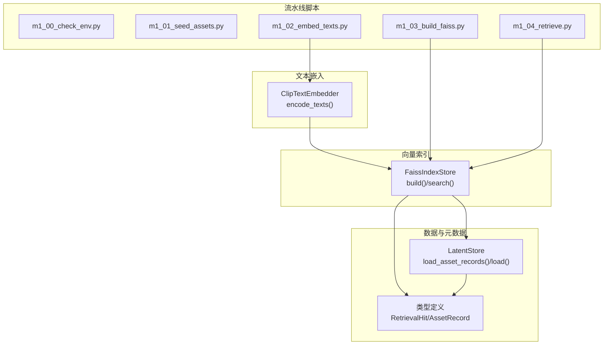
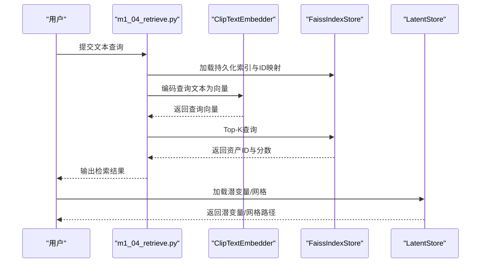
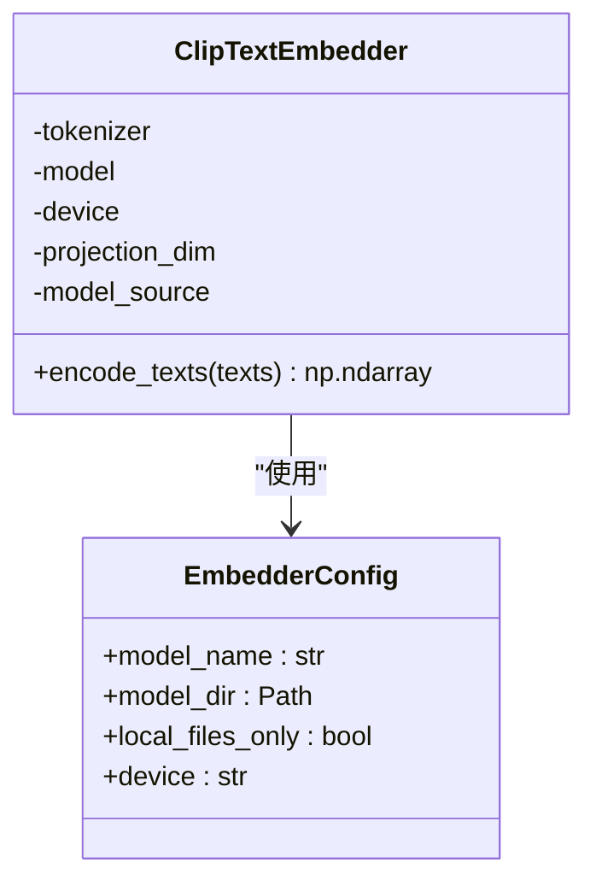
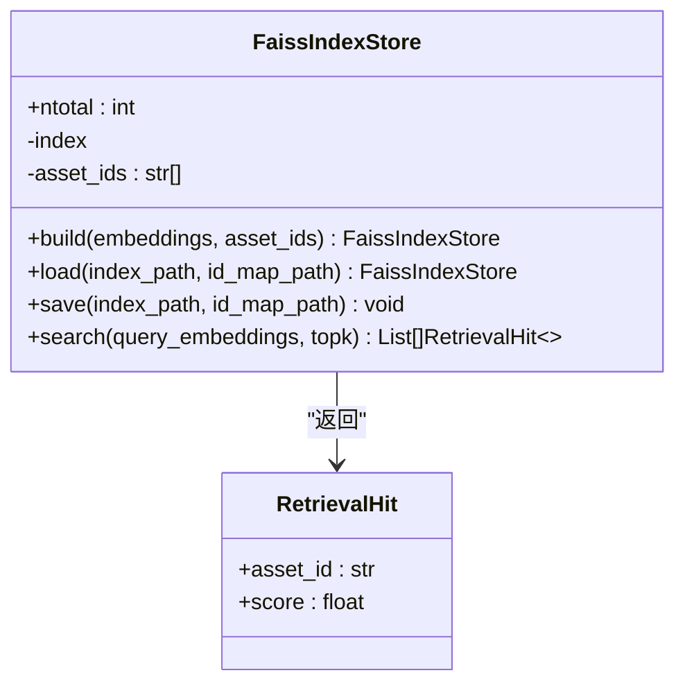
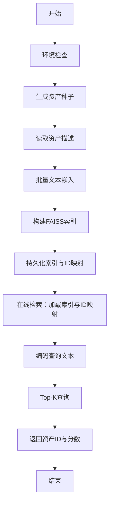
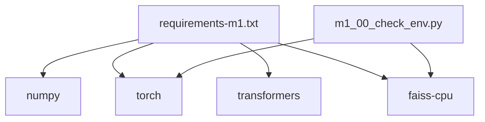

# 资产检索系统

<cite>
**本文档引用的文件**
- [embedder.py](file://src/roadgen3d/embedder.py)
- [index_store.py](file://src/roadgen3d/index_store.py)
- [types.py](file://src/roadgen3d/types.py)
- [latent_store.py](file://src/roadgen3d/latent_store.py)
- [decoder.py](file://src/roadgen3d/decoder.py)
- [m1_00_check_env.py](file://scripts/m1_00_check_env.py)
- [m1_01_seed_assets.py](file://scripts/m1_01_seed_assets.py)
- [m1_02_embed_texts.py](file://scripts/m1_02_embed_texts.py)
- [m1_03_build_faiss.py](file://scripts/m1_03_build_faiss.py)
- [m1_04_retrieve.py](file://scripts/m1_04_retrieve.py)
- [requirements-m1.txt](file://requirements-m1.txt)
- [test_m1_pipeline.py](file://tests/test_m1_pipeline.py)
</cite>

## 目录
1. [简介](#简介)
2. [项目结构](#项目结构)
3. [核心组件](#核心组件)
4. [架构总览](#架构总览)
5. [详细组件分析](#详细组件分析)
6. [依赖关系分析](#依赖关系分析)
7. [性能考虑](#性能考虑)
8. [故障排除指南](#故障排除指南)
9. [结论](#结论)
10. [附录](#附录)

## 简介
本文件面向RoadGen3D项目的资产检索系统，提供从文本到3D资产的端到端检索技术文档。系统基于CLIP文本嵌入与FAISS向量检索，实现图像-文本对比学习与语义相似性计算，支持Top-K搜索与结果排序，并提供完整的流水线脚本与测试用例。本文档涵盖以下主题：
- CLIP文本嵌入机制：模型加载、文本编码、归一化与投影维度
- FAISS向量检索：IndexFlatIP索引构建、内存管理与查询优化
- 检索流程：从文本输入到资产匹配的完整过程
- 相似性评分算法与Top-K策略：余弦相似度（L2归一化）与Top-K选择
- 性能优化：并行处理、缓存策略与内存管理
- 实际代码示例与最佳实践

## 项目结构
资产检索系统由以下模块组成：
- 文本嵌入模块：负责加载CLIP模型并对文本进行编码，输出L2归一化的特征向量
- 向量索引模块：封装FAISS IndexFlatIP，提供索引构建、持久化与查询接口
- 数据与元数据：资产元数据读取、潜变量加载与解码
- 流水线脚本：环境检查、资产种子生成、文本嵌入、索引构建与检索执行
- 类型定义：统一的数据结构，如检索命中、资产记录等

**图表来源**
- [embedder.py:33-99](file://src/roadgen3d/embedder.py#L33-L99)
- [index_store.py:33-95](file://src/roadgen3d/index_store.py#L33-L95)
- [latent_store.py:12-80](file://src/roadgen3d/latent_store.py#L12-L80)
- [types.py:21-27](file://src/roadgen3d/types.py#L21-L27)
- [m1_02_embed_texts.py:34-63](file://scripts/m1_02_embed_texts.py#L34-L63)
- [m1_03_build_faiss.py:29-44](file://scripts/m1_03_build_faiss.py#L29-L44)
- [m1_04_retrieve.py:32-65](file://scripts/m1_04_retrieve.py#L32-L65)

**章节来源**
- [requirements-m1.txt:1-7](file://requirements-m1.txt#L1-L7)
- [m1_00_check_env.py:29-59](file://scripts/m1_00_check_env.py#L29-L59)
- [m1_01_seed_assets.py:56-78](file://scripts/m1_01_seed_assets.py#L56-L78)
- [m1_02_embed_texts.py:34-63](file://scripts/m1_02_embed_texts.py#L34-L63)
- [m1_03_build_faiss.py:29-44](file://scripts/m1_03_build_faiss.py#L29-L44)
- [m1_04_retrieve.py:32-65](file://scripts/m1_04_retrieve.py#L32-L65)

## 核心组件
- CLIP文本嵌入器：加载transformers中的CLIP模型，对文本进行分词、前向推理与L2归一化，输出固定维度的浮点向量
- FAISS索引存储：封装IndexFlatIP，支持批量添加向量、持久化与Top-K查询，返回资产ID与相似度分数
- 资产元数据与潜变量：读取JSONL格式的资产清单，解析描述与潜变量路径，安全加载潜变量或网格路径
- 解码器：将潜变量解码为体素概率场与二值占用体素，用于后续渲染或生成
- 类型定义：统一的检索命中与资产记录结构，便于跨模块传递

**章节来源**
- [embedder.py:33-99](file://src/roadgen3d/embedder.py#L33-L99)
- [index_store.py:33-95](file://src/roadgen3d/index_store.py#L33-L95)
- [latent_store.py:12-80](file://src/roadgen3d/latent_store.py#L12-L80)
- [decoder.py:24-64](file://src/roadgen3d/decoder.py#L24-L64)
- [types.py:12-27](file://src/roadgen3d/types.py#L12-L27)

## 架构总览
资产检索系统采用“离线嵌入+在线索引”的两阶段设计：
- 离线阶段：读取资产描述，使用CLIP编码为向量并保存；构建FAISS索引并持久化
- 在线阶段：接收文本查询，编码后在FAISS中进行Top-K检索，返回资产ID与分数；根据ID加载潜变量并解码

**图表来源**
- [m1_04_retrieve.py:32-65](file://scripts/m1_04_retrieve.py#L32-L65)
- [embedder.py:84-99](file://src/roadgen3d/embedder.py#L84-L99)
- [index_store.py:79-95](file://src/roadgen3d/index_store.py#L79-L95)
- [latent_store.py:57-80](file://src/roadgen3d/latent_store.py#L57-L80)

## 详细组件分析

### CLIP文本嵌入机制
- 模型加载：优先从本地目录或Hugging Face模型库加载CLIP模型与分词器，支持离线模式
- 文本编码：批量分词、张量化、移动至指定设备、前向推理、L2归一化
- 归一化与维度：输出向量按行L2归一化，确保余弦相似度等价于点积；投影维度来自配置
- 错误处理：缺失依赖、模型加载失败、版本不兼容时抛出明确异常

**图表来源**
- [embedder.py:25-31](file://src/roadgen3d/embedder.py#L25-L31)
- [embedder.py:33-99](file://src/roadgen3d/embedder.py#L33-L99)

**章节来源**
- [embedder.py:33-99](file://src/roadgen3d/embedder.py#L33-L99)

### FAISS向量检索实现
- 索引类型：IndexFlatIP（内积），用于最大化余弦相似度
- 构建流程：校验嵌入矩阵形状与ID数量一致性，创建索引并批量add
- 查询流程：校验查询矩阵为二维，调用search(topk)，过滤无效索引并组装RetrievalHit
- 持久化：索引与ID映射分别序列化，支持后续加载
- 线程控制：设置OpenMP/MKL等环境变量以避免冲突

**图表来源**
- [index_store.py:33-95](file://src/roadgen3d/index_store.py#L33-L95)
- [types.py:21-27](file://src/roadgen3d/types.py#L21-L27)

**章节来源**
- [index_store.py:33-95](file://src/roadgen3d/index_store.py#L33-L95)
- [types.py:21-27](file://src/roadgen3d/types.py#L21-L27)

### 检索流程：从文本到资产匹配
- 环境检查：生成包与设备信息报告，验证torch、faiss等依赖可用性
- 资产种子：生成模拟资产清单与随机潜变量，便于端到端测试
- 文本嵌入：读取资产描述，批量编码为向量并保存元数据
- 索引构建：加载嵌入与ID，构建IndexFlatIP并持久化
- 在线检索：加载索引与ID映射，编码查询，Top-K返回命中

**图表来源**
- [m1_00_check_env.py:29-59](file://scripts/m1_00_check_env.py#L29-L59)
- [m1_01_seed_assets.py:56-78](file://scripts/m1_01_seed_assets.py#L56-L78)
- [m1_02_embed_texts.py:34-63](file://scripts/m1_02_embed_texts.py#L34-L63)
- [m1_03_build_faiss.py:29-44](file://scripts/m1_03_build_faiss.py#L29-L44)
- [m1_04_retrieve.py:32-65](file://scripts/m1_04_retrieve.py#L32-L65)

**章节来源**
- [m1_00_check_env.py:29-59](file://scripts/m1_00_check_env.py#L29-L59)
- [m1_01_seed_assets.py:56-78](file://scripts/m1_01_seed_assets.py#L56-L78)
- [m1_02_embed_texts.py:34-63](file://scripts/m1_02_embed_texts.py#L34-L63)
- [m1_03_build_faiss.py:29-44](file://scripts/m1_03_build_faiss.py#L29-L44)
- [m1_04_retrieve.py:32-65](file://scripts/m1_04_retrieve.py#L32-L65)

### 相似性评分算法与Top-K搜索
- 相似性：CLIP输出经L2归一化，余弦相似度等价于内积；FAISS IndexFlatIP直接计算内积作为相似度
- Top-K：search返回每条查询的前K个最高分项；过滤无效索引，保证返回合法资产ID
- 结果排序：按相似度降序排列，返回RetrievalHit列表

**章节来源**
- [embedder.py:84-99](file://src/roadgen3d/embedder.py#L84-L99)
- [index_store.py:79-95](file://src/roadgen3d/index_store.py#L79-L95)
- [types.py:21-27](file://src/roadgen3d/types.py#L21-L27)

### 资产元数据与潜变量加载
- 元数据读取：逐行解析JSONL，构造AssetRecord，建立ID到记录的映射
- 潜变量加载：安全加载权重文件，支持新旧PyTorch版本；若包含网格路径则返回网格引用
- 错误处理：重复ID、文件缺失、类型错误等均抛出明确异常

**章节来源**
- [latent_store.py:12-80](file://src/roadgen3d/latent_store.py#L12-L80)

### 解码器与后续处理
- 解码器接口：统一的decode协议，返回概率体积、二值占用体素与元信息
- 占位解码器：基于潜变量的简单加法与阈值化，生成分辨率可配置的体素
- 后续处理：检索到的资产ID可用于加载潜变量并解码，生成可视化或进一步处理

**章节来源**
- [decoder.py:17-64](file://src/roadgen3d/decoder.py#L17-L64)

## 依赖关系分析
- 运行时依赖：numpy、torch、transformers、faiss-cpu
- 环境检查：自动检测CUDA/MPS可用性与版本信息
- 线程与并发：通过环境变量限制FAISS/OpenMP线程数，避免冲突

**图表来源**
- [requirements-m1.txt:1-7](file://requirements-m1.txt#L1-L7)
- [m1_00_check_env.py:29-59](file://scripts/m1_00_check_env.py#L29-L59)

**章节来源**
- [requirements-m1.txt:1-7](file://requirements-m1.txt#L1-L7)
- [m1_00_check_env.py:29-59](file://scripts/m1_00_check_env.py#L29-L59)

## 性能考虑
- 设备选择：优先使用GPU（CUDA/MPS）加速文本编码；若无GPU，使用CPU但会较慢
- 线程控制：设置环境变量限制FAISS与BLAS线程数，避免与PyTorch冲突
- 批量处理：文本嵌入与索引构建均支持批量操作，减少I/O与设备切换开销
- 内存管理：FAISS索引常驻内存；建议在单机服务中复用索引实例，避免重复加载
- 缓存策略：离线阶段将嵌入与索引持久化，线上仅做轻量级查询
- 并行优化：多查询场景下可并行编码文本，随后合并查询请求

[本节为通用性能指导，无需特定文件引用]

## 故障排除指南
- 模型加载失败：检查transformers与torch安装，确认模型名称与本地目录；离线模式需准备本地权重
- FAISS不可用：安装faiss-cpu并确保版本符合要求
- 环境不兼容：升级torch至推荐范围，或使用安全权重文件
- 文件缺失：检查资产元数据与潜变量路径，确保JSONL与权重文件存在
- 线程冲突：在macOS上设置相关环境变量，避免OpenMP重复初始化

**章节来源**
- [embedder.py:43-74](file://src/roadgen3d/embedder.py#L43-L74)
- [index_store.py:25-30](file://src/roadgen3d/index_store.py#L25-L30)
- [m1_00_check_env.py:29-59](file://scripts/m1_00_check_env.py#L29-L59)
- [test_m1_pipeline.py:161-196](file://tests/test_m1_pipeline.py#L161-L196)

## 结论
资产检索系统通过CLIP文本嵌入与FAISS向量检索，实现了高效、稳定的文本到3D资产匹配。系统具备清晰的离线-在线分离架构、完善的错误处理与环境检查机制，并提供了可扩展的类型定义与解码接口。遵循本文档的性能优化与最佳实践，可在不同硬件环境下获得稳定且高效的检索体验。

[本节为总结性内容，无需特定文件引用]

## 附录

### 实际代码示例与最佳实践
- 环境检查：运行环境报告脚本，验证依赖与设备状态
  - 示例路径：[m1_00_check_env.py:68-74](file://scripts/m1_00_check_env.py#L68-L74)
- 种子资产：生成模拟资产与潜变量，便于快速验证
  - 示例路径：[m1_01_seed_assets.py:81-91](file://scripts/m1_01_seed_assets.py#L81-L91)
- 文本嵌入：批量编码资产描述并保存嵌入与元数据
  - 示例路径：[m1_02_embed_texts.py:66-81](file://scripts/m1_02_embed_texts.py#L66-L81)
- 索引构建：加载嵌入与ID，构建并持久化FAISS索引
  - 示例路径：[m1_03_build_faiss.py:29-44](file://scripts/m1_03_build_faiss.py#L29-L44)
- 在线检索：加载索引与ID映射，编码查询并Top-K返回结果
  - 示例路径：[m1_04_retrieve.py:32-65](file://scripts/m1_04_retrieve.py#L32-L65)
- 类型定义：统一的数据结构，便于跨模块传递
  - 示例路径：[types.py:12-27](file://src/roadgen3d/types.py#L12-L27)

**章节来源**
- [m1_00_check_env.py:68-74](file://scripts/m1_00_check_env.py#L68-L74)
- [m1_01_seed_assets.py:81-91](file://scripts/m1_01_seed_assets.py#L81-L91)
- [m1_02_embed_texts.py:66-81](file://scripts/m1_02_embed_texts.py#L66-L81)
- [m1_03_build_faiss.py:29-44](file://scripts/m1_03_build_faiss.py#L29-L44)
- [m1_04_retrieve.py:32-65](file://scripts/m1_04_retrieve.py#L32-L65)
- [types.py:12-27](file://src/roadgen3d/types.py#L12-L27)