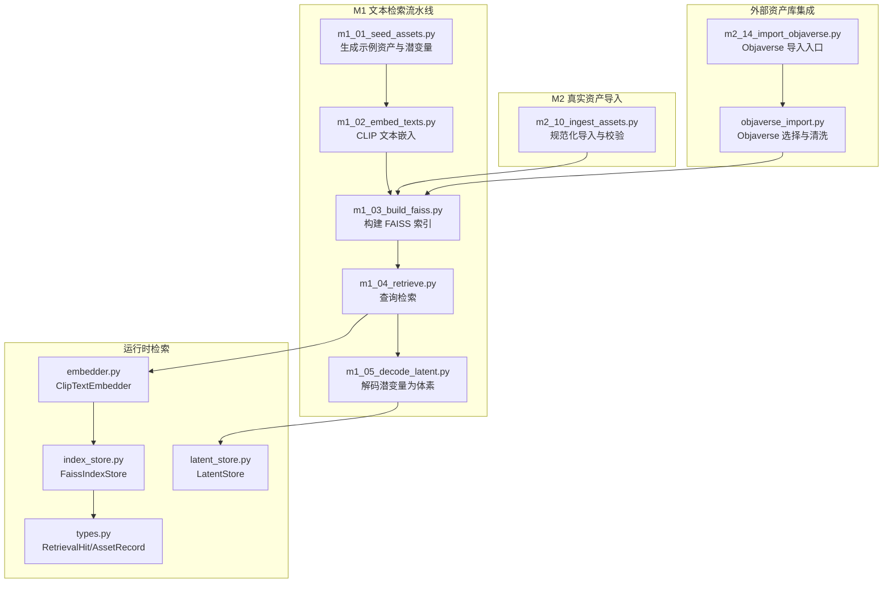
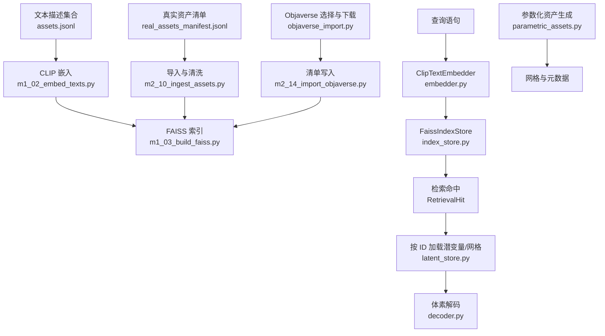
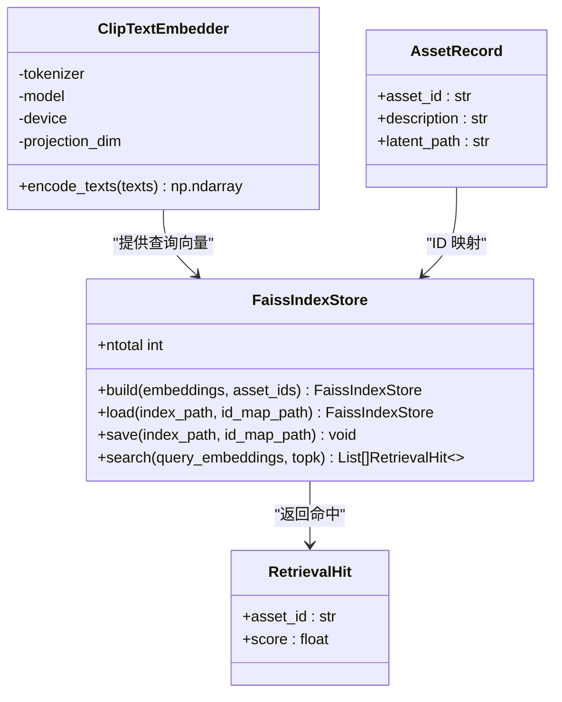
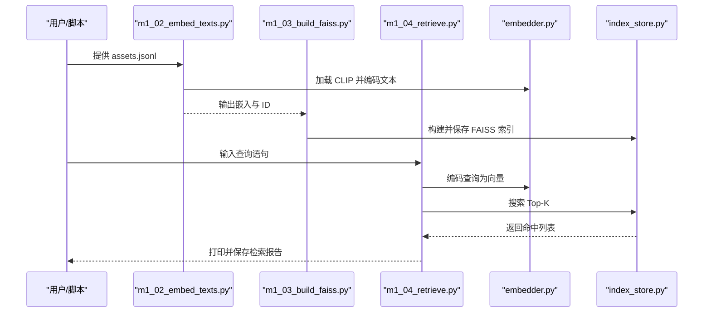
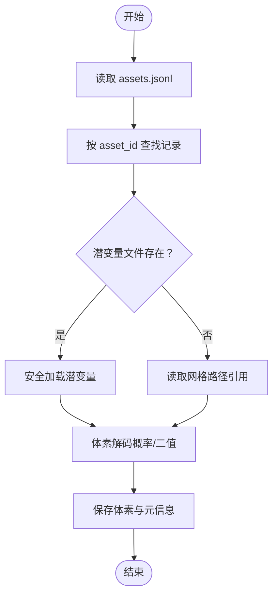
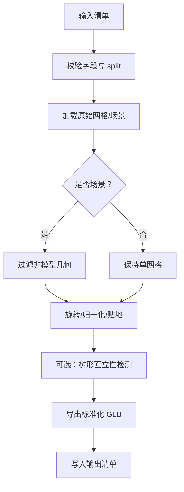
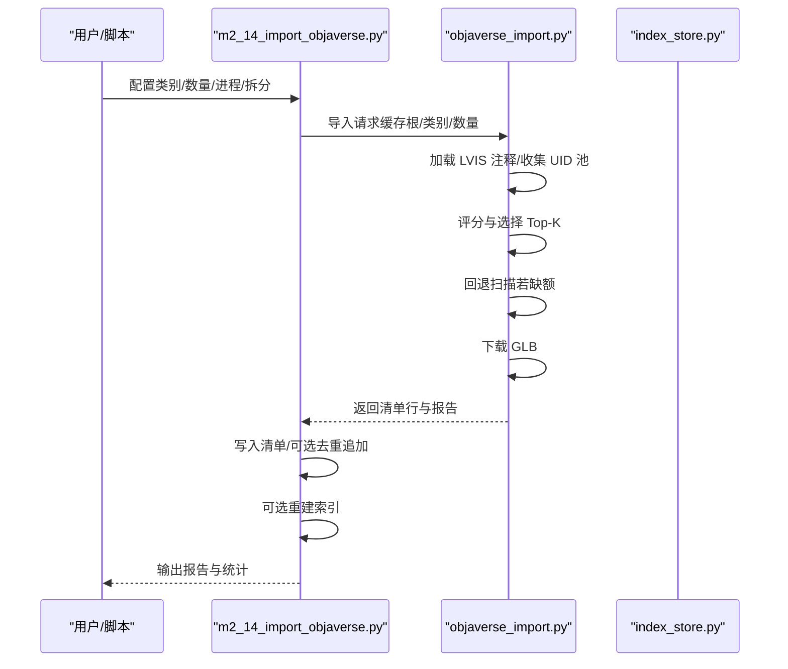
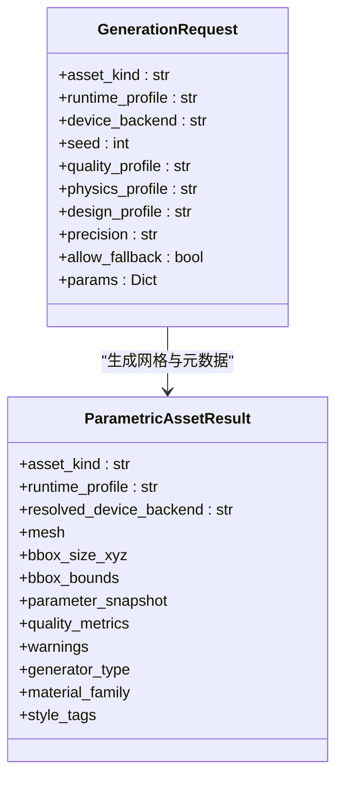
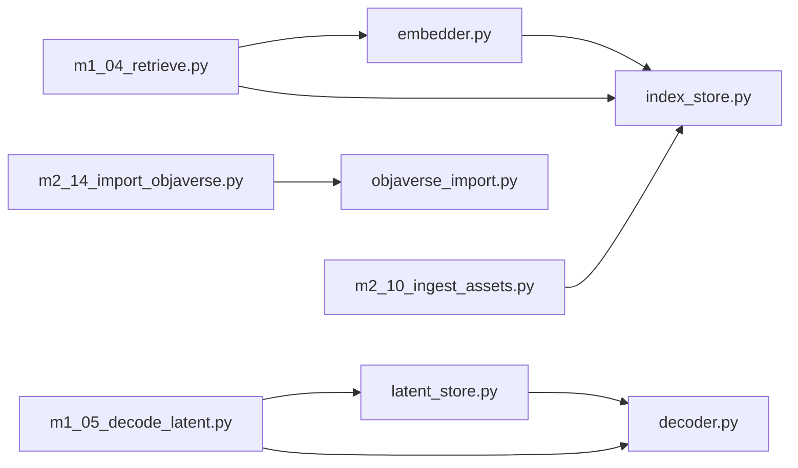

# 资产管理

<cite>
**本文引用的文件**
- [embedder.py](file://src/roadgen3d/embedder.py)
- [index_store.py](file://src/roadgen3d/index_store.py)
- [latent_store.py](file://src/roadgen3d/latent_store.py)
- [types.py](file://src/roadgen3d/types.py)
- [decoder.py](file://src/roadgen3d/decoder.py)
- [m1_00_check_env.py](file://scripts/m1_00_check_env.py)
- [m1_01_seed_assets.py](file://scripts/m1_01_seed_assets.py)
- [m1_02_embed_texts.py](file://scripts/m1_02_embed_texts.py)
- [m1_03_build_faiss.py](file://scripts/m1_03_build_faiss.py)
- [m1_04_retrieve.py](file://scripts/m1_04_retrieve.py)
- [m1_05_decode_latent.py](file://scripts/m1_05_decode_latent.py)
- [m2_10_ingest_assets.py](file://scripts/m2_10_ingest_assets.py)
- [m2_14_import_objaverse.py](file://scripts/m2_14_import_objaverse.py)
- [objaverse_import.py](file://src/roadgen3d/objaverse_import.py)
- [parametric_assets.py](file://src/roadgen3d/parametric_assets.py)
</cite>

## 目录
1. [简介](#简介)
2. [项目结构](#项目结构)
3. [核心组件](#核心组件)
4. [架构总览](#架构总览)
5. [详细组件分析](#详细组件分析)
6. [依赖关系分析](#依赖关系分析)
7. [性能考虑](#性能考虑)
8. [故障排查指南](#故障排查指南)
9. [结论](#结论)
10. [附录](#附录)

## 简介
本文件面向 RoadGen3D 的资产管理子系统，系统性阐述资产检索机制（CLIP 文本嵌入、FAISS 向量检索、相似性计算）、资产质量控制系统（面数阈值、复杂度调度、去重策略）、多格式导出能力（GLB/PLY 支持）、资产导入流程（真实数据链路与参数化资产）、资产清单管理与元数据处理、版本控制最佳实践、性能优化与缓存策略，以及与外部资产库（如 Objaverse）的集成与数据同步策略。

## 项目结构
资产管理相关代码主要分布在以下位置：
- 检索与索引：src/roadgen3d/embedder.py、src/roadgen3d/index_store.py、src/roadgen3d/types.py
- 元数据与潜变量加载：src/roadgen3d/latent_store.py、src/roadgen3d/decoder.py
- 数据准备与环境检查：scripts/m1_00_check_env.py、scripts/m1_01_seed_assets.py、scripts/m1_02_embed_texts.py、scripts/m1_03_build_faiss.py、scripts/m1_04_retrieve.py、scripts/m1_05_decode_latent.py
- 真实资产导入与清洗：scripts/m2_10_ingest_assets.py
- 外部资产库集成：scripts/m2_14_import_objaverse.py、src/roadgen3d/objaverse_import.py
- 参数化资产生成：src/roadgen3d/parametric_assets.py

图表来源
- [m1_01_seed_assets.py:1-97](file://scripts/m1_01_seed_assets.py#L1-L97)
- [m1_02_embed_texts.py:1-87](file://scripts/m1_02_embed_texts.py#L1-L87)
- [m1_03_build_faiss.py:1-50](file://scripts/m1_03_build_faiss.py#L1-L50)
- [m1_04_retrieve.py:1-71](file://scripts/m1_04_retrieve.py#L1-L71)
- [m1_05_decode_latent.py:1-72](file://scripts/m1_05_decode_latent.py#L1-L72)
- [m2_10_ingest_assets.py:1-421](file://scripts/m2_10_ingest_assets.py#L1-L421)
- [m2_14_import_objaverse.py:1-223](file://scripts/m2_14_import_objaverse.py#L1-L223)
- [objaverse_import.py:1-680](file://src/roadgen3d/objaverse_import.py#L1-L680)
- [embedder.py:1-100](file://src/roadgen3d/embedder.py#L1-L100)
- [index_store.py:1-96](file://src/roadgen3d/index_store.py#L1-L96)
- [latent_store.py:1-81](file://src/roadgen3d/latent_store.py#L1-L81)
- [types.py:1-800](file://src/roadgen3d/types.py#L1-L800)

章节来源
- [m1_01_seed_assets.py:1-97](file://scripts/m1_01_seed_assets.py#L1-L97)
- [m1_02_embed_texts.py:1-87](file://scripts/m1_02_embed_texts.py#L1-L87)
- [m1_03_build_faiss.py:1-50](file://scripts/m1_03_build_faiss.py#L1-L50)
- [m1_04_retrieve.py:1-71](file://scripts/m1_04_retrieve.py#L1-L71)
- [m1_05_decode_latent.py:1-72](file://scripts/m1_05_decode_latent.py#L1-L72)
- [m2_10_ingest_assets.py:1-421](file://scripts/m2_10_ingest_assets.py#L1-L421)
- [m2_14_import_objaverse.py:1-223](file://scripts/m2_14_import_objaverse.py#L1-L223)
- [objaverse_import.py:1-680](file://src/roadgen3d/objaverse_import.py#L1-L680)
- [embedder.py:1-100](file://src/roadgen3d/embedder.py#L1-L100)
- [index_store.py:1-96](file://src/roadgen3d/index_store.py#L1-L96)
- [latent_store.py:1-81](file://src/roadgen3d/latent_store.py#L1-L81)
- [types.py:1-800](file://src/roadgen3d/types.py#L1-L800)

## 核心组件
- CLIP 文本嵌入器：负责将资产描述转换为归一化的文本特征向量，用于后续检索。
- FAISS 索引存储：在内存中维护向量内积索引，并持久化 ID 映射。
- 潜变量与元数据加载：按资产 ID 解析并加载潜变量或引用网格路径。
- 运行时检索类型：定义检索命中结果与资产记录的数据结构。
- 体素解码器：将潜变量解码为概率/二值体素体积，便于快速评估与可视化。
- 环境检查脚本：输出包与设备可用性报告，辅助部署与调试。
- 真实资产导入与清洗：规范化 GLB/PLY 等网格，执行几何与姿态校正，生成标准化清单。
- 外部资产库集成：从 Objaverse 选择符合目标类别的候选，下载并写入清单，支持去重与重建索引。
- 参数化资产生成：基于参数与风格标签生成确定性网格，内置质量度量与复杂度预算。

章节来源
- [embedder.py:33-100](file://src/roadgen3d/embedder.py#L33-L100)
- [index_store.py:33-96](file://src/roadgen3d/index_store.py#L33-L96)
- [latent_store.py:35-81](file://src/roadgen3d/latent_store.py#L35-L81)
- [types.py:12-27](file://src/roadgen3d/types.py#L12-L27)
- [decoder.py:24-65](file://src/roadgen3d/decoder.py#L24-L65)
- [m1_00_check_env.py:29-79](file://scripts/m1_00_check_env.py#L29-L79)
- [m2_10_ingest_assets.py:39-51](file://scripts/m2_10_ingest_assets.py#L39-L51)
- [m2_14_import_objaverse.py:65-135](file://scripts/m2_14_import_objaverse.py#L65-L135)
- [objaverse_import.py:13-64](file://src/roadgen3d/objaverse_import.py#L13-L64)
- [parametric_assets.py:63-210](file://src/roadgen3d/parametric_assets.py#L63-L210)

## 架构总览
资产管理以“文本检索 + 向量索引 + 元数据/潜变量加载”为核心，贯穿数据准备、入库、检索与运行时使用。真实资产通过导入脚本进行规范化与清洗，参数化资产通过生成器直接产出网格与元数据；外部资产库（如 Objaverse）通过专用脚本与模块完成选择、下载与清单写入。

图表来源
- [m1_02_embed_texts.py:34-63](file://scripts/m1_02_embed_texts.py#L34-L63)
- [m1_03_build_faiss.py:29-44](file://scripts/m1_03_build_faiss.py#L29-L44)
- [m1_04_retrieve.py:32-65](file://scripts/m1_04_retrieve.py#L32-L65)
- [embedder.py:84-99](file://src/roadgen3d/embedder.py#L84-L99)
- [index_store.py:79-95](file://src/roadgen3d/index_store.py#L79-L95)
- [latent_store.py:57-80](file://src/roadgen3d/latent_store.py#L57-L80)
- [decoder.py:40-64](file://src/roadgen3d/decoder.py#L40-L64)
- [m2_10_ingest_assets.py:337-375](file://scripts/m2_10_ingest_assets.py#L337-L375)
- [objaverse_import.py:474-556](file://src/roadgen3d/objaverse_import.py#L474-L556)
- [m2_14_import_objaverse.py:65-135](file://scripts/m2_14_import_objaverse.py#L65-L135)
- [parametric_assets.py:175-209](file://src/roadgen3d/parametric_assets.py#L175-L209)

## 详细组件分析

### 组件A：文本检索与向量索引
- CLIP 文本嵌入器
  - 功能：加载 CLIP 模型与分词器，对输入文本批量编码，返回 L2 归一化的特征矩阵。
  - 关键点：设备解析、模型离线加载、错误提示（含 CVE 修复建议）。
- FAISS 索引存储
  - 功能：封装 IndexFlatIP，提供构建、保存、加载与搜索接口；维护资产 ID 到索引的映射。
  - 关键点：维度一致性校验、查询矩阵形状校验、线程环境变量设置以避免冲突。
- 运行时检索
  - 功能：将查询文本转为向量后调用索引搜索，返回 Top-K 命中及相似度分数。
  - 关键点：类型安全的命中结构（asset_id、score）。

图表来源
- [embedder.py:33-100](file://src/roadgen3d/embedder.py#L33-L100)
- [index_store.py:33-96](file://src/roadgen3d/index_store.py#L33-L96)
- [types.py:12-27](file://src/roadgen3d/types.py#L12-L27)

章节来源
- [embedder.py:33-100](file://src/roadgen3d/embedder.py#L33-L100)
- [index_store.py:33-96](file://src/roadgen3d/index_store.py#L33-L96)
- [types.py:12-27](file://src/roadgen3d/types.py#L12-L27)

### 组件B：检索工作流（端到端）

图表来源
- [m1_02_embed_texts.py:34-63](file://scripts/m1_02_embed_texts.py#L34-L63)
- [m1_03_build_faiss.py:29-44](file://scripts/m1_03_build_faiss.py#L29-L44)
- [m1_04_retrieve.py:32-65](file://scripts/m1_04_retrieve.py#L32-L65)
- [embedder.py:84-99](file://src/roadgen3d/embedder.py#L84-L99)
- [index_store.py:79-95](file://src/roadgen3d/index_store.py#L79-L95)

章节来源
- [m1_02_embed_texts.py:34-63](file://scripts/m1_02_embed_texts.py#L34-L63)
- [m1_03_build_faiss.py:29-44](file://scripts/m1_03_build_faiss.py#L29-L44)
- [m1_04_retrieve.py:32-65](file://scripts/m1_04_retrieve.py#L32-L65)

### 组件C：潜变量与元数据加载
- 潜变量加载器
  - 功能：读取资产清单 JSONL，按 asset_id 定位潜变量文件或网格引用，支持安全加载与路径解析。
  - 关键点：重复 ID 校验、缺失文件报错、兼容旧版权重加载。
- 体素解码器
  - 功能：将潜变量映射为三维体素体积，提供概率与二值化版本，支持阈值与分辨率配置。

图表来源
- [latent_store.py:12-80](file://src/roadgen3d/latent_store.py#L12-L80)
- [decoder.py:40-64](file://src/roadgen3d/decoder.py#L40-L64)

章节来源
- [latent_store.py:12-81](file://src/roadgen3d/latent_store.py#L12-L81)
- [decoder.py:24-65](file://src/roadgen3d/decoder.py#L24-L65)

### 组件D：真实资产导入与清洗
- 清单校验：字段完整性与 split 合法性检查。
- 几何处理：单网格合并、场景过滤（去除背景球等）、旋转、归一化、贴地。
- 质量评估：树形直立性检测（地面容忍度、截面比例、主轴角度）。
- 输出：规范化后的清单与网格目录。

图表来源
- [m2_10_ingest_assets.py:39-51](file://scripts/m2_10_ingest_assets.py#L39-L51)
- [m2_10_ingest_assets.py:71-133](file://scripts/m2_10_ingest_assets.py#L71-L133)
- [m2_10_ingest_assets.py:271-335](file://scripts/m2_10_ingest_assets.py#L271-L335)

章节来源
- [m2_10_ingest_assets.py:39-51](file://scripts/m2_10_ingest_assets.py#L39-L51)
- [m2_10_ingest_assets.py:71-133](file://scripts/m2_10_ingest_assets.py#L71-L133)
- [m2_10_ingest_assets.py:271-335](file://scripts/m2_10_ingest_assets.py#L271-L335)

### 组件E：外部资产库集成（Objaverse）
- 目标类别与评分规则：基于 LVIS 分类、关键词匹配、许可证与面数约束。
- 选择策略：优先 LVIS 池，不足时回退元数据扫描；支持严格名称匹配。
- 下载与清单：下载 GLB、生成清单行、写入报告与去重追加。
- 可选重建索引：在导入后自动触发实时索引重建。

图表来源
- [m2_14_import_objaverse.py:65-135](file://scripts/m2_14_import_objaverse.py#L65-L135)
- [objaverse_import.py:474-556](file://src/roadgen3d/objaverse_import.py#L474-L556)
- [objaverse_import.py:559-592](file://src/roadgen3d/objaverse_import.py#L559-L592)

章节来源
- [m2_14_import_objaverse.py:65-135](file://scripts/m2_14_import_objaverse.py#L65-L135)
- [objaverse_import.py:13-64](file://src/roadgen3d/objaverse_import.py#L13-L64)
- [objaverse_import.py:474-556](file://src/roadgen3d/objaverse_import.py#L474-L556)
- [objaverse_import.py:559-592](file://src/roadgen3d/objaverse_import.py#L559-L592)

### 组件F：参数化资产生成
- 参数空间：支持 bench/lamp/building/tree 等类别，涵盖尺寸、材质、风格、细节等级等。
- 质量度量：面数、预算（K）、尺寸误差、支撑/稳定性/细长比、清空检查、最小面数满足度。
- 设备与精度：自动/显卡/CPU 后端选择，当前仅支持 fp32。
- 结果元数据：包含网格边界框、参数快照、质量指标与警告。

图表来源
- [parametric_assets.py:63-210](file://src/roadgen3d/parametric_assets.py#L63-L210)
- [parametric_assets.py:175-209](file://src/roadgen3d/parametric_assets.py#L175-L209)

章节来源
- [parametric_assets.py:63-210](file://src/roadgen3d/parametric_assets.py#L63-L210)
- [parametric_assets.py:175-209](file://src/roadgen3d/parametric_assets.py#L175-L209)

## 依赖关系分析
- 模块耦合
  - embedder.py 与 index_store.py 在检索阶段强耦合，前者提供向量，后者提供索引。
  - latent_store.py 与 decoder.py 在运行时解码阶段耦合，前者提供数据源，后者提供解码器。
  - m2_14_import_objaverse.py 与 objaverse_import.py 协作完成外部资产导入。
- 外部依赖
  - torch、transformers（CLIP）、faiss（索引）、trimesh（网格处理）、numpy（数组）。
- 潜在循环依赖
  - 当前模块间无循环导入，脚本与模块职责清晰分离。

图表来源
- [embedder.py:1-100](file://src/roadgen3d/embedder.py#L1-L100)
- [index_store.py:1-96](file://src/roadgen3d/index_store.py#L1-L96)
- [latent_store.py:1-81](file://src/roadgen3d/latent_store.py#L1-L81)
- [decoder.py:1-65](file://src/roadgen3d/decoder.py#L1-L65)
- [m1_04_retrieve.py:1-71](file://scripts/m1_04_retrieve.py#L1-L71)
- [m1_05_decode_latent.py:1-72](file://scripts/m1_05_decode_latent.py#L1-L72)
- [m2_14_import_objaverse.py:1-223](file://scripts/m2_14_import_objaverse.py#L1-L223)
- [objaverse_import.py:1-680](file://src/roadgen3d/objaverse_import.py#L1-L680)
- [m2_10_ingest_assets.py:1-421](file://scripts/m2_10_ingest_assets.py#L1-L421)

章节来源
- [embedder.py:1-100](file://src/roadgen3d/embedder.py#L1-L100)
- [index_store.py:1-96](file://src/roadgen3d/index_store.py#L1-L96)
- [latent_store.py:1-81](file://src/roadgen3d/latent_store.py#L1-L81)
- [decoder.py:1-65](file://src/roadgen3d/decoder.py#L1-L65)
- [m1_04_retrieve.py:1-71](file://scripts/m1_04_retrieve.py#L1-L71)
- [m1_05_decode_latent.py:1-72](file://scripts/m1_05_decode_latent.py#L1-L72)
- [m2_14_import_objaverse.py:1-223](file://scripts/m2_14_import_objaverse.py#L1-L223)
- [objaverse_import.py:1-680](file://src/roadgen3d/objaverse_import.py#L1-L680)
- [m2_10_ingest_assets.py:1-421](file://scripts/m2_10_ingest_assets.py#L1-L421)

## 性能考虑
- 线程与并发
  - FAISS 索引构建与查询受线程数影响，已设置环境变量降低冲突风险。
- 设备选择
  - CLIP 嵌入与检索可在 CPU/MPS/CUDA 上执行，GPU 更适合大规模检索。
- 索引规模
  - FAISS IndexFlatIP 适合中小规模索引；大规模场景建议使用分片或更高效索引结构。
- 解码效率
  - 体素解码为确定性轻量实现，适合快速预览；高分辨率与阈值需权衡内存与速度。
- 外部库
  - trimesh 场景过滤与合并可能带来额外开销，建议仅在必要时进行。

[本节为通用指导，无需列出具体文件来源]

## 故障排查指南
- 模型加载失败
  - 症状：CLIP 模型加载异常，提示升级 torch 或使用 safetensors 权重。
  - 排查：确认 requirements-m1.txt 已安装，网络可达或使用本地模型目录与离线标志。
- FAISS 不可用
  - 症状：导入 faiss 报错。
  - 排查：安装 requirements-m1.txt 中的 faiss 包。
- 索引/ID 文件缺失
  - 症状：加载索引或 ID 映射时报错。
  - 排查：确认 artifacts/m1 目录下 index_ip.faiss 与 id_map.json 存在且格式正确。
- 资产清单不合法
  - 症状：导入真实资产时报字段缺失或 split 非法。
  - 排查：核对清单字段与值，确保 split 为 train/val/test。
- 潜变量/网格缺失
  - 症状：按 asset_id 无法找到潜变量或网格路径。
  - 排查：检查 assets.jsonl 与实际文件路径，确认相对路径解析正确。

章节来源
- [embedder.py:53-74](file://src/roadgen3d/embedder.py#L53-L74)
- [index_store.py:25-30](file://src/roadgen3d/index_store.py#L25-L30)
- [index_store.py:55-66](file://src/roadgen3d/index_store.py#L55-L66)
- [m2_10_ingest_assets.py:27-36](file://scripts/m2_10_ingest_assets.py#L27-L36)
- [latent_store.py:57-80](file://src/roadgen3d/latent_store.py#L57-L80)

## 结论
RoadGen3D 的资产管理以 CLIP 文本嵌入与 FAISS 向量检索为核心，结合潜变量与网格的统一元数据管理，形成从数据准备、索引构建到运行时检索与解码的完整闭环。真实资产导入与外部资产库集成提供了高质量、可复用的资产来源，参数化资产生成则保证了可控的质量与复杂度。通过合理的性能优化与故障排查策略，系统可在不同规模与硬件环境下稳定运行。

[本节为总结，无需列出具体文件来源]

## 附录

### 资产质量控制系统
- 面数阈值与复杂度预算
  - 参数化资产：内置最小面数与多级预算（K），确保生成网格满足最低质量要求。
  - Objaverse 选择：按面数上下限筛选，避免过简或过繁。
- 复杂度调度
  - 细节等级（0-3）与运行时配置（preview/production）联动，动态调整几何细分。
- 去重策略
  - 导入清单去重：按 asset_id 去重并支持追加模式，避免重复入库。
  - 外部库去重：回退扫描时排除已选 UID，减少重复候选。

章节来源
- [parametric_assets.py:54-60](file://src/roadgen3d/parametric_assets.py#L54-L60)
- [objaverse_import.py:492-518](file://src/roadgen3d/objaverse_import.py#L492-L518)
- [objaverse_import.py:568-592](file://src/roadgen3d/objaverse_import.py#L568-L592)

### 多格式导出（GLB/PLY）
- 导出路径与格式
  - 规范化导入阶段默认导出 GLB；如需 PLY，可在导入后使用 trimesh 转换工具链进行二次导出。
- 场景保留
  - 导入时可保留材质与纹理（Scene），但合并为单网格会丢失材质信息，用于验证用途。

章节来源
- [m2_10_ingest_assets.py:354-360](file://scripts/m2_10_ingest_assets.py#L354-L360)
- [m2_10_ingest_assets.py:253-268](file://scripts/m2_10_ingest_assets.py#L253-L268)

### 资产导入流程（真实数据链路与参数化资产）
- 真实数据链路
  - 清单校验 → 几何处理（过滤/旋转/归一化/贴地）→ 质量评估（树形直立性）→ 导出标准化 GLB → 写入清单。
- 参数化资产
  - 解析请求与参数 → 校验与裁剪 → 生成网格 → 计算质量度量 → 输出元数据。

章节来源
- [m2_10_ingest_assets.py:337-375](file://scripts/m2_10_ingest_assets.py#L337-L375)
- [parametric_assets.py:457-482](file://src/roadgen3d/parametric_assets.py#L457-L482)

### 资产清单管理、元数据处理与版本控制
- 清单格式
  - JSONL 行式存储，每行包含资产标识、类别、描述、网格与潜变量路径、许可证、来源、拆分等字段。
- 元数据处理
  - 统一字段校验与类型转换，缺失或非法字段直接报错。
- 版本控制
  - 建议以清单文件为版本基线，配合 Git 管理变更；每次导入后生成报告，记录新增/去重/重建索引等操作。

章节来源
- [m2_10_ingest_assets.py:15-24](file://scripts/m2_10_ingest_assets.py#L15-L24)
- [m2_10_ingest_assets.py:39-51](file://scripts/m2_10_ingest_assets.py#L39-L51)
- [m2_14_import_objaverse.py:138-135](file://scripts/m2_14_import_objaverse.py#L138-L135)

### 性能优化与缓存策略
- 环境检查
  - 使用环境检查脚本输出包与设备状态，提前发现潜在问题。
- 索引缓存
  - FAISS 索引与 ID 映射持久化，避免重复构建。
- 设备与线程
  - 合理设置设备后端与线程数，减少冲突与资源争用。

章节来源
- [m1_00_check_env.py:29-79](file://scripts/m1_00_check_env.py#L29-L79)
- [m1_03_build_faiss.py:32-44](file://scripts/m1_03_build_faiss.py#L32-L44)
- [index_store.py:14-18](file://src/roadgen3d/index_store.py#L14-L18)

### 与外部资产库的集成与数据同步
- 集成方式
  - 通过专用脚本与模块完成选择、下载、清单写入与可选重建索引。
- 数据同步
  - 支持将新导入条目追加至现有清单并去重，确保历史数据不被覆盖。
  - 可选报告输出，便于审计与追踪。

章节来源
- [m2_14_import_objaverse.py:65-135](file://scripts/m2_14_import_objaverse.py#L65-L135)
- [objaverse_import.py:559-592](file://src/roadgen3d/objaverse_import.py#L559-L592)