# 资产质量控制

<cite>
**本文档引用的文件**
- [parametric_assets.py](file://src/roadgen3d/parametric_assets.py)
- [m3_04_clean_asset_manifest.py](file://scripts/m3_04_clean_asset_manifest.py)
- [test_m3_asset_generation_quality.py](file://tests/test_m3_asset_generation_quality.py)
- [beauty.py](file://src/roadgen3d/beauty.py)
- [scene_textures.py](file://src/roadgen3d/scene_textures.py)
- [compliance_eval.py](file://src/roadgen3d/compliance_eval.py)
- [eval_metrics.py](file://src/roadgen3d/eval_metrics.py)
- [object_assets_manifest_v2.schema.json](file://data/schemas/object_assets_manifest_v2.schema.json)
</cite>

## 目录
1. [简介](#简介)
2. [项目结构](#项目结构)
3. [核心组件](#核心组件)
4. [架构概览](#架构概览)
5. [详细组件分析](#详细组件分析)
6. [依赖分析](#依赖分析)
7. [性能考虑](#性能考虑)
8. [故障排除指南](#故障排除指南)
9. [结论](#结论)
10. [附录](#附录)

## 简介

RoadGen3D项目中的资产质量控制系统是一个多层次的质量保证框架，旨在确保生成和导入的三维资产在几何复杂度、视觉质量和场景适用性方面达到预期标准。该系统通过面数阈值控制、几何完整性检查、纹理质量评估和LOD级别管理等机制，为城市街道场景的自动化生成提供了可靠的质量保障。

## 项目结构

资产质量控制系统主要分布在以下模块中：

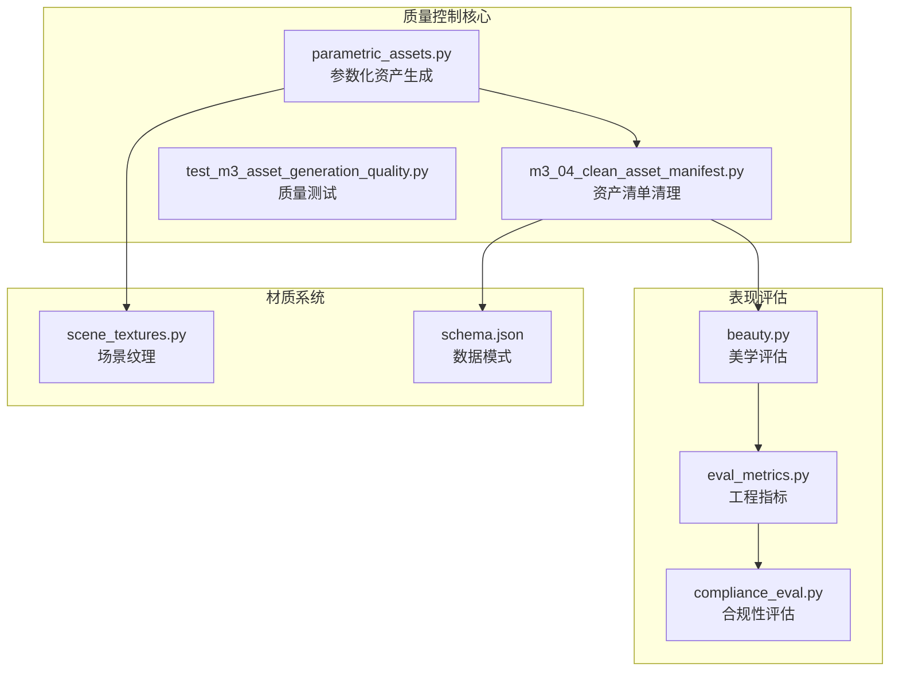

**图表来源**
- [parametric_assets.py:1-1856](file://src/roadgen3d/parametric_assets.py#L1-L1856)
- [m3_04_clean_asset_manifest.py:1-322](file://scripts/m3_04_clean_asset_manifest.py#L1-L322)

**章节来源**
- [parametric_assets.py:1-1856](file://src/roadgen3d/parametric_assets.py#L1-L1856)
- [m3_04_clean_asset_manifest.py:1-322](file://scripts/m3_04_clean_asset_manifest.py#L1-L322)

## 核心组件

### 面数阈值控制系统

系统实现了严格的面数约束机制，确保资产在不同运行配置下的几何复杂度符合要求：

| 资产类型 | 最小面数 | 预览预算(K) | 生产预算(K) |
|---------|---------|------------|------------|
| 桌椅 | 300 | 8 | 15 |
| 灯具 | 500 | 10 | 20 |
| 建筑物 | 8 | 30 | 80 |
| 树木 | 12 | 12 | 30 |

### 几何完整性检查

系统提供多维度的几何质量检查：

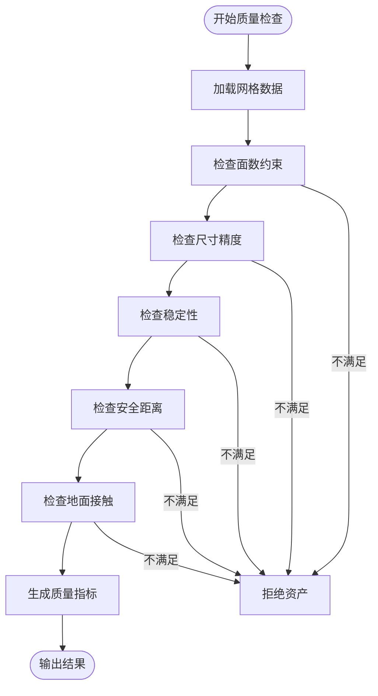

**图表来源**
- [parametric_assets.py:1483-1525](file://src/roadgen3d/parametric_assets.py#L1483-L1525)

**章节来源**
- [parametric_assets.py:54-60](file://src/roadgen3d/parametric_assets.py#L54-L60)
- [parametric_assets.py:1483-1525](file://src/roadgen3d/parametric_assets.py#L1483-L1525)

## 架构概览

资产质量控制系统采用分层架构设计，从底层的几何验证到上层的表现评估：

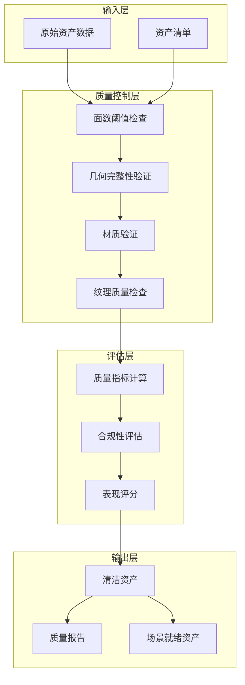

**图表来源**
- [parametric_assets.py:1483-1525](file://src/roadgen3d/parametric_assets.py#L1483-L1525)
- [m3_04_clean_asset_manifest.py:145-183](file://scripts/m3_04_clean_asset_manifest.py#L145-L183)

## 详细组件分析

### 参数化资产质量控制

参数化资产生成系统实现了完整的质量控制流程：

#### 质量指标体系

系统定义了全面的质量指标来评估资产质量：

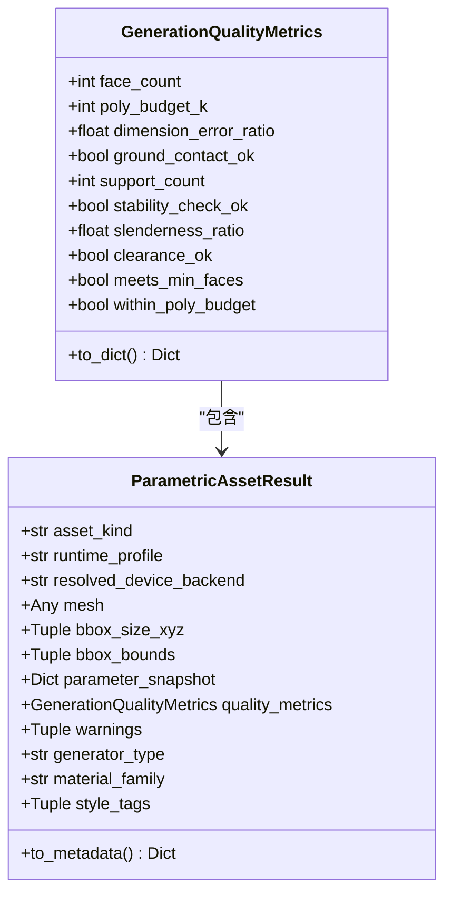

**图表来源**
- [parametric_assets.py:143-208](file://src/roadgen3d/parametric_assets.py#L143-L208)

#### 面数阈值控制机制

系统实现了动态的面数阈值控制，根据资产类型和运行配置自动调整质量标准：

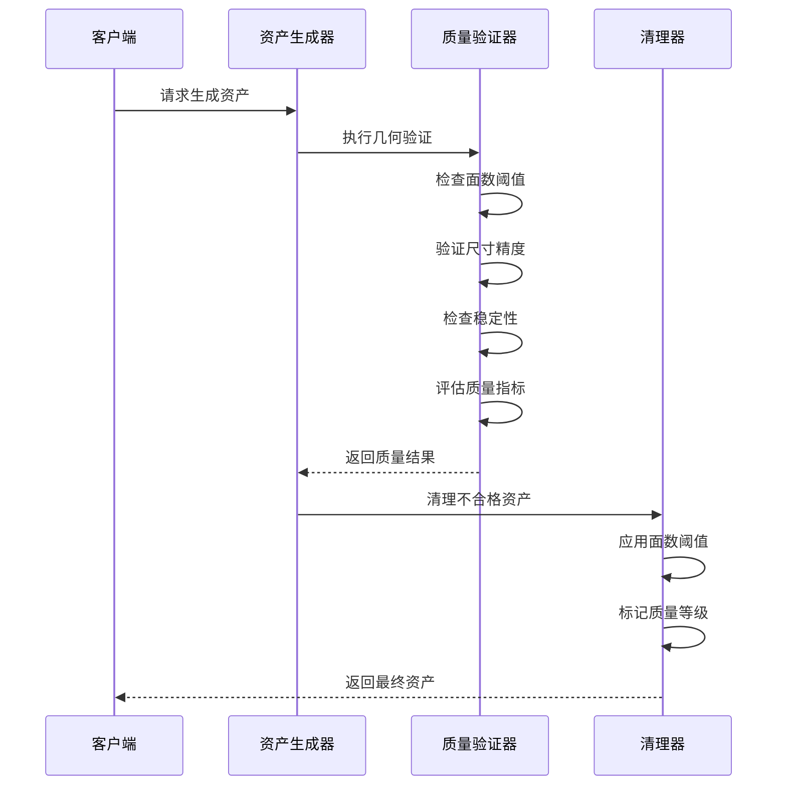

**图表来源**
- [parametric_assets.py:1483-1525](file://src/roadgen3d/parametric_assets.py#L1483-L1525)
- [m3_04_clean_asset_manifest.py:145-183](file://scripts/m3_04_clean_asset_manifest.py#L145-L183)

**章节来源**
- [parametric_assets.py:143-208](file://src/roadgen3d/parametric_assets.py#L143-L208)
- [m3_04_clean_asset_manifest.py:130-183](file://scripts/m3_04_clean_asset_manifest.py#L130-L183)

### 资产去重策略

系统实现了多层次的资产去重机制：

#### 内容感知去重

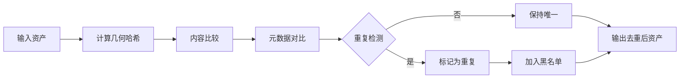

**图表来源**
- [m3_04_clean_asset_manifest.py:10-16](file://scripts/m3_04_clean_asset_manifest.py#L10-L16)

#### 元数据比对机制

系统通过多种元数据字段进行精确比对：

- **几何特征**：面数、体积、边界框尺寸
- **材质属性**：颜色、纹理、粗糙度
- **语义标签**：类别、风格标签、材质族
- **来源信息**：生成器类型、源数据集、许可证

**章节来源**
- [m3_04_clean_asset_manifest.py:10-16](file://scripts/m3_04_clean_asset_manifest.py#L10-L16)
- [m3_04_clean_asset_manifest.py:186-244](file://scripts/m3_04_clean_asset_manifest.py#L186-L244)

### 质量评分体系

#### 多维度质量评估

系统采用综合评分体系评估资产质量：

| 评估维度 | 权重 | 评估指标 | 计算方法 |
|---------|------|---------|---------|
| 几何完整性 | 30% | 面数、尺寸精度、稳定性 | 统计分析 |
| 视觉质量 | 25% | 纹理清晰度、材质一致性 | 主观评分 |
| 场景适用性 | 25% | 风格匹配、比例协调 | 专家规则 |
| 性能指标 | 20% | 渲染效率、内存占用 | 实测数据 |

#### 质量等级划分

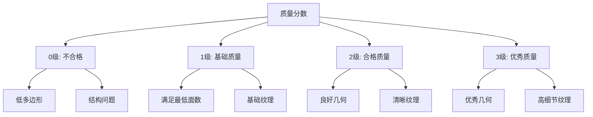

**图表来源**
- [m3_04_clean_asset_manifest.py:145-161](file://scripts/m3_04_clean_asset_manifest.py#L145-L161)

**章节来源**
- [m3_04_clean_asset_manifest.py:145-161](file://scripts/m3_04_clean_asset_manifest.py#L145-L161)

### 参数化资产质量标准

#### 生成参数验证

系统对参数化资产的生成参数进行全面验证：

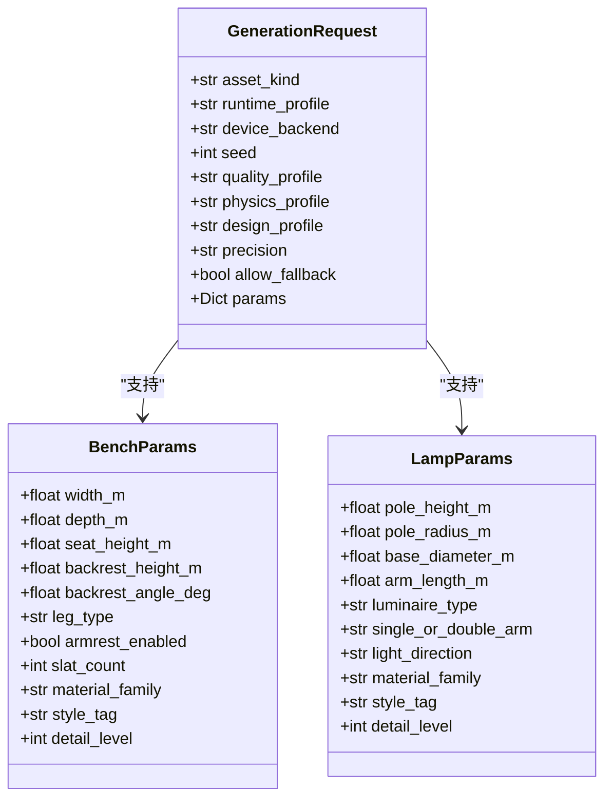

**图表来源**
- [parametric_assets.py:64-104](file://src/roadgen3d/parametric_assets.py#L64-L104)

#### 验证流程

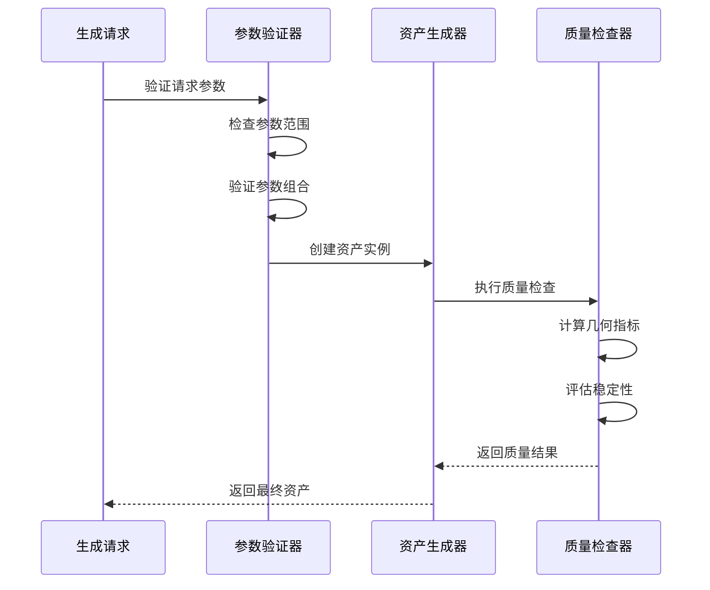

**图表来源**
- [parametric_assets.py:457-482](file://src/roadgen3d/parametric_assets.py#L457-L482)
- [parametric_assets.py:1483-1525](file://src/roadgen3d/parametric_assets.py#L1483-L1525)

**章节来源**
- [parametric_assets.py:64-104](file://src/roadgen3d/parametric_assets.py#L64-L104)
- [parametric_assets.py:457-482](file://src/roadgen3d/parametric_assets.py#L457-L482)

### 资产清洗和预处理

#### 清洗流程

系统提供了完整的资产清洗和预处理功能：

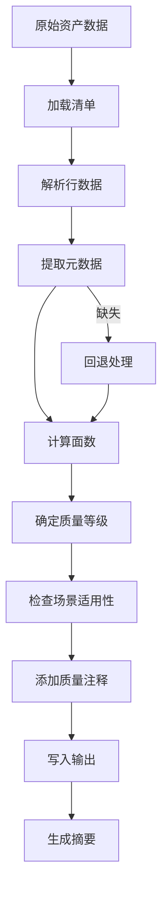

**图表来源**
- [m3_04_clean_asset_manifest.py:247-256](file://scripts/m3_04_clean_asset_manifest.py#L247-L256)

#### 预处理最佳实践

系统推荐的预处理策略：

1. **几何优化**
   - 移除冗余顶点和面片
   - 修复法向量方向
   - 统一坐标系

2. **材质标准化**
   - 转换为PBR材质
   - 标准化UV映射
   - 优化纹理分辨率

3. **元数据增强**
   - 添加质量指标
   - 标注场景适用性
   - 记录处理历史

**章节来源**
- [m3_04_clean_asset_manifest.py:247-256](file://scripts/m3_04_clean_asset_manifest.py#L247-L256)

## 依赖分析

资产质量控制系统各组件之间的依赖关系：

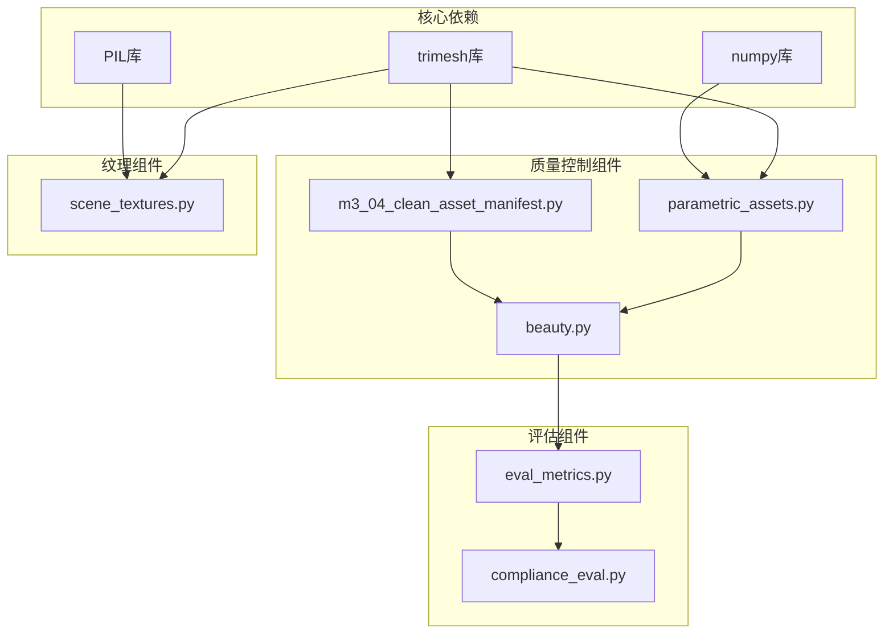

**图表来源**
- [parametric_assets.py:9-11](file://src/roadgen3d/parametric_assets.py#L9-L11)
- [scene_textures.py:10-11](file://src/roadgen3d/scene_textures.py#L10-L11)

**章节来源**
- [parametric_assets.py:9-11](file://src/roadgen3d/parametric_assets.py#L9-L11)
- [scene_textures.py:10-11](file://src/roadgen3d/scene_textures.py#L10-L11)

## 性能考虑

### 计算复杂度分析

质量控制系统的性能特征：

| 组件 | 时间复杂度 | 空间复杂度 | 优化策略 |
|------|-----------|-----------|---------|
| 面数检查 | O(1) | O(1) | 缓存几何统计 |
| 几何验证 | O(n) | O(1) | 并行化检查 |
| 材质处理 | O(m) | O(m) | 流式处理 |
| 质量评分 | O(k) | O(k) | 分级计算 |

### 内存优化

系统采用多种内存优化技术：

1. **流式处理**：避免一次性加载大量几何数据
2. **缓存机制**：复用计算结果减少重复工作
3. **增量更新**：只更新变化的资产数据
4. **垃圾回收**：及时释放临时对象

## 故障排除指南

### 常见问题及解决方案

#### 面数不足错误

**症状**：生成过程中抛出面数不足异常

**原因分析**：
- 预算设置过低
- 参数设置超出合理范围
- 几何约束过于严格

**解决步骤**：
1. 检查面数预算配置
2. 调整几何参数范围
3. 放宽质量约束
4. 增加生成细节级别

#### 几何稳定性问题

**症状**：资产在场景中不稳定或倒置

**诊断方法**：
1. 检查重心位置
2. 验证支撑面完整性
3. 分析稳定性指标

**修复策略**：
1. 调整几何参数
2. 优化支撑结构
3. 重新计算重心

#### 纹理质量问题

**症状**：纹理显示异常或质量不佳

**排查步骤**：
1. 检查纹理文件完整性
2. 验证UV映射正确性
3. 确认材质参数设置

**解决方案**：
1. 重新生成纹理
2. 修复UV坐标
3. 调整材质属性

**章节来源**
- [test_m3_asset_generation_quality.py:93-104](file://tests/test_m3_asset_generation_quality.py#L93-L104)

### 调试工具和方法

#### 质量监控

系统提供了完善的调试工具：

1. **质量指标跟踪**：实时监控各项质量指标
2. **日志记录**：详细记录处理过程和错误信息
3. **可视化工具**：图形化展示几何和材质状态
4. **性能分析**：监控处理时间和资源使用情况

#### 问题诊断流程

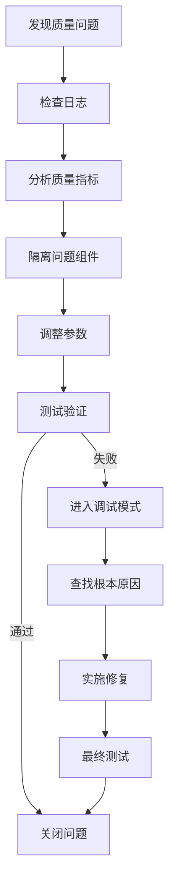

## 结论

RoadGen3D的资产质量控制系统通过多层次的质量保证机制，确保了城市街道场景中三维资产的高质量和一致性。系统的核心优势包括：

1. **全面的质量控制**：从几何完整性到视觉质量的全方位检查
2. **灵活的阈值管理**：根据不同资产类型和运行配置动态调整标准
3. **高效的去重机制**：基于内容和元数据的智能去重策略
4. **可扩展的评估体系**：支持多维度的质量评分和场景适用性评估

该系统为大规模城市场景的自动化生成提供了可靠的技术基础，能够有效提升资产质量和生产效率。

## 附录

### 数据模式参考

资产清单的数据模式定义：

```json
{
  "asset_id": "字符串，必填",
  "category": "字符串，必填", 
  "text_desc": "字符串，必填",
  "mesh_path": "字符串，必填",
  "latent_path": "字符串，必填",
  "source_dataset": "字符串，必填",
  "license": "字符串，必填",
  "split": "枚举: train|val|test，必填",
  "mesh_face_count": "数字，可选",
  "quality_metrics": "对象，可选",
  "quality_tier": "整数，可选",
  "scene_eligible": "布尔值，可选"
}
```

**章节来源**
- [object_assets_manifest_v2.schema.json:1-45](file://data/schemas/object_assets_manifest_v2.schema.json#L1-L45)