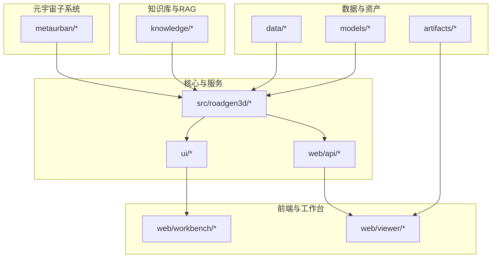
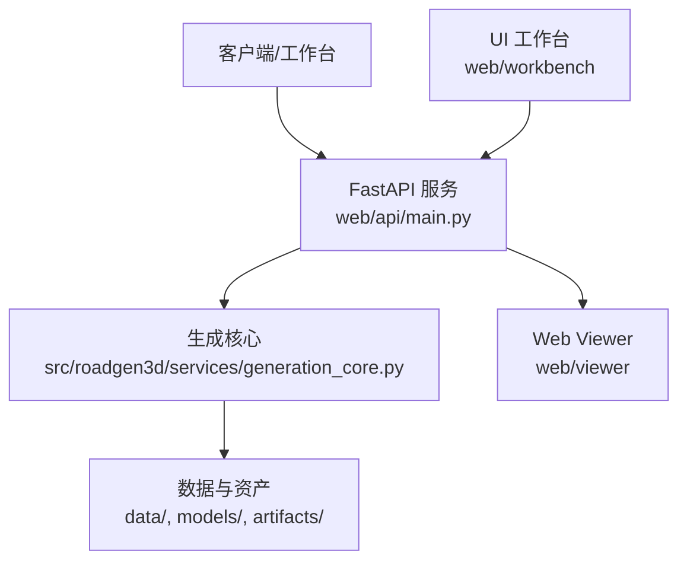
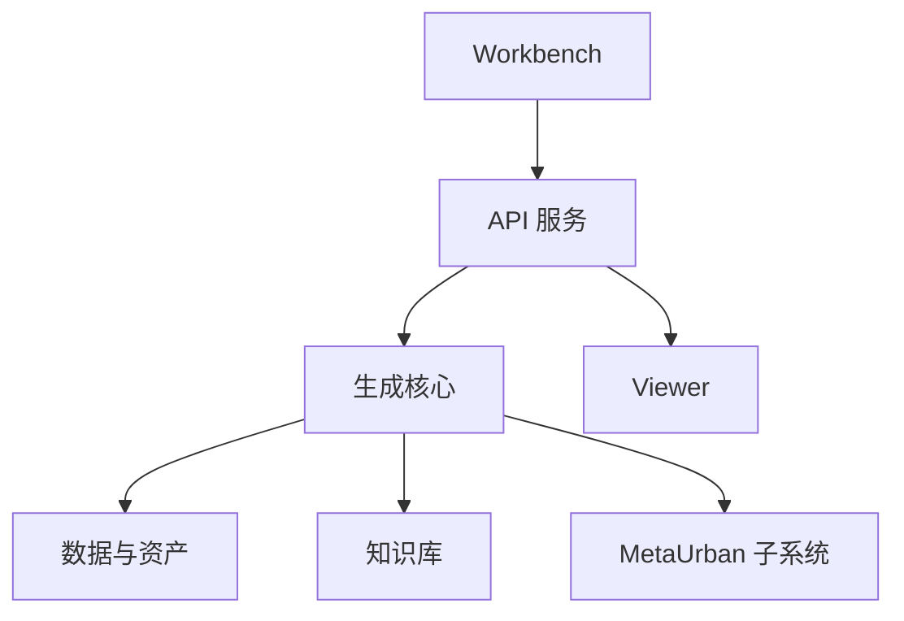

# 备份与恢复

<cite>
**本文引用的文件**
- [README.md](file://README.md)
- [API_GUIDE.md](file://API_GUIDE.md)
- [Makefile](file://Makefile)
- [placement_field_v1.json](file://src/roadgen3d/config/placement_field_v1.json)
- [path_config.yaml](file://metaurban/path_config.yaml)
- [custom_metaurban_env.yaml](file://metaurban/custom_metaurban_env.yaml)
- [requirements-m1.txt](file://requirements-m1.txt)
- [knowledge_build_log](file://knowledge/graphRAG/graphrag_quickstart/logs/indexing-engine.log)
- [viewer_dev_log](file://artifacts/web_viewer/vite-dev.log)
- [ros_bridge_log](file://metaurban/bridges/ros_bridge/log/build_2025-01-21_15-59-58/events.log)
</cite>

## 目录
1. [简介](#简介)
2. [项目结构](#项目结构)
3. [核心组件](#核心组件)
4. [架构概览](#架构概览)
5. [详细组件分析](#详细组件分析)
6. [依赖分析](#依赖分析)
7. [性能考虑](#性能考虑)
8. [故障排查指南](#故障排查指南)
9. [结论](#结论)
10. [附录](#附录)

## 简介
本文件面向 RoadGen3D 的运维与开发团队，提供一套系统化的备份与恢复策略，覆盖用户数据、配置文件、日志文件与临时文件的备份范围；明确增量备份与全量备份的选择标准、备份频率与保留周期；制定灾难恢复计划（RTO/RPO 目标、恢复优先级、业务连续性保障）；给出数据迁移方法（版本升级、环境切换、跨平台迁移）；并提供备份验证与恢复测试流程及自动化脚本与监控告警建议。

## 项目结构
RoadGen3D 采用多模块分层组织，核心与产出路径如下：
- 核心库与服务：src/roadgen3d
- 前端与 API：web/、ui/、web/viewer、web/workbench
- 数据与资产：data/、models/、artifacts/
- 知识库与 RAG：knowledge/
- 元宇宙子系统：metaurban/
- 脚本工具：scripts/

图表来源
- [README.md:107-130](file://README.md#L107-L130)
- [API_GUIDE.md:187-205](file://API_GUIDE.md#L187-L205)

章节来源
- [README.md:107-130](file://README.md#L107-L130)
- [Makefile:1-92](file://Makefile#L1-L92)

## 核心组件
- 生成与管线：src/roadgen3d 下的服务与算法模块负责文本到 3D 街区场景的生成与导出。
- API 服务：FastAPI 提供 REST 接口，支持异步作业与健康检查。
- 前端与工作台：web/viewer 与 web/workbench 提供可视化与交互界面。
- 数据与资产：data/ 包含资产清单与材料清单；models/ 存放预训练模型权重；artifacts/ 保存生成产物（场景布局、网格等）。
- 知识库与 RAG：knowledge/ 用于构建与查询设计规范知识库。
- 元宇宙子系统：metaurban/ 提供渲染管线与桥接工具，包含大量配置与日志。

章节来源
- [README.md:107-130](file://README.md#L107-L130)
- [API_GUIDE.md:187-205](file://API_GUIDE.md#L187-L205)

## 架构概览
下图展示 API 与生成服务之间的交互关系，以及与前端、数据与资产的关系。

图表来源
- [API_GUIDE.md:187-223](file://API_GUIDE.md#L187-L223)
- [README.md:194-206](file://README.md#L194-L206)

## 详细组件分析

### 备份范围与对象
- 用户数据
  - 生成产物：artifacts/ 下的场景布局与网格文件（GLB/PLY），以及评估报告与中间产物。
  - 用户配置：web/viewer 与 web/workbench 的本地配置缓存（如浏览器缓存、本地存储）。
- 配置文件
  - 生成配置：placement_field_v1.json、custom_metaurban_env.yaml、path_config.yaml。
  - API 与服务：API 服务端口、主机绑定等通过 Makefile 与环境变量控制。
  - RAG 与知识库：knowledge/ 下的索引与运行时文件。
- 日志文件
  - Web Viewer 开发日志：artifacts/web_viewer/vite-dev.log。
  - RAG 索引与查询日志：knowledge/graphRAG/graphrag_quickstart/logs/。
  - ROS Bridge 日志：metaurban/bridges/ros_bridge/log/ 与 build_logs/。
- 临时文件
  - 构建与编译缓存：metaurban/bridges/ros_bridge/build_logs/、log/。
  - 前端开发缓存：web/viewer/node_modules/、web/workbench/node_modules/（由 npm 安装管理）。

章节来源
- [placement_field_v1.json:1-117](file://src/roadgen3d/config/placement_field_v1.json#L1-L117)
- [custom_metaurban_env.yaml:1-32](file://metaurban/custom_metaurban_env.yaml#L1-L32)
- [path_config.yaml:1-20](file://metaurban/path_config.yaml#L1-L20)
- [viewer_dev_log](file://artifacts/web_viewer/vite-dev.log)
- [knowledge_build_log](file://knowledge/graphRAG/graphrag_quickstart/logs/indexing-engine.log)
- [ros_bridge_log](file://metaurban/bridges/ros_bridge/log/build_2025-01-21_15-59-58/events.log)

### 备份策略选择与频率
- 全量备份
  - 适用对象：核心配置文件（placement_field_v1.json、custom_metaurban_env.yaml、path_config.yaml）、RAG 知识库索引、预训练模型权重（models/）。
  - 频率：版本发布或配置重大变更后执行。
- 增量备份
  - 适用对象：artifacts/ 生成产物、日志文件（viewer、RAG、ROS Bridge）。
  - 频率：按日或按任务周期执行，结合实际产出规模与恢复窗口要求。
- 保留周期
  - 配置与模型：长期保留，便于回滚与一致性对比。
  - 生成产物：短期保留（如最近 N 代），超过周期清理。
  - 日志：按合规要求保留（如 30–90 天），压缩归档。

章节来源
- [placement_field_v1.json:1-117](file://src/roadgen3d/config/placement_field_v1.json#L1-L117)
- [custom_metaurban_env.yaml:1-32](file://metaurban/custom_metaurban_env.yaml#L1-L32)
- [path_config.yaml:1-20](file://metaurban/path_config.yaml#L1-L20)
- [requirements-m1.txt:1-7](file://requirements-m1.txt#L1-L7)

### 灾难恢复计划（RTO/RPO）
- RTO（恢复时间目标）
  - 开发/测试环境：小时级（RTO≤4h）。
  - 生产环境：分钟级（RTO≤15m），需配合异步任务队列与持久化存储。
- RPO（恢复点目标）
  - 开发/测试：RPO≈1d。
  - 生产：RPO≈10–60 分钟，结合增量备份与实时日志归档。
- 恢复优先级
  - 一级：API 服务与前端工作台可用。
  - 二级：生成能力与模型可用。
  - 三级：历史生成产物与日志可查。
- 业务连续性
  - 多副本与异地容灾：关键配置与模型异地复制。
  - 快速回退：版本标签与容器镜像管理，确保一键回滚。

章节来源
- [API_GUIDE.md:330-337](file://API_GUIDE.md#L330-L337)

### 数据迁移方法
- 版本升级
  - 依赖与模型：更新 requirements-m1.txt 与 models/。
  - 配置迁移：对照新版本 placement_field_v1.json、custom_metaurban_env.yaml 的字段变更进行映射。
- 环境切换
  - 通过 Makefile 的端口与主机参数快速切换开发/生产环境。
  - 前端依赖通过 npm 安装，注意跨平台 node 版本兼容。
- 跨平台迁移
  - 二进制依赖（如 Faiss、PyTorch）需在目标平台重新安装。
  - 前端构建缓存与 node_modules 需清理后重建。

章节来源
- [Makefile:1-92](file://Makefile#L1-L92)
- [requirements-m1.txt:1-7](file://requirements-m1.txt#L1-L7)

### 备份验证与恢复测试
- 备份验证
  - 结构校验：确认 artifacts/、models/、knowledge/、metaurban/ 等关键目录完整性。
  - 功能验证：拉起 API 与前端，执行最小生成任务，验证输出一致性。
- 恢复测试
  - 渐进式恢复：先恢复配置与模型，再恢复日志与生成产物。
  - 回归测试：对关键脚本（如 m3_01_compose_street.py）与 API 接口进行回归验证。

章节来源
- [API_GUIDE.md:75-165](file://API_GUIDE.md#L75-L165)

### 自动化备份脚本与监控告警
- 自动化备份脚本建议
  - 全量备份：打包 models/、src/roadgen3d/config/、metaurban/、knowledge/、data/ 中的清单与材料清单。
  - 增量备份：定时扫描 artifacts/ 新增/变更文件与日志目录，生成差异包。
  - 执行时机：夜间低峰期或 CI 触发。
- 监控告警
  - 关键指标：API 健康检查失败、生成任务长时间排队、前端构建失败、RAG 索引异常。
  - 告警渠道：邮件/IM 通知，分级处理（P1 立即修复，P2 工作日处理）。

章节来源
- [API_GUIDE.md:170-183](file://API_GUIDE.md#L170-L183)

## 依赖分析
- 组件耦合
  - API 服务依赖生成核心模块与数据资产。
  - 前端工作台与 Viewer 通过 API 获取生成结果。
  - 元宇宙子系统与渲染管线提供可视化支撑。
- 外部依赖
  - PyTorch、FAISS、transformers 等机器学习与检索依赖。
  - Node.js 与 npm 管理前端依赖。

图表来源
- [API_GUIDE.md:187-223](file://API_GUIDE.md#L187-L223)
- [README.md:107-130](file://README.md#L107-L130)

章节来源
- [requirements-m1.txt:1-7](file://requirements-m1.txt#L1-L7)

## 性能考虑
- 备份性能
  - 利用并行压缩与分片传输减少备份窗口。
  - 对大文件（模型、生成产物）采用去重与压缩。
- 恢复性能
  - 将热数据（最新生成产物）置于高性能存储。
  - 异步恢复与增量恢复结合，缩短 RTO。

## 故障排查指南
- API 服务不可用
  - 检查端口占用与进程状态，参考 Makefile 的启动命令。
- 生成任务长时间排队
  - 检查资源占用与模型加载耗时，必要时增加资源或优化依赖。
- 前端构建失败
  - 清理 node_modules 并重新安装依赖，确保 Node.js 版本兼容。
- RAG 索引异常
  - 查看 indexing-engine.log 与 query.log，确认输入 PDF 与输出目录权限。

章节来源
- [Makefile:39-44](file://Makefile#L39-L44)
- [API_GUIDE.md:303-327](file://API_GUIDE.md#L303-L327)
- [viewer_dev_log](file://artifacts/web_viewer/vite-dev.log)
- [knowledge_build_log](file://knowledge/graphRAG/graphrag_quickstart/logs/indexing-engine.log)

## 结论
本策略以“配置与模型全量备份 + 产物与日志增量备份”为核心，结合 RTO/RPO 目标与恢复优先级，形成可落地的灾难恢复与迁移方案。通过自动化脚本与监控告警，持续保障系统的稳定性与可恢复性。

## 附录
- 关键路径清单
  - 配置：placement_field_v1.json、custom_metaurban_env.yaml、path_config.yaml
  - 数据与资产：data/real/、models/、artifacts/
  - 知识库：knowledge/complete_streets/
  - 日志：artifacts/web_viewer/vite-dev.log、knowledge/graphRAG/graphrag_quickstart/logs/、metaurban/bridges/ros_bridge/log/、build_logs/
- 建议的备份清单模板
  - 全量：models/、src/roadgen3d/config/、metaurban/、knowledge/complete_streets/、data/real/real_assets_manifest*.jsonl
  - 增量：artifacts/、knowledge/graphRAG/graphrag_quickstart/logs/、metaurban/bridges/ros_bridge/log/、build_logs/、web/viewer/.vite/、web/workbench/node_modules/