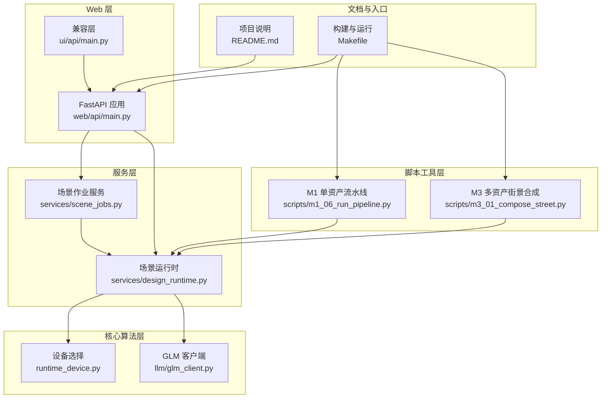
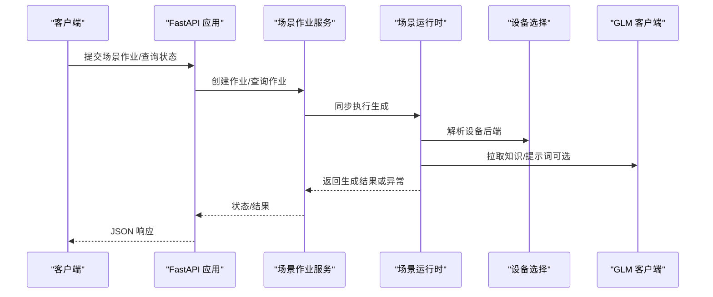
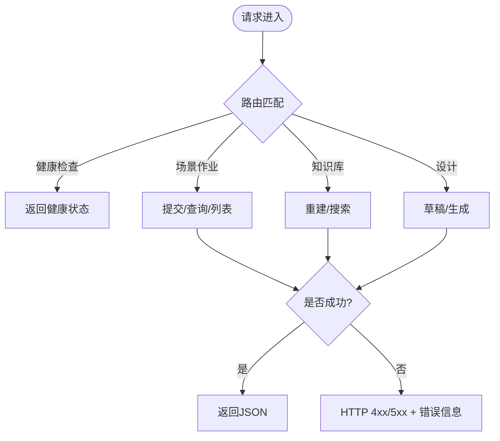
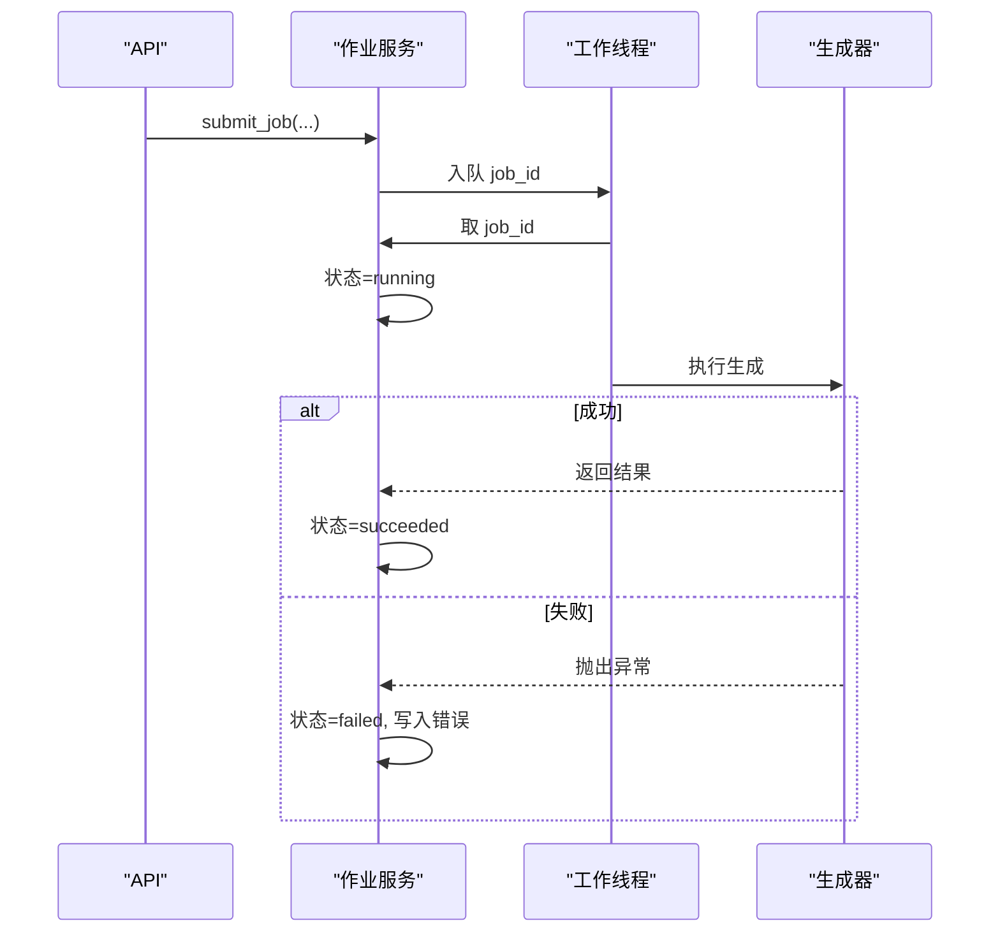
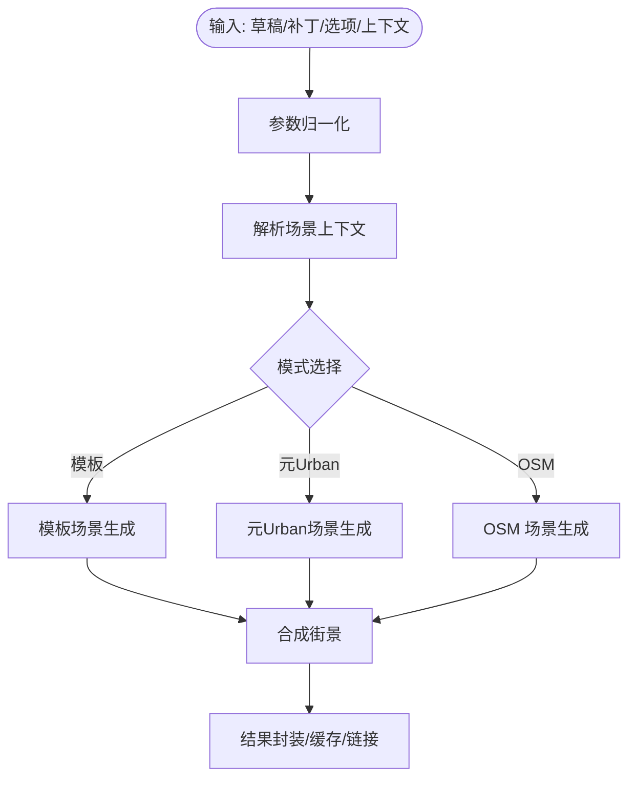
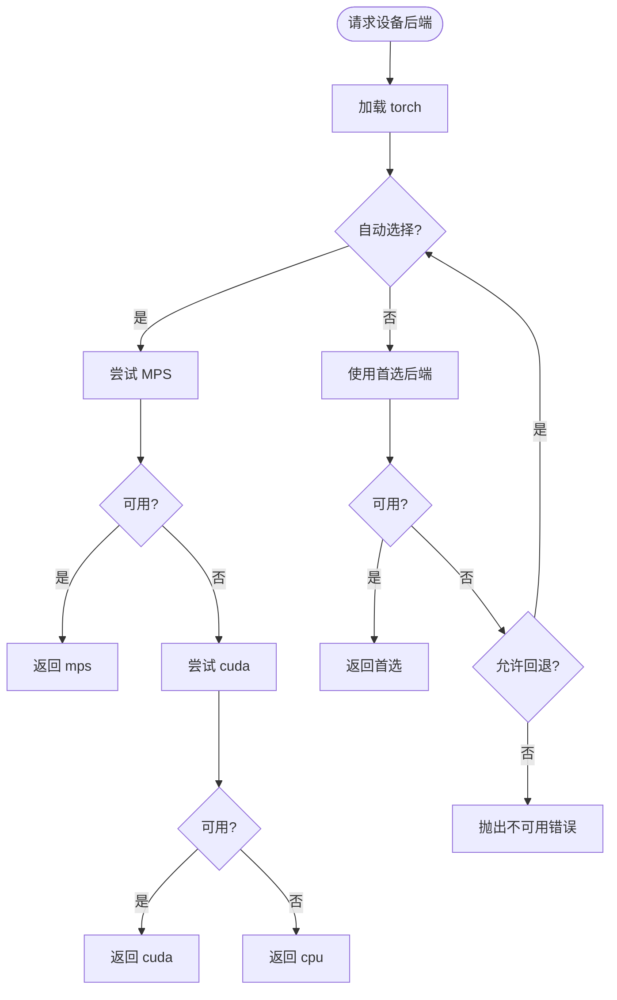
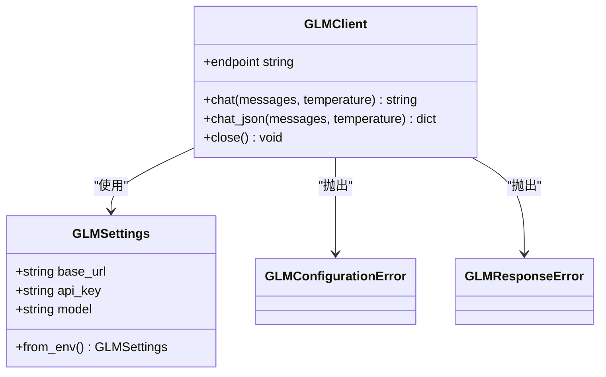
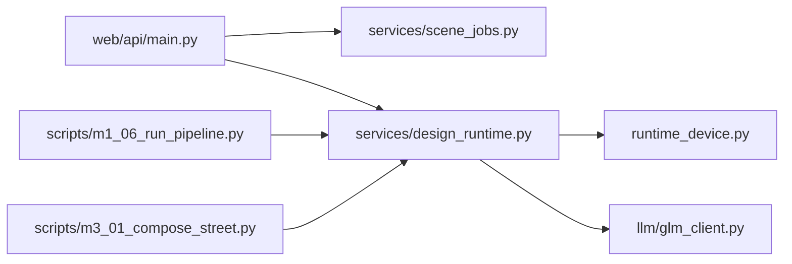

# 故障诊断

<cite>
**本文引用的文件**   
- [README.md](file://README.md)
- [Makefile](file://Makefile)
- [web/api/main.py](file://web/api/main.py)
- [src/roadgen3d/__init__.py](file://src/roadgen3d/__init__.py)
- [src/roadgen3d/runtime_device.py](file://src/roadgen3d/runtime_device.py)
- [src/roadgen3d/llm/glm_client.py](file://src/roadgen3d/llm/glm_client.py)
- [src/roadgen3d/services/design_runtime.py](file://src/roadgen3d/services/design_runtime.py)
- [src/roadgen3d/services/scene_jobs.py](file://src/roadgen3d/services/scene_jobs.py)
- [scripts/m1_06_run_pipeline.py](file://scripts/m1_06_run_pipeline.py)
- [scripts/m3_01_compose_street.py](file://scripts/m3_01_compose_street.py)
- [ui/api/main.py](file://ui/api/main.py)
</cite>

## 目录
1. [简介](#简介)
2. [项目结构](#项目结构)
3. [核心组件](#核心组件)
4. [架构总览](#架构总览)
5. [详细组件分析](#详细组件分析)
6. [依赖分析](#依赖分析)
7. [性能考虑](#性能考虑)
8. [故障排查指南](#故障排查指南)
9. [结论](#结论)
10. [附录](#附录)

## 简介
本指南面向 RoadGen3D 的使用者与运维人员，提供系统性的故障诊断与问题排查方法。内容覆盖网络连接问题、资源不足、权限错误、依赖冲突等常见问题；给出性能瓶颈分析方法（CPU 使用率、内存泄漏、磁盘 IO、网络延迟）；解释常见错误代码与异常信息的含义与解决路径；介绍调试工具（Python 调试器、网络抓包、系统监控）的使用；总结日志分析技巧与错误重现方法；最后提供预防性维护与健康检查清单。

## 项目结构
RoadGen3D 采用多模块分层组织：Web API 层（FastAPI）、服务层（场景作业队列、运行时）、核心算法层（检索、布局求解、网格导出）、脚本工具层（M1/M3 流水线）、前端工作台与查看器。开发与运行通过 Makefile 提供统一入口，便于快速启动与排障。

**图表来源**
- [web/api/main.py:1-286](file://web/api/main.py#L1-L286)
- [src/roadgen3d/services/scene_jobs.py:1-205](file://src/roadgen3d/services/scene_jobs.py#L1-L205)
- [src/roadgen3d/services/design_runtime.py:1-397](file://src/roadgen3d/services/design_runtime.py#L1-L397)
- [src/roadgen3d/runtime_device.py:1-72](file://src/roadgen3d/runtime_device.py#L1-L72)
- [src/roadgen3d/llm/glm_client.py:1-149](file://src/roadgen3d/llm/glm_client.py#L1-L149)
- [scripts/m1_06_run_pipeline.py:1-107](file://scripts/m1_06_run_pipeline.py#L1-L107)
- [scripts/m3_01_compose_street.py:1-162](file://scripts/m3_01_compose_street.py#L1-L162)
- [ui/api/main.py:1-6](file://ui/api/main.py#L1-L6)
- [README.md:1-258](file://README.md#L1-L258)
- [Makefile:1-92](file://Makefile#L1-L92)

**章节来源**
- [README.md:107-130](file://README.md#L107-L130)
- [Makefile:13-34](file://Makefile#L13-L34)

## 核心组件
- Web API（FastAPI）：提供健康检查、知识库重建与搜索、场景作业提交与查询、参考图模板与元Urban方案列表等接口。
- 场景作业服务：基于线程池与队列的单进程后台生成器，支持异步提交、轮询状态、错误回传。
- 场景运行时：从设计草稿到最终街景的编排器，负责参数归一化、后端资源准备、调用合成管线并产出结果与可视化链接。
- 设备选择：自动探测可用后端（CPU/MPS/CUDA），支持降级回退与显式报错。
- LLM 客户端：封装 GLM（OpenAI 兼容）聊天接口，解析 JSON 响应，抛出配置与响应解析异常。
- 脚本工具：M1 单资产流水线与 M3 多资产街景合成命令行工具，内置模型加载失败与通用异常捕获。

**章节来源**
- [web/api/main.py:81-267](file://web/api/main.py#L81-L267)
- [src/roadgen3d/services/scene_jobs.py:42-205](file://src/roadgen3d/services/scene_jobs.py#L42-L205)
- [src/roadgen3d/services/design_runtime.py:37-397](file://src/roadgen3d/services/design_runtime.py#L37-L397)
- [src/roadgen3d/runtime_device.py:37-72](file://src/roadgen3d/runtime_device.py#L37-L72)
- [src/roadgen3d/llm/glm_client.py:14-149](file://src/roadgen3d/llm/glm_client.py#L14-L149)
- [scripts/m1_06_run_pipeline.py:60-107](file://scripts/m1_06_run_pipeline.py#L60-L107)
- [scripts/m3_01_compose_street.py:85-162](file://scripts/m3_01_compose_street.py#L85-L162)

## 架构总览
下图展示从 Web 请求到场景生成的关键调用链路与错误传播路径。

**图表来源**
- [web/api/main.py:188-216](file://web/api/main.py#L188-L216)
- [src/roadgen3d/services/scene_jobs.py:115-136](file://src/roadgen3d/services/scene_jobs.py#L115-L136)
- [src/roadgen3d/services/design_runtime.py:336-397](file://src/roadgen3d/services/design_runtime.py#L336-L397)
- [src/roadgen3d/runtime_device.py:37-72](file://src/roadgen3d/runtime_device.py#L37-L72)
- [src/roadgen3d/llm/glm_client.py:41-109](file://src/roadgen3d/llm/glm_client.py#L41-L109)

## 详细组件分析

### 组件 A：Web API（FastAPI）与错误处理
- 健康检查：返回服务默认路径与状态。
- 场景作业：提交、列出、查询；对未找到作业返回 404。
- 知识库：重建与搜索；参数校验失败返回 400。
- LLM 相关：设计草稿与生成接口在配置或响应解析失败时返回 503/400。
- CORS：允许跨域访问，便于前端联调。

**图表来源**
- [web/api/main.py:92-267](file://web/api/main.py#L92-L267)

**章节来源**
- [web/api/main.py:92-267](file://web/api/main.py#L92-L267)

### 组件 B：场景作业服务（异步队列与线程）
- 队列与锁：保证作业状态一致性与并发安全。
- 工作线程：阻塞取任务，更新状态为 running，执行生成器，捕获异常写入 error 并标记失败。
- 等待机制：支持超时等待作业完成，失败时抛出明确错误。
- 结果回传：成功时保存结果，失败时保存错误消息。

**图表来源**
- [src/roadgen3d/services/scene_jobs.py:42-178](file://src/roadgen3d/services/scene_jobs.py#L42-L178)

**章节来源**
- [src/roadgen3d/services/scene_jobs.py:42-205](file://src/roadgen3d/services/scene_jobs.py#L42-L205)

### 组件 C：场景运行时（参数归一化与后端装配）
- 参数归一化：将草稿与补丁合并，标准化生成选项（路径、设备、导出格式等）。
- 后端装配：对象/地面/天空清单后端实例化。
- 生成分支：根据场景上下文选择模板/元Urban/OSM 模式，调用合成函数并产出结果与可视化链接。
- 异常传播：桥接层与合成层异常统一转换为运行时错误。

**图表来源**
- [src/roadgen3d/services/design_runtime.py:60-397](file://src/roadgen3d/services/design_runtime.py#L60-L397)

**章节来源**
- [src/roadgen3d/services/design_runtime.py:60-397](file://src/roadgen3d/services/design_runtime.py#L60-L397)

### 组件 D：设备选择（自动后端探测与回退）
- 自动探测：优先 MPS（macOS），其次 CUDA，否则 CPU。
- 显式后端：若请求后端不可用且不允许回退则直接报错。
- 回退告警：当发生回退时发出警告，便于用户感知。

**图表来源**
- [src/roadgen3d/runtime_device.py:37-72](file://src/roadgen3d/runtime_device.py#L37-L72)

**章节来源**
- [src/roadgen3d/runtime_device.py:37-72](file://src/roadgen3d/runtime_device.py#L37-L72)

### 组件 E：LLM 客户端（GLM）
- 配置校验：缺失凭据或基础地址时抛出配置错误。
- 请求封装：构造 OpenAI 兼容的聊天负载，设置鉴权头。
- 响应解析：提取第一条消息内容，尝试提取 JSON 负载；失败抛出响应错误。
- 环境加载：优先加载 .env 文件。

**图表来源**
- [src/roadgen3d/llm/glm_client.py:14-149](file://src/roadgen3d/llm/glm_client.py#L14-L149)

**章节来源**
- [src/roadgen3d/llm/glm_client.py:14-149](file://src/roadgen3d/llm/glm_client.py#L14-L149)

### 组件 F：脚本工具（M1/M3）
- M1：文本→FAISS→潜在向量→体素→网格导出；捕获模型加载失败与通用异常。
- M3：多资产街景合成；捕获模型加载失败与通用异常；输出汇总统计与产物路径。

**章节来源**
- [scripts/m1_06_run_pipeline.py:60-107](file://scripts/m1_06_run_pipeline.py#L60-L107)
- [scripts/m3_01_compose_street.py:85-162](file://scripts/m3_01_compose_street.py#L85-L162)

## 依赖分析
- 运行时依赖：torch（设备选择）、httpx（GLM 客户端）、FastAPI（Web API）、uvicorn（开发服务器）。
- 端口占用：API（8010）、工作台（4174）、查看器（4173）。
- 环境变量：GLM 凭据与基础地址，用于 LLM 功能。

**图表来源**
- [web/api/main.py:81-267](file://web/api/main.py#L81-L267)
- [src/roadgen3d/services/scene_jobs.py:42-205](file://src/roadgen3d/services/scene_jobs.py#L42-L205)
- [src/roadgen3d/services/design_runtime.py:37-397](file://src/roadgen3d/services/design_runtime.py#L37-L397)
- [src/roadgen3d/runtime_device.py:8-13](file://src/roadgen3d/runtime_device.py#L8-L13)
- [src/roadgen3d/llm/glm_client.py:11](file://src/roadgen3d/llm/glm_client.py#L11)
- [scripts/m1_06_run_pipeline.py:15-20](file://scripts/m1_06_run_pipeline.py#L15-L20)
- [scripts/m3_01_compose_street.py:16-18](file://scripts/m3_01_compose_street.py#L16-L18)

**章节来源**
- [Makefile:40-44](file://Makefile#L40-L44)
- [Makefile:48-53](file://Makefile#L48-L53)
- [Makefile:62-67](file://Makefile#L62-L67)

## 性能考虑
- CPU 使用率
  - 症状：生成缓慢、CPU 占用高。
  - 排查：确认设备选择是否回退至 CPU；检查是否启用 GPU 后端。
  - 优化：优先使用可用 GPU 后端；减少导出分辨率与拓扑复杂度。
- 内存泄漏
  - 症状：长时间运行后内存持续增长。
  - 排查：关注大对象（索引、潜在向量、网格）生命周期；避免重复加载模型。
  - 优化：及时释放中间结果；复用已加载模型；限制并发。
- 磁盘 IO
  - 症状：磁盘读写频繁、导出耗时长。
  - 排查：检查导出目录与缓存路径；确认磁盘空间充足。
  - 优化：使用 SSD；合理设置导出格式；清理旧产物。
- 网络延迟
  - 症状：LLM 响应慢或超时。
  - 排查：检查网络连通性与代理；验证 GLM 基础地址与凭据。
  - 优化：提升带宽；缩短超时时间；本地化模型与缓存。

[本节为通用指导，不直接分析具体文件]

## 故障排查指南

### 一、网络连接问题
- 现象
  - LLM 调用返回 503 或解析失败。
  - Web API 访问受限或跨域失败。
- 诊断步骤
  - 确认环境变量 GLM 基础地址与密钥完整。
  - 使用 curl/浏览器测试 /api/health 是否可达。
  - 检查 CORS 设置与前端端口映射。
- 解决方案
  - 补充 .env 中的凭据；重启 API 服务。
  - 在防火墙/代理中放行相关端口；确保 DNS 解析正常。

**章节来源**
- [src/roadgen3d/llm/glm_client.py:28-38](file://src/roadgen3d/llm/glm_client.py#L28-L38)
- [web/api/main.py:92-99](file://web/api/main.py#L92-L99)
- [web/api/main.py:83-89](file://web/api/main.py#L83-L89)

### 二、资源不足（CPU/GPU/内存/磁盘）
- 症状
  - 生成卡住或报设备不可用。
  - 导出失败或内存溢出。
- 诊断步骤
  - 查看设备选择日志与回退告警。
  - 使用系统监控工具观察 CPU/内存/磁盘占用。
  - 检查导出路径所在分区剩余空间。
- 解决方案
  - 切换到可用 GPU 后端；降低导出分辨率。
  - 清理 artifacts 与缓存；关闭其他占用资源的程序。

**章节来源**
- [src/roadgen3d/runtime_device.py:56-62](file://src/roadgen3d/runtime_device.py#L56-L62)
- [Makefile:40-44](file://Makefile#L40-L44)

### 三、权限错误
- 现象
  - 无法写入导出目录或缓存。
  - 读取模型/清单文件失败。
- 诊断步骤
  - 确认运行用户对 artifacts/data/models 目录具有读写权限。
  - 检查只读文件系统或沙箱限制。
- 解决方案
  - 修改目录权限或切换到有权限的用户。
  - 使用本地文件模式并指定绝对路径。

**章节来源**
- [src/roadgen3d/services/design_runtime.py:111-148](file://src/roadgen3d/services/design_runtime.py#L111-L148)
- [scripts/m1_06_run_pipeline.py:32-33](file://scripts/m1_06_run_pipeline.py#L32-L33)

### 四、依赖冲突
- 现象
  - 启动时报导入错误或版本不兼容。
  - torch 无法加载或后端不可用。
- 诊断步骤
  - 对照 requirements-m1/m2/m5/ui 文件安装依赖。
  - 确认 Python 版本与平台匹配（macOS arm64）。
- 解决方案
  - 使用虚拟环境隔离依赖；按顺序安装各阶段依赖。
  - 升级/降级冲突包至兼容版本。

**章节来源**
- [README.md:33-55](file://README.md#L33-L55)

### 五、常见错误代码与异常
- HTTP 404：作业不存在或模板/计划图片不存在。
- HTTP 400：请求参数无效或知识库重建/搜索失败。
- HTTP 503：GLM 配置或响应解析错误。
- 运行时错误：生成过程中抛出的 RuntimeError，包含具体原因。
- 设备不可用：请求后端不可用且不允许回退时抛出。

**章节来源**
- [web/api/main.py:118-123](file://web/api/main.py#L118-L123)
- [web/api/main.py:167-171](file://web/api/main.py#L167-L171)
- [web/api/main.py:231-233](file://web/api/main.py#L231-L233)
- [src/roadgen3d/services/scene_jobs.py:162-170](file://src/roadgen3d/services/scene_jobs.py#L162-L170)
- [src/roadgen3d/runtime_device.py:54-55](file://src/roadgen3d/runtime_device.py#L54-L55)

### 六、性能瓶颈分析方法
- CPU 使用率
  - 使用 top/htop 观察进程 CPU 占用；定位高占用阶段（检索/布局/导出）。
- 内存泄漏
  - 使用 psutil/内存分析工具对比生成前后内存；检查大对象生命周期。
- 磁盘 IO
  - 使用 iostat/iotop 观察磁盘吞吐；减少不必要的中间文件。
- 网络延迟
  - 使用 curl -w 与抓包工具测量往返时间；检查代理与 DNS。

[本节为通用指导，不直接分析具体文件]

### 七、调试工具使用
- Python 调试器
  - 在关键函数入口设置断点，逐步跟踪参数归一化、设备解析、生成执行。
- 网络抓包
  - 使用 Wireshark/Fiddler 抓取 /api/* 请求与 LLM chat/completions。
- 系统监控
  - 使用系统自带监控或第三方工具记录 CPU/内存/IO/网络指标。

[本节为通用指导，不直接分析具体文件]

### 八、日志分析技巧与错误重现
- 日志位置
  - Web API：标准输出；Makefile 中 uvicorn 启动。
  - ROS 桥接：metaurban/bridges/ros_bridge/log 下的事件/标准输出日志。
- 分析要点
  - 关注设备选择回退日志、LLM 配置错误、作业失败堆栈。
  - 通过最小化参数与固定种子重现问题。
- 重现步骤
  - 使用 scripts/m1_06_run_pipeline.py 或 m3_01_compose_street.py 的最小命令行参数复现。

**章节来源**
- [Makefile:40-44](file://Makefile#L40-L44)
- [scripts/m1_06_run_pipeline.py:60-107](file://scripts/m1_06_run_pipeline.py#L60-L107)
- [scripts/m3_01_compose_street.py:85-162](file://scripts/m3_01_compose_street.py#L85-L162)

### 九、预防性维护与健康检查清单
- 健康检查
  - 访问 /api/health 确认服务就绪。
  - 检查端口占用与进程存活。
- 依赖维护
  - 定期同步 requirements；升级兼容的安全补丁。
- 资源管理
  - 监控磁盘空间与临时文件清理；限制并发以避免资源枯竭。
- 网络与凭据
  - 定期验证 GLM 基础地址与密钥；测试连通性。
- 日志与告警
  - 配置日志轮转；对关键错误建立告警。

**章节来源**
- [web/api/main.py:92-99](file://web/api/main.py#L92-L99)
- [Makefile:15-28](file://Makefile#L15-L28)

## 结论
本指南提供了 RoadGen3D 的系统化故障诊断路径：从网络、资源、权限到依赖冲突的分类排查；结合性能瓶颈分析与调试工具使用；配合日志分析与错误重现方法，并给出预防性维护建议。建议在日常运维中将健康检查与日志轮转纳入自动化流程，以降低故障影响面。

## 附录
- 快速启动与端口
  - make dev 同时启动 API、工作台、查看器。
  - 默认端口：API 8010、工作台 4174、查看器 4173。
- 兼容入口
  - ui/api/main.py 作为兼容层转发到 web/api/main.py。

**章节来源**
- [Makefile:29-34](file://Makefile#L29-L34)
- [README.md:65-71](file://README.md#L65-L71)
- [ui/api/main.py:1-6](file://ui/api/main.py#L1-L6)