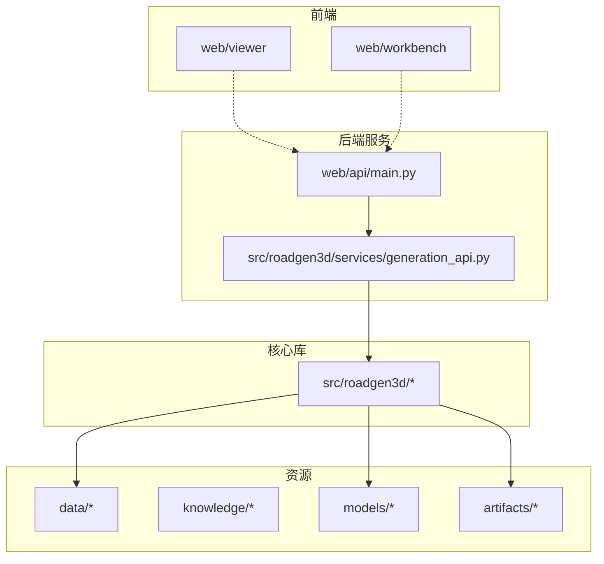
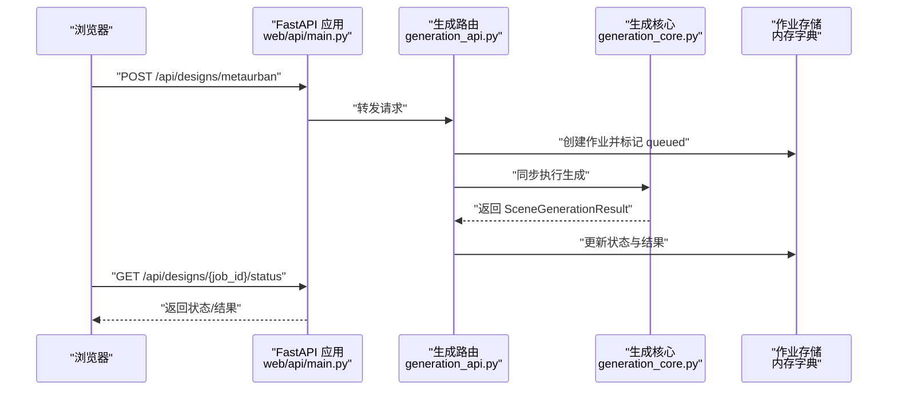
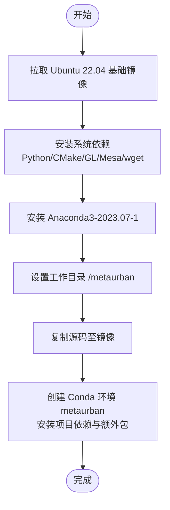
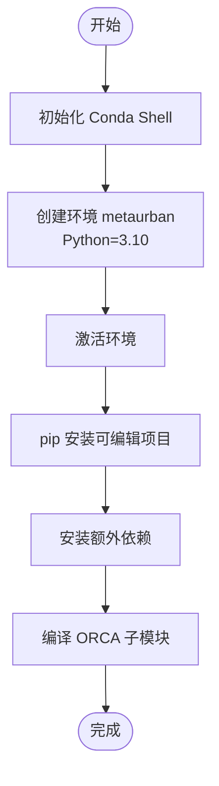
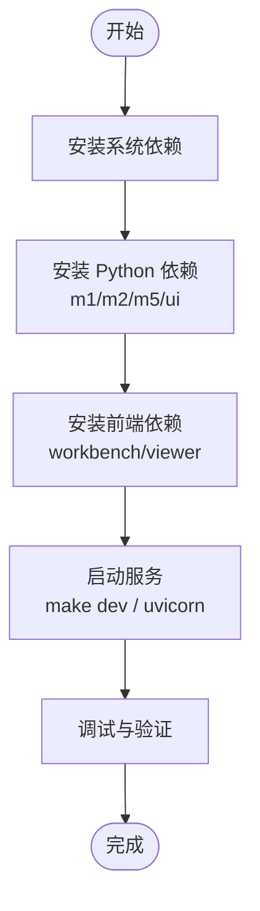
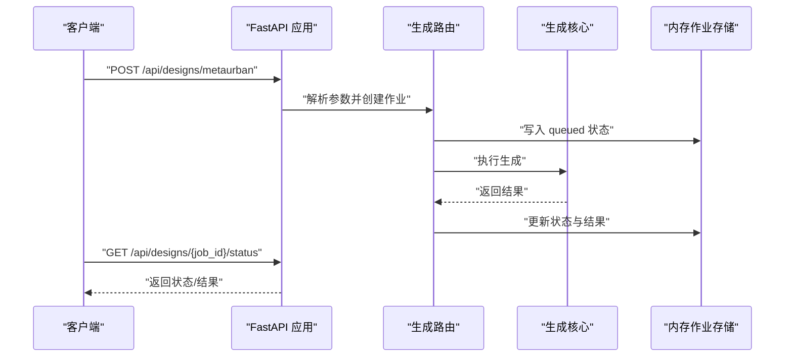
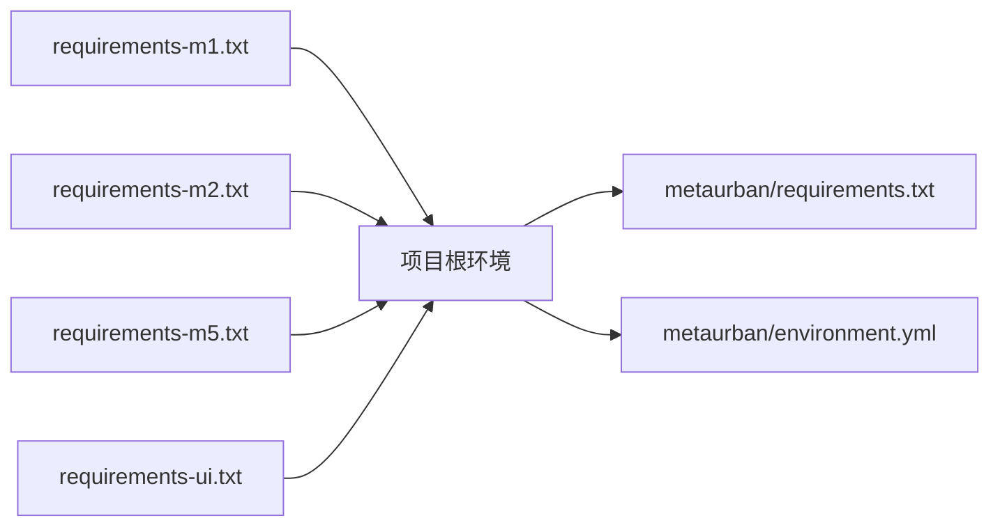

# 本地部署

<cite>
**本文引用的文件**
- [README.md](file://README.md)
- [API_GUIDE.md](file://API_GUIDE.md)
- [Makefile](file://Makefile)
- [metaurban/Dockerfile](file://metaurban/Dockerfile)
- [metaurban/environment.yml](file://metaurban/environment.yml)
- [metaurban/requirements.txt](file://metaurban/requirements.txt)
- [metaurban/install.sh](file://metaurban/install.sh)
- [metaurban/setup.sh](file://metaurban/setup.sh)
- [requirements-m1.txt](file://requirements-m1.txt)
- [requirements-m2.txt](file://requirements-m2.txt)
- [requirements-m5.txt](file://requirements-m5.txt)
- [requirements-ui.txt](file://requirements-ui.txt)
- [web/api/main.py](file://web/api/main.py)
- [src/roadgen3d/services/generation_api.py](file://src/roadgen3d/services/generation_api.py)
</cite>

## 目录
1. [简介](#简介)
2. [项目结构](#项目结构)
3. [核心组件](#核心组件)
4. [架构总览](#架构总览)
5. [详细组件分析](#详细组件分析)
6. [依赖关系分析](#依赖关系分析)
7. [性能考虑](#性能考虑)
8. [故障排查指南](#故障排查指南)
9. [结论](#结论)
10. [附录](#附录)

## 简介
本指南面向希望在本地部署 RoadGen3D 的用户，覆盖三种主要部署方式：
- Docker 容器化部署：适合快速获得一致环境与隔离运行。
- Conda 环境部署：适合开发者与研究者进行源码开发与调试。
- 手动安装部署：适合对系统依赖与运行时有精细控制需求的场景。

同时，文档提供各方式的优缺点对比、网络与端口配置、常见问题排查、调试技巧以及性能优化建议与资源配置最佳实践。

## 项目结构
RoadGen3D 采用多模块分层组织：
- web/api：FastAPI 后端服务入口，提供 REST API。
- src/roadgen3d：核心 Python 库，包含生成管线、服务与工具。
- scripts：命令行工具脚本，按里程碑划分。
- data/knowledge/models/artifacts：数据、知识库、模型与产物目录。
- web/viewer 与 web/workbench：前端可视化与工作台（通过 npm 管理依赖）。
- metaurban：MetaUrban 引擎子模块（含 Dockerfile、Conda 环境与安装脚本）。

图表来源
- [web/api/main.py:1-286](file://web/api/main.py#L1-L286)
- [src/roadgen3d/services/generation_api.py:1-294](file://src/roadgen3d/services/generation_api.py#L1-L294)

章节来源
- [README.md:107-130](file://README.md#L107-L130)

## 核心组件
- Web API 服务：以 FastAPI 提供 REST 接口，支持异步作业模式与健康检查。
- 生成 API 路由：封装 MetaUrban、Graph Template 等生成请求，维护内存作业存储。
- 生成核心：调用底层管线完成布局规划、资产检索与网格导出。
- 前端工作台与查看器：通过 npm 管理依赖，分别提供交互式工作台与 3D 查看器。

章节来源
- [web/api/main.py:81-267](file://web/api/main.py#L81-L267)
- [src/roadgen3d/services/generation_api.py:131-291](file://src/roadgen3d/services/generation_api.py#L131-L291)

## 架构总览
下图展示从浏览器到后端 API，再到生成核心与资源的端到端流程。

图表来源
- [web/api/main.py:81-267](file://web/api/main.py#L81-L267)
- [src/roadgen3d/services/generation_api.py:102-179](file://src/roadgen3d/services/generation_api.py#L102-L179)

## 详细组件分析

### Docker 容器化部署
- 基础镜像与系统依赖：Ubuntu 22.04，安装 Python、CMake、OpenGL/Mesa 运行库与 wget。
- Anaconda 初始化：下载并安装 Anaconda3-2023.07-1，初始化 Bash。
- 工作目录与代码复制：进入 /metaurban 并复制全部源码。
- 环境与依赖安装：
  - 创建名为 metaurban 的 Conda 环境（Dockerfile 中指定 Python=3.9；environment.yml 中为 3.10）。
  - 安装项目可编辑安装与若干 Python 包。
  - 安装 pybind11（conda-forge）与部分额外依赖。
- 注意事项：
  - Dockerfile 与 environment.yml 的 Python 版本不一致，建议统一为 3.10（与项目 README 的 3.11+ 建议保持一致）。
  - 若需图形界面或 GPU 加速，需在宿主机安装相应驱动并在 docker run 时挂载设备。

图表来源
- [metaurban/Dockerfile:1-40](file://metaurban/Dockerfile#L1-L40)

章节来源
- [metaurban/Dockerfile:1-40](file://metaurban/Dockerfile#L1-L40)
- [metaurban/environment.yml:1-16](file://metaurban/environment.yml#L1-L16)
- [README.md:33-55](file://README.md#L33-L55)

### Conda 环境配置
- 环境文件：environment.yml 定义了 channels、依赖与可选 pip 列表，Python 版本为 3.10。
- 安装脚本：install.sh 负责激活环境、安装可编辑包与额外依赖，并编译 ORCA 算法子模块。
- setup.sh 用于重新编译 ORCA。
- 项目根目录 README 建议使用 Python 3.11+（macOS arm64），与 Conda 环境 3.10 存在差异，建议按实际硬件与依赖兼容性选择。

图表来源
- [metaurban/install.sh:1-20](file://metaurban/install.sh#L1-L20)
- [metaurban/setup.sh:1-8](file://metaurban/setup.sh#L1-L8)
- [metaurban/environment.yml:1-16](file://metaurban/environment.yml#L1-L16)

章节来源
- [metaurban/environment.yml:1-16](file://metaurban/environment.yml#L1-L16)
- [metaurban/requirements.txt:1-129](file://metaurban/requirements.txt#L1-L129)
- [metaurban/install.sh:1-20](file://metaurban/install.sh#L1-L20)
- [metaurban/setup.sh:1-8](file://metaurban/setup.sh#L1-L8)
- [README.md:33-55](file://README.md#L33-L55)

### 手动安装（系统级）
- 系统依赖：根据 Dockerfile，至少需要 Python、CMake、OpenGL/Mesa 运行库等。
- Python 包安装：按里程碑分别安装 requirements-m1/m2/m5/ui.txt。
- 前端依赖：通过 Makefile 的 workbench-install 与 viewer-install 目标安装 npm 依赖。
- 运行与调试：使用 Makefile 的 dev、workbench-api、workbench-web、viewer-web 目标启动服务；或直接使用 uvicorn 启动 web/api/main.py。

图表来源
- [Makefile:15-92](file://Makefile#L15-L92)
- [requirements-m1.txt:1-7](file://requirements-m1.txt#L1-L7)
- [requirements-m2.txt:1-4](file://requirements-m2.txt#L1-L4)
- [requirements-m5.txt:1-5](file://requirements-m5.txt#L1-L5)
- [requirements-ui.txt:1-12](file://requirements-ui.txt#L1-L12)

章节来源
- [Makefile:15-92](file://Makefile#L15-L92)
- [README.md:33-55](file://README.md#L33-L55)

### 网络与端口配置
- 默认监听地址与端口：
  - API：127.0.0.1:8010
  - 工作台：127.0.0.1:4174
  - 查看器：127.0.0.1:4173
- Makefile 提供 dev 组合启动与单个服务启动目标；也可直接使用 uvicorn 启动 web/api/main.py。
- CORS 已在 web/api/main.py 中配置允许跨域。

章节来源
- [Makefile:6-11](file://Makefile#L6-L11)
- [Makefile:29-34](file://Makefile#L29-L34)
- [web/api/main.py:83-89](file://web/api/main.py#L83-L89)

### 生成 API 与作业流程
- 生成路由：
  - POST /api/designs/metaurban：创建 MetaUrban 街道生成作业。
  - POST /api/designs/template：基于图模板生成。
  - GET /api/designs/{job_id}/status：查询作业状态。
  - GET /api/scenes/{job_id}：获取已完成场景的完整结果。
- 作业存储：当前使用内存字典保存作业状态，生产环境建议替换为持久化存储。
- 错误处理：对未知设计类型、作业不存在、生成失败等情况返回相应 HTTP 状态码与错误信息。

图表来源
- [src/roadgen3d/services/generation_api.py:131-291](file://src/roadgen3d/services/generation_api.py#L131-L291)

章节来源
- [src/roadgen3d/services/generation_api.py:131-291](file://src/roadgen3d/services/generation_api.py#L131-L291)
- [web/api/main.py:188-221](file://web/api/main.py#L188-L221)

## 依赖关系分析
- Python 依赖分层：
  - M1：文本检索与基础张量运算（CPython 3.11/3.12 推荐）。
  - M2：网格与几何处理。
  - M5：地理空间与网络请求。
  - UI：FastAPI、Uvicorn、Pydantic 等。
- 元依赖（metaurban/requirements.txt）：包含大量第三方库，如 PyTorch、FAISS、Panda3D、OpenCV、Matplotlib 等。
- Conda 环境（environment.yml）：定义 channels 与 Python 版本，pip 列表指向文档依赖与可编辑安装。

图表来源
- [requirements-m1.txt:1-7](file://requirements-m1.txt#L1-L7)
- [requirements-m2.txt:1-4](file://requirements-m2.txt#L1-L4)
- [requirements-m5.txt:1-5](file://requirements-m5.txt#L1-L5)
- [requirements-ui.txt:1-12](file://requirements-ui.txt#L1-L12)
- [metaurban/requirements.txt:1-129](file://metaurban/requirements.txt#L1-L129)
- [metaurban/environment.yml:1-16](file://metaurban/environment.yml#L1-L16)

章节来源
- [requirements-m1.txt:1-7](file://requirements-m1.txt#L1-L7)
- [requirements-m2.txt:1-4](file://requirements-m2.txt#L1-L4)
- [requirements-m5.txt:1-5](file://requirements-m5.txt#L1-L5)
- [requirements-ui.txt:1-12](file://requirements-ui.txt#L1-L12)
- [metaurban/requirements.txt:1-129](file://metaurban/requirements.txt#L1-L129)
- [metaurban/environment.yml:1-16](file://metaurban/environment.yml#L1-L16)

## 性能考虑
- Python 版本与硬件匹配：README 建议 CPython 3.11+（macOS arm64），若在其他平台部署，优先选择与 PyTorch、FAISS 等依赖兼容的版本。
- CUDA 与 GPU：元依赖包含 NVIDIA CUDA/CUDNN 等库，若宿主机具备 NVIDIA GPU，建议启用 CUDA 运行时以提升张量与渲染性能。
- 依赖精简：仅安装所需里程碑依赖，避免不必要的包占用磁盘与内存。
- 并发与队列：当前生成 API 使用内存作业存储且同步执行，建议在生产环境引入持久化存储与后台任务队列（如 Celery/RQ）以提升吞吐与稳定性。
- 缓存与中间产物：合理利用 artifacts 与缓存目录，减少重复计算。

## 故障排查指南
- 端口冲突：
  - 现象：服务启动时报端口已被占用。
  - 处理：修改 Makefile 中的 HOST/PORT 或停止占用进程。
- 依赖缺失：
  - 现象：导入模块报错或运行时报缺少系统库。
  - 处理：确认已安装系统依赖（OpenGL/Mesa 等），并按 requirements-m1/m2/m5/ui.txt 安装 Python 依赖。
- Conda 环境不一致：
  - 现象：Dockerfile 与 environment.yml 的 Python 版本不一致。
  - 处理：统一为 3.10 或 3.11+，并清理旧环境后重建。
- 生成失败：
  - 现象：作业状态为 failed。
  - 处理：检查日志输出，确认输入参数合法（如 reference_plan_id、长度/宽度范围等）。
- LLM/RAG 相关错误：
  - 现象：GLM 配置或响应错误。
  - 处理：检查 .env 中的 API Key 与 Base URL，确保网络可达。

章节来源
- [Makefile:6-11](file://Makefile#L6-L11)
- [README.md:208-217](file://README.md#L208-L217)
- [API_GUIDE.md:303-337](file://API_GUIDE.md#L303-L337)

## 结论
- Docker 适合快速部署与一致性保证，适合 CI/CD 与演示环境。
- Conda 适合本地开发与调试，便于源码级修改与依赖管理。
- 手动安装适合对系统与依赖有强约束的生产环境。
- 建议在生产环境中完善作业队列、持久化与监控体系，并根据硬件能力选择合适的 Python 与 CUDA 版本。

## 附录

### 端口与服务一览
- API 服务：http://127.0.0.1:8010
- 工作台：http://127.0.0.1:4174
- 查看器：http://127.0.0.1:4173

章节来源
- [Makefile:6-11](file://Makefile#L6-L11)
- [README.md:65-70](file://README.md#L65-L70)

### 环境变量示例
- 在项目根目录创建 .env 文件，包含如下键值（示例）：
  - key=your_api_key
  - llm_base_url=https://open.bigmodel.cn/api/coding/paas/v4
  - GRAPHRAG_API_KEY=your_graphrag_key
  - GRAPHRAG_API_BASE=https://api.example.com/v1/

章节来源
- [README.md:210-217](file://README.md#L210-L217)

### 生成 API 快速参考
- POST /api/designs/metaurban：提交生成请求，返回 job_id。
- GET /api/designs/{job_id}/status：轮询查询状态。
- GET /api/scenes/{job_id}：获取完成后场景的完整结果。

章节来源
- [API_GUIDE.md:75-166](file://API_GUIDE.md#L75-L166)
- [web/api/main.py:188-221](file://web/api/main.py#L188-L221)