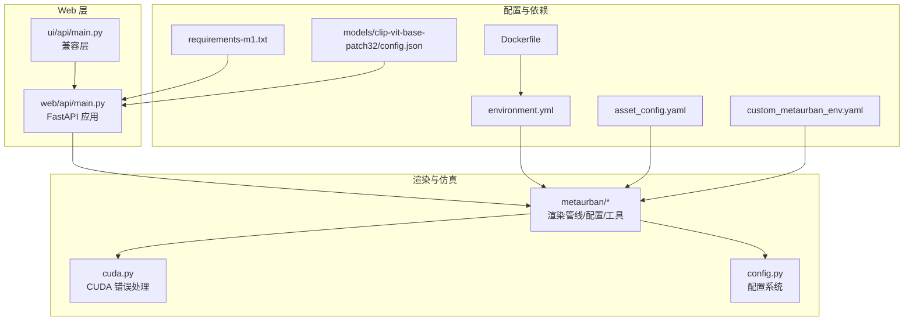
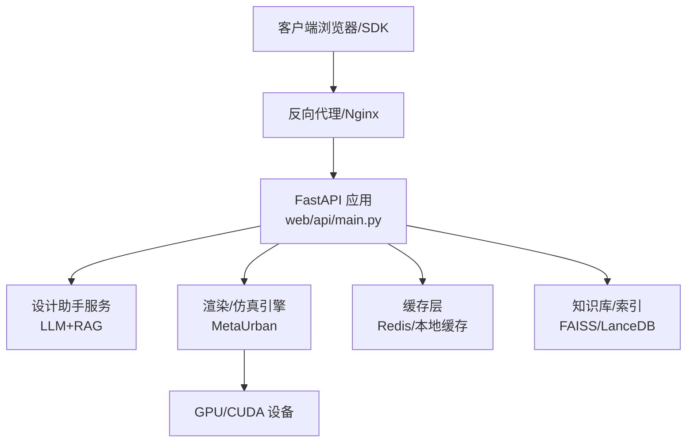
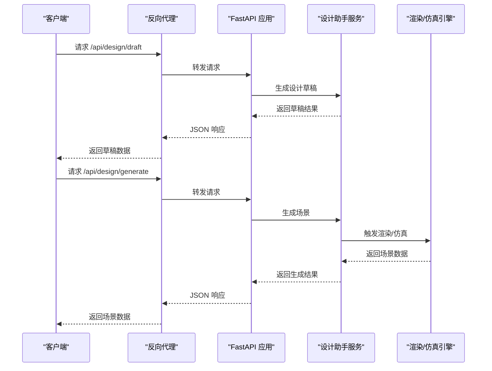
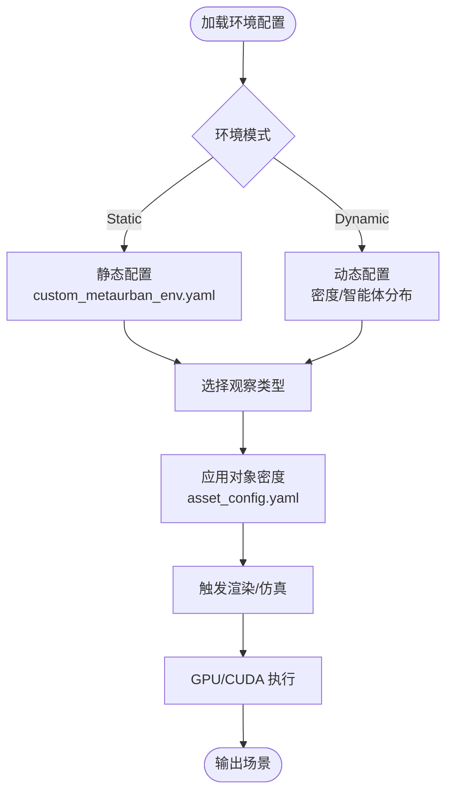
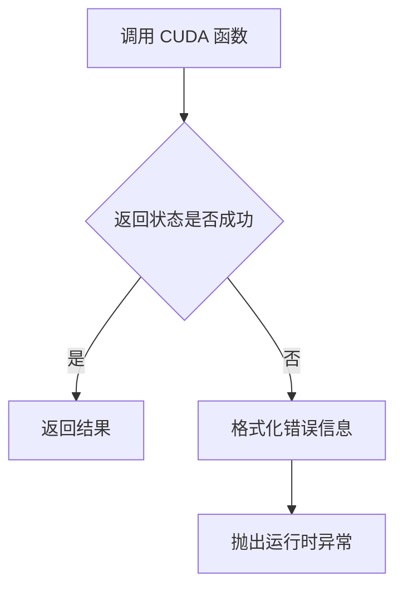
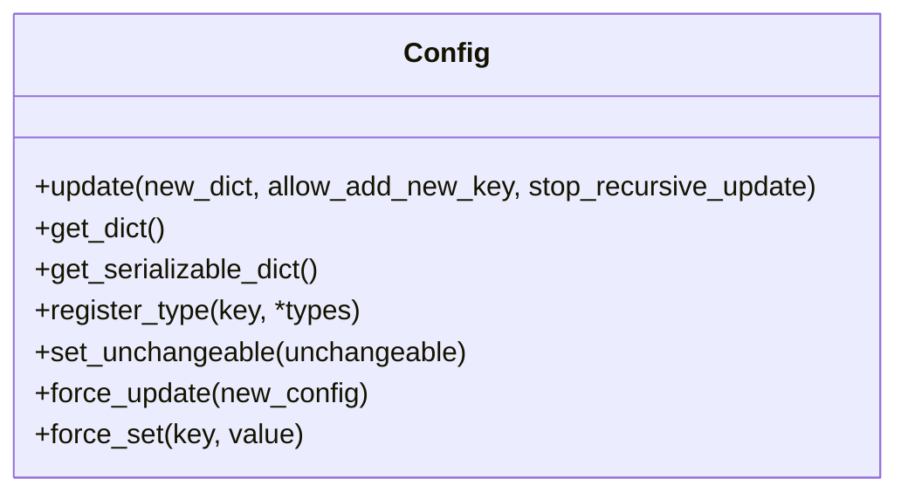
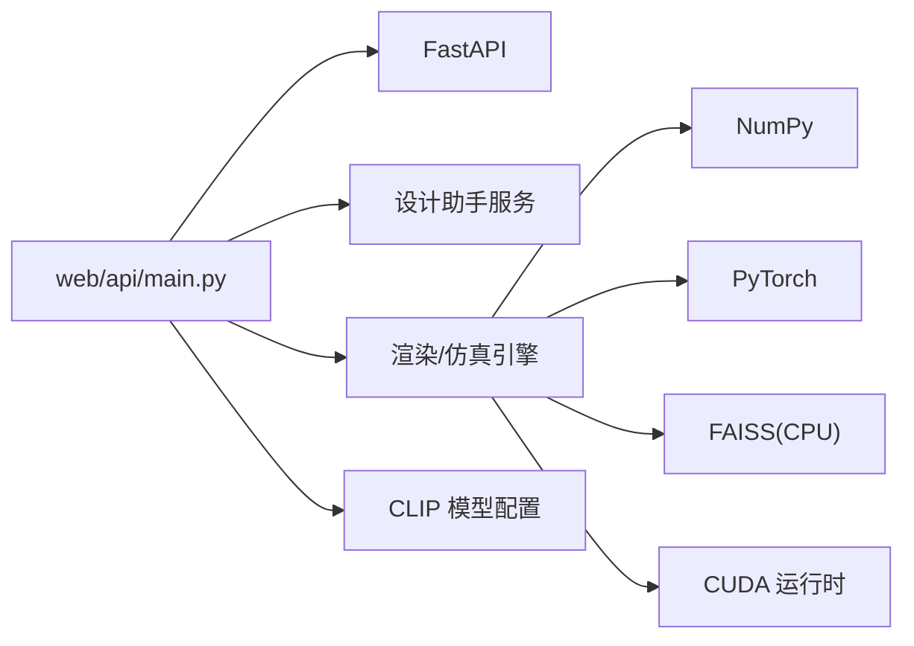

# 生产环境配置

<cite>
**本文引用的文件**
- [web/api/main.py](file://web/api/main.py)
- [ui/api/main.py](file://ui/api/main.py)
- [metaurban/Dockerfile](file://metaurban/Dockerfile)
- [metaurban/environment.yml](file://metaurban/environment.yml)
- [metaurban/asset_config.yaml](file://metaurban/asset_config.yaml)
- [metaurban/custom_metaurban_env.yaml](file://metaurban/custom_metaurban_env.yaml)
- [metaurban/metaurban/utils/cuda.py](file://metaurban/metaurban/utils/cuda.py)
- [metaurban/metaurban/utils/config.py](file://metaurban/metaurban/utils/config.py)
- [requirements-m1.txt](file://requirements-m1.txt)
- [models/clip-vit-base-patch32/config.json](file://models/clip-vit-base-patch32/config.json)
</cite>

## 目录
1. [简介](#简介)
2. [项目结构](#项目结构)
3. [核心组件](#核心组件)
4. [架构总览](#架构总览)
5. [详细组件分析](#详细组件分析)
6. [依赖分析](#依赖分析)
7. [性能考虑](#性能考虑)
8. [故障排查指南](#故障排查指南)
9. [结论](#结论)
10. [附录](#附录)

## 简介
本文件面向 RoadGen3D 的生产环境部署与运维，聚焦高性能配置（内存、CPU、GPU）、负载均衡与多实例部署、数据库与缓存、静态资源优化、SSL 与反向代理、域名解析、性能基准与容量规划，以及安全加固（防火墙、访问控制、数据加密）。内容基于仓库中的 Web API、渲染管线、配置与依赖定义进行归纳总结，并提供可操作的建议与图示。

## 项目结构
- Web API 层：FastAPI 应用入口位于 web/api/main.py，提供健康检查、知识检索、设计草稿生成、场景作业管理等接口；ui/api/main.py 为兼容层，指向 web/api/main.py。
- 渲染与仿真引擎：MetaUrban 引擎位于 metaurban/ 目录，包含渲染管线配置、CUDA 工具、配置系统等。
- 配置与依赖：Dockerfile、environment.yml、asset_config.yaml、custom_metaurban_env.yaml、requirements-m1.txt 等。
- 模型与资源：models/clip-vit-base-patch32/config.json 提供 CLIP 视觉编码器配置参考。

**图表来源**
- [web/api/main.py:1-286](file://web/api/main.py#L1-L286)
- [ui/api/main.py:1-6](file://ui/api/main.py#L1-L6)
- [metaurban/Dockerfile:1-40](file://metaurban/Dockerfile#L1-L40)
- [metaurban/environment.yml:1-16](file://metaurban/environment.yml#L1-L16)
- [metaurban/asset_config.yaml:1-835](file://metaurban/asset_config.yaml#L1-L835)
- [metaurban/custom_metaurban_env.yaml:1-32](file://metaurban/custom_metaurban_env.yaml#L1-L32)
- [metaurban/metaurban/utils/cuda.py:1-40](file://metaurban/metaurban/utils/cuda.py#L1-L40)
- [metaurban/metaurban/utils/config.py:1-354](file://metaurban/metaurban/utils/config.py#L1-L354)
- [requirements-m1.txt:1-7](file://requirements-m1.txt#L1-L7)
- [models/clip-vit-base-patch32/config.json](file://models/clip-vit-base-patch32/config.json)

**章节来源**
- [web/api/main.py:1-286](file://web/api/main.py#L1-L286)
- [ui/api/main.py:1-6](file://ui/api/main.py#L1-L6)

## 核心组件
- Web API（FastAPI）：提供健康检查、城市列表、参考方案与模板图片、知识重建与检索、设计草稿与生成、场景作业管理、场景评估等接口。
- 渲染与仿真引擎（MetaUrban）：包含渲染管线配置、对象密度与布局参数、观察类型、动态/静态环境切换等。
- CUDA 工具：封装 cudart 错误处理与辅助函数，用于 GPU 加速场景下的错误诊断。
- 配置系统：支持深度合并、键值校验、序列化与不可变配置，便于在生产中安全更新。
- 容器与依赖：Dockerfile 与 environment.yml 定义运行环境；requirements-m1.txt 指定 Python 版本与关键库版本范围。

**章节来源**
- [web/api/main.py:81-267](file://web/api/main.py#L81-L267)
- [metaurban/custom_metaurban_env.yaml:1-32](file://metaurban/custom_metaurban_env.yaml#L1-L32)
- [metaurban/metaurban/utils/cuda.py:1-40](file://metaurban/metaurban/utils/cuda.py#L1-L40)
- [metaurban/metaurban/utils/config.py:70-327](file://metaurban/metaurban/utils/config.py#L70-L327)
- [metaurban/Dockerfile:1-40](file://metaurban/Dockerfile#L1-L40)
- [metaurban/environment.yml:1-16](file://metaurban/environment.yml#L1-L16)
- [requirements-m1.txt:1-7](file://requirements-m1.txt#L1-L7)

## 架构总览
下图展示生产环境的关键交互：客户端通过反向代理访问 Web API，API 调用设计助手服务与渲染/仿真引擎，同时可能访问知识库与缓存。

**图表来源**
- [web/api/main.py:156-267](file://web/api/main.py#L156-L267)
- [metaurban/metaurban/utils/cuda.py:1-40](file://metaurban/metaurban/utils/cuda.py#L1-L40)

## 详细组件分析

### Web API（FastAPI）生产配置要点
- 健康检查与 CORS：提供 /api/health 接口；CORS 允许跨域访问，生产中应限制允许源。
- 知识检索与重建：支持 PDF 知识库重建与检索，注意大文件与并发访问的资源占用。
- 场景作业管理：支持创建、查询与获取作业，需配合后台任务队列与持久化存储。
- 图片接口：参考方案与模板图片以 FileResponse 返回，需确保静态资源路径与权限正确。

**图表来源**
- [web/api/main.py:156-201](file://web/api/main.py#L156-L201)

**章节来源**
- [web/api/main.py:81-267](file://web/api/main.py#L81-L267)

### 渲染与仿真引擎（MetaUrban）生产配置
- 环境配置：支持 Static/Dynamic 环境切换，可配置人行道宽度、缓冲区、建筑宽度、对象密度与背景智能体分布。
- 渲染与观察：可选择 lidar/rgb/depth/semantic/all 等观察类型，影响 GPU/CPU 负载与带宽。
- 资产配置：asset_config.yaml 定义对象类别、颜色、密度与空间分布，影响渲染复杂度与内存占用。

**图表来源**
- [metaurban/custom_metaurban_env.yaml:1-32](file://metaurban/custom_metaurban_env.yaml#L1-L32)
- [metaurban/asset_config.yaml:1-835](file://metaurban/asset_config.yaml#L1-L835)

**章节来源**
- [metaurban/custom_metaurban_env.yaml:1-32](file://metaurban/custom_metaurban_env.yaml#L1-L32)
- [metaurban/asset_config.yaml:1-835](file://metaurban/asset_config.yaml#L1-L835)

### CUDA 工具与 GPU 加速
- 错误处理：封装 cudart 错误码到可读字符串，便于定位 CUDA 运行时异常。
- 使用建议：在生产中启用 GPU 时，监控显存使用、核函数执行时间与错误日志；对异常进行重试与降级。

**图表来源**
- [metaurban/metaurban/utils/cuda.py:16-34](file://metaurban/metaurban/utils/cuda.py#L16-L34)

**章节来源**
- [metaurban/metaurban/utils/cuda.py:1-40](file://metaurban/metaurban/utils/cuda.py#L1-L40)

### 配置系统（Config）
- 功能：深度合并、键值校验、类型约束、序列化、不可变锁定，适合生产中的安全配置更新。
- 建议：在容器启动时加载默认配置，再通过环境变量或挂载文件进行增量覆盖；对关键字段设置不可变锁。

**图表来源**
- [metaurban/metaurban/utils/config.py:70-327](file://metaurban/metaurban/utils/config.py#L70-L327)

**章节来源**
- [metaurban/metaurban/utils/config.py:1-354](file://metaurban/metaurban/utils/config.py#L1-L354)

### 容器与依赖
- Dockerfile：基于 Ubuntu 22.04，安装 Python、pip、CMake、OpenGL 运行时与 Conda；创建工作目录与依赖安装流程。
- environment.yml：定义 Conda 环境名称、通道与依赖，包含 Python 版本与 pip 子依赖。
- requirements-m1.txt：指定 CPython 版本范围与关键库版本范围，确保与 GPU/ML 组件兼容。

**章节来源**
- [metaurban/Dockerfile:1-40](file://metaurban/Dockerfile#L1-L40)
- [metaurban/environment.yml:1-16](file://metaurban/environment.yml#L1-L16)
- [requirements-m1.txt:1-7](file://requirements-m1.txt#L1-L7)

## 依赖分析
- Web API 依赖：FastAPI、CORS、JSON 安全转换、设计助手服务、图模板与参考计划、知识检索与评估模块。
- 渲染引擎依赖：NumPy、PyTorch、FAISS（CPU）、CUDA 运行时与 CuPy（可选），以及渲染管线配置。
- 模型依赖：CLIP 视觉编码器配置文件，用于图像特征提取与检索。

**图表来源**
- [web/api/main.py:21-30](file://web/api/main.py#L21-L30)
- [requirements-m1.txt:2-6](file://requirements-m1.txt#L2-L6)
- [models/clip-vit-base-patch32/config.json](file://models/clip-vit-base-patch32/config.json)

**章节来源**
- [web/api/main.py:21-30](file://web/api/main.py#L21-L30)
- [requirements-m1.txt:1-7](file://requirements-m1.txt#L1-L7)
- [models/clip-vit-base-patch32/config.json](file://models/clip-vit-base-patch32/config.json)

## 性能考虑

### 高性能配置选项
- 内存分配
  - 渲染与仿真：根据对象密度与观察类型调整内存占用；在 custom_metaurban_env.yaml 中降低密度或减少观察通道可显著降低显存与系统内存压力。
  - 知识检索：FAISS 索引大小与 topk 查询次数成正比，建议在生产中预估最大并发查询并预留索引内存。
- CPU 核心数配置
  - Web API：结合 ASGI 服务器（如 uvicorn）的 workers 与 threads 参数，按 CPU 核心数与业务并发进行配置；I/O 密集场景建议多线程，CPU 密集场景建议多进程。
  - 渲染/仿真：MetaUrban 的并行度可通过环境变量或配置项控制，避免过度并行导致上下文切换开销。
- GPU 加速设置
  - 启用 CUDA 并监控显存使用；对异常进行捕获与降级（回退至 CPU 或简化渲染）。
  - 在容器内为 GPU 设备映射（nvidia-container-toolkit），确保驱动与 CUDA 版本匹配。

### 负载均衡策略
- 多实例部署：使用容器编排（Kubernetes/Docker Swarm）部署多个 Web API 实例，结合反向代理（Nginx/Traefik）进行流量分发。
- 请求路由：基于路径前缀区分静态资源与 API；对长耗时任务（生成/渲染）采用异步作业与轮询查询。
- 会话保持：若存在需要粘性会话的场景，可在反向代理层配置基于 Cookie 或 IP 的会话保持策略。

### 数据库连接池与缓存
- 连接池：为知识库/索引（FAISS/LanceDB）与外部数据库配置连接池，限制最大连接数与空闲超时，避免资源枯竭。
- 缓存策略：对热点查询（知识检索、模板/参考图片）使用 Redis 缓存；设置合理的 TTL 与失效策略，避免脏读。
- 静态资源优化：CDN 分发图片与前端资源，开启压缩与缓存头；对图片进行格式优化（WebP）与尺寸裁剪。

### SSL 证书与反向代理
- SSL 证书：在反向代理层配置 TLS 证书与密钥，启用现代密码套件与协议版本；自动续期与证书监控。
- 反向代理：Nginx/Traefik 作为入口，配置健康检查、超时、限流与 WAF；将静态资源与 API 分离路由。
- 域名解析：DNS 记录指向反向代理；启用 HTTPS 强制跳转与 HSTS。

### 性能基准与容量规划
- 基准测试：针对不同对象密度、观察类型与并发用户数进行压测，记录响应时间、吞吐量与资源利用率。
- 容量规划：基于峰值 QPS 与资源使用率，计算所需 CPU/内存/GPU 数量与副本数；预留 20%-30% 缓冲。

### 安全加固
- 防火墙：仅开放反向代理端口，内部服务之间通过内网访问；限制管理端口暴露。
- 访问控制：在反向代理层启用速率限制、IP 白名单与认证；API 端点增加鉴权与审计日志。
- 数据加密：传输层使用 TLS；静态数据与缓存加密；密钥管理与轮换。

## 故障排查指南
- CUDA 异常：利用 cuda.py 的错误格式化函数定位 cudart 错误，检查显存不足、驱动不匹配等问题。
- 配置错误：使用 Config 的键值校验与类型检查功能，逐步回滚与验证配置变更。
- API 异常：关注 FastAPI 的 HTTP 异常与设计助手服务的错误码，结合日志定位问题根因。
- 资源瓶颈：监控 CPU/内存/GPU 利用率与网络带宽，必要时调整并发参数与缓存策略。

**章节来源**
- [metaurban/metaurban/utils/cuda.py:9-34](file://metaurban/metaurban/utils/cuda.py#L9-L34)
- [metaurban/metaurban/utils/config.py:285-327](file://metaurban/metaurban/utils/config.py#L285-L327)
- [web/api/main.py:156-171](file://web/api/main.py#L156-L171)

## 结论
通过合理的内存与 GPU 配置、多实例与反向代理、连接池与缓存、静态资源优化与 SSL 安全加固，RoadGen3D 可在生产环境中实现高可用与高性能。建议以容器化与自动化运维为核心，结合基准测试与容量规划，持续优化系统表现与稳定性。

## 附录
- 关键配置文件清单
  - Web API：web/api/main.py
  - 兼容层：ui/api/main.py
  - 渲染引擎配置：metaurban/custom_metaurban_env.yaml、metaurban/asset_config.yaml
  - CUDA 工具：metaurban/metaurban/utils/cuda.py
  - 配置系统：metaurban/metaurban/utils/config.py
  - 容器与依赖：metaurban/Dockerfile、metaurban/environment.yml、requirements-m1.txt
  - 模型配置：models/clip-vit-base-patch32/config.json