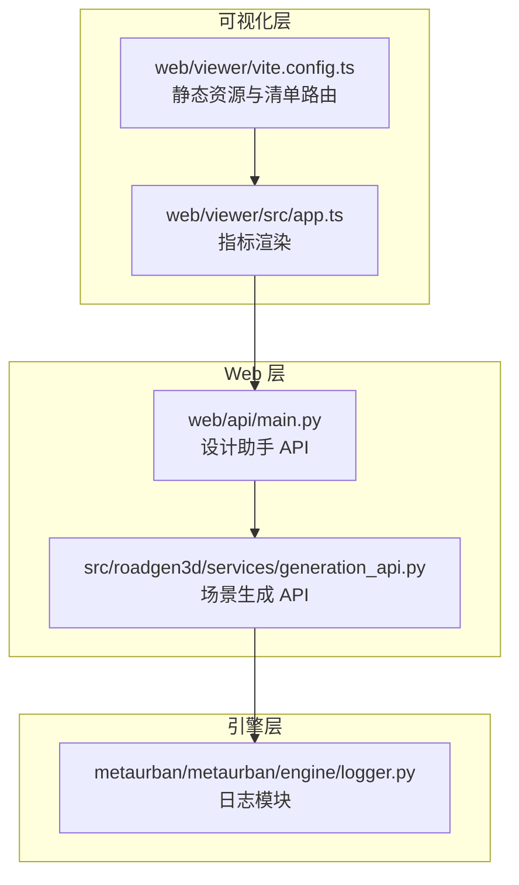
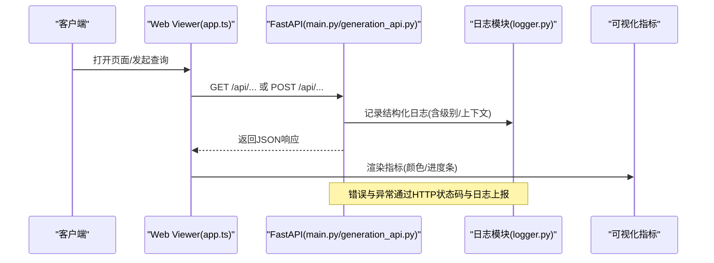
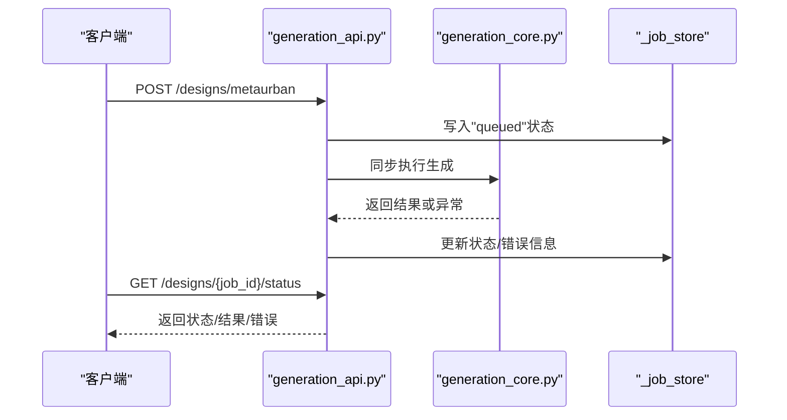
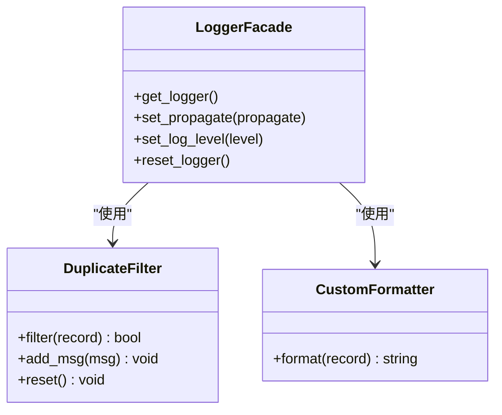
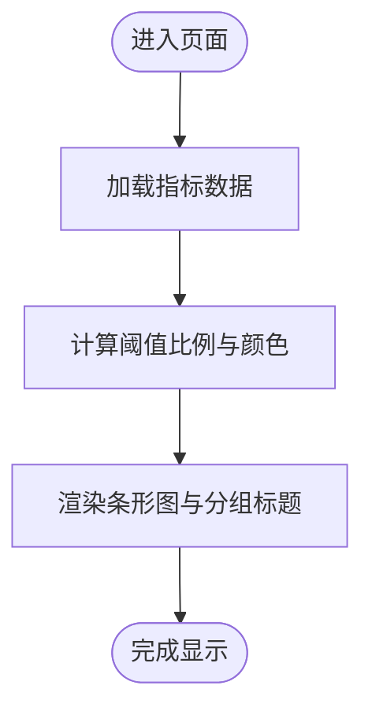
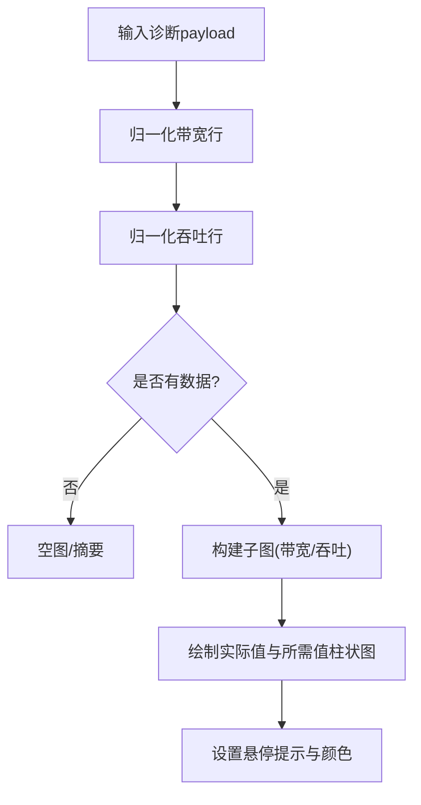
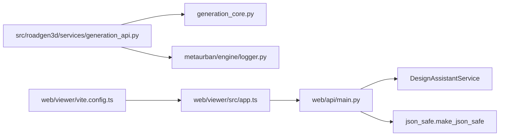

# 监控与日志

<cite>
**本文档引用的文件**
- [generation_api.py](file://src/roadgen3d/services/generation_api.py)
- [main.py](file://web/api/main.py)
- [logger.py](file://metaurban/metaurban/engine/logger.py)
- [solver_diagnostics_viz.py](file://src/roadgen3d/solver_diagnostics_viz.py)
- [app.ts](file://web/viewer/src/app.ts)
- [vite.config.ts](file://web/viewer/vite.config.ts)
</cite>

## 目录
1. [简介](#简介)
2. [项目结构](#项目结构)
3. [核心组件](#核心组件)
4. [架构总览](#架构总览)
5. [详细组件分析](#详细组件分析)
6. [依赖分析](#依赖分析)
7. [性能考虑](#性能考虑)
8. [故障排查指南](#故障排查指南)
9. [结论](#结论)
10. [附录](#附录)

## 简介
本文件面向 RoadGen3D 的监控与日志体系，聚焦以下目标：
- 关键性能指标（KPI）监控：响应时间、吞吐量、错误率、资源利用率
- 日志收集与分析：结构化日志格式、日志聚合与告警配置建议
- 分布式追踪：请求链路跟踪、性能瓶颈定位与用户体验监控
- 监控仪表板：Grafana、Prometheus、ELK Stack 集成方案
- 日志轮转、存储策略与合规性要求
- 故障自动检测与自愈机制的实现思路

当前代码库中已具备基础日志框架与可视化能力，本文在不直接引用具体代码内容的前提下，基于现有实现给出可落地的监控与日志方案。

## 项目结构
RoadGen3D 的监控与日志涉及三层：
- Web 层：FastAPI 应用提供健康检查、设计工作流与场景生成接口
- 引擎层：MetaUrban 渲染引擎与日志模块
- 可视化层：Web Viewer 提供指标展示与交互

**图表来源**
- [main.py:81-267](file://web/api/main.py#L81-L267)
- [generation_api.py:131-290](file://src/roadgen3d/services/generation_api.py#L131-L290)
- [logger.py:72-121](file://metaurban/metaurban/engine/logger.py#L72-L121)
- [app.ts:347-395](file://web/viewer/src/app.ts#L347-L395)
- [vite.config.ts:500-708](file://web/viewer/vite.config.ts#L500-L708)

**章节来源**
- [main.py:81-267](file://web/api/main.py#L81-L267)
- [generation_api.py:131-290](file://src/roadgen3d/services/generation_api.py#L131-L290)
- [logger.py:72-121](file://metaurban/metaurban/engine/logger.py#L72-L121)
- [app.ts:347-395](file://web/viewer/src/app.ts#L347-L395)
- [vite.config.ts:500-708](file://web/viewer/vite.config.ts#L500-L708)

## 核心组件
- Web API（FastAPI）
  - 设计助手 API：提供草稿生成、场景生成、作业管理、知识检索等端点
  - 场景生成 API：提供直接触发场景生成的端点，支持状态查询与结果获取
  - 健康检查：统一健康检查端点用于服务可用性监控
- 日志模块（MetaUrban）
  - 全局日志器、重复消息过滤器、彩色控制台格式化器
- 可视化（Web Viewer）
  - 指标渲染：按阈值着色的条形图展示合规性与场景统计指标
  - 资产清单路由：扫描并返回资产清单统计信息

**章节来源**
- [main.py:81-267](file://web/api/main.py#L81-L267)
- [generation_api.py:131-290](file://src/roadgen3d/services/generation_api.py#L131-L290)
- [logger.py:72-121](file://metaurban/metaurban/engine/logger.py#L72-L121)
- [app.ts:347-395](file://web/viewer/src/app.ts#L347-L395)
- [vite.config.ts:663-708](file://web/viewer/vite.config.ts#L663-L708)

## 架构总览
下图展示了从客户端到服务端、再到日志与可视化的整体流程：

**图表来源**
- [main.py:156-171](file://web/api/main.py#L156-L171)
- [generation_api.py:131-179](file://src/roadgen3d/services/generation_api.py#L131-L179)
- [logger.py:72-121](file://metaurban/metaurban/engine/logger.py#L72-L121)
- [app.ts:347-395](file://web/viewer/src/app.ts#L347-L395)

## 详细组件分析

### 组件A：Web API（设计助手与场景生成）
- 设计助手 API
  - 提供草稿生成、场景生成、作业管理、知识检索、评估等端点
  - 健康检查端点统一返回服务状态
- 场景生成 API
  - 支持 MetaUrban、模板与 OSM 三种模式（OSM 当前为占位）
  - 内存任务队列存储作业状态，支持状态查询与结果获取
  - 健康检查端点便于外部监控系统探测

**图表来源**
- [generation_api.py:131-265](file://src/roadgen3d/services/generation_api.py#L131-L265)

**章节来源**
- [generation_api.py:131-290](file://src/roadgen3d/services/generation_api.py#L131-L290)

### 组件B：日志模块（MetaUrban）
- 全局日志器
  - 单例全局日志器，避免重复输出
  - 控制台处理器与自定义格式化器
- 重复消息过滤器
  - 基于消息内容去重，支持一次性日志标记
- 日志级别与传播控制
  - 可设置日志级别与传播行为

**图表来源**
- [logger.py:7-121](file://metaurban/metaurban/engine/logger.py#L7-L121)

**章节来源**
- [logger.py:72-121](file://metaurban/metaurban/engine/logger.py#L72-L121)

### 组件C：可视化与指标展示（Web Viewer）
- 指标渲染
  - 按阈值计算颜色（绿色/黄色/红色），渲染条形图
  - 将指标分组展示，支持“合规性”“场景统计”等分组
- 资产清单路由
  - 扫描资产清单目录，统计 JSONL 文件数量并返回列表

**图表来源**
- [app.ts:347-395](file://web/viewer/src/app.ts#L347-L395)
- [vite.config.ts:663-708](file://web/viewer/vite.config.ts#L663-L708)

**章节来源**
- [app.ts:347-395](file://web/viewer/src/app.ts#L347-L395)
- [vite.config.ts:663-708](file://web/viewer/vite.config.ts#L663-L708)

### 组件D：带宽与吞吐诊断可视化（Solver Diagnostics）
- 数据归一化与排序
  - 将带宽与吞吐数据标准化并按模式排序
- 可视化图表
  - 上半区：带宽诊断；下半区：吞吐诊断
  - 实际值与所需值对比，满足状态以颜色区分

**图表来源**
- [solver_diagnostics_viz.py:181-202](file://src/roadgen3d/solver_diagnostics_viz.py#L181-L202)
- [solver_diagnostics_viz.py:440-458](file://src/roadgen3d/solver_diagnostics_viz.py#L440-L458)
- [solver_diagnostics_viz.py:541-577](file://src/roadgen3d/solver_diagnostics_viz.py#L541-L577)

**章节来源**
- [solver_diagnostics_viz.py:181-202](file://src/roadgen3d/solver_diagnostics_viz.py#L181-L202)
- [solver_diagnostics_viz.py:440-458](file://src/roadgen3d/solver_diagnostics_viz.py#L440-L458)
- [solver_diagnostics_viz.py:541-577](file://src/roadgen3d/solver_diagnostics_viz.py#L541-L577)

## 依赖分析
- Web API 依赖
  - 设计助手服务：负责草稿生成、场景生成、作业管理与知识检索
  - JSON 安全序列化：确保响应体可安全序列化
- 日志模块依赖
  - Python logging 标准库
  - 自定义格式化器与过滤器
- 可视化依赖
  - TypeScript 渲染逻辑与 HTML 模板
  - 静态资源与清单路由

**图表来源**
- [main.py:21-30](file://web/api/main.py#L21-L30)
- [generation_api.py:17-25](file://src/roadgen3d/services/generation_api.py#L17-L25)
- [logger.py:72-121](file://metaurban/metaurban/engine/logger.py#L72-L121)
- [app.ts:347-395](file://web/viewer/src/app.ts#L347-L395)
- [vite.config.ts:500-708](file://web/viewer/vite.config.ts#L500-L708)

**章节来源**
- [main.py:21-30](file://web/api/main.py#L21-L30)
- [generation_api.py:17-25](file://src/roadgen3d/services/generation_api.py#L17-L25)
- [logger.py:72-121](file://metaurban/metaurban/engine/logger.py#L72-L121)
- [app.ts:347-395](file://web/viewer/src/app.ts#L347-L395)
- [vite.config.ts:500-708](file://web/viewer/vite.config.ts#L500-L708)

## 性能考虑
- 响应时间
  - Web 层：通过健康检查端点与业务端点的延迟观测，结合日志记录请求耗时
  - 场景生成：当前为同步执行，建议引入后台任务队列与异步状态轮询
- 吞吐量
  - 通过作业队列与并发控制限制请求速率，结合带宽/吞吐诊断图表进行容量规划
- 错误率
  - 统一 HTTP 状态码与错误日志，结合告警规则对错误率进行阈值监控
- 资源利用率
  - 可视化层展示指标，引擎层日志记录资源占用，结合系统监控采集 CPU/内存/GPU 使用情况

[本节为通用指导，无需列出具体文件来源]

## 故障排查指南
- 健康检查
  - 使用健康检查端点确认服务可用性
- 日志定位
  - 利用全局日志器与重复消息过滤器，结合日志级别筛选问题
- 状态查询
  - 场景生成完成后通过作业 ID 查询状态与结果，定位失败原因
- 资产清单
  - 通过资产清单路由检查清单文件数量与完整性

**章节来源**
- [generation_api.py:287-290](file://src/roadgen3d/services/generation_api.py#L287-L290)
- [logger.py:72-121](file://metaurban/metaurban/engine/logger.py#L72-L121)
- [generation_api.py:251-284](file://src/roadgen3d/services/generation_api.py#L251-L284)
- [vite.config.ts:663-708](file://web/viewer/vite.config.ts#L663-L708)

## 结论
- 当前代码库提供了基础的日志框架与可视化能力，可作为监控与日志体系的基石
- 建议在现有基础上扩展：后台任务队列、统一指标导出、分布式追踪与告警集成
- 通过健康检查、日志与可视化三者协同，形成闭环的可观测性体系

[本节为总结性内容，无需列出具体文件来源]

## 附录

### KPI 指标建议
- 响应时间
  - P50/P95/P99 延迟，按端点分组统计
- 吞吐量
  - QPS、每小时生成任务数、并发作业数
- 错误率
  - 4xx/5xx 错误率、异常日志占比
- 资源利用率
  - CPU/内存/GPU 使用率、磁盘 IO、网络带宽

[本节为通用指导，无需列出具体文件来源]

### 日志收集与分析
- 结构化日志格式
  - 字段建议：timestamp、level、service、endpoint、job_id、trace_id、span_id、duration_ms、error、tags
- 日志聚合与告警
  - 建议使用 ELK/EFK 或 Loki + Promtail 进行日志采集与聚合
  - 告警规则：错误率阈值、响应时间超限、健康检查失败

[本节为通用指导，无需列出具体文件来源]

### 分布式追踪
- 请求链路跟踪
  - 在 Web 层注入 trace_id/span_id，贯穿到引擎日志
- 性能瓶颈定位
  - 以端点为维度聚合耗时，结合带宽/吞吐诊断图表定位瓶颈
- 用户体验监控
  - 通过可视化指标与健康检查端点监控用户侧体验

[本节为通用指导，无需列出具体文件来源]

### 监控仪表板（Grafana/Prometheus/ELK）
- Grafana
  - 以端点、作业状态、资源利用率等为指标源
- Prometheus
  - 导出自定义指标（如生成耗时、作业排队时长）
- ELK
  - 日志检索与聚合，结合告警规则

[本节为通用指导，无需列出具体文件来源]

### 日志轮转、存储与合规
- 轮转
  - 基于大小与时间的轮转策略，保留周期内归档
- 存储
  - 热数据落盘，冷数据归档至对象存储
- 合规
  - 最小化日志中个人数据，敏感字段脱敏，审计日志单独存放

[本节为通用指导，无需列出具体文件来源]

### 故障自动检测与自愈
- 自动检测
  - 健康检查失败、错误率突增、响应时间超限触发告警
- 自愈
  - 重启实例、扩容副本、回滚版本、降级非关键功能

[本节为通用指导，无需列出具体文件来源]