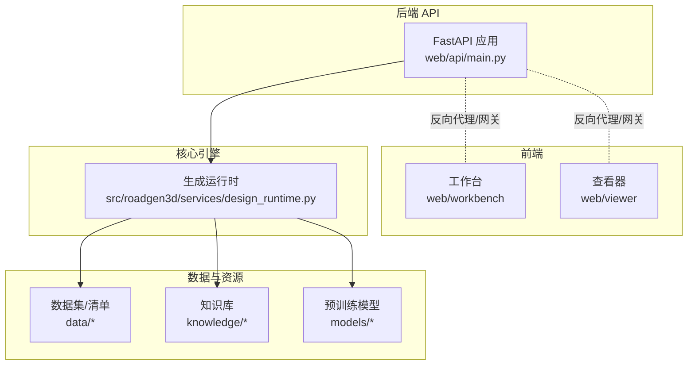
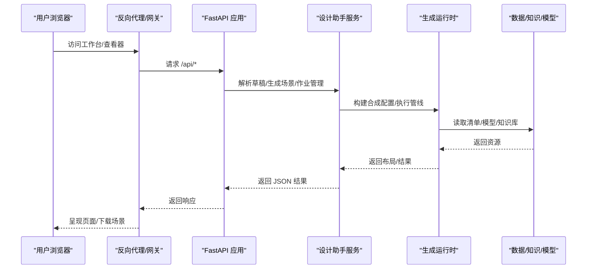
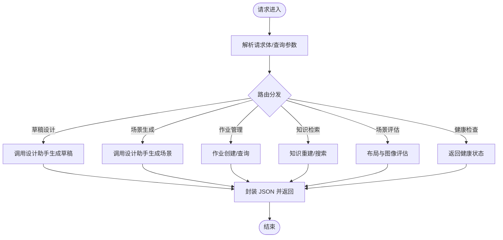
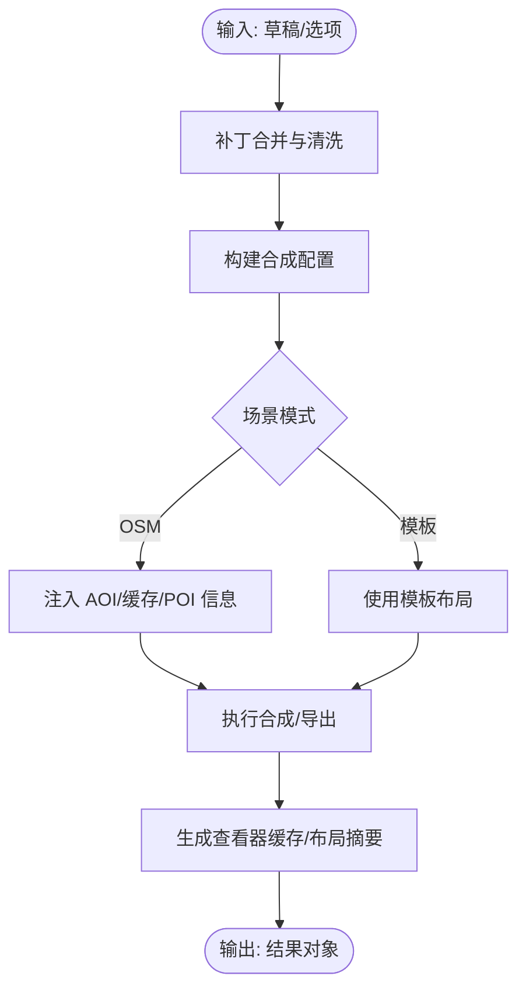
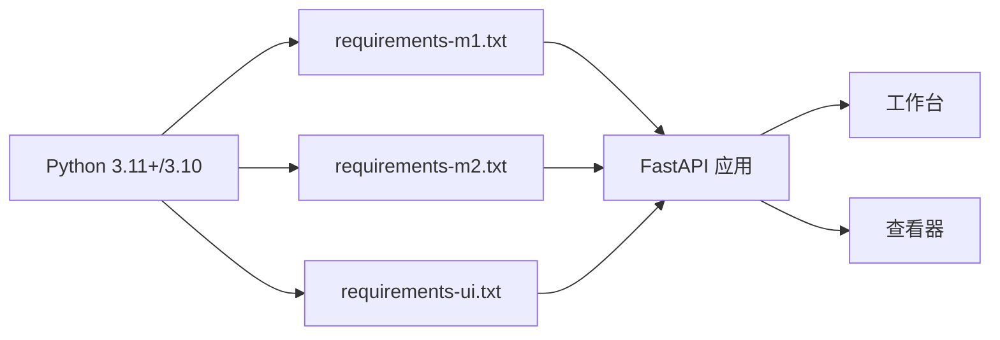

# 部署与运维

<cite>
**本文引用的文件**
- [README.md](file://README.md)
- [Makefile](file://Makefile)
- [web/api/main.py](file://web/api/main.py)
- [ui/api/main.py](file://ui/api/main.py)
- [requirements-m1.txt](file://requirements-m1.txt)
- [requirements-m2.txt](file://requirements-m2.txt)
- [requirements-ui.txt](file://requirements-ui.txt)
- [src/roadgen3d/services/design_runtime.py](file://src/roadgen3d/services/design_runtime.py)
- [metaurban/README.md](file://metaurban/README.md)
- [metaurban/Dockerfile](file://metaurban/Dockerfile)
- [metaurban/environment.yml](file://metaurban/environment.yml)
- [metaurban/install.sh](file://metaurban/install.sh)
</cite>

## 目录
1. [简介](#简介)
2. [项目结构](#项目结构)
3. [核心组件](#核心组件)
4. [架构总览](#架构总览)
5. [详细组件分析](#详细组件分析)
6. [依赖分析](#依赖分析)
7. [性能考量](#性能考量)
8. [故障排查指南](#故障排查指南)
9. [结论](#结论)
10. [附录](#附录)

## 简介
本文件面向 RoadGen3D 的部署与运维团队，提供从本地开发到生产环境的完整部署指南，涵盖容器化（Docker）、Conda 环境配置、手动安装步骤；生产环境的性能调优、资源分配与负载均衡策略；监控与日志体系；备份与恢复策略；故障诊断方法；以及扩展性与安全配置建议。内容基于仓库中的实际脚本、入口文件与配置进行梳理与提炼。

## 项目结构
RoadGen3D 采用多模块分层组织：后端 API 使用 FastAPI 提供 REST 接口；前端包含工作台与 3D 查看器；核心生成管线位于 src/roadgen3d；数据、知识库与模型在 data、knowledge、models 中；测试与脚本分布在 tests、scripts。

图表来源
- [web/api/main.py:1-286](file://web/api/main.py#L1-L286)
- [src/roadgen3d/services/design_runtime.py:1-200](file://src/roadgen3d/services/design_runtime.py#L1-L200)
- [Makefile:1-92](file://Makefile#L1-L92)

章节来源
- [README.md:107-130](file://README.md#L107-L130)
- [Makefile:13-34](file://Makefile#L13-L34)

## 核心组件
- 后端 API（FastAPI）：提供健康检查、草稿设计、场景生成、作业管理、知识检索等接口，支持跨域访问。
- 生成运行时：负责将确认的设计草稿转换为街道场景，包含清单路径、导出格式、设备选择、策略温度等可配置项。
- 前端工作台与查看器：通过 npm 脚本启动开发服务器，分别监听不同端口。
- 构建与运行脚本：Makefile 提供一键启动与任务编排；requirements-* 定义各阶段依赖；环境配置文件用于 Conda 环境与 Docker。

章节来源
- [web/api/main.py:81-267](file://web/api/main.py#L81-L267)
- [src/roadgen3d/services/design_runtime.py:37-148](file://src/roadgen3d/services/design_runtime.py#L37-L148)
- [Makefile:13-92](file://Makefile#L13-L92)
- [requirements-m1.txt:1-7](file://requirements-m1.txt#L1-L7)
- [requirements-m2.txt:1-4](file://requirements-m2.txt#L1-L4)
- [requirements-ui.txt:1-12](file://requirements-ui.txt#L1-L12)

## 架构总览
下图展示从浏览器到后端 API，再到生成运行时与外部资源的典型请求链路。

图表来源
- [web/api/main.py:156-216](file://web/api/main.py#L156-L216)
- [src/roadgen3d/services/design_runtime.py:60-148](file://src/roadgen3d/services/design_runtime.py#L60-L148)

## 详细组件分析

### 后端 API（FastAPI）
- 入口与路由：应用在 web/api/main.py 中创建，提供健康检查、城市列表、参考方案与图模板查询、草稿设计、场景生成、作业管理、知识重建与检索、场景评估等接口。
- 跨域中间件：允许任意来源、方法与头，便于前端联调。
- 错误处理：对 LLM 配置/响应错误与运行时错误返回相应状态码。
- 服务实例：应用状态中注入设计助手服务，统一调度业务逻辑。

图表来源
- [web/api/main.py:81-267](file://web/api/main.py#L81-L267)

章节来源
- [web/api/main.py:81-267](file://web/api/main.py#L81-L267)

### 生成运行时（设计管线）
- 默认配置：包含清单路径、模型目录、导出格式、设备、策略类型与温度等默认值，支持按需覆盖。
- 合成配置构建：将草稿与补丁合并为最终合成配置，并根据场景上下文（如 OSM 模式）动态调整。
- 结果封装：生成布局文件与查看器缓存，补充摘要信息并返回结果对象。

图表来源
- [src/roadgen3d/services/design_runtime.py:60-173](file://src/roadgen3d/services/design_runtime.py#L60-L173)

章节来源
- [src/roadgen3d/services/design_runtime.py:37-148](file://src/roadgen3d/services/design_runtime.py#L37-L148)
- [src/roadgen3d/services/design_runtime.py:190-200](file://src/roadgen3d/services/design_runtime.py#L190-L200)

### 前端工作台与查看器
- 工作台：Vite + React，开发时通过 npm 脚本启动，监听指定端口。
- 查看器：Three.js 场景查看器，独立开发服务。
- 一键启动：Makefile 提供 dev 将三个服务并行启动。

章节来源
- [Makefile:19-23](file://Makefile#L19-L23)
- [Makefile:48-67](file://Makefile#L48-L67)
- [Makefile:29-34](file://Makefile#L29-L34)

### 本地部署流程

#### Docker 容器化部署（MetaUrban 子模块）
- 基于 Ubuntu 22.04，安装 Python、CMake、OpenGL 运行库与 Anaconda。
- 初始化 Conda 环境，安装项目与附加依赖，编译 ORCA 算法。
- 该 Dockerfile 适用于 MetaUrban 子模块，不直接包含 RoadGen3D 的 API/前端服务。若需在容器内运行 RoadGen3D，请结合项目根目录的依赖与入口进行适配。

章节来源
- [metaurban/Dockerfile:1-40](file://metaurban/Dockerfile#L1-L40)
- [metaurban/README.md:181-190](file://metaurban/README.md#L181-L190)

#### Conda 环境配置（MetaUrban 子模块）
- 环境文件定义了通道与依赖，包含 Python 版本、pybind11、Sphinx、NumPy 等。
- 安装脚本创建环境、安装项目与附加依赖，并编译 ORCA。

章节来源
- [metaurban/environment.yml:1-16](file://metaurban/environment.yml#L1-L16)
- [metaurban/install.sh:1-20](file://metaurban/install.sh#L1-L20)

#### 手动安装步骤（项目根目录）
- 克隆仓库并初始化子模块。
- 安装 Python 依赖（M1/M2/UI）。
- 安装前端依赖（工作台与查看器）。
- 启动开发环境（API + 工作台 + 查看器）。

章节来源
- [README.md:39-55](file://README.md#L39-L55)
- [Makefile:15-28](file://Makefile#L15-L28)

### 生产环境配置指南

#### 性能调优
- 设备选择：生成运行时默认使用 CPU，可在选项中切换设备以利用 GPU 加速（需确保运行环境具备相应驱动与 CUDA 支持）。
- 导出格式：默认同时输出 GLB 与 PLY，生产可按需裁剪以减少 IO 开销。
- 策略与温度：placement_policy 与 policy_temperature 影响采样多样性与稳定性，应结合业务目标调整。
- 缓存与清单：合理设置清单路径与缓存目录，避免频繁磁盘 IO。

章节来源
- [src/roadgen3d/services/design_runtime.py:41-57](file://src/roadgen3d/services/design_runtime.py#L41-L57)
- [src/roadgen3d/services/design_runtime.py:101-148](file://src/roadgen3d/services/design_runtime.py#L101-L148)

#### 资源分配
- API 服务：使用 uvicorn 启动，建议在生产环境中使用进程池与线程池配合的 WSGI 服务器（如 Hypercorn 或 uvicorn 的多进程模式），并限制并发连接数。
- 前端：工作台与查看器作为静态资源服务，建议通过 Nginx/CDN 提供缓存与压缩。
- 数据与模型：将 data 与 models 放置于高性能存储上，必要时启用 SSD 缓存。

章节来源
- [requirements-ui.txt:3-4](file://requirements-ui.txt#L3-L4)
- [Makefile:39-44](file://Makefile#L39-L44)

#### 负载均衡策略
- 多实例部署：将 API 服务横向扩展为多个实例，通过反向代理（Nginx/Traefik/Haproxy）进行轮询或基于会话亲和的分发。
- 有状态与无状态：API 本身无状态，适合水平扩展；生成作业队列可引入消息队列（如 Redis/RabbitMQ）实现异步化与削峰填谷。
- 健康检查：定期探测 /api/health，剔除不健康节点。

章节来源
- [web/api/main.py:92-99](file://web/api/main.py#L92-L99)

### 监控与日志系统
- 健康检查：/api/health 返回基础运行信息，可用于探活与指标采集。
- 日志记录：MetaUrban 引擎提供了全局日志器与自定义格式化器，可作为系统日志参考（本项目主 API 未直接集成该日志器，但可按需接入）。
- 指标采集：建议在反向代理层开启访问日志统计；在应用层增加关键路径耗时埋点（如草稿设计、场景生成、作业查询）。

章节来源
- [web/api/main.py:92-99](file://web/api/main.py#L92-L99)
- [metaurban/metaurban/engine/logger.py:66-121](file://metaurban/metaurban/engine/logger.py#L66-L121)

### 备份与恢复策略
- 数据持久化：artifacts 目录存放生成产物（布局与网格），应纳入定期备份；data 与 models 作为只读资源，建议版本化管理。
- 配置管理：环境变量与运行参数集中管理，建议使用配置中心或密钥管理服务（如 Vault/Secrets Manager）。
- 灾难恢复：制定镜像/容器快照与数据卷备份策略；验证恢复流程，确保在 24 小时内完成 RTO/RPO。

章节来源
- [src/roadgen3d/services/design_runtime.py:42-47](file://src/roadgen3d/services/design_runtime.py#L42-L47)

### 故障诊断方法
- 常见问题排查：
  - 端口占用：Makefile 在启动前检查端口是否被占用，避免冲突。
  - 依赖缺失：核对 requirements-m1/m2/ui 与环境配置文件，确保 Python 版本与第三方库满足要求。
  - LLM/知识库：检查环境变量与 API Key，确认 GraphRAG 服务可用。
- 性能瓶颈分析：
  - 关注生成运行时的设备选择与导出格式；对大规模场景适当降低密度或裁剪导出格式。
  - 对知识检索与草稿设计接口增加超时与重试策略。
- 系统健康检查：
  - 使用 /api/health 获取基础运行信息；结合反向代理与应用日志定位异常。

章节来源
- [Makefile:39-44](file://Makefile#L39-L44)
- [web/api/main.py:156-171](file://web/api/main.py#L156-L171)
- [README.md:208-217](file://README.md#L208-L217)

### 扩展性考虑
- 水平扩展：API 服务无状态，可多实例部署；生成作业异步化，结合队列实现弹性伸缩。
- 垂直扩展：提升单机 CPU/GPU 资源，优化导出与渲染路径。
- 微服务架构：当前为单体服务，未来可将“草稿设计”“场景生成”“知识检索”拆分为独立服务，通过 API 网关统一接入。

章节来源
- [web/api/main.py:156-216](file://web/api/main.py#L156-L216)

### 安全配置、访问控制与数据保护
- 访问控制：在反向代理层启用 TLS 与基本认证；对 /api/* 设置细粒度权限控制。
- 数据保护：敏感环境变量（LLM/知识库）通过密钥管理服务注入；对生成产物与日志进行脱敏处理。
- 网络隔离：将 API 与数据库/存储置于受控网络段，仅开放必要端口。

章节来源
- [README.md:208-217](file://README.md#L208-L217)

## 依赖分析
- 后端依赖：FastAPI、Uvicorn、Pydantic；前端依赖：Node.js 生态。
- 生成依赖：M1/M2 阶段的 PyTorch、FAISS、Trimesh 等；UI 依赖：Pillow、httpx。
- 环境配置：Conda 环境文件与安装脚本用于 MetaUrban 子模块；项目根目录 Makefile 用于统一编排。

图表来源
- [requirements-m1.txt:1-7](file://requirements-m1.txt#L1-L7)
- [requirements-m2.txt:1-4](file://requirements-m2.txt#L1-L4)
- [requirements-ui.txt:1-12](file://requirements-ui.txt#L1-L12)
- [Makefile:13-23](file://Makefile#L13-L23)

章节来源
- [requirements-m1.txt:1-7](file://requirements-m1.txt#L1-L7)
- [requirements-m2.txt:1-4](file://requirements-m2.txt#L1-L4)
- [requirements-ui.txt:1-12](file://requirements-ui.txt#L1-L12)
- [Makefile:13-23](file://Makefile#L13-L23)

## 性能考量
- 设备与导出：优先使用 GPU；导出格式按需裁剪。
- 并发与限流：在反向代理层限制并发与超时，避免雪崩。
- 缓存策略：对检索与渲染结果进行缓存，缩短响应时间。
- 存储 IO：将高频访问的数据迁移至 SSD，降低延迟。

## 故障排查指南
- 端口占用：Makefile 在启动前检查端口，避免冲突。
- 依赖缺失：核对 requirements 与环境配置文件。
- LLM/知识库：检查环境变量与 API Key，确认服务可用。
- 性能瓶颈：关注生成运行时的设备与导出格式；对关键接口增加超时与重试。

章节来源
- [Makefile:39-44](file://Makefile#L39-L44)
- [web/api/main.py:156-171](file://web/api/main.py#L156-L171)
- [README.md:208-217](file://README.md#L208-L217)

## 结论
本部署与运维文档基于仓库现有脚本与入口，给出了从本地到生产的完整路径与最佳实践。建议在生产环境中结合反向代理、异步队列与监控告警体系，持续优化性能与可靠性，并完善备份与安全策略。

## 附录
- 快速启动命令与端口映射：参见 Makefile 与 README 的开发与运行说明。
- 环境变量示例：参见 README 的环境变量配置段落。

章节来源
- [Makefile:15-34](file://Makefile#L15-L34)
- [README.md:65-70](file://README.md#L65-L70)
- [README.md:208-217](file://README.md#L208-L217)