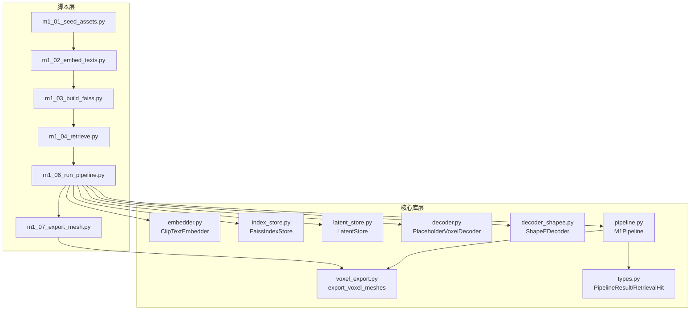
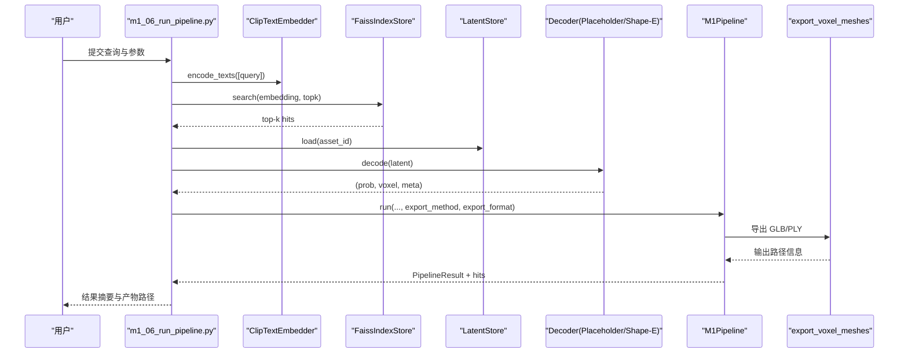
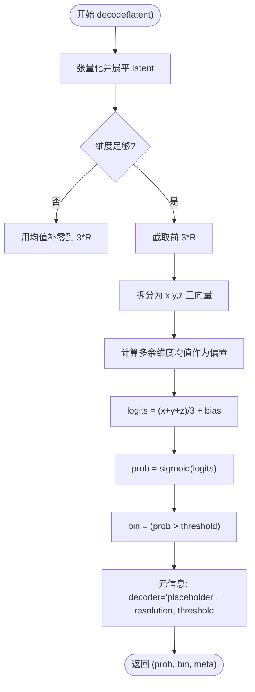
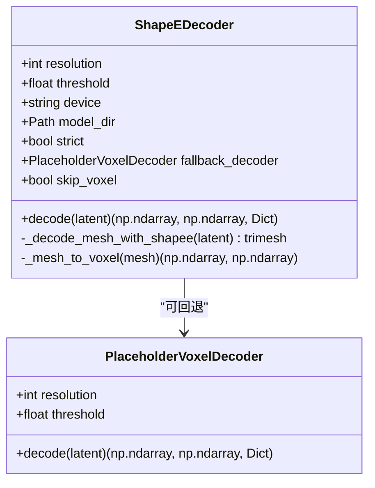
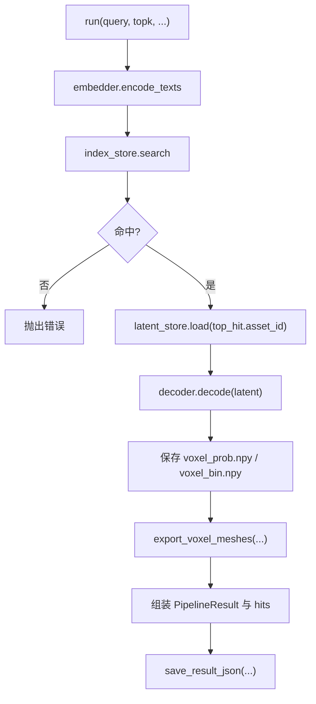
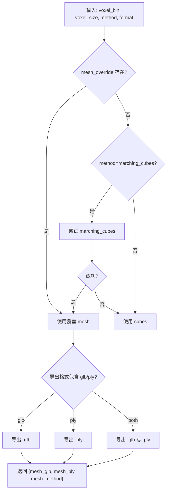
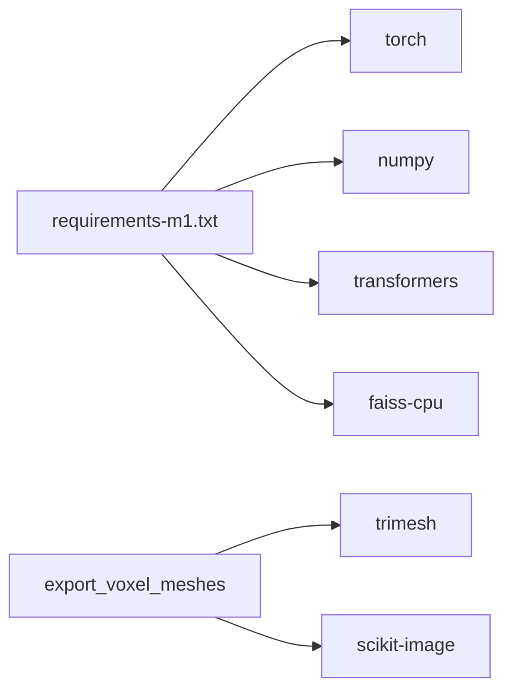

# M1 单资产生成

<cite>
**本文引用的文件**
- [README_M1.md](file://README_M1.md)
- [m1_06_run_pipeline.py](file://scripts/m1_06_run_pipeline.py)
- [decoder.py](file://src/roadgen3d/decoder.py)
- [decoder_shapee.py](file://src/roadgen3d/decoder_shapee.py)
- [pipeline.py](file://src/roadgen3d/pipeline.py)
- [types.py](file://src/roadgen3d/types.py)
- [voxel_export.py](file://src/roadgen3d/voxel_export.py)
- [m1_07_export_mesh.py](file://scripts/m1_07_export_mesh.py)
- [requirements-m1.txt](file://requirements-m1.txt)
- [m1_01_seed_assets.py](file://scripts/m1_01_seed_assets.py)
- [m1_02_embed_texts.py](file://scripts/m1_02_embed_texts.py)
- [m1_03_build_faiss.py](file://scripts/m1_03_build_faiss.py)
- [m1_04_retrieve.py](file://scripts/m1_04_retrieve.py)
- [test_m1_pipeline.py](file://tests/test_m1_pipeline.py)
</cite>

## 目录
1. [简介](#简介)
2. [项目结构](#项目结构)
3. [核心组件](#核心组件)
4. [架构总览](#架构总览)
5. [详细组件分析](#详细组件分析)
6. [依赖关系分析](#依赖关系分析)
7. [性能考虑](#性能考虑)
8. [故障排除指南](#故障排除指南)
9. [结论](#结论)
10. [附录](#附录)

## 简介
本文件面向 RoadGen3D 的 M1 单资产生成流水线，系统性阐述从文本查询到 3D 网格导出的完整链路：CLIP 文本嵌入 → FAISS 向量检索 → 潜在空间匹配 → 体素解码 → 网格导出。重点解析两种解码器（PlaceholderVoxelDecoder 与 ShapeEDecoder）的工作原理、配置参数与适用场景，并给出命令行接口参数说明、输出格式与性能优化建议，同时提供实际使用示例与故障排除指南。

## 项目结构
M1 流水线由“脚本层”和“核心库层”组成：
- 脚本层：负责数据准备、检索与端到端运行，位于 scripts/ 目录下，如 m1_01 ~ m1_07 系列脚本。
- 核心库层：位于 src/roadgen3d/，封装嵌入、索引、潜在存储、解码器、管线与网格导出等模块。

图表来源
- [m1_01_seed_assets.py:1-97](file://scripts/m1_01_seed_assets.py#L1-L97)
- [m1_02_embed_texts.py:1-87](file://scripts/m1_02_embed_texts.py#L1-L87)
- [m1_03_build_faiss.py:1-50](file://scripts/m1_03_build_faiss.py#L1-L50)
- [m1_04_retrieve.py:1-71](file://scripts/m1_04_retrieve.py#L1-L71)
- [m1_06_run_pipeline.py:1-107](file://scripts/m1_06_run_pipeline.py#L1-L107)
- [m1_07_export_mesh.py:1-64](file://scripts/m1_07_export_mesh.py#L1-L64)
- [decoder.py:1-65](file://src/roadgen3d/decoder.py#L1-L65)
- [decoder_shapee.py:1-245](file://src/roadgen3d/decoder_shapee.py#L1-L245)
- [pipeline.py:1-133](file://src/roadgen3d/pipeline.py#L1-L133)
- [voxel_export.py:1-142](file://src/roadgen3d/voxel_export.py#L1-L142)
- [types.py:1-800](file://src/roadgen3d/types.py#L1-L800)

章节来源
- [README_M1.md:65-139](file://README_M1.md#L65-L139)

## 核心组件
- 文本嵌入器：基于 CLIP 的文本嵌入，用于构建检索向量。
- FAISS 索引：对资产描述嵌入进行近邻检索。
- 潜在存储：加载资产对应的潜在向量。
- 解码器：
  - PlaceholderVoxelDecoder：轻量确定性体素解码器，将潜在向量映射为体积概率场与二值体素。
  - ShapeEDecoder：适配 Shape-E 的网格解码器，支持直接解码网格或回退至体素解码器。
- 管线：串联嵌入、检索、解码与网格导出。
- 网格导出：将二值体素转换为 GLB/PLY 网格，支持 Marching Cubes 或立方体拼接两种方法。

章节来源
- [m1_06_run_pipeline.py:15-57](file://scripts/m1_06_run_pipeline.py#L15-L57)
- [decoder.py:24-65](file://src/roadgen3d/decoder.py#L24-L65)
- [decoder_shapee.py:34-245](file://src/roadgen3d/decoder_shapee.py#L34-L245)
- [pipeline.py:30-133](file://src/roadgen3d/pipeline.py#L30-L133)
- [voxel_export.py:79-142](file://src/roadgen3d/voxel_export.py#L79-L142)

## 架构总览
从输入文本到最终网格的端到端流程如下：

图表来源
- [m1_06_run_pipeline.py:60-102](file://scripts/m1_06_run_pipeline.py#L60-L102)
- [pipeline.py:39-125](file://src/roadgen3d/pipeline.py#L39-L125)
- [voxel_export.py:79-142](file://src/roadgen3d/voxel_export.py#L79-L142)

## 详细组件分析

### 组件一：PlaceholderVoxelDecoder（占位体素解码器）
- 工作原理
  - 将潜在向量展平后取前 3×R 个元素，分别构造 X、Y、Z 方向的一维分布，求平均得到每个体素的 logits，经 Sigmoid 得到概率，再以阈值二值化得到占用体素。
  - 当潜在维度不足时，自动用均值填充；当维度富余时，使用多余部分的均值作为全局偏置。
- 关键参数
  - resolution：体素分辨率（R×R×R）。
  - threshold：二值化阈值。
- 适用场景
  - M1 验证阶段的确定性、轻量体素生成。
  - 作为 Shape-E 解码失败时的回退方案。
- 性能特征
  - 计算简单，CPU 友好；适合快速闭环验证。

图表来源
- [decoder.py:40-65](file://src/roadgen3d/decoder.py#L40-L65)

章节来源
- [decoder.py:24-65](file://src/roadgen3d/decoder.py#L24-L65)

### 组件二：ShapeEDecoder（Shape-E 网格解码器）
- 工作原理
  - 优先尝试从潜在向量中读取 mesh_path 并直接加载网格；若不可用，则尝试 Shape-E 运行时进行直接解码。
  - 支持“跳过体素”模式：直接返回网格，避免 mesh→voxel 的额外计算与精度损失。
  - 失败时可回退至 PlaceholderVoxelDecoder，并在元信息中标记回退原因。
- 关键参数
  - resolution/threshold：体素化参数（仅在回退时使用）。
  - device/model_dir：设备与模型缓存目录。
  - strict：严格模式，失败即抛异常。
  - fallback_decoder：回退解码器实例。
  - skip_voxel：是否跳过体素化，直接输出网格。
- 适用场景
  - 需要高质量网格输出的场景；配合 mesh_ref 潜在向量可避免 Blender 依赖。
- 错误处理
  - 缺少 trimesh、Shape-E 运行时、空网格、尺寸不匹配等情况均有明确异常类型与提示。

图表来源
- [decoder_shapee.py:34-245](file://src/roadgen3d/decoder_shapee.py#L34-L245)
- [decoder.py:24-65](file://src/roadgen3d/decoder.py#L24-L65)

章节来源
- [decoder_shapee.py:34-245](file://src/roadgen3d/decoder_shapee.py#L34-L245)

### 组件三：M1Pipeline（端到端管线）
- 功能
  - 执行文本嵌入、FAISS 检索、潜在加载、解码与网格导出，并汇总结果。
- 关键行为
  - 校验索引非空与 topk 合法性。
  - 保存体素概率与二值数组。
  - 导出 GLB/PLY，并记录导出方法与错误信息。
- 输出
  - PipelineResult 包含查询、命中资产、体素统计与输出路径。
  - hits 列表包含所有检索命中及其分数。

图表来源
- [pipeline.py:39-133](file://src/roadgen3d/pipeline.py#L39-L133)

章节来源
- [pipeline.py:30-133](file://src/roadgen3d/pipeline.py#L30-L133)
- [types.py:21-43](file://src/roadgen3d/types.py#L21-L43)

### 组件四：网格导出（export_voxel_meshes）
- 方法选择
  - Marching Cubes：从二值体素提取等值面网格，质量高但需 scikit-image。
  - 立方体拼接：直接将占用体素转为立方体网格，鲁棒性强。
- 输出格式
  - GLB、PLY 或两者皆有。
- 兼容性
  - 缺少 trimesh 或 scikit-image 时抛出清晰错误。
- Mesh 覆盖
  - 若传入外部 mesh（来自解码器），则直接使用该 mesh 并标注方法为 shapee_mesh。

图表来源
- [voxel_export.py:79-142](file://src/roadgen3d/voxel_export.py#L79-L142)

章节来源
- [voxel_export.py:12-142](file://src/roadgen3d/voxel_export.py#L12-L142)
- [m1_07_export_mesh.py:21-64](file://scripts/m1_07_export_mesh.py#L21-L64)

## 依赖关系分析
- 运行时依赖
  - 必需：numpy、torch、transformers、faiss-cpu。
  - 网格导出：trimesh、scikit-image（可选）。
- 版本约束
  - 推荐 CPython 3.11/3.12，macOS arm64；torch>=2.6,<2.8；transformers>=4.46,<5.0；faiss-cpu>=1.7.4,<2.0。

图表来源
- [requirements-m1.txt:1-7](file://requirements-m1.txt#L1-L7)
- [voxel_export.py:33-76](file://src/roadgen3d/voxel_export.py#L33-L76)

章节来源
- [requirements-m1.txt:1-7](file://requirements-m1.txt#L1-L7)

## 性能考虑
- 设备与加速
  - 默认 CPU；如需 GPU，请在运行时设置 device 为可用 CUDA 设备（需确保 torch 与驱动匹配）。
- 分辨率与阈值
  - resolution 越大，体素体积越大，内存与计算开销越高；threshold 过高可能导致细节丢失。
- 导出方法
  - Marching Cubes 质量更高但更慢且依赖 scikit-image；立方体拼接更快更稳定。
- 回退策略
  - Shape-E 失败时使用 PlaceholderVoxelDecoder 可保证可用性，但网格质量较低。
- I/O 与缓存
  - FAISS 索引与嵌入矩阵持久化，避免重复计算；合理组织 artifacts 目录可减少磁盘 IO。

[本节为通用指导，无需特定文件引用]

## 故障排除指南
- 模型加载失败
  - 现象：提示无法加载 CLIP 模型或 transformers/torch 未安装。
  - 处理：确认 requirements-m1.txt 已安装，或通过 --model-dir 指定本地模型目录。
- FAISS 空索引
  - 现象：提示索引为空。
  - 处理：先执行 m1_01 ~ m1_03 步骤，确保索引构建完成且非空。
- 无检索命中
  - 现象：检索返回空列表。
  - 处理：调整查询语义或增大 topk；检查嵌入与索引一致性。
- Shape-E 运行时缺失
  - 现象：提示缺少 trimesh 或 Shape-E 运行时。
  - 处理：安装 requirements-m2.txt 中的 trimesh 与 scikit-image；或改用 placeholder 解码器。
- 网格导出失败
  - 现象：marching_cubes 抛出空网格或依赖缺失。
  - 处理：自动回退立方体拼接；或手动指定 --export-method=cubes。
- 体素为空
  - 现象：导出方法要求非空体素。
  - 处理：提高阈值或检查解码器输出；必要时使用 mesh 覆盖。

章节来源
- [m1_06_run_pipeline.py:88-93](file://scripts/m1_06_run_pipeline.py#L88-L93)
- [pipeline.py:56-68](file://src/roadgen3d/pipeline.py#L56-L68)
- [decoder_shapee.py:107-111](file://src/roadgen3d/decoder_shapee.py#L107-L111)
- [voxel_export.py:56-76](file://src/roadgen3d/voxel_export.py#L56-L76)

## 结论
M1 单资产生成流水线以轻量确定性解码器为核心，结合 CLIP+FAISS 的高效检索与体素到网格的稳健导出，实现了从文本到 3D 的闭环验证。在需要高质量网格时，可启用 Shape-E 解码器并配置回退策略；在追求稳定性与速度时，可坚持使用 placeholder 解码器与立方体拼接导出。通过合理的参数与依赖管理，可在本地快速完成端到端实验与产品验证。

[本节为总结性内容，无需特定文件引用]

## 附录

### 命令行接口参数说明（m1_06_run_pipeline.py）
- 查询与检索
  - --query：必填，输入文本查询。
  - --topk：整数，默认 1，检索返回的候选数量。
- 数据与产物
  - --data-dir：数据目录，默认 data/m1。
  - --assets：资产元数据路径，默认 data/m1/assets.jsonl。
  - --artifacts：产物目录，默认 artifacts/m1。
- 模型与设备
  - --model-name：模型标识，默认 openai/clip-vit-base-patch32。
  - --model-dir：本地模型目录覆盖。
  - --local-files-only：强制离线加载模型。
  - --device：设备，默认 cpu。
- 解码器与网格导出
  - --resolution：体素分辨率，默认 64。
  - --threshold：二值化阈值，默认 0.5。
  - --decoder：解码器选择，placeholder 或 shapee，默认 placeholder。
  - --shapee-model-dir：Shape-E 模型本地缓存目录。
  - --shapee-strict：严格模式，失败即报错。
  - --export-method：网格导出方法，marching_cubes 或 cubes，默认 marching_cubes。
  - --export-format：导出格式，glb、ply 或 both，默认 both。
  - --voxel-size：体素边长（世界单位），默认 0.1。

章节来源
- [m1_06_run_pipeline.py:23-42](file://scripts/m1_06_run_pipeline.py#L23-L42)

### 实际使用示例
- 独立检索验证
  - 使用 m1_04_retrieve.py 对单条查询进行 top-k 检索，输出 last_retrieval.json。
- 一键闭环
  - 使用 m1_06_run_pipeline.py 执行完整流水线，输出体素与网格文件及 pipeline_result.json。
- 从历史体素导出网格
  - 使用 m1_07_export_mesh.py 从 voxel_bin.npy 导出 GLB/PLY。

章节来源
- [README_M1.md:98-129](file://README_M1.md#L98-L129)
- [m1_04_retrieve.py:20-65](file://scripts/m1_04_retrieve.py#L20-L65)
- [m1_06_run_pipeline.py:104-107](file://scripts/m1_06_run_pipeline.py#L104-L107)
- [m1_07_export_mesh.py:21-64](file://scripts/m1_07_export_mesh.py#L21-L64)

### 输出产物
- 体素数组：voxel_prob.npy、voxel_bin.npy。
- 网格文件：*.glb、*.ply。
- 结果汇总：pipeline_result.json。
- 检索报告：last_retrieval.json。
- 环境报告：env_report.json。

章节来源
- [README_M1.md:131-139](file://README_M1.md#L131-L139)
- [pipeline.py:74-103](file://src/roadgen3d/pipeline.py#L74-L103)

### 数据与脚本准备
- 种子资产与潜在向量：m1_01_seed_assets.py。
- 文本嵌入：m1_02_embed_texts.py。
- 构建 FAISS 索引：m1_03_build_faiss.py。
- 独立检索：m1_04_retrieve.py。

章节来源
- [m1_01_seed_assets.py:26-97](file://scripts/m1_01_seed_assets.py#L26-L97)
- [m1_02_embed_texts.py:23-87](file://scripts/m1_02_embed_texts.py#L23-L87)
- [m1_03_build_faiss.py:21-50](file://scripts/m1_03_build_faiss.py#L21-L50)
- [m1_04_retrieve.py:20-71](file://scripts/m1_04_retrieve.py#L20-L71)

### 测试参考
- 端到端测试：验证检索命中、体素输出形状与二值性、结果 JSON 写入等。
- 模型缺失测试：验证离线加载失败时的错误提示。

章节来源
- [test_m1_pipeline.py:104-159](file://tests/test_m1_pipeline.py#L104-L159)
- [test_m1_pipeline.py:161-197](file://tests/test_m1_pipeline.py#L161-L197)