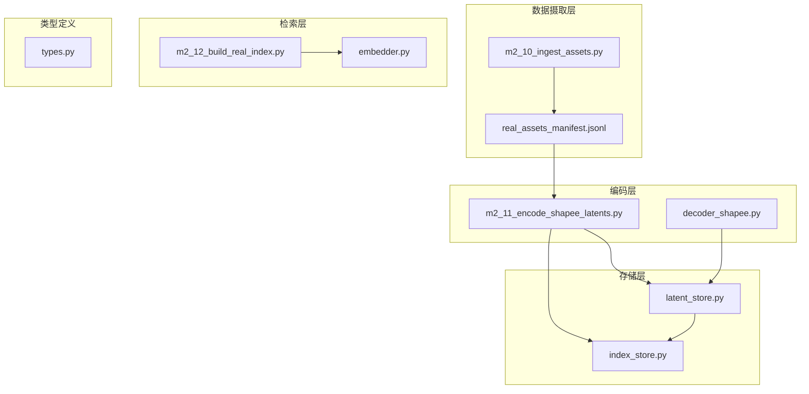
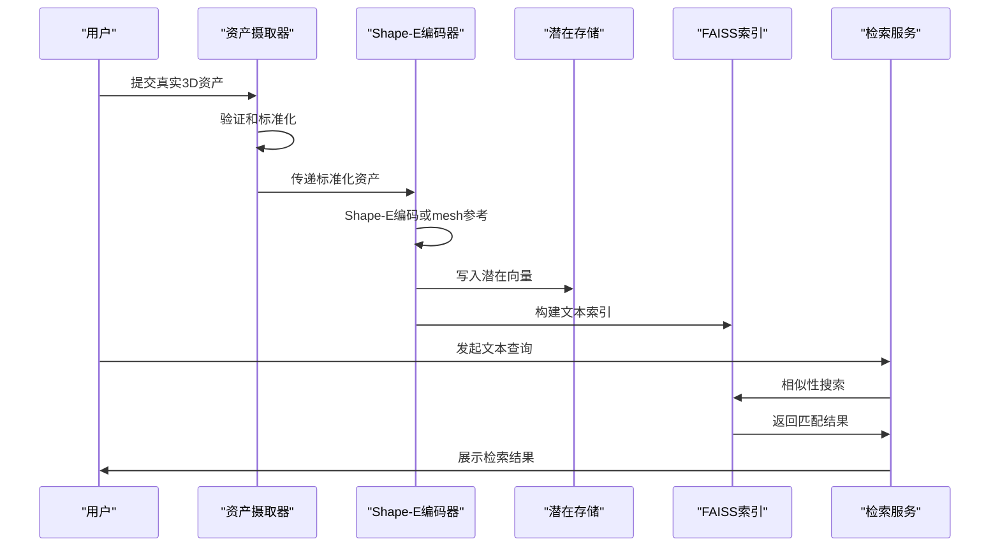
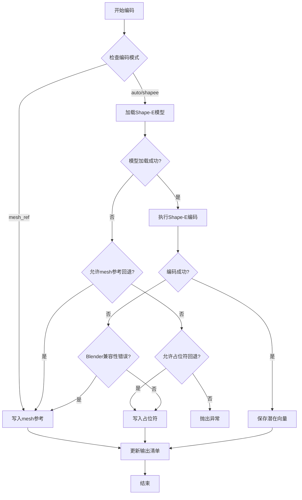
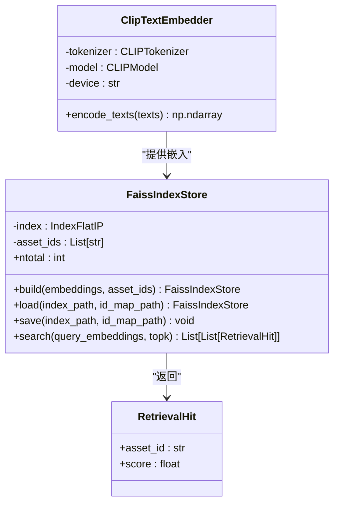
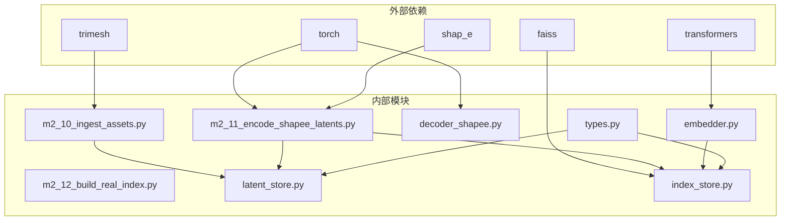

# M2 真实数据链路

<cite>
**本文档引用的文件**
- [m2_11_encode_shapee_latents.py](file://scripts/m2_11_encode_shapee_latents.py)
- [m2_12_build_real_index.py](file://scripts/m2_12_build_real_index.py)
- [decoder_shapee.py](file://src/roadgen3d/decoder_shapee.py)
- [latent_store.py](file://src/roadgen3d/latent_store.py)
- [index_store.py](file://src/roadgen3d/index_store.py)
- [embedder.py](file://src/roadgen3d/embedder.py)
- [types.py](file://src/roadgen3d/types.py)
- [m2_10_ingest_assets.py](file://scripts/m2_10_ingest_assets.py)
- [real_assets_manifest.jsonl](file://data/real/real_assets_manifest.jsonl)
- [real_assets_manifest_v2.jsonl](file://data/real/real_assets_manifest_v2.jsonl)
- [requirements-m2.txt](file://requirements-m2.txt)
</cite>

## 目录
1. [简介](#简介)
2. [项目结构](#项目结构)
3. [核心组件](#核心组件)
4. [架构概览](#架构概览)
5. [详细组件分析](#详细组件分析)
6. [依赖关系分析](#依赖关系分析)
7. [性能考虑](#性能考虑)
8. [故障排除指南](#故障排除指南)
9. [结论](#结论)

## 简介

M2真实数据链路是RoadGen3D项目中用于处理真实3D资产的核心管道，专注于Shape-E潜在空间编码流程。该系统能够从真实的3D资产中提取潜在向量，并将其存储为可检索的索引，支持后续的文本到资产检索和场景生成。

本系统采用多阶段处理架构，包括资产摄取、潜在空间编码、索引构建和检索等关键环节。通过mesh_ref模式，系统能够在不依赖Blender的情况下处理真实资产导入，提供了灵活的回退机制以确保系统的鲁棒性。

## 项目结构

M2真实数据链路由以下主要组件构成：

**图表来源**
- [m2_10_ingest_assets.py:1-421](file://scripts/m2_10_ingest_assets.py#L1-L421)
- [m2_11_encode_shapee_latents.py:1-454](file://scripts/m2_11_encode_shapee_latents.py#L1-L454)
- [m2_12_build_real_index.py:1-162](file://scripts/m2_12_build_real_index.py#L1-L162)

**章节来源**
- [m2_10_ingest_assets.py:1-421](file://scripts/m2_10_ingest_assets.py#L1-L421)
- [m2_11_encode_shapee_latents.py:1-454](file://scripts/m2_11_encode_shapee_latents.py#L1-L454)
- [m2_12_build_real_index.py:1-162](file://scripts/m2_12_build_real_index.py#L1-L162)

## 核心组件

### Shape-E潜在空间编码器

Shape-E编码器是系统的核心组件，负责将3D网格转换为潜在向量表示。其主要功能包括：

- **多模式编码支持**：支持Shape-E直接编码、mesh参考编码和占位符编码
- **Blender兼容性处理**：自动处理Blender版本兼容性问题
- **错误回退机制**：在编码失败时提供mesh参考或占位符回退

### 实体存储管理器

实体存储管理器负责管理潜在向量的持久化存储：

- **路径解析**：智能解析相对和绝对路径
- **格式验证**：验证潜在向量的格式和完整性
- **延迟加载**：支持按需加载潜在向量

### FAISS索引存储

FAISS索引存储提供了高效的相似性搜索能力：

- **内存优化**：使用IndexFlatIP实现快速相似性计算
- **持久化支持**：支持索引和ID映射的序列化
- **批量查询**：支持批量相似性搜索

**章节来源**
- [m2_11_encode_shapee_latents.py:225-354](file://scripts/m2_11_encode_shapee_latents.py#L225-L354)
- [latent_store.py:35-81](file://src/roadgen3d/latent_store.py#L35-L81)
- [index_store.py:33-96](file://src/roadgen3d/index_store.py#L33-L96)

## 架构概览

M2真实数据链路采用分层架构设计，确保了系统的模块化和可扩展性：

**图表来源**
- [m2_10_ingest_assets.py:337-375](file://scripts/m2_10_ingest_assets.py#L337-L375)
- [m2_11_encode_shapee_latents.py:225-354](file://scripts/m2_11_encode_shapee_latents.py#L225-L354)
- [m2_12_build_real_index.py:104-157](file://scripts/m2_12_build_real_index.py#L104-L157)

## 详细组件分析

### Shape-E潜在空间编码流程

Shape-E编码流程是整个M2管道的核心，实现了从3D网格到潜在向量的转换：

**图表来源**
- [m2_11_encode_shapee_latents.py:225-354](file://scripts/m2_11_encode_shapee_latents.py#L225-L354)

#### mesh_ref模式工作原理

mesh_ref模式是M2系统的重要特性，它允许在不依赖Blender的情况下处理真实资产：

- **mesh参考存储**：将mesh文件路径存储为潜在向量
- **零成本解码**：直接从mesh文件加载，无需计算
- **兼容性保证**：避免了Blender版本兼容性问题

这种设计确保了系统在各种环境下都能稳定运行，特别是在CI/CD环境中。

**章节来源**
- [m2_11_encode_shapee_latents.py:96-187](file://scripts/m2_11_encode_shapee_latents.py#L96-L187)
- [m2_11_encode_shapee_latents.py:202-210](file://scripts/m2_11_encode_shapee_latents.py#L202-L210)

### FAISS索引构建过程

FAISS索引构建过程提供了高效的文本到资产检索能力：

**图表来源**
- [index_store.py:33-96](file://src/roadgen3d/index_store.py#L33-L96)
- [embedder.py:33-100](file://src/roadgen3d/embedder.py#L33-L100)
- [types.py:21-27](file://src/roadgen3d/types.py#L21-L27)

#### 索引优化策略

系统采用了多种优化策略来提升索引性能：

- **设备优化**：自动选择最佳的计算设备（CPU/GPU）
- **内存管理**：使用IndexFlatIP实现内存高效存储
- **并行处理**：支持批量嵌入计算和索引构建

**章节来源**
- [m2_12_build_real_index.py:115-144](file://scripts/m2_12_build_real_index.py#L115-L144)
- [embedder.py:36-83](file://src/roadgen3d/embedder.py#L36-L83)

### 资产摄取和预处理

资产摄取组件负责将原始3D资产转换为系统可用的标准格式：

**图表来源**
- [m2_10_ingest_assets.py:71-133](file://scripts/m2_10_ingest_assets.py#L71-L133)

#### 数据预处理步骤

系统实现了完整的数据预处理流水线：

- **几何清理**：移除环境背景和辅助几何体
- **坐标标准化**：将资产居中并缩放到单位立方体
- **地面对齐**：确保资产底部与地面平齐
- **质量验证**：检查树形资产的直立性

**章节来源**
- [m2_10_ingest_assets.py:140-250](file://scripts/m2_10_ingest_assets.py#L140-L250)

## 依赖关系分析

M2真实数据链路的依赖关系体现了清晰的分层架构：

**图表来源**
- [requirements-m2.txt:1-4](file://requirements-m2.txt#L1-L4)
- [m2_11_encode_shapee_latents.py:70-93](file://scripts/m2_11_encode_shapee_latents.py#L70-L93)
- [m2_12_build_real_index.py:19-20](file://scripts/m2_12_build_real_index.py#L19-L20)

### 编码器配置

系统提供了灵活的编码器配置选项：

- **设备选择**：支持CPU和GPU加速
- **模型缓存**：本地模型文件缓存机制
- **渲染缓存**：临时渲染结果缓存
- **回退策略**：多级错误处理机制

**章节来源**
- [m2_11_encode_shapee_latents.py:357-416](file://scripts/m2_11_encode_shapee_latents.py#L357-L416)

## 性能考虑

### 编码性能优化

系统在多个层面实现了性能优化：

- **批处理支持**：支持批量编码以提高吞吐量
- **缓存机制**：利用渲染缓存减少重复计算
- **内存管理**：优化潜在向量的内存布局
- **设备选择**：自动选择最适合的计算设备

### 检索性能优化

检索系统的性能优化策略：

- **索引类型选择**：使用IndexFlatIP实现快速相似性计算
- **并行查询**：支持多查询并发处理
- **内存映射**：使用内存映射文件减少内存占用
- **预计算优化**：提前计算常用的查询向量

## 故障排除指南

### 常见问题及解决方案

#### Shape-E编码失败

当Shape-E编码失败时，系统会自动尝试回退策略：

1. **Blender兼容性错误**：自动使用mesh参考模式
2. **模型加载失败**：使用占位符向量作为回退
3. **渲染超时**：启用渲染缓存重试机制

#### 索引构建问题

索引构建过程中可能遇到的问题：

- **内存不足**：调整批量大小和索引参数
- **设备不兼容**：检查CUDA驱动和PyTorch版本
- **文件权限**：确保索引文件的读写权限

**章节来源**
- [m2_11_encode_shapee_latents.py:148-180](file://scripts/m2_11_encode_shapee_latents.py#L148-L180)
- [index_store.py:21-30](file://src/roadgen3d/index_store.py#L21-L30)

## 结论

M2真实数据链路通过精心设计的架构和优化策略，成功实现了从真实3D资产到潜在空间的有效转换。系统的核心优势包括：

1. **高兼容性**：通过mesh_ref模式避免了Blender依赖
2. **强鲁棒性**：多级错误处理和回退机制
3. **高性能**：优化的索引和编码策略
4. **易扩展**：模块化的架构设计

该系统为RoadGen3D项目提供了坚实的基础，支持高质量的城市街道场景生成和资产管理。通过持续的优化和改进，M2真实数据链路将继续为3D内容创作和城市规划应用提供强大的技术支持。