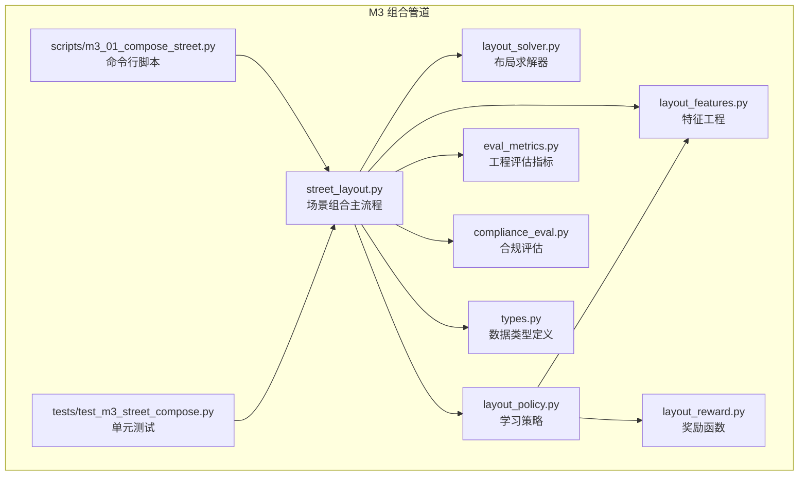
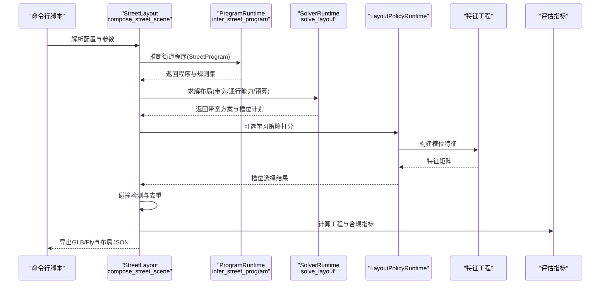
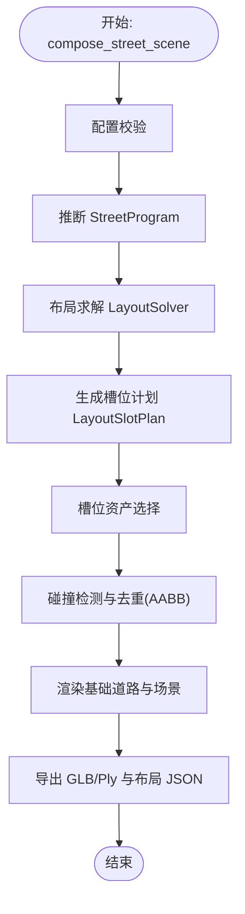
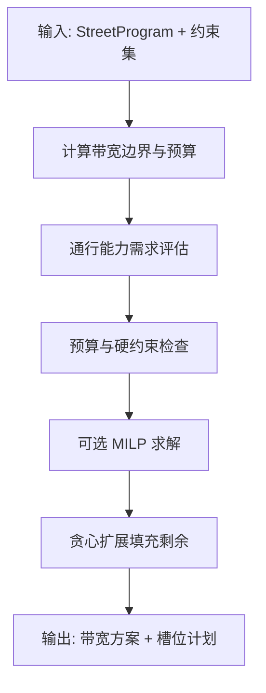
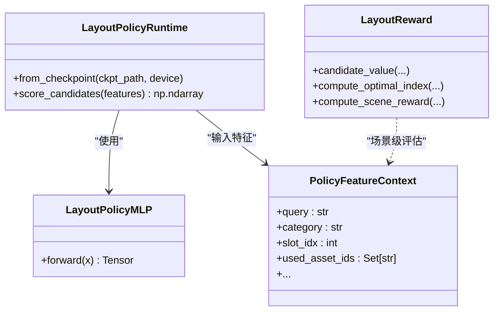
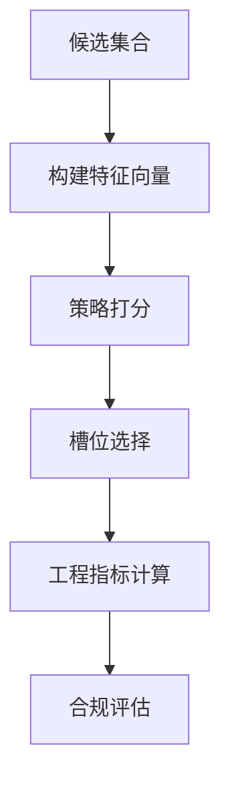
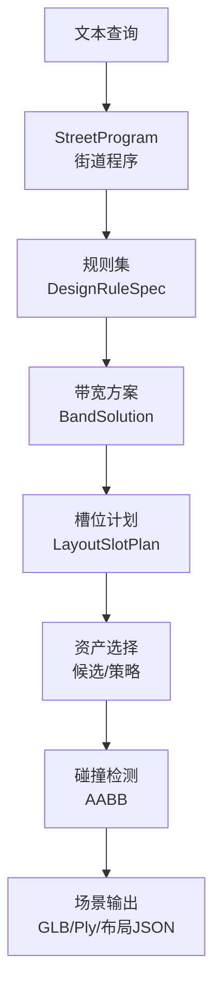
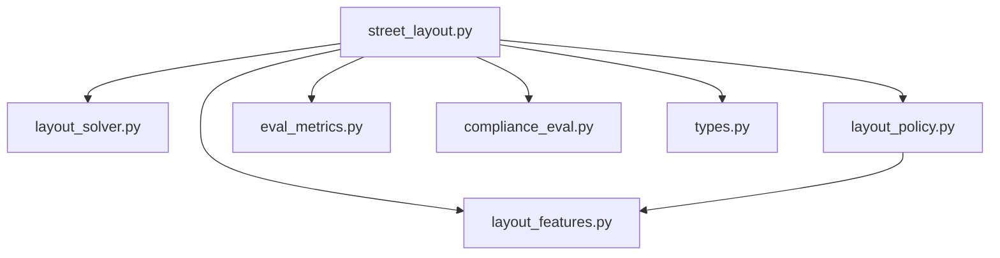

# M3 街道场景组合

<cite>
**本文档引用的文件**
- [street_layout.py](file://src/roadgen3d/street_layout.py)
- [layout_solver.py](file://src/roadgen3d/layout_solver.py)
- [layout_reward.py](file://src/roadgen3d/layout_reward.py)
- [layout_policy.py](file://src/roadgen3d/layout_policy.py)
- [layout_features.py](file://src/roadgen3d/layout_features.py)
- [m3_01_compose_street.py](file://scripts/m3_01_compose_street.py)
- [types.py](file://src/roadgen3d/types.py)
- [eval_metrics.py](file://src/roadgen3d/eval_metrics.py)
- [compliance_eval.py](file://src/roadgen3d/compliance_eval.py)
- [test_m3_street_compose.py](file://tests/test_m3_street_compose.py)
</cite>

## 目录
1. [简介](#简介)
2. [项目结构](#项目结构)
3. [核心组件](#核心组件)
4. [架构总览](#架构总览)
5. [详细组件分析](#详细组件分析)
6. [依赖关系分析](#依赖关系分析)
7. [性能考虑](#性能考虑)
8. [故障排除指南](#故障排除指南)
9. [结论](#结论)
10. [附录](#附录)

## 简介
本文件系统化阐述 M3 街道场景组合管道的设计与实现，覆盖从多资产检索、去重与碰撞约束处理，到布局求解器的约束感知优化与奖励函数设计，再到空间特征提取与布局评估指标的全链路流程。文档同时给出街道宽度计算、车道分配、人行道设计与建筑间距优化等关键实现细节，并提供不同城市尺度的组合策略与性能基准测试方法。

## 项目结构
M3 街道场景组合位于 RoadGen3D 仓库的 `src/roadgen3d` 目录下，核心模块包括：
- 场景组合主流程：`street_layout.py`
- 布局求解器：`layout_solver.py`
- 学习策略与奖励：`layout_policy.py`、`layout_reward.py`、`layout_features.py`
- 配置与数据类型：`types.py`
- 评估与合规：`eval_metrics.py`、`compliance_eval.py`
- 脚本入口：`scripts/m3_01_compose_street.py`
- 测试用例：`tests/test_m3_street_compose.py`

**图表来源**
- [street_layout.py](file://src/roadgen3d/street_layout.py)
- [layout_solver.py](file://src/roadgen3d/layout_solver.py)
- [layout_policy.py](file://src/roadgen3d/layout_policy.py)
- [layout_reward.py](file://src/roadgen3d/layout_reward.py)
- [layout_features.py](file://src/roadgen3d/layout_features.py)
- [types.py](file://src/roadgen3d/types.py)
- [eval_metrics.py](file://src/roadgen3d/eval_metrics.py)
- [compliance_eval.py](file://src/roadgen3d/compliance_eval.py)
- [m3_01_compose_street.py](file://scripts/m3_01_compose_street.py)
- [test_m3_street_compose.py](file://tests/test_m3_street_compose.py)

**章节来源**
- [m3_01_compose_street.py:1-162](file://scripts/m3_01_compose_street.py#L1-L162)
- [street_layout.py:5135-5170](file://src/roadgen3d/street_layout.py#L5135-L5170)

## 核心组件
- 场景组合主流程（StreetLayout）：负责配置校验、资产检索与候选过滤、网格化布局槽位生成、碰撞检测与去重、实例级渲染与导出。
- 布局求解器（LayoutSolver）：基于设计规则集进行带宽预算与通行能力约束的几何求解，支持混合整数规划与启发式求解。
- 学习策略（LayoutPolicy）：基于 MLP 的槽位选择策略，结合候选特征向量进行打分与采样。
- 奖励函数（LayoutReward）：多目标价值函数，综合相关性、多样性、新鲜度与稀缺性。
- 特征工程（LayoutFeatures）：为策略模型构建固定维度的槽位级特征向量。
- 数据类型（Types）：统一的数据结构定义，涵盖程序、带宽、槽位、求解结果等。
- 评估与合规（EvalMetrics/ComplianceEval）：工程指标与合规评分，用于性能基准与质量评估。

**章节来源**
- [street_layout.py:5135-5170](file://src/roadgen3d/street_layout.py#L5135-L5170)
- [layout_solver.py:1527-1593](file://src/roadgen3d/layout_solver.py#L1527-L1593)
- [layout_policy.py:63-125](file://src/roadgen3d/layout_policy.py#L63-L125)
- [layout_reward.py:8-96](file://src/roadgen3d/layout_reward.py#L8-L96)
- [layout_features.py:62-183](file://src/roadgen3d/layout_features.py#L62-L183)
- [types.py:47-120](file://src/roadgen3d/types.py#L47-L120)
- [eval_metrics.py:1-301](file://src/roadgen3d/eval_metrics.py#L1-L301)
- [compliance_eval.py:14-160](file://src/roadgen3d/compliance_eval.py#L14-L160)

## 架构总览
M3 组合管道采用“文本查询驱动 + 多资产检索 + 约束感知布局求解 + 实例级渲染”的流水线式架构。输入为用户查询与场景参数，输出为可渲染的 GLB/Ply 场景与布局 JSON。

**图表来源**
- [m3_01_compose_street.py:85-157](file://scripts/m3_01_compose_street.py#L85-L157)
- [street_layout.py:5378-5403](file://src/roadgen3d/street_layout.py#L5378-L5403)
- [layout_solver.py:1527-1593](file://src/roadgen3d/layout_solver.py#L1527-L1593)
- [layout_policy.py:99-125](file://src/roadgen3d/layout_policy.py#L99-L125)
- [layout_features.py:165-183](file://src/roadgen3d/layout_features.py#L165-L183)
- [eval_metrics.py:194-264](file://src/roadgen3d/eval_metrics.py#L194-L264)

## 详细组件分析

### 组件A：StreetLayout 场景组合主流程
- 设计理念
  - 将“文本查询”转化为“带宽预算与通行能力约束”的街道程序，再通过布局求解器得到槽位计划，最后在实例层完成碰撞检测与去重。
  - 支持模板直路与 OSM 实路两种布局模式，具备可扩展的走廊布局模式。
- 关键流程
  - 配置校验与参数归一化
  - 程序生成与规则加载
  - 布局求解与带宽分配
  - 槽位到资产的绑定与策略采样
  - 碰撞检测与去重（基于 AABB 包围盒）
  - 渲染与导出（GLB/Ply）
- 资产质量控制
  - 面数阈值与质量等级映射，过滤低质量资产
  - 树形资产直立性验证
  - 阻止清单与来源过滤（如 real_asset、urbanverse_import、v2 生成器）
- 空间特征与布局评估
  - 工程指标：重叠率、丢槽率、风格一致性、平衡度、拓扑有效性、交叉截面可行性等
  - 合规评估：违反规则数量、平均惩罚、可行度评分

**图表来源**
- [street_layout.py:5135-5170](file://src/roadgen3d/street_layout.py#L5135-L5170)
- [street_layout.py:1600-1741](file://src/roadgen3d/street_layout.py#L1600-L1741)
- [street_layout.py:800-849](file://src/roadgen3d/street_layout.py#L800-L849)
- [eval_metrics.py:13-38](file://src/roadgen3d/eval_metrics.py#L13-L38)

**章节来源**
- [street_layout.py:5135-5170](file://src/roadgen3d/street_layout.py#L5135-L5170)
- [street_layout.py:1600-1741](file://src/roadgen3d/street_layout.py#L1600-L1741)
- [street_layout.py:800-849](file://src/roadgen3d/street_layout.py#L800-L849)
- [eval_metrics.py:13-38](file://src/roadgen3d/eval_metrics.py#L13-L38)

### 组件B：LayoutSolver 布局求解器
- 约束感知优化算法
  - 带宽预算与通行能力硬约束（行人、车流、公交边缘）
  - 目标权重按功能带类型（铺装步道、装饰带、车行道）进行偏好调整
  - 混合整数规划（可选）与贪心扩展相结合，确保可行解与近似最优
- 奖励函数设计
  - 总宽度得分、未使用预算、槽位混合偏差等分解项
  - 通过带宽边界与预算约束的交互，形成对布局多样性的引导

**图表来源**
- [layout_solver.py:402-540](file://src/roadgen3d/layout_solver.py#L402-L540)
- [layout_solver.py:375-400](file://src/roadgen3d/layout_solver.py#L375-L400)
- [layout_solver.py:1504-1525](file://src/roadgen3d/layout_solver.py#L1504-L1525)

**章节来源**
- [layout_solver.py:402-540](file://src/roadgen3d/layout_solver.py#L402-L540)
- [layout_solver.py:375-400](file://src/roadgen3d/layout_solver.py#L375-L400)
- [layout_solver.py:1504-1525](file://src/roadgen3d/layout_solver.py#L1504-L1525)

### 组件C：LayoutPolicy 学习策略与 LayoutReward 奖励函数
- 学习策略
  - MLP 槽位选择器，输入固定维度特征，输出 logits
  - 支持温度采样与 softmax 权重，兼容“规则优先”与“学习优先”
- 奖励函数
  - 多目标价值：检索相似度、多样性、新鲜度、稀缺性
  - 场景级奖励：基于放置集合的多样性与平均分数

**图表来源**
- [layout_policy.py:63-125](file://src/roadgen3d/layout_policy.py#L63-L125)
- [layout_reward.py:8-96](file://src/roadgen3d/layout_reward.py#L8-L96)
- [layout_features.py:25-51](file://src/roadgen3d/layout_features.py#L25-L51)

**章节来源**
- [layout_policy.py:63-125](file://src/roadgen3d/layout_policy.py#L63-L125)
- [layout_reward.py:8-96](file://src/roadgen3d/layout_reward.py#L8-L96)
- [layout_features.py:25-51](file://src/roadgen3d/layout_features.py#L25-L51)

### 组件D：空间特征提取与布局评估指标
- 空间特征
  - 固定维度 35 的特征向量，包含槽位坐标、道路几何、密度、候选排名、使用状态、类别 one-hot、周期性编码、空间距离等
- 布局评估
  - 工程指标：重叠率、丢槽率、风格一致性、平衡度、规则满足率、拓扑有效性、交叉截面可行性、可编辑性、冲突可解释性
  - 合规评估：违规总数、平均惩罚、平均可行度

**图表来源**
- [layout_features.py:62-183](file://src/roadgen3d/layout_features.py#L62-L183)
- [eval_metrics.py:194-264](file://src/roadgen3d/eval_metrics.py#L194-L264)
- [compliance_eval.py:14-55](file://src/roadgen3d/compliance_eval.py#L14-L55)

**章节来源**
- [layout_features.py:62-183](file://src/roadgen3d/layout_features.py#L62-L183)
- [eval_metrics.py:194-264](file://src/roadgen3d/eval_metrics.py#L194-L264)
- [compliance_eval.py:14-55](file://src/roadgen3d/compliance_eval.py#L14-L55)

### 概念总览
以下概念图展示 M3 组合管道的关键要素及其相互关系，帮助读者建立整体认知。

[此图为概念性总览，不直接映射具体源码文件，故无图表来源]

## 依赖关系分析
- 模块内聚与耦合
  - street_layout 对 layout_solver、layout_policy、layout_features、eval_metrics、compliance_eval 具有强依赖；对 types 的数据结构依赖稳定且清晰。
  - layout_policy 与 layout_features 强耦合，前者依赖后者提供的固定维度特征。
- 外部依赖
  - trimesh 用于网格与场景构建
  - pulp 用于可选 MILP 求解
  - shapely 用于几何运算（在 OSM 模式中）

**图表来源**
- [street_layout.py:5135-5170](file://src/roadgen3d/street_layout.py#L5135-L5170)
- [layout_solver.py:1527-1593](file://src/roadgen3d/layout_solver.py#L1527-L1593)
- [layout_policy.py:63-125](file://src/roadgen3d/layout_policy.py#L63-L125)
- [layout_features.py:62-183](file://src/roadgen3d/layout_features.py#L62-L183)
- [eval_metrics.py:1-301](file://src/roadgen3d/eval_metrics.py#L1-L301)
- [compliance_eval.py:1-160](file://src/roadgen3d/compliance_eval.py#L1-L160)
- [types.py:47-120](file://src/roadgen3d/types.py#L47-L120)

**章节来源**
- [street_layout.py:5135-5170](file://src/roadgen3d/street_layout.py#L5135-L5170)
- [layout_solver.py:1527-1593](file://src/roadgen3d/layout_solver.py#L1527-L1593)
- [layout_policy.py:63-125](file://src/roadgen3d/layout_policy.py#L63-L125)
- [layout_features.py:62-183](file://src/roadgen3d/layout_features.py#L62-L183)
- [eval_metrics.py:1-301](file://src/roadgen3d/eval_metrics.py#L1-L301)
- [compliance_eval.py:1-160](file://src/roadgen3d/compliance_eval.py#L1-L160)
- [types.py:47-120](file://src/roadgen3d/types.py#L47-L120)

## 性能考虑
- 检索与候选过滤
  - 使用 FAISS 进行高维嵌入检索，配合分类过滤与质量阈值，减少无效候选。
  - 通过 curated 锁定与场景就绪资产优先策略，提升命中质量。
- 布局求解
  - 在带宽预算与通行能力约束下，优先 MILP 求解，失败时回退贪心扩展，保证稳定性。
  - 目标权重按功能带类型进行偏好调整，避免过度拥挤或资源浪费。
- 实例级渲染
  - 采用 trimesh 的场景合并与材质应用，避免重复变换与内存占用。
  - 可选 PBR 材质与纹理贴图，平衡视觉质量与性能。
- 评估与基准
  - 工程指标（重叠率、丢槽率、风格一致性、平衡度、规则满足率、拓扑有效性、交叉截面可行性、可编辑性、冲突可解释性）用于快速回归检测。
  - 合规评估（违规总数、平均惩罚、平均可行度）用于 M5 约束场景的验收。

[本节为通用指导，不直接分析具体文件，故无章节来源]

## 故障排除指南
- 常见问题与定位
  - 配置参数异常：检查长度、宽度、密度、车道数、布局模式等参数范围与取值。
  - 资产质量不足：确认面数阈值、质量等级、树形资产直立验证与来源过滤是否生效。
  - 碰撞与去重失败：核查 AABB 包围盒计算与侧向偏移，确保槽位间距与类别偏好设置合理。
  - 求解不可行：查看带宽边界与预算冲突、通行能力需求与硬约束，必要时降低严格度或放宽预算。
- 日志与诊断
  - 使用“全量 UI 摘要”记录模式，收集布局步骤、带宽方案、槽位计划与冲突解释。
  - 结合工程指标与合规评估报告，定位性能瓶颈与约束违规热点。

**章节来源**
- [street_layout.py:492-611](file://src/roadgen3d/street_layout.py#L492-L611)
- [street_layout.py:800-849](file://src/roadgen3d/street_layout.py#L800-L849)
- [layout_solver.py:423-440](file://src/roadgen3d/layout_solver.py#L423-L440)
- [eval_metrics.py:194-264](file://src/roadgen3d/eval_metrics.py#L194-L264)
- [compliance_eval.py:58-122](file://src/roadgen3d/compliance_eval.py#L58-L122)

## 结论
M3 街道场景组合管道以“文本查询驱动 + 多资产检索 + 约束感知布局求解 + 实例级渲染”为核心路径，通过严格的资产质量控制、空间特征提取与布局评估体系，实现了从规则到学习的双轨策略，并在模板与 OSM 两种布局模式下具备良好的可扩展性与性能稳定性。建议在实际部署中结合工程与合规指标持续迭代策略权重与特征工程，以适配不同城市尺度与设计目标。

[本节为总结性内容，不直接分析具体文件，故无章节来源]

## 附录

### 不同城市尺度的组合策略
- 小尺度（街区级）
  - 侧重步行友好与慢行优先，带宽偏好向“铺装步道”与“装饰带”倾斜，适当增加座椅与树池密度。
  - 布局模式推荐“模板直路”，便于快速生成与一致性控制。
- 中尺度（街道级）
  - 平衡车行与人行需求，根据通行能力要求设定车行道与公交边缘宽度，兼顾商业与公共设施。
  - 可选“OSM 实路”模式，利用真实路网几何进行更贴近现实的布局。
- 大尺度（区域级）
  - 强调连续性与主题性，通过主题段落与风格预设提升整体协调性，适当引入学习策略以增强多样性。

[本节为概念性策略说明，不直接分析具体文件，故无章节来源]

### 性能基准测试方法
- 指标体系
  - 工程指标：重叠率、丢槽率、风格一致性、平衡度、规则满足率、拓扑有效性、交叉截面可行性、可编辑性、冲突可解释性。
  - 合规指标：违规总数、平均惩罚、平均可行度。
- 执行流程
  - 使用命令行脚本批量运行，输出布局 JSON 与场景文件。
  - 通过评估模块计算聚合统计，生成报告与 CSV。
  - 对比“规则优先”与“学习优先”两套策略的差异，识别改进点。

**章节来源**
- [m3_01_compose_street.py:85-157](file://scripts/m3_01_compose_street.py#L85-L157)
- [eval_metrics.py:194-264](file://src/roadgen3d/eval_metrics.py#L194-L264)
- [compliance_eval.py:58-122](file://src/roadgen3d/compliance_eval.py#L58-L122)
- [test_m3_street_compose.py:550-957](file://tests/test_m3_street_compose.py#L550-L957)