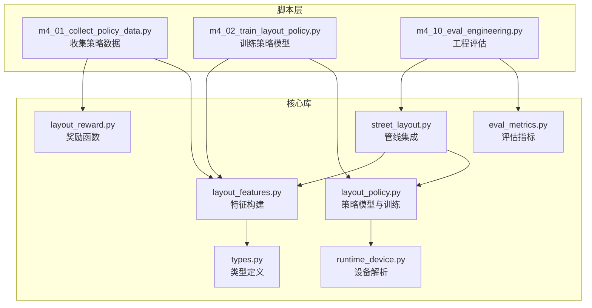
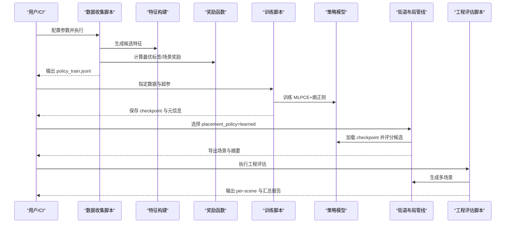
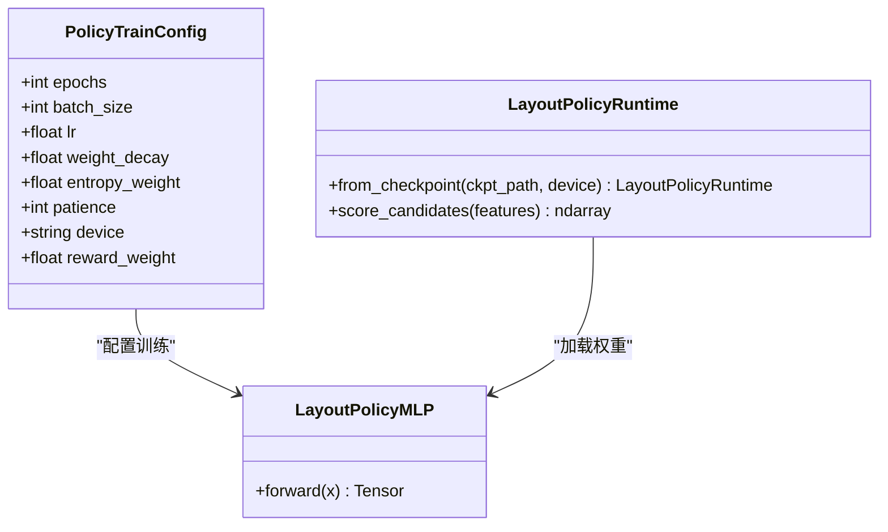
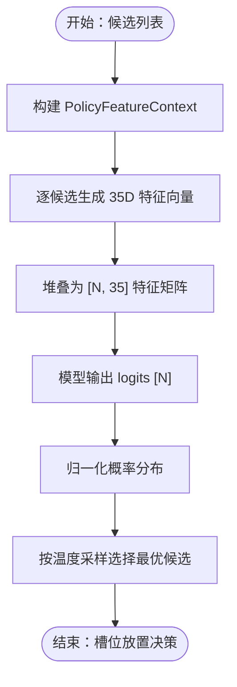
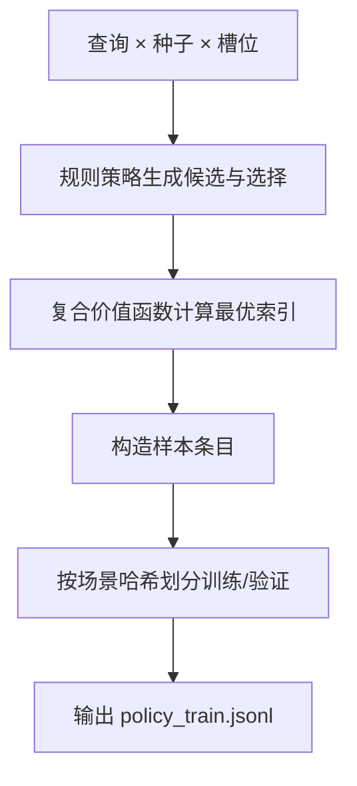
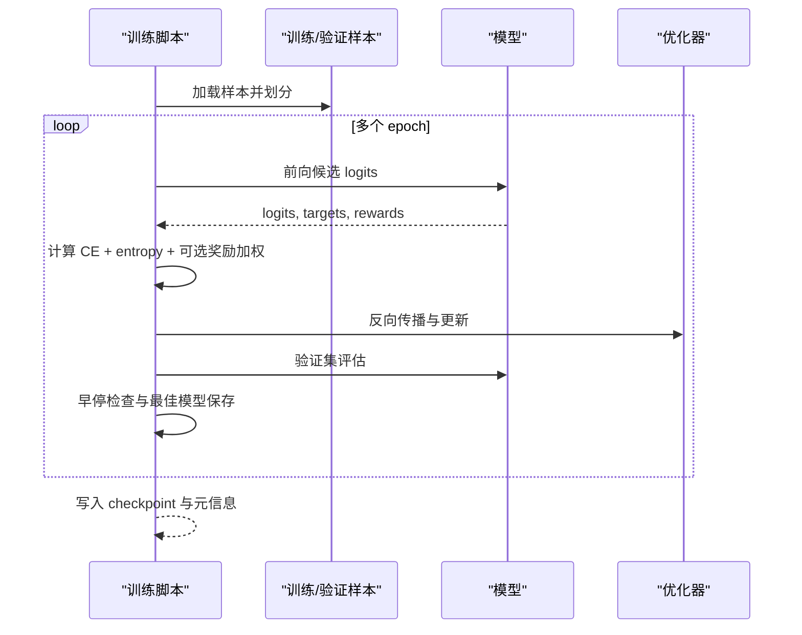
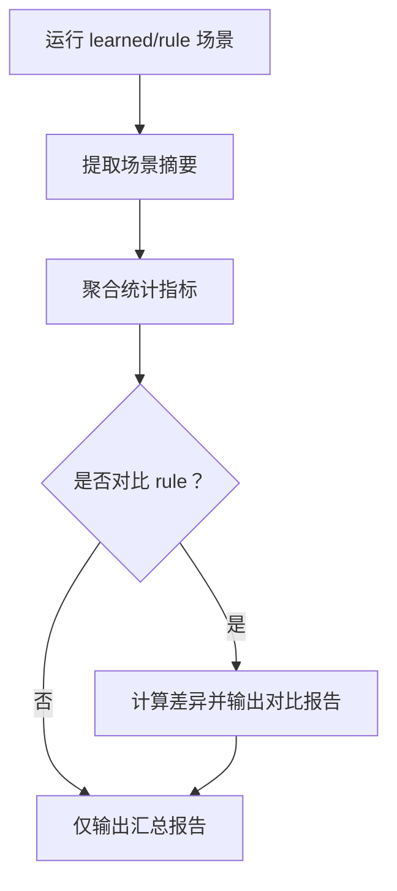
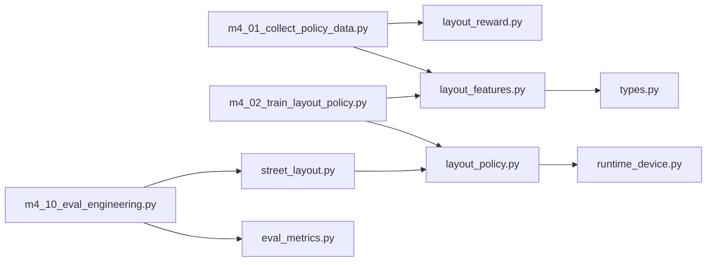

# M4 可学习布局策略

<cite>
**本文引用的文件**
- [layout_policy.py](file://src/roadgen3d/layout_policy.py)
- [layout_reward.py](file://src/roadgen3d/layout_reward.py)
- [layout_features.py](file://src/roadgen3d/layout_features.py)
- [street_layout.py](file://src/roadgen3d/street_layout.py)
- [runtime_device.py](file://src/roadgen3d/runtime_device.py)
- [m4_01_collect_policy_data.py](file://scripts/m4_01_collect_policy_data.py)
- [m4_02_train_layout_policy.py](file://scripts/m4_02_train_layout_policy.py)
- [m4_10_eval_engineering.py](file://scripts/m4_10_eval_engineering.py)
- [m4_learning_and_evaluation.md](file://docs/m4_learning_and_evaluation.md)
- [test_m4_layout_policy.py](file://tests/test_m4_layout_policy.py)
- [test_m4_eval_metrics.py](file://tests/test_m4_eval_metrics.py)
- [eval_metrics.py](file://src/roadgen3d/eval_metrics.py)
- [types.py](file://src/roadgen3d/types.py)
</cite>

## 目录
1. [简介](#简介)
2. [项目结构](#项目结构)
3. [核心组件](#核心组件)
4. [架构总览](#架构总览)
5. [详细组件分析](#详细组件分析)
6. [依赖关系分析](#依赖关系分析)
7. [性能考量](#性能考量)
8. [故障排查指南](#故障排查指南)
9. [结论](#结论)
10. [附录](#附录)

## 简介
本文件系统性阐述 RoadGen3D 中 M4 可学习布局策略的完整流水线：从专家演示与随机探索的数据收集，到基于行为克隆的模型训练，再到工程化评估与性能优化；并深入解析 LayoutPolicy 类的架构设计、状态表示与动作空间定义，训练数据生成策略、奖励函数设计与收敛性保障，以及在不同城市环境下的策略泛化能力、在线学习机制与持续改进流程。最后给出模型部署、推理加速与实时决策的实现要点。

## 项目结构
M4 学习布局策略由“脚本层 + 核心库”两部分组成：
- 脚本层：负责数据收集、模型训练与工程评估
- 核心库：提供特征工程、策略模型、奖励函数、运行时设备解析等基础能力

图表来源
- [m4_01_collect_policy_data.py:1-375](file://scripts/m4_01_collect_policy_data.py#L1-L375)
- [m4_02_train_layout_policy.py:1-229](file://scripts/m4_02_train_layout_policy.py#L1-L229)
- [m4_10_eval_engineering.py:1-363](file://scripts/m4_10_eval_engineering.py#L1-L363)
- [layout_features.py:1-183](file://src/roadgen3d/layout_features.py#L1-L183)
- [layout_policy.py:1-309](file://src/roadgen3d/layout_policy.py#L1-L309)
- [layout_reward.py:1-96](file://src/roadgen3d/layout_reward.py#L1-L96)
- [runtime_device.py:1-72](file://src/roadgen3d/runtime_device.py#L1-L72)
- [street_layout.py:1-200](file://src/roadgen3d/street_layout.py#L1-L200)
- [eval_metrics.py:1-200](file://src/roadgen3d/eval_metrics.py#L1-L200)
- [types.py:1-200](file://src/roadgen3d/types.py#L1-L200)

章节来源
- [m4_learning_and_evaluation.md:1-191](file://docs/m4_learning_and_evaluation.md#L1-L191)
- [m4_01_collect_policy_data.py:1-375](file://scripts/m4_01_collect_policy_data.py#L1-L375)
- [m4_02_train_layout_policy.py:1-229](file://scripts/m4_02_train_layout_policy.py#L1-L229)
- [m4_10_eval_engineering.py:1-363](file://scripts/m4_10_eval_engineering.py#L1-L363)

## 核心组件
- 特征工程模块（layout_features）：为每个候选资产生成固定维度的特征向量，包含几何、检索分数、使用历史、周期性信号、上下文进度与空间距离等。
- 策略模型与训练（layout_policy）：轻量 MLP，输入为候选特征矩阵，输出为每个候选的打分；采用交叉熵+熵正则进行训练，并支持按场景划分训练/验证集。
- 奖励函数（layout_reward）：组合多样性、新鲜度与稀缺性，用于计算最优标签与场景级奖励权重。
- 运行时设备解析（runtime_device）：自动选择 CPU/MPS/CUDA 后端，确保跨平台可用。
- 街道布局管线（street_layout）：集成策略模型，支持 rule/learned 两种放置策略，并记录回退原因与性能指标。
- 工程评估（m4_10_eval_engineering）：批量生成场景，汇总工程指标并输出报告。

章节来源
- [layout_features.py:1-183](file://src/roadgen3d/layout_features.py#L1-L183)
- [layout_policy.py:1-309](file://src/roadgen3d/layout_policy.py#L1-L309)
- [layout_reward.py:1-96](file://src/roadgen3d/layout_reward.py#L1-L96)
- [runtime_device.py:1-72](file://src/roadgen3d/runtime_device.py#L1-L72)
- [street_layout.py:1-200](file://src/roadgen3d/street_layout.py#L1-L200)
- [m4_10_eval_engineering.py:1-363](file://scripts/m4_10_eval_engineering.py#L1-L363)

## 架构总览
M4 的整体流程如下：

图表来源
- [m4_01_collect_policy_data.py:97-337](file://scripts/m4_01_collect_policy_data.py#L97-L337)
- [m4_02_train_layout_policy.py:155-196](file://scripts/m4_02_train_layout_policy.py#L155-L196)
- [layout_policy.py:166-308](file://src/roadgen3d/layout_policy.py#L166-L308)
- [street_layout.py:1-200](file://src/roadgen3d/street_layout.py#L1-L200)
- [m4_10_eval_engineering.py:112-221](file://scripts/m4_10_eval_engineering.py#L112-L221)

## 详细组件分析

### LayoutPolicy 类与运行时
- 模型结构：32→64→32→1 的 MLP，ReLU 激活与 Dropout，输出每个候选的打分。
- 运行时：支持从 checkpoint 加载，自动设备解析与维度兼容处理（padding/truncating）。
- 训练：按场景划分训练/验证集，早停与最佳模型保存；支持奖励加权交叉熵。

图表来源
- [layout_policy.py:24-125](file://src/roadgen3d/layout_policy.py#L24-L125)
- [layout_policy.py:166-308](file://src/roadgen3d/layout_policy.py#L166-L308)

章节来源
- [layout_policy.py:1-309](file://src/roadgen3d/layout_policy.py#L1-L309)

### 特征工程与动作空间
- 输入维度：固定 35 维（数值块、候选块、周期性编码、上下文块、空间块、类别 one-hot）。
- 动作空间：对同一插槽的所有候选进行打分，softmax 采样决定最终放置对象。
- 上下文：包括道路宽度、密度、槽位索引、已用资产集合、剩余池容量、平均已放置分数等。

图表来源
- [layout_features.py:62-182](file://src/roadgen3d/layout_features.py#L62-L182)
- [street_layout.py:1-200](file://src/roadgen3d/street_layout.py#L1-L200)

章节来源
- [layout_features.py:1-183](file://src/roadgen3d/layout_features.py#L1-L183)

### 数据收集与标签生成
- 数据来源：规则策略（rule）在多种查询与种子下的插槽决策。
- 标签生成：使用复合价值函数（多样性、新鲜度、稀缺性）计算最优标签；若不可用则回退到规则选择索引。
- 场景划分：按 scene_id 的哈希稳定地将样本分配到训练/验证集，保证同场景候选不被切分。

图表来源
- [m4_01_collect_policy_data.py:244-251](file://scripts/m4_01_collect_policy_data.py#L244-L251)
- [layout_reward.py:32-72](file://src/roadgen3d/layout_reward.py#L32-L72)
- [layout_policy.py:127-142](file://src/roadgen3d/layout_policy.py#L127-L142)

章节来源
- [m4_01_collect_policy_data.py:1-375](file://scripts/m4_01_collect_policy_data.py#L1-L375)
- [layout_reward.py:1-96](file://src/roadgen3d/layout_reward.py#L1-L96)
- [layout_policy.py:127-142](file://src/roadgen3d/layout_policy.py#L127-L142)

### 训练流程与收敛性保障
- 损失函数：每槽交叉熵 + 熵正则项，防止模型塌缩；可选奖励加权交叉熵。
- 优化器：AdamW；早停监控验证损失；保存最佳模型。
- 划分策略：按场景哈希划分，避免数据泄漏；训练曲线与元信息持久化。

图表来源
- [m4_02_train_layout_policy.py:155-196](file://scripts/m4_02_train_layout_policy.py#L155-L196)
- [layout_policy.py:166-308](file://src/roadgen3d/layout_policy.py#L166-L308)

章节来源
- [m4_02_train_layout_policy.py:1-229](file://scripts/m4_02_train_layout_policy.py#L1-L229)
- [layout_policy.py:166-308](file://src/roadgen3d/layout_policy.py#L166-L308)

### 工程评估与性能指标
- 指标体系：实例数、掉落率、重叠率、多样性比、检索 Top-3 类别命中、总/单实例延迟等。
- 报告输出：CSV（每场景）与 JSON（汇总与对比）。
- 对比模式：可同时运行 rule 与 learned，输出差异报告。

图表来源
- [m4_10_eval_engineering.py:224-347](file://scripts/m4_10_eval_engineering.py#L224-L347)
- [eval_metrics.py:194-200](file://src/roadgen3d/eval_metrics.py#L194-L200)

章节来源
- [m4_10_eval_engineering.py:1-363](file://scripts/m4_10_eval_engineering.py#L1-L363)
- [eval_metrics.py:1-200](file://src/roadgen3d/eval_metrics.py#L1-L200)

### 策略泛化与在线学习
- 城市环境泛化：通过不同查询与设计规则档案（如平衡/步行优先/公交优先）控制跨场景一致性。
- 在线学习：当前版本以离线数据收集与训练为主；未来可扩展为“在线反馈 + 小步再训练”的闭环（见文档说明）。

章节来源
- [m4_learning_and_evaluation.md:1-191](file://docs/m4_learning_and_evaluation.md#L1-L191)
- [m4_10_eval_engineering.py:82-88](file://scripts/m4_10_eval_engineering.py#L82-L88)

### 部署、推理加速与实时决策
- 设备选择：自动检测 MPS/CUDA 可用性，回退至 CPU；支持显式指定。
- 推理路径：加载 checkpoint → 特征向量化 → 模型打分 → softmax 采样 → 放置决策。
- 实时性：模型轻量、特征向量化高效，适合在管线中作为实时决策模块。

章节来源
- [runtime_device.py:1-72](file://src/roadgen3d/runtime_device.py#L1-L72)
- [layout_policy.py:63-125](file://src/roadgen3d/layout_policy.py#L63-L125)
- [street_layout.py:1-200](file://src/roadgen3d/street_layout.py#L1-L200)

## 依赖关系分析
- 组件耦合
  - 数据收集依赖特征构建与奖励函数；训练脚本依赖特征构建与策略训练模块；评估脚本依赖管线与评估指标。
  - 策略模型依赖运行时设备解析，确保跨平台可用。
- 外部依赖
  - PyTorch 为策略模型与训练提供张量运算与自动微分；FAISS 与 CLIP 用于检索与嵌入。
- 潜在循环依赖
  - 当前模块间为单向依赖，未发现循环导入。

图表来源
- [m4_01_collect_policy_data.py:1-375](file://scripts/m4_01_collect_policy_data.py#L1-L375)
- [m4_02_train_layout_policy.py:1-229](file://scripts/m4_02_train_layout_policy.py#L1-L229)
- [m4_10_eval_engineering.py:1-363](file://scripts/m4_10_eval_engineering.py#L1-L363)
- [layout_features.py:1-183](file://src/roadgen3d/layout_features.py#L1-L183)
- [layout_policy.py:1-309](file://src/roadgen3d/layout_policy.py#L1-L309)
- [layout_reward.py:1-96](file://src/roadgen3d/layout_reward.py#L1-L96)
- [runtime_device.py:1-72](file://src/roadgen3d/runtime_device.py#L1-L72)
- [street_layout.py:1-200](file://src/roadgen3d/street_layout.py#L1-L200)
- [eval_metrics.py:1-200](file://src/roadgen3d/eval_metrics.py#L1-L200)
- [types.py:1-200](file://src/roadgen3d/types.py#L1-L200)

章节来源
- [m4_01_collect_policy_data.py:1-375](file://scripts/m4_01_collect_policy_data.py#L1-L375)
- [m4_02_train_layout_policy.py:1-229](file://scripts/m4_02_train_layout_policy.py#L1-L229)
- [m4_10_eval_engineering.py:1-363](file://scripts/m4_10_eval_engineering.py#L1-L363)

## 性能考量
- 训练效率
  - 小批量（256）与早停（patience=3）降低过拟合风险；熵正则提升探索稳定性。
  - 按场景划分训练/验证，避免样本泄露，提高泛化评估可靠性。
- 推理效率
  - 模型轻量、特征维度固定，便于批量化与缓存；设备自动选择确保充分利用硬件资源。
- 评估效率
  - 指标计算模块化，支持快速聚合与对比。

## 故障排查指南
- 缺失或无效 checkpoint：运行时会回退到规则策略，并在输出中记录回退原因。
- 空分类池或无效清单：快速失败并给出明确诊断。
- 评估脚本非零退出：通过标准错误输出定位问题；检查查询文件、清单路径与设备可用性。
- 测试用例覆盖
  - 特征向量形状与确定性、模型前向形状、数据收集 schema、训练收敛、缺失 checkpoint 回退等均有测试保障。

章节来源
- [test_m4_layout_policy.py:1-286](file://tests/test_m4_layout_policy.py#L1-L286)
- [test_m4_eval_metrics.py:1-163](file://tests/test_m4_eval_metrics.py#L1-L163)
- [m4_learning_and_evaluation.md:177-182](file://docs/m4_learning_and_evaluation.md#L177-L182)

## 结论
M4 将规则策略的专家演示转化为可学习的槽位放置策略，通过固定维度特征与轻量 MLP 实现高效训练与推理；结合工程化评估指标与稳定的场景划分，形成可复现、可对比、可迭代的策略开发闭环。未来可在现有基础上引入在线反馈与增量再训练，进一步提升策略在多城市与复杂场景下的适应能力。

## 附录
- 运行手册（摘自文档）
  - 收集数据：执行数据收集脚本，生成 policy_train.jsonl。
  - 训练策略：指定数据与超参，训练并保存 checkpoint。
  - 使用 learned 策略：在管线中设置 placement_policy=learned 与策略温度。
  - 工程评估：运行评估脚本，输出 per-scene 与汇总报告。

章节来源
- [m4_learning_and_evaluation.md:125-175](file://docs/m4_learning_and_evaluation.md#L125-L175)