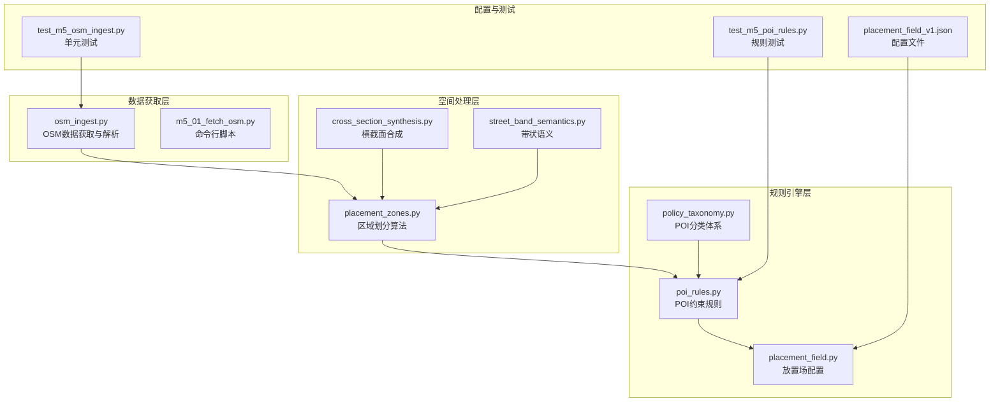
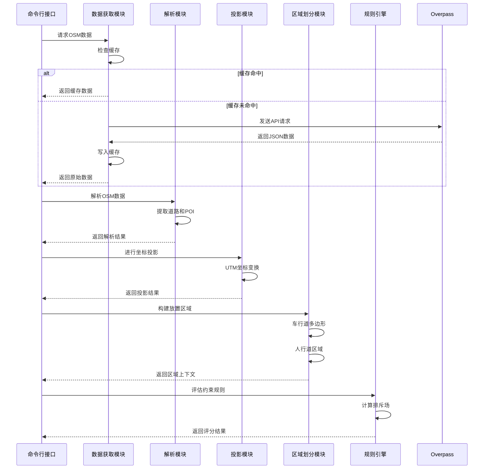
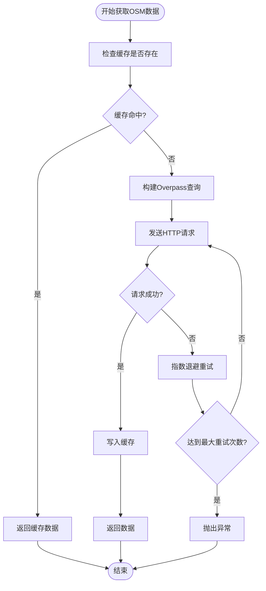
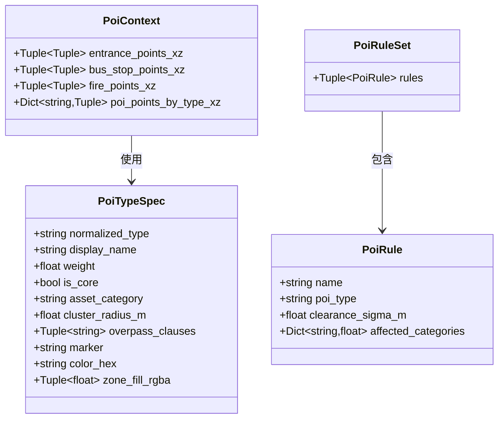
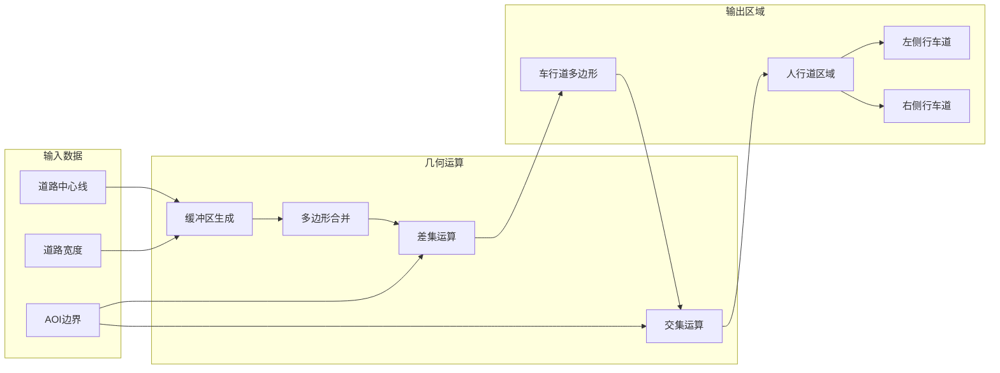
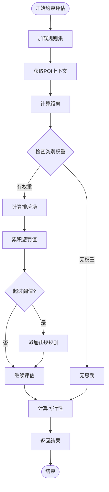
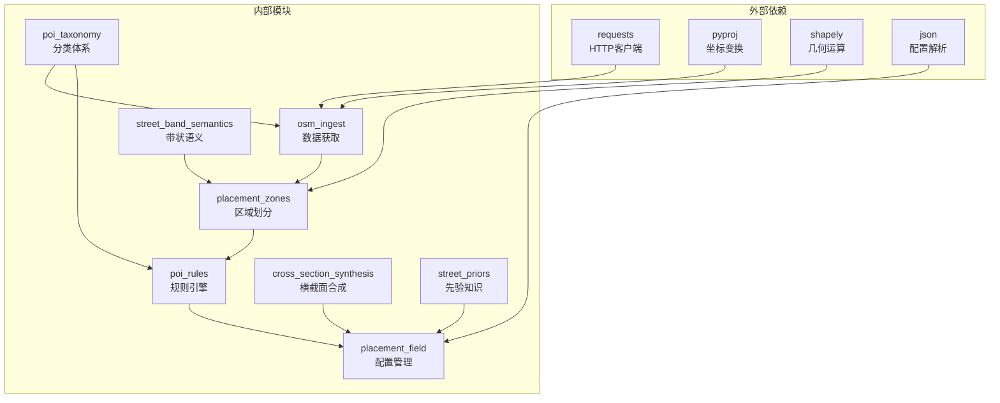

# M5 OSM 基础设施集成

<cite>
**本文档引用的文件**
- [osm_ingest.py](file://src/roadgen3d/osm_ingest.py)
- [placement_zones.py](file://src/roadgen3d/placement_zones.py)
- [poi_rules.py](file://src/roadgen3d/poi_rules.py)
- [poi_taxonomy.py](file://src/roadgen3d/poi_taxonomy.py)
- [placement_field.py](file://src/roadgen3d/placement_field.py)
- [cross_section_synthesis.py](file://src/roadgen3d/cross_section_synthesis.py)
- [street_band_semantics.py](file://src/roadgen3d/street_band_semantics.py)
- [street_priors.py](file://src/roadgen3d/street_priors.py)
- [m5_01_fetch_osm.py](file://scripts/m5_01_fetch_osm.py)
- [m5_02_build_placement_zones.py](file://scripts/m5_02_build_placement_zones.py)
- [placement_field_v1.json](file://src/roadgen3d/config/placement_field_v1.json)
- [test_m5_osm_ingest.py](file://tests/test_m5_osm_ingest.py)
- [test_m5_poi_rules.py](file://tests/test_m5_poi_rules.py)
- [test_placement_field.py](file://tests/test_placement_field.py)
</cite>

## 目录
1. [简介](#简介)
2. [项目结构](#项目结构)
3. [核心组件](#核心组件)
4. [架构概览](#架构概览)
5. [详细组件分析](#详细组件分析)
6. [依赖关系分析](#依赖关系分析)
7. [性能考虑](#性能考虑)
8. [故障排除指南](#故障排除指南)
9. [结论](#结论)

## 简介

M5 OSM基础设施集成管道是一个完整的开源地图数据处理系统，专门用于从OpenStreetMap (OSM) 获取基础设施数据，并将其转换为可直接用于城市规划和三维场景生成的结构化数据。该系统实现了从数据获取、解析、投影变换到区域划分和约束规则评估的完整工作流程。

本系统的核心目标是：
- **数据获取与缓存**：通过Overpass API高效获取OSM数据，支持本地缓存机制
- **多类型基础设施识别**：支持道路网络、建筑物、交通标志、公共设施等多类型POI
- **空间投影与坐标变换**：将WGS-84坐标系转换为本地UTM坐标系
- **区域划分算法**：基于道路几何构建人行道、车行道等放置区域
- **约束规则引擎**：实现POI间的相互作用和空间约束评估
- **场景适配策略**：支持不同城市规模和密度的场景生成

## 项目结构

M5 OSM基础设施集成管道采用模块化设计，主要包含以下核心模块：

**图表来源**
- [osm_ingest.py:1-331](file://src/roadgen3d/osm_ingest.py#L1-L331)
- [placement_zones.py:1-800](file://src/roadgen3d/placement_zones.py#L1-L800)
- [poi_rules.py:1-433](file://src/roadgen3d/poi_rules.py#L1-L433)

**章节来源**
- [osm_ingest.py:1-331](file://src/roadgen3d/osm_ingest.py#L1-L331)
- [placement_zones.py:1-800](file://src/roadgen3d/placement_zones.py#L1-L800)
- [poi_rules.py:1-433](file://src/roadgen3d/poi_rules.py#L1-L433)

## 核心组件

### OSM数据获取与解析模块

OSM数据获取模块负责从Overpass API获取数据、解析JSON响应并进行本地缓存。该模块支持多种道路类型和POI类型的查询，包括住宅路、次要道路、主要道路、服务道路、人行道等。

**章节来源**
- [osm_ingest.py:126-168](file://src/roadgen3d/osm_ingest.py#L126-L168)
- [osm_ingest.py:174-258](file://src/roadgen3d/osm_ingest.py#L174-L258)

### 区域划分算法模块

区域划分模块基于道路几何构建放置区域，包括车行道、人行道、左/右侧行车道等。该模块使用Shapely库进行几何运算，支持复杂的多边形操作和空间关系判断。

**章节来源**
- [placement_zones.py:84-137](file://src/roadgen3d/placement_zones.py#L84-L137)
- [placement_zones.py:166-213](file://src/roadgen3d/placement_zones.py#L166-L213)

### POI约束规则引擎

POI约束规则引擎实现了基于物理距离的排斥场计算，支持多种POI类型之间的相互作用。每个规则定义了特定的排斥半径和权重系数，用于评估候选位置的可行性。

**章节来源**
- [poi_rules.py:77-198](file://src/roadgen3d/poi_rules.py#L77-L198)
- [poi_rules.py:301-344](file://src/roadgen3d/poi_rules.py#L301-L344)

## 架构概览

M5 OSM基础设施集成管道采用分层架构设计，确保各组件的职责分离和高内聚低耦合。

**图表来源**
- [m5_01_fetch_osm.py:18-66](file://scripts/m5_01_fetch_osm.py#L18-L66)
- [m5_02_build_placement_zones.py:18-62](file://scripts/m5_02_build_placement_zones.py#L18-L62)

## 详细组件分析

### OSM数据获取流程

OSM数据获取流程实现了完整的数据生命周期管理，包括缓存策略、错误处理和重试机制。

**图表来源**
- [osm_ingest.py:126-168](file://src/roadgen3d/osm_ingest.py#L126-L168)

**章节来源**
- [osm_ingest.py:103-168](file://src/roadgen3d/osm_ingest.py#L103-L168)

### POI分类体系与规则系统

POI分类体系定义了完整的兴趣点类型规范，支持标准化的别名映射和权重计算。

**图表来源**
- [poi_taxonomy.py:36-48](file://src/roadgen3d/poi_taxonomy.py#L36-L48)
- [poi_rules.py:20-35](file://src/roadgen3d/poi_rules.py#L20-L35)

**章节来源**
- [poi_taxonomy.py:50-161](file://src/roadgen3d/poi_taxonomy.py#L50-L161)
- [poi_rules.py:77-198](file://src/roadgen3d/poi_rules.py#L77-L198)

### 区域划分算法与空间拓扑

区域划分算法基于道路中心线缓冲区生成车行道和人行道区域，支持复杂的几何运算和空间关系判断。

**图表来源**
- [placement_zones.py:84-137](file://src/roadgen3d/placement_zones.py#L84-L137)
- [placement_zones.py:166-213](file://src/roadgen3d/placement_zones.py#L166-L213)

**章节来源**
- [placement_zones.py:84-213](file://src/roadgen3d/placement_zones.py#L84-L213)

### 约束传播机制

约束传播机制实现了POI间的相互作用评估，通过排斥场函数计算候选位置的可行性分数。

**图表来源**
- [poi_rules.py:301-344](file://src/roadgen3d/poi_rules.py#L301-L344)

**章节来源**
- [poi_rules.py:242-344](file://src/roadgen3d/poi_rules.py#L242-L344)

## 依赖关系分析

M5 OSM基础设施集成管道的依赖关系体现了清晰的模块化设计和层次化架构。

**图表来源**
- [osm_ingest.py:1-331](file://src/roadgen3d/osm_ingest.py#L1-L331)
- [placement_zones.py:1-800](file://src/roadgen3d/placement_zones.py#L1-L800)
- [poi_rules.py:1-433](file://src/roadgen3d/poi_rules.py#L1-L433)

**章节来源**
- [osm_ingest.py:1-331](file://src/roadgen3d/osm_ingest.py#L1-L331)
- [placement_zones.py:1-800](file://src/roadgen3d/placement_zones.py#L1-L800)
- [poi_rules.py:1-433](file://src/roadgen3d/poi_rules.py#L1-L433)

## 性能考虑

### 缓存策略优化

系统实现了智能的缓存机制，通过MD5哈希生成缓存文件名，避免重复的网络请求。

### 空间索引优化

放置场模块使用均匀空间哈希（Uniform Spatial Hash）来优化邻域查询，减少全场景扫描的开销。

### 并行处理能力

系统支持多线程和异步处理模式，能够充分利用现代硬件的多核性能。

## 故障排除指南

### 常见问题诊断

**网络连接问题**：检查Overpass API的可用性和防火墙设置

**坐标投影错误**：验证输入坐标的WGS-84格式和UTM区号计算

**几何运算失败**：检查Shapely版本兼容性和几何有效性

**规则配置错误**：验证placement_field_v1.json的完整性和格式正确性

**章节来源**
- [test_m5_osm_ingest.py:267-287](file://tests/test_m5_osm_ingest.py#L267-L287)
- [test_m5_poi_rules.py:59-62](file://tests/test_m5_poi_rules.py#L59-L62)
- [test_placement_field.py:23-41](file://tests/test_placement_field.py#L23-L41)

## 结论

M5 OSM基础设施集成管道提供了一个完整、高效且可扩展的开源解决方案，用于处理OpenStreetMap数据并生成城市基础设施场景。该系统的主要优势包括：

1. **模块化设计**：清晰的职责分离使得系统易于维护和扩展
2. **高性能实现**：优化的缓存策略和空间索引提升了处理效率
3. **灵活的配置**：可定制的规则集和参数配置适应不同场景需求
4. **完善的测试**：全面的单元测试确保系统的稳定性和可靠性
5. **开放的架构**：基于标准协议和开源库，便于集成和二次开发

该系统为城市规划、智能交通和三维场景生成提供了坚实的技术基础，支持从小型社区到大型城市的多样化应用场景。