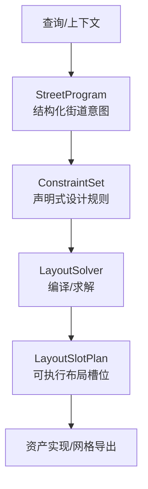
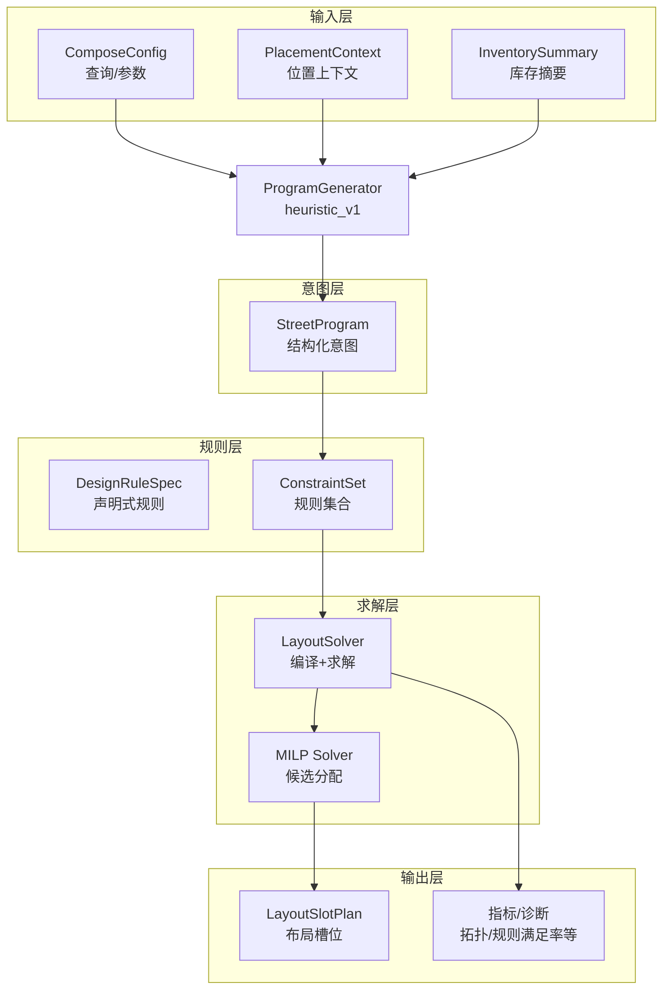
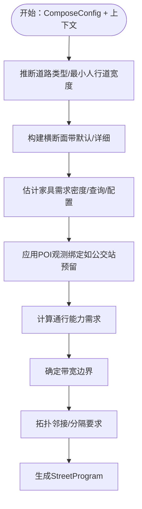
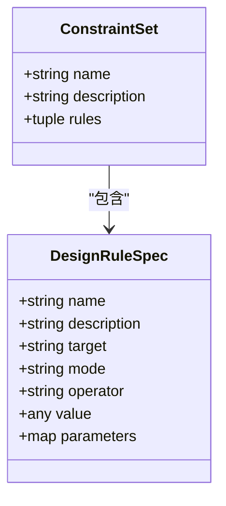
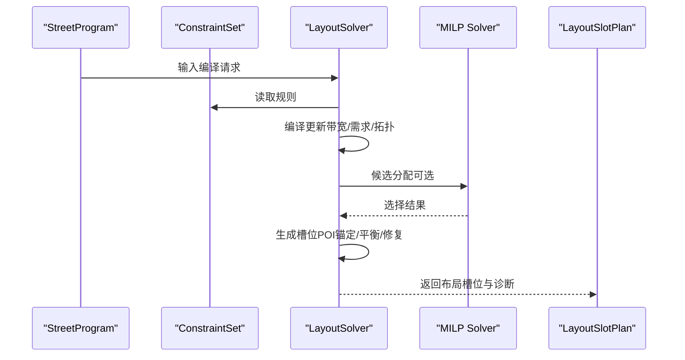
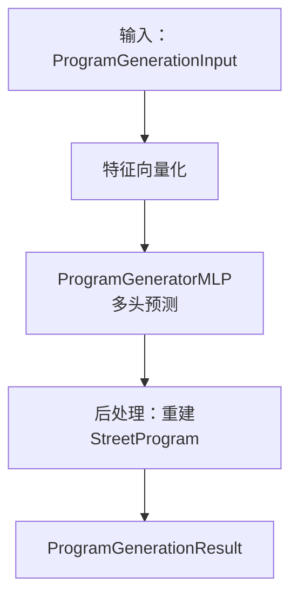
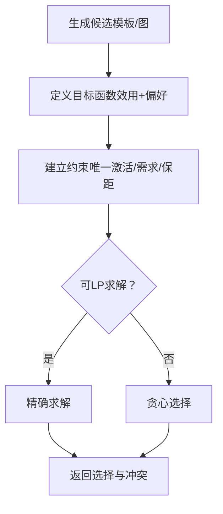
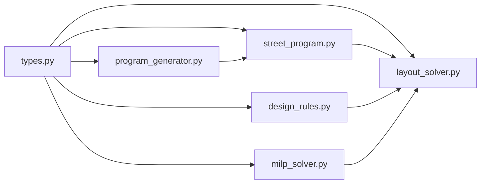

# M6 神经符号管道

<cite>
**本文档引用的文件**
- [street_program.py](file://src/roadgen3d/street_program.py)
- [design_rules.py](file://src/roadgen3d/design_rules.py)
- [milp_solver.py](file://src/roadgen3d/milp_solver.py)
- [program_generator.py](file://src/roadgen3d/program_generator.py)
- [layout_solver.py](file://src/roadgen3d/layout_solver.py)
- [types.py](file://src/roadgen3d/types.py)
- [m6_neurosymbolic_street_generation.md](file://docs/m6_neurosymbolic_street_generation.md)
</cite>

## 目录
1. [引言](#引言)
2. [项目结构](#项目结构)
3. [核心组件](#核心组件)
4. [架构总览](#架构总览)
5. [详细组件分析](#详细组件分析)
6. [依赖关系分析](#依赖关系分析)
7. [性能考虑](#性能考虑)
8. [故障排除指南](#故障排除指南)
9. [结论](#结论)
10. [附录](#附录)

## 引言
本文件系统化阐述M6神经符号街道生成管道，聚焦以下目标：
- 解释StreetProgram的设计理念与神经符号混合建模优势
- 说明设计规则（design_rules）中几何约束、空间关系与设计规范的数学表示
- 描述milp_solver的混合整数线性规划求解算法、优化目标与约束处理机制
- 展示program_generator的程序生成流程、中间表示转换与可执行布局导出方法
- 提供不同设计场景下的求解效率分析与精度验证要点

## 项目结构
M6将传统“查询直接到铺排”的流程重构为“查询/上下文 -> StreetProgram -> 约束集 -> 布局求解器 -> 资产实现 -> 网格导出”的显式、可编辑、可测试的流水线。该结构使街道形态与设计规则分离，便于迭代与解释。

图示来源
- [m6_neurosymbolic_street_generation.md:7-14](file://docs/m6_neurosymbolic_street_generation.md#L7-L14)

章节来源
- [m6_neurosymbolic_street_generation.md:1-60](file://docs/m6_neurosymbolic_street_generation.md#L1-L60)

## 核心组件
- StreetProgram：承载道路类型、横断面、功能带、家具需求、控制点与设计目标等结构化意图
- DesignRuleSpec/ConstraintSet：声明式硬/软约束，覆盖带宽、通行能力、拓扑邻接/分隔、类别分配与保留等
- LayoutSolver：在规则与库存约束下，从StreetProgram推导可行布局槽位计划
- ProgramGenerator：将文本与上下文映射为StreetProgram（当前heuristic_v1，未来可训练）
- MILP Solver：候选分配的离散优化（可选路径），结合优先级与目标偏好

章节来源
- [types.py:140-184](file://src/roadgen3d/types.py#L140-L184)
- [types.py:187-220](file://src/roadgen3d/types.py#L187-L220)
- [layout_solver.py:1526-1557](file://src/roadgen3d/layout_solver.py#L1526-L1557)
- [program_generator.py:404-488](file://src/roadgen3d/program_generator.py#L404-L488)
- [milp_solver.py:280-336](file://src/roadgen3d/milp_solver.py#L280-L336)

## 架构总览
M6采用“意图-规则-求解-实现”的四层架构，强调可解释性与可编辑性：

图示来源
- [program_generator.py:404-488](file://src/roadgen3d/program_generator.py#L404-L488)
- [layout_solver.py:1526-1557](file://src/roadgen3d/layout_solver.py#L1526-L1557)
- [milp_solver.py:280-336](file://src/roadgen3d/milp_solver.py#L280-L336)
- [types.py:47-120](file://src/roadgen3d/types.py#L47-L120)

## 详细组件分析

### StreetProgram 设计理念与生成
- 结构化意图：包含道路类型、横断面类型、车道数、带宽、家具需求、控制点、设计目标、拓扑要求、带宽边界等
- 推理生成：基于查询、密度、可用类别、POI观测、放置上下文，构建跨段带、需求估计、拓扑约束与目标权重
- 可扩展性：支持详细侧带配置（来自放置上下文）与默认平衡配置

图示来源
- [street_program.py:502-625](file://src/roadgen3d/street_program.py#L502-L625)

章节来源
- [street_program.py:1-626](file://src/roadgen3d/street_program.py#L1-L626)
- [types.py:122-184](file://src/roadgen3d/types.py#L122-L184)

### 设计规则：几何约束、空间关系与设计规范的数学表示
- 规则类型与操作符
  - 数值约束：带宽上下界（band_min_width/band_max_width）、总行宽预算（total_row_width_budget）、通行能力阈值（mode_throughput_min）
  - 拓扑约束：邻接（adjacency_required）、分隔（separation_required）
  - 分配约束：类别允许带（category_allowed_band）、保留带类别（reserved_band_category）、最小/最大槽位数（slot_count_min/max）
  - 库存与替换：必需类别可用（required_category_available）、替代策略
  - 几何保护：保持半径（keepout_radius）
- 硬/软模式：硬约束触发冲突，软约束影响目标与评分
- 参数化：通过parameters指定目标带名/种类、类别、半径、模式等

图示来源
- [types.py:187-220](file://src/roadgen3d/types.py#L187-L220)
- [design_rules.py:9-435](file://src/roadgen3d/design_rules.py#L9-L435)

章节来源
- [design_rules.py:1-436](file://src/roadgen3d/design_rules.py#L1-L436)
- [types.py:187-220](file://src/roadgen3d/types.py#L187-L220)

### 布局求解器：从规则到布局槽位
- 编译阶段
  - 将规则转化为对StreetProgram的更新：调整带宽、车道数、家具需求；应用类别允许/保留；记录编辑与冲突
  - 计算通行能力需求与总体行宽预算，评估可行性
- 带宽求解
  - 若可获得线性规划求解器，则以带宽为目标进行最大化，同时满足预算与对称性约束；否则退化为贪心扩展策略
- 槽位生成
  - 基于允许带与类别偏好，按左右交替或平衡策略生成槽位；优先锚定POI点；修复双边家具不平衡；富化核心家具混搭
- 规则评估与质量度量
  - 对每条规则计算满足状态、得分与解释；汇总拓扑有效性、横断面可行性、规则满足率、可编辑性与可解释性

图示来源
- [layout_solver.py:1526-1557](file://src/roadgen3d/layout_solver.py#L1526-L1557)
- [milp_solver.py:280-336](file://src/roadgen3d/milp_solver.py#L280-L336)

章节来源
- [layout_solver.py:368-846](file://src/roadgen3d/layout_solver.py#L368-L846)
- [layout_solver.py:849-1298](file://src/roadgen3d/layout_solver.py#L849-L1298)
- [layout_solver.py:1300-1557](file://src/roadgen3d/layout_solver.py#L1300-L1557)

### 程序生成器：从文本到StreetProgram的中间表示与导出
- 特征向量化：将查询、城市上下文、目标街型、密度、可用类别、库存摘要、图摘要、空间统计等映射为固定维度特征
- 目标预测：多头输出预测道路类型、横断面、车道数、带宽、类别数量、右侧保留类别、目标权重
- 后处理：根据预测重建带中心、合并POI观测、更新控制点与目标权重
- 运行时：支持heuristic_v1与learned_v1（需PyTorch），自动降级与兼容性检查
- 导出：生成ProgramGenerationResult，包含后端使用信息与回退原因

图示来源
- [program_generator.py:76-124](file://src/roadgen3d/program_generator.py#L76-L124)
- [program_generator.py:163-177](file://src/roadgen3d/program_generator.py#L163-L177)
- [program_generator.py:233-356](file://src/roadgen3d/program_generator.py#L233-L356)
- [program_generator.py:404-488](file://src/roadgen3d/program_generator.py#L404-L488)

章节来源
- [program_generator.py:1-663](file://src/roadgen3d/program_generator.py#L1-L663)
- [types.py:240-278](file://src/roadgen3d/types.py#L240-L278)

### MILP 求解器：离散候选分配与目标偏好
- 候选生成：模板场景按长度分段，OSM图节点作为候选；每个候选包含带名、侧、中心坐标、间距、允许类别、优先级
- 目标函数：候选效用（优先级、邻近POI、必要性）+ 目标偏好（绿意/商业/交通）加权
- 约束处理：每个候选最多激活一次；按类别设置硬/软需求；可选保距（keepout）规则
- 求解策略：若可用线性规划求解器则精确求解，否则退化为贪心选择；空解时返回冲突

图示来源
- [milp_solver.py:31-74](file://src/roadgen3d/milp_solver.py#L31-L74)
- [milp_solver.py:186-277](file://src/roadgen3d/milp_solver.py#L186-L277)
- [milp_solver.py:280-336](file://src/roadgen3d/milp_solver.py#L280-L336)

章节来源
- [milp_solver.py:1-337](file://src/roadgen3d/milp_solver.py#L1-L337)

## 依赖关系分析
- 组件耦合
  - StreetProgram依赖类型系统（StreetBand、StreetProgram等）
  - LayoutSolver依赖DesignRuleSpec/ConstraintSet、StreetProgram、MILP Solver
  - ProgramGenerator依赖StreetProgram推理与类型系统
  - MILP Solver独立但被LayoutSolver调用
- 外部依赖
  - 线性规划求解器（可选）用于带宽优化与候选分配
  - PyTorch（可选）用于学习式程序生成

图示来源
- [types.py:1-120](file://src/roadgen3d/types.py#L1-L120)
- [street_program.py:1-30](file://src/roadgen3d/street_program.py#L1-L30)
- [design_rules.py:1-10](file://src/roadgen3d/design_rules.py#L1-L10)
- [layout_solver.py:1-40](file://src/roadgen3d/layout_solver.py#L1-L40)
- [program_generator.py:1-30](file://src/roadgen3d/program_generator.py#L1-L30)
- [milp_solver.py:1-15](file://src/roadgen3d/milp_solver.py#L1-L15)

章节来源
- [types.py:1-1095](file://src/roadgen3d/types.py#L1-L1095)

## 性能考虑
- 程序生成
  - 特征维度固定且向量化成本低；学习式生成需GPU/TPU加速，CPU仅支持启发式
  - 训练过程包含损失分解与早停策略，建议合理批大小与学习率
- 布局求解
  - 带宽求解在有线性规划时更优，无求解器时退化为贪心，仍保证可行性
  - 槽位生成复杂度与类别数量、带数、POI锚定点成正比
- MILP 候选分配
  - 候选规模随长度分段与带数增长；可通过合理分段长度与带宽边界限制规模
  - 保距规则增加距离计算开销，建议预聚类POI

## 故障排除指南
- 程序生成回退
  - 缺少PyTorch或检查点不匹配时自动回退至启发式；关注回退原因字段
- 布局冲突
  - 硬约束不满足会生成冲突；检查规则名称、受影响目标与解释
  - 通行能力不足或行宽预算超支时，带宽求解器会记录状态与建议
- MILP 状态异常
  - 求解状态非最优/可行时返回冲突；可尝试放宽约束或调整目标偏好
- 输出诊断
  - 使用规则评估、拓扑有效性、横断面可行性、规则满足率、可编辑性与可解释性等指标定位问题

章节来源
- [program_generator.py:431-488](file://src/roadgen3d/program_generator.py#L431-L488)
- [layout_solver.py:427-479](file://src/roadgen3d/layout_solver.py#L427-L479)
- [milp_solver.py:260-270](file://src/roadgen3d/milp_solver.py#L260-L270)

## 结论
M6神经符号管道通过“意图-规则-求解-实现”的清晰分层，实现了街道设计的显式化、可编辑与可解释。StreetProgram承载结构化意图，DesignRuleSpec提供形式化约束，LayoutSolver在规则与库存之间寻找可行布局，ProgramGenerator将文本映射为结构化意图，MILP Solver提供离散优化能力。该体系为后续引入学习式生成与更复杂的布局模型奠定了坚实基础。

## 附录
- 关键数据类型参考
  - StreetProgram、StreetBand、ConstraintSet、DesignRuleSpec、LayoutSlotPlan、LayoutSolverResult等
- 规则示例
  - 平衡、行人优先、公交优先、噪声敏感等配置文件中定义的规则集合

章节来源
- [types.py:122-433](file://src/roadgen3d/types.py#L122-L433)
- [design_rules.py:386-435](file://src/roadgen3d/design_rules.py#L386-L435)