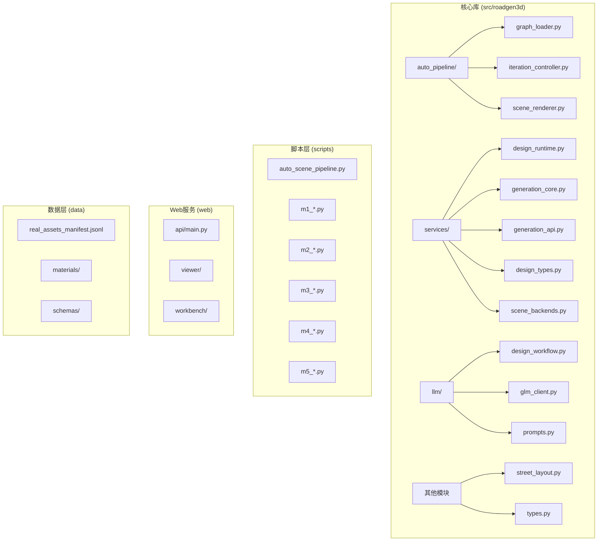
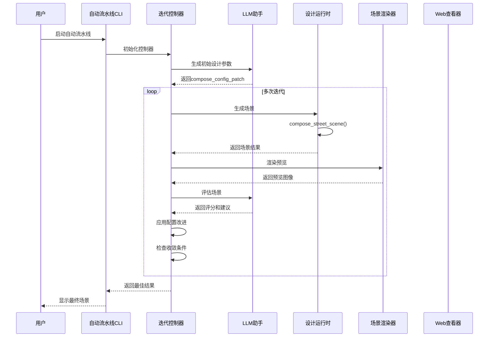
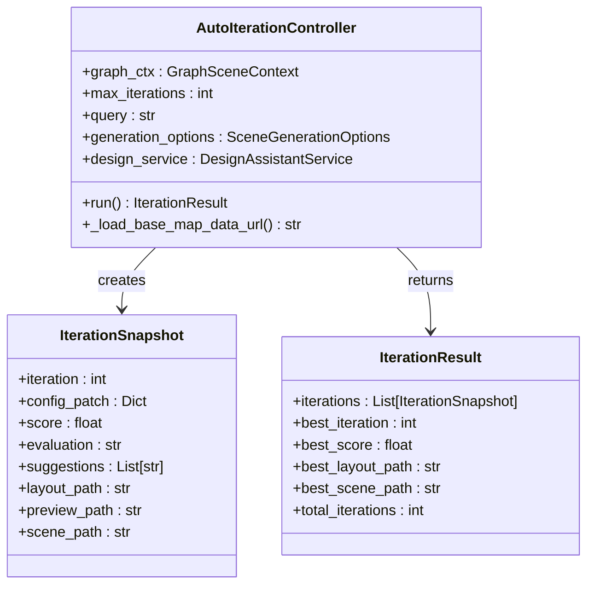
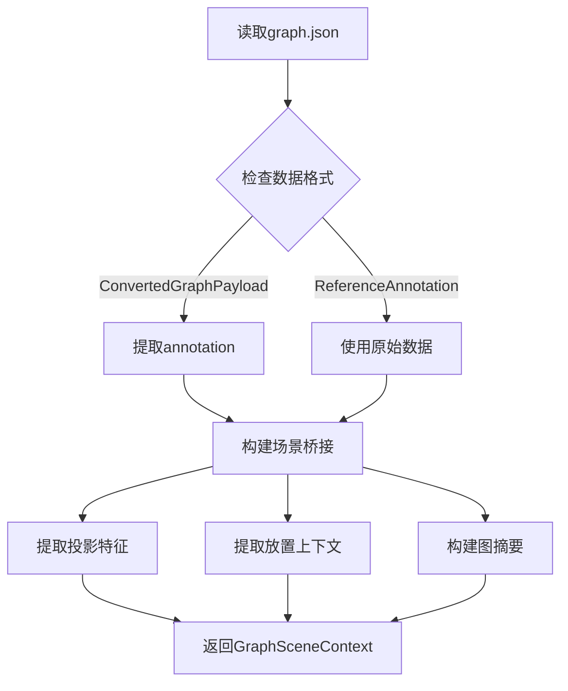
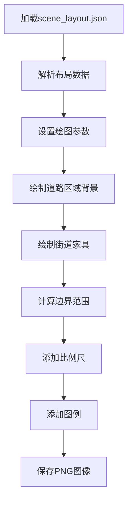
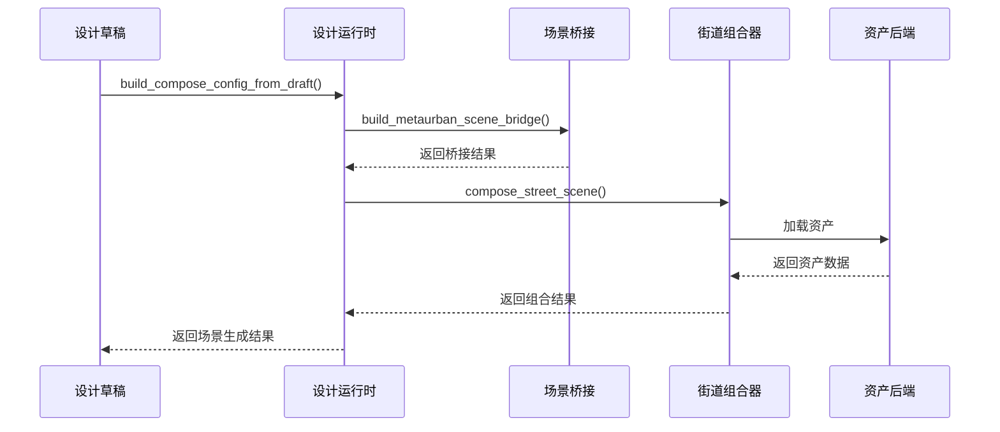
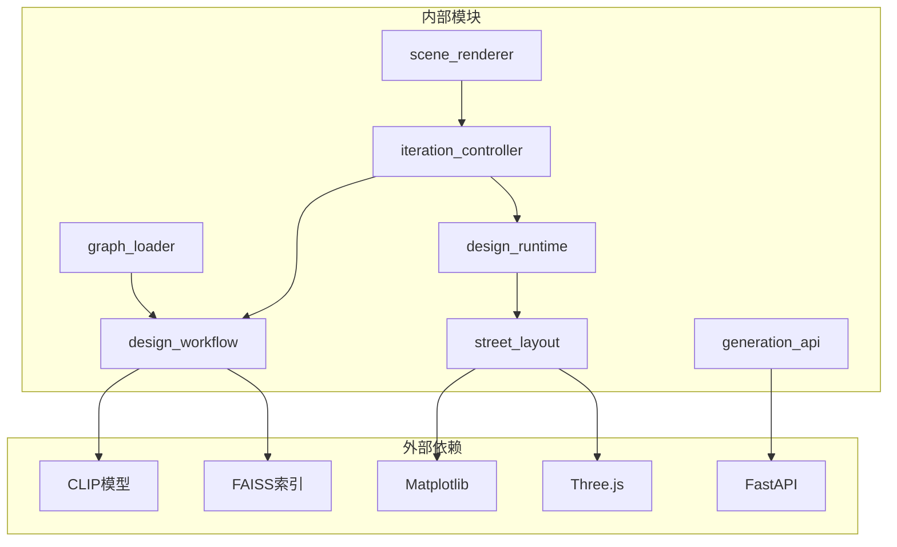

# 自动场景生成流水线

<cite>
**本文档引用的文件**
- [README.md](file://README.md)
- [README_M1.md](file://README_M1.md)
- [scripts/auto_scene_pipeline.py](file://scripts/auto_scene_pipeline.py)
- [src/roadgen3d/auto_pipeline/iteration_controller.py](file://src/roadgen3d/auto_pipeline/iteration_controller.py)
- [src/roadgen3d/auto_pipeline/graph_loader.py](file://src/roadgen3d/auto_pipeline/graph_loader.py)
- [src/roadgen3d/auto_pipeline/scene_renderer.py](file://src/roadgen3d/auto_pipeline/scene_renderer.py)
- [src/roadgen3d/services/design_runtime.py](file://src/roadgen3d/services/design_runtime.py)
- [src/roadgen3d/services/generation_core.py](file://src/roadgen3d/services/generation_core.py)
- [src/roadgen3d/services/generation_api.py](file://src/roadgen3d/services/generation_api.py)
- [src/roadgen3d/llm/design_workflow.py](file://src/roadgen3d/llm/design_workflow.py)
- [src/roadgen3d/street_layout.py](file://src/roadgen3d/street_layout.py)
- [src/roadgen3d/types.py](file://src/roadgen3d/types.py)
- [src/roadgen3d/services/design_types.py](file://src/roadgen3d/services/design_types.py)
- [src/roadgen3d/services/scene_backends.py](file://src/roadgen3d/services/scene_backends.py)
</cite>

## 目录
1. [项目概述](#项目概述)
2. [项目结构](#项目结构)
3. [核心组件](#核心组件)
4. [架构总览](#架构总览)
5. [详细组件分析](#详细组件分析)
6. [依赖关系分析](#依赖关系分析)
7. [性能考虑](#性能考虑)
8. [故障排除指南](#故障排除指南)
9. [结论](#结论)

## 项目概述

RoadGen3D 是一个神经符号系统，能够将文本描述转换为详细的3D城市街道场景。该项目的核心能力包括：

- **文本到3D场景生成**：从自然语言查询生成完整的3D街道场景
- **自动场景生成流水线**：基于Viewer导出的路网图进行自动迭代优化
- **多阶段生成流程**：检索 → 组合 → 渲染预览 → LLM评估 → 改进
- **工程化流水线**：支持离线模式和在线模式的灵活部署

该系统采用模块化设计，通过清晰的接口和数据流实现端到端的场景生成。

## 项目结构

**图表来源**
- [README.md:191-220](file://README.md#L191-L220)
- [scripts/auto_scene_pipeline.py:1-136](file://scripts/auto_scene_pipeline.py#L1-L136)

**章节来源**
- [README.md:191-220](file://README.md#L191-L220)
- [README.md:222-271](file://README.md#L222-L271)

## 核心组件

### 自动流水线控制器
AutoIterationController负责协调整个自动场景生成循环，包括：
- LLM初始设计参数生成
- 场景渲染预览
- LLM评估和改进建议
- 迭代控制和收敛判断

### 图形加载器
GraphSceneContext负责解析Viewer导出的图形JSON，提取路网信息、投影特征和放置上下文。

### 场景渲染器
提供matplotlib驱动的顶视图预览渲染，支持道路区域背景、街道家具标记和比例尺显示。

### 设计运行时
封装了从设计草稿到最终场景生成的完整流程，包括配置构建、场景生成和结果处理。

**章节来源**
- [src/roadgen3d/auto_pipeline/iteration_controller.py:48-263](file://src/roadgen3d/auto_pipeline/iteration_controller.py#L48-L263)
- [src/roadgen3d/auto_pipeline/graph_loader.py:31-167](file://src/roadgen3d/auto_pipeline/graph_loader.py#L31-L167)
- [src/roadgen3d/auto_pipeline/scene_renderer.py:49-214](file://src/roadgen3d/auto_pipeline/scene_renderer.py#L49-L214)
- [src/roadgen3d/services/design_runtime.py:399-460](file://src/roadgen3d/services/design_runtime.py#L399-L460)

## 架构总览

**图表来源**
- [scripts/auto_scene_pipeline.py:88-136](file://scripts/auto_scene_pipeline.py#L88-L136)
- [src/roadgen3d/auto_pipeline/iteration_controller.py:89-225](file://src/roadgen3d/auto_pipeline/iteration_controller.py#L89-L225)
- [src/roadgen3d/llm/design_workflow.py:311-383](file://src/roadgen3d/llm/design_workflow.py#L311-L383)

## 详细组件分析

### 自动迭代控制器

AutoIterationController实现了完整的生成-评估-改进循环：

**图表来源**
- [src/roadgen3d/auto_pipeline/iteration_controller.py:48-263](file://src/roadgen3d/auto_pipeline/iteration_controller.py#L48-L263)

### 图形加载器

GraphSceneContext负责将Viewer导出的图形数据转换为场景生成所需的上下文：

**图表来源**
- [src/roadgen3d/auto_pipeline/graph_loader.py:31-167](file://src/roadgen3d/auto_pipeline/graph_loader.py#L31-L167)

### 场景渲染器

顶视图渲染器提供了直观的场景预览功能：

**图表来源**
- [src/roadgen3d/auto_pipeline/scene_renderer.py:49-128](file://src/roadgen3d/auto_pipeline/scene_renderer.py#L49-L128)

### 设计运行时

设计运行时封装了从草稿到场景的完整转换过程：

**图表来源**
- [src/roadgen3d/services/design_runtime.py:336-396](file://src/roadgen3d/services/design_runtime.py#L336-L396)

**章节来源**
- [src/roadgen3d/auto_pipeline/iteration_controller.py:89-225](file://src/roadgen3d/auto_pipeline/iteration_controller.py#L89-L225)
- [src/roadgen3d/auto_pipeline/graph_loader.py:31-167](file://src/roadgen3d/auto_pipeline/graph_loader.py#L31-L167)
- [src/roadgen3d/auto_pipeline/scene_renderer.py:49-128](file://src/roadgen3d/auto_pipeline/scene_renderer.py#L49-L128)
- [src/roadgen3d/services/design_runtime.py:336-396](file://src/roadgen3d/services/design_runtime.py#L336-L396)

## 依赖关系分析

**图表来源**
- [src/roadgen3d/auto_pipeline/iteration_controller.py:12-19](file://src/roadgen3d/auto_pipeline/iteration_controller.py#L12-L19)
- [src/roadgen3d/services/design_runtime.py:11-34](file://src/roadgen3d/services/design_runtime.py#L11-L34)
- [src/roadgen3d/services/generation_api.py:14-25](file://src/roadgen3d/services/generation_api.py#L14-L25)

系统的关键依赖包括：
- **CLIP文本编码器**：用于查询嵌入和检索
- **FAISS向量索引**：支持大规模资产检索
- **Matplotlib**：提供2D渲染功能
- **FastAPI**：提供RESTful API服务
- **Three.js**：Web场景查看器

**章节来源**
- [src/roadgen3d/services/scene_backends.py:11-14](file://src/roadgen3d/services/scene_backends.py#L11-L14)
- [src/roadgen3d/services/generation_api.py:14-25](file://src/roadgen3d/services/generation_api.py#L14-L25)

## 性能考虑

### 计算优化
- **温度参数调优**：使用0.12的softmax温度参数平衡探索与利用
- **早期停止机制**：连续两轮无改进时提前终止
- **缓存策略**：LLM设计草稿缓存减少重复计算

### 内存管理
- **渐进式输出**：每轮迭代独立输出，避免内存累积
- **资源清理**：及时关闭matplotlib图形句柄
- **路径解析**：统一的绝对路径解析避免重复计算

### 并发处理
- **异步作业队列**：Web API支持后台任务执行
- **批处理优化**：FAISS检索支持批量查询
- **GPU加速**：可选的CUDA设备支持

## 故障排除指南

### 常见问题及解决方案

**1. LLM相关错误**
- 检查环境变量配置（API密钥、基础URL）
- 验证网络连接和代理设置
- 确认模型可用性和版本兼容性

**2. 资产检索失败**
- 验证FAISS索引文件完整性
- 检查资产清单文件格式
- 确认CLIP模型文件存在且可访问

**3. 场景生成异常**
- 检查输入参数的有效性范围
- 验证资产文件路径正确性
- 确认渲染依赖库安装完整

**4. Web服务启动失败**
- 检查端口占用情况
- 验证依赖包安装状态
- 确认静态资源路径配置

**章节来源**
- [src/roadgen3d/llm/design_workflow.py:385-388](file://src/roadgen3d/llm/design_workflow.py#L385-L388)
- [src/roadgen3d/services/design_runtime.py:399-460](file://src/roadgen3d/services/design_runtime.py#L399-L460)

## 结论

RoadGen3D的自动场景生成流水线展现了现代AI驱动的3D内容生成系统的完整架构。该系统通过以下关键特性实现了高效的自动化场景生成：

### 技术优势
- **模块化设计**：清晰的组件分离便于维护和扩展
- **迭代优化**：基于LLM反馈的自适应改进机制
- **工程化实践**：完整的错误处理和性能优化
- **多平台支持**：CLI、Web API和可视化界面

### 应用价值
- **设计效率提升**：大幅缩短从概念到可视化的周期
- **质量保证**：系统化的评估和改进流程
- **成本控制**：离线模式支持本地部署
- **可扩展性**：模块化架构支持功能扩展

### 发展方向
- **算法优化**：引入更先进的布局策略和设计规则
- **性能提升**：GPU加速和分布式计算支持
- **用户体验**：增强交互式编辑和实时预览功能
- **生态集成**：与其他设计工具和工作流的深度集成

该流水线为城市规划、景观设计和游戏开发等领域提供了强大的技术支持，是AI驱动内容生成技术的重要实践案例。