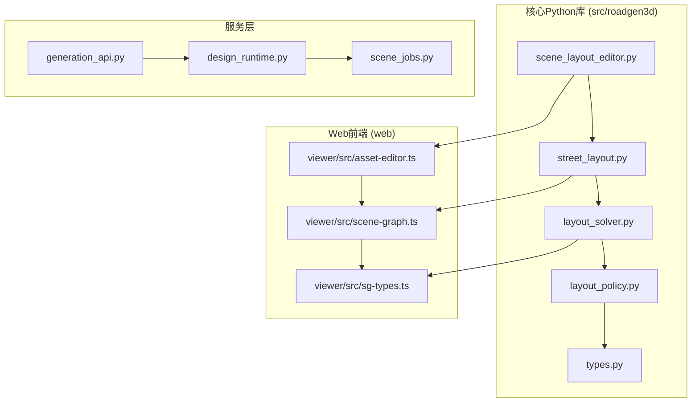
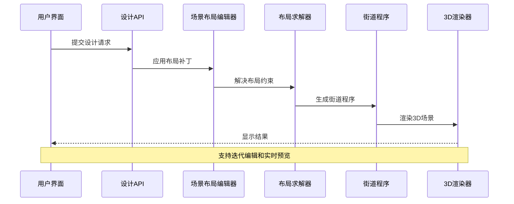
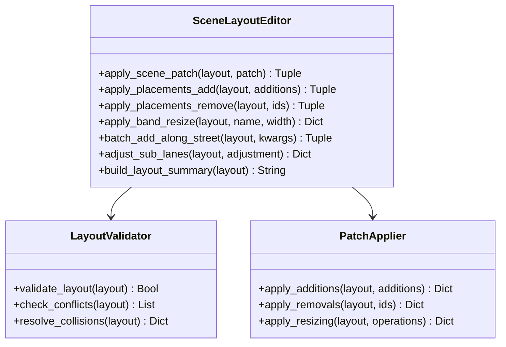
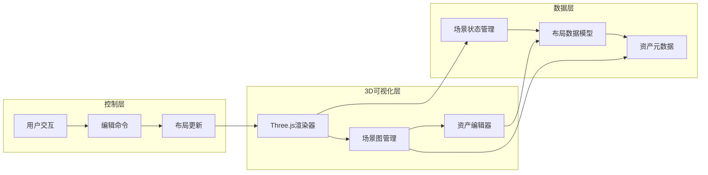
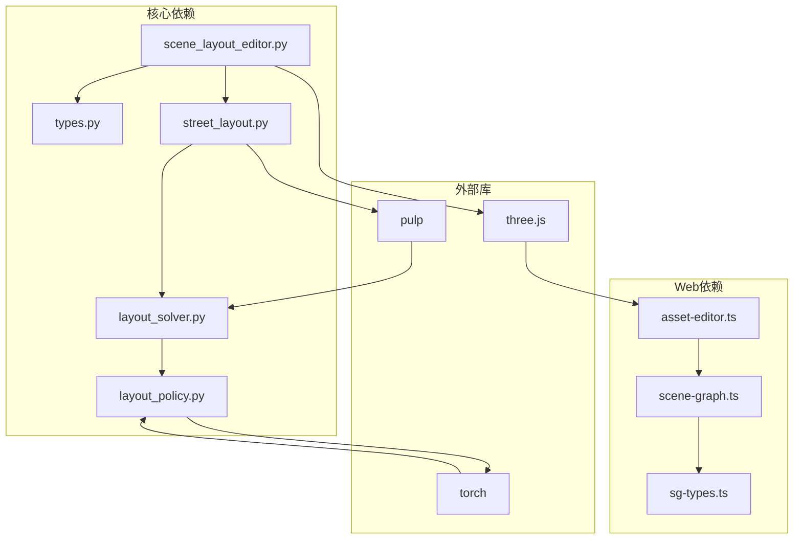

# 场景布局编辑器

<cite>
**本文档引用的文件**
- [scene_layout_editor.py](file://src/roadgen3d/scene_layout_editor.py)
- [street_layout.py](file://src/roadgen3d/street_layout.py)
- [layout_solver.py](file://src/roadgen3d/layout_solver.py)
- [layout_policy.py](file://src/roadgen3d/layout_policy.py)
- [asset-editor.ts](file://web/viewer/src/asset-editor.ts)
- [scene-graph.ts](file://web/viewer/src/scene-graph.ts)
- [sg-types.ts](file://web/viewer/src/sg-types.ts)
- [types.py](file://src/roadgen3d/types.py)
- [readme.md](file://readme.md)
</cite>

## 目录
1. [简介](#简介)
2. [项目结构](#项目结构)
3. [核心组件](#核心组件)
4. [架构概览](#架构概览)
5. [详细组件分析](#详细组件分析)
6. [依赖关系分析](#依赖关系分析)
7. [性能考虑](#性能考虑)
8. [故障排除指南](#故障排除指南)
9. [结论](#结论)

## 简介

场景布局编辑器是RoadGen3D系统中的关键组件，负责将文本描述转换为详细的3D城市街道场景。该系统采用神经符号方法，通过设计知识检索、参数化街道布局生成和资产选择等步骤，最终输出可交互的3D场景。

系统支持四种布局模式：
- **图模板** - 预定义的街道图（如香港科技大学广州校区入口）
- **OSM** - 从OpenStreetMap提取的真实街道
- **MetaUrban** - 基于街区的参考计划
- **模板** - 简单的参数化直线街道

## 项目结构

RoadGen3D项目采用模块化架构，主要包含以下核心目录：

**图表来源**
- [scene_layout_editor.py:1-390](file://src/roadgen3d/scene_layout_editor.py#L1-L390)
- [street_layout.py:1-800](file://src/roadgen3d/street_layout.py#L1-L800)
- [asset-editor.ts:1-800](file://web/viewer/src/asset-editor.ts#L1-L800)

**章节来源**
- [readme.md:67-106](file://readme.md#L67-L106)

## 核心组件

### 场景布局编辑器核心功能

场景布局编辑器提供了完整的JSON补丁操作来修改场景布局，包括：

1. **布局补丁应用** - 支持添加、删除和修改场景元素
2. **带宽调整** - 动态调整街道各功能带的宽度
3. **批量添加** - 沿街道批量添加资产实例
4. **子车道调整** - 调整车道数量和车道路线

### 街道布局生成器

街道布局生成器负责将设计意图转换为具体的布局方案：

- **配置验证** - 确保所有参数符合约束条件
- **网格缓存加载** - 加载和缓存3D网格资源
- **碰撞检测** - 防止资产之间的相互穿透
- **美学评估** - 计算场景的整体美观度评分

### 布局求解器

布局求解器使用混合方法解决复杂的布局优化问题：

- **带宽优化** - 使用线性规划优化各功能带的宽度分配
- **冲突检测** - 识别和解决布局冲突
- **规则评估** - 评估设计规则的满足程度

**章节来源**
- [scene_layout_editor.py:10-57](file://src/roadgen3d/scene_layout_editor.py#L10-L57)
- [street_layout.py:493-612](file://src/roadgen3d/street_layout.py#L493-L612)
- [layout_solver.py:402-540](file://src/roadgen3d/layout_solver.py#L402-L540)

## 架构概览

系统采用分层架构，从底层的几何计算到顶层的用户界面：

**图表来源**
- [scene_layout_editor.py:10-57](file://src/roadgen3d/scene_layout_editor.py#L10-L57)
- [layout_solver.py:746-800](file://src/roadgen3d/layout_solver.py#L746-L800)
- [street_layout.py:1-800](file://src/roadgen3d/street_layout.py#L1-L800)

## 详细组件分析

### 场景布局编辑器类图

**图表来源**
- [scene_layout_editor.py:10-390](file://src/roadgen3d/scene_layout_editor.py#L10-L390)

### 布局求解器流程图

**图表来源**
- [layout_solver.py:402-540](file://src/roadgen3d/layout_solver.py#L402-L540)

### Web前端集成架构

**图表来源**
- [asset-editor.ts:1-800](file://web/viewer/src/asset-editor.ts#L1-L800)
- [scene-graph.ts:1-800](file://web/viewer/src/scene-graph.ts#L1-L800)

**章节来源**
- [asset-editor.ts:1-800](file://web/viewer/src/asset-editor.ts#L1-L800)
- [scene-graph.ts:1-800](file://web/viewer/src/scene-graph.ts#L1-L800)
- [sg-types.ts:1-435](file://web/viewer/src/sg-types.ts#L1-L435)

## 依赖关系分析

### 核心依赖关系

**图表来源**
- [scene_layout_editor.py:1-390](file://src/roadgen3d/scene_layout_editor.py#L1-L390)
- [layout_policy.py:1-309](file://src/roadgen3d/layout_policy.py#L1-L309)

### 数据流依赖

系统中的数据流遵循严格的依赖链：

1. **输入数据** → **场景布局编辑器** → **布局求解器** → **3D渲染器**
2. **用户交互** → **Web前端** → **场景状态管理** → **布局更新**
3. **设计规则** → **约束集** → **布局验证** → **冲突解决**

**章节来源**
- [types.py:46-200](file://src/roadgen3d/types.py#L46-L200)
- [layout_solver.py:1-800](file://src/roadgen3d/layout_solver.py#L1-L800)

## 性能考虑

### 内存优化策略

1. **网格缓存机制** - 使用缓存避免重复加载3D网格
2. **增量更新** - 只更新发生变化的场景部分
3. **对象池** - 复用频繁创建的对象实例

### 并行处理

- **多线程渲染** - 利用Web Workers进行后台渲染
- **异步资产加载** - 避免阻塞主线程
- **批处理操作** - 将多个小操作合并为批处理

### 缓存策略

- **场景状态缓存** - 缓存复杂的布局计算结果
- **纹理和材质缓存** - 减少GPU内存占用
- **网络请求缓存** - 避免重复的API调用

## 故障排除指南

### 常见问题及解决方案

1. **布局冲突**
   - 检查设计规则配置
   - 验证资产尺寸和位置
   - 调整带宽分配

2. **性能问题**
   - 减少场景中资产数量
   - 降低渲染质量设置
   - 清理不必要的历史数据

3. **渲染错误**
   - 检查3D模型文件完整性
   - 验证材质和纹理路径
   - 更新图形驱动程序

### 调试工具

- **布局验证器** - 检测和报告布局问题
- **冲突分析器** - 识别潜在的碰撞和重叠
- **性能监控器** - 实时跟踪系统性能指标

**章节来源**
- [layout_solver.py:427-436](file://src/roadgen3d/layout_solver.py#L427-L436)
- [street_layout.py:614-618](file://src/roadgen3d/street_layout.py#L614-L618)

## 结论

场景布局编辑器作为RoadGen3D系统的核心组件，成功地将抽象的设计意图转化为具体的3D场景。通过模块化的架构设计、高效的算法实现和直观的用户界面，该系统为城市街道设计提供了强大的技术支持。

系统的创新之处在于：
- **神经符号方法** - 结合了符号推理和机器学习的优势
- **交互式编辑** - 支持实时的场景修改和预览
- **多模式支持** - 兼容多种布局生成方式
- **可扩展架构** - 为未来的功能扩展预留了空间

随着技术的不断发展，场景布局编辑器将继续演进，为用户提供更加智能和高效的街道设计体验。