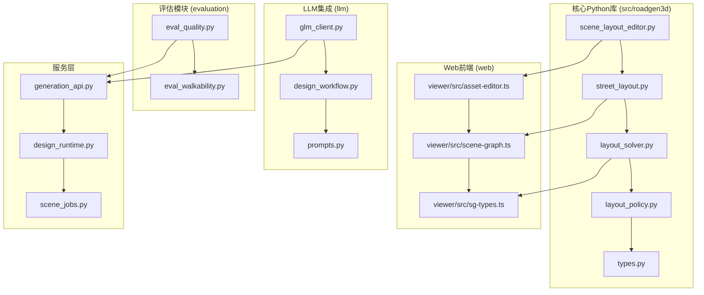
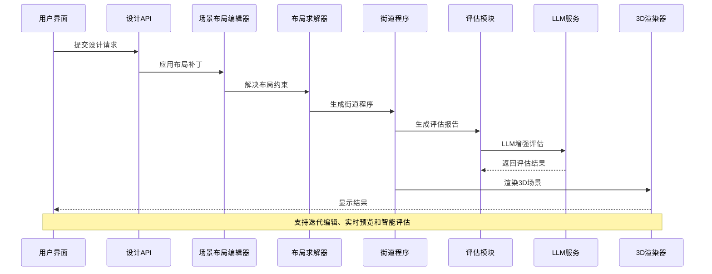
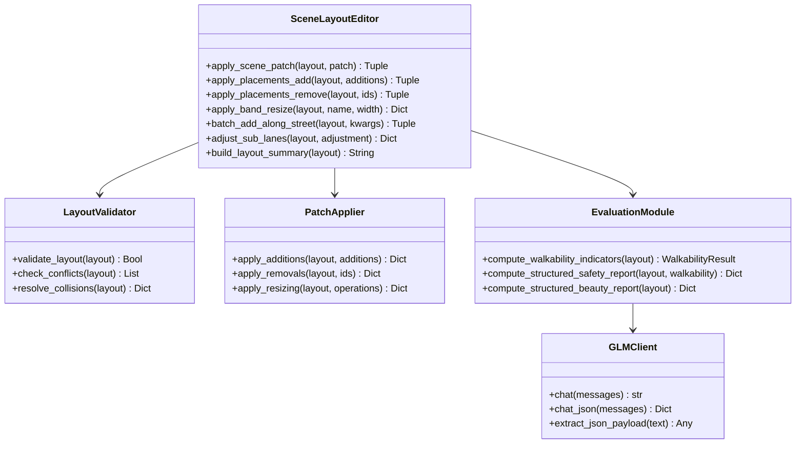
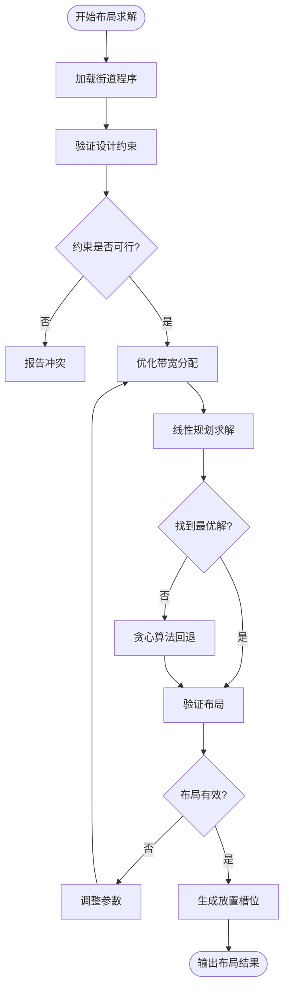
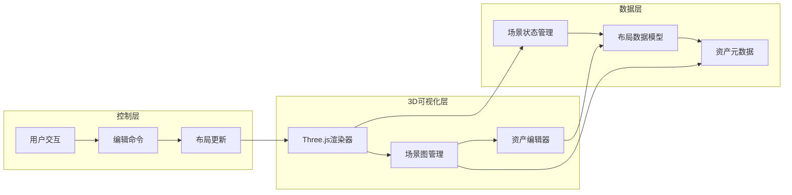
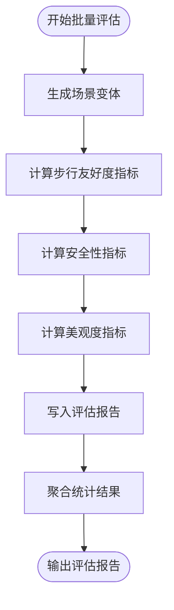
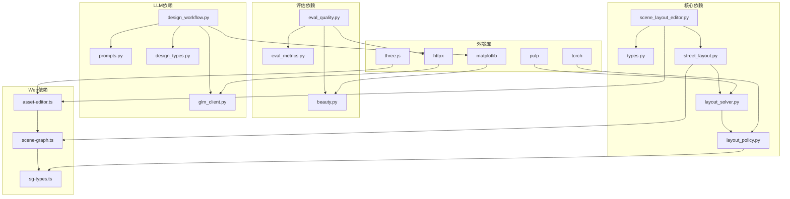

# 场景布局编辑器

<cite>
**本文档引用的文件**
- [scene_layout_editor.py](file://src/roadgen3d/scene_layout_editor.py)
- [street_layout.py](file://src/roadgen3d/street_layout.py)
- [layout_solver.py](file://src/roadgen3d/layout_solver.py)
- [layout_policy.py](file://src/roadgen3d/layout_policy.py)
- [eval_quality.py](file://evaluation/src/roadgen3d/eval_quality.py)
- [eval_walkability.py](file://evaluation/scripts/eval_walkability.py)
- [m4_10_eval_engineering.py](file://scripts/m4_10_eval_engineering.py)
- [glm_client.py](file://src/roadgen3d/llm/glm_client.py)
- [design_workflow.py](file://src/roadgen3d/llm/design_workflow.py)
- [prompts.py](file://src/roadgen3d/llm/prompts.py)
- [beauty.py](file://src/roadgen3d/beauty.py)
- [asset-editor.ts](file://web/viewer/src/asset-editor.ts)
- [scene-graph.ts](file://web/viewer/src/scene-graph.ts)
- [sg-types.ts](file://web/viewer/src/sg-types.ts)
- [types.py](file://src/roadgen3d/types.py)
- [readme.md](file://readme.md)
</cite>

## 更新摘要
**变更内容**
- 新增评估模块集成：walkability、safety、beauty报告生成和处理
- 新增LLM集成能力：GLM客户端、设计工作流和提示构建器
- 新增工程评估脚本：批量场景评估和报告生成
- 更新架构图以反映新的评估和LLM集成组件

## 目录
1. [简介](#简介)
2. [项目结构](#项目结构)
3. [核心组件](#核心组件)
4. [架构概览](#架构概览)
5. [详细组件分析](#详细组件分析)
6. [评估模块集成](#评估模块集成)
7. [LLM集成能力](#llm集成能力)
8. [工程评估系统](#工程评估系统)
9. [依赖关系分析](#依赖关系分析)
10. [性能考虑](#性能考虑)
11. [故障排除指南](#故障排除指南)
12. [结论](#结论)

## 简介

场景布局编辑器是RoadGen3D系统中的关键组件，负责将文本描述转换为详细的3D城市街道场景。该系统采用神经符号方法，通过设计知识检索、参数化街道布局生成和资产选择等步骤，最终输出可交互的3D场景。

**更新** 系统现已集成评估模块和LLM能力，提供智能化的场景质量评估和自动设计优化。

系统支持四种布局模式：
- **图模板** - 预定义的街道图（如香港科技大学广州校区入口）
- **OSM** - 从OpenStreetMap提取的真实街道
- **MetaUrban** - 基于街区的参考计划
- **模板** - 简单的参数化直线街道

## 项目结构

RoadGen3D项目采用模块化架构，主要包含以下核心目录：

**图表来源**
- [scene_layout_editor.py:1-390](file://src/roadgen3d/scene_layout_editor.py#L1-L390)
- [eval_quality.py:1-366](file://evaluation/src/roadgen3d/eval_quality.py#L1-L366)
- [glm_client.py:1-216](file://src/roadgen3d/llm/glm_client.py#L1-L216)

**章节来源**
- [readme.md:67-106](file://readme.md#L67-L106)

## 核心组件

### 场景布局编辑器核心功能

场景布局编辑器提供了完整的JSON补丁操作来修改场景布局，包括：

1. **布局补丁应用** - 支持添加、删除和修改场景元素
2. **带宽调整** - 动态调整街道各功能带的宽度
3. **批量添加** - 沿街道批量添加资产实例
4. **子车道调整** - 调整车道数量和车道路线

### 街道布局生成器

街道布局生成器负责将设计意图转换为具体的布局方案：

- **配置验证** - 确保所有参数符合约束条件
- **网格缓存加载** - 加载和缓存3D网格资源
- **碰撞检测** - 防止资产之间的相互穿透
- **美学评估** - 计算场景的整体美观度评分

### 布局求解器

布局求解器使用混合方法解决复杂的布局优化问题：

- **带宽优化** - 使用线性规划优化各功能带的宽度分配
- **冲突检测** - 识别和解决布局冲突
- **规则评估** - 评估设计规则的满足程度

**章节来源**
- [scene_layout_editor.py:10-57](file://src/roadgen3d/scene_layout_editor.py#L10-L57)
- [street_layout.py:493-612](file://src/roadgen3d/street_layout.py#L493-L612)
- [layout_solver.py:402-540](file://src/roadgen3d/layout_solver.py#L402-L540)

## 架构概览

系统采用分层架构，从底层的几何计算到顶层的用户界面，现已集成评估和LLM能力：

**图表来源**
- [scene_layout_editor.py:10-57](file://src/roadgen3d/scene_layout_editor.py#L10-L57)
- [layout_solver.py:746-800](file://src/roadgen3d/layout_solver.py#L746-L800)
- [street_layout.py:1-800](file://src/roadgen3d/street_layout.py#L1-L800)

## 详细组件分析

### 场景布局编辑器类图

**图表来源**
- [scene_layout_editor.py:10-390](file://src/roadgen3d/scene_layout_editor.py#L10-L390)
- [eval_quality.py:192-366](file://evaluation/src/roadgen3d/eval_quality.py#L192-L366)
- [glm_client.py:65-216](file://src/roadgen3d/llm/glm_client.py#L65-L216)

### 布局求解器流程图

**图表来源**
- [layout_solver.py:402-540](file://src/roadgen3d/layout_solver.py#L402-L540)

### Web前端集成架构

**图表来源**
- [asset-editor.ts:1-800](file://web/viewer/src/asset-editor.ts#L1-L800)
- [scene-graph.ts:1-800](file://web/viewer/src/scene-graph.ts#L1-L800)

**章节来源**
- [asset-editor.ts:1-800](file://web/viewer/src/asset-editor.ts#L1-L800)
- [scene-graph.ts:1-800](file://web/viewer/src/scene-graph.ts#L1-L800)
- [sg-types.ts:1-435](file://web/viewer/src/sg-types.ts#L1-L435)

## 评估模块集成

### 评估模块架构

评估模块提供三个维度的人类中心性评估：

1. **步行友好度 (Walkability)** - 评估街道对行人的友好程度
2. **安全性 (Safety)** - 评估街道的安全保障水平
3. **美观度 (Beauty)** - 评估街道的视觉美感

### 步行友好度评估

步行友好度评估包含11个指标：

- **SID_CLR** - 人行道清晰度
- **CLEAR_CONT** - 清晰连续性
- **FURN_D** - 家具密度
- **LIGHT_UNI** - 照明均匀性
- **TREE_SHADE** - 树荫覆盖率
- **BUFFER_RATIO** - 缓冲区比例
- **TRANSIT_PROX** - 公交通达性
- **CROSS_PROV** - 交叉口提供度
- **ENTR_DENS** - 出入口密度
- **POI_MIX** - 地点混合度
- **MICRO_ENV** - 微环境质量

### 安全性评估

安全性评估基于步行友好度指标和额外安全因素：

- **LIGHT_UNI** - 照明均匀性权重
- **CROSS_PROV** - 交叉口提供度权重
- **BUFFER_RATIO** - 缓冲区比例权重
- **BOLLARD_DENSITY** - 栅栏密度
- **VISIBILITY_PENALTY** - 可见性惩罚

### 美观度评估

美观度评估结合了表现美学和功能性因素：

- **style_coherence** - 风格一致性
- **visual_clutter** - 视觉杂乱度
- **spacing_rhythm** - 间距节奏
- **focal_readability** - 焦点可读性
- **presentation_score** - 表现分数
- **active_front_ratio** - 主动立面比例
- **anchor_poi_score** - 锚点地点评分

**章节来源**
- [eval_quality.py:192-366](file://evaluation/src/roadgen3d/eval_quality.py#L192-L366)
- [eval_walkability.py:1-49](file://evaluation/scripts/eval_walkability.py#L1-L49)

## LLM集成能力

### GLM客户端

GLM客户端提供OpenAI兼容的聊天完成接口，支持多种LLM服务：

- **配置管理** - 自动从环境变量读取配置
- **重试机制** - 智能指数退避重试
- **JSON解析** - 自动提取和解析JSON响应
- **速率限制** - 处理429状态码和重试头

### 设计工作流

设计工作流服务提供完整的LLM辅助设计流程：

- **意图解析** - 将自然语言转换为设计意图
- **知识检索** - 从PDF和GraphRAG知识库检索证据
- **草稿生成** - 基于证据生成设计草稿
- **场景评估** - 使用LLM评估生成的场景
- **迭代优化** - 支持多轮设计迭代

### 提示构建器

提示构建器提供多种预定义的提示模板：

- **设计意图** - 解析用户设计目标
- **参数查询** - 生成缺失参数的查询
- **设计草稿** - 生成设计参数草稿
- **场景评估** - 评估场景质量和提供建议
- **布局编辑** - 提供布局修改建议

**章节来源**
- [glm_client.py:65-216](file://src/roadgen3d/llm/glm_client.py#L65-L216)
- [design_workflow.py:63-905](file://src/roadgen3d/llm/design_workflow.py#L63-L905)
- [prompts.py:11-406](file://src/roadgen3d/llm/prompts.py#L11-L406)

## 工程评估系统

### 批量评估脚本

工程评估系统提供批量场景评估能力：

- **场景生成** - 生成多个场景变体
- **指标计算** - 计算步行友好度、安全性和美观度指标
- **报告生成** - 生成详细的评估报告
- **统计分析** - 提供场景间的比较和统计分析

### 评估流程

**图表来源**
- [m4_10_eval_engineering.py:192-283](file://scripts/m4_10_eval_engineering.py#L192-L283)

### 报告格式

评估报告包含以下字段：

- **场景元数据** - 场景ID、长度、宽度等基本信息
- **步行友好度** - walkability_index和各指标值
- **安全性** - safety_score和各特征值
- **美观度** - beauty_score和各特征值
- **工程指标** - 可编辑性、冲突解释性等

**章节来源**
- [m4_10_eval_engineering.py:1-413](file://scripts/m4_10_eval_engineering.py#L1-L413)

## 依赖关系分析

### 核心依赖关系

**图表来源**
- [scene_layout_editor.py:1-390](file://src/roadgen3d/scene_layout_editor.py#L1-L390)
- [layout_policy.py:1-309](file://src/roadgen3d/layout_policy.py#L1-L309)
- [eval_quality.py:1-366](file://evaluation/src/roadgen3d/eval_quality.py#L1-L366)

### 数据流依赖

系统中的数据流遵循严格的依赖链：

1. **输入数据** → **场景布局编辑器** → **布局求解器** → **3D渲染器**
2. **用户交互** → **Web前端** → **场景状态管理** → **布局更新**
3. **设计规则** → **约束集** → **布局验证** → **冲突解决**
4. **评估数据** → **评估模块** → **LLM增强** → **质量报告**
5. **LLM请求** → **GLM客户端** → **外部服务** → **响应解析**

**章节来源**
- [types.py:46-200](file://src/roadgen3d/types.py#L46-L200)
- [layout_solver.py:1-800](file://src/roadgen3d/layout_solver.py#L1-L800)

## 性能考虑

### 内存优化策略

1. **网格缓存机制** - 使用缓存避免重复加载3D网格
2. **增量更新** - 只更新发生变化的场景部分
3. **对象池** - 复用频繁创建的对象实例
4. **评估缓存** - 缓存评估计算结果避免重复计算

### 并行处理

- **多线程渲染** - 利用Web Workers进行后台渲染
- **异步资产加载** - 避免阻塞主线程
- **批处理操作** - 将多个小操作合并为批处理
- **LLM并发** - 支持多场景并行评估

### 缓存策略

- **场景状态缓存** - 缓存复杂的布局计算结果
- **纹理和材质缓存** - 减少GPU内存占用
- **网络请求缓存** - 避免重复的API调用
- **评估结果缓存** - 缓存LLM评估结果

## 故障排除指南

### 常见问题及解决方案

1. **布局冲突**
   - 检查设计规则配置
   - 验证资产尺寸和位置
   - 调整带宽分配

2. **性能问题**
   - 减少场景中资产数量
   - 降低渲染质量设置
   - 清理不必要的历史数据
   - 启用评估结果缓存

3. **渲染错误**
   - 检查3D模型文件完整性
   - 验证材质和纹理路径
   - 更新图形驱动程序

4. **LLM集成问题**
   - 验证API密钥和端点配置
   - 检查网络连接和防火墙设置
   - 查看重试日志和错误信息

5. **评估模块问题**
   - 确认场景布局文件格式正确
   - 验证评估指标计算逻辑
   - 检查LLM响应解析

### 调试工具

- **布局验证器** - 检测和报告布局问题
- **冲突分析器** - 识别潜在的碰撞和重叠
- **性能监控器** - 实时跟踪系统性能指标
- **LLM调试器** - 监控和调试LLM交互
- **评估分析器** - 分析评估指标和报告

**章节来源**
- [layout_solver.py:427-436](file://src/roadgen3d/layout_solver.py#L427-L436)
- [street_layout.py:614-618](file://src/roadgen3d/street_layout.py#L614-L618)

## 结论

场景布局编辑器作为RoadGen3D系统的核心组件，成功地将抽象的设计意图转化为具体的3D场景。通过模块化的架构设计、高效的算法实现和直观的用户界面，该系统为城市街道设计提供了强大的技术支持。

**更新** 系统现已集成评估模块和LLM能力，显著提升了设计质量和自动化水平：

### 主要创新点

1. **神经符号方法** - 结合了符号推理和机器学习的优势
2. **交互式编辑** - 支持实时的场景修改和预览
3. **多模式支持** - 兼容多种布局生成方式
4. **智能评估** - 提供步行友好度、安全性和美观度的综合评估
5. **LLM集成** - 支持自然语言设计和智能优化
6. **工程评估** - 提供批量场景分析和比较能力
7. **可扩展架构** - 为未来的功能扩展预留了空间

随着技术的不断发展，场景布局编辑器将继续演进，为用户提供更加智能、高效和高质量的街道设计体验。评估模块和LLM集成的加入，使得系统不仅能够生成设计，还能智能地评估和优化设计质量，真正实现了从设计到评估的完整闭环。