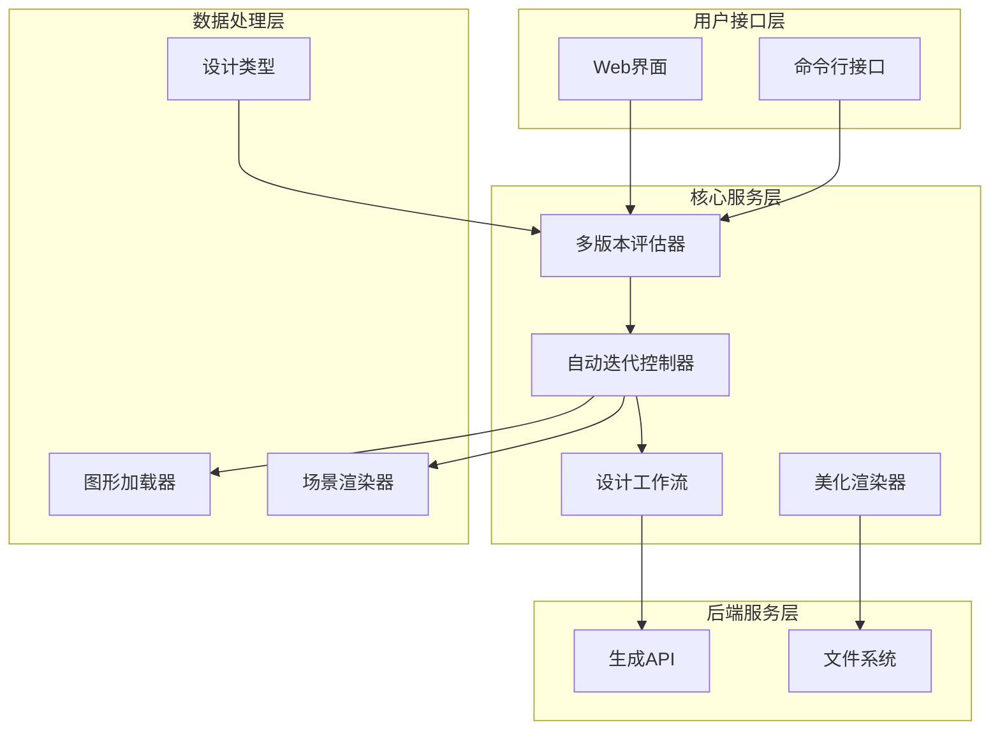
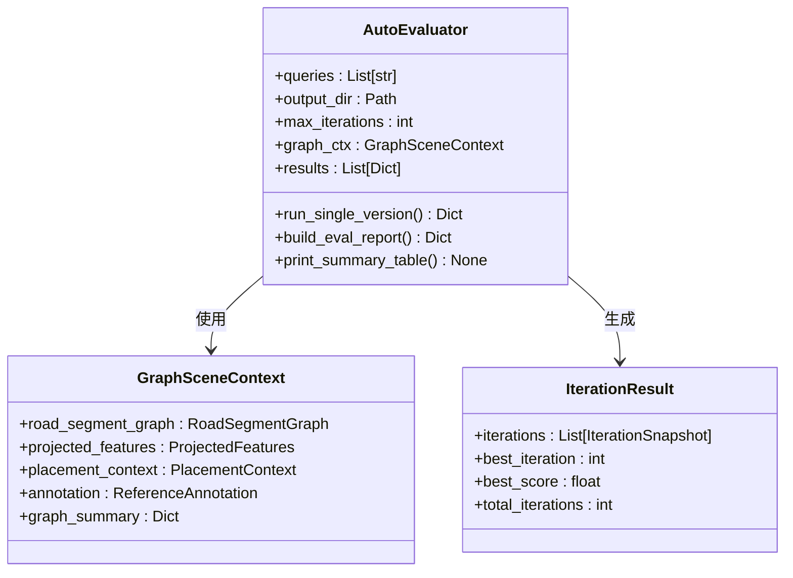
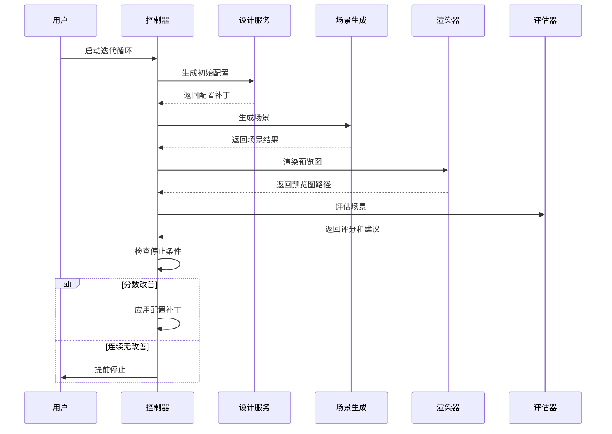
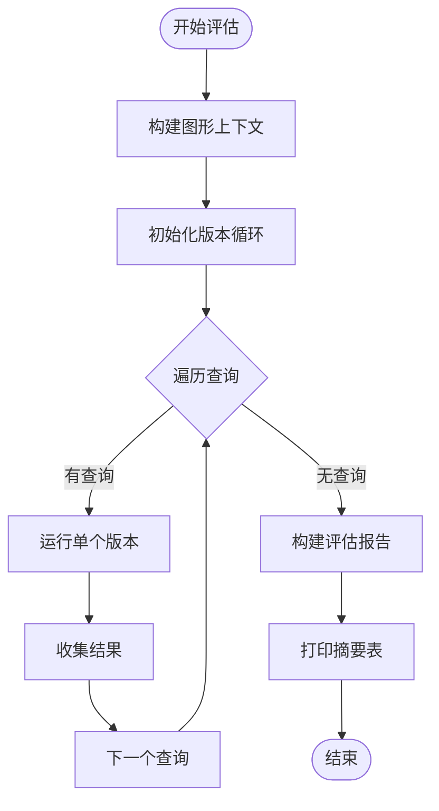
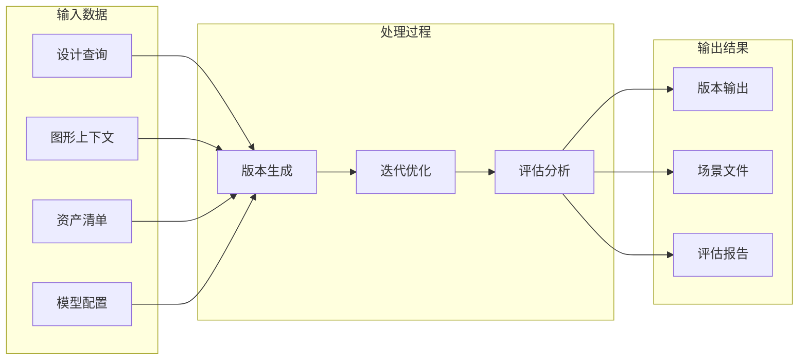

# 多版本自动评估系统

<cite>
**本文档引用的文件**
- [readme.md](file://readme.md)
- [run_auto_eval.py](file://scripts/run_auto_eval.py)
- [iteration_controller.py](file://src/roadgen3d/auto_pipeline/iteration_controller.py)
- [graph_loader.py](file://src/roadgen3d/auto_pipeline/graph_loader.py)
- [design_workflow.py](file://src/roadgen3d/llm/design_workflow.py)
- [design_types.py](file://src/roadgen3d/services/design_types.py)
- [beauty.py](file://src/roadgen3d/beauty.py)
- [scene_renderer.py](file://src/roadgen3d/auto_pipeline/scene_renderer.py)
- [generation_api.py](file://src/roadgen3d/services/generation_api.py)
- [test_auto_eval.py](file://tests/test_auto_eval.py)
</cite>

## 目录
1. [项目概述](#项目概述)
2. [系统架构](#系统架构)
3. [核心组件分析](#核心组件分析)
4. [多版本评估流程](#多版本评估流程)
5. [数据流分析](#数据流分析)
6. [性能考虑](#性能考虑)
7. [故障排除指南](#故障排除指南)
8. [结论](#结论)

## 项目概述

多版本自动评估系统是RoadGen3D项目中的一个关键功能模块，专门用于批量生成和评估多个设计方案版本。该系统能够同时运行多个设计查询，每个查询都会独立执行完整的生成-迭代-评估循环，并最终生成综合评估报告。

### 系统特性

- **批量处理能力**：支持同时运行多个设计查询，每个查询独立生成和评估
- **自动化迭代**：每个版本自动执行多轮生成、渲染、评估和改进循环
- **智能停止机制**：当连续两轮没有改善时自动停止，避免无效计算
- **综合报告生成**：自动生成包含所有版本表现的汇总报告
- **可视化输出**：为最佳结果生成展示视图

## 系统架构

**图表来源**
- [run_auto_eval.py:161-216](file://scripts/run_auto_eval.py#L161-L216)
- [iteration_controller.py:89-226](file://src/roadgen3d/auto_pipeline/iteration_controller.py#L89-L226)
- [design_workflow.py:311-350](file://src/roadgen3d/llm/design_workflow.py#L311-L350)

## 核心组件分析

### 多版本评估器 (AutoEvaluator)

多版本评估器是整个系统的核心协调器，负责管理多个版本的并行处理。

**图表来源**
- [run_auto_eval.py:161-216](file://scripts/run_auto_eval.py#L161-L216)
- [graph_loader.py:20-29](file://src/roadgen3d/auto_pipeline/graph_loader.py#L20-L29)

### 自动迭代控制器

自动迭代控制器实现了完整的生成-评估-改进循环，是系统的核心执行引擎。

**图表来源**
- [iteration_controller.py:89-226](file://src/roadgen3d/auto_pipeline/iteration_controller.py#L89-L226)
- [design_workflow.py:311-350](file://src/roadgen3d/llm/design_workflow.py#L311-L350)

**章节来源**
- [run_auto_eval.py:161-337](file://scripts/run_auto_eval.py#L161-L337)
- [iteration_controller.py:48-226](file://src/roadgen3d/auto_pipeline/iteration_controller.py#L48-L226)

## 多版本评估流程

### 流程概述

多版本自动评估系统遵循以下标准化流程：

1. **初始化阶段**：构建共享的图形上下文和评估配置
2. **版本生成**：为每个查询独立运行完整的迭代循环
3. **结果收集**：收集所有版本的迭代日志和最终结果
4. **报告生成**：创建综合评估报告和摘要表格

### 关键实现细节

**图表来源**
- [run_auto_eval.py:298-332](file://scripts/run_auto_eval.py#L298-L332)

**章节来源**
- [run_auto_eval.py:289-332](file://scripts/run_auto_eval.py#L289-L332)

## 数据流分析

### 输入数据流

系统接收多种类型的输入数据：

- **设计查询**：用户的自然语言设计要求
- **图形上下文**：从Viewer导出的路网图形数据
- **资产清单**：可用的3D资产元数据
- **模型配置**：CLIP模型和其他机器学习模型

### 输出数据流

系统生成多层次的输出结果：

- **版本特定输出**：每个查询的迭代日志和中间结果
- **最终场景**：每个版本的最佳场景文件
- **综合报告**：包含所有版本表现的评估报告

**图表来源**
- [run_auto_eval.py:161-216](file://scripts/run_auto_eval.py#L161-L216)
- [iteration_controller.py:89-226](file://src/roadgen3d/auto_pipeline/iteration_controller.py#L89-L226)

**章节来源**
- [run_auto_eval.py:105-130](file://scripts/run_auto_eval.py#L105-L130)
- [iteration_controller.py:121-168](file://src/roadgen3d/auto_pipeline/iteration_controller.py#L121-L168)

## 性能考虑

### 并行处理策略

系统采用以下性能优化策略：

- **版本级并行**：不同查询的版本可以并行处理
- **内存管理**：及时清理临时文件和缓存
- **资源限制**：通过最大迭代次数防止无限循环

### 计算优化

- **早期停止**：连续两轮无改善时自动停止
- **缓存机制**：利用设计草稿缓存减少重复计算
- **增量更新**：只在必要时重新生成场景

## 故障排除指南

### 常见问题及解决方案

1. **LLM API连接失败**
   - 检查环境变量配置
   - 验证网络连接
   - 查看重试机制日志

2. **场景生成失败**
   - 检查资产清单完整性
   - 验证模型文件存在性
   - 确认磁盘空间充足

3. **渲染器错误**
   - 安装matplotlib依赖
   - 检查图像文件权限
   - 验证输出目录可写

### 调试工具

系统提供了完善的测试套件来验证各组件功能：

- **集成测试**：验证完整的多版本评估流程
- **单元测试**：测试单个组件的功能正确性
- **模拟测试**：使用模拟服务进行确定性测试

**章节来源**
- [test_auto_eval.py:448-521](file://tests/test_auto_eval.py#L448-L521)

## 结论

多版本自动评估系统为RoadGen3D项目提供了一个强大而灵活的设计评估框架。通过并行处理多个设计方案版本，系统能够快速比较不同设计策略的效果，并为用户提供全面的评估报告。

### 主要优势

- **高效性**：支持批量处理多个设计方案版本
- **自动化**：完整的生成-评估-改进循环无需人工干预
- **可扩展性**：模块化设计便于功能扩展和维护
- **可靠性**：完善的错误处理和测试覆盖

### 未来发展方向

- **增强LLM集成**：进一步优化与大语言模型的交互
- **性能优化**：提升大规模场景生成的效率
- **评估指标扩展**：增加更多维度的评估指标
- **用户界面改进**：提供更直观的结果展示和分析工具

该系统为城市规划和街道设计领域提供了一个创新的技术解决方案，有助于提高设计质量和效率。