# 多版本自动评估系统

<cite>
**本文档引用的文件**
- [readme.md](file://readme.md)
- [run_auto_eval.py](file://scripts/run_auto_eval.py)
- [snapshot_diff.py](file://scripts/snapshot_diff.py)
- [iteration_controller.py](file://src/roadgen3d/auto_pipeline/iteration_controller.py)
- [graph_loader.py](file://src/roadgen3d/auto_pipeline/graph_loader.py)
- [design_workflow.py](file://src/roadgen3d/llm/design_workflow.py)
- [design_types.py](file://src/roadgen3d/services/design_types.py)
- [design_runtime.py](file://src/roadgen3d/services/design_runtime.py)
- [beauty.py](file://src/roadgen3d/beauty.py)
- [scene_renderer.py](file://src/roadgen3d/auto_pipeline/scene_renderer.py)
- [generation_api.py](file://src/roadgen3d/services/generation_api.py)
- [scene_layout_editor.py](file://src/roadgen3d/scene_layout_editor.py)
- [prompts.py](file://src/roadgen3d/llm/prompts.py)
- [test_auto_eval.py](file://tests/test_auto_eval.py)
- [test_design_runtime.py](file://tests/test_design_runtime.py)
- [test_snapshot_diff.py](file://tests/test_snapshot_diff.py)
- [eval_walkability.py](file://evaluation/scripts/eval_walkability.py)
- [eval_quality.py](file://evaluation/src/roadgen3d/eval_quality.py)
- [eval_metrics.py](file://src/roadgen3d/eval_metrics.py)
- [m4_10_eval_engineering.py](file://scripts/m4_10_eval_engineering.py)
- [README.md](file://evaluation/README.md)
- [evaluation_module_plan.md](file://evaluation/docs/evaluation_module_plan.md)
- [test_m4_eval_metrics.py](file://tests/test_m4_eval_metrics.py)
</cite>

## 更新摘要
**变更内容**
- 新增综合评估评分系统：实现 `EvaluationScore = 0.45 × WalkabilityIndex + 0.35 × SafetyScore + 0.20 × BeautyScore` 的加权评分计算
- 新增WalkabilityResult数据类：提供结构化的步行友好度评估结果封装
- 新增布局编辑消息构建功能：实现 `build_layout_edit_messages` 函数用于LLM场景编辑
- 完善评估报告生成机制：支持步行友好度、安全、美观三大维度的完整报告输出
- 增强两阶段评估流程：集成综合评分系统和布局编辑功能

## 目录
1. [项目概述](#项目概述)
2. [系统架构](#系统架构)
3. [核心组件分析](#核心组件分析)
4. [多版本评估流程](#多版本评估流程)
5. [两阶段评估流程](#两阶段评估流程)
6. [场景布局编辑框架](#场景布局编辑框架)
7. [评估模块集成](#评估模块集成)
8. [综合评估评分系统](#综合评估评分系统)
9. [步行友好度评估](#步行友好度评估)
10. [安全评估](#安全评估)
11. [美观评估](#美观评估)
12. [数据流分析](#数据流分析)
13. [性能考虑](#性能考虑)
14. [故障排除指南](#故障排除指南)
15. [结论](#结论)

## 项目概述

多版本自动评估系统是RoadGen3D项目中的一个关键功能模块，专门用于批量生成和评估多个设计方案版本。该系统能够同时运行多个设计查询，每个查询都会独立执行完整的生成-迭代-评估循环，并最终生成综合评估报告。

**最新更新**：系统现已集成了完整的评估模块，包括步行友好度、安全、美观三大维度的自动计算和报告生成，显著增强了系统的评估能力和自动化程度。新增的综合评估评分系统实现了加权评分计算，为设计方案提供统一的量化评估标准。

### 系统特性

- **批量处理能力**：支持同时运行多个设计查询，每个查询独立生成和评估
- **自动化迭代**：每个版本自动执行多轮生成、渲染、评估和改进循环
- **智能停止机制**：当连续两轮没有改善时自动停止，避免无效计算
- **综合报告生成**：自动生成包含所有版本表现的汇总报告
- **可视化输出**：为最佳结果生成展示视图
- **严格数据验证**：设计类型模块包含严格的枚举验证机制，确保数据完整性
- **两阶段评估**：支持设计管道迭代评估和LLM场景编辑循环的组合评估
- **场景布局编辑**：提供JSON patch操作和渐进式布局改进能力
- **自动化测试**：完整的snapshot-diff测试套件，支持配置差异分析和预览图对比
- **质量指标评估**：集成步行友好度、安全、美观三大维度的自动评估功能
- **详细报告输出**：生成包含11个步行指标、安全特征和美观指标的完整报告
- **工程化集成**：与M4工程评估脚本深度集成，支持批量自动化评估
- **综合评分系统**：实现加权评分算法，提供统一的评估标准
- **数据类封装**：使用WalkabilityResult等数据类提供结构化结果
- **布局编辑集成**：支持LLM驱动的场景布局改进和优化

## 系统架构

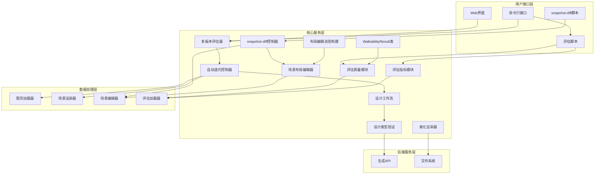
```mermaid
graph TB
subgraph "用户接口层"
UI[Web界面]
CLI[命令行接口]
SD[snapshot-diff脚本]
EW[评估脚本]
end
subgraph "核心服务层"
AE[多版本评估器]
AC[自动迭代控制器]
SDC[snapshot-diff控制器]
DR[设计工作流]
BR[美化渲染器]
DT[设计类型验证]
SLE[场景布局编辑器]
EQ[评估质量模块]
EM[评估指标模块]
WRR[WalkabilityResult类]
BEM[布局编辑消息构建]
end
subgraph "数据处理层"
GL[图形加载器]
SR[场景渲染器]
SED[场景编辑器]
EL[评估加载器]
end
subgraph "后端服务层"
API[生成API]
FS[文件系统]
end
UI --> AE
CLI --> AE
CLI --> EW
SD --> SDC
EW --> EQ
EW --> EM
AE --> AC
AC --> DR
AC --> GL
AC --> SR
SDC --> SED
SDC --> SLE
DR --> DT
DT --> API
BR --> FS
SLE --> SED
EQ --> EL
EM --> EL
BEM --> SLE
WRR --> EQ
```

**图表来源**
- [run_auto_eval.py:161-216](file://scripts/run_auto_eval.py#L161-L216)
- [snapshot_diff.py:567-773](file://scripts/snapshot_diff.py#L567-L773)
- [iteration_controller.py:89-226](file://src/roadgen3d/auto_pipeline/iteration_controller.py#L89-L226)
- [design_workflow.py:311-350](file://src/roadgen3d/llm/design_workflow.py#L311-L350)
- [design_types.py:71-98](file://src/roadgen3d/services/design_types.py#L71-L98)
- [scene_layout_editor.py:10-57](file://src/roadgen3d/scene_layout_editor.py#L10-L57)
- [eval_walkability.py:18-49](file://evaluation/scripts/eval_walkability.py#L18-L49)
- [eval_quality.py:192-366](file://evaluation/src/roadgen3d/eval_quality.py#L192-L366)
- [prompts.py:214-300](file://src/roadgen3d/llm/prompts.py#L214-L300)

## 核心组件分析

### 多版本评估器 (AutoEvaluator)

多版本评估器是整个系统的核心协调器，负责管理多个版本的并行处理。

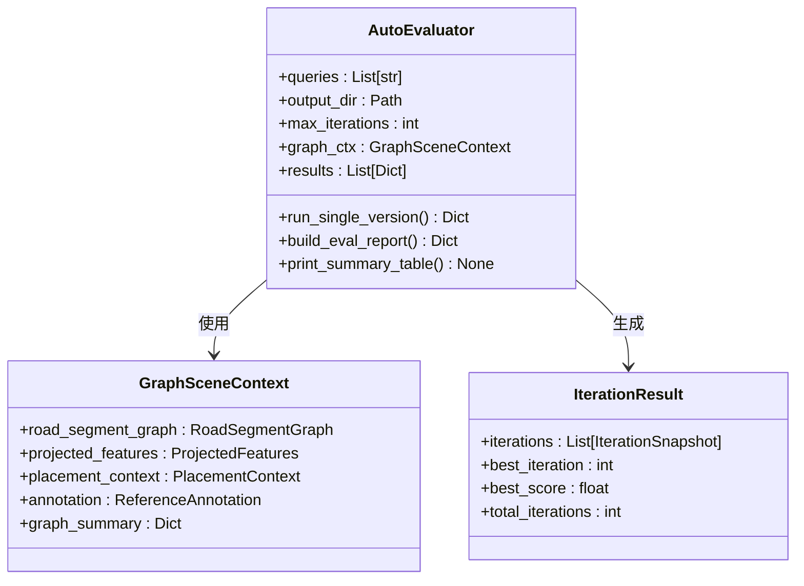
```mermaid
classDiagram
class AutoEvaluator {
+queries : List[str]
+output_dir : Path
+max_iterations : int
+graph_ctx : GraphSceneContext
+results : List[Dict]
+run_single_version() Dict
+build_eval_report() Dict
+print_summary_table() None
}
class GraphSceneContext {
+road_segment_graph : RoadSegmentGraph
+projected_features : ProjectedFeatures
+placement_context : PlacementContext
+annotation : ReferenceAnnotation
+graph_summary : Dict
}
class IterationResult {
+iterations : List[IterationSnapshot]
+best_iteration : int
+best_score : float
+total_iterations : int
}
AutoEvaluator --> GraphSceneContext : 使用
AutoEvaluator --> IterationResult : 生成
```

**图表来源**
- [run_auto_eval.py:161-216](file://scripts/run_auto_eval.py#L161-L216)
- [graph_loader.py:20-29](file://src/roadgen3d/auto_pipeline/graph_loader.py#L20-L29)

### snapshot-diff控制器

snapshot-diff控制器是新的两阶段评估流程的核心，负责协调设计管道迭代评估和LLM场景编辑循环。

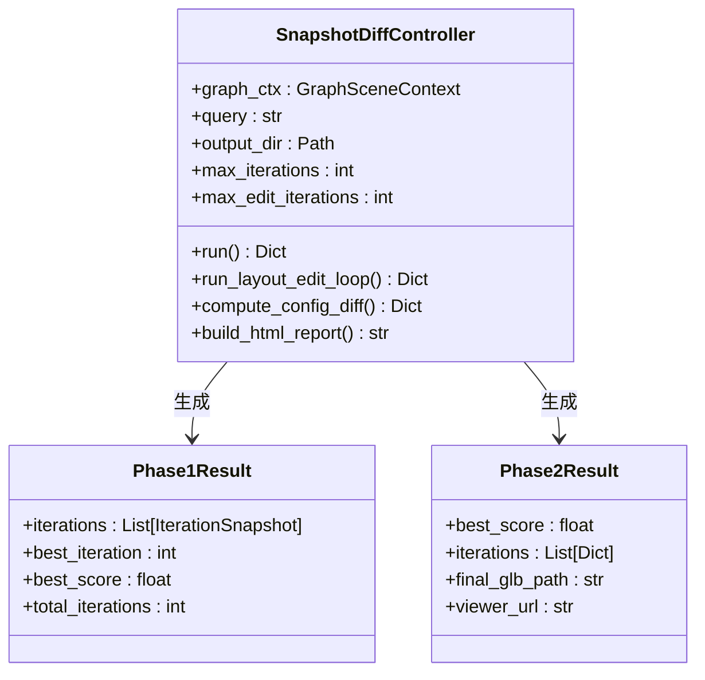
```mermaid
classDiagram
class SnapshotDiffController {
+graph_ctx : GraphSceneContext
+query : str
+output_dir : Path
+max_iterations : int
+max_edit_iterations : int
+run() Dict
+run_layout_edit_loop() Dict
+compute_config_diff() Dict
+build_html_report() str
}
class Phase1Result {
+iterations : List[IterationSnapshot]
+best_iteration : int
+best_score : float
+total_iterations : int
}
class Phase2Result {
+best_score : float
+iterations : List[Dict]
+final_glb_path : str
+viewer_url : str
}
SnapshotDiffController --> Phase1Result : 生成
SnapshotDiffController --> Phase2Result : 生成
```

**图表来源**
- [snapshot_diff.py:567-773](file://scripts/snapshot_diff.py#L567-L773)
- [snapshot_diff.py:367-563](file://scripts/snapshot_diff.py#L367-L563)

### 自动迭代控制器

自动迭代控制器实现了完整的生成-评估-改进循环，是系统的核心执行引擎。

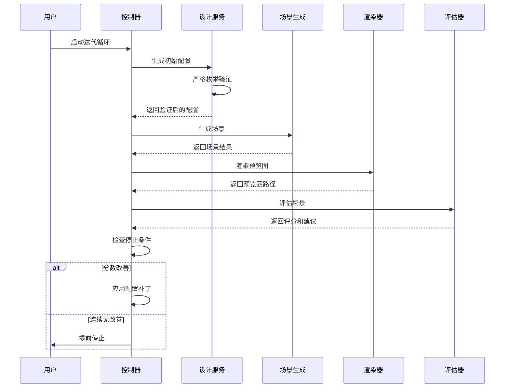
```mermaid
sequenceDiagram
participant U as 用户
participant C as 控制器
participant D as 设计服务
participant G as 场景生成
participant R as 渲染器
participant E as 评估器
U->>C : 启动迭代循环
C->>D : 生成初始配置
D->>D : 严格枚举验证
D-->>C : 返回验证后的配置
C->>G : 生成场景
G-->>C : 返回场景结果
C->>R : 渲染预览图
R-->>C : 返回预览图路径
C->>E : 评估场景
E-->>C : 返回评分和建议
C->>C : 检查停止条件
alt 分数改善
C->>C : 应用配置补丁
else 连续无改善
C->>U : 提前停止
end
```

**图表来源**
- [iteration_controller.py:89-226](file://src/roadgen3d/auto_pipeline/iteration_controller.py#L89-L226)
- [design_workflow.py:311-350](file://src/roadgen3d/llm/design_workflow.py#L311-L350)
- [design_types.py:71-98](file://src/roadgen3d/services/design_types.py#L71-L98)

### 设计类型验证模块

设计类型验证模块提供了严格的数据验证和清理功能，确保只有有效的枚举值被接受。

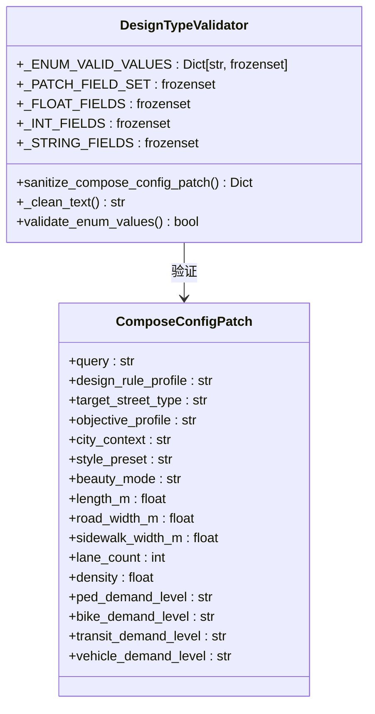
```mermaid
classDiagram
class DesignTypeValidator {
+_ENUM_VALID_VALUES : Dict[str, frozenset]
+_PATCH_FIELD_SET : frozenset
+_FLOAT_FIELDS : frozenset
+_INT_FIELDS : frozenset
+_STRING_FIELDS : frozenset
+sanitize_compose_config_patch() Dict
+_clean_text() str
+validate_enum_values() bool
}
class ComposeConfigPatch {
+query : str
+design_rule_profile : str
+target_street_type : str
+objective_profile : str
+city_context : str
+style_preset : str
+beauty_mode : str
+length_m : float
+road_width_m : float
+sidewalk_width_m : float
+lane_count : int
+density : float
+ped_demand_level : str
+bike_demand_level : str
+transit_demand_level : str
+vehicle_demand_level : str
}
DesignTypeValidator --> ComposeConfigPatch : 验证
```

**图表来源**
- [design_types.py:37-63](file://src/roadgen3d/services/design_types.py#L37-L63)
- [design_types.py:71-98](file://src/roadgen3d/services/design_types.py#L71-L98)

### WalkabilityResult数据类

WalkabilityResult是评估模块的核心数据结构，提供结构化的步行友好度评估结果。

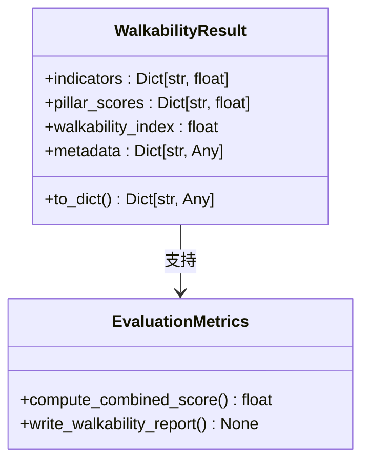
```mermaid
classDiagram
class WalkabilityResult {
+indicators : Dict[str, float]
+pillar_scores : Dict[str, float]
+walkability_index : float
+metadata : Dict[str, Any]
+to_dict() Dict[str, Any]
}
class EvaluationMetrics {
+compute_combined_score() float
+write_walkability_report() None
}
WalkabilityResult --> EvaluationMetrics : 支持
```

**图表来源**
- [eval_quality.py:76-89](file://evaluation/src/roadgen3d/eval_quality.py#L76-L89)
- [iteration_controller.py:173-198](file://src/roadgen3d/auto_pipeline/iteration_controller.py#L173-L198)

**章节来源**
- [run_auto_eval.py:161-337](file://scripts/run_auto_eval.py#L161-L337)
- [snapshot_diff.py:567-773](file://scripts/snapshot_diff.py#L567-L773)
- [iteration_controller.py:48-226](file://src/roadgen3d/auto_pipeline/iteration_controller.py#L48-L226)
- [design_types.py:71-98](file://src/roadgen3d/services/design_types.py#L71-L98)
- [eval_quality.py:76-89](file://evaluation/src/roadgen3d/eval_quality.py#L76-L89)

## 多版本评估流程

### 流程概述

多版本自动评估系统遵循以下标准化流程：

1. **初始化阶段**：构建共享的图形上下文和评估配置
2. **版本生成**：为每个查询独立运行完整的迭代循环
3. **严格验证**：在每次迭代中应用设计类型验证
4. **结果收集**：收集所有版本的迭代日志和最终结果
5. **报告生成**：创建综合评估报告和摘要表格

### 关键实现细节

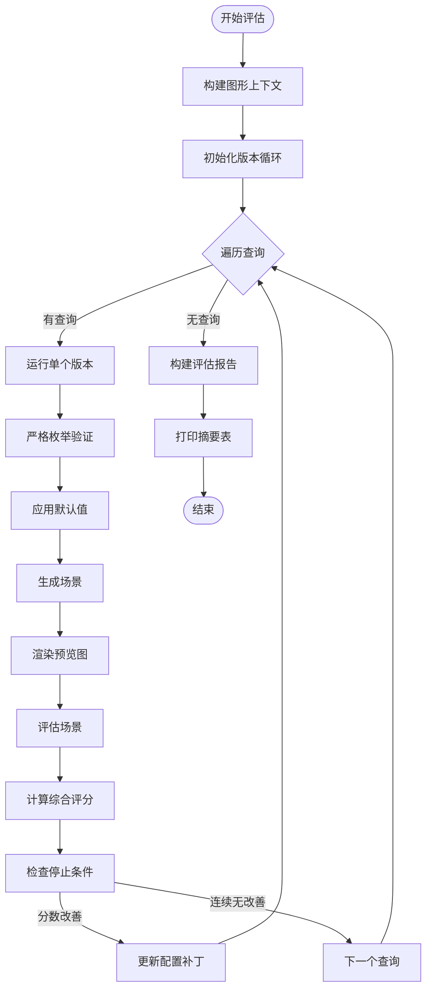
```mermaid
flowchart TD
Start([开始评估]) --> BuildCtx[构建图形上下文]
BuildCtx --> InitLoop[初始化版本循环]
InitLoop --> ForEachQuery{遍历查询}
ForEachQuery --> |有查询| RunVersion[运行单个版本]
ForEachQuery --> |无查询| BuildReport[构建评估报告]
RunVersion --> SanitizePatch[严格枚举验证]
SanitizePatch --> ApplyDefaults[应用默认值]
ApplyDefaults --> GenerateScene[生成场景]
GenerateScene --> RenderPreview[渲染预览图]
RenderPreview --> EvaluateScene[评估场景]
EvaluateScene --> ComputeCombinedScore[计算综合评分]
ComputeCombinedScore --> CheckStop[检查停止条件]
CheckStop --> |分数改善| UpdatePatch[更新配置补丁]
CheckStop --> |连续无改善| NextQuery[下一个查询]
UpdatePatch --> ForEachQuery
NextQuery --> ForEachQuery
BuildReport --> PrintSummary[打印摘要表]
PrintSummary --> End([结束])
```

**图表来源**
- [run_auto_eval.py:298-332](file://scripts/run_auto_eval.py#L298-L332)
- [design_types.py:71-98](file://src/roadgen3d/services/design_types.py#L71-L98)
- [iteration_controller.py:173-198](file://src/roadgen3d/auto_pipeline/iteration_controller.py#L173-L198)

**章节来源**
- [run_auto_eval.py:289-332](file://scripts/run_auto_eval.py#L289-L332)
- [design_types.py:71-98](file://src/roadgen3d/services/design_types.py#L71-L98)

## 两阶段评估流程

### Phase 1：设计管道迭代评估

Phase 1与传统的AutoIterationController流程相同，专注于通过LLM驱动的设计管道进行迭代优化。

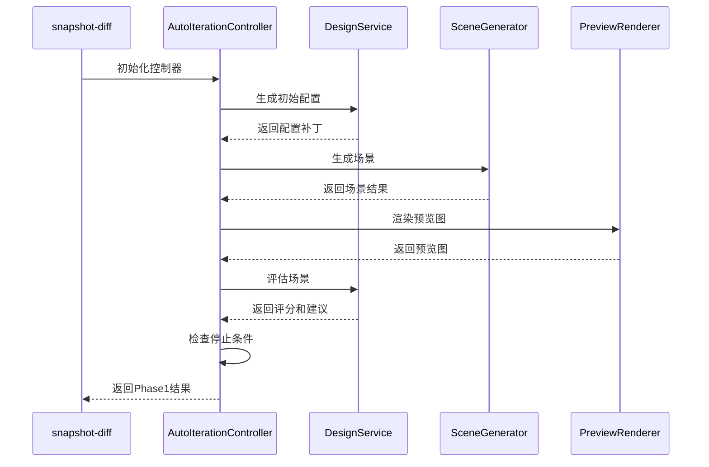
```mermaid
sequenceDiagram
participant SD as snapshot-diff
participant AC as AutoIterationController
participant DS as DesignService
participant GS as SceneGenerator
participant PR as PreviewRenderer
SD->>AC : 初始化控制器
AC->>DS : 生成初始配置
DS-->>AC : 返回配置补丁
AC->>GS : 生成场景
GS-->>AC : 返回场景结果
AC->>PR : 渲染预览图
PR-->>AC : 返回预览图
AC->>DS : 评估场景
DS-->>AC : 返回评分和建议
AC->>AC : 检查停止条件
AC-->>SD : 返回Phase1结果
```

**图表来源**
- [snapshot_diff.py:598-611](file://scripts/snapshot_diff.py#L598-L611)
- [iteration_controller.py:89-226](file://src/roadgen3d/auto_pipeline/iteration_controller.py#L89-L226)

### Phase 2：LLM场景编辑循环

Phase 2是新增的第二阶段，通过LLM驱动的场景编辑器进行渐进式布局改进。

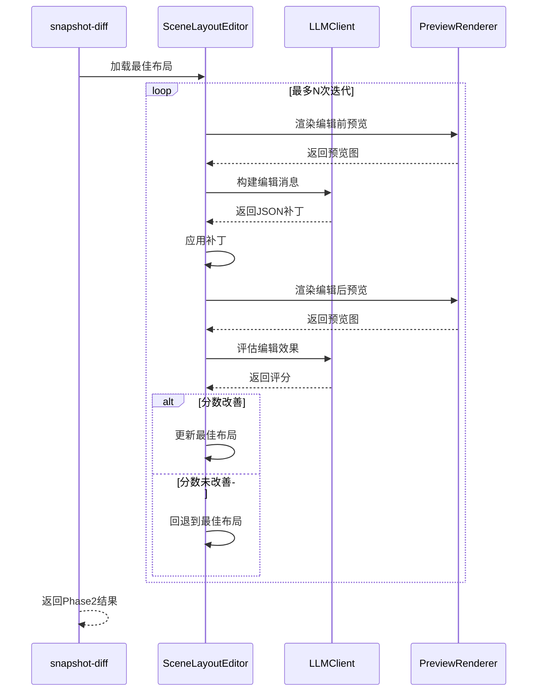
```mermaid
sequenceDiagram
participant SD as snapshot-diff
participant SLE as SceneLayoutEditor
participant LLM as LLMClient
participant PR as PreviewRenderer
SD->>SLE : 加载最佳布局
loop 最多N次迭代
SLE->>PR : 渲染编辑前预览
PR-->>SLE : 返回预览图
SLE->>LLM : 构建编辑消息
LLM-->>SLE : 返回JSON补丁
SLE->>SLE : 应用补丁
SLE->>PR : 渲染编辑后预览
PR-->>SLE : 返回预览图
SLE->>LLM : 评估编辑效果
LLM-->>SLE : 返回评分
alt 分数改善
SLE->>SLE : 更新最佳布局
else 分数未改善
SLE->>SLE : 回退到最佳布局
end
end
SD-->>SD : 返回Phase2结果
```

**图表来源**
- [snapshot_diff.py:367-563](file://scripts/snapshot_diff.py#L367-L563)
- [scene_layout_editor.py:10-57](file://src/roadgen3d/scene_layout_editor.py#L10-L57)
- [prompts.py:214-300](file://src/roadgen3d/llm/prompts.py#L214-L300)

### 两阶段整合

两阶段流程通过snapshot-diff控制器进行统一管理，最终生成综合报告。


```mermaid
flowchart TD
Start([开始两阶段评估]) --> Phase1[Phase 1: 设计管道迭代]
Phase1 --> Phase2[Phase 2: LLM场景编辑]
Phase2 --> Merge[合并结果]
Merge --> Report[生成综合报告]
Report --> End([结束])
```

**图表来源**
- [snapshot_diff.py:567-773](file://scripts/snapshot_diff.py#L567-L773)

**章节来源**
- [snapshot_diff.py:567-773](file://scripts/snapshot_diff.py#L567-L773)
- [snapshot_diff.py:367-563](file://scripts/snapshot_diff.py#L367-L563)
- [scene_layout_editor.py:10-57](file://src/roadgen3d/scene_layout_editor.py#L10-L57)

## 场景布局编辑框架

### JSON补丁操作

场景布局编辑框架提供了强大的JSON补丁操作能力，支持渐进式布局改进。

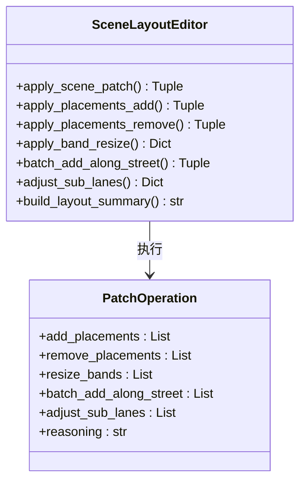
```mermaid
classDiagram
class SceneLayoutEditor {
+apply_scene_patch() Tuple
+apply_placements_add() Tuple
+apply_placements_remove() Tuple
+apply_band_resize() Dict
+batch_add_along_street() Tuple
+adjust_sub_lanes() Dict
+build_layout_summary() str
}
class PatchOperation {
+add_placements : List
+remove_placements : List
+resize_bands : List
+batch_add_along_street : List
+adjust_sub_lanes : List
+reasoning : str
}
SceneLayoutEditor --> PatchOperation : 执行
```

**图表来源**
- [scene_layout_editor.py:10-57](file://src/roadgen3d/scene_layout_editor.py#L10-L57)
- [scene_layout_editor.py:290-346](file://src/roadgen3d/scene_layout_editor.py#L290-L346)

### 布局摘要生成

系统能够自动生成布局摘要，为LLM提供上下文信息。


```mermaid
flowchart TD
Start([生成布局摘要]) --> Config[提取配置信息]
Config --> Bands[提取带信息]
Bands --> Placements[统计放置物]
Placements --> Details[生成详细信息]
Details --> Summary[返回摘要文本]
```

**图表来源**
- [scene_layout_editor.py:209-265](file://src/roadgen3d/scene_layout_editor.py#L209-L265)

### LLM提示工程

系统集成了专门的LLM提示模板，支持场景编辑和评估。

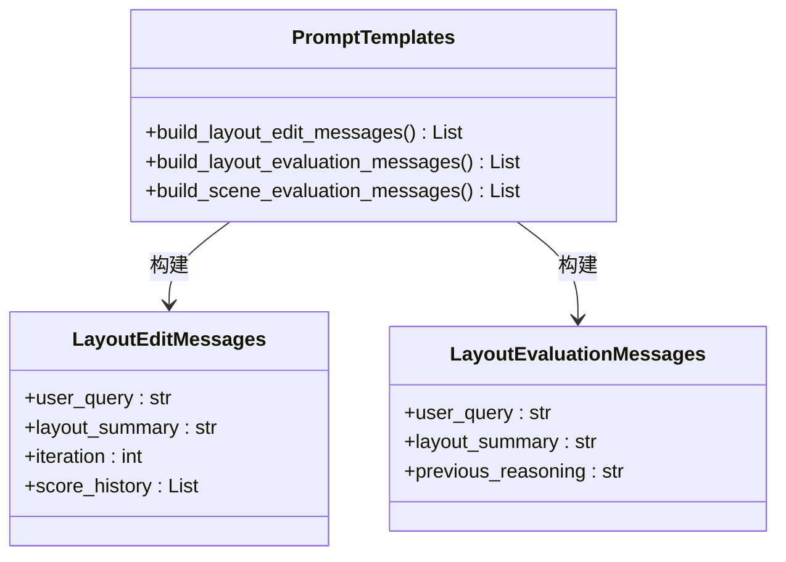
```mermaid
classDiagram
class PromptTemplates {
+build_layout_edit_messages() List
+build_layout_evaluation_messages() List
+build_scene_evaluation_messages() List
}
class LayoutEditMessages {
+user_query : str
+layout_summary : str
+iteration : int
+score_history : List
}
class LayoutEvaluationMessages {
+user_query : str
+layout_summary : str
+previous_reasoning : str
}
PromptTemplates --> LayoutEditMessages : 构建
PromptTemplates --> LayoutEvaluationMessages : 构建
```

**图表来源**
- [prompts.py:214-300](file://src/roadgen3d/llm/prompts.py#L214-L300)
- [prompts.py:303-354](file://src/roadgen3d/llm/prompts.py#L303-L354)

### 布局编辑消息构建功能

新增的 `build_layout_edit_messages` 函数为LLM场景编辑提供了完整的消息构建功能。

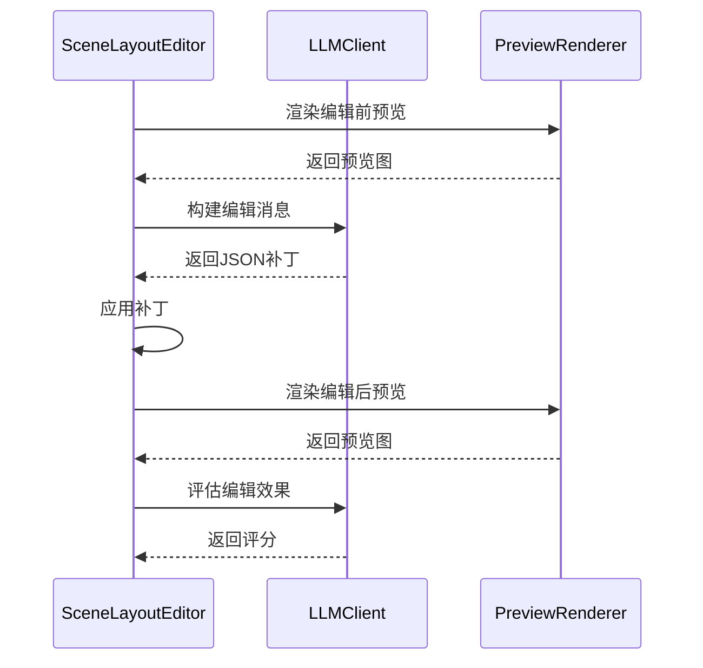
```mermaid
sequenceDiagram
participant SLE as SceneLayoutEditor
participant LLM as LLMClient
participant PR as PreviewRenderer
SLE->>PR : 渲染编辑前预览
PR-->>SLE : 返回预览图
SLE->>LLM : 构建编辑消息
LLM-->>SLE : 返回JSON补丁
SLE->>SLE : 应用补丁
SLE->>PR : 渲染编辑后预览
PR-->>SLE : 返回预览图
SLE->>LLM : 评估编辑效果
LLM-->>SLE : 返回评分
```

**图表来源**
- [prompts.py:214-300](file://src/roadgen3d/llm/prompts.py#L214-L300)

**章节来源**
- [scene_layout_editor.py:10-390](file://src/roadgen3d/scene_layout_editor.py#L10-L390)
- [prompts.py:214-354](file://src/roadgen3d/llm/prompts.py#L214-L354)

## 评估模块集成

### 评估模块架构

评估模块是系统的重要组成部分，提供了完整的质量评估能力。

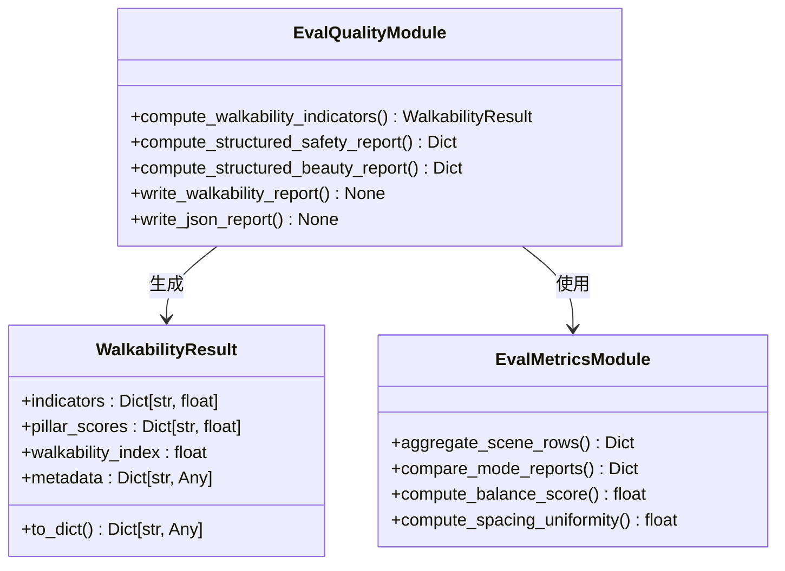
```mermaid
classDiagram
class EvalQualityModule {
+compute_walkability_indicators() WalkabilityResult
+compute_structured_safety_report() Dict
+compute_structured_beauty_report() Dict
+write_walkability_report() None
+write_json_report() None
}
class WalkabilityResult {
+indicators : Dict[str, float]
+pillar_scores : Dict[str, float]
+walkability_index : float
+metadata : Dict[str, Any]
+to_dict() Dict[str, Any]
}
class EvalMetricsModule {
+aggregate_scene_rows() Dict
+compare_mode_reports() Dict
+compute_balance_score() float
+compute_spacing_uniformity() float
}
EvalQualityModule --> WalkabilityResult : 生成
EvalQualityModule --> EvalMetricsModule : 使用
```

**图表来源**
- [eval_quality.py:76-366](file://evaluation/src/roadgen3d/eval_quality.py#L76-L366)
- [eval_metrics.py:194-306](file://src/roadgen3d/eval_metrics.py#L194-L306)

### 评估脚本集成

评估模块通过专门的脚本与工程评估流程集成。

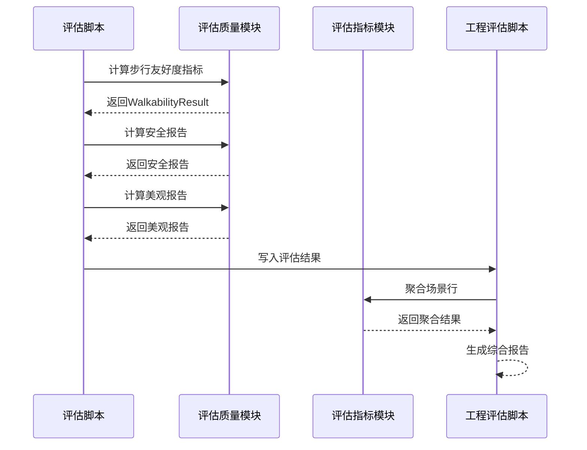
```mermaid
sequenceDiagram
participant ES as 评估脚本
participant EQ as 评估质量模块
participant EM as 评估指标模块
participant ME as 工程评估脚本
ES->>EQ : 计算步行友好度指标
EQ-->>ES : 返回WalkabilityResult
ES->>EQ : 计算安全报告
EQ-->>ES : 返回安全报告
ES->>EQ : 计算美观报告
EQ-->>ES : 返回美观报告
ES->>ME : 写入评估结果
ME->>EM : 聚合场景行
EM-->>ME : 返回聚合结果
ME-->>ME : 生成综合报告
```

**图表来源**
- [eval_walkability.py:32-44](file://evaluation/scripts/eval_walkability.py#L32-L44)
- [m4_10_eval_engineering.py:200-271](file://scripts/m4_10_eval_engineering.py#L200-L271)

**章节来源**
- [eval_walkability.py:18-49](file://evaluation/scripts/eval_walkability.py#L18-L49)
- [eval_quality.py:192-366](file://evaluation/src/roadgen3d/eval_quality.py#L192-L366)
- [m4_10_eval_engineering.py:200-271](file://scripts/m4_10_eval_engineering.py#L200-L271)

## 综合评估评分系统

### 评分算法

系统实现了统一的综合评估评分算法，为设计方案提供客观的量化评估。

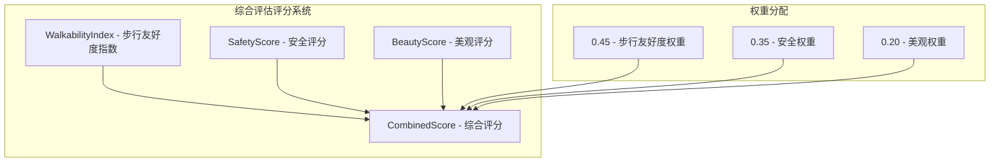
```mermaid
graph TB
subgraph "综合评估评分系统"
WS[WalkabilityIndex - 步行友好度指数]
SS[SafetyScore - 安全评分]
BS[BeautyScore - 美观评分]
CS[CombinedScore - 综合评分]
end
subgraph "权重分配"
W1[0.45 - 步行友好度权重]
W2[0.35 - 安全权重]
W3[0.20 - 美观权重]
end
WS --> CS
SS --> CS
BS --> CS
W1 --> CS
W2 --> CS
W3 --> CS
```

**图表来源**
- [iteration_controller.py:173-180](file://src/roadgen3d/auto_pipeline/iteration_controller.py#L173-L180)

### 评分计算流程

综合评分的计算遵循以下流程：

1. **数据准备**：从步行友好度、安全、美观评估结果中提取数值
2. **权重应用**：按照预设权重对各项指标进行加权
3. **数值合成**：将加权后的指标相加得到综合评分
4. **精度控制**：保留四位小数的精度

### WalkabilityResult数据结构

WalkabilityResult类提供了结构化的步行友好度评估结果：

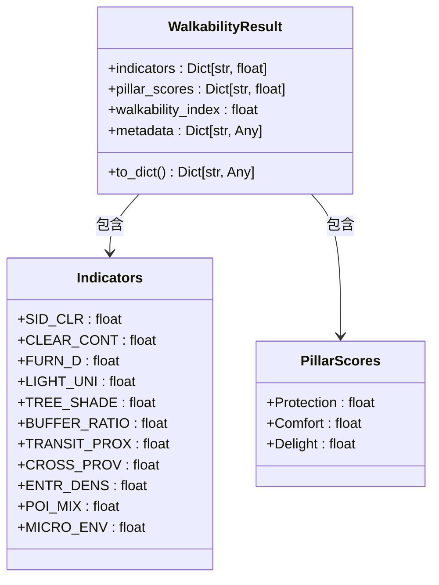
```mermaid
classDiagram
class WalkabilityResult {
+indicators : Dict[str, float]
+pillar_scores : Dict[str, float]
+walkability_index : float
+metadata : Dict[str, Any]
+to_dict() Dict[str, Any]
}
class Indicators {
+SID_CLR : float
+CLEAR_CONT : float
+FURN_D : float
+LIGHT_UNI : float
+TREE_SHADE : float
+BUFFER_RATIO : float
+TRANSIT_PROX : float
+CROSS_PROV : float
+ENTR_DENS : float
+POI_MIX : float
+MICRO_ENV : float
}
class PillarScores {
+Protection : float
+Comfort : float
+Delight : float
}
WalkabilityResult --> Indicators : 包含
WalkabilityResult --> PillarScores : 包含
```

**图表来源**
- [eval_quality.py:76-89](file://evaluation/src/roadgen3d/eval_quality.py#L76-L89)
- [eval_quality.py:192-249](file://evaluation/src/roadgen3d/eval_quality.py#L192-L249)

**章节来源**
- [iteration_controller.py:173-198](file://src/roadgen3d/auto_pipeline/iteration_controller.py#L173-L198)
- [eval_quality.py:76-89](file://evaluation/src/roadgen3d/eval_quality.py#L76-L89)
- [eval_quality.py:192-249](file://evaluation/src/roadgen3d/eval_quality.py#L192-L249)

## 步行友好度评估

### 指标体系

步行友好度评估模块提供了11个核心指标，基于步行行为学理论和城市设计原则。

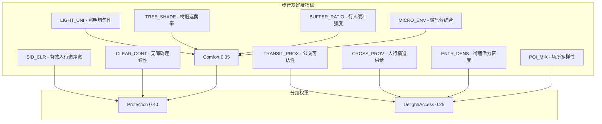
```mermaid
graph TB
subgraph "步行友好度指标"
A[SID_CLR - 有效人行道净宽]
B[CLEAR_CONT - 无障碍连续性]
C[FURN_D - 步行设施密度]
D[LIGHT_UNI - 照明均匀性]
E[TREE_SHADE - 树冠遮荫率]
F[BUFFER_RATIO - 行人缓冲强度]
G[TRANSIT_PROX - 公交可达性]
H[CROSS_PROV - 人行横道供给]
I[ENTR_DENS - 街墙活力密度]
J[POI_MIX - 场所多样性]
K[MICRO_ENV - 微气候综合]
end
subgraph "分组权重"
P[Protection 0.40]
C[Comfort 0.35]
D2[Delight/Access 0.25]
end
A --> P
B --> P
C --> P
D --> C
E --> C
F --> C
G --> D2
H --> D2
I --> D2
J --> D2
K --> C
```

**图表来源**
- [evaluation_module_plan.md:34-127](file://evaluation/docs/evaluation_module_plan.md#L34-L127)

### 计算方法

步行友好度指数通过加权平均计算得出：

```
WalkabilityIndex = 0.40 × mean(Protection) + 0.35 × mean(Comfort) + 0.25 × mean(Delight)
```

其中：
- **Protection**：`LIGHT_UNI`、`BUFFER_RATIO`、`CROSS_PROV`
- **Comfort**：`SID_CLR`、`CLEAR_CONT`、`TREE_SHADE`、`MICRO_ENV`
- **Delight**：`FURN_D`、`TRANSIT_PROX`、`ENTR_DENS`、`POI_MIX`

### WalkabilityResult类功能

WalkabilityResult类提供了完整的步行友好度评估结果封装：

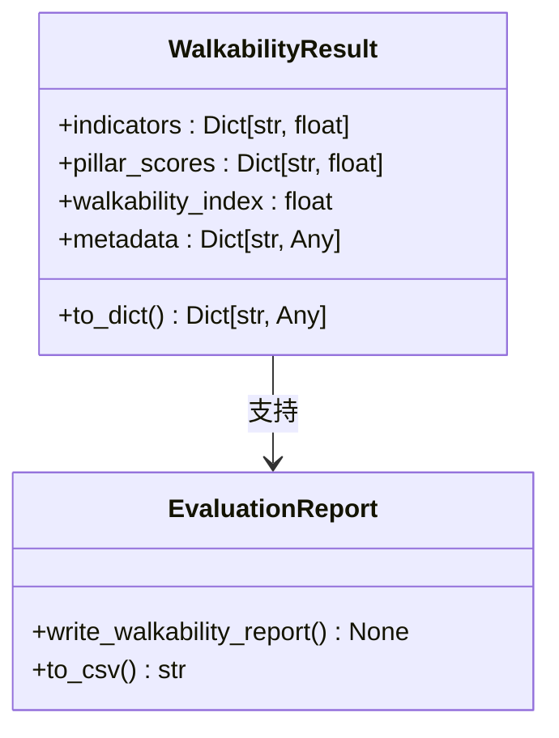
```mermaid
classDiagram
class WalkabilityResult {
+indicators : Dict[str, float]
+pillar_scores : Dict[str, float]
+walkability_index : float
+metadata : Dict[str, Any]
+to_dict() Dict[str, Any]
}
class EvaluationReport {
+write_walkability_report() None
+to_csv() str
}
WalkabilityResult --> EvaluationReport : 支持
```

**图表来源**
- [eval_quality.py:76-89](file://evaluation/src/roadgen3d/eval_quality.py#L76-L89)
- [eval_quality.py:252-254](file://evaluation/src/roadgen3d/eval_quality.py#L252-L254)

**章节来源**
- [evaluation_module_plan.md:107-117](file://evaluation/docs/evaluation_module_plan.md#L107-L117)
- [eval_quality.py:192-249](file://evaluation/src/roadgen3d/eval_quality.py#L192-L249)
- [eval_quality.py:76-89](file://evaluation/src/roadgen3d/eval_quality.py#L76-L89)

## 安全评估

### 结构化安全特征

安全评估模块基于CPTED理论和NACTO指南，提供结构化安全特征。

```mermaid
classDiagram
class SafetyFeatures {
+LIGHT_UNI : float
+CROSS_PROV : float
+BUFFER_RATIO : float
+BOLLARD_DENSITY : float
+VISIBILITY_PENALTY : float
+structural_score : float
+final_score : float
}
class SafetyReport {
+features : Dict[str, float]
+structural_score : float
+llm_scores : Any
+final_score : float
+llm_required : bool
}
SafetyFeatures --> SafetyReport : 组合
```

**图表来源**
- [eval_quality.py:261-297](file://evaluation/src/roadgen3d/eval_quality.py#L261-L297)

### 安全评分融合

安全评分采用结构化特征与LLM评估相结合的方法：

```
SafetyScore = 0.6 × mean(LLM_overall)
           + 0.15 × CROSS_PROV
           + 0.15 × LIGHT_UNI
           + 0.10 × BUFFER_RATIO
```

### 评估报告生成

安全评估报告支持结构化输出和JSON格式保存：

```mermaid
flowchart TD
Start([生成安全报告]) --> ExtractFeatures[提取安全特征]
ExtractFeatures --> ComputeStructural[计算结构化评分]
ComputeStructural --> LLMIntegration[LLM评估集成]
LLMIntegration --> Finalize[最终评分确定]
Finalize --> WriteReport[写入JSON报告]
WriteReport --> End([完成])
```

**图表来源**
- [eval_quality.py:261-297](file://evaluation/src/roadgen3d/eval_quality.py#L261-L297)
- [eval_quality.py:363-366](file://evaluation/src/roadgen3d/eval_quality.py#L363-L366)

**章节来源**
- [evaluation_module_plan.md:128-188](file://evaluation/docs/evaluation_module_plan.md#L128-L188)
- [eval_quality.py:261-297](file://evaluation/src/roadgen3d/eval_quality.py#L261-L297)

## 美观评估

### 场所吸引力指标

美观评估模块关注场所的视觉美感和吸引力。

```mermaid
classDiagram
class BeautyFeatures {
+ACTIVE_FRONT_RATIO : float
+ANCHOR_POI_SCORE : float
+style_coherence : float
+visual_clutter : float
+spacing_rhythm : float
+focal_readability : float
+presentation_score : float
}
class BeautyReport {
+features : Dict[str, float]
+structural_score : float
+llm_scores : Any
+final_score : float
+llm_required : bool
}
BeautyFeatures --> BeautyReport : 组合
```

**图表来源**
- [eval_quality.py:328-360](file://evaluation/src/roadgen3d/eval_quality.py#L328-L360)

### 美观评分融合

美观评分结合结构化指标和LLM评估：

```
BeautyScore = 0.4 × mean(LLM_metrics)
            + 0.4 × presentation_score
            + 0.1 × ACTIVE_FRONT_RATIO
            + 0.1 × ANCHOR_POI_SCORE
```

### 报告生成机制

美观评估报告支持结构化输出和详细指标分解：

```mermaid
flowchart TD
Start([生成美观报告]) --> ExtractFeatures[提取美观特征]
ExtractFeatures --> ComputeStructural[计算结构化评分]
ComputeStructural --> LLMIntegration[LLM评估集成]
LLMIntegration --> Finalize[最终评分确定]
Finalize --> WriteReport[写入JSON报告]
WriteReport --> End([完成])
```

**图表来源**
- [eval_quality.py:328-360](file://evaluation/src/roadgen3d/eval_quality.py#L328-L360)
- [eval_quality.py:363-366](file://evaluation/src/roadgen3d/eval_quality.py#L363-L366)

**章节来源**
- [evaluation_module_plan.md:189-230](file://evaluation/docs/evaluation_module_plan.md#L189-L230)
- [eval_quality.py:328-360](file://evaluation/src/roadgen3d/eval_quality.py#L328-L360)

## 数据流分析

### 输入数据流

系统接收多种类型的输入数据：

- **设计查询**：用户的自然语言设计要求
- **图形上下文**：从Viewer导出的路网图形数据
- **资产清单**：可用的3D资产元数据
- **模型配置**：CLIP模型和其他机器学习模型
- **设计配置补丁**：包含严格验证的设计参数
- **场景布局**：JSON格式的场景布局数据
- **评估配置**：步行友好度、安全、美观的评估参数
- **WalkabilityResult**：结构化的步行友好度评估结果

### 输出数据流

系统生成多层次的输出结果：

- **版本特定输出**：每个查询的迭代日志和中间结果
- **最终场景**：每个版本的最佳场景文件
- **综合报告**：包含所有版本表现的评估报告
- **验证日志**：记录数据验证和清理过程
- **配置差异**：两阶段评估间的配置变化分析
- **预览对比**：迭代间的预览图对比
- **HTML报告**：完整的可视化评估报告
- **评估指标**：步行友好度、安全、美观的详细指标
- **JSON报告**：结构化的评估结果数据
- **综合评分**：统一的加权评分结果

```mermaid
graph LR
subgraph "输入数据"
Q[设计查询]
G[图形上下文]
M[资产清单]
C[模型配置]
DP[设计配置补丁]
SL[场景布局]
E[评估配置]
WR[WalkabilityResult]
end
subgraph "处理过程"
P1[版本生成]
P2[严格枚举验证]
P3[迭代优化]
P4[评估分析]
P5[场景编辑]
P6[差异分析]
P7[质量评估]
P8[指标计算]
P9[综合评分]
end
subgraph "输出结果"
V[版本输出]
S[场景文件]
R[评估报告]
VL[验证日志]
CD[配置差异]
PC[预览对比]
HR[HTML报告]
ER[评估指标]
JR[JSON报告]
CS[综合评分]
end
Q --> P1
G --> P1
M --> P1
C --> P1
DP --> P2
P2 --> P3
P3 --> P4
P4 --> V
P4 --> S
P4 --> R
P4 --> VL
S --> P5
P5 --> P6
P6 --> CD
P6 --> PC
P6 --> HR
S --> P7
P7 --> P8
P8 --> ER
P8 --> JR
P9 --> CS
```

**图表来源**
- [run_auto_eval.py:161-216](file://scripts/run_auto_eval.py#L161-L216)
- [snapshot_diff.py:636-773](file://scripts/snapshot_diff.py#L636-L773)
- [iteration_controller.py:89-226](file://src/roadgen3d/auto_pipeline/iteration_controller.py#L89-L226)
- [design_types.py:71-98](file://src/roadgen3d/services/design_types.py#L71-L98)
- [eval_walkability.py:32-44](file://evaluation/scripts/eval_walkability.py#L32-L44)
- [iteration_controller.py:173-198](file://src/roadgen3d/auto_pipeline/iteration_controller.py#L173-L198)

**章节来源**
- [run_auto_eval.py:105-130](file://scripts/run_auto_eval.py#L105-L130)
- [snapshot_diff.py:636-773](file://scripts/snapshot_diff.py#L636-L773)
- [iteration_controller.py:121-168](file://src/roadgen3d/auto_pipeline/iteration_controller.py#L121-L168)
- [design_types.py:71-98](file://src/roadgen3d/services/design_types.py#L71-L98)
- [eval_walkability.py:32-44](file://evaluation/scripts/eval_walkability.py#L32-L44)

## 性能考虑

### 并行处理策略

系统采用以下性能优化策略：

- **版本级并行**：不同查询的版本可以并行处理
- **内存管理**：及时清理临时文件和缓存
- **资源限制**：通过最大迭代次数防止无限循环
- **验证缓存**：重复的验证操作可以被缓存
- **两阶段并行**：Phase 1和Phase 2可以独立优化
- **评估模块缓存**：评估结果可以被缓存以避免重复计算
- **批量处理**：工程评估脚本支持批量处理多个场景
- **数据类缓存**：WalkabilityResult等数据类结果可以被缓存

### 计算优化

- **早期停止**：连续两轮无改善时自动停止
- **缓存机制**：利用设计草稿缓存减少重复计算
- **增量更新**：只在必要时重新生成场景
- **验证优化**：枚举验证使用高效的集合查找
- **图像处理优化**：预览图渲染和对比图生成的性能优化
- **评估指标优化**：使用高效的数学计算和缓存策略
- **综合评分优化**：加权计算的向量化实现

### 存储优化

- **增量存储**：只保存必要的中间结果
- **压缩存储**：配置差异和评估结果的压缩存储
- **缓存策略**：FAISS索引和渲染结果的缓存机制
- **评估结果缓存**：步行友好度、安全、美观评估结果的缓存
- **报告文件优化**：WalkabilityResult的to_dict()方法提供高效的序列化

## 故障排除指南

### 常见问题及解决方案

1. **LLM API连接失败**
   - 检查环境变量配置
   - 验证网络连接
   - 查看重试机制日志

2. **场景生成失败**
   - 检查资产清单完整性
   - 验证模型文件存在性
   - 确认磁盘空间充足

3. **渲染器错误**
   - 安装matplotlib依赖
   - 检查图像文件权限
   - 验证输出目录可写

4. **枚举验证失败**
   - 检查设计配置字段的有效性
   - 确认枚举值符合允许的集合
   - 验证字符串格式和大小写

5. **场景编辑失败**
   - 检查JSON补丁格式
   - 验证布局文件完整性
   - 确认LLM响应格式正确

6. **两阶段评估异常**
   - 检查Phase 1结果有效性
   - 验证布局文件可编辑性
   - 确认两阶段数据传递正确

7. **评估模块错误**
   - 检查scene_layout.json格式
   - 验证评估配置参数
   - 确认评估依赖项完整

8. **工程评估失败**
   - 检查输入文件路径
   - 验证评估脚本参数
   - 确认输出目录权限

9. **综合评分计算错误**
   - 检查WalkabilityResult数据完整性
   - 验证安全和美观评分的有效性
   - 确认权重系数的正确性

10. **WalkabilityResult序列化失败**
    - 检查数据类型兼容性
    - 验证to_dict()方法的正确性
    - 确认JSON编码设置

### 调试工具

系统提供了完善的测试套件来验证各组件功能：

- **集成测试**：验证完整的多版本评估流程
- **单元测试**：测试单个组件的功能正确性
- **模拟测试**：使用模拟服务进行确定性测试
- **验证测试**：专门测试设计类型验证功能
- **snapshot-diff测试**：验证两阶段评估流程的正确性
- **评估模块测试**：验证步行友好度、安全、美观评估功能
- **工程评估测试**：验证批量评估流程的正确性
- **综合评分测试**：验证加权评分计算的正确性
- **数据类测试**：验证WalkabilityResult等数据类的功能

**章节来源**
- [test_auto_eval.py:448-521](file://tests/test_auto_eval.py#L448-L521)
- [test_design_runtime.py:1-377](file://tests/test_design_runtime.py#L1-L377)
- [test_snapshot_diff.py:221-302](file://tests/test_snapshot_diff.py#L221-L302)
- [test_m4_eval_metrics.py:1-163](file://tests/test_m4_eval_metrics.py#L1-L163)

## 结论

多版本自动评估系统为RoadGen3D项目提供了一个强大而灵活的设计评估框架。通过并行处理多个设计方案版本，系统能够快速比较不同设计策略的效果，并为用户提供全面的评估报告。

**最新进展**：系统现已集成了完整的评估模块，包括步行友好度、安全、美观三大维度的自动计算和报告生成，显著增强了系统的评估能力和自动化程度。新增的综合评估评分系统实现了统一的量化评估标准，为设计方案提供客观的比较基准。

### 主要优势

- **高效性**：支持批量处理多个设计方案版本
- **自动化**：完整的生成-评估-改进循环无需人工干预
- **可扩展性**：模块化设计便于功能扩展和维护
- **可靠性**：完善的错误处理和测试覆盖
- **数据完整性**：严格的设计类型验证确保系统稳定性
- **两阶段评估**：提供更精确和全面的评估结果
- **场景编辑能力**：支持渐进式布局改进和优化
- **自动化测试**：完整的测试套件确保系统质量
- **质量指标评估**：集成步行友好度、安全、美观三大维度的自动评估功能
- **详细报告输出**：生成包含11个步行指标、安全特征和美观指标的完整报告
- **工程化集成**：与M4工程评估脚本深度集成，支持批量自动化评估
- **综合评分系统**：实现加权评分算法，提供统一的评估标准
- **数据类封装**：使用WalkabilityResult等数据类提供结构化结果
- **布局编辑集成**：支持LLM驱动的场景布局改进和优化

### 技术创新

设计类型模块的严格枚举验证增强了系统的数据完整性保护：

- **枚举值验证**：确保只有有效的枚举值被接受
- **自动清理**：无效的配置会被自动清理和替换
- **错误预防**：在数据进入系统之前就阻止潜在问题
- **稳定性提升**：减少了因无效数据导致的系统错误

**评估模块集成**的引入进一步提升了系统的智能化水平：

- **多维度评估**：步行友好度、安全、美观三大维度的综合评估
- **结构化指标**：11个步行指标、安全特征和美观指标的详细分解
- **自动化报告**：完整的JSON和CSV格式报告输出
- **工程化流程**：与M4工程评估脚本的深度集成
- **LLM辅助**：支持LLM参与的安全和美观评估
- **可视化输出**：支持渲染图和指标图表的生成
- **综合评分系统**：实现统一的加权评分算法
- **数据类封装**：提供结构化的评估结果
- **布局编辑集成**：支持LLM驱动的场景改进

### 未来发展方向

- **增强LLM集成**：进一步优化与大语言模型的交互
- **性能优化**：提升大规模场景生成的效率
- **评估指标扩展**：增加更多维度的评估指标
- **用户界面改进**：提供更直观的结果展示和分析工具
- **验证机制完善**：继续扩展和优化数据验证功能
- **两阶段流程优化**：提升两阶段评估的效率和准确性
- **场景编辑能力增强**：支持更复杂的布局编辑操作
- **自动化测试扩展**：增加更多测试场景和边界条件
- **评估模块优化**：提升评估计算的准确性和效率
- **报告生成增强**：支持更多格式和更丰富的可视化输出
- **综合评分算法优化**：根据实际使用反馈调整权重系数
- **数据类功能扩展**：为WalkabilityResult等数据类增加更多实用方法

该系统为城市规划和街道设计领域提供了一个创新的技术解决方案，有助于提高设计质量和效率，同时确保系统的稳定性和可靠性。评估模块的集成使其成为目前最全面的街道设计评估系统之一，为设计师和规划师提供了强有力的技术支持。综合评估评分系统的引入进一步提升了系统的科学性和实用性，为设计方案的选择和优化提供了可靠的量化依据。