# 多版本自动评估系统

<cite>
**本文档引用的文件**
- [readme.md](file://readme.md)
- [run_auto_eval.py](file://scripts/run_auto_eval.py)
- [snapshot_diff.py](file://scripts/snapshot_diff.py)
- [iteration_controller.py](file://src/roadgen3d/auto_pipeline/iteration_controller.py)
- [graph_loader.py](file://src/roadgen3d/auto_pipeline/graph_loader.py)
- [design_workflow.py](file://src/roadgen3d/llm/design_workflow.py)
- [design_types.py](file://src/roadgen3d/services/design_types.py)
- [design_runtime.py](file://src/roadgen3d/services/design_runtime.py)
- [beauty.py](file://src/roadgen3d/beauty.py)
- [scene_renderer.py](file://src/roadgen3d/auto_pipeline/scene_renderer.py)
- [generation_api.py](file://src/roadgen3d/services/generation_api.py)
- [scene_layout_editor.py](file://src/roadgen3d/scene_layout_editor.py)
- [prompts.py](file://src/roadgen3d/llm/prompts.py)
- [test_auto_eval.py](file://tests/test_auto_eval.py)
- [test_design_runtime.py](file://tests/test_design_runtime.py)
- [test_snapshot_diff.py](file://tests/test_snapshot_diff.py)
</cite>

## 更新摘要
**变更内容**
- 新增snapshot-diff自动化测试套件，包含两阶段评估流程（Phase 1设计管道迭代评估 + Phase 2 LLM场景编辑循环）
- 集成新的场景布局编辑框架，支持JSON patch操作和渐进式布局改进
- 增强自动化测试覆盖，包括配置差异分析、预览图对比和HTML报告生成
- 改进数据完整性保护和错误处理机制
- 更新多版本评估流程以支持更严格的数据验证和可视化输出

## 目录
1. [项目概述](#项目概述)
2. [系统架构](#系统架构)
3. [核心组件分析](#核心组件分析)
4. [多版本评估流程](#多版本评估流程)
5. [两阶段评估流程](#两阶段评估流程)
6. [场景布局编辑框架](#场景布局编辑框架)
7. [数据流分析](#数据流分析)
8. [性能考虑](#性能考虑)
9. [故障排除指南](#故障排除指南)
10. [结论](#结论)

## 项目概述

多版本自动评估系统是RoadGen3D项目中的一个关键功能模块，专门用于批量生成和评估多个设计方案版本。该系统能够同时运行多个设计查询，每个查询都会独立执行完整的生成-迭代-评估循环，并最终生成综合评估报告。

**最新更新**：系统现已集成了snapshot-diff自动化测试套件，提供两阶段评估流程，包括设计管道迭代评估和LLM驱动的场景编辑循环，显著增强了系统的自动化测试能力和评估精度。

### 系统特性

- **批量处理能力**：支持同时运行多个设计查询，每个查询独立生成和评估
- **自动化迭代**：每个版本自动执行多轮生成、渲染、评估和改进循环
- **智能停止机制**：当连续两轮没有改善时自动停止，避免无效计算
- **综合报告生成**：自动生成包含所有版本表现的汇总报告
- **可视化输出**：为最佳结果生成展示视图
- **严格数据验证**：设计类型模块包含严格的枚举验证机制，确保数据完整性
- **两阶段评估**：支持设计管道迭代评估和LLM场景编辑循环的组合评估
- **场景布局编辑**：提供JSON patch操作和渐进式布局改进能力
- **自动化测试**：完整的snapshot-diff测试套件，支持配置差异分析和预览图对比

## 系统架构

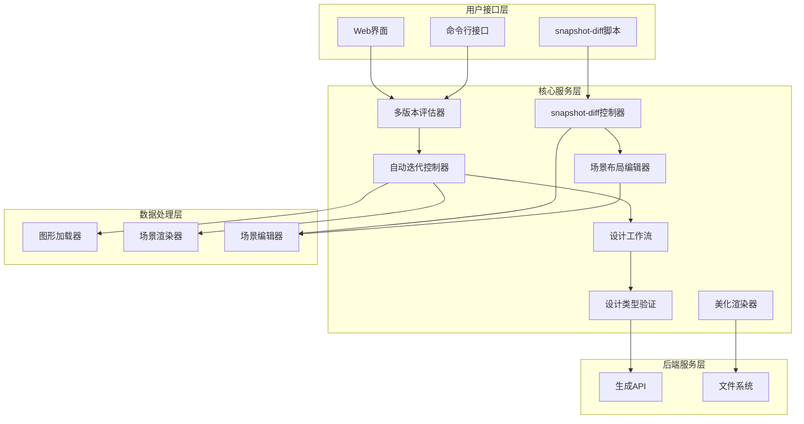

**图表来源**
- [run_auto_eval.py:161-216](file://scripts/run_auto_eval.py#L161-L216)
- [snapshot_diff.py:567-773](file://scripts/snapshot_diff.py#L567-L773)
- [iteration_controller.py:89-226](file://src/roadgen3d/auto_pipeline/iteration_controller.py#L89-L226)
- [design_workflow.py:311-350](file://src/roadgen3d/llm/design_workflow.py#L311-L350)
- [design_types.py:71-98](file://src/roadgen3d/services/design_types.py#L71-L98)
- [scene_layout_editor.py:10-57](file://src/roadgen3d/scene_layout_editor.py#L10-L57)

## 核心组件分析

### 多版本评估器 (AutoEvaluator)

多版本评估器是整个系统的核心协调器，负责管理多个版本的并行处理。

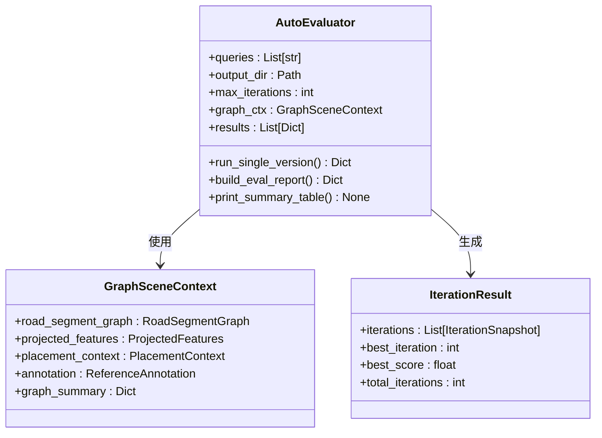

**图表来源**
- [run_auto_eval.py:161-216](file://scripts/run_auto_eval.py#L161-L216)
- [graph_loader.py:20-29](file://src/roadgen3d/auto_pipeline/graph_loader.py#L20-L29)

### snapshot-diff控制器

snapshot-diff控制器是新的两阶段评估流程的核心，负责协调设计管道迭代评估和LLM场景编辑循环。

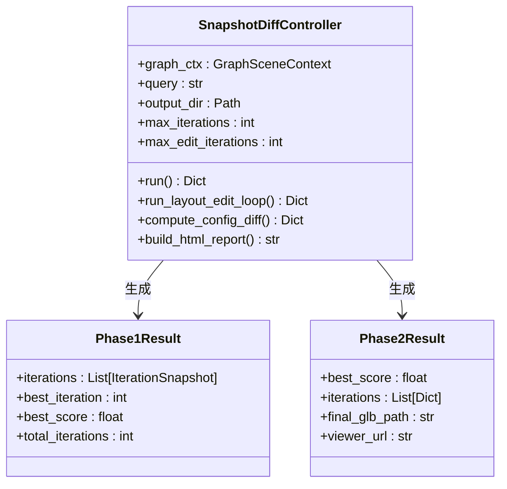

**图表来源**
- [snapshot_diff.py:567-773](file://scripts/snapshot_diff.py#L567-L773)
- [snapshot_diff.py:367-563](file://scripts/snapshot_diff.py#L367-L563)

### 自动迭代控制器

自动迭代控制器实现了完整的生成-评估-改进循环，是系统的核心执行引擎。

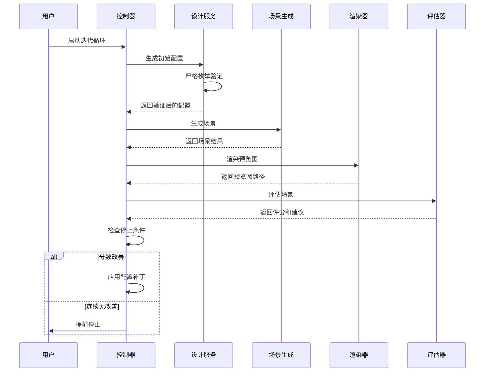

**图表来源**
- [iteration_controller.py:89-226](file://src/roadgen3d/auto_pipeline/iteration_controller.py#L89-L226)
- [design_workflow.py:311-350](file://src/roadgen3d/llm/design_workflow.py#L311-L350)
- [design_types.py:71-98](file://src/roadgen3d/services/design_types.py#L71-L98)

### 设计类型验证模块

设计类型验证模块提供了严格的数据验证和清理功能，确保只有有效的枚举值被接受。

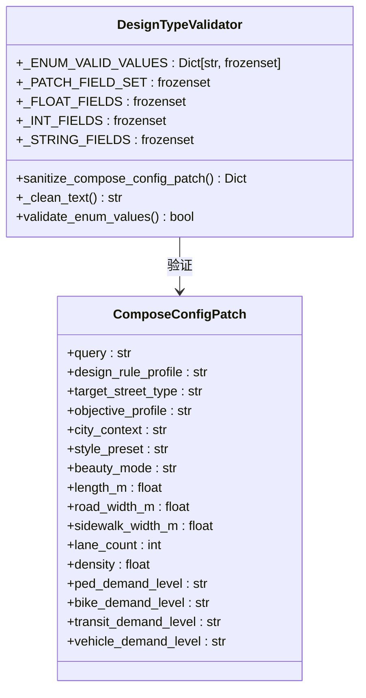

**图表来源**
- [design_types.py:37-63](file://src/roadgen3d/services/design_types.py#L37-L63)
- [design_types.py:71-98](file://src/roadgen3d/services/design_types.py#L71-L98)

**章节来源**
- [run_auto_eval.py:161-337](file://scripts/run_auto_eval.py#L161-L337)
- [snapshot_diff.py:567-773](file://scripts/snapshot_diff.py#L567-L773)
- [iteration_controller.py:48-226](file://src/roadgen3d/auto_pipeline/iteration_controller.py#L48-L226)
- [design_types.py:71-98](file://src/roadgen3d/services/design_types.py#L71-L98)

## 多版本评估流程

### 流程概述

多版本自动评估系统遵循以下标准化流程：

1. **初始化阶段**：构建共享的图形上下文和评估配置
2. **版本生成**：为每个查询独立运行完整的迭代循环
3. **严格验证**：在每次迭代中应用设计类型验证
4. **结果收集**：收集所有版本的迭代日志和最终结果
5. **报告生成**：创建综合评估报告和摘要表格

### 关键实现细节

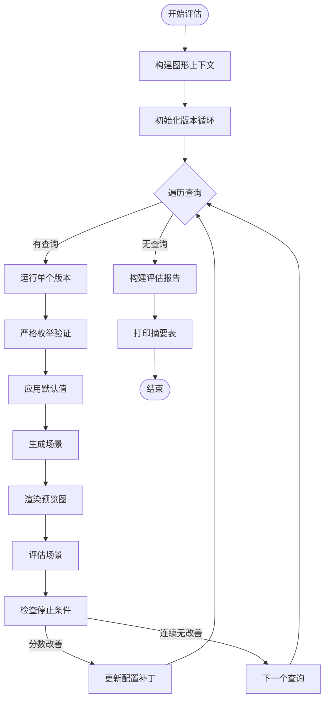

**图表来源**
- [run_auto_eval.py:298-332](file://scripts/run_auto_eval.py#L298-L332)
- [design_types.py:71-98](file://src/roadgen3d/services/design_types.py#L71-L98)

**章节来源**
- [run_auto_eval.py:289-332](file://scripts/run_auto_eval.py#L289-L332)
- [design_types.py:71-98](file://src/roadgen3d/services/design_types.py#L71-L98)

## 两阶段评估流程

### Phase 1：设计管道迭代评估

Phase 1与传统的AutoIterationController流程相同，专注于通过LLM驱动的设计管道进行迭代优化。

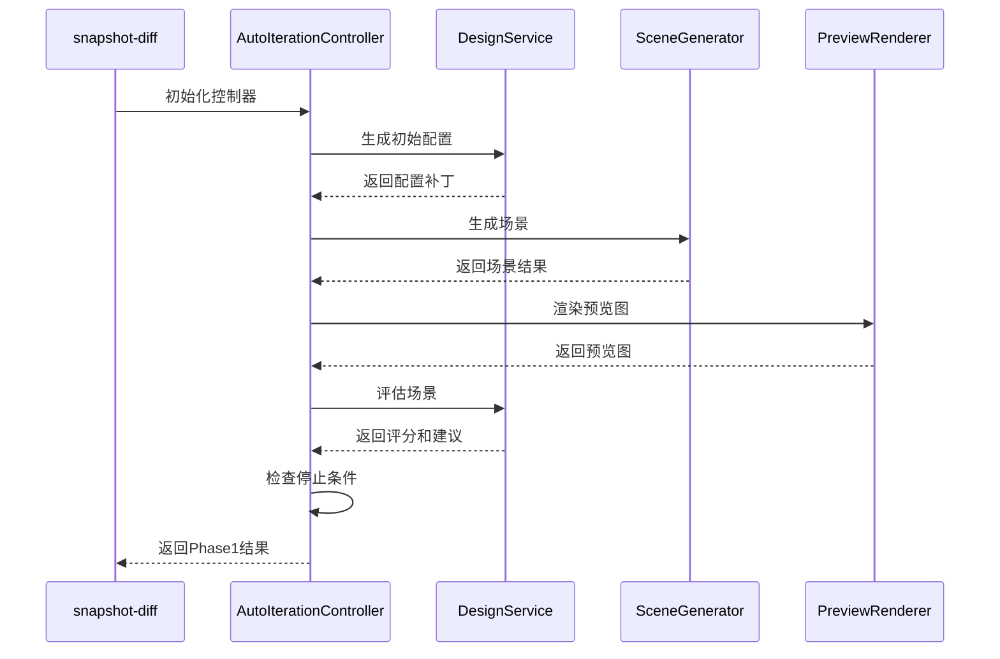

**图表来源**
- [snapshot_diff.py:598-611](file://scripts/snapshot_diff.py#L598-L611)
- [iteration_controller.py:89-226](file://src/roadgen3d/auto_pipeline/iteration_controller.py#L89-L226)

### Phase 2：LLM场景编辑循环

Phase 2是新增的第二阶段，通过LLM驱动的场景编辑器进行渐进式布局改进。

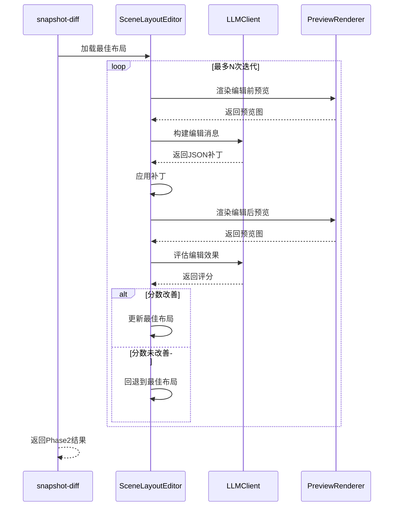

**图表来源**
- [snapshot_diff.py:367-563](file://scripts/snapshot_diff.py#L367-L563)
- [scene_layout_editor.py:10-57](file://src/roadgen3d/scene_layout_editor.py#L10-L57)
- [prompts.py:214-300](file://src/roadgen3d/llm/prompts.py#L214-L300)

### 两阶段整合

两阶段流程通过snapshot-diff控制器进行统一管理，最终生成综合报告。

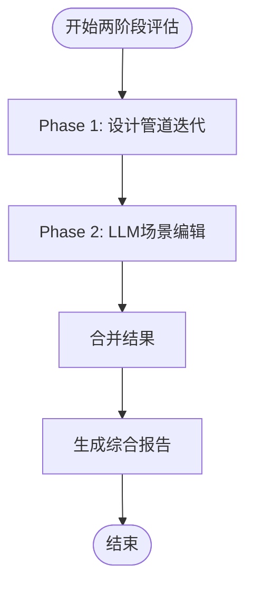

**图表来源**
- [snapshot_diff.py:567-773](file://scripts/snapshot_diff.py#L567-L773)

**章节来源**
- [snapshot_diff.py:567-773](file://scripts/snapshot_diff.py#L567-L773)
- [snapshot_diff.py:367-563](file://scripts/snapshot_diff.py#L367-L563)
- [scene_layout_editor.py:10-57](file://src/roadgen3d/scene_layout_editor.py#L10-L57)

## 场景布局编辑框架

### JSON补丁操作

场景布局编辑框架提供了强大的JSON补丁操作能力，支持渐进式布局改进。

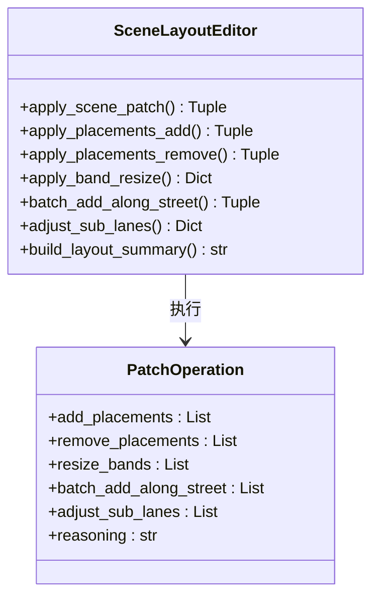

**图表来源**
- [scene_layout_editor.py:10-57](file://src/roadgen3d/scene_layout_editor.py#L10-L57)
- [scene_layout_editor.py:290-346](file://src/roadgen3d/scene_layout_editor.py#L290-L346)

### 布局摘要生成

系统能够自动生成布局摘要，为LLM提供上下文信息。

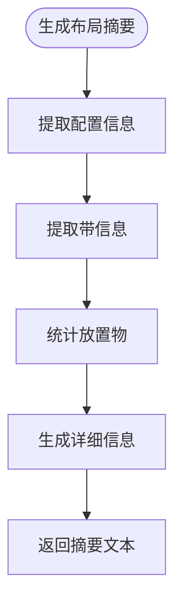

**图表来源**
- [scene_layout_editor.py:209-265](file://src/roadgen3d/scene_layout_editor.py#L209-L265)

### LLM提示工程

系统集成了专门的LLM提示模板，支持场景编辑和评估。

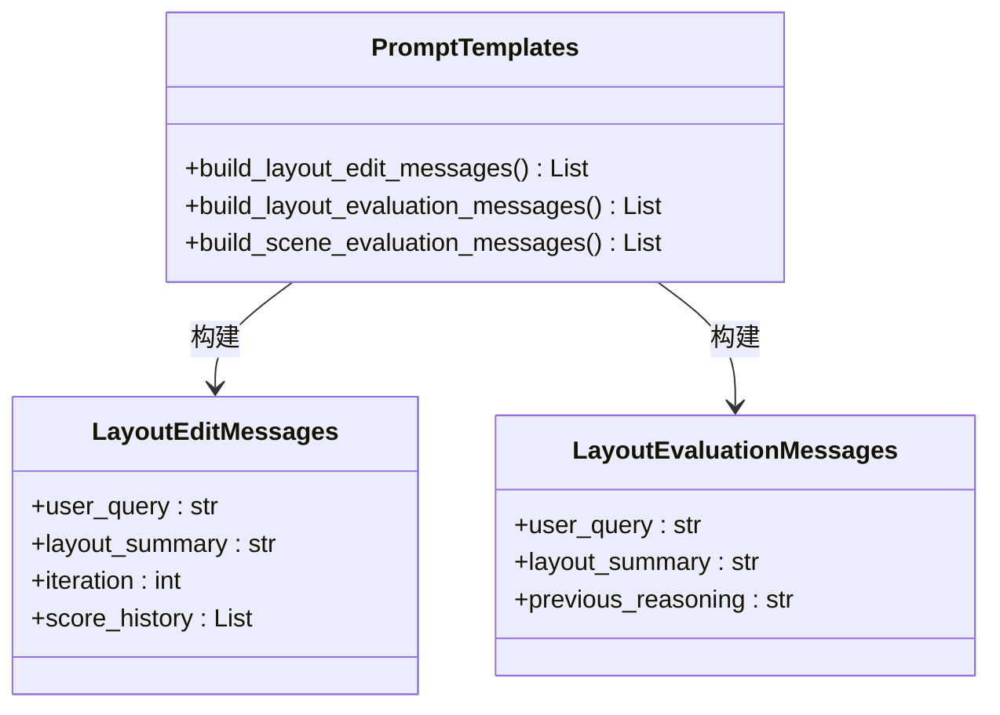

**图表来源**
- [prompts.py:214-300](file://src/roadgen3d/llm/prompts.py#L214-L300)
- [prompts.py:303-354](file://src/roadgen3d/llm/prompts.py#L303-L354)

**章节来源**
- [scene_layout_editor.py:10-390](file://src/roadgen3d/scene_layout_editor.py#L10-L390)
- [prompts.py:214-354](file://src/roadgen3d/llm/prompts.py#L214-L354)

## 数据流分析

### 输入数据流

系统接收多种类型的输入数据：

- **设计查询**：用户的自然语言设计要求
- **图形上下文**：从Viewer导出的路网图形数据
- **资产清单**：可用的3D资产元数据
- **模型配置**：CLIP模型和其他机器学习模型
- **设计配置补丁**：包含严格验证的设计参数
- **场景布局**：JSON格式的场景布局数据

### 输出数据流

系统生成多层次的输出结果：

- **版本特定输出**：每个查询的迭代日志和中间结果
- **最终场景**：每个版本的最佳场景文件
- **综合报告**：包含所有版本表现的评估报告
- **验证日志**：记录数据验证和清理过程
- **配置差异**：两阶段评估间的配置变化分析
- **预览对比**：迭代间的预览图对比
- **HTML报告**：完整的可视化评估报告

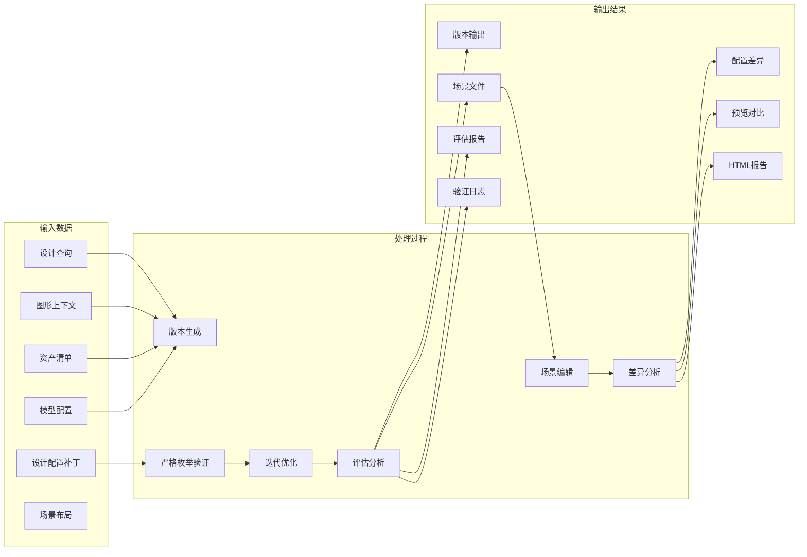

**图表来源**
- [run_auto_eval.py:161-216](file://scripts/run_auto_eval.py#L161-L216)
- [snapshot_diff.py:636-773](file://scripts/snapshot_diff.py#L636-L773)
- [iteration_controller.py:89-226](file://src/roadgen3d/auto_pipeline/iteration_controller.py#L89-L226)
- [design_types.py:71-98](file://src/roadgen3d/services/design_types.py#L71-L98)

**章节来源**
- [run_auto_eval.py:105-130](file://scripts/run_auto_eval.py#L105-L130)
- [snapshot_diff.py:636-773](file://scripts/snapshot_diff.py#L636-L773)
- [iteration_controller.py:121-168](file://src/roadgen3d/auto_pipeline/iteration_controller.py#L121-L168)
- [design_types.py:71-98](file://src/roadgen3d/services/design_types.py#L71-L98)

## 性能考虑

### 并行处理策略

系统采用以下性能优化策略：

- **版本级并行**：不同查询的版本可以并行处理
- **内存管理**：及时清理临时文件和缓存
- **资源限制**：通过最大迭代次数防止无限循环
- **验证缓存**：重复的验证操作可以被缓存
- **两阶段并行**：Phase 1和Phase 2可以独立优化

### 计算优化

- **早期停止**：连续两轮无改善时自动停止
- **缓存机制**：利用设计草稿缓存减少重复计算
- **增量更新**：只在必要时重新生成场景
- **验证优化**：枚举验证使用高效的集合查找
- **图像处理优化**：预览图渲染和对比图生成的性能优化

### 存储优化

- **增量存储**：只保存必要的中间结果
- **压缩存储**：配置差异和评估结果的压缩存储
- **缓存策略**：FAISS索引和渲染结果的缓存机制

## 故障排除指南

### 常见问题及解决方案

1. **LLM API连接失败**
   - 检查环境变量配置
   - 验证网络连接
   - 查看重试机制日志

2. **场景生成失败**
   - 检查资产清单完整性
   - 验证模型文件存在性
   - 确认磁盘空间充足

3. **渲染器错误**
   - 安装matplotlib依赖
   - 检查图像文件权限
   - 验证输出目录可写

4. **枚举验证失败**
   - 检查设计配置字段的有效性
   - 确认枚举值符合允许的集合
   - 验证字符串格式和大小写

5. **场景编辑失败**
   - 检查JSON补丁格式
   - 验证布局文件完整性
   - 确认LLM响应格式正确

6. **两阶段评估异常**
   - 检查Phase 1结果有效性
   - 验证布局文件可编辑性
   - 确认两阶段数据传递正确

### 调试工具

系统提供了完善的测试套件来验证各组件功能：

- **集成测试**：验证完整的多版本评估流程
- **单元测试**：测试单个组件的功能正确性
- **模拟测试**：使用模拟服务进行确定性测试
- **验证测试**：专门测试设计类型验证功能
- **snapshot-diff测试**：验证两阶段评估流程的正确性

**章节来源**
- [test_auto_eval.py:448-521](file://tests/test_auto_eval.py#L448-L521)
- [test_design_runtime.py:1-377](file://tests/test_design_runtime.py#L1-L377)
- [test_snapshot_diff.py:221-302](file://tests/test_snapshot_diff.py#L221-L302)

## 结论

多版本自动评估系统为RoadGen3D项目提供了一个强大而灵活的设计评估框架。通过并行处理多个设计方案版本，系统能够快速比较不同设计策略的效果，并为用户提供全面的评估报告。

**最新进展**：新增的snapshot-diff自动化测试套件显著增强了系统的评估能力，通过两阶段评估流程（Phase 1设计管道迭代评估 + Phase 2 LLM场景编辑循环）提供了更精确和全面的评估结果。

### 主要优势

- **高效性**：支持批量处理多个设计方案版本
- **自动化**：完整的生成-评估-改进循环无需人工干预
- **可扩展性**：模块化设计便于功能扩展和维护
- **可靠性**：完善的错误处理和测试覆盖
- **数据完整性**：严格的设计类型验证确保系统稳定性
- **两阶段评估**：提供更精确和全面的评估结果
- **场景编辑能力**：支持渐进式布局改进和优化
- **自动化测试**：完整的测试套件确保系统质量

### 技术创新

设计类型模块的严格枚举验证增强了系统的数据完整性保护：

- **枚举值验证**：确保只有有效的枚举值被接受
- **自动清理**：无效的配置会被自动清理和替换
- **错误预防**：在数据进入系统之前就阻止潜在问题
- **稳定性提升**：减少了因无效数据导致的系统错误

**两阶段评估流程**的引入进一步提升了系统的智能化水平：

- **渐进式优化**：通过LLM驱动的场景编辑实现持续改进
- **多维度评估**：结合设计管道和场景编辑的综合评估
- **可视化反馈**：提供详细的配置差异和预览对比
- **自动化报告**：生成完整的HTML可视化报告

### 未来发展方向

- **增强LLM集成**：进一步优化与大语言模型的交互
- **性能优化**：提升大规模场景生成的效率
- **评估指标扩展**：增加更多维度的评估指标
- **用户界面改进**：提供更直观的结果展示和分析工具
- **验证机制完善**：继续扩展和优化数据验证功能
- **两阶段流程优化**：提升两阶段评估的效率和准确性
- **场景编辑能力增强**：支持更复杂的布局编辑操作
- **自动化测试扩展**：增加更多测试场景和边界条件

该系统为城市规划和街道设计领域提供了一个创新的技术解决方案，有助于提高设计质量和效率，同时确保系统的稳定性和可靠性。两阶段评估流程的引入使其成为目前最全面的街道设计评估系统之一。