# 自动场景生成流水线

<cite>
**本文档引用的文件**
- [README.md](file://README.md)
- [README_M1.md](file://README_M1.md)
- [scripts/auto_scene_pipeline.py](file://scripts/auto_scene_pipeline.py)
- [scripts/snapshot_diff.py](file://scripts/snapshot_diff.py)
- [scripts/run_auto_eval.py](file://scripts/run_auto_eval.py)
- [src/roadgen3d/auto_pipeline/iteration_controller.py](file://src/roadgen3d/auto_pipeline/iteration_controller.py)
- [src/roadgen3d/auto_pipeline/graph_loader.py](file://src/roadgen3d/auto_pipeline/graph_loader.py)
- [src/roadgen3d/auto_pipeline/scene_renderer.py](file://src/roadgen3d/auto_pipeline/scene_renderer.py)
- [src/roadgen3d/services/design_runtime.py](file://src/roadgen3d/services/design_runtime.py)
- [src/roadgen3d/services/generation_core.py](file://src/roadgen3d/services/generation_core.py)
- [src/roadgen3d/services/generation_api.py](file://src/roadgen3d/services/generation_api.py)
- [src/roadgen3d/llm/design_workflow.py](file://src/roadgen3d/llm/design_workflow.py)
- [src/roadgen3d/llm/prompts.py](file://src/roadgen3d/llm/prompts.py)
- [src/roadgen3d/beauty.py](file://src/roadgen3d/beauty.py)
- [src/roadgen3d/street_layout.py](file://src/roadgen3d/street_layout.py)
- [src/roadgen3d/types.py](file://src/roadgen3d/types.py)
- [src/roadgen3d/services/design_types.py](file://src/roadgen3d/services/design_types.py)
- [src/roadgen3d/services/scene_backends.py](file://src/roadgen3d/services/scene_backends.py)
- [evaluation/src/roadgen3d/eval_quality.py](file://evaluation/src/roadgen3d/eval_quality.py)
- [evaluation/scripts/eval_walkability.py](file://evaluation/scripts/eval_walkability.py)
- [evaluation/README.md](file://evaluation/README.md)
- [src/roadgen3d/eval_metrics.py](file://src/roadgen3d/eval_metrics.py)
</cite>

## 更新摘要
**变更内容**
- 新增评估模块集成，包括步行友好度、安全性和美观度三个维度的综合评估
- 增强的迭代控制器，支持结构化评估指标的计算和跟踪
- LLM场景编辑集成，支持布局修改建议和实时评估
- 评估报告生成，包括walkability、safety和beauty报告的自动生成和保存
- 多版本自动评估流水线，支持批量场景生成和比较

## 目录
1. [项目概述](#项目概述)
2. [项目结构](#项目结构)
3. [核心组件](#核心组件)
4. [架构总览](#架构总览)
5. [详细组件分析](#详细组件分析)
6. [新增功能：评估模块集成](#新增功能评估模块集成)
7. [新增功能：LLM场景编辑集成](#新增功能llm场景编辑集成)
8. [新增功能：多版本自动评估流水线](#新增功能多版本自动评估流水线)
9. [依赖关系分析](#依赖关系分析)
10. [性能考虑](#性能考虑)
11. [故障排除指南](#故障排除指南)
12. [结论](#结论)

## 项目概述

RoadGen3D 是一个神经符号系统，能够将文本描述转换为详细的3D城市街道场景。该项目的核心能力包括：

- **文本到3D场景生成**：从自然语言查询生成完整的3D街道场景
- **自动场景生成流水线**：基于Viewer导出的路网图进行自动迭代优化
- **多阶段生成流程**：检索 → 组合 → 渲染预览 → LLM评估 → 改进
- **工程化流水线**：支持离线模式和在线模式的灵活部署
- **自动化评估能力**：提供完整的端到端测试流水线，包括实时LLM交互、快照差异计算、预览图像拼接和HTML报告生成
- **结构化评估模块**：集成步行友好度、安全性、美观度三大维度的量化评估指标
- **LLM场景编辑**：支持基于场景预览的智能布局修改建议和实时评估

该系统采用模块化设计，通过清晰的接口和数据流实现端到端的场景生成，并通过新增的评估模块显著增强了场景质量控制和持续改进能力。

## 项目结构

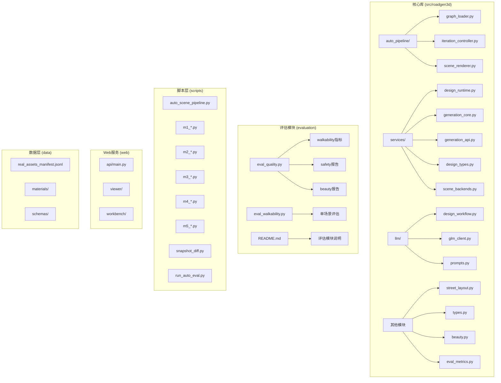

**图表来源**
- [README.md:191-220](file://README.md#L191-L220)
- [scripts/auto_scene_pipeline.py:1-136](file://scripts/auto_scene_pipeline.py#L1-L136)
- [scripts/snapshot_diff.py:1-608](file://scripts/snapshot_diff.py#L1-L608)
- [scripts/run_auto_eval.py:1-337](file://scripts/run_auto_eval.py#L1-L337)

**章节来源**
- [README.md:191-220](file://README.md#L191-L220)
- [README.md:222-271](file://README.md#L222-L271)

## 核心组件

### 自动流水线控制器
AutoIterationController负责协调整个自动场景生成循环，包括：
- LLM初始设计参数生成
- 场景渲染预览
- LLM评估和改进建议
- 结构化评估指标计算（步行友好度、安全性、美观度）
- 迭代控制和收敛判断

### 图形加载器
GraphSceneContext负责解析Viewer导出的图形JSON，提取路网信息、投影特征和放置上下文。

### 场景渲染器
提供matplotlib驱动的顶视图预览渲染，支持道路区域背景、街道家具标记和比例尺显示。

### 设计运行时
封装了从设计草稿到最终场景生成的完整流程，包括配置构建、场景生成和结果处理。

### 呈现视图渲染器
新增的呈现视图渲染器，基于样式预设和布局数据生成高质量的展示视图，包括平面图、轴测图等多角度渲染。

### 评估模块
集成的评估系统，包含：
- 步行友好度指标计算（11个指标）
- 安全性结构化报告
- 美观度结构化报告
- 综合评分计算和跟踪

**章节来源**
- [src/roadgen3d/auto_pipeline/iteration_controller.py:48-263](file://src/roadgen3d/auto_pipeline/iteration_controller.py#L48-L263)
- [src/roadgen3d/auto_pipeline/graph_loader.py:31-167](file://src/roadgen3d/auto_pipeline/graph_loader.py#L31-L167)
- [src/roadgen3d/auto_pipeline/scene_renderer.py:49-214](file://src/roadgen3d/auto_pipeline/scene_renderer.py#L49-L214)
- [src/roadgen3d/services/design_runtime.py:399-460](file://src/roadgen3d/services/design_runtime.py#L399-L460)
- [src/roadgen3d/beauty.py:2393-2421](file://src/roadgen3d/beauty.py#L2393-L2421)
- [evaluation/src/roadgen3d/eval_quality.py:192-250](file://evaluation/src/roadgen3d/eval_quality.py#L192-L250)

## 架构总览

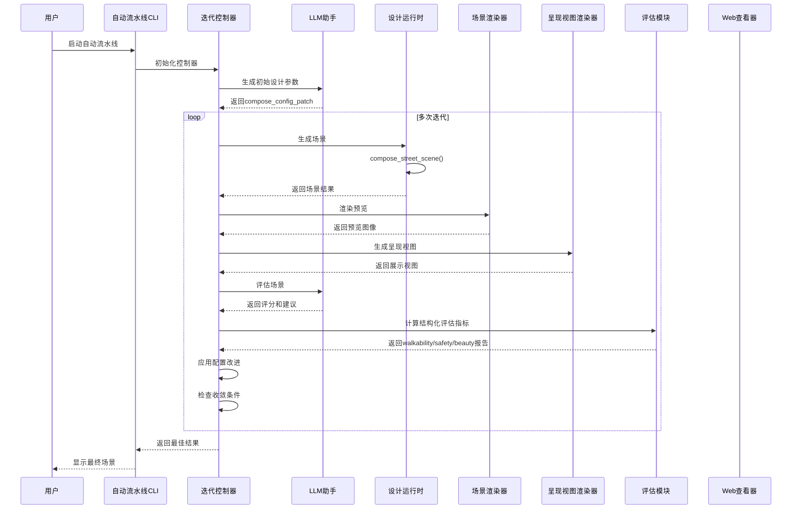

**图表来源**
- [scripts/auto_scene_pipeline.py:88-136](file://scripts/auto_scene_pipeline.py#L88-L136)
- [src/roadgen3d/auto_pipeline/iteration_controller.py:89-225](file://src/roadgen3d/auto_pipeline/iteration_controller.py#L89-L225)
- [src/roadgen3d/llm/design_workflow.py:311-383](file://src/roadgen3d/llm/design_workflow.py#L311-L383)

## 详细组件分析

### 自动迭代控制器

AutoIterationController实现了完整的生成-评估-改进循环，现在集成了结构化评估模块：

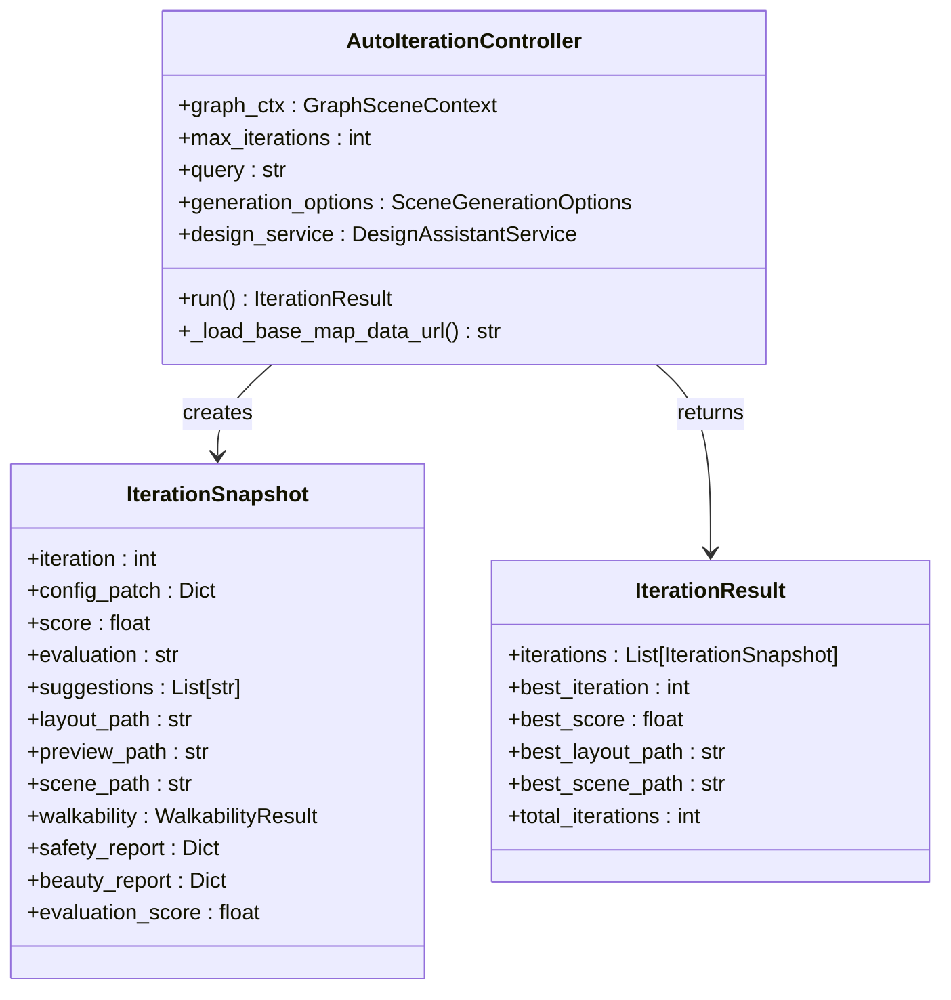

**图表来源**
- [src/roadgen3d/auto_pipeline/iteration_controller.py:48-263](file://src/roadgen3d/auto_pipeline/iteration_controller.py#L48-L263)

### 图形加载器

GraphSceneContext负责将Viewer导出的图形数据转换为场景生成所需的上下文：

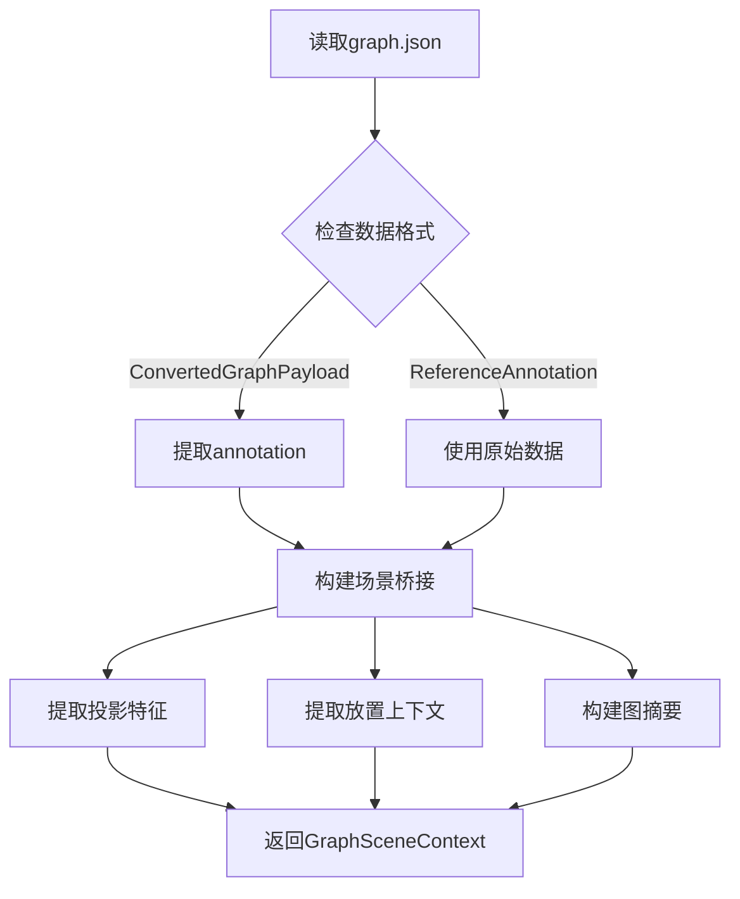

**图表来源**
- [src/roadgen3d/auto_pipeline/graph_loader.py:31-167](file://src/roadgen3d/auto_pipeline/graph_loader.py#L31-L167)

### 场景渲染器

顶视图渲染器提供了直观的场景预览功能：

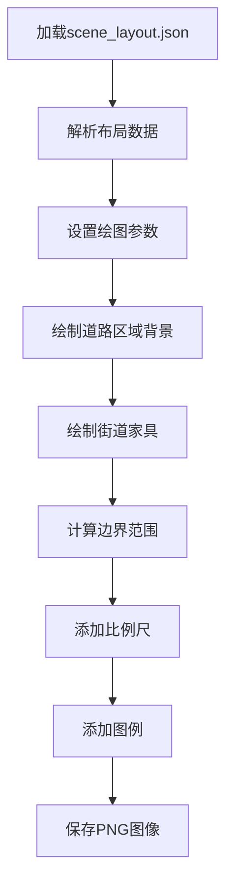

**图表来源**
- [src/roadgen3d/auto_pipeline/scene_renderer.py:49-128](file://src/roadgen3d/auto_pipeline/scene_renderer.py#L49-L128)

### 设计运行时

设计运行时封装了从草稿到场景的完整转换过程：

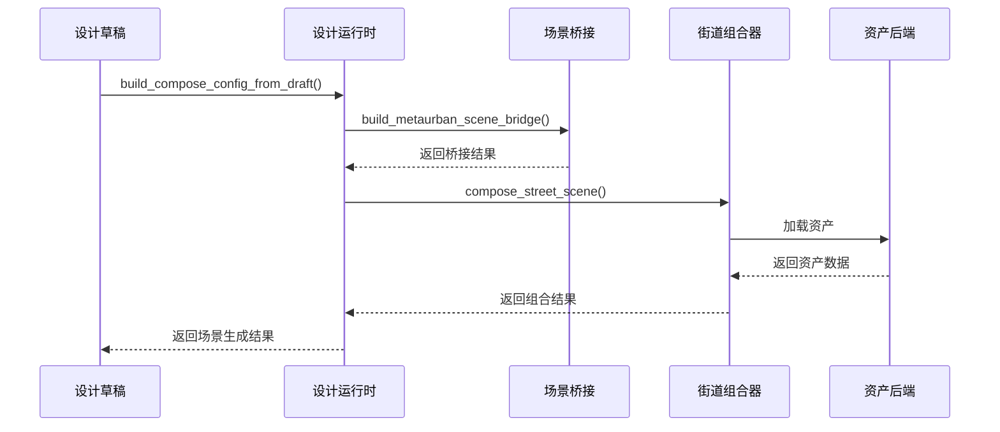

**图表来源**
- [src/roadgen3d/services/design_runtime.py:336-396](file://src/roadgen3d/services/design_runtime.py#L336-L396)

**章节来源**
- [src/roadgen3d/auto_pipeline/iteration_controller.py:89-225](file://src/roadgen3d/auto_pipeline/iteration_controller.py#L89-L225)
- [src/roadgen3d/auto_pipeline/graph_loader.py:31-167](file://src/roadgen3d/auto_pipeline/graph_loader.py#L31-L167)
- [src/roadgen3d/auto_pipeline/scene_renderer.py:49-128](file://src/roadgen3d/auto_pipeline/scene_renderer.py#L49-L128)
- [src/roadgen3d/services/design_runtime.py:336-396](file://src/roadgen3d/services/design_runtime.py#L336-L396)

## 新增功能：评估模块集成

### 功能概述

评估模块集成是一个完整的结构化评估系统，提供了以下核心功能：

- **步行友好度评估**：计算11个步行相关指标，包括道路清晰度、空间连续性、设施密度、照明均匀性等
- **安全性结构化报告**：基于光照、交叉口、缓冲区、护栏密度等特征计算结构化安全评分
- **美观度结构化报告**：整合视觉一致性、视觉杂乱度、间距节奏等表现指标
- **综合评分计算**：将LLM评分与结构化指标结合，形成0-10分的综合评估
- **评估报告生成**：自动生成walkability.json、safety.json、beauty.json等评估报告

### 核心组件

#### 步行友好度指标计算
计算场景的步行友好度指标，包括：

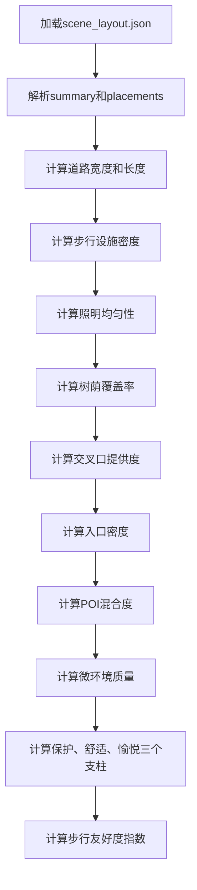

**图表来源**
- [evaluation/src/roadgen3d/eval_quality.py:192-250](file://evaluation/src/roadgen3d/eval_quality.py#L192-L250)

#### 安全性结构化报告
基于步行友好度指标和场景特征计算安全性评分：

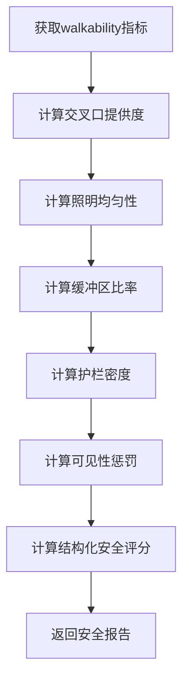

**图表来源**
- [evaluation/src/roadgen3d/eval_quality.py:261-297](file://evaluation/src/roadgen3d/eval_quality.py#L261-L297)

#### 美观度结构化报告
整合表现指标和场景特征计算美观度评分：

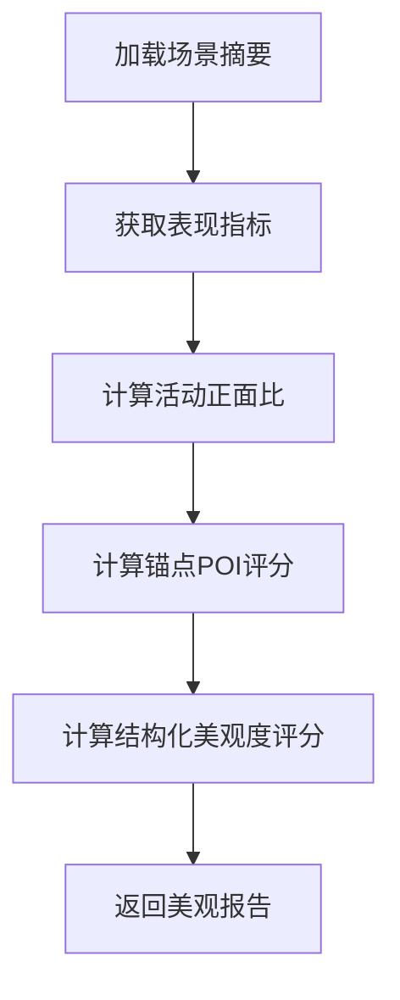

**图表来源**
- [evaluation/src/roadgen3d/eval_quality.py:328-360](file://evaluation/src/roadgen3d/eval_quality.py#L328-L360)

### 工作流程

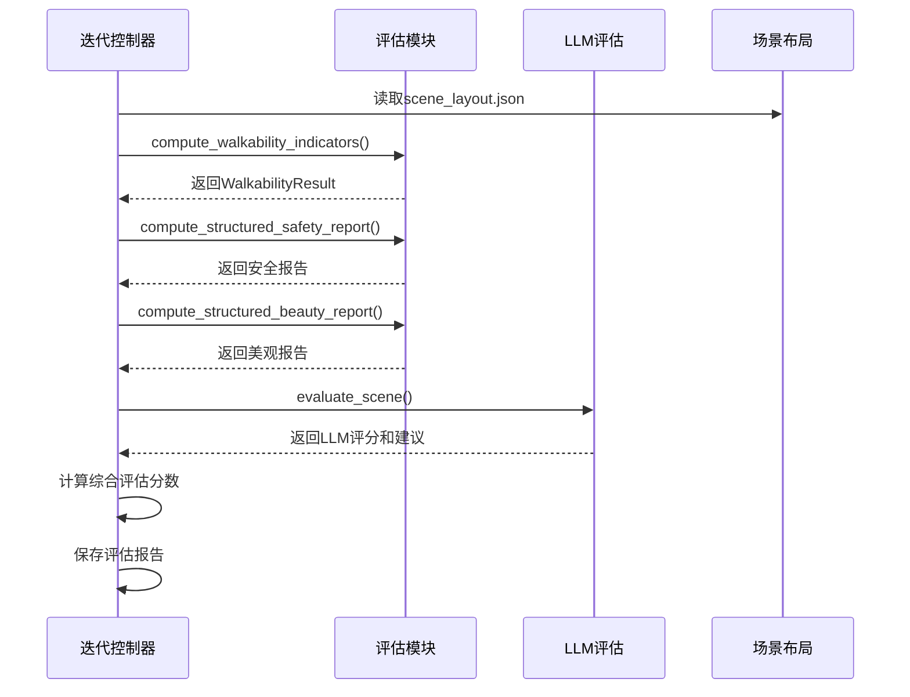

**图表来源**
- [src/roadgen3d/auto_pipeline/iteration_controller.py:165-200](file://src/roadgen3d/auto_pipeline/iteration_controller.py#L165-L200)

### 输出结构

评估模块生成以下结构化的输出：

- **walkability.json**：步行友好度指标和报告
- **safety.json**：安全性结构化报告
- **beauty.json**：美观度结构化报告
- **evaluation.json**：LLM综合评估结果

**章节来源**
- [evaluation/src/roadgen3d/eval_quality.py:192-250](file://evaluation/src/roadgen3d/eval_quality.py#L192-L250)
- [evaluation/src/roadgen3d/eval_quality.py:261-297](file://evaluation/src/roadgen3d/eval_quality.py#L261-L297)
- [evaluation/src/roadgen3d/eval_quality.py:328-360](file://evaluation/src/roadgen3d/eval_quality.py#L328-L360)
- [src/roadgen3d/auto_pipeline/iteration_controller.py:165-200](file://src/roadgen3d/auto_pipeline/iteration_controller.py#L165-L200)

## 新增功能：LLM场景编辑集成

### 功能概述

LLM场景编辑集成是一个智能的布局修改和评估系统，提供了以下核心功能：

- **布局编辑建议**：基于场景预览图和布局摘要，提出具体的布局修改建议
- **实时评估反馈**：对编辑后的场景进行质量评估和改进建议
- **渐进式改进**：支持多次迭代的渐进式场景优化
- **编辑历史跟踪**：记录每次编辑的原因和评分变化

### 核心组件

#### 布局编辑消息构建器
构建LLM编辑请求的消息格式：

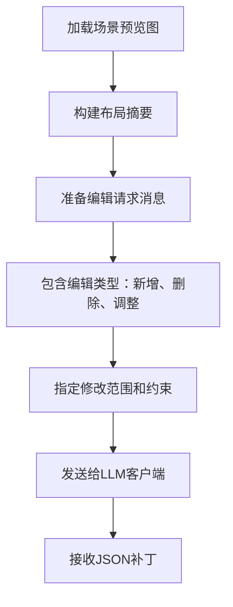

**图表来源**
- [src/roadgen3d/llm/prompts.py:214-300](file://src/roadgen3d/llm/prompts.py#L214-L300)

#### 布局评估消息构建器
构建LLM评估请求的消息格式：

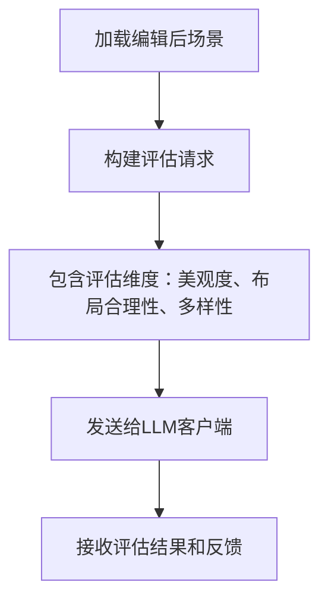

**图表来源**
- [src/roadgen3d/llm/prompts.py:303-354](file://src/roadgen3d/llm/prompts.py#L303-L354)

### 工作流程

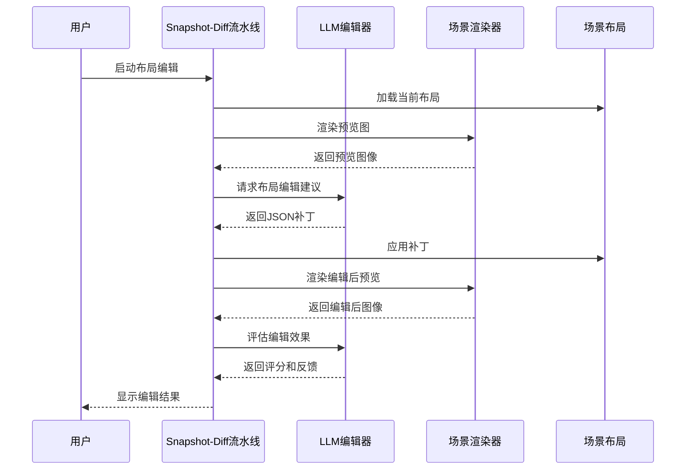

**图表来源**
- [scripts/snapshot_diff.py:376-445](file://scripts/snapshot_diff.py#L376-L445)

### 编辑类型

支持的布局编辑类型包括：

- **新增放置**：在合适的位置添加新的街道家具
- **删除放置**：移除不合适的元素
- **调整带宽**：重新分配道路各带的宽度
- **批量添加**：沿街道等距添加元素
- **子车道调整**：调整车行道的数量和宽度

**章节来源**
- [src/roadgen3d/llm/prompts.py:214-300](file://src/roadgen3d/llm/prompts.py#L214-L300)
- [src/roadgen3d/llm/prompts.py:303-354](file://src/roadgen3d/llm/prompts.py#L303-L354)
- [scripts/snapshot_diff.py:376-445](file://scripts/snapshot_diff.py#L376-L445)

## 新增功能：多版本自动评估流水线

### 功能概述

多版本自动评估流水线是一个批量场景生成和比较系统，提供了以下核心功能：

- **多查询支持**：同时运行多个设计查询的完整流水线
- **版本隔离**：每个查询生成独立的输出目录和结果
- **综合报告**：生成包含所有版本的综合评估报告
- **统计分析**：提供整体最佳分数、平均分数等统计信息

### 核心组件

#### 版本运行器
运行单个查询的完整流水线：

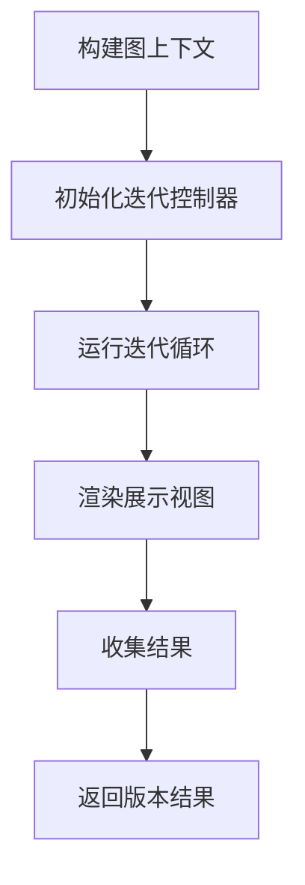

**图表来源**
- [scripts/run_auto_eval.py:161-216](file://scripts/run_auto_eval.py#L161-L216)

#### 综合报告生成器
构建包含所有版本的综合报告：

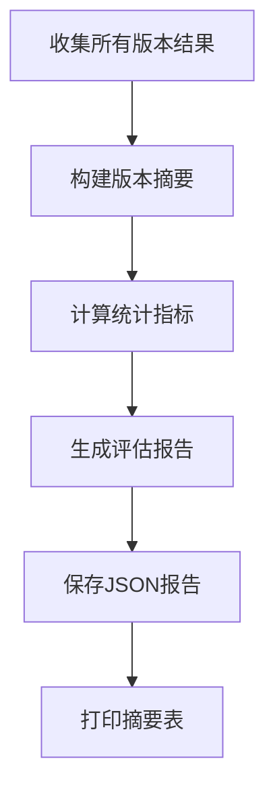

**图表来源**
- [scripts/run_auto_eval.py:105-155](file://scripts/run_auto_eval.py#L105-L155)

### 工作流程

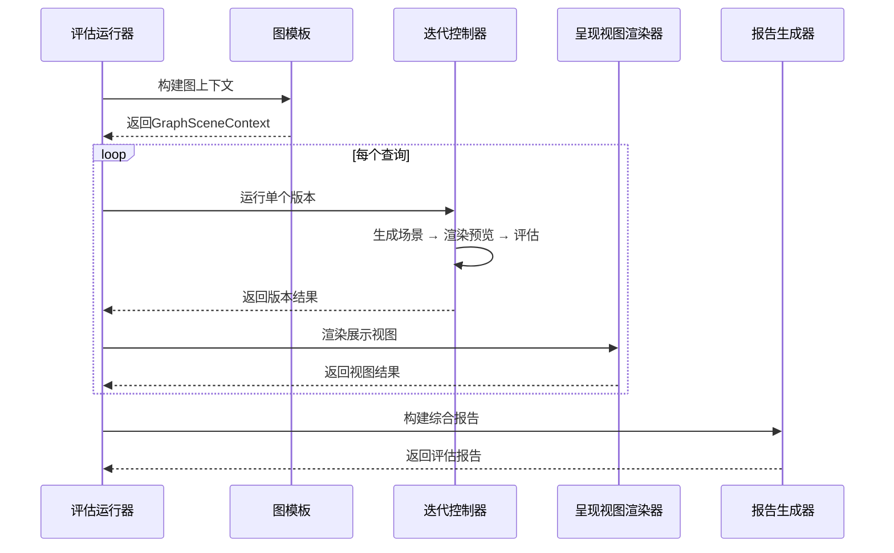

**图表来源**
- [scripts/run_auto_eval.py:272-337](file://scripts/run_auto_eval.py#L272-L337)

### 输出结构

多版本评估流水线生成以下结构化的输出：

- **version_00_*/**：每个查询的独立输出目录
- **eval_report.json**：包含所有版本的综合评估报告
- **summary表格**：终端中的摘要统计信息

**章节来源**
- [scripts/run_auto_eval.py:105-155](file://scripts/run_auto_eval.py#L105-L155)
- [scripts/run_auto_eval.py:161-216](file://scripts/run_auto_eval.py#L161-L216)
- [scripts/run_auto_eval.py:272-337](file://scripts/run_auto_eval.py#L272-L337)

## 依赖关系分析

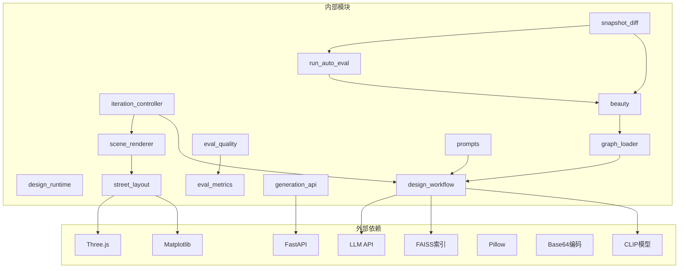

**图表来源**
- [src/roadgen3d/auto_pipeline/iteration_controller.py:12-19](file://src/roadgen3d/auto_pipeline/iteration_controller.py#L12-L19)
- [src/roadgen3d/services/design_runtime.py:11-34](file://src/roadgen3d/services/design_runtime.py#L11-L34)
- [src/roadgen3d/services/generation_api.py:14-25](file://src/roadgen3d/services/generation_api.py#L14-L25)
- [src/roadgen3d/beauty.py:2393-2421](file://src/roadgen3d/beauty.py#L2393-L2421)

系统的关键依赖包括：
- **CLIP文本编码器**：用于查询嵌入和检索
- **FAISS向量索引**：支持大规模资产检索
- **Matplotlib**：提供2D渲染功能
- **FastAPI**：提供RESTful API服务
- **Three.js**：Web场景查看器
- **Pillow**：图像处理和拼接功能
- **Base64编码**：HTML报告中的图片嵌入
- **LLM API**：用于场景评估和编辑建议

**章节来源**
- [src/roadgen3d/services/scene_backends.py:11-14](file://src/roadgen3d/services/scene_backends.py#L11-L14)
- [src/roadgen3d/services/generation_api.py:14-25](file://src/roadgen3d/services/generation_api.py#L14-L25)

## 性能考虑

### 计算优化
- **温度参数调优**：使用0.12的softmax温度参数平衡探索与利用
- **早期停止机制**：连续两轮无改进时提前终止
- **缓存策略**：LLM设计草稿缓存减少重复计算
- **增量索引构建**：FAISS索引只在缺失时构建，避免重复计算
- **评估指标缓存**：结构化评估指标的计算结果缓存

### 内存管理
- **渐进式输出**：每轮迭代独立输出，避免内存累积
- **资源清理**：及时关闭matplotlib图形句柄
- **路径解析**：统一的绝对路径解析避免重复计算
- **图像处理优化**：Pillow图像处理的内存管理
- **评估报告压缩**：JSON报告的压缩存储

### 并发处理
- **异步作业队列**：Web API支持后台任务执行
- **批处理优化**：FAISS检索支持批量查询
- **GPU加速**：可选的CUDA设备支持
- **并行图像处理**：多个迭代的图像处理可以并行执行
- **多版本并行**：run_auto_eval支持多个查询的并行处理

## 故障排除指南

### 常见问题及解决方案

**1. LLM相关错误**
- 检查环境变量配置（API密钥、基础URL）
- 验证网络连接和代理设置
- 确认模型可用性和版本兼容性
- 验证LLM API的响应格式

**2. 资产检索失败**
- 验证FAISS索引文件完整性
- 检查资产清单文件格式
- 确认CLIP模型文件存在且可访问

**3. 场景生成异常**
- 检查输入参数的有效性范围
- 验证资产文件路径正确性
- 确认渲染依赖库安装完整

**4. Web服务启动失败**
- 检查端口占用情况
- 验证依赖包安装状态
- 确认静态资源路径配置

**5. 评估模块异常**
- 验证评估指标计算的输入数据格式
- 检查walkability.json等评估报告的生成
- 确认结构化评估指标的数值范围

**6. LLM场景编辑失败**
- 验证布局补丁的应用逻辑
- 检查编辑消息的构建格式
- 确认LLM编辑建议的JSON格式

**7. 多版本评估异常**
- 验证每个版本的独立输出目录
- 检查综合报告的JSON格式
- 确认统计指标的计算逻辑

**章节来源**
- [src/roadgen3d/llm/design_workflow.py:385-388](file://src/roadgen3d/llm/design_workflow.py#L385-L388)
- [src/roadgen3d/services/design_runtime.py:399-460](file://src/roadgen3d/services/design_runtime.py#L399-L460)
- [scripts/snapshot_diff.py:166-169](file://scripts/snapshot_diff.py#L166-L169)
- [scripts/snapshot_diff.py:200-204](file://scripts/snapshot_diff.py#L200-L204)
- [evaluation/src/roadgen3d/eval_quality.py:192-250](file://evaluation/src/roadgen3d/eval_quality.py#L192-L250)

## 结论

RoadGen3D的自动场景生成流水线展现了现代AI驱动的3D内容生成系统的完整架构。通过新增的评估模块集成、LLM场景编辑集成和多版本自动评估流水线，系统进一步增强了以下关键特性：

### 技术优势
- **模块化设计**：清晰的组件分离便于维护和扩展
- **迭代优化**：基于LLM反馈的自适应改进机制
- **工程化实践**：完整的错误处理和性能优化
- **多平台支持**：CLI、Web API和可视化界面
- **自动化评估**：完整的端到端测试流水线
- **结构化评估**：步行友好度、安全性、美观度的量化评估
- **智能编辑**：基于场景预览的智能布局修改建议
- **批量评估**：多版本场景的批量生成和比较

### 应用价值
- **设计效率提升**：大幅缩短从概念到可视化的周期
- **质量保证**：系统化的评估和改进流程
- **成本控制**：离线模式支持本地部署
- **可扩展性**：模块化架构支持功能扩展
- **评估标准化**：统一的评估方法和报告格式
- **可视化分析**：直观的配置变化和效果对比
- **智能优化**：基于LLM的场景智能编辑能力

### 发展方向
- **算法优化**：引入更先进的布局策略和设计规则
- **性能提升**：GPU加速和分布式计算支持
- **用户体验**：增强交互式编辑和实时预览功能
- **生态集成**：与其他设计工具和工作流的深度集成
- **评估体系**：扩展更多维度的场景质量评估指标
- **自动化程度**：进一步减少人工干预，实现完全自动化的场景生成、评估和编辑
- **LLM能力增强**：支持更复杂的场景理解和编辑任务

该流水线为城市规划、景观设计和游戏开发等领域提供了强大的技术支持，是AI驱动内容生成技术的重要实践案例。新增的评估模块、LLM场景编辑和多版本评估流水线显著提升了系统的自动化评估能力、智能编辑能力和批量处理能力，为场景生成的质量控制、持续改进和规模化应用提供了强有力的技术支撑。