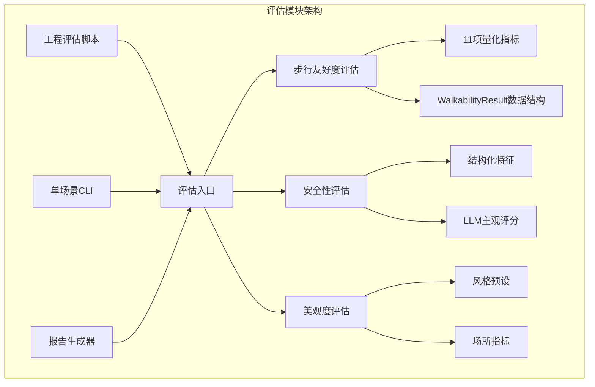
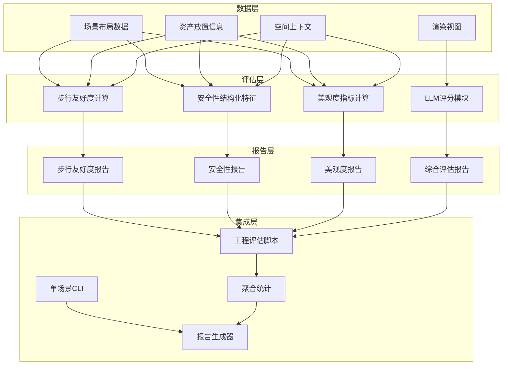
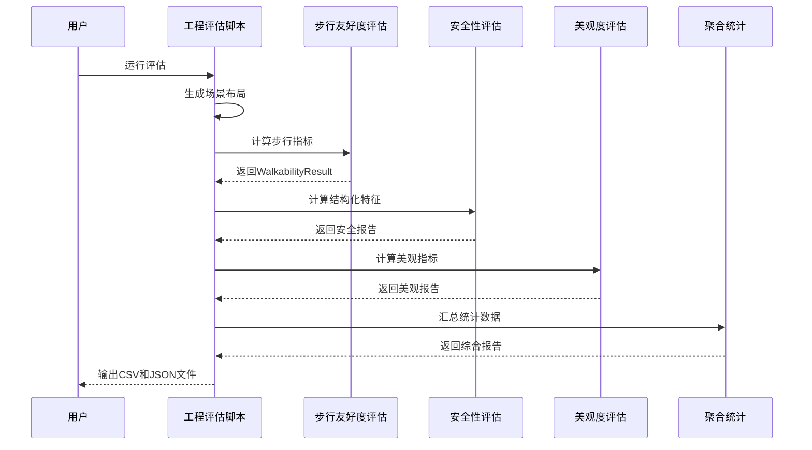
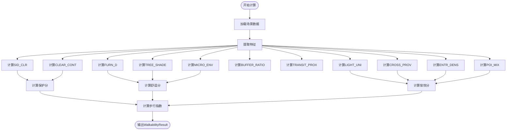
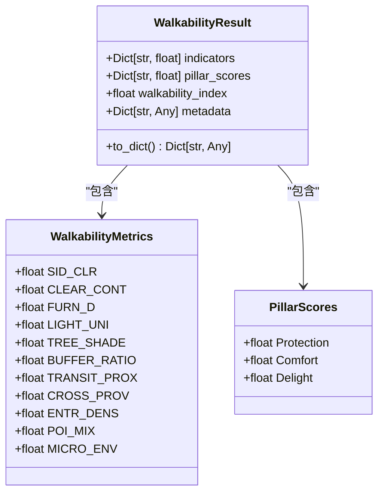
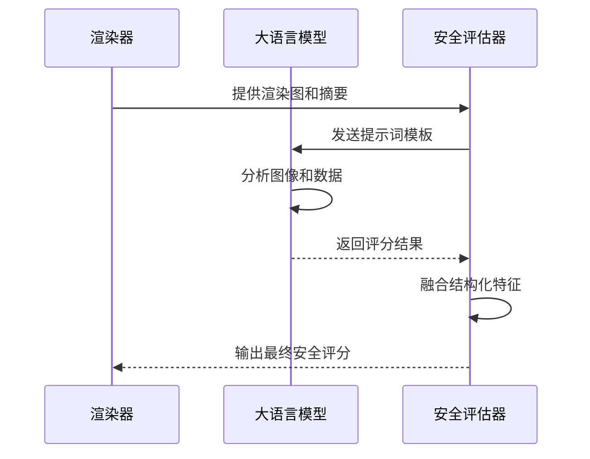
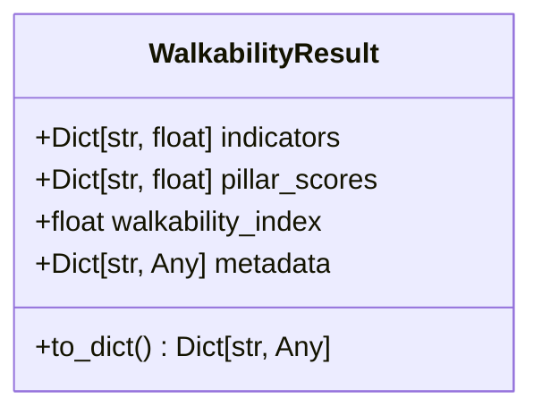
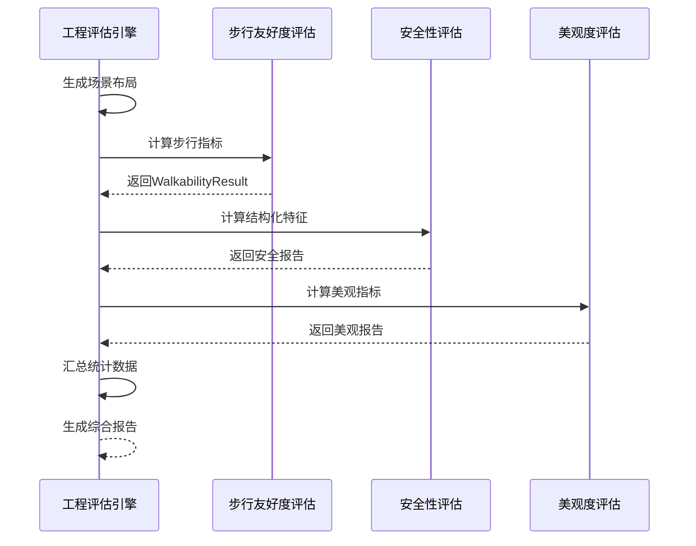
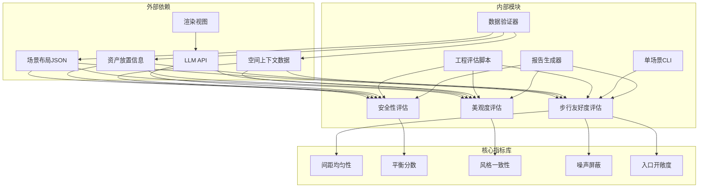

# 评估模块

<cite>
**本文档引用的文件**
- [evaluation/README.md](file://evaluation/README.md)
- [evaluation/src/roadgen3d/eval_quality.py](file://evaluation/src/roadgen3d/eval_quality.py)
- [evaluation/scripts/eval_walkability.py](file://evaluation/scripts/eval_walkability.py)
- [evaluation/docs/evaluation_module_plan.md](file://evaluation/docs/evaluation_module_plan.md)
- [src/roadgen3d/eval_metrics.py](file://src/roadgen3d/eval_metrics.py)
- [scripts/m4_10_eval_engineering.py](file://scripts/m4_10_eval_engineering.py)
- [src/roadgen3d/beauty.py](file://src/roadgen3d/beauty.py)
- [tests/test_m4_eval_metrics.py](file://tests/test_m4_eval_metrics.py)
</cite>

## 更新摘要
**变更内容**
- 新增 WalkabilityResult 数据结构和完整的步行友好度指标计算系统
- 扩展安全评估报告功能，包含结构化特征和LLM评分融合
- 完善美观评估报告系统，支持三种风格预设和场所指标
- 增强综合评估评分系统，支持批量工程评估和报告生成
- 更新数据流架构，支持LLM模块的无缝集成

## 目录
1. [简介](#简介)
2. [项目结构](#项目结构)
3. [核心组件](#核心组件)
4. [架构概览](#架构概览)
5. [详细组件分析](#详细组件分析)
6. [WalkabilityResult 数据结构](#walkabilityresult-数据结构)
7. [步行友好度评估系统](#步行友好度评估系统)
8. [安全评估报告系统](#安全评估报告系统)
9. [美观评估报告系统](#美观评估报告系统)
10. [综合评估评分系统](#综合评估评分系统)
11. [依赖关系分析](#依赖关系分析)
12. [性能考虑](#性能考虑)
13. [故障排除指南](#故障排除指南)
14. [结论](#结论)

## 简介

评估模块是 RoadGen3D 项目中的核心质量评估系统，负责对生成的城市街道场景进行全面的质量评估。该模块实现了三个主要维度的评估：步行友好度（Walkability）、安全性（Safety）和美观度（Beauty），为城市设计提供客观的量化指标。

评估模块基于 RoadGen3D 的场景布局数据，通过算法计算11个量化指标，结合结构化特征和LLM主观判断，最终输出综合评分。该系统支持单场景验证和批量工程评估，为设计优化提供数据支撑。

**更新** 新增了完整的 WalkabilityResult 数据结构，支持详细的步行友好度指标计算和报告生成。

## 项目结构

评估模块采用模块化设计，主要包含以下组件：



**图表来源**
- [evaluation/README.md:1-41](file://evaluation/README.md#L1-L41)
- [evaluation/src/roadgen3d/eval_quality.py:76-90](file://evaluation/src/roadgen3d/eval_quality.py#L76-L90)

**章节来源**
- [evaluation/README.md:1-41](file://evaluation/README.md#L1-L41)
- [evaluation/docs/evaluation_module_plan.md:13-26](file://evaluation/docs/evaluation_module_plan.md#L13-L26)

## 核心组件

评估模块包含三个核心组件，每个组件都有明确的功能分工：

### 1. 步行友好度评估系统

步行友好度评估系统实现了11个量化指标，基于Cervero和Kockelman的"密度、多样性、设计"理论框架，将步行环境分解为三个维度：

- **保护（Protection）**：0.40权重，包括照明均匀性、缓冲带强度、人行横道供给
- **舒适（Comfort）**：0.35权重，包括人行道净宽、无障碍连续性、树荫遮蔽、微气候综合
- **愉悦/可达（Delight/Access）**：0.25权重，包括步行设施密度、公交可达性、入口密度、场所多样性

**更新** 新增 WalkabilityResult 数据结构，提供统一的结果表示和JSON序列化功能。

### 2. 安全性评估系统

安全性评估系统结合结构化特征和LLM主观判断：

- **结构化特征**：照明均匀性、横道供给、缓冲带强度、车行防护节点、可视性惩罚
- **LLM评分**：基于街道渲染图和摘要信息进行主观安全评估
- **分数融合**：0.6权重的LLM整体评分 + 0.15权重的结构化特征

### 3. 美观度评估系统

美观度评估系统关注视觉美感和场所吸引力：

- **风格预设**：三种风格（市政清洁、现代交通、绿意步行）
- **视觉美学指标**：风格一致性、视觉杂乱度、节奏感、焦点清晰度
- **场所指标**：活跃界面占比、目的地吸引强度

**章节来源**
- [evaluation/src/roadgen3d/eval_quality.py:192-250](file://evaluation/src/roadgen3d/eval_quality.py#L192-L250)
- [evaluation/src/roadgen3d/eval_quality.py:261-297](file://evaluation/src/roadgen3d/eval_quality.py#L261-L297)
- [evaluation/src/roadgen3d/eval_quality.py:328-360](file://evaluation/src/roadgen3d/eval_quality.py#L328-L360)

## 架构概览

评估模块采用分层架构设计，确保模块间的松耦合和高内聚：



**图表来源**
- [scripts/m4_10_eval_engineering.py:192-271](file://scripts/m4_10_eval_engineering.py#L192-L271)
- [evaluation/src/roadgen3d/eval_quality.py:252-254](file://evaluation/src/roadgen3d/eval_quality.py#L252-L254)

评估模块的控制流程如下：



**图表来源**
- [scripts/m4_10_eval_engineering.py:192-271](file://scripts/m4_10_eval_engineering.py#L192-L271)
- [evaluation/scripts/eval_walkability.py:32-44](file://evaluation/scripts/eval_walkability.py#L32-L44)

**章节来源**
- [scripts/m4_10_eval_engineering.py:119-271](file://scripts/m4_10_eval_engineering.py#L119-L271)
- [evaluation/scripts/eval_walkability.py:32-44](file://evaluation/scripts/eval_walkability.py#L32-L44)

## 详细组件分析

### 步行友好度评估组件

步行友好度评估组件是评估模块的核心，实现了11个量化指标的计算：

#### 指标计算函数



**图表来源**
- [evaluation/src/roadgen3d/eval_quality.py:192-250](file://evaluation/src/roadgen3d/eval_quality.py#L192-L250)

#### WalkabilityResult 数据结构

**更新** 新增 WalkabilityResult 数据结构，提供统一的结果表示和JSON序列化功能：



**图表来源**
- [evaluation/src/roadgen3d/eval_quality.py:76-90](file://evaluation/src/roadgen3d/eval_quality.py#L76-L90)

**章节来源**
- [evaluation/src/roadgen3d/eval_quality.py:76-90](file://evaluation/src/roadgen3d/eval_quality.py#L76-L90)
- [evaluation/src/roadgen3d/eval_quality.py:192-250](file://evaluation/src/roadgen3d/eval_quality.py#L192-L250)

### 安全性评估组件

安全性评估组件采用结构化特征与LLM评分相结合的方法：

#### 结构化特征计算

安全性评估包含以下结构化特征：

| 特征名称 | 计算方法 | 文献依据 |
|---------|---------|----------|
| LIGHT_UNI | 灯杆间距均匀性 | CPTED照明理论 |
| CROSS_PROV | 人行横道供给密度 | ITDP块长标准 |
| BUFFER_RATIO | 行车缓冲强度 | NACTO缓冲设计 |
| BOLLARD_DENSITY | 车行防护节点密度 | Gehl保护理论 |
| VISIBILITY_PENALTY | 可视性惩罚因子 | Jacobs视线理论 |

#### LLM评分流程



**图表来源**
- [evaluation/docs/evaluation_module_plan.md:162-187](file://evaluation/docs/evaluation_module_plan.md#L162-L187)

**章节来源**
- [evaluation/src/roadgen3d/eval_quality.py:261-297](file://evaluation/src/roadgen3d/eval_quality.py#L261-L297)
- [evaluation/docs/evaluation_module_plan.md:128-187](file://evaluation/docs/evaluation_module_plan.md#L128-L187)

### 美观度评估组件

美观度评估组件专注于视觉美感和场所吸引力：

#### 风格预设系统

评估模块提供了三种风格预设：

1. **市政清洁风格**：正式、简洁、形式主义
2. **现代交通风格**：现代、简约、金属质感
3. **绿意步行风格**：绿色、温暖、自然风格

每种风格都有特定的资产倍增器、最小/最大数量限制、英雄资产类别等配置。

#### 视觉美学指标

美观度评估包含以下指标：

- **风格一致性**：材质和色彩的一致性
- **视觉杂乱度**：视觉复杂度的度量
- **节奏感**：家具布置的重复性和规律性
- **焦点清晰度**：视觉焦点的可识别性
- **整体呈现分数**：综合视觉效果评分

**章节来源**
- [src/roadgen3d/beauty.py:41-189](file://src/roadgen3d/beauty.py#L41-L189)
- [evaluation/src/roadgen3d/eval_quality.py:328-360](file://evaluation/src/roadgen3d/eval_quality.py#L328-L360)

## WalkabilityResult 数据结构

**新增** WalkabilityResult 是评估模块的核心数据结构，提供了统一的结果表示和JSON序列化功能：

### 数据结构设计



### 字段说明

| 字段名 | 类型 | 描述 | 示例值 |
|--------|------|------|--------|
| indicators | Dict[str, float] | 11个步行友好度指标的字典 | {"SID_CLR": 0.85, "CLEAR_CONT": 0.92, ...} |
| pillar_scores | Dict[str, float] | 三大维度评分 | {"Protection": 0.88, "Comfort": 0.91, "Delight": 0.75} |
| walkability_index | float | 最终步行友好度指数 | 0.845 |
| metadata | Dict[str, Any] | 场景元数据 | {"length_m": 80.0, "sidewalk_width_m": 2.5, ...} |

### JSON 序列化

WalkabilityResult 提供了完整的JSON序列化功能，支持将评估结果保存为文件：

```json
{
  "indicators": {
    "SID_CLR": 0.85,
    "CLEAR_CONT": 0.92,
    "FURN_D": 0.78,
    "LIGHT_UNI": 0.88,
    "TREE_SHADE": 0.91,
    "BUFFER_RATIO": 0.75,
    "TRANSIT_PROX": 0.65,
    "CROSS_PROV": 0.82,
    "ENTR_DENS": 0.70,
    "POI_MIX": 0.85,
    "MICRO_ENV": 0.88
  },
  "pillar_scores": {
    "Protection": 0.8433,
    "Comfort": 0.8825,
    "Delight": 0.7575
  },
  "walkability_index": 0.845,
  "metadata": {
    "length_m": 80.0,
    "sidewalk_width_m": 2.5,
    "left_clear_path_width_m": 2.8,
    "right_clear_path_width_m": 2.2
  }
}
```

**章节来源**
- [evaluation/src/roadgen3d/eval_quality.py:76-90](file://evaluation/src/roadgen3d/eval_quality.py#L76-L90)
- [evaluation/src/roadgen3d/eval_quality.py:252-254](file://evaluation/src/roadgen3d/eval_quality.py#L252-L254)

## 步行友好度评估系统

步行友好度评估系统实现了完整的11个量化指标计算，基于Cervero和Kockelman的"密度、多样性、设计"理论框架：

### 指标计算详解

#### 保护维度指标

| 指标 | 计算公式 | 文献依据 | 说明 |
|------|----------|----------|------|
| LIGHT_UNI | 1 - CV(gap_x) | CPTED照明理论 | 灯杆间距均匀性，数值越高越安全 |
| BUFFER_RATIO | (left_furnishing + right_furnishing) / road_width | NACTO缓冲设计 | 行车缓冲强度，0.5-1.0为理想范围 |
| CROSS_PROV | min(1, crossings / (length_m / 80)) | ITDP块长标准 | 人行横道供给密度，每80米至少1个 |

#### 舒适维度指标

| 指标 | 计算公式 | 文献依据 | 说明 |
|------|----------|----------|------|
| SID_CLR | clamp((clear_width - 1.8) / (3.2 - 1.8)) | Gehl舒适理论 | 有效人行道净宽，≥1.8m为舒适 |
| CLEAR_CONT | clear_area / sidewalk_area | ADA连续性要求 | 无障碍连续性，≥0.7为良好 |
| TREE_SHADE | canopy_area / sidewalk_area | ITDP遮荫要求 | 树荫遮蔽率，≥0.3为理想 |
| MICRO_ENV | 0.5×TREE_SHADE + 0.3×noise + 0.2×openness | 微气候理论 | 综合舒适度指标 |

#### 愉悦/可达维度指标

| 指标 | 计算公式 | 文献依据 | 说明 |
|------|----------|----------|------|
| FURN_D | min(1, amenities_per_m / 0.15) | Gehl就地停留 | 步行设施密度，0.15个/m为基准 |
| TRANSIT_PROX | exp(-min_dist / 60) | 交通可达性 | 公交可达性，距离越近越理想 |
| ENTR_DENS | min(1, entrances_per_m / 0.04) | Jacobs视线理论 | 街墙活力，0.04个/m为基准 |
| POI_MIX | H / log(K) | 多功能混合 | 场所多样性，熵值越高越丰富 |

### 评分计算

步行友好度指数采用加权平均计算：

```
WalkabilityIndex = 0.40 × Protection + 0.35 × Comfort + 0.25 × Delight
```

其中：
- **Protection** = mean(LIGHT_UNI, BUFFER_RATIO, CROSS_PROV)
- **Comfort** = mean(SID_CLR, CLEAR_CONT, TREE_SHADE, MICRO_ENV)  
- **Delight** = mean(FURN_D, TRANSIT_PROX, ENTR_DENS, POI_MIX)

**章节来源**
- [evaluation/src/roadgen3d/eval_quality.py:192-250](file://evaluation/src/roadgen3d/eval_quality.py#L192-L250)

## 安全评估报告系统

安全性评估系统结合结构化特征与LLM评分，提供全面的安全性分析：

### 结构化安全特征

安全性评估包含以下结构化特征：

#### 照明安全特征

- **LIGHT_UNI**：灯杆间距均匀性，使用间距均匀性算法计算
- **CROSS_PROV**：人行横道供给密度，基于POI数据统计
- **BUFFER_RATIO**：行车缓冲强度，基于横断面参数计算

#### 物理防护特征

- **BOLLARD_DENSITY**：车行防护节点密度，统计bollard数量
- **VISIBILITY_PENALTY**：可视性惩罚因子，结合入口开敞度和插槽失败率

### LLM评分融合

安全性评分采用加权融合策略：

```
SafetyScore = 0.6 × mean(LLM_overall) + 0.15 × CROSS_PROV + 0.15 × LIGHT_UNI + 0.10 × BUFFER_RATIO
```

报告结构包含：
- **features**：结构化特征字典
- **structural_score**：结构化安全评分
- **llm_scores**：LLM评分（待填充）
- **final_score**：最终融合评分
- **llm_required**：是否需要LLM评分标志

**章节来源**
- [evaluation/src/roadgen3d/eval_quality.py:261-297](file://evaluation/src/roadgen3d/eval_quality.py#L261-L297)

## 美观评估报告系统

美观度评估系统专注于视觉美感和场所吸引力，支持三种风格预设：

### 风格预设系统

评估模块提供了三种风格预设，每种都有特定的配置：

#### 市政清洁风格 (Civic Clean)
- **特点**：正式、简洁、形式主义
- **资产配置**：注重功能性，强调清洁和秩序
- **适用场景**：政府建筑周边、商业中心

#### 现代交通风格 (Transit Modern)  
- **特点**：现代、简约、金属质感
- **资产配置**：强调现代感和功能性
- **适用场景**：交通枢纽、商业区

#### 绿意步行风格 (Lush Walkable)
- **特点**：绿色、温暖、自然风格
- **资产配置**：注重绿化和舒适性
- **适用场景**：住宅区、公园周边

### 视觉美学指标

美观度评估包含以下指标：

#### 结构化美观指标

| 指标 | 计算方法 | 说明 |
|------|----------|------|
| style_coherence | 风格一致性 | 材质和色彩的一致性 |
| visual_clutter | 视觉杂乱度 | 视觉复杂度的度量 |
| spacing_rhythm | 节奏感 | 家具布置的重复性和规律性 |
| focal_readability | 焦点清晰度 | 视觉焦点的可识别性 |
| presentation_score | 整体呈现分数 | 综合视觉效果评分 |

#### 场所指标

- **ACTIVE_FRONT_RATIO**：活跃界面占比，基于门牌数量估算
- **ANCHOR_POI_SCORE**：目的地吸引强度，基于POI权重计算

### LLM评分融合

美观度评分采用加权融合策略：

```
BeautyScore = 0.4 × mean(LLM_metrics) + 0.4 × presentation_score + 0.1 × ACTIVE_FRONT_RATIO + 0.1 × ANCHOR_POI_SCORE
```

**章节来源**
- [src/roadgen3d/beauty.py:41-189](file://src/roadgen3d/beauty.py#L41-L189)
- [evaluation/src/roadgen3d/eval_quality.py:328-360](file://evaluation/src/roadgen3d/eval_quality.py#L328-L360)

## 综合评估评分系统

综合评估评分系统将步行友好度、安全性、美观度三个维度整合为统一的评估框架：

### 评估指标体系

#### 步行友好度指标

| 指标 | 权重 | 计算方法 | 说明 |
|------|------|----------|------|
| SID_CLR | 0.08 | 净宽比率 | 有效人行道净宽 |
| CLEAR_CONT | 0.07 | 连续性比率 | 无障碍连续性 |
| FURN_D | 0.06 | 设施密度 | 步行设施密度 |
| LIGHT_UNI | 0.06 | 均匀性 | 照明均匀性 |
| TREE_SHADE | 0.06 | 遮荫率 | 树荫遮蔽率 |
| BUFFER_RATIO | 0.04 | 缓冲强度 | 行车缓冲强度 |
| TRANSIT_PROX | 0.05 | 交通可达性 | 公交可达性 |
| CROSS_PROV | 0.05 | 横道供给 | 人行横道供给 |
| ENTR_DENS | 0.05 | 活力指数 | 街墙活力 |
| POI_MIX | 0.05 | 多样性 | 场所多样性 |
| MICRO_ENV | 0.05 | 微气候 | 综合舒适度 |

#### 安全性指标

| 指标 | 权重 | 计算方法 | 说明 |
|------|------|----------|------|
| LIGHT_UNI | 0.06 | 均匀性 | 照明均匀性 |
| CROSS_PROV | 0.06 | 横道供给 | 人行横道供给 |
| BUFFER_RATIO | 0.04 | 缓冲强度 | 行车缓冲强度 |
| BOLLARD_DENSITY | 0.02 | 防护节点 | 车行防护节点密度 |
| VISIBILITY_PENALTY | 0.02 | 可视性惩罚 | 可视性惩罚因子 |

#### 美观度指标

| 指标 | 权重 | 计算方法 | 说明 |
|------|------|----------|------|
| style_coherence | 0.08 | 风格一致性 | 材质和色彩一致性 |
| visual_clutter | 0.04 | 视觉杂乱度 | 视觉复杂度 |
| spacing_rhythm | 0.04 | 节奏感 | 家具布置规律性 |
| focal_readability | 0.04 | 焦点清晰度 | 视觉焦点可识别性 |
| presentation_score | 0.04 | 整体呈现 | 综合视觉效果 |
| ACTIVE_FRONT_RATIO | 0.02 | 活跃界面 | 商业界面占比 |
| ANCHOR_POI_SCORE | 0.02 | 目的地吸引 | 目的地吸引力 |

### 综合评分计算

综合评估分数采用加权平均计算：

```
EvaluationScore = 0.45 × WalkabilityIndex + 0.35 × SafetyScore + 0.20 × BeautyScore
```

### 工程评估流程

工程评估脚本支持批量处理多个场景：



**图表来源**
- [scripts/m4_10_eval_engineering.py:192-271](file://scripts/m4_10_eval_engineering.py#L192-L271)

**章节来源**
- [scripts/m4_10_eval_engineering.py:119-271](file://scripts/m4_10_eval_engineering.py#L119-L271)

## 依赖关系分析

评估模块的依赖关系相对简单，主要依赖于核心的场景数据和评估指标：



**图表来源**
- [evaluation/src/roadgen3d/eval_quality.py:11](file://evaluation/src/roadgen3d/eval_quality.py#L11)
- [src/roadgen3d/eval_metrics.py:66-120](file://src/roadgen3d/eval_metrics.py#L66-L120)

评估模块的关键依赖包括：

1. **场景数据格式**：标准化的scene_layout.json格式
2. **资产放置信息**：placements数组中的位置和类别信息
3. **空间上下文**：POI点云和道路网络信息
4. **核心指标库**：间距均匀性、平衡分数等基础指标
5. **LLM接口**：用于安全性评估和美观度评估的主观评分

**章节来源**
- [evaluation/src/roadgen3d/eval_quality.py:11](file://evaluation/src/roadgen3d/eval_quality.py#L11)
- [src/roadgen3d/eval_metrics.py:66-120](file://src/roadgen3d/eval_metrics.py#L66-L120)

## 性能考虑

评估模块在设计时充分考虑了性能优化：

### 1. 算法复杂度优化

- **指标计算**：大多数指标的时间复杂度为O(n)，其中n为资产数量
- **间距均匀性**：使用排序和统计方法，避免嵌套循环
- **空间查询**：利用2D边界框相交检测，提高效率
- **WalkabilityResult序列化**：使用JSON序列化，支持快速文件写入

### 2. 内存使用优化

- **数据结构**：使用轻量级数据类和字典，减少内存占用
- **缓存机制**：支持基于渲染图和摘要的哈希缓存
- **增量计算**：只计算必要的指标，避免重复计算
- **WalkabilityResult复用**：支持WalkabilityResult对象的复用和传递

### 3. 批处理支持

工程评估脚本支持批量处理多个场景，通过并行计算提高整体效率：

- **多进程支持**：支持并行处理多个场景
- **断点续跑**：支持失败场景的重新处理
- **进度跟踪**：实时显示处理进度和状态

## 故障排除指南

### 常见问题及解决方案

#### 1. 指标计算异常

**问题**：某些指标返回NaN或异常值
**原因**：输入数据格式不正确或缺少必要字段
**解决方案**：
- 检查scene_layout.json的完整性
- 验证placements数组中的位置信息
- 确认summary字段的存在和有效性
- 使用数据验证器检查输入数据

#### 2. WalkabilityResult序列化失败

**问题**：WalkabilityResult无法正确序列化为JSON
**原因**：数据类型不支持JSON序列化
**解决方案**：
- 确保所有字段都是JSON可序列化的类型
- 检查WalkabilityResult的to_dict()方法
- 验证数据结构的正确性

#### 3. 性能问题

**问题**：评估过程耗时过长
**原因**：场景中资产数量过多或计算密集型指标
**解决方案**：
- 优化场景复杂度
- 调整计算参数
- 使用批处理模式
- 实施缓存机制

#### 4. LLM评分失败

**问题**：LLM评分接口调用失败
**原因**：网络连接问题或API限制
**解决方案**：
- 检查网络连接
- 验证API密钥
- 实施重试机制
- 使用本地缓存

**章节来源**
- [scripts/m4_10_eval_engineering.py:203-220](file://scripts/m4_10_eval_engineering.py#L203-L220)

## 结论

评估模块为RoadGen3D项目提供了全面的城市街道质量评估能力。通过将定量指标、结构化特征和主观评分相结合，该模块能够：

1. **提供客观指标**：11个经过验证的步行友好度指标，支持详细的WalkabilityResult分析
2. **支持安全性评估**：结合结构化特征和LLM评分的安全性分析
3. **关注美观度**：基于风格预设和视觉美学的美观评估
4. **支持批量处理**：高效的工程评估脚本支持大规模场景分析
5. **提供统一数据结构**：WalkabilityResult数据结构确保结果的一致性和可追溯性

该模块的设计充分考虑了实用性、可扩展性和性能优化，为城市设计的智能化发展提供了重要支撑。随着项目的进一步发展，评估模块将继续完善，为用户提供更准确、更全面的场景质量评估服务。

**更新** 新增的WalkabilityResult数据结构和完整的步行友好度评估系统，使得评估模块更加完善和实用，为城市设计提供了更精确的量化指标和分析工具。