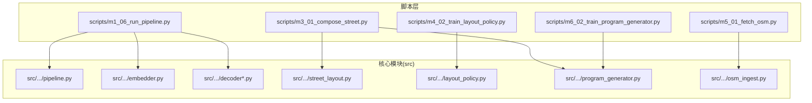
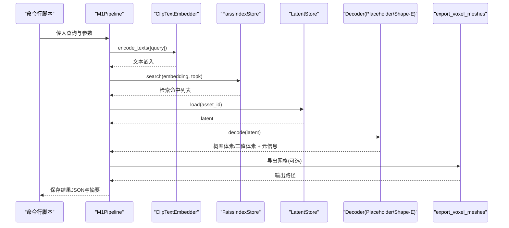
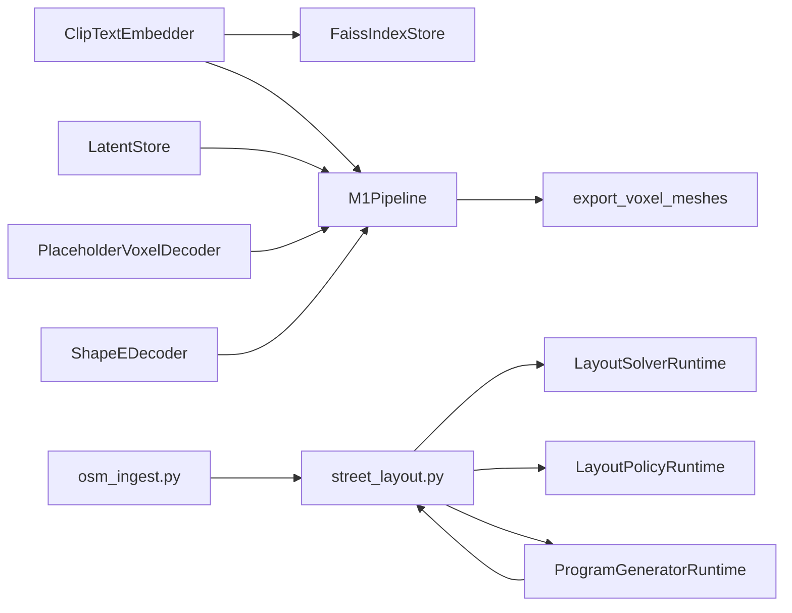

# 里程碑管道

<cite>
**本文引用的文件**
- [readme.md](file://readme.md)
- [scripts/m1_06_run_pipeline.py](file://scripts/m1_06_run_pipeline.py)
- [scripts/m3_01_compose_street.py](file://scripts/m3_01_compose_street.py)
- [scripts/m4_02_train_layout_policy.py](file://scripts/m4_02_train_layout_policy.py)
- [scripts/m5_01_fetch_osm.py](file://scripts/m5_01_fetch_osm.py)
- [scripts/m6_02_train_program_generator.py](file://scripts/m6_02_train_program_generator.py)
- [src/roadgen3d/pipeline.py](file://src/roadgen3d/pipeline.py)
- [src/roadgen3d/street_layout.py](file://src/roadgen3d/street_layout.py)
- [src/roadgen3d/layout_policy.py](file://src/roadgen3d/layout_policy.py)
- [src/roadgen3d/program_generator.py](file://src/roadgen3d/program_generator.py)
- [src/roadgen3d/osm_ingest.py](file://src/roadgen3d/osm_ingest.py)
- [src/roadgen3d/decoder.py](file://src/roadgen3d/decoder.py)
- [src/roadgen3d/decoder_shapee.py](file://src/roadgen3d/decoder_shapee.py)
- [src/roadgen3d/embedder.py](file://src/roadgen3d/embedder.py)
</cite>

## 目录
1. [简介](#简介)
2. [项目结构](#项目结构)
3. [核心组件](#核心组件)
4. [架构总览](#架构总览)
5. [详细组件分析](#详细组件分析)
6. [依赖关系分析](#依赖关系分析)
7. [性能考量](#性能考量)
8. [故障排查指南](#故障排查指南)
9. [结论](#结论)
10. [附录](#附录)

## 简介
本文件系统性梳理 RoadGen3D 六个里程碑（M1–M6）的端到端管道，覆盖从文本到真实资产、从单资产到多资产街道组合、从规则到可学习策略、从数据到神经符号管线的演进路径。每个里程碑均给出：管道原理、实现要点、命令行接口、参数说明、输出格式、性能指标、限制条件与最佳实践。

## 项目结构
- 核心代码位于 src/roadgen3d，包含嵌入、检索、解码、布局、程序生成、OSM 集成、管线编排等模块。
- 脚本位于 scripts/，按里程碑划分，提供一键式命令行入口。
- 文档位于 readme.md，包含完整的项目介绍、架构说明、CLI 使用指南和路线图。
- 数据与资源位于 data/、models/、artifacts/ 等目录，支撑各阶段训练与推理。

**图表来源**
- [scripts/m1_06_run_pipeline.py:1-107](file://scripts/m1_06_run_pipeline.py#L1-L107)
- [scripts/m3_01_compose_street.py:1-162](file://scripts/m3_01_compose_street.py#L1-L162)
- [scripts/m4_02_train_layout_policy.py:1-229](file://scripts/m4_02_train_layout_policy.py#L1-L229)
- [scripts/m5_01_fetch_osm.py:1-66](file://scripts/m5_01_fetch_osm.py#L1-L66)
- [scripts/m6_02_train_program_generator.py:1-132](file://scripts/m6_02_train_program_generator.py#L1-L132)
- [src/roadgen3d/pipeline.py:1-133](file://src/roadgen3d/pipeline.py#L1-L133)
- [src/roadgen3d/street_layout.py:1-800](file://src/roadgen3d/street_layout.py#L1-L800)
- [src/roadgen3d/layout_policy.py:1-309](file://src/roadgen3d/layout_policy.py#L1-L309)
- [src/roadgen3d/program_generator.py:1-663](file://src/roadgen3d/program_generator.py#L1-L663)
- [src/roadgen3d/osm_ingest.py:1-331](file://src/roadgen3d/osm_ingest.py#L1-L331)
- [src/roadgen3d/decoder.py:1-65](file://src/roadgen3d/decoder.py#L1-L65)
- [src/roadgen3d/decoder_shapee.py:1-245](file://src/roadgen3d/decoder_shapee.py#L1-L245)
- [src/roadgen3d/embedder.py:1-100](file://src/roadgen3d/embedder.py#L1-L100)

**章节来源**
- [readme.md:67-106](file://readme.md#L67-L106)

## 核心组件
- 文本嵌入与检索：CLIP 文本嵌入、FAISS 索引、检索命中。
- 解码器：占位解码器（M1）与 Shape-E 解码器（M2/M1 实验）。
- 街道组合：基于真实资产清单的多资产布局与渲染。
- 可学习策略：布局策略的特征工程、训练与推理。
- 程序生成：启发式与可学习的横断面/带宽预测。
- OSM 集成：道路、建筑、POI 的抓取、解析与投影。
- 管线编排：M1 端到端流水线封装。

**章节来源**
- [src/roadgen3d/embedder.py:1-100](file://src/roadgen3d/embedder.py#L1-L100)
- [src/roadgen3d/decoder.py:1-65](file://src/roadgen3d/decoder.py#L1-L65)
- [src/roadgen3d/decoder_shapee.py:1-245](file://src/roadgen3d/decoder_shapee.py#L1-L245)
- [src/roadgen3d/street_layout.py:1-800](file://src/roadgen3d/street_layout.py#L1-L800)
- [src/roadgen3d/layout_policy.py:1-309](file://src/roadgen3d/layout_policy.py#L1-L309)
- [src/roadgen3d/program_generator.py:1-663](file://src/roadgen3d/program_generator.py#L1-L663)
- [src/roadgen3d/osm_ingest.py:1-331](file://src/roadgen3d/osm_ingest.py#L1-L331)
- [src/roadgen3d/pipeline.py:1-133](file://src/roadgen3d/pipeline.py#L1-L133)

## 架构总览
下图展示 M1–M3 的端到端数据流与模块交互：

**图表来源**
- [src/roadgen3d/pipeline.py:30-133](file://src/roadgen3d/pipeline.py#L30-L133)
- [src/roadgen3d/embedder.py:33-100](file://src/roadgen3d/embedder.py#L33-L100)
- [src/roadgen3d/decoder.py:24-65](file://src/roadgen3d/decoder.py#L24-L65)
- [src/roadgen3d/decoder_shapee.py:34-245](file://src/roadgen3d/decoder_shapee.py#L34-L245)

## 详细组件分析

### M1：单资产生成（text → FAISS → latent → voxel → mesh）
- 管道原理
  - 文本经 CLIP 编码为向量，通过 FAISS 检索相似资产 ID，加载真实/占位 latent，解码为概率体素并二值化，必要时导出网格。
- 关键实现
  - 文本嵌入：ClipTextEmbedder，支持本地离线模型加载与设备选择。
  - 检索：FaissIndexStore，支持索引为空时的显式错误提示。
  - 解码：PlaceholderVoxelDecoder（M1 默认）与 ShapeEDecoder（可选）。
  - 管线：M1Pipeline 封装检索、解码、网格导出与结果保存。
- 命令行与参数
  - 参考：[scripts/m1_06_run_pipeline.py:23-42](file://scripts/m1_06_run_pipeline.py#L23-L42)
  - 关键参数：--query、--topk、--assets、--artifacts、--model-name、--model-dir、--local-files-only、--device、--resolution、--threshold、--decoder、--shapee-model-dir、--shapee-strict、--voxel-size、--export-method、--export-format。
- 输出
  - 体素数组（npy）、网格（glb/ply）、结果JSON（pipeline_result.json）。
- 性能与限制
  - 依赖 torch≥2.6 以规避安全限制；Shape-E 需要 trimesh 与 shap-e 运行时。
  - FAISS 索引为空会直接报错，需先构建索引。
- 最佳实践
  - 使用 --local-files-only 与 --model-dir 确保离线可用。
  - 体素分辨率与阈值影响网格质量与体积密度，需结合下游渲染调整。

**章节来源**
- [scripts/m1_06_run_pipeline.py:1-107](file://scripts/m1_06_run_pipeline.py#L1-L107)
- [src/roadgen3d/embedder.py:33-100](file://src/roadgen3d/embedder.py#L33-L100)
- [src/roadgen3d/pipeline.py:30-133](file://src/roadgen3d/pipeline.py#L30-L133)
- [src/roadgen3d/decoder.py:24-65](file://src/roadgen3d/decoder.py#L24-L65)
- [src/roadgen3d/decoder_shapee.py:34-245](file://src/roadgen3d/decoder_shapee.py#L34-L245)

### M2：真实数据链路（mesh_ref 编码）
- 管道原理
  - 将真实 mesh 与 latent 统一归一化，生成可用于 M1/M3 的清单；mesh_ref 模式仅写入 mesh_path，不依赖 Blender。
- 关键实现
  - 资产归一化：中心化、单位化、Y=0 对齐；支持过滤场景中的环境/背景几何。
  - 清单校验：必需字段校验、mesh/latent 存在性检查。
  - 编码模式：默认 mesh_ref，写入 {"mesh_path": ...} 形式的 latent。
- 命令行与参数
  - 参考：[scripts/m2_10_ingest_assets.py:378-398](file://scripts/m2_10_ingest_assets.py#L378-L398)
  - 关键参数：--input-manifest、--output-manifest、--mesh-out-dir、--no-normalize-mesh。
- 输出
  - 归一化 mesh 文件与规范化清单（.jsonl）。
- 性能与限制
  - trimesh 为必要依赖；树类资产的直立性校验可过滤异常资产。
- 最佳实践
  - 先进行 mesh 归一化，确保后续检索与布局的一致性；严格校验清单字段。

**章节来源**
- [scripts/m2_10_ingest_assets.py:1-421](file://scripts/m2_10_ingest_assets.py#L1-L421)

### M3：多资产街道组合（约束求解与布局）
- 管道原理
  - 基于真实资产清单，结合横断面/带宽、POI 约束、需求水平，进行布局求解与资产放置；支持模板/OSM/图模板布局模式。
- 关键实现
  - 街道组合：compose_street_scene，负责配置校验、网格缓存、布局求解、渲染与导出。
  - 约束与规则：设计规则集、POI 规则集、段级图（segment graph）参与布局。
  - 策略与程序：可选规则策略或 learned 布局策略；可选启发式/learned 程序生成器。
- 命令行与参数
  - 参考：[scripts/m3_01_compose_street.py:21-82](file://scripts/m3_01_compose_street.py#L21-L82)
  - 关键参数：--query、--manifest、--length-m、--road-width-m、--sidewalk-width-m、--lane-count、--density、--seed、--topk-per-category、--max-trials-per-slot、--export-format、--placement-policy、--policy-ckpt、--program-generator、--program-ckpt、--policy-temperature、--layout-mode、--constraint-mode、--aoi-bbox、--osm-cache-dir、--constraint-weight、--constraint-veto-threshold、--poi-rule-set、--design-rule-profile、--city-context、--target-street-type、--layout-solver、--objective-profile、--ped-demand-level、--bike-demand-level、--transit-demand-level、--vehicle-demand-level、--no-solver-fallback、--segment-length-m、--road-selection、--asset-scale-mode。
- 输出
  - 场景网格（glb/ply）与布局 JSON（scene_layout.json）。
- 性能与限制
  - 多资产放置涉及复杂的能量场与约束求解，计算开销随资产池与密度增长。
  - OSM 模式需提供有效 AOI 与缓存目录。
- 最佳实践
  - 合理设置 topk 与 trials，平衡多样性与稳定性；优先使用模板布局作为基线。

**章节来源**
- [scripts/m3_01_compose_street.py:1-162](file://scripts/m3_01_compose_street.py#L1-L162)
- [src/roadgen3d/street_layout.py:1-800](file://src/roadgen3d/street_layout.py#L1-L800)

### M4：可学习布局策略（训练与推理）
- 管道原理
  - 从收集的 slot 级样本中训练 MLP，用于候选资产评分与选择；支持奖励加权与熵正则。
- 关键实现
  - 特征工程：CandidateDescriptor、PolicyFeatureContext、vectorize_slot_candidates。
  - 训练：LayoutPolicyMLP，交叉熵+熵正则，早停与最佳模型保存。
  - 推理：LayoutPolicyRuntime，支持维度不匹配的兼容处理。
- 命令行与参数
  - 参考：[scripts/m4_02_train_layout_policy.py:29-46](file://scripts/m4_02_train_layout_policy.py#L29-L46)
  - 关键参数：--data、--out-dir、--epochs、--batch-size、--lr、--weight-decay、--entropy-weight、--patience、--device、--resume-ckpt、--use-optimal-labels/--no-optimal-labels、--reward-weight。
- 输出
  - 检查点（layout_policy.pt）、元信息（layout_policy_meta.json）、训练曲线（train_curve.json）。
- 性能与限制
  - 需要足够的 scene 级样本拆分以避免过拟合；特征维度需与模型一致。
- 最佳实践
  - 使用 use-optimal-labels 提升标签质量；合理设置熵权重与早停阈值。

**章节来源**
- [scripts/m4_02_train_layout_policy.py:1-229](file://scripts/m4_02_train_layout_policy.py#L1-L229)
- [src/roadgen3d/layout_policy.py:1-309](file://src/roadgen3d/layout_policy.py#L1-L309)

### M5：OSM 基础设施集成（数据处理）
- 管道原理
  - 从 Overpass 拉取道路、建筑、POI，解析为本地 UTM 坐标系，供 M3/M3.5 使用。
- 关键实现
  - 抓取与缓存：fetch_osm_data，基于 bbox 的哈希缓存。
  - 解析：parse_osm_features，提取道路、建筑、POI 点。
  - 投影：project_to_local，WGS→UTM 并原点居中。
- 命令行与参数
  - 参考：[scripts/m5_01_fetch_osm.py:18-30](file://scripts/m5_01_fetch_osm.py#L18-L30)
  - 关键参数：--bbox（四元组）、--cache-dir、--force-refetch。
- 输出
  - 缓存文件（overpass_*.json）、摘要（fetch_summary.json）。
- 性能与限制
  - Overpass 请求有限额与重试机制；POI 类型依赖标签映射。
- 最佳实践
  - 合理设置 AOI，避免过大范围导致缓存膨胀；首次运行建议禁用 force-refetch 以复用缓存。

**章节来源**
- [scripts/m5_01_fetch_osm.py:1-66](file://scripts/m5_01_fetch_osm.py#L1-L66)
- [src/roadgen3d/osm_ingest.py:1-331](file://src/roadgen3d/osm_ingest.py#L1-L331)

### M6：神经符号管道（程序生成训练）
- 管道原理
  - 以场景输入特征向量驱动可学习的横断面/带宽/目标权重预测，作为 M3 的神经符号前端。
- 关键实现
  - 特征向量化：vectorize_program_input，融合场景参数、POI 统计、图结构等。
  - 程序生成：ProgramGeneratorMLP 多头输出（道路类型、横断面、车道数、带宽、类别计数、右侧保留、目标权重）。
  - 训练：多任务损失（CE+MSE），早停与最佳模型保存。
- 命令行与参数
  - 参考：[scripts/m6_02_train_program_generator.py:24-35](file://scripts/m6_02_train_program_generator.py#L24-L35)
  - 关键参数：--data、--out-dir、--epochs、--batch-size、--lr、--weight-decay、--patience、--device、--resume-ckpt。
- 输出
  - 检查点（program_generator.pt）、元信息（program_generator_meta.json）、训练曲线（program_generator_curve.json）。
- 性能与限制
  - 输入维度与模型需匹配；类别计数采用ReLU以保证非负。
- 最佳实践
  - 使用 scene 级样本拆分避免泄露；关注带宽与类别计数的回归精度。

**章节来源**
- [scripts/m6_02_train_program_generator.py:1-132](file://scripts/m6_02_train_program_generator.py#L1-L132)
- [src/roadgen3d/program_generator.py:1-663](file://src/roadgen3d/program_generator.py#L1-L663)

## 依赖关系分析
- 模块耦合
  - M1 管线依赖嵌入、索引、潜向量存储与解码器；解码器可插拔（占位/Shape-E）。
  - M3 街道组合依赖布局求解器、程序生成器、POI 规则、段图与空间特征。
  - M4/M6 依赖特征工程与深度学习框架（torch）。
- 外部依赖
  - trimesh、shap-e（可选）、transformers、torch、requests、pyproj 等。
- 循环依赖
  - 未发现直接循环导入；模块间通过函数/类接口调用。

**图表来源**
- [src/roadgen3d/pipeline.py:30-133](file://src/roadgen3d/pipeline.py#L30-L133)
- [src/roadgen3d/embedder.py:33-100](file://src/roadgen3d/embedder.py#L33-L100)
- [src/roadgen3d/decoder.py:24-65](file://src/roadgen3d/decoder.py#L24-L65)
- [src/roadgen3d/decoder_shapee.py:34-245](file://src/roadgen3d/decoder_shapee.py#L34-L245)
- [src/roadgen3d/street_layout.py:1-800](file://src/roadgen3d/street_layout.py#L1-L800)
- [src/roadgen3d/layout_policy.py:63-125](file://src/roadgen3d/layout_policy.py#L63-L125)
- [src/roadgen3d/program_generator.py:405-488](file://src/roadgen3d/program_generator.py#L405-L488)
- [src/roadgen3d/osm_ingest.py:126-331](file://src/roadgen3d/osm_ingest.py#L126-L331)

## 性能考量
- M1
  - 体素分辨率与阈值直接影响网格体积与渲染质量；建议在保证可判别的前提下降低分辨率以提升速度。
  - Shape-E 解码可跳过体素转换直接返回网格，减少中间步骤。
- M3
  - 布局求解复杂度与资产池大小、密度、约束数量呈正相关；可通过 topk 与 trials 控制。
  - OSM 模式下的投影与图构建为额外开销，建议缓存与增量更新。
- M4/M6
  - 训练批大小与学习率影响收敛速度；早停可避免过拟合。
  - 特征维度不匹配时的兼容处理可降低部署风险。

## 故障排查指南
- M1
  - "FAISS index is empty"：先执行索引构建；确认清单非空且索引文件存在。
  - 模型加载失败（CVE-2025-32434）：升级 torch 至 2.6–2.8 或使用 safetensors 权重。
- M2
  - trimesh 缺失：安装 requirements-m2.txt；树类资产直立性校验失败时需剔除或修正。
- M3
  - 配置非法：长度/宽度/密度等参数需满足最小阈值；布局模式与约束模式需在允许集合内。
  - OSM AOI 缺失：OSM 模式需提供四元组坐标。
- M4/M6
  - 特征维度不匹配：检查样本特征与模型输入维数；必要时使用兼容加载逻辑。
  - 训练不收敛：检查学习率、批次大小与早停阈值；观察训练曲线。

**章节来源**
- [src/roadgen3d/pipeline.py:56-68](file://src/roadgen3d/pipeline.py#L56-L68)
- [src/roadgen3d/embedder.py:59-74](file://src/roadgen3d/embedder.py#L59-L74)
- [src/roadgen3d/street_layout.py:492-611](file://src/roadgen3d/street_layout.py#L492-L611)
- [src/roadgen3d/layout_policy.py:105-124](file://src/roadgen3d/layout_policy.py#L105-L124)
- [src/roadgen3d/program_generator.py:456-469](file://src/roadgen3d/program_generator.py#L456-L469)

## 结论
M1–M6 展示了从文本到真实资产、从规则到可学习策略、从数据到神经符号的渐进式能力跃迁。M1 验证闭环，M2 建立真实数据链路，M3 实现多资产街道组合，M4/M6 引入可学习策略与程序生成，M5 提供 OSM 基础设施支撑。建议在实际工程中结合场景需求选择布局模式与策略后端，并重视特征与模型维度兼容、缓存与离线可用性。

## 附录
- 完整项目文档与架构说明：[readme.md](file://readme.md)
- 路线图与优先级参考：[readme.md](file://readme.md)