# 扩展开发最佳实践

<cite>
**本文档引用的文件**
- [src/roadgen3d/__init__.py](file://src/roadgen3d/__init__.py)
- [src/roadgen3d/services/generation_core.py](file://src/roadgen3d/services/generation_core.py)
- [src/roadgen3d/services/design_runtime.py](file://src/roadgen3d/services/design_runtime.py)
- [src/roadgen3d/services/design_types.py](file://src/roadgen3d/services/design_types.py)
- [src/roadgen3d/services/scene_backends.py](file://src/roadgen3d/services/scene_backends.py)
- [src/roadgen3d/types.py](file://src/roadgen3d/types.py)
- [src/roadgen3d/pipeline.py](file://src/roadgen3d/pipeline.py)
- [API_GUIDE.md](file://API_GUIDE.md)
- [docs/design.md](file://docs/design.md)
- [docs/architecture_decisions.md](file://docs/architecture_decisions.md)
- [metaurban/metaurban/utils/error_class.py](file://metaurban/metaurban/utils/error_class.py)
- [metaurban/metaurban/utils/registry.py](file://metaurban/metaurban/utils/registry.py)
</cite>

## 目录
1. [简介](#简介)
2. [项目结构](#项目结构)
3. [核心组件](#核心组件)
4. [架构概览](#架构概览)
5. [详细组件分析](#详细组件分析)
6. [依赖分析](#依赖分析)
7. [性能考虑](#性能考虑)
8. [故障排除指南](#故障排除指南)
9. [结论](#结论)
10. [附录](#附录)

## 简介

RoadGen3D 是一个参数化的街道生成系统，专注于物理合理性、设计规范约束和参数显式可控。本文档提供了扩展开发的最佳实践指南，涵盖接口设计原则、错误处理策略、性能优化方法、代码组织建议、测试策略、文档编写规范、调试技巧和工具链。

## 项目结构

RoadGen3D 采用模块化架构，主要分为以下几个层次：

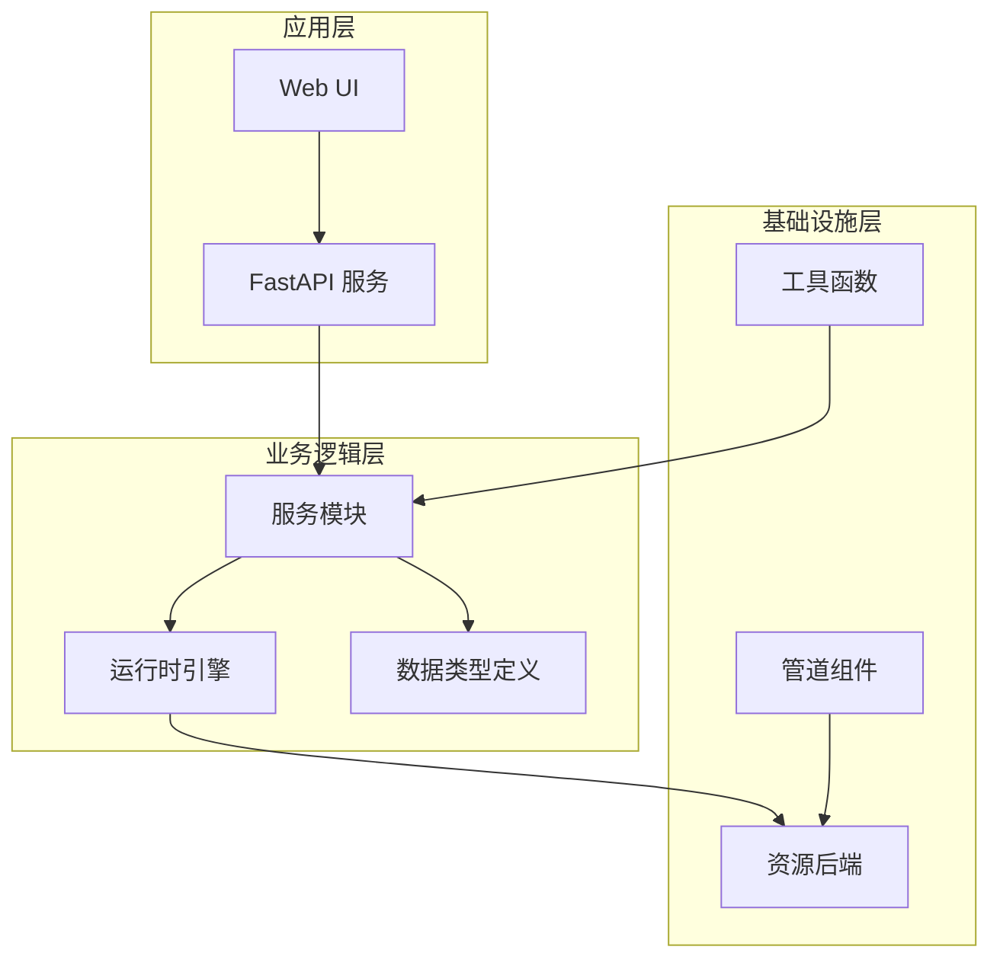

**图表来源**
- [src/roadgen3d/services/generation_core.py:1-445](file://src/roadgen3d/services/generation_core.py#L1-L445)
- [src/roadgen3d/services/design_runtime.py:1-397](file://src/roadgen3d/services/design_runtime.py#L1-L397)

项目采用分层架构设计，每个模块职责明确，便于扩展和维护。

**章节来源**
- [src/roadgen3d/__init__.py:1-295](file://src/roadgen3d/__init__.py#L1-L295)
- [API_GUIDE.md:1-337](file://API_GUIDE.md#L1-L337)

## 核心组件

### 数据类型系统

RoadGen3D 的数据类型系统是整个架构的基础，提供了强类型的接口定义：

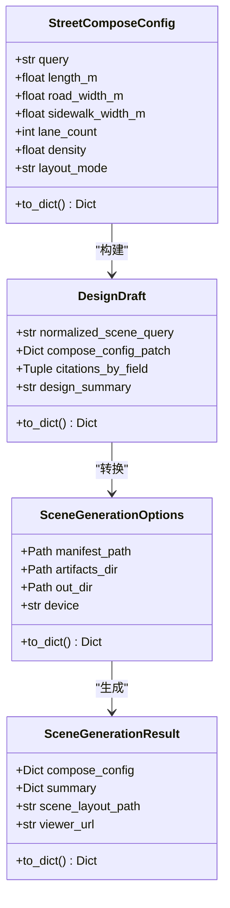

**图表来源**
- [src/roadgen3d/types.py:47-119](file://src/roadgen3d/types.py#L47-L119)
- [src/roadgen3d/services/design_types.py:177-200](file://src/roadgen3d/services/design_types.py#L177-L200)
- [src/roadgen3d/services/design_types.py:265-304](file://src/roadgen3d/services/design_types.py#L265-L304)
- [src/roadgen3d/services/design_types.py:307-320](file://src/roadgen3d/services/design_types.py#L307-L320)

### 服务层架构

服务层提供了核心的场景生成功能，支持多种生成模式：

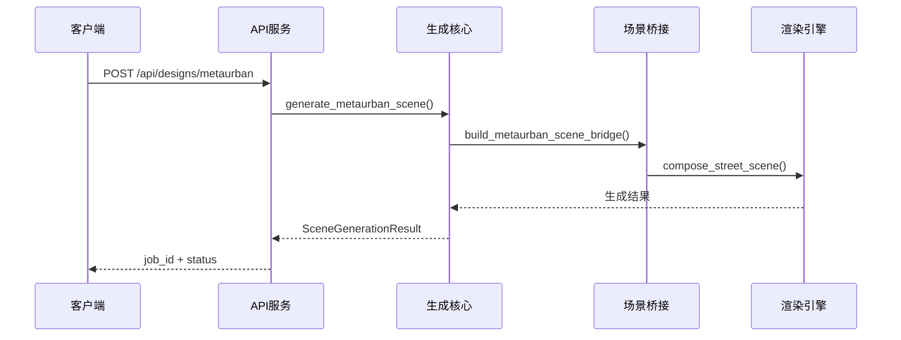

**图表来源**
- [src/roadgen3d/services/generation_core.py:267-342](file://src/roadgen3d/services/generation_core.py#L267-L342)
- [src/roadgen3d/services/design_runtime.py:336-396](file://src/roadgen3d/services/design_runtime.py#L336-L396)

**章节来源**
- [src/roadgen3d/types.py:1-800](file://src/roadgen3d/types.py#L1-L800)
- [src/roadgen3d/services/design_types.py:1-368](file://src/roadgen3d/services/design_types.py#L1-L368)

## 架构概览

### 设计原则

RoadGen3D 遵循以下核心设计原则：

1. **物理合理性优先** - 所有生成的资产必须满足地面接触、支撑完整和基本稳定性
2. **设计规范优先** - 关键尺寸和布置必须有默认安全值和推荐范围
3. **参数化优先** - 所有核心变量都必须显式暴露，支持参数化控制
4. **设备可移植** - 支持 Apple Silicon、CUDA 和 CPU 三种后端

### 架构决策

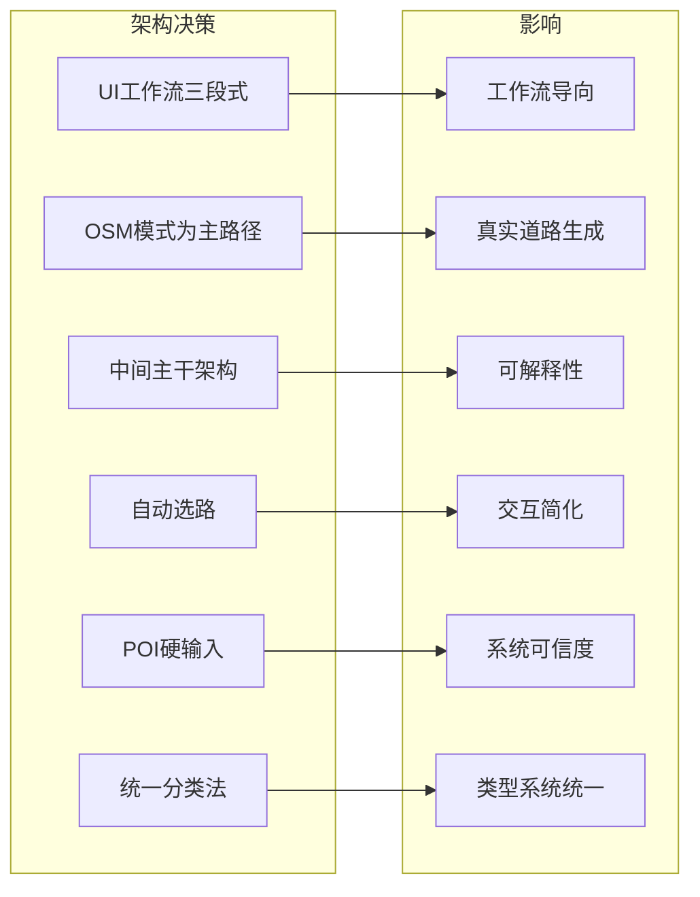

**图表来源**
- [docs/architecture_decisions.md:7-27](file://docs/architecture_decisions.md#L7-L27)
- [docs/architecture_decisions.md:28-48](file://docs/architecture_decisions.md#L28-L48)
- [docs/architecture_decisions.md:49-74](file://docs/architecture_decisions.md#L49-L74)

**章节来源**
- [docs/architecture_decisions.md:1-255](file://docs/architecture_decisions.md#L1-L255)
- [docs/design.md:22-44](file://docs/design.md#L22-L44)

## 详细组件分析

### 生成核心组件

生成核心组件负责处理不同的生成场景，提供了统一的接口：

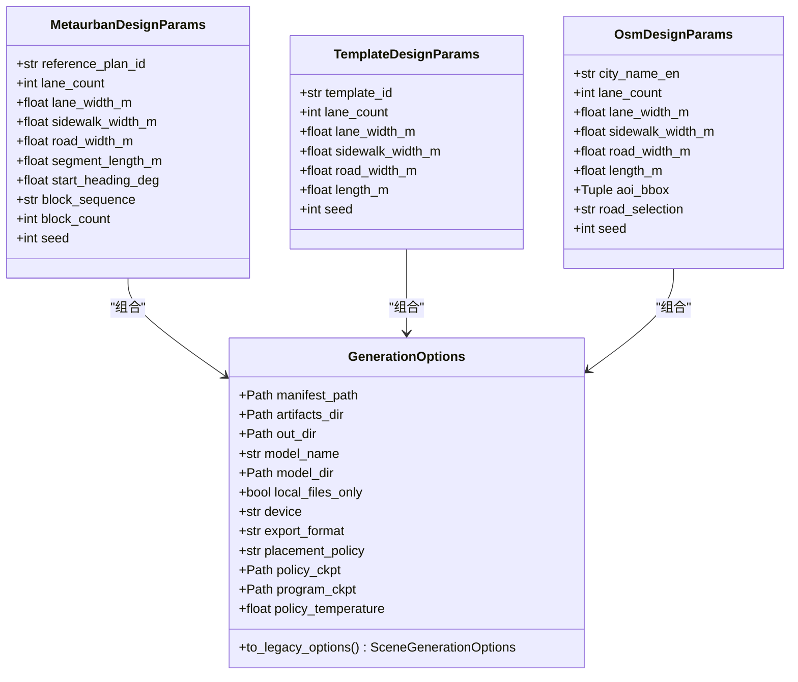

**图表来源**
- [src/roadgen3d/services/generation_core.py:39-82](file://src/roadgen3d/services/generation_core.py#L39-L82)
- [src/roadgen3d/services/generation_core.py:84-135](file://src/roadgen3d/services/generation_core.py#L84-L135)

### 场景生成流程

场景生成流程展示了从设计参数到最终场景的完整过程：

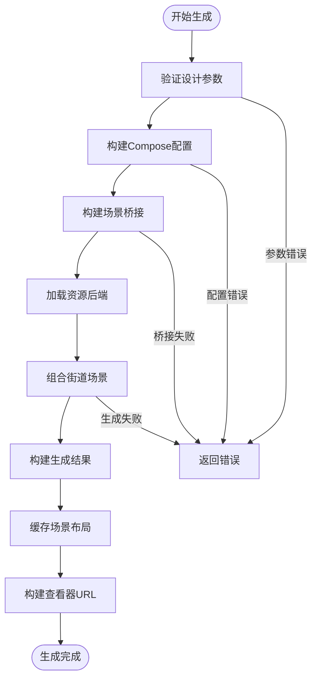

**图表来源**
- [src/roadgen3d/services/generation_core.py:157-265](file://src/roadgen3d/services/generation_core.py#L157-L265)
- [src/roadgen3d/services/design_runtime.py:190-220](file://src/roadgen3d/services/design_runtime.py#L190-L220)

**章节来源**
- [src/roadgen3d/services/generation_core.py:1-445](file://src/roadgen3d/services/generation_core.py#L1-L445)
- [src/roadgen3d/services/design_runtime.py:1-397](file://src/roadgen3d/services/design_runtime.py#L1-L397)

### 资源后端系统

资源后端系统提供了统一的资源管理接口：

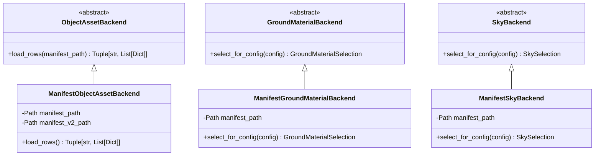

**图表来源**
- [src/roadgen3d/services/scene_backends.py:96-203](file://src/roadgen3d/services/scene_backends.py#L96-L203)
- [src/roadgen3d/services/scene_backends.py:205-235](file://src/roadgen3d/services/scene_backends.py#L205-L235)
- [src/roadgen3d/services/scene_backends.py:237-317](file://src/roadgen3d/services/scene_backends.py#L237-L317)

**章节来源**
- [src/roadgen3d/services/scene_backends.py:1-527](file://src/roadgen3d/services/scene_backends.py#L1-L527)

### 管道组件

M1Pipeline 提供了端到端的处理流程：

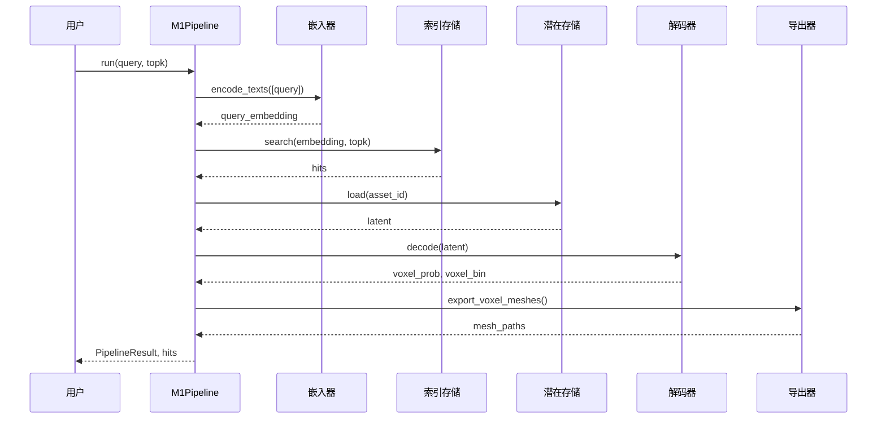

**图表来源**
- [src/roadgen3d/pipeline.py:30-126](file://src/roadgen3d/pipeline.py#L30-L126)

**章节来源**
- [src/roadgen3d/pipeline.py:1-133](file://src/roadgen3d/pipeline.py#L1-L133)

## 依赖分析

### 模块依赖关系

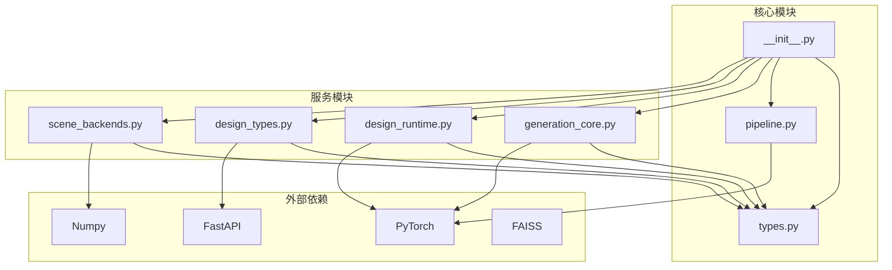

**图表来源**
- [src/roadgen3d/__init__.py:1-295](file://src/roadgen3d/__init__.py#L1-L295)
- [src/roadgen3d/services/generation_core.py:1-32](file://src/roadgen3d/services/generation_core.py#L1-L32)
- [src/roadgen3d/services/design_runtime.py:1-25](file://src/roadgen3d/services/design_runtime.py#L1-L25)

### 错误处理依赖

系统采用了分层的错误处理策略：

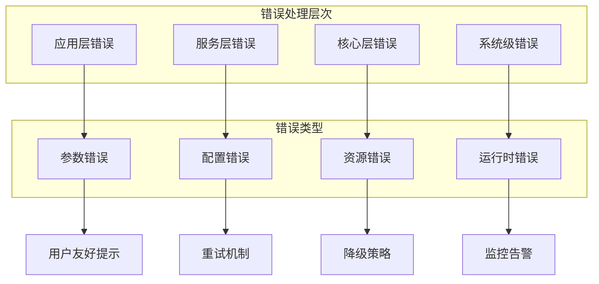

**图表来源**
- [metaurban/metaurban/utils/error_class.py:1-3](file://metaurban/metaurban/utils/error_class.py#L1-L3)

**章节来源**
- [src/roadgen3d/__init__.py:1-295](file://src/roadgen3d/__init__.py#L1-L295)
- [metaurban/metaurban/utils/error_class.py:1-3](file://metaurban/metaurban/utils/error_class.py#L1-L3)

## 性能考虑

### 设备后端策略

系统实现了统一的设备后端解析策略：

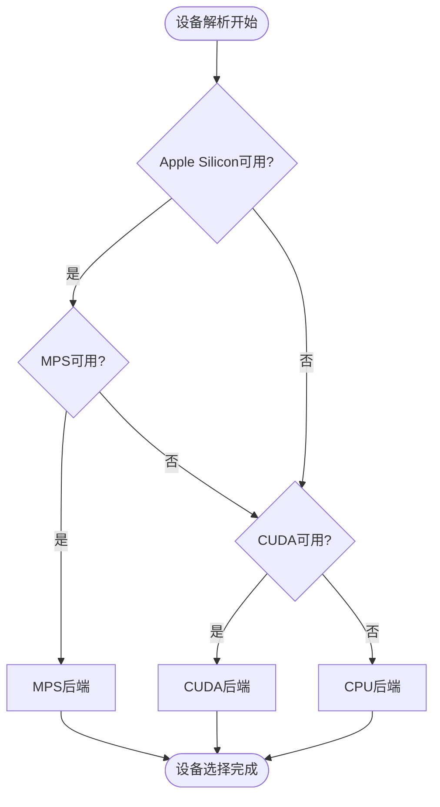

**图表来源**
- [docs/design.md:228-237](file://docs/design.md#L228-L237)

### 性能优化策略

1. **减少盲重试** - 通过预设参数和质量门槛减少无效重试
2. **双运行档位** - `preview` 和 `production` 档位分别针对不同性能目标
3. **统一设备解析** - 所有 torch 相关入口通过统一函数处理

**章节来源**
- [docs/design.md:269-309](file://docs/design.md#L269-L309)

## 故障排除指南

### 常见问题诊断

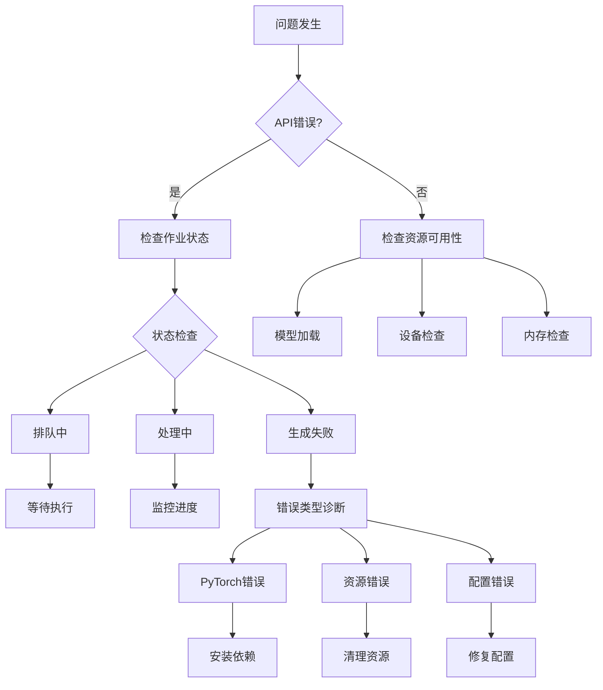

**图表来源**
- [API_GUIDE.md:303-337](file://API_GUIDE.md#L303-L337)

### 错误处理最佳实践

1. **明确的错误分类** - 区分参数错误、配置错误、资源错误和运行时错误
2. **用户友好的错误消息** - 提供具体的错误信息和解决建议
3. **渐进式降级** - 在资源不足时提供替代方案
4. **完整的日志记录** - 记录错误发生的时间、上下文和处理过程

**章节来源**
- [API_GUIDE.md:303-337](file://API_GUIDE.md#L303-L337)
- [metaurban/metaurban/utils/error_class.py:1-3](file://metaurban/metaurban/utils/error_class.py#L1-L3)

## 结论

RoadGen3D 的扩展开发遵循了清晰的架构原则和最佳实践。通过模块化设计、强类型接口、分层错误处理和性能优化策略，系统为扩展开发提供了坚实的基础。开发者在进行扩展时应重点关注：

1. **接口设计** - 保持向后兼容性和清晰的契约
2. **错误处理** - 实现分层的错误处理和恢复机制
3. **性能优化** - 平衡生成质量和执行效率
4. **代码组织** - 遵循模块化和分层架构原则
5. **测试保障** - 建立全面的测试策略和质量保证体系

这些实践确保了系统的可维护性、可扩展性和可靠性，为 RoadGen3D 的持续发展奠定了基础。

## 附录

### 开发工具链

1. **API 测试** - 使用 Swagger UI 进行 API 功能测试
2. **性能监控** - 监控生成时间和资源使用情况
3. **日志分析** - 分析生成过程中的关键指标
4. **版本控制** - 遵循 Git 工作流程和分支策略

### 扩展开发检查清单

- [ ] 符合架构设计原则
- [ ] 实现必要的接口契约
- [ ] 包含完整的错误处理
- [ ] 通过性能基准测试
- [ ] 提供充分的文档说明
- [ ] 包含单元测试和集成测试
- [ ] 遵循代码风格规范
- [ ] 通过代码审查流程