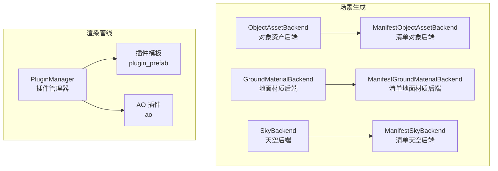
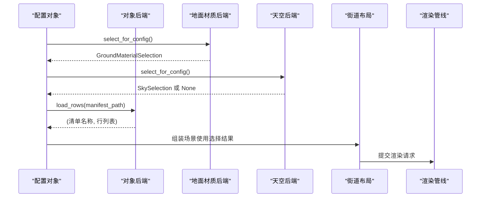
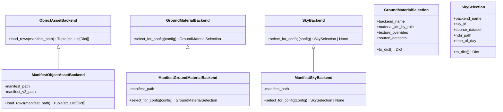
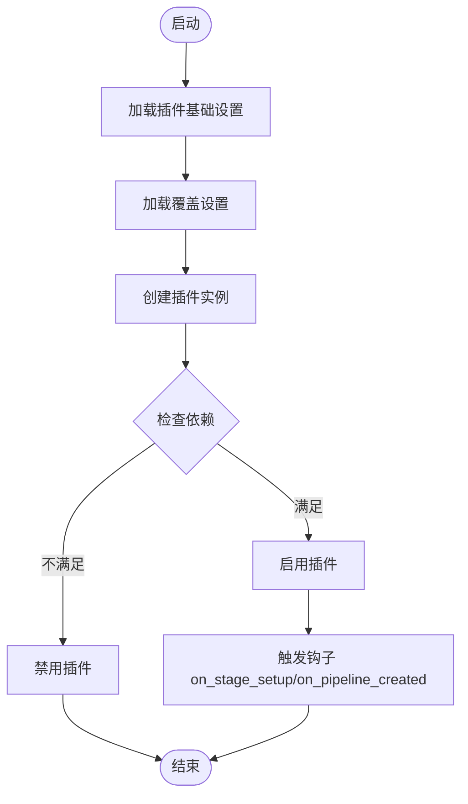
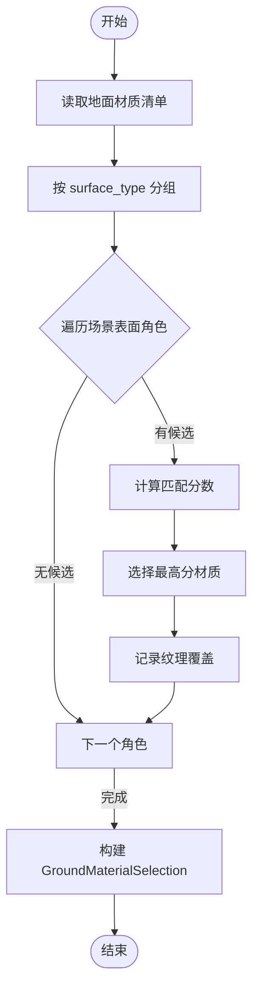
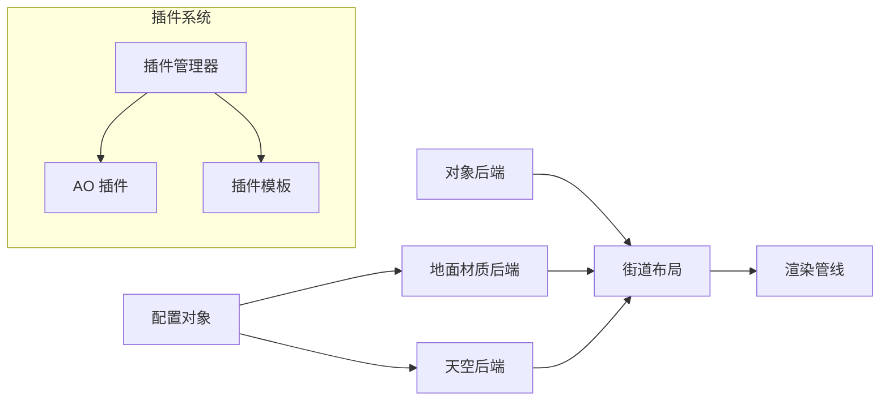

# 插件开发指南

<cite>
**本文引用的文件**
- [scene_backends.py](file://src/roadgen3d/services/scene_backends.py)
- [test_scene_backends.py](file://tests/test_scene_backends.py)
- [street_layout.py](file://src/roadgen3d/street_layout.py)
- [real_assets_manifest_v2.jsonl](file://data/real/real_assets_manifest_v2.jsonl)
- [ground_material_manifest.jsonl](file://data/materials/ground_material_manifest.jsonl)
- [sky_manifest.jsonl](file://data/materials/sky_manifest.jsonl)
- [manager.py](file://metaurban/metaurban/render_pipeline/rpcore/pluginbase/manager.py)
- [plugin.py（AO 插件）](file://metaurban/metaurban/render_pipeline/rpplugins/ao/plugin.py)
- [plugin.py（插件模板）](file://metaurban/metaurban/render_pipeline/rpplugins/plugin_prefab/plugin.py)
- [README.md（渲染管线插件目录）](file://metaurban/metaurban/render_pipeline/rpplugins/README.md)
- [asset_loader.py](file://metaurban/metaurban/engine/asset_loader.py)
- [vite.config.ts（Web 资产索引）](file://web/viewer/vite.config.ts)
</cite>

## 目录
1. [简介](#简介)
2. [项目结构](#项目结构)
3. [核心组件](#核心组件)
4. [架构总览](#架构总览)
5. [详细组件分析](#详细组件分析)
6. [依赖分析](#依赖分析)
7. [性能考虑](#性能考虑)
8. [故障排查指南](#故障排查指南)
9. [结论](#结论)
10. [附录](#附录)

## 简介
本指南面向 RoadGen3D 的插件开发者，系统讲解场景生成中的“资产后端”与“渲染管线插件”的架构设计、扩展点与实现方法。重点覆盖以下主题：
- 自定义资产后端：继承与实现 ObjectAssetBackend、GroundMaterialBackend、SkyBackend 的步骤与最佳实践
- 插件注册与生命周期：渲染管线插件的加载、启用、设置覆盖与更新流程
- 配置管理与数据流：从清单文件到选择算法再到渲染阶段的数据传递
- 完整开发示例：资产清单解析、材质选择算法、天空盒管理
- 插件间依赖与数据流转：插件之间的依赖声明与阶段管线衔接
- 测试方法、调试技巧与性能优化建议
- 版本兼容性与升级策略

## 项目结构
RoadGen3D 的插件开发涉及两条主线：
- 场景生成资产后端：负责从清单中解析对象、地面材质与天空记录，并根据配置进行选择
- 渲染管线插件：基于 RenderPipeline 的插件框架，通过配置文件与设置项驱动渲染阶段

图表来源
- [scene_backends.py:96-317](file://src/roadgen3d/services/scene_backends.py#L96-L317)
- [manager.py:41-280](file://metaurban/metaurban/render_pipeline/rpcore/pluginbase/manager.py#L41-L280)
- [plugin.py（插件模板）:33-55](file://metaurban/metaurban/render_pipeline/rpplugins/plugin_prefab/plugin.py#L33-L55)
- [plugin.py（AO 插件）:33-49](file://metaurban/metaurban/render_pipeline/rpplugins/ao/plugin.py#L33-L49)

章节来源
- [scene_backends.py:1-527](file://src/roadgen3d/services/scene_backends.py#L1-L527)
- [manager.py:1-280](file://metaurban/metaurban/render_pipeline/rpcore/pluginbase/manager.py#L1-L280)

## 核心组件
本节聚焦于资产后端与渲染管线插件的核心接口与实现要点。

- 资产后端接口
  - ObjectAssetBackend：抽象基类，定义 load_rows 方法用于加载资产清单行
  - GroundMaterialBackend：抽象基类，定义 select_for_config 返回 GroundMaterialSelection
  - SkyBackend：抽象基类，定义 select_for_config 返回 SkySelection 或 None
- 具体实现
  - ManifestObjectAssetBackend：支持 v2 清单与旧版清单的合并
  - ManifestGroundMaterialBackend：按场景表面角色与查询词匹配最优材质
  - ManifestSkyBackend：按时间/天气/光照标签匹配最优天空

章节来源
- [scene_backends.py:96-317](file://src/roadgen3d/services/scene_backends.py#L96-L317)

## 架构总览
下图展示了从配置到渲染的整体流程：配置对象被传入各后端，后端返回选择结果；这些结果随后被用于场景组装与渲染管线。

图表来源
- [street_layout.py:5172-5199](file://src/roadgen3d/street_layout.py#L5172-L5199)
- [scene_backends.py:247-316](file://src/roadgen3d/services/scene_backends.py#L247-L316)

章节来源
- [street_layout.py:5172-5199](file://src/roadgen3d/street_layout.py#L5172-L5199)

## 详细组件分析

### 资产后端类图

图表来源
- [scene_backends.py:96-317](file://src/roadgen3d/services/scene_backends.py#L96-L317)

章节来源
- [scene_backends.py:96-317](file://src/roadgen3d/services/scene_backends.py#L96-L317)

### 渲染管线插件管理器
插件管理器负责：
- 加载基础设置与覆盖设置
- 动态导入插件模块并实例化
- 处理插件启用/禁用与依赖检查
- 触发钩子与更新设置

图表来源
- [manager.py:58-94](file://metaurban/metaurban/render_pipeline/rpcore/pluginbase/manager.py#L58-L94)
- [manager.py:191-206](file://metaurban/metaurban/render_pipeline/rpcore/pluginbase/manager.py#L191-L206)

章节来源
- [manager.py:41-280](file://metaurban/metaurban/render_pipeline/rpcore/pluginbase/manager.py#L41-L280)

### 插件模板与 AO 插件
- 插件模板：展示最小可运行插件骨架，包含名称、作者、描述、版本以及阶段创建与设置更新回调
- AO 插件：演示如何在 on_stage_setup 中创建阶段并将输出接入现有阶段管线

章节来源
- [plugin.py（插件模板）:33-55](file://metaurban/metaurban/render_pipeline/rpplugins/plugin_prefab/plugin.py#L33-L55)
- [plugin.py（AO 插件）:33-49](file://metaurban/metaurban/render_pipeline/rpplugins/ao/plugin.py#L33-L49)

### 资产清单解析与合并
- 对象资产清单 v2 支持字段丰富，包含类别、文本描述、网格路径、潜在向量、来源信息、度量指标等
- 合并逻辑以 asset_id 为键，优先保留 v2 覆盖字段，同时保留旧版字段
- 旧版清单兼容读取，若未找到 v2 则回退到旧版

章节来源
- [scene_backends.py:369-435](file://src/roadgen3d/services/scene_backends.py#L369-L435)
- [scene_backends.py:319-349](file://src/roadgen3d/services/scene_backends.py#L319-L349)
- [real_assets_manifest_v2.jsonl:1-6](file://data/real/real_assets_manifest_v2.jsonl#L1-L6)

### 材质选择算法
- 地面材质按场景表面角色分组，支持回退映射（如 clear_path 回退到 sidewalk）
- 使用查询词拼接（query/objective_profile/design_rule_profile/city_context/style_preset）计算匹配分数
- 分数由标签匹配数量与特定字段命中共同决定，最终选择得分最高的材质

图表来源
- [scene_backends.py:247-287](file://src/roadgen3d/services/scene_backends.py#L247-L287)
- [scene_backends.py:488-498](file://src/roadgen3d/services/scene_backends.py#L488-L498)

章节来源
- [scene_backends.py:237-287](file://src/roadgen3d/services/scene_backends.py#L237-L287)
- [ground_material_manifest.jsonl:1-13](file://data/materials/ground_material_manifest.jsonl#L1-L13)

### 天空盒管理
- 天空记录包含 id、来源、许可证、HDRI 路径、预览、时段、天气/光照/区域标签
- 选择时优先匹配 time_of_day，其次匹配标签，特殊关键词（如 night、golden）会提升权重

章节来源
- [scene_backends.py:290-316](file://src/roadgen3d/services/scene_backends.py#L290-L316)
- [sky_manifest.jsonl:1-4](file://data/materials/sky_manifest.jsonl#L1-L4)

### Web 资产索引与描述
- Web Viewer 在启动时加载资产清单，过滤低质量与特定来源条目，建立资产 ID 到描述的索引
- 当无法解析时提供回退描述，保证界面可用性

章节来源
- [vite.config.ts（Web 资产索引）:211-266](file://web/viewer/vite.config.ts#L211-L266)

## 依赖分析
- 资产后端之间无直接耦合，均通过统一的配置对象输入与标准化的返回值输出，便于替换与扩展
- 渲染管线插件通过 required_plugins 与 native_only 进行依赖约束，确保运行环境满足要求
- 插件管理器集中处理启用/禁用、设置覆盖与钩子触发，避免插件间直接耦合

图表来源
- [street_layout.py:5172-5199](file://src/roadgen3d/street_layout.py#L5172-L5199)
- [manager.py:191-206](file://metaurban/metaurban/render_pipeline/rpcore/pluginbase/manager.py#L191-L206)

章节来源
- [street_layout.py:5172-5199](file://src/roadgen3d/street_layout.py#L5172-L5199)
- [manager.py:191-206](file://metaurban/metaurban/render_pipeline/rpcore/pluginbase/manager.py#L191-L206)

## 性能考虑
- 清单读取与解析
  - 使用 JSONL 逐行读取，避免一次性加载大文件导致内存峰值
  - 路径解析采用相对路径转绝对路径，减少后续查找开销
- 选择算法
  - 材质与天空选择采用一次扫描与最大值选择，时间复杂度线性
  - 标签匹配与评分函数简单，适合高频调用
- 渲染管线
  - 插件启用/禁用与设置变更仅影响相关阶段，避免全量重载
  - 通过设置的 runtime/shader_runtime 控制是否触发光栅化重载

[本节为通用指导，无需列出章节来源]

## 故障排查指南
- 资产后端
  - 清单字段缺失：检查必需字段（如 asset_id/category/text_desc/mesh_path/latent_path），确保路径有效
  - 合并冲突：确认 v2 覆盖字段与旧版字段键一致，避免重复覆盖
  - 选择失败：核对查询词是否包含目标标签，或检查回退映射是否生效
- 渲染管线
  - 插件无法加载：检查 required_plugins 是否已启用，native_only 依赖是否满足
  - 设置覆盖无效：确认覆盖文件格式正确且键名存在
- Web 资产索引
  - 缺少描述：检查清单条目与过滤条件，必要时提供回退描述

章节来源
- [scene_backends.py:319-349](file://src/roadgen3d/services/scene_backends.py#L319-L349)
- [scene_backends.py:369-435](file://src/roadgen3d/services/scene_backends.py#L369-L435)
- [manager.py:130-147](file://metaurban/metaurban/render_pipeline/rpcore/pluginbase/manager.py#L130-L147)
- [vite.config.ts（Web 资产索引）:211-266](file://web/viewer/vite.config.ts#L211-L266)

## 结论
通过清晰的抽象接口与清单驱动的选择算法，RoadGen3D 为插件开发者提供了高扩展性的场景生成能力。结合渲染管线插件框架，开发者可以快速实现自定义资产后端与渲染效果插件，并通过配置与覆盖实现灵活的定制化工作流。

[本节为总结，无需列出章节来源]

## 附录

### 开发步骤速查
- 自定义资产后端
  - 继承对应抽象基类，实现 load_rows/select_for_config
  - 解析清单文件，构造标准化数据结构
  - 实现评分/匹配逻辑，返回标准化选择结果
- 渲染管线插件
  - 创建插件目录与 config.yaml、plugin.py
  - 在 on_stage_setup 中创建阶段并接入管线
  - 在 config.yaml 中声明设置项与默认值
- 注册与启用
  - 将插件目录放入渲染管线插件目录
  - 通过覆盖文件启用插件并调整设置
- 测试与验证
  - 编写单元测试覆盖清单解析与选择逻辑
  - 使用示例清单验证插件行为
- 性能与兼容
  - 关注清单大小与解析耗时
  - 保持设置项与阶段接口稳定，避免破坏性变更

章节来源
- [scene_backends.py:96-317](file://src/roadgen3d/services/scene_backends.py#L96-L317)
- [manager.py:100-129](file://metaurban/metaurban/render_pipeline/rpcore/pluginbase/manager.py#L100-L129)
- [plugin.py（插件模板）:33-55](file://metaurban/metaurban/render_pipeline/rpplugins/plugin_prefab/plugin.py#L33-L55)
- [README.md（渲染管线插件目录）:1-9](file://metaurban/metaurban/render_pipeline/rpplugins/README.md#L1-L9)