# 插件性能优化

<cite>
**本文引用的文件**
- [src/roadgen3d/services/design_runtime.py](file://src/roadgen3d/services/design_runtime.py)
- [src/roadgen3d/services/generation_core.py](file://src/roadgen3d/services/generation_core.py)
- [src/roadgen3d/runtime_device.py](file://src/roadgen3d/runtime_device.py)
- [src/roadgen3d/latent_store.py](file://src/roadgen3d/latent_store.py)
- [src/roadgen3d/index_store.py](file://src/roadgen3d/index_store.py)
- [src/roadgen3d/street_layout.py](file://src/roadgen3d/street_layout.py)
- [metaurban/metaurban/utils/data_buffer.py](file://metaurban/metaurban/utils/data_buffer.py)
- [metaurban/metaurban/utils/registry.py](file://metaurban/metaurban/utils/registry.py)
- [metaurban/metaurban/utils/cuda.py](file://metaurban/metaurban/utils/cuda.py)
- [metaurban/metaurban/render_pipeline/config/plugins.yaml](file://metaurban/metaurban/render_pipeline/config/plugins.yaml)
- [metaurban/metaurban/render_pipeline/rpplugins/ao/config.yaml](file://metaurban/metaurban/render_pipeline/rpplugins/ao/config.yaml)
</cite>

## 目录
1. [简介](#简介)
2. [项目结构](#项目结构)
3. [核心组件](#核心组件)
4. [架构总览](#架构总览)
5. [详细组件分析](#详细组件分析)
6. [依赖分析](#依赖分析)
7. [性能考量](#性能考量)
8. [故障排查指南](#故障排查指南)
9. [结论](#结论)
10. [附录](#附录)

## 简介
本指南聚焦于 RoadGen3D 中与“插件”相关的性能优化方法论与实操建议，覆盖内存使用优化、计算效率提升、I/O 操作优化；同时给出缓存机制设计、懒加载实现、并行处理技术；解释插件加载时机控制、资源预热策略与动态卸载机制；并提供性能监控指标、基准测试方法与回归检测思路，以及不同场景下的优化案例与最佳实践。

## 项目结构
RoadGen3D 的场景生成管线由多模块协作完成：服务层负责参数归一化与后端装配；底层布局与排布算法负责几何与空间逻辑；渲染管线与效果插件负责可视化输出；索引与潜变量存储负责检索与数据访问。下图展示与性能优化直接相关的关键模块及其交互。

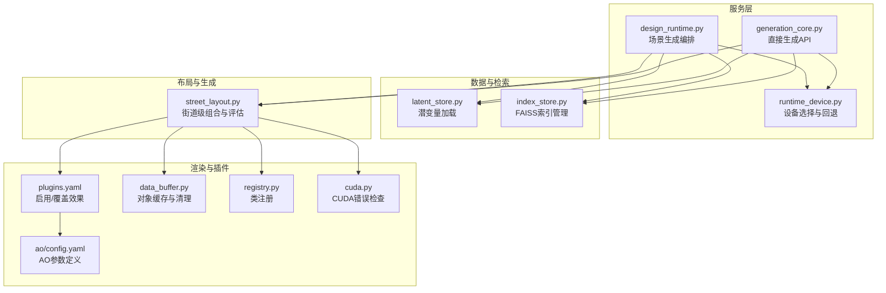

**图表来源**
- [src/roadgen3d/services/design_runtime.py:336-397](file://src/roadgen3d/services/design_runtime.py#L336-L397)
- [src/roadgen3d/services/generation_core.py:267-444](file://src/roadgen3d/services/generation_core.py#L267-L444)
- [src/roadgen3d/runtime_device.py:37-72](file://src/roadgen3d/runtime_device.py#L37-L72)
- [src/roadgen3d/latent_store.py:35-81](file://src/roadgen3d/latent_store.py#L35-L81)
- [src/roadgen3d/index_store.py:33-96](file://src/roadgen3d/index_store.py#L33-L96)
- [src/roadgen3d/street_layout.py:1-120](file://src/roadgen3d/street_layout.py#L1-L120)
- [metaurban/metaurban/render_pipeline/config/plugins.yaml:6-24](file://metaurban/metaurban/render_pipeline/config/plugins.yaml#L6-L24)
- [metaurban/metaurban/render_pipeline/rpplugins/ao/config.yaml:1-281](file://metaurban/metaurban/render_pipeline/rpplugins/ao/config.yaml#L1-L281)
- [metaurban/metaurban/utils/data_buffer.py:31-85](file://metaurban/metaurban/utils/data_buffer.py#L31-L85)
- [metaurban/metaurban/utils/registry.py:5-41](file://metaurban/metaurban/utils/registry.py#L5-L41)
- [metaurban/metaurban/utils/cuda.py:16-34](file://metaurban/metaurban/utils/cuda.py#L16-L34)

**章节来源**
- [src/roadgen3d/services/design_runtime.py:336-397](file://src/roadgen3d/services/design_runtime.py#L336-L397)
- [src/roadgen3d/services/generation_core.py:267-444](file://src/roadgen3d/services/generation_core.py#L267-L444)
- [src/roadgen3d/runtime_device.py:37-72](file://src/roadgen3d/runtime_device.py#L37-L72)
- [src/roadgen3d/latent_store.py:35-81](file://src/roadgen3d/latent_store.py#L35-L81)
- [src/roadgen3d/index_store.py:33-96](file://src/roadgen3d/index_store.py#L33-L96)
- [src/roadgen3d/street_layout.py:1-120](file://src/roadgen3d/street_layout.py#L1-L120)
- [metaurban/metaurban/render_pipeline/config/plugins.yaml:6-24](file://metaurban/metaurban/render_pipeline/config/plugins.yaml#L6-L24)
- [metaurban/metaurban/render_pipeline/rpplugins/ao/config.yaml:1-281](file://metaurban/metaurban/render_pipeline/rpplugins/ao/config.yaml#L1-L281)
- [metaurban/metaurban/utils/data_buffer.py:31-85](file://metaurban/metaurban/utils/data_buffer.py#L31-L85)
- [metaurban/metaurban/utils/registry.py:5-41](file://metaurban/metaurban/utils/registry.py#L5-L41)
- [metaurban/metaurban/utils/cuda.py:16-34](file://metaurban/metaurban/utils/cuda.py#L16-L34)

## 核心组件
- 设备选择与回退（runtime_device）：自动探测并选择可用后端（CPU/MPS/CUDA），支持回退与警告提示，避免因设备不可用导致的失败。
- 直接生成 API（generation_core）：提供不依赖 LLM 的直通生成接口，封装参数、后端与结果构建，便于快速验证与压测。
- 场景生成编排（design_runtime）：将设计草稿转化为最终场景，负责桥接模板/图/OSM 数据、组装后端、执行组合流程并产出结果。
- 潜变量与资产加载（latent_store）：按 asset_id 解析与加载潜变量或网格路径，支持安全反序列化与路径解析。
- 文本到资产检索（index_store）：基于 FAISS 构建/加载向量索引，提供检索能力，含线程环境变量设置以规避冲突。
- 街道级组合与评估（street_layout）：包含网格缓存、质量过滤、布局求解、纹理与美化等子系统，是性能敏感的核心区域。
- 渲染插件与参数（render_pipeline）：通过 plugins.yaml 启用/覆盖渲染效果，ao/config.yaml 定义具体参数，影响 GPU/CPU 负载与帧率。
- 渲染缓存与对象管理（data_buffer）：维护对象缓存队列，按容量上限清理旧对象，降低频繁分配/销毁带来的抖动。
- 类注册与 CUDA 辅助（registry/cuda）：统一注册可实例化的类，提供 CUDA 错误检查辅助函数，保障运行期稳定性。

**章节来源**
- [src/roadgen3d/runtime_device.py:37-72](file://src/roadgen3d/runtime_device.py#L37-L72)
- [src/roadgen3d/services/generation_core.py:84-155](file://src/roadgen3d/services/generation_core.py#L84-L155)
- [src/roadgen3d/services/design_runtime.py:336-397](file://src/roadgen3d/services/design_runtime.py#L336-L397)
- [src/roadgen3d/latent_store.py:35-81](file://src/roadgen3d/latent_store.py#L35-L81)
- [src/roadgen3d/index_store.py:33-96](file://src/roadgen3d/index_store.py#L33-L96)
- [src/roadgen3d/street_layout.py:146-180](file://src/roadgen3d/street_layout.py#L146-L180)
- [metaurban/metaurban/render_pipeline/config/plugins.yaml:6-24](file://metaurban/metaurban/render_pipeline/config/plugins.yaml#L6-L24)
- [metaurban/metaurban/render_pipeline/rpplugins/ao/config.yaml:1-281](file://metaurban/metaurban/render_pipeline/rpplugins/ao/config.yaml#L1-L281)
- [metaurban/metaurban/utils/data_buffer.py:31-85](file://metaurban/metaurban/utils/data_buffer.py#L31-L85)
- [metaurban/metaurban/utils/registry.py:5-41](file://metaurban/metaurban/utils/registry.py#L5-L41)
- [metaurban/metaurban/utils/cuda.py:16-34](file://metaurban/metaurban/utils/cuda.py#L16-L34)

## 架构总览
下图展示从请求到渲染输出的端到端流程，标注关键性能节点与优化切入点。

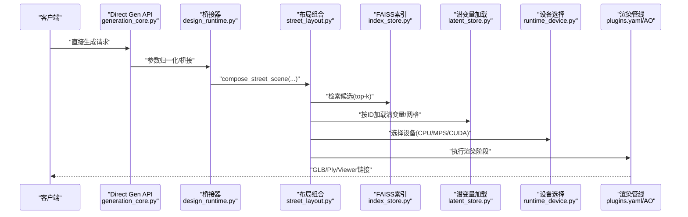

**图表来源**
- [src/roadgen3d/services/generation_core.py:267-444](file://src/roadgen3d/services/generation_core.py#L267-L444)
- [src/roadgen3d/services/design_runtime.py:336-397](file://src/roadgen3d/services/design_runtime.py#L336-L397)
- [src/roadgen3d/street_layout.py:1-120](file://src/roadgen3d/street_layout.py#L1-L120)
- [src/roadgen3d/index_store.py:79-96](file://src/roadgen3d/index_store.py#L79-L96)
- [src/roadgen3d/latent_store.py:57-81](file://src/roadgen3d/latent_store.py#L57-L81)
- [src/roadgen3d/runtime_device.py:37-72](file://src/roadgen3d/runtime_device.py#L37-L72)
- [metaurban/metaurban/render_pipeline/config/plugins.yaml:6-24](file://metaurban/metaurban/render_pipeline/config/plugins.yaml#L6-L24)

## 详细组件分析

### 组件A：设备选择与回退（runtime_device）
- 功能要点
  - 自动探测 MPS/CUDA 可用性，回退至 CPU 并发出警告。
  - 提供 torch.device 解析，确保下游推理/渲染正确绑定硬件。
- 性能影响
  - 正确的设备选择直接影响算子吞吐与显存占用；在多后端环境中避免反复重试。
- 优化建议
  - 预热设备：在进程启动时预先 resolve 并初始化一次设备，减少首次延迟。
  - 固定设备：在 CI 或容器中固定设备类型，避免运行时回退带来的不确定性。
  - 监控指标：记录设备类型与回退次数，作为回归检测依据。

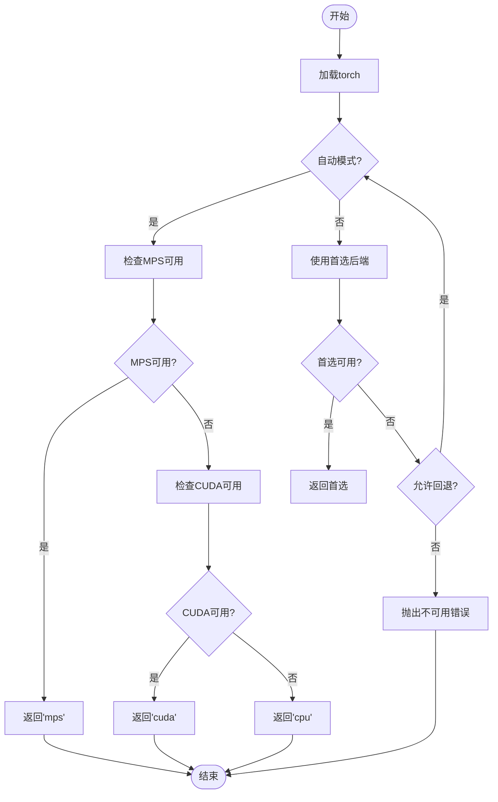

**图表来源**
- [src/roadgen3d/runtime_device.py:37-72](file://src/roadgen3d/runtime_device.py#L37-L72)

**章节来源**
- [src/roadgen3d/runtime_device.py:37-72](file://src/roadgen3d/runtime_device.py#L37-L72)

### 组件B：直接生成 API（generation_core）
- 功能要点
  - 提供 MetaUrban/模板/OSM 三类直接生成入口，封装参数、桥接、后端与结果构建。
  - 支持失败状态与错误信息记录，便于定位问题。
- 性能影响
  - 参数归一化与桥接开销较小；主要瓶颈在布局组合与渲染阶段。
- 优化建议
  - 批量化：对多个请求进行批处理，复用设备与索引。
  - 缓存：对相同参数的生成结果进行缓存，避免重复计算。
  - 调度：在高并发场景下引入队列与限流，防止资源争抢。

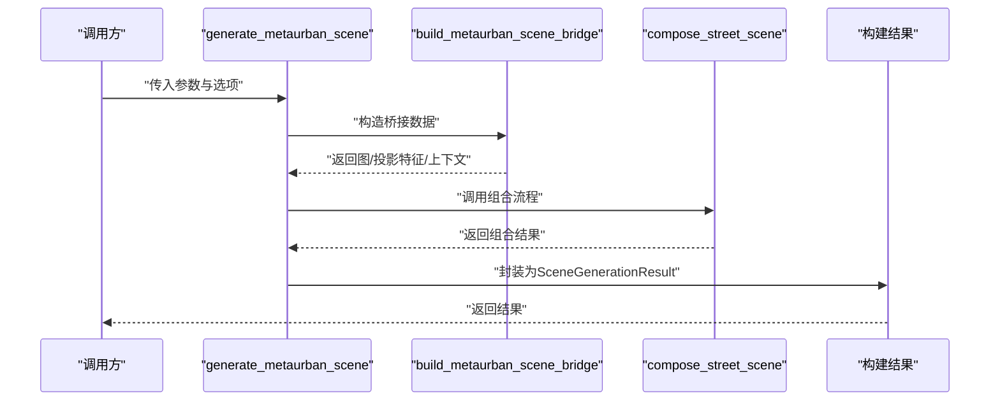

**图表来源**
- [src/roadgen3d/services/generation_core.py:267-343](file://src/roadgen3d/services/generation_core.py#L267-L343)

**章节来源**
- [src/roadgen3d/services/generation_core.py:84-155](file://src/roadgen3d/services/generation_core.py#L84-L155)
- [src/roadgen3d/services/generation_core.py:267-444](file://src/roadgen3d/services/generation_core.py#L267-L444)

### 组件C：场景生成编排（design_runtime）
- 功能要点
  - 将设计草稿合并默认配置，解析场景上下文，按模板/图/OSM 生成不同布局，并构建最终结果。
- 性能影响
  - 大量 I/O 与组合计算集中在 compose_street_scene；设备与后端选择在此处生效。
- 优化建议
  - 延迟加载：仅在需要时加载桥接数据与后端。
  - 结果缓存：对相同草稿与上下文的结果进行缓存。
  - 并行化：对独立场景生成任务并行执行。

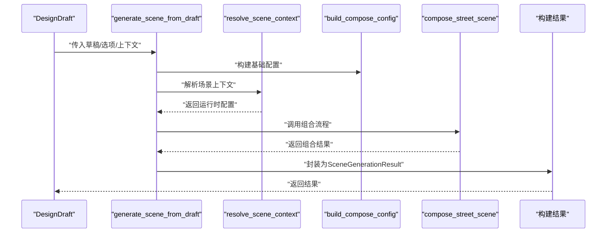

**图表来源**
- [src/roadgen3d/services/design_runtime.py:336-397](file://src/roadgen3d/services/design_runtime.py#L336-L397)

**章节来源**
- [src/roadgen3d/services/design_runtime.py:60-94](file://src/roadgen3d/services/design_runtime.py#L60-L94)
- [src/roadgen3d/services/design_runtime.py:336-397](file://src/roadgen3d/services/design_runtime.py#L336-L397)

### 组件D：潜变量与资产加载（latent_store）
- 功能要点
  - 从 JSONL 加载资产元数据，按 asset_id 解析潜变量或网格路径，安全反序列化并校验形状。
- 性能影响
  - I/O 与反序列化是主要成本；路径解析与类型校验带来额外开销。
- 优化建议
  - 预热：在进程启动时批量加载常用资产记录。
  - 缓存：对已加载的潜变量/网格进行缓存，避免重复 IO。
  - 权重加载：优先使用 weights_only 的安全加载方式。

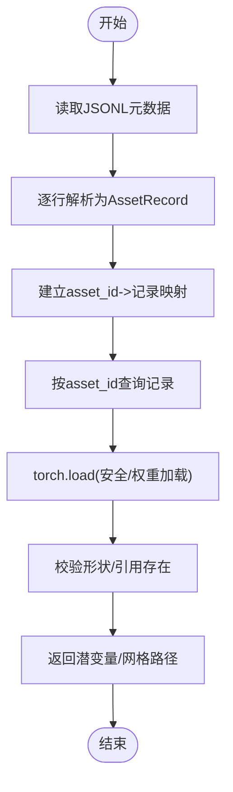

**图表来源**
- [src/roadgen3d/latent_store.py:12-81](file://src/roadgen3d/latent_store.py#L12-L81)

**章节来源**
- [src/roadgen3d/latent_store.py:12-81](file://src/roadgen3d/latent_store.py#L12-L81)

### 组件E：文本到资产检索（index_store）
- 功能要点
  - 基于 FAISS 构建/加载 IndexFlatIP，提供检索能力；设置多线程环境变量以规避冲突。
- 性能影响
  - FAISS 初始化与搜索是热点；线程数设置直接影响吞吐与 CPU 占用。
- 优化建议
  - 线程隔离：在多线程场景下限制 FAISS 线程数，避免竞争。
  - 索引持久化：将索引与 ID 映射持久化，避免重复构建。
  - 分片检索：对超大索引进行分片，按需加载。

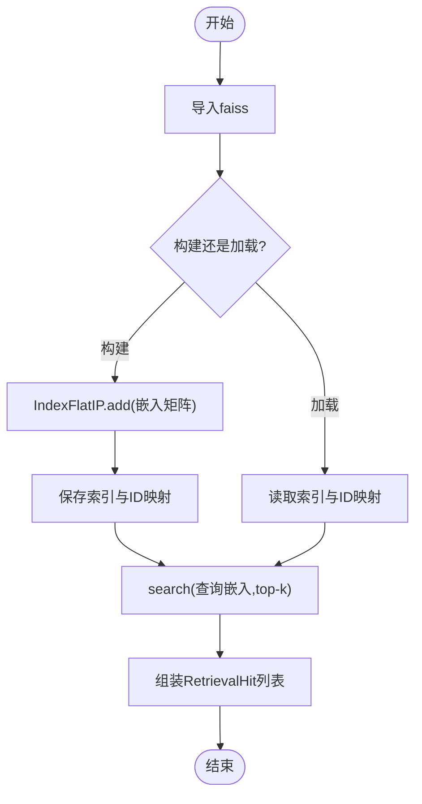

**图表来源**
- [src/roadgen3d/index_store.py:33-96](file://src/roadgen3d/index_store.py#L33-L96)

**章节来源**
- [src/roadgen3d/index_store.py:14-19](file://src/roadgen3d/index_store.py#L14-L19)
- [src/roadgen3d/index_store.py:33-96](file://src/roadgen3d/index_store.py#L33-L96)

### 组件F：街道级组合与评估（street_layout）
- 功能要点
  - 包含网格缓存、质量过滤、布局求解、纹理与美化等子系统；大量几何/空间计算。
- 性能影响
  - 网格缓存与 Y 轴归一化、候选过滤、布局求解、渲染评估均可能成为瓶颈。
- 优化建议
  - 网格缓存：对 mesh 进行 Y 轴归一化并缓存，避免重复计算边界。
  - 候选过滤：提前剔除低质量/不适用资产，减少后续计算。
  - 并行求解：对独立段落的布局求解并行化。
  - 渲染评估：将耗时评估移至后台或异步队列。

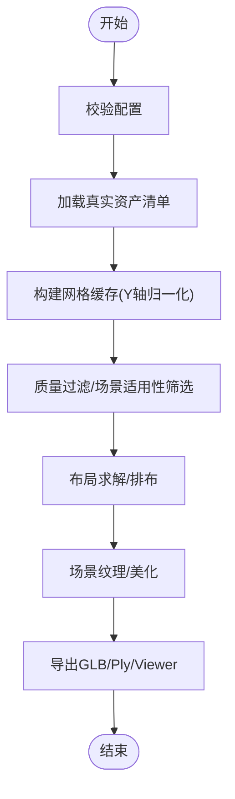

**图表来源**
- [src/roadgen3d/street_layout.py:492-611](file://src/roadgen3d/street_layout.py#L492-L611)
- [src/roadgen3d/street_layout.py:620-670](file://src/roadgen3d/street_layout.py#L620-L670)
- [src/roadgen3d/street_layout.py:672-758](file://src/roadgen3d/street_layout.py#L672-L758)

**章节来源**
- [src/roadgen3d/street_layout.py:146-180](file://src/roadgen3d/street_layout.py#L146-L180)
- [src/roadgen3d/street_layout.py:492-611](file://src/roadgen3d/street_layout.py#L492-L611)
- [src/roadgen3d/street_layout.py:620-758](file://src/roadgen3d/street_layout.py#L620-L758)

### 组件G：渲染插件与参数（render_pipeline）
- 功能要点
  - 通过 plugins.yaml 启用/禁用效果插件；ao/config.yaml 定义 AO 等参数，直接影响 GPU/CPU 负载。
- 性能影响
  - 开启更多插件会增加 GPU 内存与带宽压力；参数调整可显著改变帧率。
- 优化建议
  - 按需启用：仅启用必要的插件，关闭高开销项（如 Bloom/DOF）。
  - 参数调参：根据目标帧率调整 AO/SSR/FXAA 等参数，权衡画质与性能。
  - 渲染分辨率：在预览阶段降低分辨率，正式导出再恢复。

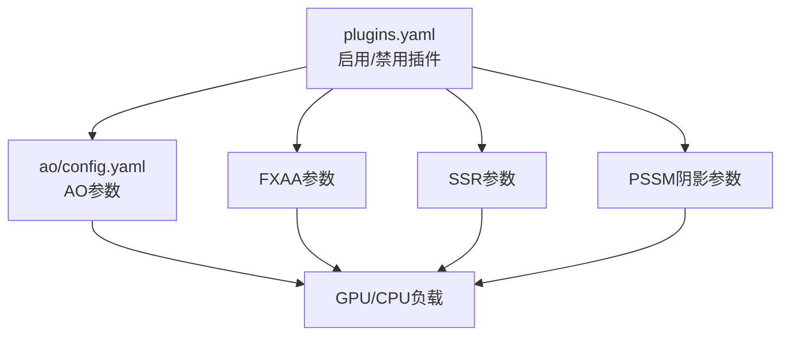

**图表来源**
- [metaurban/metaurban/render_pipeline/config/plugins.yaml:6-24](file://metaurban/metaurban/render_pipeline/config/plugins.yaml#L6-L24)
- [metaurban/metaurban/render_pipeline/rpplugins/ao/config.yaml:1-281](file://metaurban/metaurban/render_pipeline/rpplugins/ao/config.yaml#L1-L281)

**章节来源**
- [metaurban/metaurban/render_pipeline/config/plugins.yaml:6-24](file://metaurban/metaurban/render_pipeline/config/plugins.yaml#L6-L24)
- [metaurban/metaurban/render_pipeline/rpplugins/ao/config.yaml:1-281](file://metaurban/metaurban/render_pipeline/rpplugins/ao/config.yaml#L1-L281)

### 组件H：渲染缓存与对象管理（data_buffer）
- 功能要点
  - 维护对象缓存队列，按容量上限清理旧对象，降低频繁分配/销毁带来的抖动。
- 性能影响
  - 合理的缓存大小可显著降低 GC 压力与帧时间抖动。
- 优化建议
  - 动态调整缓存大小：根据场景复杂度与内存预算自适应。
  - 引用计数：在销毁前确保无外部引用，避免悬挂指针。

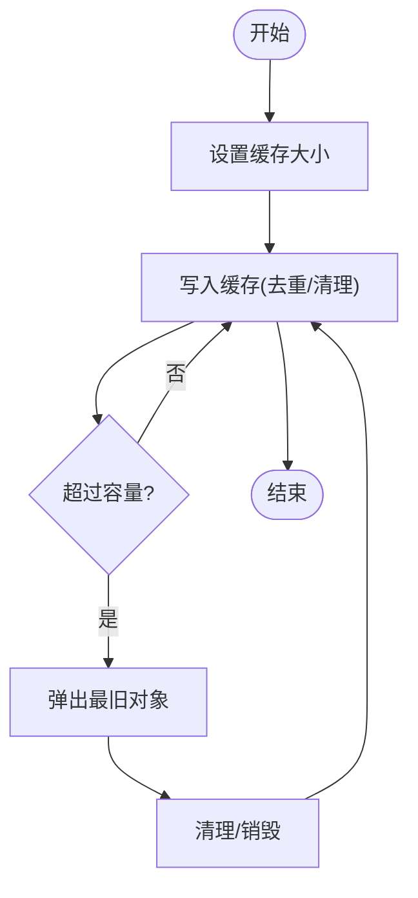

**图表来源**
- [metaurban/metaurban/utils/data_buffer.py:31-85](file://metaurban/metaurban/utils/data_buffer.py#L31-L85)

**章节来源**
- [metaurban/metaurban/utils/data_buffer.py:31-85](file://metaurban/metaurban/utils/data_buffer.py#L31-L85)

### 组件I：类注册与 CUDA 辅助（registry/cuda）
- 功能要点
  - 统一注册可实例化的类，提供按名获取；CUDA 辅助函数用于错误检查。
- 性能影响
  - 注册表一次性初始化即可；CUDA 错误检查可避免隐式失败。
- 优化建议
  - 预注册：在应用启动时完成注册，避免运行时查找。
  - 错误前置：在关键路径前置检查 CUDA 状态，尽早失败。

**章节来源**
- [metaurban/metaurban/utils/registry.py:5-41](file://metaurban/metaurban/utils/registry.py#L5-L41)
- [metaurban/metaurban/utils/cuda.py:16-34](file://metaurban/metaurban/utils/cuda.py#L16-L34)

## 依赖分析
- 低耦合高内聚：服务层与布局层通过接口清晰分离，便于独立优化。
- 关键依赖链
  - generation_core → street_layout → index_store/latent_store → runtime_device
  - design_runtime → street_layout → render_pipeline
- 潜在风险
  - FAISS 线程冲突：需通过环境变量隔离。
  - 设备不可用：需在运行前进行探测与回退。
  - 渲染插件过多：可能导致 GPU 内存不足或帧率骤降。

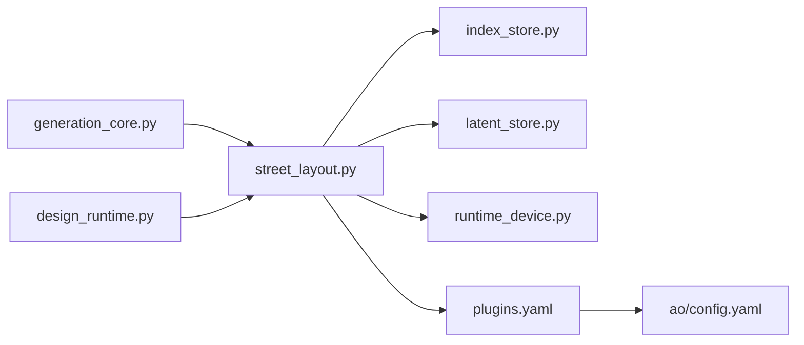

**图表来源**
- [src/roadgen3d/services/generation_core.py:267-444](file://src/roadgen3d/services/generation_core.py#L267-L444)
- [src/roadgen3d/services/design_runtime.py:336-397](file://src/roadgen3d/services/design_runtime.py#L336-L397)
- [src/roadgen3d/street_layout.py:1-120](file://src/roadgen3d/street_layout.py#L1-L120)
- [src/roadgen3d/index_store.py:33-96](file://src/roadgen3d/index_store.py#L33-L96)
- [src/roadgen3d/latent_store.py:35-81](file://src/roadgen3d/latent_store.py#L35-L81)
- [src/roadgen3d/runtime_device.py:37-72](file://src/roadgen3d/runtime_device.py#L37-L72)
- [metaurban/metaurban/render_pipeline/config/plugins.yaml:6-24](file://metaurban/metaurban/render_pipeline/config/plugins.yaml#L6-L24)
- [metaurban/metaurban/render_pipeline/rpplugins/ao/config.yaml:1-281](file://metaurban/metaurban/render_pipeline/rpplugins/ao/config.yaml#L1-L281)

**章节来源**
- [src/roadgen3d/services/generation_core.py:267-444](file://src/roadgen3d/services/generation_core.py#L267-L444)
- [src/roadgen3d/services/design_runtime.py:336-397](file://src/roadgen3d/services/design_runtime.py#L336-L397)
- [src/roadgen3d/street_layout.py:1-120](file://src/roadgen3d/street_layout.py#L1-L120)
- [src/roadgen3d/index_store.py:33-96](file://src/roadgen3d/index_store.py#L33-L96)
- [src/roadgen3d/latent_store.py:35-81](file://src/roadgen3d/latent_store.py#L35-L81)
- [src/roadgen3d/runtime_device.py:37-72](file://src/roadgen3d/runtime_device.py#L37-L72)
- [metaurban/metaurban/render_pipeline/config/plugins.yaml:6-24](file://metaurban/metaurban/render_pipeline/config/plugins.yaml#L6-L24)
- [metaurban/metaurban/render_pipeline/rpplugins/ao/config.yaml:1-281](file://metaurban/metaurban/render_pipeline/rpplugins/ao/config.yaml#L1-L281)

## 性能考量
- 内存使用优化
  - 网格缓存与对象缓存：利用 _MeshCacheEntry 与 DataBuffer 控制内存峰值与碎片。
  - 潜变量安全加载：weights_only 与路径校验，避免异常导致的内存泄漏。
  - FAISS 线程隔离：通过环境变量限制线程数，降低内存竞争。
- 计算效率提升
  - 候选过滤：在进入布局求解前剔除低质量资产，减少无效计算。
  - 并行求解：对独立段落并行化，结合队列限流避免过载。
  - 设备选择：自动回退策略确保稳定运行，避免反复失败。
- I/O 操作优化
  - 索引持久化：避免重复构建 FAISS 索引。
  - 资产元数据缓存：在进程内缓存 JSONL 解析结果。
  - 路径解析：统一基目录解析，减少字符串拼接与 IO。
- 渲染性能
  - 插件按需启用：关闭高开销插件，降低 GPU 带宽与内存占用。
  - 参数调优：根据目标帧率调整 AO/SSR/FXAA 等参数。
  - 分辨率策略：预览阶段降分辨率，导出阶段恢复。

[本节为通用指导，无需特定文件分析]

## 故障排查指南
- 设备不可用
  - 现象：推理/渲染报错或回退至 CPU。
  - 排查：确认 MPS/CUDA 是否可用，查看回退警告；固定设备类型避免波动。
  - 参考：[runtime_device.py:37-72](file://src/roadgen3d/runtime_device.py#L37-L72)
- FAISS 不可用
  - 现象：检索功能报错。
  - 排查：安装 requirements-m1.txt；检查索引与 ID 映射文件是否存在。
  - 参考：[index_store.py:21-31](file://src/roadgen3d/index_store.py#L21-L31)
- CUDA 错误
  - 现象：运行时报 CUDA 错误码。
  - 排查：使用 cuda.py 的错误检查工具定位错误；确认驱动与库版本匹配。
  - 参考：[cuda.py:16-34](file://metaurban/metaurban/utils/cuda.py#L16-L34)
- 渲染插件导致帧率骤降
  - 现象：开启某些插件后帧率明显下降。
  - 排查：在 plugins.yaml 中禁用高开销插件；调整 ao/config.yaml 参数。
  - 参考：[plugins.yaml:6-24](file://metaurban/metaurban/render_pipeline/config/plugins.yaml#L6-L24), [ao/config.yaml:1-281](file://metaurban/metaurban/render_pipeline/rpplugins/ao/config.yaml#L1-L281)
- 对象缓存未释放
  - 现象：长时间运行后内存持续增长。
  - 排查：检查 DataBuffer 的容量与清理逻辑；确保对象销毁路径正确。
  - 参考：[data_buffer.py:31-85](file://metaurban/metaurban/utils/data_buffer.py#L31-L85)

**章节来源**
- [src/roadgen3d/runtime_device.py:37-72](file://src/roadgen3d/runtime_device.py#L37-L72)
- [src/roadgen3d/index_store.py:21-31](file://src/roadgen3d/index_store.py#L21-L31)
- [metaurban/metaurban/utils/cuda.py:16-34](file://metaurban/metaurban/utils/cuda.py#L16-L34)
- [metaurban/metaurban/render_pipeline/config/plugins.yaml:6-24](file://metaurban/metaurban/render_pipeline/config/plugins.yaml#L6-L24)
- [metaurban/metaurban/render_pipeline/rpplugins/ao/config.yaml:1-281](file://metaurban/metaurban/render_pipeline/rpplugins/ao/config.yaml#L1-L281)
- [metaurban/metaurban/utils/data_buffer.py:31-85](file://metaurban/metaurban/utils/data_buffer.py#L31-L85)

## 结论
通过对设备选择、检索与加载、布局组合与渲染等关键环节的系统性优化，可在保证质量的前提下显著提升插件性能。建议以“预热+缓存+按需启用+参数调优+并行化”为主线，结合监控与回归检测，持续迭代性能表现。

[本节为总结，无需特定文件分析]

## 附录
- 性能监控指标建议
  - 设备类型与回退次数、索引构建/加载耗时、检索耗时、网格缓存命中率、渲染帧率、GPU/CPU 使用率、内存峰值与分配速率。
- 基准测试方法
  - 固定场景与参数，测量端到端时延与吞吐；对比不同设备/插件配置下的差异。
- 性能回归检测
  - 在 CI 中加入基准测试与回归阈值告警；对关键路径（检索、布局、渲染）分别建立回归检测。

[本节为通用指导，无需特定文件分析]