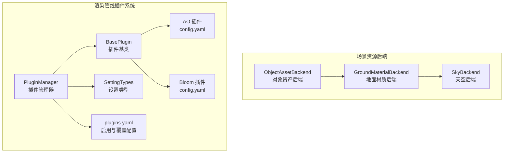
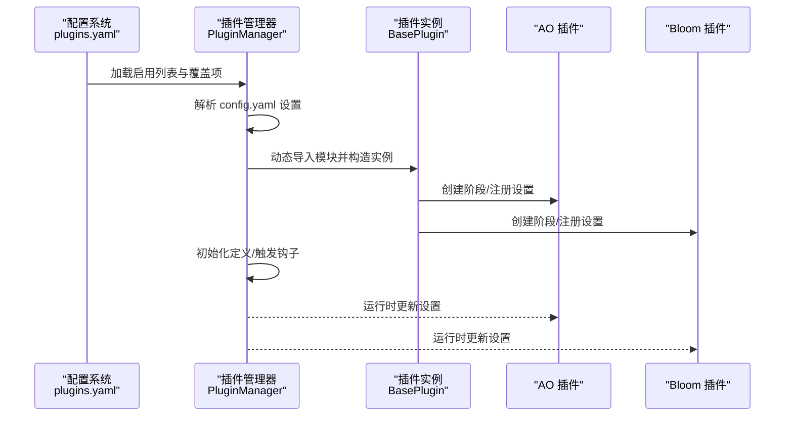
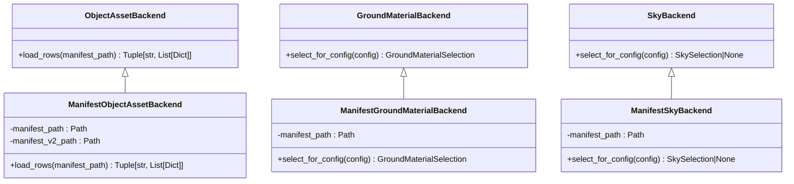
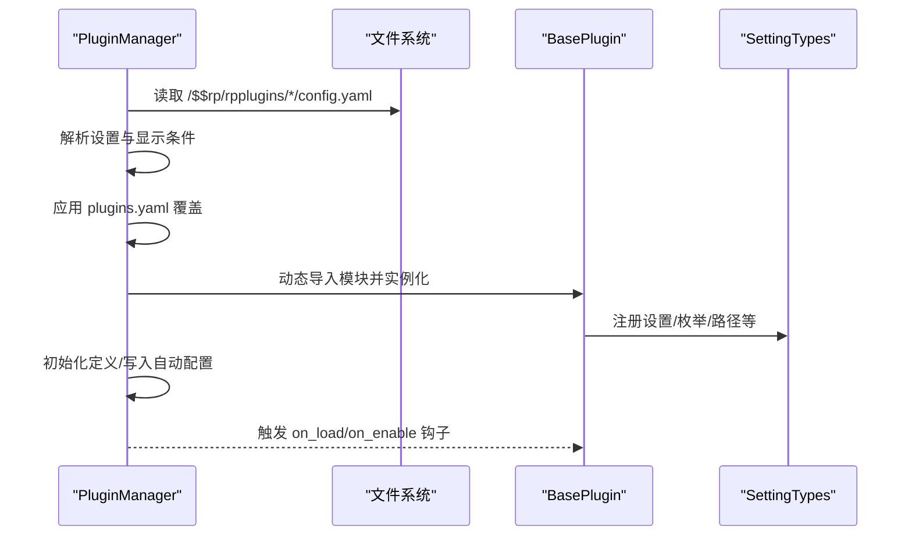
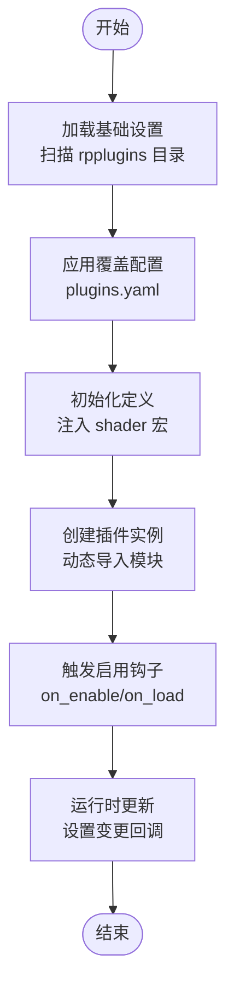
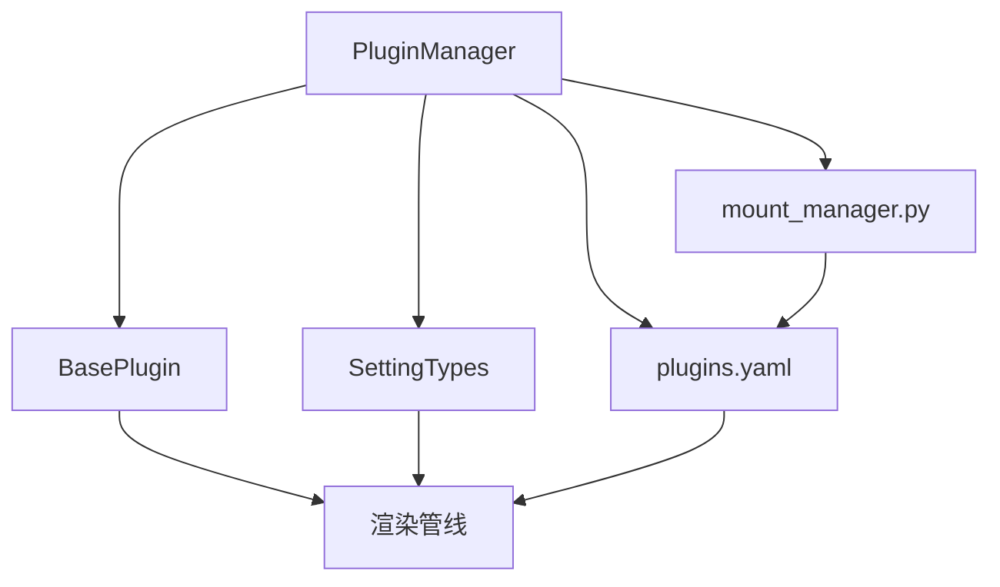

# 插件架构基础

<cite>
**本文档引用的文件**
- [scene_backends.py](file://src/roadgen3d/services/scene_backends.py)
- [test_scene_backends.py](file://tests/test_scene_backends.py)
- [manager.py](file://metaurban/metaurban/render_pipeline/rpcore/pluginbase/manager.py)
- [base_plugin.py](file://metaurban/metaurban/render_pipeline/rpcore/pluginbase/base_plugin.py)
- [setting_types.py](file://metaurban/metaurban/render_pipeline/rpcore/pluginbase/setting_types.py)
- [plugins.yaml](file://metaurban/metaurban/render_pipeline/config/plugins.yaml)
- [config.yaml（AO插件）](file://metaurban/metaurban/render_pipeline/rpplugins/ao/config.yaml)
- [config.yaml（Bloom插件）](file://metaurban/metaurban/render_pipeline/rpplugins/bloom/config.yaml)
- [mount_manager.py](file://metaurban/metaurban/render_pipeline/rpcore/mount_manager.py)
- [render_pipeline.py](file://metaurban/metaurban/render_pipeline/rpcore/render_pipeline.py)
- [README.md（插件目录）](file://metaurban/metaurban/render_pipeline/rpplugins/README.md)
- [version.py](file://metaurban/metaurban/version.py)
</cite>

## 目录
1. [引言](#引言)
2. [项目结构](#项目结构)
3. [核心组件](#核心组件)
4. [架构总览](#架构总览)
5. [详细组件分析](#详细组件分析)
6. [依赖分析](#依赖分析)
7. [性能考虑](#性能考虑)
8. [故障排除指南](#故障排除指南)
9. [结论](#结论)
10. [附录](#附录)

## 引言
本文件系统性梳理 RoadGen3D 的插件架构基础，聚焦于场景生成后端的插件化设计与实现。文档围绕以下目标展开：
- 解释插件系统整体设计理念与架构模式
- 详解 ObjectAssetBackend、GroundMaterialBackend、SkyBackend 等核心抽象类的设计原则与职责边界
- 文档化插件接口规范、数据模型定义与生命周期管理
- 说明插件注册机制、配置加载流程与依赖注入模式
- 提供插件架构图与组件关系图，阐明各插件间的协作方式
- 给出版本兼容性策略与扩展点设计原则

## 项目结构
RoadGen3D 的插件体系由两条主线构成：
- 场景资源选择后端：以 Manifest 为数据源的对象资产、地面材质与天空后端，负责根据场景配置进行智能选择与回填
- 渲染管线插件系统：MetaUrban 渲染管线的插件框架，支持配置驱动、运行时热更新与依赖管理

图表来源
- [scene_backends.py:96-203](file://src/roadgen3d/services/scene_backends.py#L96-L203)
- [manager.py:41-98](file://metaurban/metaurban/render_pipeline/rpcore/pluginbase/manager.py#L41-L98)
- [base_plugin.py:32-101](file://metaurban/metaurban/render_pipeline/rpcore/pluginbase/base_plugin.py#L32-L101)
- [setting_types.py:50-95](file://metaurban/metaurban/render_pipeline/rpcore/pluginbase/setting_types.py#L50-L95)
- [plugins.yaml:6-24](file://metaurban/metaurban/render_pipeline/config/plugins.yaml#L6-L24)
- [config.yaml（AO插件）:2-281](file://metaurban/metaurban/render_pipeline/rpplugins/ao/config.yaml#L2-L281)
- [config.yaml（Bloom插件）:2-43](file://metaurban/metaurban/render_pipeline/rpplugins/bloom/config.yaml#L2-L43)

章节来源
- [scene_backends.py:1-527](file://src/roadgen3d/services/scene_backends.py#L1-L527)
- [manager.py:41-280](file://metaurban/metaurban/render_pipeline/rpcore/pluginbase/manager.py#L41-L280)
- [base_plugin.py:32-101](file://metaurban/metaurban/render_pipeline/rpcore/pluginbase/base_plugin.py#L32-L101)
- [setting_types.py:50-235](file://metaurban/metaurban/render_pipeline/rpcore/pluginbase/setting_types.py#L50-L235)
- [plugins.yaml:1-200](file://metaurban/metaurban/render_pipeline/config/plugins.yaml#L1-L200)
- [config.yaml（AO插件）:1-281](file://metaurban/metaurban/render_pipeline/rpplugins/ao/config.yaml#L1-L281)
- [config.yaml（Bloom插件）:1-43](file://metaurban/metaurban/render_pipeline/rpplugins/bloom/config.yaml#L1-L43)

## 核心组件
本节聚焦 RoadGen3D 中与插件架构直接相关的核心抽象与实现。

- ObjectAssetBackend 抽象类
  - 职责：定义对象资产清单加载接口，作为所有对象资产后端的统一入口
  - 关键方法：load_rows，用于按清单路径加载原始行数据
  - 设计要点：通过抽象接口隔离不同清单格式（v1/v2），便于演进与兼容

- GroundMaterialBackend 抽象类
  - 职责：根据场景配置选择合适的地面材质集合，返回材质 ID 映射与纹理覆盖
  - 关键方法：select_for_config，基于查询语句与标签匹配度打分
  - 设计要点：支持场景表面角色到材质的映射与回退策略

- SkyBackend 抽象类
  - 职责：根据场景配置选择合适的天空记录（含 HDRI、时间/天气标签）
  - 关键方法：select_for_config，返回 SkySelection 或 None
  - 设计要点：对“日出/日落/黄金时刻”等光照条件有专门打分逻辑

- ManifestObjectAssetBackend 实现
  - 特性：优先使用 v2 清单，回退至 v1 清单并进行合并
  - 行为：解析资产元数据、路径解析与规范化、角色推断与字段合并

- ManifestGroundMaterialBackend 实现
  - 特性：按地面材质清单加载，按表面角色与标签匹配度打分
  - 回退策略：针对未找到候选的角色，采用预设回退映射

- ManifestSkyBackend 实现
  - 特性：按天空清单加载，综合时间/天气/区域标签进行打分
  - 返回值：包含 HDRI 路径与时间参数的 SkySelection

章节来源
- [scene_backends.py:96-203](file://src/roadgen3d/services/scene_backends.py#L96-L203)
- [scene_backends.py:205-317](file://src/roadgen3d/services/scene_backends.py#L205-L317)
- [scene_backends.py:438-485](file://src/roadgen3d/services/scene_backends.py#L438-L485)
- [scene_backends.py:488-514](file://src/roadgen3d/services/scene_backends.py#L488-L514)

## 架构总览
RoadGen3D 的插件架构分为三层：
- 数据层：以 Manifest 为核心的数据源，承载对象资产、地面材质与天空资源
- 选择层：后端抽象与实现，负责从清单中检索并选择最符合场景需求的资源
- 配置层：渲染管线插件系统，提供配置驱动的插件加载、启用与运行时更新能力

图表来源
- [plugins.yaml:6-24](file://metaurban/metaurban/render_pipeline/config/plugins.yaml#L6-L24)
- [manager.py:58-75](file://metaurban/metaurban/render_pipeline/rpcore/pluginbase/manager.py#L58-L75)
- [base_plugin.py:44-101](file://metaurban/metaurban/render_pipeline/rpcore/pluginbase/base_plugin.py#L44-L101)
- [config.yaml（AO插件）:2-281](file://metaurban/metaurban/render_pipeline/rpplugins/ao/config.yaml#L2-L281)
- [config.yaml（Bloom插件）:2-43](file://metaurban/metaurban/render_pipeline/rpplugins/bloom/config.yaml#L2-L43)

## 详细组件分析

### 场景资源后端组件分析
- ObjectAssetBackend 与 ManifestObjectAssetBackend
  - 设计原则：接口最小化、实现可替换、兼容旧版清单
  - 数据处理：路径解析、字段清洗、角色推断、v1/v2 合并
  - 性能考量：延迟加载、合并去重、字段裁剪

- GroundMaterialBackend 与 ManifestGroundMaterialBackend
  - 设计原则：按场景角色选择材质、标签打分、回退策略
  - 评分函数：风格/天气/区域标签匹配度、表面类型关键词匹配
  - 回退映射：针对缺失候选的角色，按预设顺序回退

- SkyBackend 与 ManifestSkyBackend
  - 设计原则：时间/天气/光照标签综合评分
  - 特殊规则：夜间偏好、暖色光照偏好、黄金时刻偏好

图表来源
- [scene_backends.py:96-203](file://src/roadgen3d/services/scene_backends.py#L96-L203)
- [scene_backends.py:237-317](file://src/roadgen3d/services/scene_backends.py#L237-L317)

章节来源
- [scene_backends.py:96-317](file://src/roadgen3d/services/scene_backends.py#L96-L317)

### 渲染管线插件系统组件分析
- 插件管理器 PluginManager
  - 职责：加载配置、构建实例、启用/禁用插件、触发钩子、保存覆盖
  - 生命周期：load → 构造实例 → 初始化定义 → 运行时更新
  - 依赖检查：确保所需插件已启用，C++ 模块可用性校验

- 插件基类 BasePlugin
  - 职责：提供资源路径访问、阶段创建、设置读取、插件间通信、着色器重载
  - 扩展点：required_plugins、native_only、钩子方法约定

- 设置类型 SettingTypes
  - 职责：定义设置类型工厂、基础类型与验证逻辑
  - 类型：整数/浮点/布尔/枚举/路径/幂次分辨率/采样序列
  - 运行时：支持 shader_runtime 与 runtime 设置的自动重载

图表来源
- [manager.py:58-98](file://metaurban/metaurban/render_pipeline/rpcore/pluginbase/manager.py#L58-L98)
- [manager.py:108-147](file://metaurban/metaurban/render_pipeline/rpcore/pluginbase/manager.py#L108-L147)
- [base_plugin.py:44-101](file://metaurban/metaurban/render_pipeline/rpcore/pluginbase/base_plugin.py#L44-L101)
- [setting_types.py:50-95](file://metaurban/metaurban/render_pipeline/rpcore/pluginbase/setting_types.py#L50-L95)

章节来源
- [manager.py:41-280](file://metaurban/metaurban/render_pipeline/rpcore/pluginbase/manager.py#L41-L280)
- [base_plugin.py:32-101](file://metaurban/metaurban/render_pipeline/rpcore/pluginbase/base_plugin.py#L32-L101)
- [setting_types.py:50-235](file://metaurban/metaurban/render_pipeline/rpcore/pluginbase/setting_types.py#L50-L235)

### 配置加载与依赖注入流程
- 配置加载
  - 基础设置：扫描 /$$rp/rpplugins 下的插件目录，读取 config.yaml
  - 覆盖设置：读取 /$$rpconfig/plugins.yaml，应用启用列表与覆盖项
  - 白天设置：可选的 daytime.yaml 控制随时间变化的参数

- 依赖注入
  - 插件实例持有 pipeline 引用，通过管理器共享设置句柄
  - 插件可通过 get_setting/get_daytime_setting 获取其他插件设置
  - 着色器宏：通过 init_defines 将启用插件与设置注入到渲染阶段

图表来源
- [manager.py:58-98](file://metaurban/metaurban/render_pipeline/rpcore/pluginbase/manager.py#L58-L98)
- [manager.py:180-190](file://metaurban/metaurban/render_pipeline/rpcore/pluginbase/manager.py#L180-L190)
- [plugins.yaml:6-24](file://metaurban/metaurban/render_pipeline/config/plugins.yaml#L6-L24)

章节来源
- [plugins.yaml:1-200](file://metaurban/metaurban/render_pipeline/config/plugins.yaml#L1-L200)
- [manager.py:100-161](file://metaurban/metaurban/render_pipeline/rpcore/pluginbase/manager.py#L100-L161)

## 依赖分析
- 组件耦合
  - 渲染管线插件系统内部高度内聚：管理器统一调度，插件通过基类共享能力
  - 场景资源后端与渲染管线解耦：通过 Selection 数据模型传递结果

- 外部依赖
  - 文件系统与 VFS：通过 mount_manager 将配置目录挂载到 /$$rpconfig
  - Panda3D 渲染引擎：插件系统建立在 Panda3D 基础设施之上
  - 版本与资产：version.py 提供版本号与资产版本一致性检查

图表来源
- [manager.py:41-98](file://metaurban/metaurban/render_pipeline/rpcore/pluginbase/manager.py#L41-L98)
- [mount_manager.py:273-290](file://metaurban/metaurban/render_pipeline/rpcore/mount_manager.py#L273-L290)
- [version.py:1-19](file://metaurban/metaurban/version.py#L1-L19)

章节来源
- [mount_manager.py:273-290](file://metaurban/metaurban/render_pipeline/rpcore/mount_manager.py#L273-L290)
- [version.py:1-19](file://metaurban/metaurban/version.py#L1-L19)

## 性能考虑
- 渲染管线插件系统
  - 动态导入与实例化：仅在启用时加载，避免不必要的开销
  - 运行时更新：支持 shader_runtime 设置即时重载，减少重启成本
  - 定义注入：将设置映射为着色器宏，降低运行时查询成本

- 场景资源后端
  - 清单合并：v1/v2 合并时采用字典去重，避免重复扫描
  - 标签打分：预计算候选集，减少重复匹配开销
  - 路径解析：统一基路径解析，避免重复 I/O

## 故障排除指南
- 插件无法加载
  - 检查 plugins.yaml 是否正确列出插件 ID
  - 确认 config.yaml 格式正确（需 !!omap）
  - 若插件声明 native_only，请确认 C++ 模块已加载

- 设置无效或未生效
  - 核对覆盖文件中的插件 ID 与设置项是否存在
  - 对于 shader_runtime 设置，确认已触发重载流程
  - 使用插件配置器查看可见性条件是否满足

- 资产版本不一致
  - 检查版本文件与当前版本是否匹配
  - 如资产缺失关键纹理，按提示更新资产

章节来源
- [manager.py:118-120](file://metaurban/metaurban/render_pipeline/rpcore/pluginbase/manager.py#L118-L120)
- [manager.py:196-205](file://metaurban/metaurban/render_pipeline/rpcore/pluginbase/manager.py#L196-L205)
- [version.py:6-18](file://metaurban/metaurban/version.py#L6-L18)

## 结论
RoadGen3D 的插件架构以“配置驱动 + 清单选择”的双轨设计实现高扩展性与强兼容性：
- 渲染管线插件系统通过统一的管理器与基类，提供稳定的生命周期与依赖注入机制
- 场景资源后端以抽象接口与清单驱动，确保资产选择的智能化与可演进性
- 通过明确的扩展点与版本兼容策略，系统在功能增强与性能优化之间取得平衡

## 附录
- 插件目录说明：插件应放置于 rpplugins 目录下，并提供 config.yaml
- 典型插件示例：AO 与 Bloom 插件展示了设置类型与运行时更新的完整实践

章节来源
- [README.md（插件目录）:1-9](file://metaurban/metaurban/render_pipeline/rpplugins/README.md#L1-L9)
- [config.yaml（AO插件）:1-281](file://metaurban/metaurban/render_pipeline/rpplugins/ao/config.yaml#L1-L281)
- [config.yaml（Bloom插件）:1-43](file://metaurban/metaurban/render_pipeline/rpplugins/bloom/config.yaml#L1-L43)