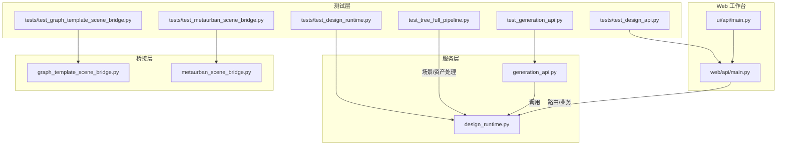
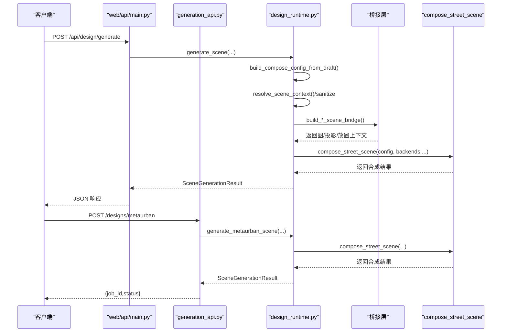
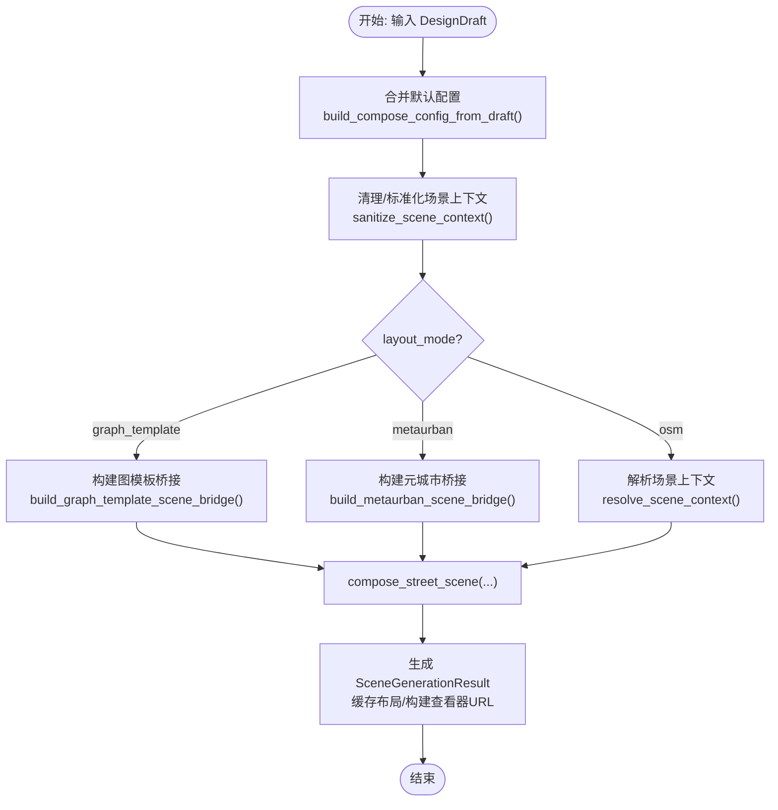
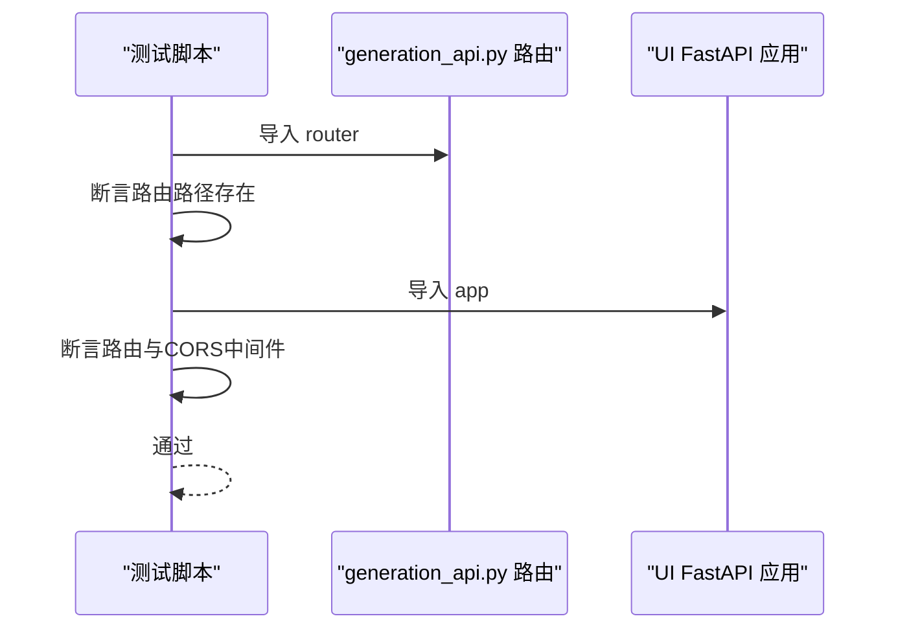
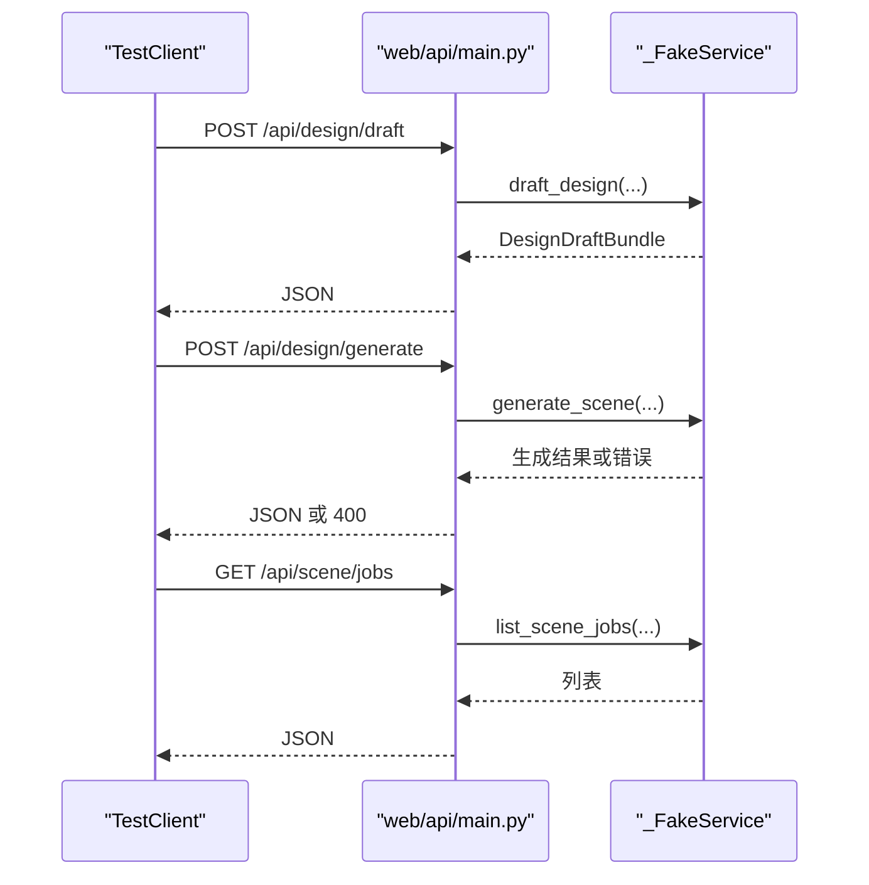
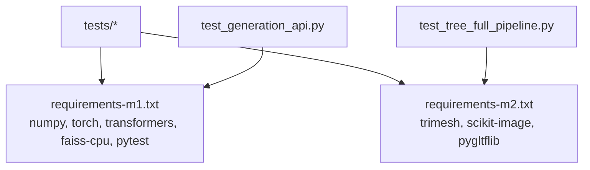

# 插件测试与调试

<cite>
**本文档引用的文件**
- [tests/test_design_runtime.py](file://tests/test_design_runtime.py)
- [test_generation_api.py](file://test_generation_api.py)
- [test_tree_full_pipeline.py](file://test_tree_full_pipeline.py)
- [src/roadgen3d/services/generation_api.py](file://src/roadgen3d/services/generation_api.py)
- [src/roadgen3d/services/design_runtime.py](file://src/roadgen3d/services/design_runtime.py)
- [ui/api/main.py](file://ui/api/main.py)
- [web/api/main.py](file://web/api/main.py)
- [tests/test_design_api.py](file://tests/test_design_api.py)
- [tests/test_metaurban_scene_bridge.py](file://tests/test_metaurban_scene_bridge.py)
- [tests/test_graph_template_scene_bridge.py](file://tests/test_graph_template_scene_bridge.py)
- [requirements-m1.txt](file://requirements-m1.txt)
- [requirements-m2.txt](file://requirements-m2.txt)
</cite>

## 目录
1. [简介](#简介)
2. [项目结构](#项目结构)
3. [核心组件](#核心组件)
4. [架构总览](#架构总览)
5. [详细组件分析](#详细组件分析)
6. [依赖分析](#依赖分析)
7. [性能考虑](#性能考虑)
8. [故障排查指南](#故障排查指南)
9. [结论](#结论)
10. [附录](#附录)

## 简介
本指南面向 RoadGen3D 项目中的插件（模块）测试与调试，覆盖单元测试编写方法（含 Mock 使用、测试数据准备与断言策略）、集成测试最佳实践（插件间交互与端到端流程）、调试工具与技巧（日志、性能分析、内存泄漏检测）、测试用例设计原则与覆盖率要求、持续集成配置建议，以及常见问题诊断与解决策略。文档同时提供测试自动化脚本与质量保证流程建议，帮助团队在复杂场景生成管线中稳定迭代。

## 项目结构
RoadGen3D 的测试与调试涉及以下关键区域：
- 测试层：tests 目录下包含针对服务层、API 层与桥接层的单元与集成测试；另有独立的快速 API 结构验证脚本与树资产处理的全链路分析脚本。
- 服务层：generation_api.py 提供直接场景生成的 REST 接口；design_runtime.py 负责将设计草稿转换为最终场景。
- Web 工作台：web/api/main.py 提供 LLM+RAG 设计助手 API；ui/api/main.py 作为兼容入口。
- 桥接层：graph_template_scene_bridge 与 metaurban_scene_bridge 将参考模板或元城市规划方案注入布局与放置上下文。
- 要求与依赖：requirements-m1.txt 与 requirements-m2.txt 定义了测试与运行所需的基础依赖。

图表来源
- [tests/test_design_runtime.py:1-377](file://tests/test_design_runtime.py#L1-L377)
- [tests/test_design_api.py:1-523](file://tests/test_design_api.py#L1-L523)
- [tests/test_metaurban_scene_bridge.py:1-47](file://tests/test_metaurban_scene_bridge.py#L1-L47)
- [tests/test_graph_template_scene_bridge.py:1-35](file://tests/test_graph_template_scene_bridge.py#L1-L35)
- [src/roadgen3d/services/generation_api.py:1-294](file://src/roadgen3d/services/generation_api.py#L1-L294)
- [src/roadgen3d/services/design_runtime.py:1-397](file://src/roadgen3d/services/design_runtime.py#L1-L397)
- [web/api/main.py:1-286](file://web/api/main.py#L1-L286)
- [ui/api/main.py:1-6](file://ui/api/main.py#L1-L6)

章节来源
- [tests/test_design_runtime.py:1-377](file://tests/test_design_runtime.py#L1-L377)
- [tests/test_design_api.py:1-523](file://tests/test_design_api.py#L1-L523)
- [src/roadgen3d/services/generation_api.py:1-294](file://src/roadgen3d/services/generation_api.py#L1-L294)
- [src/roadgen3d/services/design_runtime.py:1-397](file://src/roadgen3d/services/design_runtime.py#L1-L397)
- [web/api/main.py:1-286](file://web/api/main.py#L1-L286)
- [ui/api/main.py:1-6](file://ui/api/main.py#L1-L6)

## 核心组件
- 设计运行时（design_runtime）：负责将 DesignDraft 合并默认配置、解析场景上下文、构建对象/地面/天空后端、调用 compose_street_scene 并产出 SceneGenerationResult。
- 生成 API（generation_api）：提供 /designs/metaurban、/designs/template、/designs/osm、/designs/{job_id}/status、/scenes/{job_id} 等路由，支持异步任务状态查询与结果获取。
- Web 工作台 API（web/api/main）：LLM+RAG 设计助手，提供草稿生成、场景作业管理、知识检索、参考计划与图模板浏览等接口。
- 桥接层：graph_template_scene_bridge 与 metaurban_scene_bridge 将参考图模板或元城市规划方案注入道路拓扑、投影特征与放置上下文。
- 测试脚本：test_generation_api.py 验证 API 结构与路由；test_tree_full_pipeline.py 进行树资产全链路分析与导出校验。

章节来源
- [src/roadgen3d/services/design_runtime.py:60-397](file://src/roadgen3d/services/design_runtime.py#L60-L397)
- [src/roadgen3d/services/generation_api.py:131-291](file://src/roadgen3d/services/generation_api.py#L131-L291)
- [web/api/main.py:156-267](file://web/api/main.py#L156-L267)
- [tests/test_design_runtime.py:21-377](file://tests/test_design_runtime.py#L21-L377)
- [test_generation_api.py:1-146](file://test_generation_api.py#L1-L146)
- [test_tree_full_pipeline.py:1-130](file://test_tree_full_pipeline.py#L1-L130)

## 架构总览
下图展示了从 API 到运行时再到场景合成的整体调用链，以及测试如何通过 Mock 与 Fake Service 验证各环节行为。

图表来源
- [web/api/main.py:173-186](file://web/api/main.py#L173-L186)
- [src/roadgen3d/services/design_runtime.py:336-397](file://src/roadgen3d/services/design_runtime.py#L336-L397)
- [src/roadgen3d/services/generation_api.py:131-210](file://src/roadgen3d/services/generation_api.py#L131-L210)

## 详细组件分析

### 设计运行时（design_runtime）测试
该测试模块验证：
- 默认配置合并与字段补全
- 场景上下文（OSM、MetaUrban、GraphTemplate）对配置的影响
- 缓存布局摘要与查看器 URL 生成
- 错误输入（如缺少 AOI bbox）的异常处理

图表来源
- [src/roadgen3d/services/design_runtime.py:60-397](file://src/roadgen3d/services/design_runtime.py#L60-L397)
- [tests/test_design_runtime.py:21-377](file://tests/test_design_runtime.py#L21-L377)

章节来源
- [tests/test_design_runtime.py:21-377](file://tests/test_design_runtime.py#L21-L377)
- [src/roadgen3d/services/design_runtime.py:60-397](file://src/roadgen3d/services/design_runtime.py#L60-L397)

### 生成 API（generation_api）测试
该测试脚本验证：
- 参数模型创建（MetaurbanDesignParams、TemplateDesignParams、GenerationOptions）
- FastAPI 路由完整性（/designs/metaurban、/designs/template、/designs/osm、/designs/{job_id}/status、/scenes/{job_id}）
- UI 应用包含生成路由与 CORS 中间件配置

图表来源
- [test_generation_api.py:55-107](file://test_generation_api.py#L55-L107)
- [src/roadgen3d/services/generation_api.py:27-294](file://src/roadgen3d/services/generation_api.py#L27-L294)
- [ui/api/main.py:1-6](file://ui/api/main.py#L1-L6)

章节来源
- [test_generation_api.py:1-146](file://test_generation_api.py#L1-L146)
- [src/roadgen3d/services/generation_api.py:1-294](file://src/roadgen3d/services/generation_api.py#L1-L294)
- [ui/api/main.py:1-6](file://ui/api/main.py#L1-L6)

### Web 工作台 API（web/api/main）测试
该测试模块通过 TestClient 与 _FakeService 验证：
- 草稿生成、场景生成、作业管理、知识检索、参考资源与图模板浏览等端点返回结构正确
- OSM 场景上下文缺失 AOI bbox 时抛出明确错误
- 默认知识源为 graph_rag

图表来源
- [tests/test_design_api.py:183-471](file://tests/test_design_api.py#L183-L471)
- [web/api/main.py:156-267](file://web/api/main.py#L156-L267)

章节来源
- [tests/test_design_api.py:1-523](file://tests/test_design_api.py#L1-L523)
- [web/api/main.py:1-286](file://web/api/main.py#L1-L286)

### 桥接层测试（graph_template_scene_bridge 与 metaurban_scene_bridge）
- 图模板桥接测试：验证模板加载、道路图节点、投影特征与摘要元数据。
- 元城市桥接测试：验证合成走廊、边界框、人行道与车行区几何、摘要统计。

章节来源
- [tests/test_graph_template_scene_bridge.py:1-35](file://tests/test_graph_template_scene_bridge.py#L1-L35)
- [tests/test_metaurban_scene_bridge.py:1-47](file://tests/test_metaurban_scene_bridge.py#L1-L47)

### 树资产全链路分析（test_tree_full_pipeline）
该脚本模拟树资产从原始 GLB 加载、局部边界统计、场景图变换、归一化、放置缩放与位移、导出与重载校验、顶点/面片统计与高度阈值判断的完整流程，用于验证几何处理与导出稳定性。

章节来源
- [test_tree_full_pipeline.py:1-130](file://test_tree_full_pipeline.py#L1-L130)

## 依赖分析
- 运行时依赖：numpy、torch、transformers、faiss-cpu、pytest 等。
- 几何/可视化依赖：trimesh、scikit-image、pygltflib 等。
- 测试与 API：FastAPI、pytest、TestClient。

图表来源
- [requirements-m1.txt:1-7](file://requirements-m1.txt#L1-L7)
- [requirements-m2.txt:1-4](file://requirements-m2.txt#L1-L4)

章节来源
- [requirements-m1.txt:1-7](file://requirements-m1.txt#L1-L7)
- [requirements-m2.txt:1-4](file://requirements-m2.txt#L1-L4)

## 性能考虑
- 异步任务与后台执行：当前 generation_api 的任务执行为同步阻塞，建议引入消息队列（如 Celery/RQ）与持久化存储以提升吞吐与可靠性。
- 资源密集型操作：场景合成涉及深度学习模型与大规模几何处理，建议：
  - 分批/分段生成，限制并发度
  - 合理设置 export_format 与设备选择（CPU/GPU）
  - 使用缓存与增量更新策略
- I/O 优化：大文件导出与布局缓存需注意磁盘空间与序列化开销。

[本节为通用指导，无需特定文件来源]

## 故障排查指南
- OSM 上下文缺失 AOI bbox：在 generate_scene_from_draft 或 Web API 的 /api/design/generate 中会触发 RuntimeError，提示需要 AOI bbox。
- 生成 API 路由缺失：确认 UI 应用已挂载 generation_api 的 router，并检查 CORS 中间件配置。
- 查看器 URL 为空：检查缓存布局与查看器 URL 构建逻辑，确保输出文件存在且可读。
- 树资产导出异常：检查归一化与放置变换是否正确应用，导出后重载校验几何数量与边界。

章节来源
- [tests/test_design_runtime.py:204-221](file://tests/test_design_runtime.py#L204-L221)
- [tests/test_design_api.py:457-471](file://tests/test_design_api.py#L457-L471)
- [src/roadgen3d/services/generation_api.py:287-291](file://src/roadgen3d/services/generation_api.py#L287-L291)
- [test_tree_full_pipeline.py:108-130](file://test_tree_full_pipeline.py#L108-L130)

## 结论
通过将单元测试、集成测试与端到端脚本相结合，RoadGen3D 在设计运行时、生成 API 与桥接层之间建立了清晰的测试边界。建议进一步完善异步任务机制、增强日志与指标采集，并在 CI 中引入覆盖率报告与性能回归基线，以保障复杂场景生成管线的稳定性与可维护性。

[本节为总结，无需特定文件来源]

## 附录

### 单元测试编写方法与最佳实践
- Mock 对象使用
  - 使用 monkeypatch 或 pytest 的 monkeypatch.setattr 替换内部函数（如 compose_street_scene、resolve_scene_context），捕获参数并返回简单命名空间对象。
  - 在 API 测试中使用 TestClient 与自定义 Fake Service，隔离外部依赖。
- 测试数据准备
  - 使用最小化输入构造 DesignDraft、SceneContext、参数模型，覆盖默认值、边界值与异常分支。
  - 对于几何处理脚本，准备固定路径的示例资产文件，便于可重复验证。
- 断言策略
  - 关注关键字段：viewer_url 前缀、summary 字段（如 instance_count、clearance_m 的 None 处理）、layout_mode 与元数据。
  - 对路由与中间件进行存在性断言，避免结构变更导致的回归。

章节来源
- [tests/test_design_runtime.py:57-101](file://tests/test_design_runtime.py#L57-L101)
- [tests/test_design_runtime.py:140-202](file://tests/test_design_runtime.py#L140-L202)
- [tests/test_design_runtime.py:223-301](file://tests/test_design_runtime.py#L223-L301)
- [tests/test_design_runtime.py:303-377](file://tests/test_design_runtime.py#L303-L377)
- [tests/test_design_api.py:183-471](file://tests/test_design_api.py#L183-L471)
- [test_generation_api.py:55-107](file://test_generation_api.py#L55-L107)

### 集成测试最佳实践
- 插件间交互验证
  - 通过 Web API 调用 design_runtime，再经由桥接层进入 compose_street_scene，最后产出查看器 URL 与布局文件。
  - 验证不同 layout_mode（osm、metaurban、graph_template）下的配置注入与摘要元数据。
- 端到端流程测试
  - 使用 test_tree_full_pipeline 的思路，对树资产进行加载、归一化、放置、导出与重载校验，确保几何一致性与文件完整性。

章节来源
- [tests/test_design_runtime.py:140-377](file://tests/test_design_runtime.py#L140-L377)
- [test_tree_full_pipeline.py:1-130](file://test_tree_full_pipeline.py#L1-L130)

### 调试工具与技巧
- 日志记录
  - 在关键路径（路由、运行时、桥接层）增加结构化日志，记录输入参数、中间结果与异常堆栈。
- 性能分析
  - 使用 cProfile/Py-Spy 对场景合成热点函数采样，识别 I/O 与模型推理瓶颈。
- 内存泄漏检测
  - 使用 tracemalloc 或 memory_profiler 监控几何处理阶段的内存增长，确保及时释放临时对象。

[本节为通用指导，无需特定文件来源]

### 测试用例设计原则与覆盖率要求
- 原则
  - 每个分支至少一条正向与一条反向用例（含边界与异常）。
  - 对外部依赖进行隔离（Mock/Fake），确保测试可重复。
  - 对关键输出（URL、摘要、文件路径）进行断言。
- 覆盖率
  - 建议语句覆盖率≥80%，分支覆盖率≥70%，重点模块（运行时、API、桥接层）达到更高标准。

[本节为通用指导，无需特定文件来源]

### 持续集成配置建议
- 触发条件
  - push 到主分支与 PR 自动触发测试矩阵（不同 Python 版本、依赖组合）。
- 步骤建议
  - 安装依赖（requirements-m1.txt、requirements-m2.txt）
  - 运行 pytest（带覆盖率参数）
  - 执行 test_generation_api.py 与 test_tree_full_pipeline.py
  - 上传覆盖率报告与测试日志
- 质量门禁
  - 覆盖率阈值、失败用例数阈值、性能回归阈值（可选）

[本节为通用指导，无需特定文件来源]