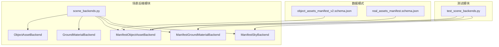
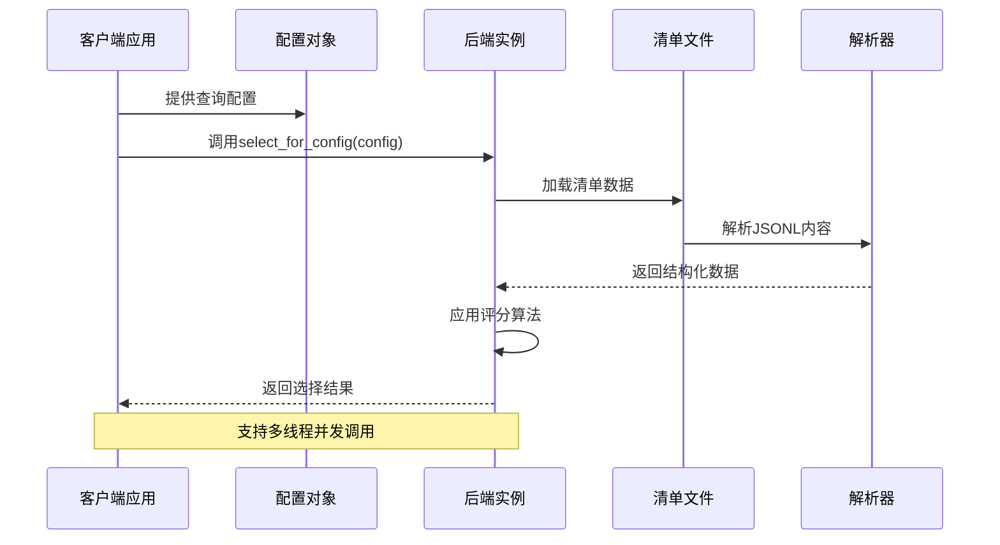
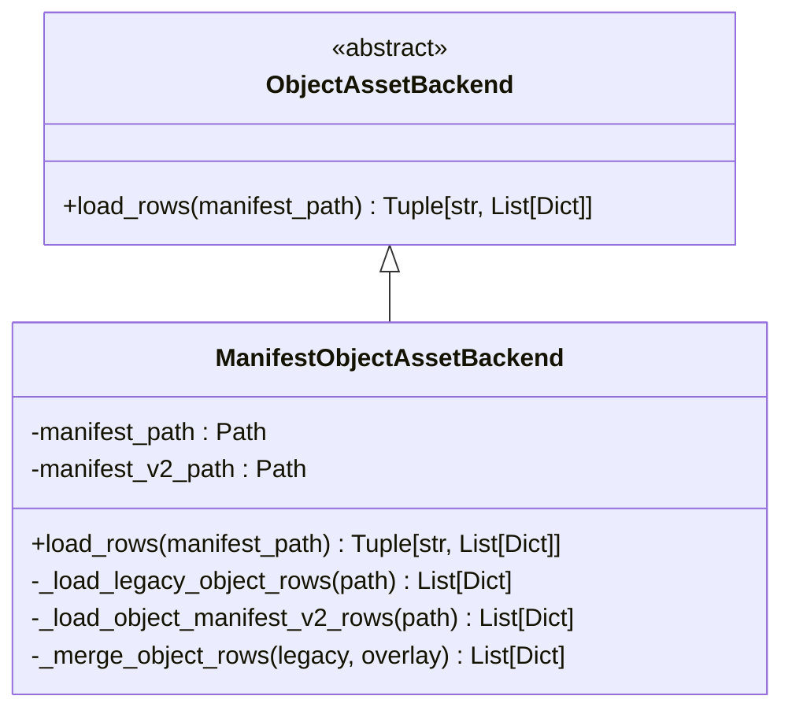
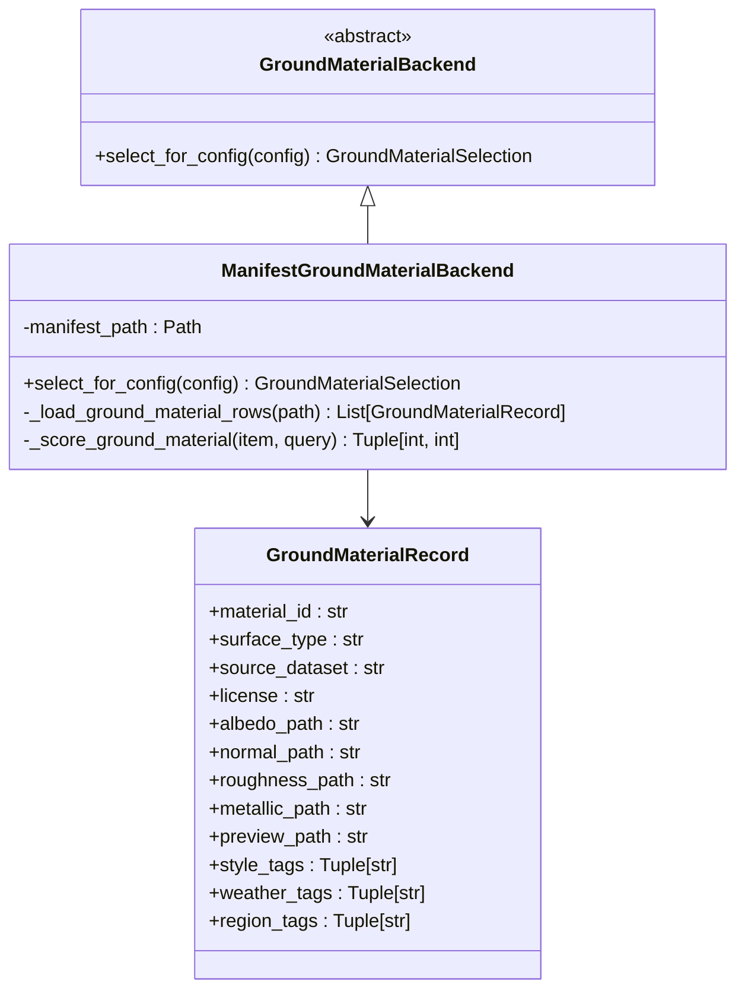
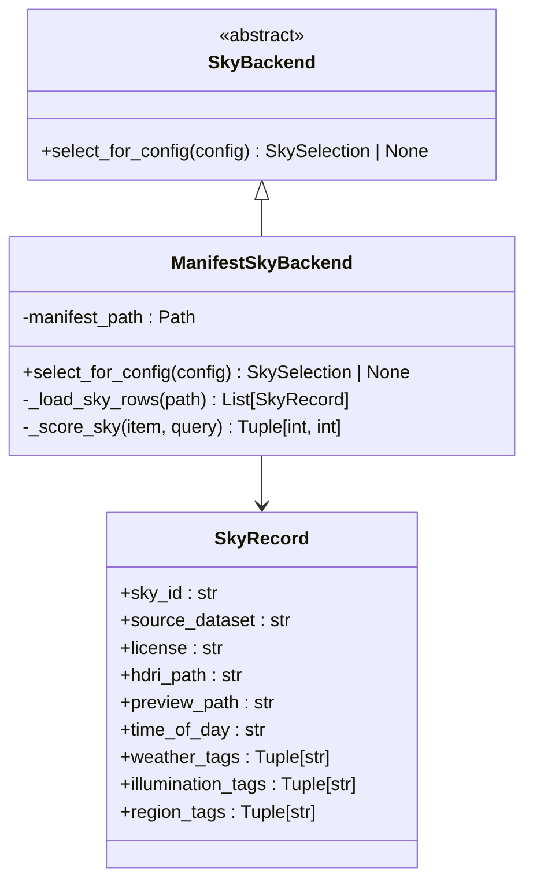
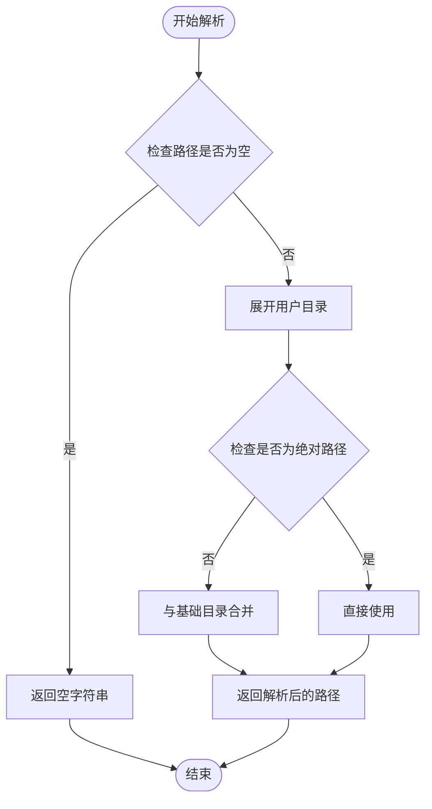
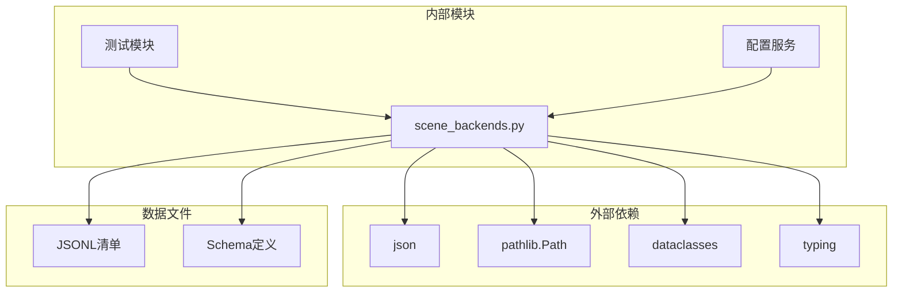
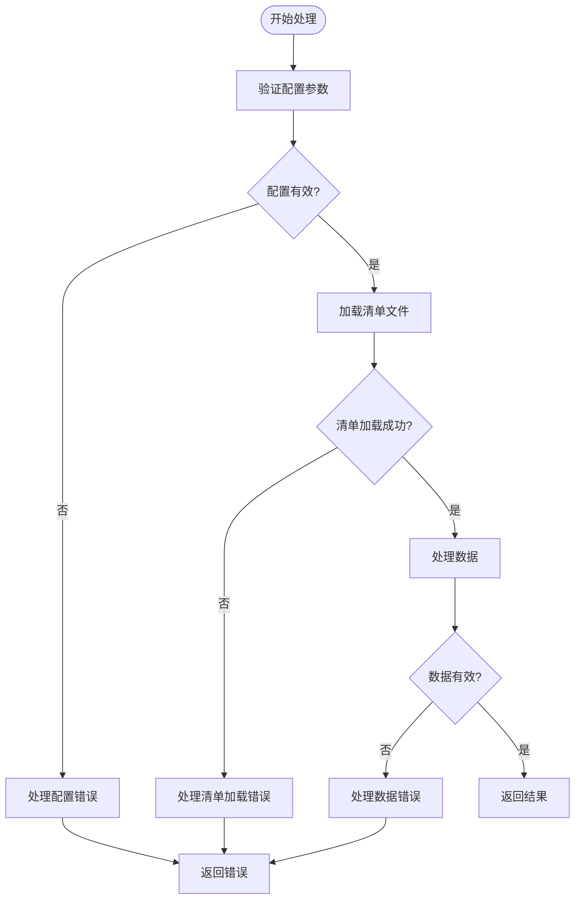

# 自定义后端实现

<cite>
**本文档引用的文件**
- [scene_backends.py](file://src/roadgen3d/services/scene_backends.py)
- [test_scene_backends.py](file://tests/test_scene_backends.py)
- [object_assets_manifest_v2.schema.json](file://data/schemas/object_assets_manifest_v2.schema.json)
- [real_assets_manifest.schema.json](file://data/schemas/real_assets_manifest.schema.json)
- [scene_context_service.py](file://src/roadgen3d/services/scene_context_service.py)
- [asset_loader.py](file://metaurban/metaurban/engine/asset_loader.py)
- [pull_asset.py](file://metaurban/metaurban/pull_asset.py)
</cite>

## 目录
1. [简介](#简介)
2. [项目结构](#项目结构)
3. [核心组件](#核心组件)
4. [架构概览](#架构概览)
5. [详细组件分析](#详细组件分析)
6. [依赖分析](#依赖分析)
7. [性能考虑](#性能考虑)
8. [故障排除指南](#故障排除指南)
9. [结论](#结论)
10. [附录](#附录)

## 简介

本指南详细说明如何在RoadGen3D项目中实现自定义资产后端。项目提供了基于清单（manifest）的资产管理系统，支持对象资产、地面材质和天空盒的自动选择与管理。本文档将指导您完成以下任务：

- 继承并实现 `ObjectAssetBackend`、`GroundMaterialBackend`、`SkyBackend` 基类
- 实现自定义资产清单解析、材质选择算法和天空盒管理
- 解释数据格式要求、字段映射规则和错误处理机制
- 文档化配置参数传递、环境变量使用和路径解析策略
- 提供性能优化技巧、内存管理和并发安全考虑
- 包含调试方法和常见问题解决方案

## 项目结构

RoadGen3D项目采用模块化设计，场景后端功能主要位于 `src/roadgen3d/services/scene_backends.py` 文件中。该文件定义了抽象基类和具体的清单驱动实现，同时提供了测试用例来验证功能正确性。

**图表来源**
- [scene_backends.py:1-527](file://src/roadgen3d/services/scene_backends.py#L1-L527)
- [test_scene_backends.py:1-150](file://tests/test_scene_backends.py#L1-L150)

**章节来源**
- [scene_backends.py:1-527](file://src/roadgen3d/services/scene_backends.py#L1-L527)
- [test_scene_backends.py:1-150](file://tests/test_scene_backends.py#L1-L150)

## 核心组件

### 抽象基类

项目定义了三个核心抽象基类，为自定义后端实现提供统一接口：

1. **ObjectAssetBackend**: 负责对象资产的加载和解析
2. **GroundMaterialBackend**: 负责地面材质的选择和匹配
3. **SkyBackend**: 负责天空盒的选择和管理

### 具体实现

项目提供了基于JSONL清单的完整实现：

1. **ManifestObjectAssetBackend**: 支持v1和v2清单格式，具备回退兼容性
2. **ManifestGroundMaterialBackend**: 基于地面材质清单进行智能选择
3. **ManifestSkyBackend**: 基于天空清单进行时间与天气匹配

**章节来源**
- [scene_backends.py:96-203](file://src/roadgen3d/services/scene_backends.py#L96-L203)
- [scene_backends.py:205-317](file://src/roadgen3d/services/scene_backends.py#L205-L317)

## 架构概览

**图表来源**
- [scene_backends.py:247-316](file://src/roadgen3d/services/scene_backends.py#L247-L316)

## 详细组件分析

### 对象资产后端实现

#### ManifestObjectAssetBackend 类

该类实现了对象资产的清单驱动加载，支持v1和v2两种格式的回退兼容。

**图表来源**
- [scene_backends.py:96-235](file://src/roadgen3d/services/scene_backends.py#L96-L235)

#### 数据格式要求

对象资产清单支持两种JSONL格式：

**v1格式要求字段：**
- `asset_id`: 资产唯一标识符
- `category`: 资产类别
- `text_desc`: 文本描述
- `mesh_path`: 网格文件路径
- `latent_path`: 潜在向量路径

**v2格式扩展字段：**
- `source_dataset`: 数据集来源
- `source_uid`: 来源唯一标识
- `source_category`: 来源类别
- `thumbnail_path`: 缩略图路径
- `appearance_embedding_path`: 外观嵌入路径
- `canonical_front`: 标准朝向
- `license`: 许可证信息
- `split`: 数据分割类型
- `metric_width_m`: 宽度指标
- `metric_depth_m`: 深度指标
- `metric_height_m`: 高度指标
- `mass_kg`: 质量
- `friction`: 摩擦系数
- `affordance_tags`: 可达性标签数组

**章节来源**
- [scene_backends.py:319-435](file://src/roadgen3d/services/scene_backends.py#L319-L435)
- [object_assets_manifest_v2.schema.json:1-45](file://data/schemas/object_assets_manifest_v2.schema.json#L1-L45)
- [real_assets_manifest.schema.json:1-56](file://data/schemas/real_assets_manifest.schema.json#L1-L56)

### 地面材质后端实现

#### ManifestGroundMaterialBackend 类

该类基于地面材质清单进行智能选择，支持多种材质类型的回退机制。

**图表来源**
- [scene_backends.py:195-287](file://src/roadgen3d/services/scene_backends.py#L195-L287)
- [scene_backends.py:103-132](file://src/roadgen3d/services/scene_backends.py#L103-L132)

#### 材质选择算法

地面材质选择采用多权重评分系统：

1. **标签匹配权重**: 每个匹配的风格、天气或区域标签得3分
2. **表面类型权重**: 表面类型完全匹配额外得1分
3. **回退机制**: 当特定表面类型不可用时，按预定义顺序尝试回退类型

支持的表面角色及回退优先级：
- `clear_path` → `sidewalk`
- `furnishing` → `context_ground` → `sidewalk`
- `transit_pad` → `context_ground` → `sidewalk`
- `curb` → `context_ground`
- `building_buffer` → `grass` → `context_ground`
- `crossing` → `sidewalk`
- `lane_mark` → `carriageway`

**章节来源**
- [scene_backends.py:247-287](file://src/roadgen3d/services/scene_backends.py#L247-L287)
- [scene_backends.py:488-498](file://src/roadgen3d/services/scene_backends.py#L488-L498)

### 天空盒后端实现

#### ManifestSkyBackend 类

该类基于天空清单进行时间与天气条件匹配。

**图表来源**
- [scene_backends.py:200-317](file://src/roadgen3d/services/scene_backends.py#L200-L317)
- [scene_backends.py:135-158](file://src/roadgen3d/services/scene_backends.py#L135-L158)

#### 天空选择算法

天空选择采用综合评分系统：

1. **时间匹配权重**: 时间匹配得4分，夜间场景额外6分
2. **光照标签权重**: 光照标签匹配得2分
3. **暖色强调**: "golden"和"warm"光照标签额外得4分

**章节来源**
- [scene_backends.py:296-316](file://src/roadgen3d/services/scene_backends.py#L296-L316)
- [scene_backends.py:500-514](file://src/roadgen3d/services/scene_backends.py#L500-L514)

### 路径解析与环境变量

项目提供了完善的路径解析和环境配置支持：

**图表来源**
- [scene_backends.py:65-72](file://src/roadgen3d/services/scene_backends.py#L65-L72)

**章节来源**
- [scene_backends.py:61-93](file://src/roadgen3d/services/scene_backends.py#L61-L93)

## 依赖分析

**图表来源**
- [scene_backends.py:1-15](file://src/roadgen3d/services/scene_backends.py#L1-L15)

### 关键依赖关系

1. **数据层依赖**: 所有后端实现都依赖于JSONL格式的清单文件
2. **配置层依赖**: 通过配置对象传递查询参数和上下文信息
3. **工具函数依赖**: 使用通用的路径解析和数据清洗工具函数

**章节来源**
- [scene_backends.py:1-15](file://src/roadgen3d/services/scene_backends.py#L1-L15)

## 性能考虑

### 内存管理

1. **流式读取**: 使用 `_read_jsonl_rows` 函数逐行读取，避免一次性加载整个文件
2. **数据结构优化**: 使用元组存储不可变标签列表，减少内存占用
3. **延迟计算**: 评分函数仅在需要时计算，避免不必要的开销

### 并发安全

1. **无状态设计**: 所有后端类都是无状态的，可以安全地在多线程环境中共享
2. **不可变数据**: 返回的数据类（如 `GroundMaterialSelection`、`SkySelection`）使用 `frozen=True`
3. **线程安全工具**: 路径解析和数据清洗函数都是纯函数，无副作用

### 缓存策略

1. **清单缓存**: 建议在应用层面实现清单文件的缓存机制
2. **选择结果缓存**: 对于相同的配置，可以缓存选择结果以避免重复计算
3. **路径解析缓存**: 可以缓存已解析的路径，特别是在大量资产加载时

## 故障排除指南

### 常见错误类型

1. **清单文件缺失**: 当指定的清单路径不存在时抛出 `FileNotFoundError`
2. **必填字段缺失**: 清单行缺少必需字段时抛出 `ValueError`
3. **空清单文件**: 清单文件为空时抛出 `ValueError`

### 调试方法

1. **启用详细日志**: 在配置对象中添加详细的查询参数以便调试
2. **检查路径解析**: 使用 `_resolve_path` 函数验证路径解析是否正确
3. **验证数据格式**: 使用对应的JSON Schema验证清单文件格式

### 错误处理最佳实践

**图表来源**
- [scene_backends.py:319-435](file://src/roadgen3d/services/scene_backends.py#L319-L435)

**章节来源**
- [scene_backends.py:319-435](file://src/roadgen3d/services/scene_backends.py#L319-L435)

## 结论

RoadGen3D项目提供了完整的自定义后端实现框架，具有以下特点：

1. **模块化设计**: 清晰的抽象基类和具体实现分离
2. **灵活扩展**: 支持多种数据格式和自定义算法
3. **性能优化**: 流式处理和内存友好的数据结构
4. **错误处理**: 完善的异常处理和调试支持
5. **测试覆盖**: 全面的单元测试确保功能正确性

通过遵循本文档的指导，您可以轻松实现自定义资产后端，满足特定的场景生成需求。

## 附录

### 配置参数参考

| 参数名称 | 类型 | 必需 | 描述 |
|---------|------|------|------|
| `query` | str | 是 | 查询文本，用于匹配资产特征 |
| `objective_profile` | str | 否 | 目标配置文件，影响资产选择偏好 |
| `design_rule_profile` | str | 否 | 设计规则配置文件 |
| `city_context` | str | 否 | 城市上下文信息 |
| `style_preset` | str | 否 | 风格预设 |

### 环境变量

项目支持以下环境变量配置：

- `PYTHONUTF8=on`: 确保Python使用UTF-8编码
- 资产版本控制: 通过 `asset_version()` 函数管理

### 路径解析策略

1. **相对路径**: 相对路径会相对于清单文件所在目录解析
2. **用户目录**: `~` 符号会被展开为当前用户的主目录
3. **绝对路径**: 绝对路径保持不变
4. **文件存在性**: 解析后的路径必须存在，否则会抛出异常