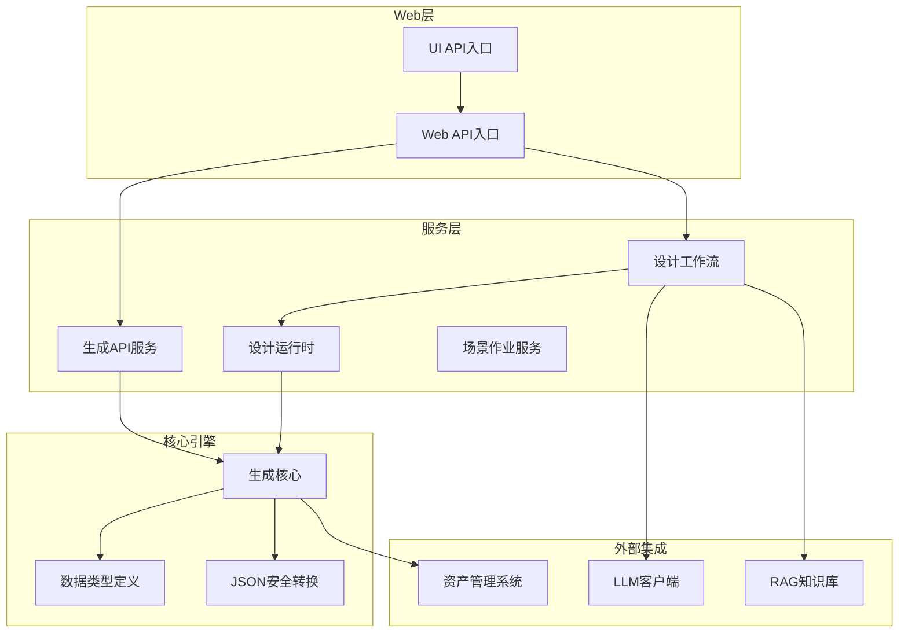
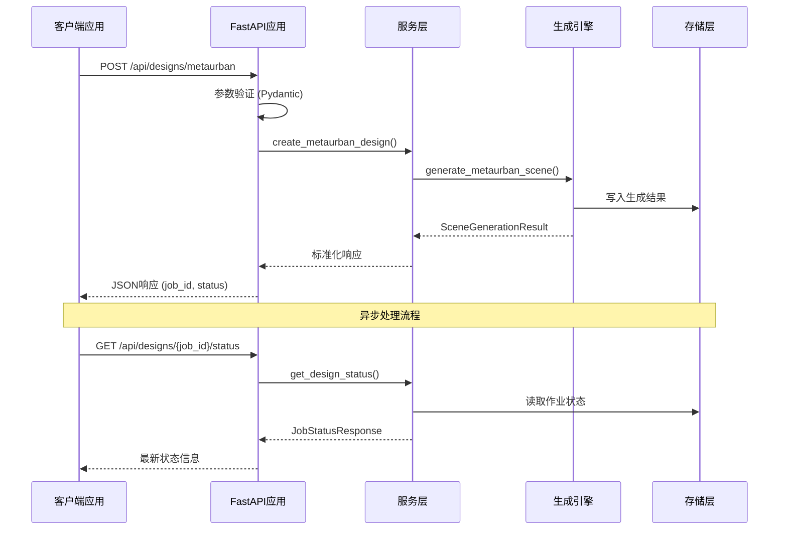
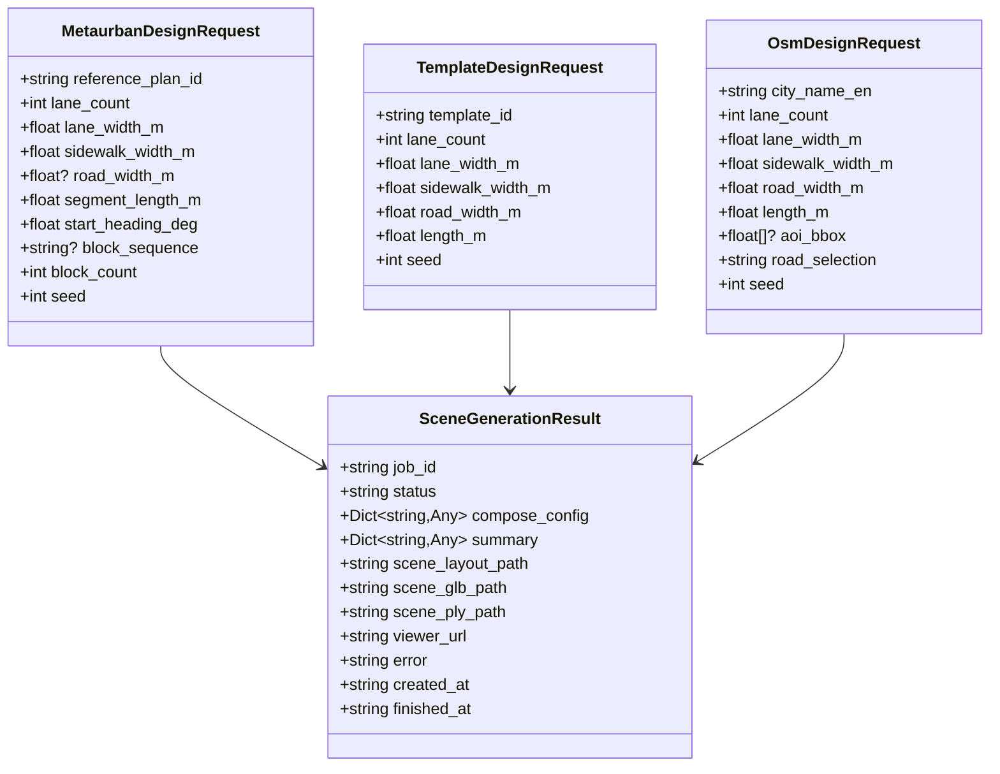
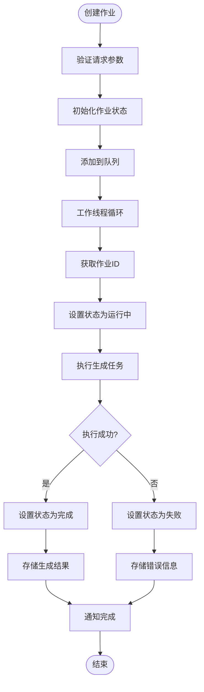
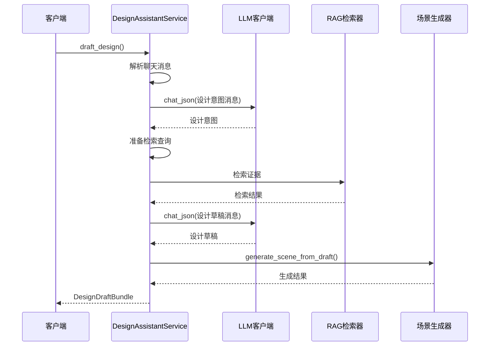
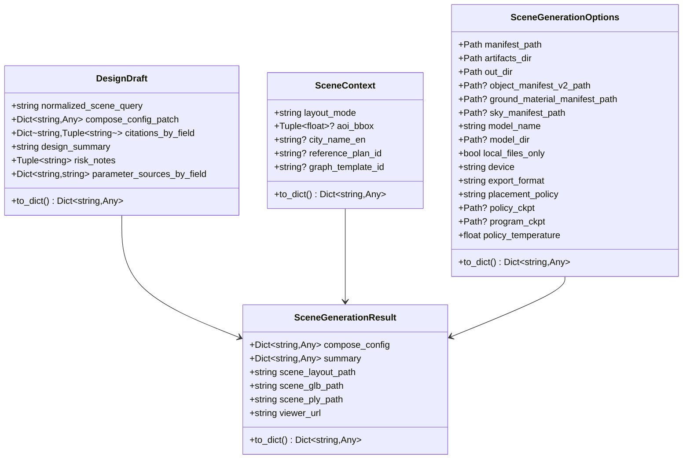
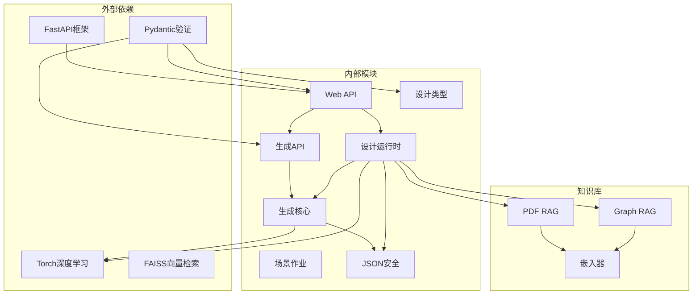
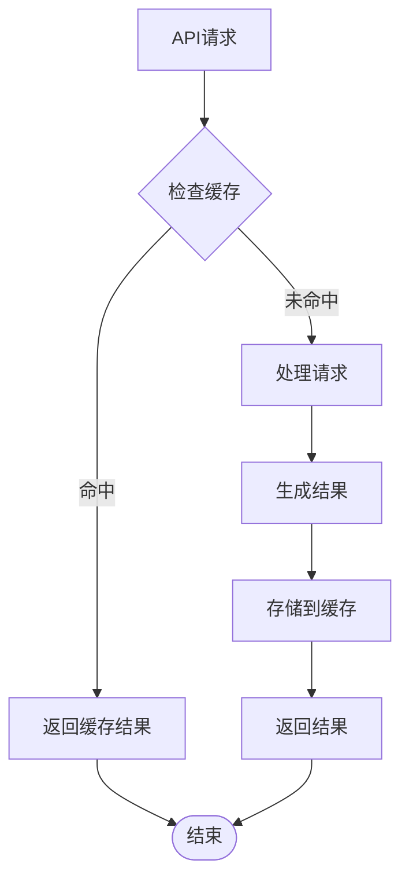

# API扩展框架

<cite>
**本文档引用的文件**
- [web/api/main.py](file://web/api/main.py)
- [ui/api/main.py](file://ui/api/main.py)
- [src/roadgen3d/services/generation_api.py](file://src/roadgen3d/services/generation_api.py)
- [src/roadgen3d/services/design_runtime.py](file://src/roadgen3d/services/design_runtime.py)
- [src/roadgen3d/services/scene_jobs.py](file://src/roadgen3d/services/scene_jobs.py)
- [src/roadgen3d/services/design_types.py](file://src/roadgen3d/services/design_types.py)
- [src/roadgen3d/services/generation_core.py](file://src/roadgen3d/services/generation_core.py)
- [src/roadgen3d/llm/design_workflow.py](file://src/roadgen3d/llm/design_workflow.py)
- [src/roadgen3d/json_safe.py](file://src/roadgen3d/json_safe.py)
- [src/roadgen3d/types.py](file://src/roadgen3d/types.py)
- [API_GUIDE.md](file://API_GUIDE.md)
</cite>

## 目录
1. [简介](#简介)
2. [项目结构](#项目结构)
3. [核心组件](#核心组件)
4. [架构概览](#架构概览)
5. [详细组件分析](#详细组件分析)
6. [依赖关系分析](#依赖关系分析)
7. [性能考虑](#性能考虑)
8. [故障排除指南](#故障排除指南)
9. [结论](#结论)
10. [附录](#附录)

## 简介

RoadGen3D API扩展框架是一个基于FastAPI构建的现代化Web服务框架，专为3D城市街道设计和生成而优化。该框架提供了完整的API架构设计，包括路由注册、中间件机制和请求处理流水线。

### 主要特性

- **RESTful API设计** - 标准HTTP接口，易于集成和扩展
- **异步任务处理** - 基于内存队列的任务管理系统
- **LLM可选集成** - 语言模型辅助设计工作流
- **多模式场景生成** - 支持MetaUrban、Graph Template和OSM三种生成模式
- **JSON Schema验证** - 强类型的请求响应格式
- **安全数据处理** - JSON安全转换和数据验证

## 项目结构

**图表来源**
- [web/api/main.py:1-286](file://web/api/main.py#L1-L286)
- [src/roadgen3d/services/generation_api.py:1-294](file://src/roadgen3d/services/generation_api.py#L1-L294)
- [src/roadgen3d/services/design_runtime.py:1-397](file://src/roadgen3d/services/design_runtime.py#L1-L397)

**章节来源**
- [web/api/main.py:1-286](file://web/api/main.py#L1-L286)
- [ui/api/main.py:1-6](file://ui/api/main.py#L1-L6)

## 核心组件

### API路由系统

API框架采用模块化的路由设计，主要包含以下核心路由：

1. **生成API路由** (`/api/designs/`) - 直接场景生成
2. **设计工作流路由** (`/api/design/`) - LLM辅助设计
3. **知识库路由** (`/api/knowledge/`) - RAG知识检索
4. **实用工具路由** (`/api/`) - 健康检查和辅助功能

### 中间件机制

框架实现了标准的CORS中间件支持，允许跨域请求，便于Web前端集成。

### 请求处理流水线

每个API请求都经过统一的处理流水线：
1. **参数验证** - Pydantic模型验证
2. **业务逻辑处理** - 服务层方法调用
3. **结果转换** - JSON安全转换
4. **响应返回** - 标准化JSON格式

**章节来源**
- [web/api/main.py:81-267](file://web/api/main.py#L81-L267)
- [src/roadgen3d/services/generation_api.py:27-294](file://src/roadgen3d/services/generation_api.py#L27-L294)

## 架构概览

**图表来源**
- [src/roadgen3d/services/generation_api.py:131-179](file://src/roadgen3d/services/generation_api.py#L131-L179)
- [src/roadgen3d/services/scene_jobs.py:144-178](file://src/roadgen3d/services/scene_jobs.py#L144-L178)

## 详细组件分析

### 生成API服务

生成API服务是框架的核心组件，负责直接场景生成操作。

#### 关键数据结构

**图表来源**
- [src/roadgen3d/services/generation_api.py:44-100](file://src/roadgen3d/services/generation_api.py#L44-L100)
- [src/roadgen3d/services/generation_api.py:137-155](file://src/roadgen3d/services/generation_api.py#L137-L155)

#### 异步任务处理

**图表来源**
- [src/roadgen3d/services/scene_jobs.py:144-178](file://src/roadgen3d/services/scene_jobs.py#L144-L178)
- [src/roadgen3d/services/generation_api.py:102-129](file://src/roadgen3d/services/generation_api.py#L102-L129)

**章节来源**
- [src/roadgen3d/services/generation_api.py:1-294](file://src/roadgen3d/services/generation_api.py#L1-L294)
- [src/roadgen3d/services/scene_jobs.py:1-205](file://src/roadgen3d/services/scene_jobs.py#L1-L205)

### 设计工作流服务

设计工作流服务集成了LLM和RAG技术，提供智能化的设计辅助。

#### 设计工作流流程

**图表来源**
- [src/roadgen3d/llm/design_workflow.py:112-239](file://src/roadgen3d/llm/design_workflow.py#L112-L239)
- [src/roadgen3d/services/design_runtime.py:336-396](file://src/roadgen3d/services/design_runtime.py#L336-L396)

**章节来源**
- [src/roadgen3d/llm/design_workflow.py:1-800](file://src/roadgen3d/llm/design_workflow.py#L1-L800)
- [src/roadgen3d/services/design_runtime.py:1-397](file://src/roadgen3d/services/design_runtime.py#L1-L397)

### 数据类型系统

框架使用强类型的数据结构确保API的一致性和可靠性。

#### 核心数据类型

**图表来源**
- [src/roadgen3d/services/design_types.py:177-368](file://src/roadgen3d/services/design_types.py#L177-L368)

**章节来源**
- [src/roadgen3d/services/design_types.py:1-368](file://src/roadgen3d/services/design_types.py#L1-L368)
- [src/roadgen3d/types.py:46-120](file://src/roadgen3d/types.py#L46-L120)

## 依赖关系分析

**图表来源**
- [web/api/main.py:9-31](file://web/api/main.py#L9-L31)
- [src/roadgen3d/services/generation_core.py:16-31](file://src/roadgen3d/services/generation_core.py#L16-L31)

**章节来源**
- [web/api/main.py:1-286](file://web/api/main.py#L1-L286)
- [src/roadgen3d/services/generation_core.py:1-200](file://src/roadgen3d/services/generation_core.py#L1-L200)

## 性能考虑

### 异步处理优化

当前实现采用内存队列进行异步处理，建议在生产环境中升级到持久化队列系统：

- **Celery** - 分布式任务队列
- **Redis** - 高性能缓存和队列
- **RQ (Redis Queue)** - 简单易用的任务队列

### 缓存策略

### 资源管理

- **GPU资源** - Torch模型推理需要GPU支持
- **内存管理** - 大型3D场景的内存占用优化
- **并发控制** - 线程池大小和任务队列长度配置

## 故障排除指南

### 常见问题及解决方案

#### 作业状态问题

**问题**: 作业状态一直显示为"queued"
**原因**: 
- 首次模型加载耗时较长
- 服务器资源不足
- 同步执行阻塞

**解决方案**:
- 等待初始模型加载完成
- 检查服务器CPU/内存使用情况
- 考虑升级到异步任务队列

#### 参考方案错误

**问题**: "Reference plan not found"
**解决**:
- 确认`reference_plan_id`的有效性
- 检查内置方案列表
- 验证文件路径和权限

#### 依赖缺失

**问题**: Torch相关错误
**解决**:
- 安装PyTorch依赖
- 验证CUDA支持（可选）
- 检查模型文件完整性

**章节来源**
- [API_GUIDE.md:303-337](file://API_GUIDE.md#L303-L337)

## 结论

RoadGen3D API扩展框架提供了一个完整、可扩展的3D场景生成解决方案。通过模块化的架构设计、强类型的数据验证和灵活的扩展机制，该框架能够满足从简单场景生成到复杂智能设计的各种需求。

### 优势特点

1. **模块化设计** - 清晰的组件分离和职责划分
2. **强类型系统** - Pydantic验证确保数据一致性
3. **可扩展性** - 易于添加新的生成模式和API端点
4. **异步处理** - 支持后台任务和状态查询
5. **LLM集成** - 可选的语言模型辅助设计

### 发展方向

1. **生产级部署** - 升级到分布式任务队列
2. **监控增强** - 添加性能指标和错误追踪
3. **安全加固** - 实现认证授权和访问控制
4. **API版本化** - 支持向后兼容的API演进

## 附录

### API端点参考

#### 生成API端点

| 端点 | 方法 | 描述 |
|------|------|------|
| `/api/designs/metaurban` | POST | 创建MetaUrban风格场景 |
| `/api/designs/template` | POST | 使用图模板生成场景 |
| `/api/designs/osm` | POST | 基于OSM数据生成场景 |
| `/api/designs/{job_id}/status` | GET | 查询作业状态 |
| `/api/scenes/{job_id}` | GET | 获取场景结果 |

#### 设计工作流端点

| 端点 | 方法 | 描述 |
|------|------|------|
| `/api/design/draft` | POST | 生成设计草稿 |
| `/api/design/generate` | POST | 生成最终场景 |
| `/api/scene/jobs` | GET/POST | 作业管理 |
| `/api/knowledge/search` | POST | 知识检索 |

### 配置选项

#### 生成选项

- **设备选择**: CPU/GPU自动检测
- **导出格式**: GLB/Ply双重导出
- **放置策略**: 规则驱动或策略网络
- **温度参数**: 策略网络采样温度

#### 安全配置

- **CORS设置**: 允许跨域请求
- **输入验证**: 严格的数据类型检查
- **错误处理**: 统一的异常处理机制