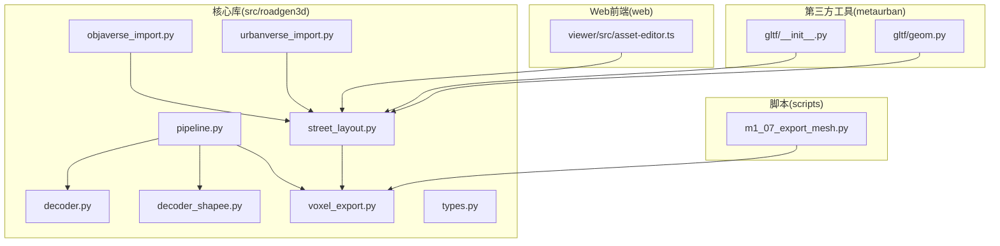
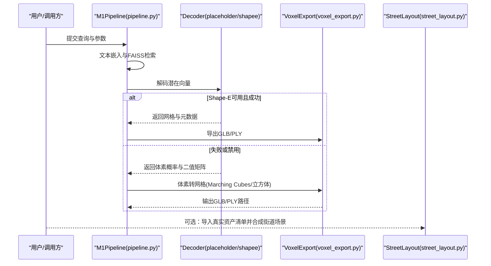
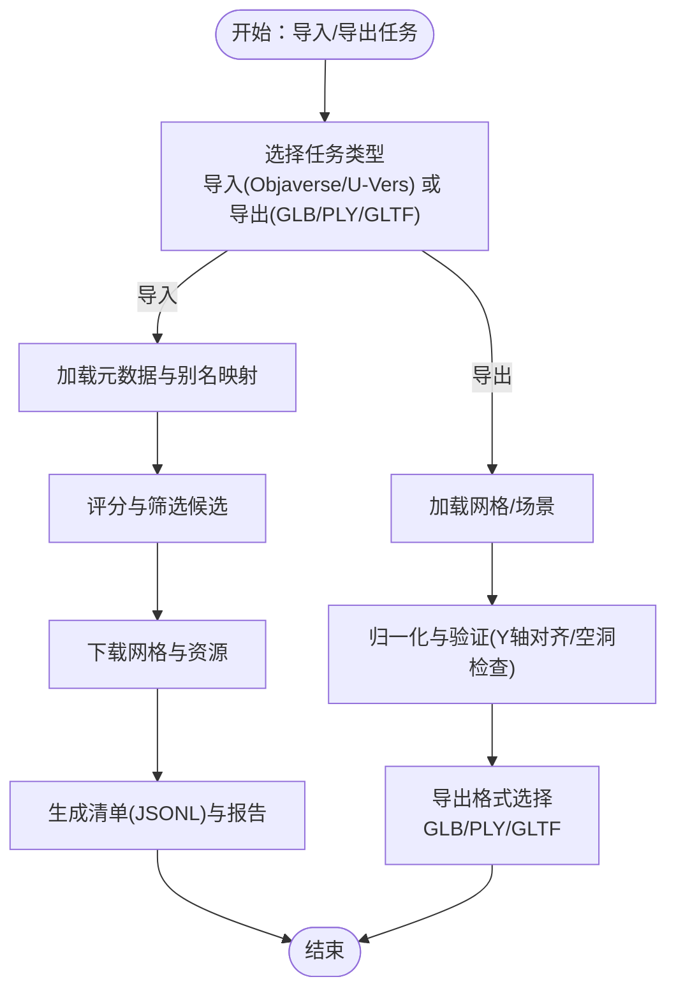
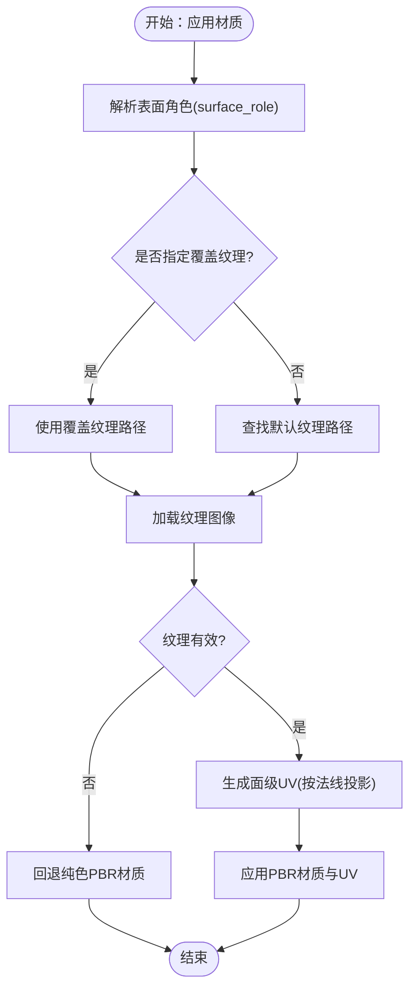
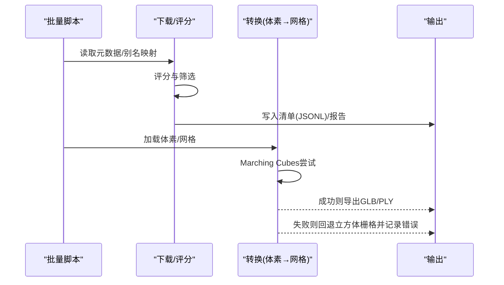
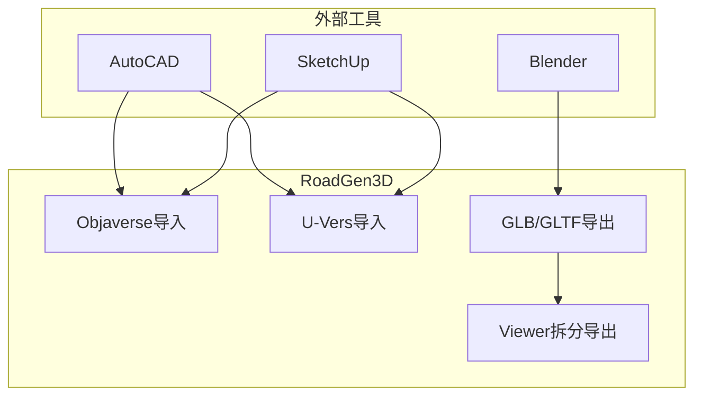
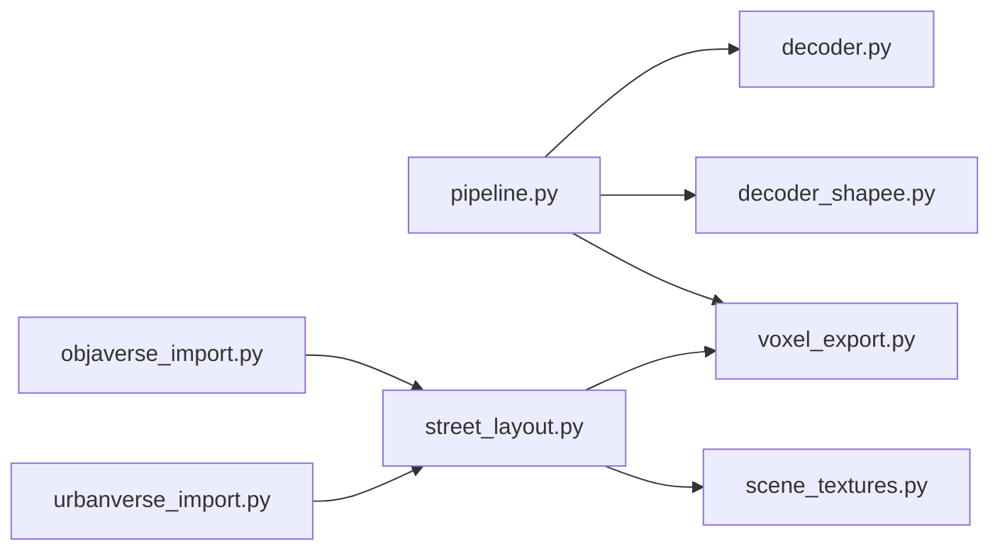
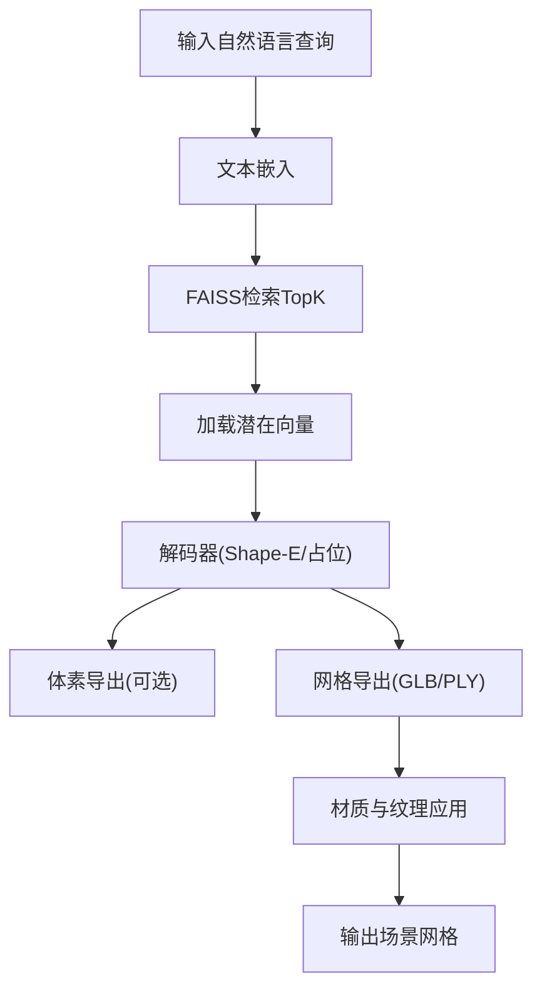

# CAD与3D建模工具集成

<cite>
**本文档引用的文件**
- [README.md](file://README.md)
- [src/roadgen3d/__init__.py](file://src/roadgen3d/__init__.py)
- [src/roadgen3d/voxel_export.py](file://src/roadgen3d/voxel_export.py)
- [src/roadgen3d/decoder.py](file://src/roadgen3d/decoder.py)
- [src/roadgen3d/decoder_shapee.py](file://src/roadgen3d/decoder_shapee.py)
- [src/roadgen3d/pipeline.py](file://src/roadgen3d/pipeline.py)
- [src/roadgen3d/street_layout.py](file://src/roadgen3d/street_layout.py)
- [src/roadgen3d/types.py](file://src/roadgen3d/types.py)
- [src/roadgen3d/objaverse_import.py](file://src/roadgen3d/objaverse_import.py)
- [src/roadgen3d/urbanverse_import.py](file://src/roadgen3d/urbanverse_import.py)
- [scripts/m1_07_export_mesh.py](file://scripts/m1_07_export_mesh.py)
- [web/viewer/src/asset-editor.ts](file://web/viewer/src/asset-editor.ts)
- [metaurban/metaurban/third_party/kitsunetsuki/exporter/gltf/__init__.py](file://metaurban/metaurban/third_party/kitsunetsuki/exporter/gltf/__init__.py)
- [metaurban/metaurban/third_party/kitsunetsuki/exporter/gltf/geom.py](file://metaurban/metaurban/third_party/kitsunetsuki/exporter/gltf/geom.py)
</cite>

## 目录
1. [简介](#简介)
2. [项目结构](#项目结构)
3. [核心组件](#核心组件)
4. [架构总览](#架构总览)
5. [详细组件分析](#详细组件分析)
6. [依赖关系分析](#依赖关系分析)
7. [性能考虑](#性能考虑)
8. [故障排查指南](#故障排查指南)
9. [结论](#结论)
10. [附录](#附录)

## 简介
本技术指南面向需要将 CAD 与 3D 建模工具（AutoCAD、SketchUp、Blender 等）与 RoadGen3D 系统进行集成的工程师与开发者，系统性阐述以下主题：
- 文件格式转换流程：OBJ、FBX、GLTF 等格式的导入与导出机制
- 元数据提取与映射：材质信息、纹理坐标、层级结构等
- 批量处理流水线：自动化转换、错误恢复与进度跟踪
- 与主流工具对接方案：通过 API 或中间件桥接
- 质量控制机制：几何验证、拓扑修复与性能优化
- 扩展开发指南：新增文件格式支持、自定义转换器与第三方工具桥接

## 项目结构
RoadGen3D 采用模块化分层设计：
- 核心库（src/roadgen3d）：包含管线编排、解码器、网格导出、街道合成、类型定义、材质纹理等
- 脚本（scripts）：提供单资产与多资产管线的命令行入口
- Web 前端（web）：Viewer 与 Workbench 提供可视化与交互
- 工具子模块（metaurban 等）：包含第三方导出器实现示例

**图表来源**
- [src/roadgen3d/pipeline.py:1-133](file://src/roadgen3d/pipeline.py#L1-L133)
- [src/roadgen3d/decoder.py:1-65](file://src/roadgen3d/decoder.py#L1-L65)
- [src/roadgen3d/decoder_shapee.py:1-245](file://src/roadgen3d/decoder_shapee.py#L1-L245)
- [src/roadgen3d/voxel_export.py:1-142](file://src/roadgen3d/voxel_export.py#L1-L142)
- [src/roadgen3d/street_layout.py:1-800](file://src/roadgen3d/street_layout.py#L1-L800)
- [src/roadgen3d/types.py:1-800](file://src/roadgen3d/types.py#L1-L800)
- [src/roadgen3d/objaverse_import.py:1-680](file://src/roadgen3d/objaverse_import.py#L1-L680)
- [src/roadgen3d/urbanverse_import.py:1-800](file://src/roadgen3d/urbanverse_import.py#L1-L800)
- [scripts/m1_07_export_mesh.py:1-64](file://scripts/m1_07_export_mesh.py#L1-L64)
- [web/viewer/src/asset-editor.ts:1723-1757](file://web/viewer/src/asset-editor.ts#L1723-L1757)
- [metaurban/metaurban/third_party/kitsunetsuki/exporter/gltf/__init__.py:438-511](file://metaurban/metaurban/third_party/kitsunetsuki/exporter/gltf/__init__.py#L438-L511)
- [metaurban/metaurban/third_party/kitsunetsuki/exporter/gltf/geom.py:137-178](file://metaurban/metaurban/third_party/kitsunetsuki/exporter/gltf/geom.py#L137-L178)

**章节来源**
- [README.md:107-130](file://README.md#L107-L130)

## 核心组件
- 解码器与网格导出
  - PlaceholderVoxelDecoder：轻量确定性解码器，将潜在向量映射为体素体积
  - ShapeEDecoder：可选直接从 Shape-E 模型解码网格，失败时回退到占位解码器
  - export_voxel_meshes：将体素占用矩阵导出为 GLB/PLY，支持 Marching Cubes 与立方体栅格两种方法
- 街道合成与场景构建
  - street_layout：加载网格缓存、规范化 Y 轴、碰撞检测、布局求解与材质贴图应用
  - types：统一的数据契约（StreetComposeConfig、StreetProgram、LayoutSolverInput 等）
- 数据导入与资产管理
  - objaverse_import：从 Objaverse 采集目标类别资产，生成清单与报告
  - urbanverse_import：从 UrbanVerse 子集导入对象、地面材质与天空资源，清洗与去重
- 管线编排
  - pipeline：M1 单资产管线，串联检索、解码与网格导出
  - scripts/m1_07_export_mesh：命令行工具，直接将 voxel_bin.npy 导出为 GLB/PLY

**章节来源**
- [src/roadgen3d/decoder.py:24-65](file://src/roadgen3d/decoder.py#L24-L65)
- [src/roadgen3d/decoder_shapee.py:34-245](file://src/roadgen3d/decoder_shapee.py#L34-L245)
- [src/roadgen3d/voxel_export.py:79-142](file://src/roadgen3d/voxel_export.py#L79-L142)
- [src/roadgen3d/street_layout.py:672-758](file://src/roadgen3d/street_layout.py#L672-L758)
- [src/roadgen3d/types.py:47-120](file://src/roadgen3d/types.py#L47-L120)
- [src/roadgen3d/objaverse_import.py:474-556](file://src/roadgen3d/objaverse_import.py#L474-L556)
- [src/roadgen3d/urbanverse_import.py:79-283](file://src/roadgen3d/urbanverse_import.py#L79-L283)
- [src/roadgen3d/pipeline.py:30-126](file://src/roadgen3d/pipeline.py#L30-L126)
- [scripts/m1_07_export_mesh.py:21-64](file://scripts/m1_07_export_mesh.py#L21-L64)

## 架构总览
下图展示从文本查询到最终网格导出的关键路径，以及与外部工具的对接点。

**图表来源**
- [src/roadgen3d/pipeline.py:39-126](file://src/roadgen3d/pipeline.py#L39-L126)
- [src/roadgen3d/decoder_shapee.py:102-189](file://src/roadgen3d/decoder_shapee.py#L102-L189)
- [src/roadgen3d/voxel_export.py:79-142](file://src/roadgen3d/voxel_export.py#L79-L142)
- [src/roadgen3d/street_layout.py:620-758](file://src/roadgen3d/street_layout.py#L620-L758)

## 详细组件分析

### 组件A：文件格式导入与导出（OBJ/FBX/GLTF）
- 导入
  - Objaverse：按目标类别筛选候选，评分与下载，生成 RoadGen3D 清单格式；支持元数据扫描与关键词匹配
  - UrbanVerse：别名映射与救援分类，复制网格/缩略图/嵌入，生成对象/地面/天空清单，并写入报告
- 导出
  - 体素导出：支持 GLB/PLY，优先 Marching Cubes，失败回退立方体栅格
  - 网格导出：Viewer 中可对选中网格拆分导出为独立 GLB
  - 第三方导出器：kitsunetsuki GLTF 导出器支持节点/网格/材质/纹理映射与二进制输出

**图表来源**
- [src/roadgen3d/objaverse_import.py:474-556](file://src/roadgen3d/objaverse_import.py#L474-L556)
- [src/roadgen3d/urbanverse_import.py:509-703](file://src/roadgen3d/urbanverse_import.py#L509-L703)
- [src/roadgen3d/voxel_export.py:79-142](file://src/roadgen3d/voxel_export.py#L79-L142)
- [web/viewer/src/asset-editor.ts:1734-1752](file://web/viewer/src/asset-editor.ts#L1734-L1752)
- [metaurban/metaurban/third_party/kitsunetsuki/exporter/gltf/__init__.py:474-511](file://metaurban/metaurban/third_party/kitsunetsuki/exporter/gltf/__init__.py#L474-L511)

**章节来源**
- [src/roadgen3d/objaverse_import.py:1-680](file://src/roadgen3d/objaverse_import.py#L1-L680)
- [src/roadgen3d/urbanverse_import.py:1-800](file://src/roadgen3d/urbanverse_import.py#L1-L800)
- [src/roadgen3d/voxel_export.py:19-142](file://src/roadgen3d/voxel_export.py#L19-L142)
- [web/viewer/src/asset-editor.ts:1723-1757](file://web/viewer/src/asset-editor.ts#L1723-L1757)
- [metaurban/metaurban/third_party/kitsunetsuki/exporter/gltf/__init__.py:438-511](file://metaurban/metaurban/third_party/kitsunetsuki/exporter/gltf/__init__.py#L438-L511)
- [metaurban/metaurban/third_party/kitsunetsuki/exporter/gltf/geom.py:137-178](file://metaurban/metaurban/third_party/kitsunetsuki/exporter/gltf/geom.py#L137-L178)

### 组件B：材质与纹理映射
- 材质应用策略
  - 地面/铺装/人行道等表面角色映射至纹理贴图，支持世界空间 UV 连续性与瓷砖缩放
  - 缺失纹理时回退为纯色 PBR 材质，记录追踪器统计
- 纹理坐标生成
  - 基于面法线投影到主轴平面，按瓷砖尺度生成 UV，确保连续性与可拼接性

**图表来源**
- [src/roadgen3d/street_layout.py:1914-1941](file://src/roadgen3d/street_layout.py#L1914-L1941)
- [src/roadgen3d/scene_textures.py:196-246](file://src/roadgen3d/scene_textures.py#L196-L246)

**章节来源**
- [src/roadgen3d/street_layout.py:1914-1941](file://src/roadgen3d/street_layout.py#L1914-L1941)
- [src/roadgen3d/scene_textures.py:107-250](file://src/roadgen3d/scene_textures.py#L107-L250)

### 组件C：批量处理与自动化
- 自动化转换
  - m1_07_export_mesh：将 voxel_bin.npy 导出为 GLB/PLY，支持方法与格式选择
  - Objaverse/U-Vers 导入：批量下载、评分、生成清单与报告
- 错误恢复
  - 解码失败回退到占位解码器；Marching Cubes 失败回退立方体栅格；网格为空时生成最小盒子兜底
- 进度跟踪
  - 导入阶段记录输入/导入/跳过/未映射计数与原因统计；导出阶段记录方法与错误信息

**图表来源**
- [scripts/m1_07_export_mesh.py:21-64](file://scripts/m1_07_export_mesh.py#L21-L64)
- [src/roadgen3d/objaverse_import.py:474-556](file://src/roadgen3d/objaverse_import.py#L474-L556)
- [src/roadgen3d/urbanverse_import.py:79-283](file://src/roadgen3d/urbanverse_import.py#L79-L283)
- [src/roadgen3d/voxel_export.py:114-121](file://src/roadgen3d/voxel_export.py#L114-L121)

**章节来源**
- [scripts/m1_07_export_mesh.py:1-64](file://scripts/m1_07_export_mesh.py#L1-L64)
- [src/roadgen3d/objaverse_import.py:474-556](file://src/roadgen3d/objaverse_import.py#L474-L556)
- [src/roadgen3d/urbanverse_import.py:79-283](file://src/roadgen3d/urbanverse_import.py#L79-L283)
- [src/roadgen3d/voxel_export.py:19-142](file://src/roadgen3d/voxel_export.py#L19-L142)

### 组件D：与主流工具对接方案
- Blender
  - 使用内置导出器或第三方 GLTF 导出器（如 kitsunetsuki）将场景导出为 GLB/GLTF
  - 在 Viewer 中可对选中网格拆分导出为独立 GLB 文件，便于后续处理
- AutoCAD
  - 将 CAD 几何转换为 FBX/OBJ 后，使用 Objaverse/U-Vers 导入流程进行资产入库与清单生成
  - 导出阶段可将场景网格导出为 GLB/PLY 以供下游引擎使用
- SketchUp
  - 通过插件或导出为 FBX/OBJ，再走统一导入与导出流程
  - 利用材质纹理映射与 UV 连续性保证渲染一致性

**图表来源**
- [web/viewer/src/asset-editor.ts:1734-1752](file://web/viewer/src/asset-editor.ts#L1734-L1752)
- [metaurban/metaurban/third_party/kitsunetsuki/exporter/gltf/__init__.py:474-511](file://metaurban/metaurban/third_party/kitsunetsuki/exporter/gltf/__init__.py#L474-L511)

**章节来源**
- [web/viewer/src/asset-editor.ts:1723-1757](file://web/viewer/src/asset-editor.ts#L1723-L1757)
- [metaurban/metaurban/third_party/kitsunetsuki/exporter/gltf/__init__.py:438-511](file://metaurban/metaurban/third_party/kitsunetsuki/exporter/gltf/__init__.py#L438-L511)

## 依赖关系分析
- 组件耦合
  - pipeline 依赖 decoder 与 voxel_export；street_layout 依赖 trimesh 与场景纹理模块
  - 导入模块（objaverse_import、urbanverse_import）与清单/报告输出强耦合
- 外部依赖
  - trimesh：网格操作与导出
  - scikit-image：Marching Cubes
  - shap-e（可选）：Shape-E 解码
  - Pillow：纹理图像加载

**图表来源**
- [src/roadgen3d/pipeline.py:30-126](file://src/roadgen3d/pipeline.py#L30-L126)
- [src/roadgen3d/decoder.py:24-65](file://src/roadgen3d/decoder.py#L24-L65)
- [src/roadgen3d/decoder_shapee.py:34-245](file://src/roadgen3d/decoder_shapee.py#L34-L245)
- [src/roadgen3d/voxel_export.py:79-142](file://src/roadgen3d/voxel_export.py#L79-L142)
- [src/roadgen3d/street_layout.py:672-758](file://src/roadgen3d/street_layout.py#L672-L758)
- [src/roadgen3d/scene_textures.py:196-246](file://src/roadgen3d/scene_textures.py#L196-L246)
- [src/roadgen3d/objaverse_import.py:474-556](file://src/roadgen3d/objaverse_import.py#L474-L556)
- [src/roadgen3d/urbanverse_import.py:79-283](file://src/roadgen3d/urbanverse_import.py#L79-L283)

**章节来源**
- [src/roadgen3d/__init__.py:1-295](file://src/roadgen3d/__init__.py#L1-L295)

## 性能考虑
- 解码与导出
  - 优先使用 Shape-E 直接解码网格可避免体素→网格的精度损失与额外计算
  - Marching Cubes 对大体素网格较耗时，建议在批处理中限制分辨率或启用回退策略
- 纹理与材质
  - 使用面级 UV 与瓷砖缩放减少重复与接缝，提升渲染效率
  - 缺失纹理时快速回退纯色 PBR 材质，避免复杂材质管线开销
- 并发与缓存
  - 导入阶段可并行下载与评分，注意磁盘 IO 与网络带宽上限
  - 对常用纹理与模型建立缓存目录，减少重复加载

[本节为通用指导，无需特定文件引用]

## 故障排查指南
- 导出失败
  - 体素为空：检查解码器输出与阈值设置；必要时调整分辨率或阈值
  - Marching Cubes 报错：自动回退立方体栅格；若持续失败，检查体素预处理与连通性
- 网格为空或异常
  - Objaverse/U-Vers 导入时对树形资产进行直立性验证，失败则跳过；可在导入报告中查看原因
  - Viewer 拆分导出失败：确认选中网格有效性与导出函数调用
- 材质缺失
  - 纹理加载失败时自动回退纯色材质；检查纹理路径与权限

**章节来源**
- [src/roadgen3d/voxel_export.py:57-76](file://src/roadgen3d/voxel_export.py#L57-L76)
- [src/roadgen3d/urbanverse_import.py:593-611](file://src/roadgen3d/urbanverse_import.py#L593-L611)
- [web/viewer/src/asset-editor.ts:1734-1752](file://web/viewer/src/asset-editor.ts#L1734-L1752)
- [src/roadgen3d/scene_textures.py:221-233](file://src/roadgen3d/scene_textures.py#L221-L233)

## 结论
本指南基于 RoadGen3D 的现有实现，提供了从资产导入、解码、网格导出到材质贴图的完整技术路线。通过标准化的清单格式与导出接口，可与 Blender、AutoCAD、SketchUp 等工具形成稳定桥接；借助错误恢复与性能优化策略，能够支撑大规模自动化管线运行。后续扩展可通过新增导入器、自定义解码器与第三方导出器实现更广泛的格式支持。

[本节为总结，无需特定文件引用]

## 附录

### 关键流程图：从查询到网格导出

**图表来源**
- [src/roadgen3d/pipeline.py:39-126](file://src/roadgen3d/pipeline.py#L39-L126)
- [src/roadgen3d/decoder_shapee.py:102-189](file://src/roadgen3d/decoder_shapee.py#L102-L189)
- [src/roadgen3d/voxel_export.py:79-142](file://src/roadgen3d/voxel_export.py#L79-L142)
- [src/roadgen3d/street_layout.py:1914-1941](file://src/roadgen3d/street_layout.py#L1914-L1941)