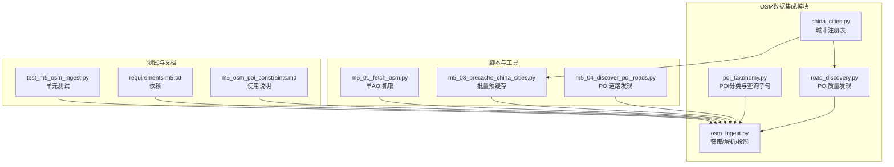
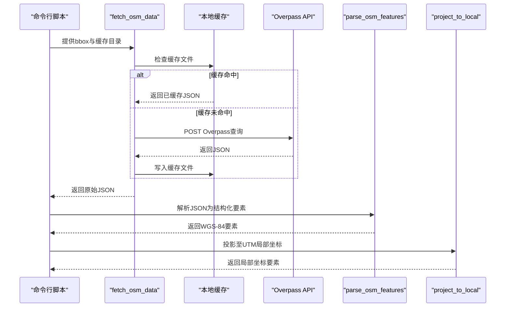
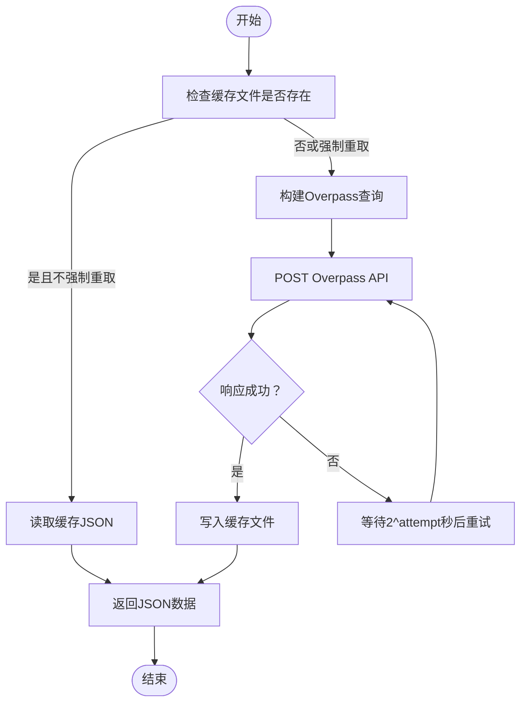
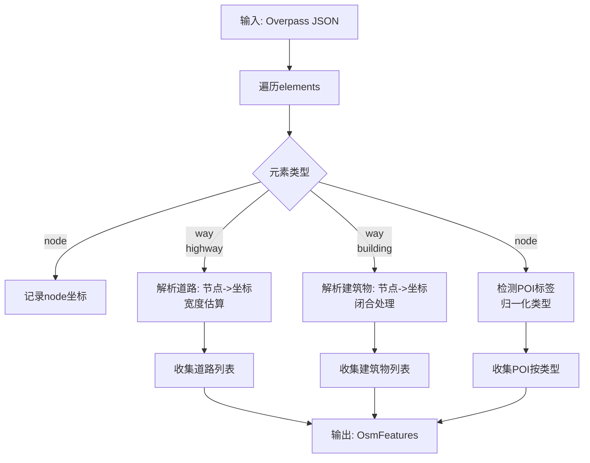
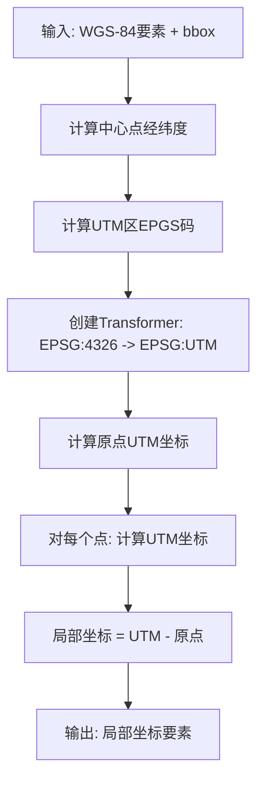
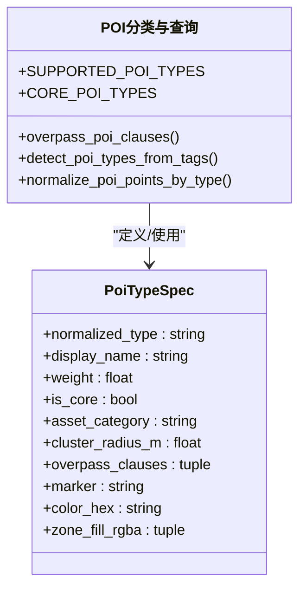
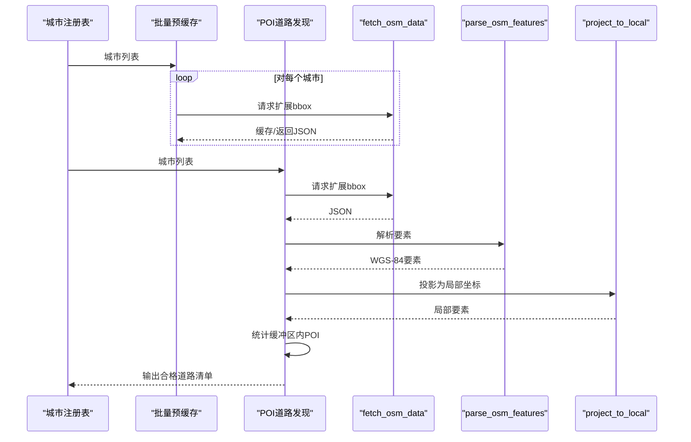
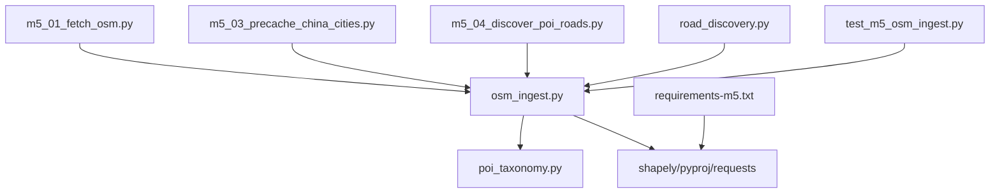

# OpenStreetMap数据集成

<cite>
**本文档引用的文件**
- [osm_ingest.py](file://src/roadgen3d/osm_ingest.py)
- [poi_taxonomy.py](file://src/roadgen3d/poi_taxonomy.py)
- [m5_01_fetch_osm.py](file://scripts/m5_01_fetch_osm.py)
- [m5_03_precache_china_cities.py](file://scripts/m5_03_precache_china_cities.py)
- [m5_04_discover_poi_roads.py](file://scripts/m5_04_discover_poi_roads.py)
- [road_discovery.py](file://src/roadgen3d/road_discovery.py)
- [china_cities.py](file://src/roadgen3d/china_cities.py)
- [test_m5_osm_ingest.py](file://tests/test_m5_osm_ingest.py)
- [requirements-m5.txt](file://requirements-m5.txt)
- [m5_osm_poi_constraints.md](file://docs/m5_osm_poi_constraints.md)
</cite>

## 目录
1. [简介](#简介)
2. [项目结构](#项目结构)
3. [核心组件](#核心组件)
4. [架构总览](#架构总览)
5. [详细组件分析](#详细组件分析)
6. [依赖分析](#依赖分析)
7. [性能考虑](#性能考虑)
8. [故障排除指南](#故障排除指南)
9. [结论](#结论)
10. [附录](#附录)

## 简介
本文件面向OpenStreetMap（OSM）数据集成的技术实现，覆盖从Overpass API查询构建、网络请求与缓存、数据解析（道路、建筑物、兴趣点POI）、坐标投影系统（UTM自动检测与WGS-84到局部坐标的转换）、数据预处理（宽度估算、标签标准化、几何修复）、错误处理策略（超时重试、数据验证、异常恢复），以及性能优化建议（批量查询、增量更新、内存管理）。文档同时给出与现有管线（M3/M4/M5）的衔接方式，并通过测试用例与脚本展示端到端使用流程。

## 项目结构
围绕OSM数据集成的关键模块与脚本如下：
- 数据获取与缓存：osm_ingest.py
- POI分类与查询子句：poi_taxonomy.py
- 单次AOI抓取脚本：m5_01_fetch_osm.py
- 中国城市批量预缓存：m5_03_precache_china_cities.py
- 城市级POI道路发现：m5_04_discover_poi_roads.py
- 路段POI质量发现与筛选：road_discovery.py
- 城市注册表：china_cities.py
- 测试与验证：test_m5_osm_ingest.py
- 依赖声明：requirements-m5.txt
- 使用说明与约束规则：m5_osm_poi_constraints.md

**图表来源**
- [osm_ingest.py:1-331](file://src/roadgen3d/osm_ingest.py#L1-L331)
- [poi_taxonomy.py:1-416](file://src/roadgen3d/poi_taxonomy.py#L1-L416)
- [m5_01_fetch_osm.py:1-66](file://scripts/m5_01_fetch_osm.py#L1-L66)
- [m5_03_precache_china_cities.py:1-144](file://scripts/m5_03_precache_china_cities.py#L1-L144)
- [m5_04_discover_poi_roads.py:1-180](file://scripts/m5_04_discover_poi_roads.py#L1-L180)
- [road_discovery.py:1-344](file://src/roadgen3d/road_discovery.py#L1-L344)
- [china_cities.py:1-144](file://src/roadgen3d/china_cities.py#L1-L144)
- [test_m5_osm_ingest.py:1-287](file://tests/test_m5_osm_ingest.py#L1-L287)
- [requirements-m5.txt:1-5](file://requirements-m5.txt#L1-L5)
- [m5_osm_poi_constraints.md:1-101](file://docs/m5_osm_poi_constraints.md#L1-L101)

**章节来源**
- [osm_ingest.py:1-331](file://src/roadgen3d/osm_ingest.py#L1-L331)
- [poi_taxonomy.py:1-416](file://src/roadgen3d/poi_taxonomy.py#L1-L416)
- [m5_01_fetch_osm.py:1-66](file://scripts/m5_01_fetch_osm.py#L1-L66)
- [m5_03_precache_china_cities.py:1-144](file://scripts/m5_03_precache_china_cities.py#L1-L144)
- [m5_04_discover_poi_roads.py:1-180](file://scripts/m5_04_discover_poi_roads.py#L1-L180)
- [road_discovery.py:1-344](file://src/roadgen3d/road_discovery.py#L1-L344)
- [china_cities.py:1-144](file://src/roadgen3d/china_cities.py#L1-L144)
- [test_m5_osm_ingest.py:1-287](file://tests/test_m5_osm_ingest.py#L1-L287)
- [requirements-m5.txt:1-5](file://requirements-m5.txt#L1-L5)
- [m5_osm_poi_constraints.md:1-101](file://docs/m5_osm_poi_constraints.md#L1-L101)

## 核心组件
- Overpass查询构建与数据获取：负责根据边界框生成查询、调用API、带指数回退的重试与本地缓存。
- 数据解析：从JSON中抽取道路、建筑物与POI，进行宽度估算与标签标准化。
- 坐标投影：基于中心点自动检测UTM区号，将WGS-84经纬度投影为局部米制坐标系。
- POI分类与查询子句：定义支持的POI类型、别名映射、Overpass查询片段与权重。
- 批量与发现：提供城市级批量预缓存、按POI密度与长度筛选优质道路片段。
- 测试与验证：覆盖UTM区检测、解析正确性、投影距离一致性、缓存命中等。

**章节来源**
- [osm_ingest.py:108-167](file://src/roadgen3d/osm_ingest.py#L108-L167)
- [osm_ingest.py:174-258](file://src/roadgen3d/osm_ingest.py#L174-L258)
- [osm_ingest.py:265-330](file://src/roadgen3d/osm_ingest.py#L265-L330)
- [poi_taxonomy.py:10-168](file://src/roadgen3d/poi_taxonomy.py#L10-L168)
- [road_discovery.py:175-273](file://src/roadgen3d/road_discovery.py#L175-L273)
- [test_m5_osm_ingest.py:78-287](file://tests/test_m5_osm_ingest.py#L78-L287)

## 架构总览
下图展示了从AOI边界框到最终投影结果的完整流程，包括缓存、网络请求、解析与投影。

**图表来源**
- [osm_ingest.py:126-167](file://src/roadgen3d/osm_ingest.py#L126-L167)
- [osm_ingest.py:174-258](file://src/roadgen3d/osm_ingest.py#L174-L258)
- [osm_ingest.py:265-330](file://src/roadgen3d/osm_ingest.py#L265-L330)
- [m5_01_fetch_osm.py:18-62](file://scripts/m5_01_fetch_osm.py#L18-L62)

**章节来源**
- [m5_01_fetch_osm.py:18-62](file://scripts/m5_01_fetch_osm.py#L18-L62)
- [osm_ingest.py:126-167](file://src/roadgen3d/osm_ingest.py#L126-L167)
- [osm_ingest.py:174-258](file://src/roadgen3d/osm_ingest.py#L174-L258)
- [osm_ingest.py:265-330](file://src/roadgen3d/osm_ingest.py#L265-L330)

## 详细组件分析

### Overpass查询构建与数据获取
- 查询构建：根据边界框生成QL查询，包含道路、建筑物与各类POI节点查询子句。
- 缓存策略：以边界框哈希命名缓存文件；可选择强制重新下载。
- 网络请求：POST到Overpass API，设置超时；失败时进行最多3次指数回退重试。
- 日志记录：记录缓存命中、写入缓存、请求尝试与最终结果。

**图表来源**
- [osm_ingest.py:108-167](file://src/roadgen3d/osm_ingest.py#L108-L167)

**章节来源**
- [osm_ingest.py:108-167](file://src/roadgen3d/osm_ingest.py#L108-L167)
- [m5_01_fetch_osm.py:18-31](file://scripts/m5_01_fetch_osm.py#L18-L31)

### 数据解析：道路、建筑物与POI
- 节点坐标索引：遍历元素，建立node-id到(lon,lat)的映射。
- 道路提取：过滤高限类型，解析way节点列表，计算宽度（优先标签width，否则默认值）。
- 建筑物提取：过滤含building标签的way，确保闭合多边形（首尾相连）。
- POI提取：基于标签检测支持的POI类型，归一化为统一字典结构。

**图表来源**
- [osm_ingest.py:174-258](file://src/roadgen3d/osm_ingest.py#L174-L258)

**章节来源**
- [osm_ingest.py:174-258](file://src/roadgen3d/osm_ingest.py#L174-L258)
- [poi_taxonomy.py:250-281](file://src/roadgen3d/poi_taxonomy.py#L250-L281)

### 坐标投影：UTM自动检测与WGS-84到局部坐标
- UTM区检测：根据中心经度计算UTM分带，南半球使用327xx。
- 投影变换：使用pyproj将WGS-84经纬度转为UTM米制坐标，原点设为中心点，得到局部(x,y)。
- 路线与建筑：对所有坐标执行平移与投影，保持相对距离近似不变。

**图表来源**
- [osm_ingest.py:265-330](file://src/roadgen3d/osm_ingest.py#L265-L330)

**章节来源**
- [osm_ingest.py:93-96](file://src/roadgen3d/osm_ingest.py#L93-L96)
- [osm_ingest.py:265-330](file://src/roadgen3d/osm_ingest.py#L265-L330)
- [test_m5_osm_ingest.py:212-240](file://tests/test_m5_osm_ingest.py#L212-L240)

### POI分类与查询子句
- 支持类型：入口、公交站、消防栓、人行横道、交通信号、停车场出入口、地铁出入口、邮筒、垃圾桶、路障等。
- 别名与规范化：提供别名映射，统一不同标签到规范类型。
- Overpass子句：为每种POI生成查询片段，便于在AOI范围内检索。

**图表来源**
- [poi_taxonomy.py:36-168](file://src/roadgen3d/poi_taxonomy.py#L36-L168)
- [poi_taxonomy.py:250-281](file://src/roadgen3d/poi_taxonomy.py#L250-L281)

**章节来源**
- [poi_taxonomy.py:10-168](file://src/roadgen3d/poi_taxonomy.py#L10-L168)
- [poi_taxonomy.py:250-281](file://src/roadgen3d/poi_taxonomy.py#L250-L281)

### 批量与发现：城市级预缓存与POI道路筛选
- 批量预缓存：遍历城市注册表，按延迟间隔请求，避免过载。
- POI道路发现：扩展城市bbox，抓取数据后在局部坐标系中对每条道路统计缓冲区内POI数量与权重，筛选满足长度与POI质量阈值的路段，输出紧致WGS-84包围盒。

**图表来源**
- [m5_03_precache_china_cities.py:86-141](file://scripts/m5_03_precache_china_cities.py#L86-L141)
- [road_discovery.py:175-273](file://src/roadgen3d/road_discovery.py#L175-L273)
- [osm_ingest.py:126-167](file://src/roadgen3d/osm_ingest.py#L126-L167)
- [osm_ingest.py:174-258](file://src/roadgen3d/osm_ingest.py#L174-L258)
- [osm_ingest.py:265-330](file://src/roadgen3d/osm_ingest.py#L265-L330)

**章节来源**
- [m5_03_precache_china_cities.py:86-141](file://scripts/m5_03_precache_china_cities.py#L86-L141)
- [m5_04_discover_poi_roads.py:152-177](file://scripts/m5_04_discover_poi_roads.py#L152-L177)
- [road_discovery.py:175-273](file://src/roadgen3d/road_discovery.py#L175-L273)

## 依赖分析
- 外部库依赖：shapely（几何缓冲与准备）、pyproj（坐标投影）、requests（HTTP请求）。
- 模块内依赖：osm_ingest依赖poi_taxonomy进行POI类型检测与查询子句生成；脚本依赖osm_ingest完成端到端流程；测试覆盖核心函数行为。

**图表来源**
- [osm_ingest.py:13-19](file://src/roadgen3d/osm_ingest.py#L13-L19)
- [poi_taxonomy.py:1-416](file://src/roadgen3d/poi_taxonomy.py#L1-L416)
- [m5_01_fetch_osm.py:15-15](file://scripts/m5_01_fetch_osm.py#L15-L15)
- [m5_03_precache_china_cities.py:1-144](file://scripts/m5_03_precache_china_cities.py#L1-L144)
- [m5_04_discover_poi_roads.py:1-180](file://scripts/m5_04_discover_poi_roads.py#L1-L180)
- [road_discovery.py:1-344](file://src/roadgen3d/road_discovery.py#L1-L344)
- [test_m5_osm_ingest.py:1-287](file://tests/test_m5_osm_ingest.py#L1-L287)
- [requirements-m5.txt:1-5](file://requirements-m5.txt#L1-L5)

**章节来源**
- [requirements-m5.txt:1-5](file://requirements-m5.txt#L1-L5)
- [osm_ingest.py:13-19](file://src/roadgen3d/osm_ingest.py#L13-L19)

## 性能考虑
- 批量查询与并发控制
  - 使用城市级批量预缓存脚本，设置请求间隔（例如2秒）以降低API压力。
  - 在大规模城市扫描时，建议分批执行并结合本地缓存，避免重复请求。
- 增量更新
  - 通过强制重取参数控制是否绕过缓存；对热点区域可定期刷新。
  - 基于边界框哈希的缓存文件命名，便于清理与版本化管理。
- 内存管理
  - 解析阶段仅保留必要字段（ID、类型、坐标、标签），避免存储冗余。
  - 投影阶段采用逐点变换与列表推导，减少中间对象创建。
- 几何与缓冲区计算
  - 发现阶段使用Shapely准备几何体（prep）提升缓冲区查询效率。
  - 合理设置缓冲半径与POI聚类半径，平衡精度与性能。

[本节为通用性能建议，无需特定文件引用]

## 故障排除指南
- Overpass请求失败与重试
  - 现象：网络波动导致请求失败。
  - 处理：内置最多3次指数回退重试；若仍失败，检查网络与API可用性。
- 缓存命中但数据异常
  - 现象：缓存文件存在但内容不完整。
  - 处理：使用强制重取参数清空缓存后重新下载。
- UTM投影异常
  - 现象：投影后原点偏离预期或距离失真。
  - 处理：确认中心点经纬度计算与UTM区检测逻辑；使用测试用例验证投影距离一致性。
- POI解析不匹配
  - 现象：某些POI标签未被识别。
  - 处理：核对POI类型规范与别名映射；必要时扩展查询子句。

**章节来源**
- [osm_ingest.py:150-167](file://src/roadgen3d/osm_ingest.py#L150-L167)
- [test_m5_osm_ingest.py:267-287](file://tests/test_m5_osm_ingest.py#L267-L287)
- [test_m5_osm_ingest.py:212-240](file://tests/test_m5_osm_ingest.py#L212-L240)
- [poi_taxonomy.py:171-174](file://src/roadgen3d/poi_taxonomy.py#L171-L174)

## 结论
该OSM数据集成方案以轻量模块化设计实现了从查询、缓存、解析到投影的全链路能力，配合POI分类体系与质量筛选流程，能够稳定支撑M3/M4/M5管线中的真实道路与场景约束。通过合理的批量策略、增量更新与内存管理，可在保证质量的同时提升整体吞吐与稳定性。

## 附录
- 使用说明与约束规则参见文档：[m5_osm_poi_constraints.md:1-101](file://docs/m5_osm_poi_constraints.md#L1-L101)
- 单次AOI抓取示例：[m5_01_fetch_osm.py:18-62](file://scripts/m5_01_fetch_osm.py#L18-L62)
- 城市批量预缓存示例：[m5_03_precache_china_cities.py:86-141](file://scripts/m5_03_precache_china_cities.py#L86-L141)
- POI道路发现示例：[m5_04_discover_poi_roads.py:152-177](file://scripts/m5_04_discover_poi_roads.py#L152-L177)
- 城市注册表：[china_cities.py:28-109](file://src/roadgen3d/china_cities.py#L28-L109)