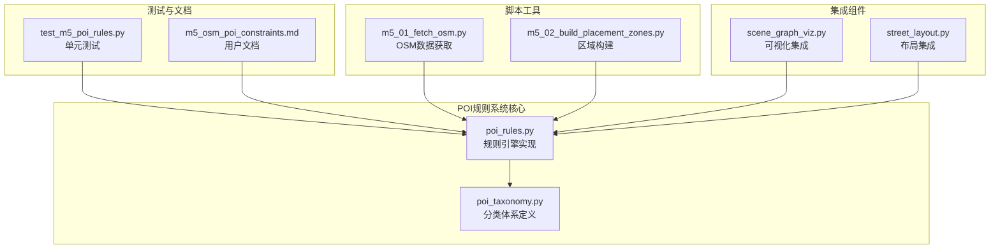
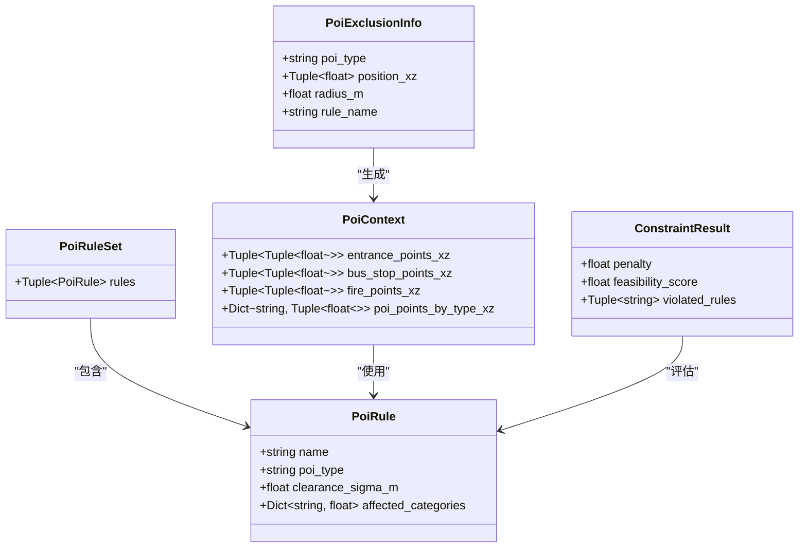
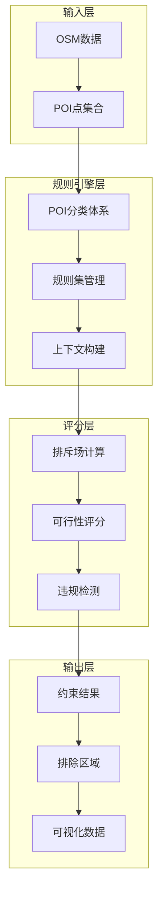
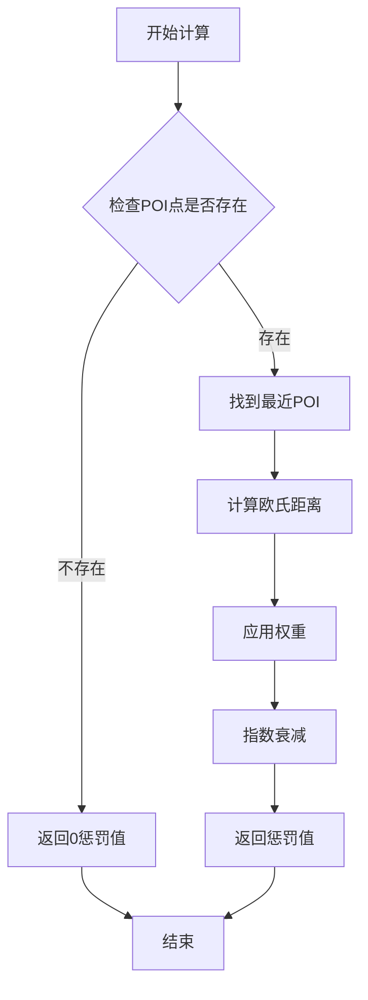
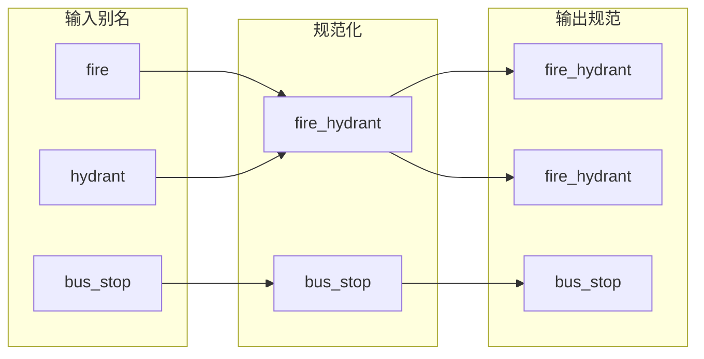
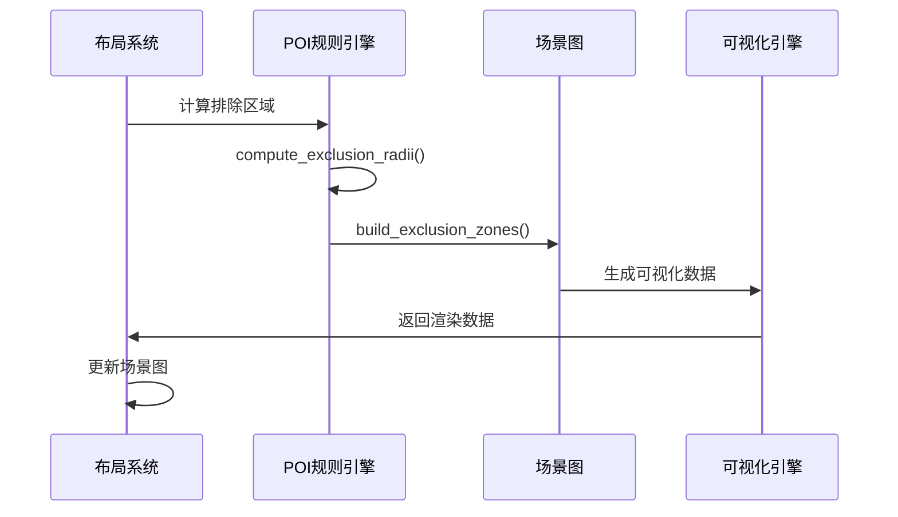
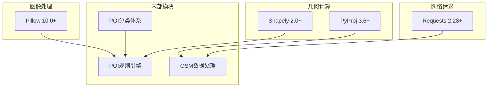
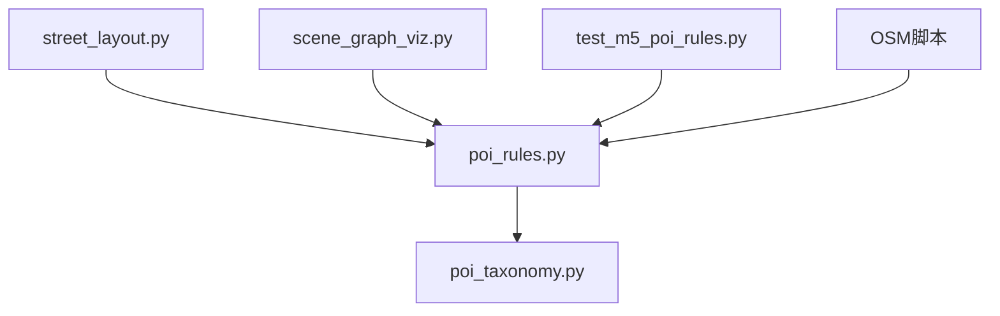
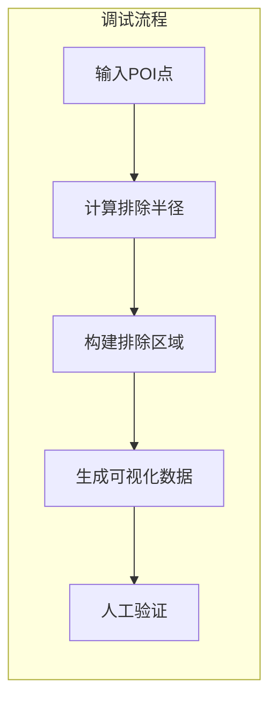

# POI规则系统

<cite>
**本文档引用的文件**
- [poi_rules.py](file://src/roadgen3d/poi_rules.py)
- [poi_taxonomy.py](file://src/roadgen3d/poi_taxonomy.py)
- [test_m5_poi_rules.py](file://tests/test_m5_poi_rules.py)
- [m5_osm_poi_constraints.md](file://docs/m5_osm_poi_constraints.md)
- [m5_01_fetch_osm.py](file://scripts/m5_01_fetch_osm.py)
- [m5_02_build_placement_zones.py](file://scripts/m5_02_build_placement_zones.py)
- [scene_graph_viz.py](file://src/roadgen3d/scene_graph_viz.py)
- [street_layout.py](file://src/roadgen3d/street_layout.py)
- [requirements-m5.txt](file://requirements-m5.txt)
</cite>

## 目录
1. [简介](#简介)
2. [项目结构](#项目结构)
3. [核心组件](#核心组件)
4. [架构概览](#架构概览)
5. [详细组件分析](#详细组件分析)
6. [依赖关系分析](#依赖关系分析)
7. [性能考虑](#性能考虑)
8. [故障排除指南](#故障排除指南)
9. [结论](#结论)
10. [附录](#附录)

## 简介

POI规则系统是RoadGen3D项目中M5模块的核心组成部分，负责基于兴趣点（Point of Interest, POI）的软约束放置评分。该系统通过数学模型对道路场景中的设施布局进行智能约束，确保建筑入口、消防栓、公交站等关键POI周围保持适当的安全距离和可达性。

系统采用指数衰减函数作为基础评分模型，结合权重矩阵和距离计算，为每个候选放置位置生成符合现实约束的可行性分数。该设计既保证了规则执行的效率，又提供了足够的灵活性来适应不同的城市规划需求。

## 项目结构

POI规则系统主要由以下核心文件组成：



**图表来源**
- [poi_rules.py:1-433](file://src/roadgen3d/poi_rules.py#L1-L433)
- [poi_taxonomy.py:1-416](file://src/roadgen3d/poi_taxonomy.py#L1-L416)

**章节来源**
- [poi_rules.py:1-433](file://src/roadgen3d/poi_rules.py#L1-L433)
- [poi_taxonomy.py:1-416](file://src/roadgen3d/poi_taxonomy.py#L1-L416)

## 核心组件

### 数据模型架构

系统采用强类型的数据模型来确保数据完整性和类型安全：



**图表来源**
- [poi_rules.py:20-71](file://src/roadgen3d/poi_rules.py#L20-L71)

### 规则集定义

系统内置了多个规则集，每种规则集针对不同的应用场景优化：

| 规则集名称 | 版本 | 描述 | 适用场景 |
|-----------|------|------|----------|
| entrance_fire_bus_stop_v1 | v1 | 基础规则集 | 通用城市道路 |
| multitype_street_poi_v2 | v2 | 多类型规则集 | 复杂交叉路口 |

**章节来源**
- [poi_rules.py:77-198](file://src/roadgen3d/poi_rules.py#L77-L198)

## 架构概览

POI规则系统采用分层架构设计，确保各组件职责清晰且易于维护：



**图表来源**
- [poi_rules.py:213-433](file://src/roadgen3d/poi_rules.py#L213-L433)
- [poi_taxonomy.py:10-168](file://src/roadgen3d/poi_taxonomy.py#L10-L168)

## 详细组件分析

### 规则引擎实现

规则引擎是系统的核心，负责将POI约束转换为可执行的数学模型：

#### 排斥场计算

系统使用指数衰减函数计算每个POI对候选位置的影响：

```
penalty_r = w_cat × exp(-distance / σ)
total_penalty = Σ penalty_r
feasibility = exp(-total_penalty)
```

其中：
- `w_cat` 是类别权重
- `σ` 是衰减系数（σ = 清距/2）
- `distance` 是候选位置到最近POI的距离

#### 距离计算优化



**图表来源**
- [poi_rules.py:221-276](file://src/roadgen3d/poi_rules.py#L221-L276)

**章节来源**
- [poi_rules.py:221-276](file://src/roadgen3d/poi_rules.py#L221-L276)

### POI分类体系

系统实现了完整的POI分类体系，支持多种POI类型的标准化处理：

#### 核心POI类型

| POI类型 | 规范化名称 | 权重 | 是否核心 | 资产类别 |
|---------|------------|------|----------|----------|
| entrance | entrance | 1.0 | 是 | - |
| bus_stop | bus_stop | 1.5 | 是 | bus_stop |
| fire | fire_hydrant | 1.3 | 是 | hydrant |
| crossing | crossing | 1.2 | 是 | - |
| traffic_signals | traffic_signals | 1.2 | 是 | - |
| parking_entrance | parking_entrance | 1.0 | 是 | - |
| subway_entrance | subway_entrance | 1.4 | 是 | - |
| post_box | post_box | 0.5 | 否 | mailbox |
| waste_basket | waste_basket | 0.4 | 否 | trash |
| bollard | bollard | 0.3 | 否 | bollard |

#### 别名映射

系统支持多种POI类型的别名，确保不同数据源的一致性：



**图表来源**
- [poi_taxonomy.py:12-15](file://src/roadgen3d/poi_taxonomy.py#L12-L15)

**章节来源**
- [poi_taxonomy.py:12-168](file://src/roadgen3d/poi_taxonomy.py#L12-L168)

### 排除区域计算

系统能够根据规则阈值计算每个POI的排除半径，用于可视化和冲突检测：

#### 排除半径公式

```
d = σ × ln(w_max / threshold)
```

其中：
- `threshold` 是违规阈值（默认0.3）
- `w_max` 是规则中最大的类别权重
- `σ` 是衰减系数

**章节来源**
- [poi_rules.py:361-389](file://src/roadgen3d/poi_rules.py#L361-L389)

### 可视化集成

系统提供了完整的可视化支持，包括排除区域绘制和冲突检测：

#### 场景图可视化



**图表来源**
- [scene_graph_viz.py:533-544](file://src/roadgen3d/scene_graph_viz.py#L533-L544)

**章节来源**
- [scene_graph_viz.py:533-544](file://src/roadgen3d/scene_graph_viz.py#L533-L544)

## 依赖关系分析

### 外部依赖

系统对外部库的依赖主要集中在几何计算和数据处理方面：



**图表来源**
- [requirements-m5.txt:1-5](file://requirements-m5.txt#L1-L5)

### 内部模块依赖



**图表来源**
- [poi_rules.py:9-13](file://src/roadgen3d/poi_rules.py#L9-L13)
- [street_layout.py:4355-4377](file://src/roadgen3d/street_layout.py#L4355-L4377)

**章节来源**
- [requirements-m5.txt:1-5](file://requirements-m5.txt#L1-L5)

## 性能考虑

### 时间复杂度分析

- **单点评分**: O(R × P)，其中R是规则数量，P是匹配的POI数量
- **多点评分**: O(N × R × P)，其中N是候选位置数量
- **排除区域计算**: O(R × P)

### 空间复杂度优化

系统通过以下方式优化内存使用：
- 使用元组而非列表存储静态数据
- 惰性计算POI点坐标
- 缓存规则集以避免重复加载

### 并行处理支持

系统设计支持并行处理，特别是在批量评分场景中可以显著提升性能。

## 故障排除指南

### 常见问题诊断

#### 规则加载失败

**症状**: `ValueError: Unknown POI rule set`

**解决方案**: 
1. 检查规则集名称是否正确
2. 验证规则集是否在`_RULE_SETS`字典中注册
3. 确认导入路径正确

#### POI点为空

**症状**: 所有评分结果都为0或1

**解决方案**:
1. 验证OSM数据获取是否成功
2. 检查POI点提取函数是否正常工作
3. 确认坐标系转换正确

#### 性能问题

**症状**: 评分过程耗时过长

**解决方案**:
1. 减少候选位置数量
2. 优化规则集大小
3. 考虑使用缓存机制

**章节来源**
- [test_m5_poi_rules.py:59-62](file://tests/test_m5_poi_rules.py#L59-L62)

### 调试工具

#### 单元测试框架

系统提供了完整的单元测试覆盖所有核心功能：

```python
# 测试规则集加载
def test_rule_set_loads():
    rs = load_rule_set("entrance_fire_bus_stop_v1")
    assert len(rs.rules) >= 9

# 测试高惩罚场景
def test_high_penalty_bench_on_entrance():
    rs = load_rule_set()
    ctx = _make_ctx(entrances=[(5.0, 5.0)])
    result = score_placement((5.0, 5.0), "bench", rs, ctx)
    assert result.penalty > 0.5
```

#### 可视化调试

系统支持排除区域的可视化，便于调试和验证：



**章节来源**
- [test_m5_poi_rules.py:69-110](file://tests/test_m5_poi_rules.py#L69-L110)

## 结论

POI规则系统通过精心设计的数学模型和模块化架构，成功实现了城市道路场景中POI约束的智能化处理。系统的主要优势包括：

1. **数学严谨性**: 基于指数衰减函数的评分模型具有良好的物理意义
2. **可扩展性**: 支持自定义规则集和POI类型
3. **性能优化**: 通过算法优化和缓存机制确保实时响应
4. **可视化支持**: 完整的排除区域可视化功能便于调试
5. **测试覆盖**: 全面的单元测试确保代码质量

该系统为RoadGen3D项目提供了坚实的POI约束基础，为后续的城市规划和景观设计提供了重要的技术支持。

## 附录

### 规则配置示例

#### 自定义规则集

```python
# 新增自定义规则
CUSTOM_RULES = PoiRuleSet(
    rules=(
        PoiRule(
            name="custom_clearance",
            poi_type="entrance",
            clearance_sigma_m=2.0,
            affected_categories={
                "tree": 1.0,
                "bench": 0.8,
            },
        ),
    )
)
```

#### 规则权重调整

| 规则名称 | 入口清理 | 消防通道 | 公交站清理 |
|----------|----------|----------|------------|
| 权重设置 | 1.0 | 1.0 | 0.9 |
| 衰减系数 | 2.5m | 3.0m | 4.0m |

### 集成指南

#### 在布局系统中集成

```python
# 在street_layout.py中集成POI规则
if config.constraint_mode == "soft":
    constraint_result = score_placement(point_xz, category, rule_set, poi_ctx)
    if float(constraint_result.penalty) > float(config.constraint_veto_threshold):
        return None, "constraint_vetoed"
```

#### 可视化集成

```python
# 在scene_graph_viz.py中添加POI排除区域
exclusion_zones = build_exclusion_zones(poi_ctx, rule_set)
```