# 图模板系统

<cite>
**本文档引用的文件**
- [graph_templates.py](file://src/roadgen3d/graph_templates.py)
- [graph_template_scene_bridge.py](file://src/roadgen3d/graph_template_scene_bridge.py)
- [reference_annotation.py](file://src/roadgen3d/reference_annotation.py)
- [reference_annotation_scene_bridge.py](file://src/roadgen3d/reference_annotation_scene_bridge.py)
- [osm_segment_graph.py](file://src/roadgen3d/osm_segment_graph.py)
- [types.py](file://src/roadgen3d/types.py)
- [placement_zones.py](file://src/roadgen3d/placement_zones.py)
- [scene_backends.py](file://src/roadgen3d/services/scene_backends.py)
- [annotation.json](file://assets/graph_templates/hkust_gz_gate/annotation.json)
- [test_graph_templates.py](file://tests/test_graph_templates.py)
- [test_graph_template_scene_bridge.py](file://tests/test_graph_template_scene_bridge.py)
- [main.py](file://web/api/main.py)
</cite>

## 目录
1. [简介](#简介)
2. [项目结构](#项目结构)
3. [核心组件](#核心组件)
4. [架构概览](#架构概览)
5. [详细组件分析](#详细组件分析)
6. [依赖关系分析](#依赖关系分析)
7. [性能考虑](#性能考虑)
8. [故障排除指南](#故障排除指南)
9. [结论](#结论)
10. [附录](#附录)

## 简介

图模板系统是 RoadGen3D 项目中的一个关键组件，它提供了基于图形的街道场景生成能力。该系统通过内置的图模板（Graph Templates）来驱动三维街道场景的生成，支持从参考注释（Reference Annotation）到实际场景的完整转换流程。

系统的核心目标是：
- 提供可复用的街道图模板
- 支持模板到场景的自动转换
- 实现参数化的场景生成
- 提供可视化编辑和预览功能

## 项目结构

图模板系统在代码库中的组织结构如下：

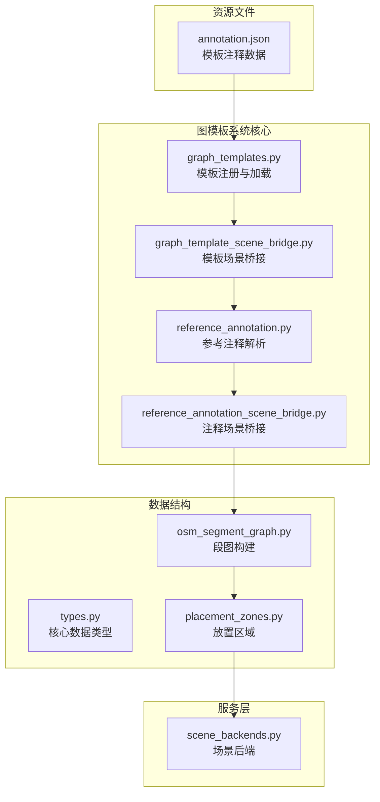

**图表来源**
- [graph_templates.py:1-120](file://src/roadgen3d/graph_templates.py#L1-L120)
- [graph_template_scene_bridge.py:1-67](file://src/roadgen3d/graph_template_scene_bridge.py#L1-L67)
- [reference_annotation.py:1-200](file://src/roadgen3d/reference_annotation.py#L1-L200)
- [reference_annotation_scene_bridge.py:1-183](file://src/roadgen3d/reference_annotation_scene_bridge.py#L1-L183)

**章节来源**
- [graph_templates.py:1-120](file://src/roadgen3d/graph_templates.py#L1-L120)
- [graph_template_scene_bridge.py:1-67](file://src/roadgen3d/graph_template_scene_bridge.py#L1-L67)
- [reference_annotation.py:1-200](file://src/roadgen3d/reference_annotation.py#L1-L200)

## 核心组件

### 图模板注册与管理

图模板系统的核心是 `GraphTemplate` 类和相关的管理函数：

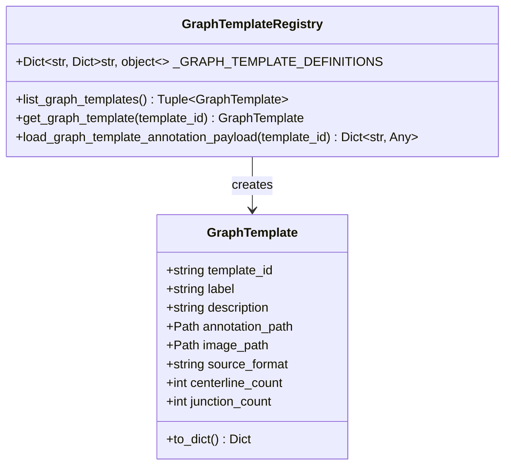

**图表来源**
- [graph_templates.py:15-93](file://src/roadgen3d/graph_templates.py#L15-L93)

### 场景桥接机制

场景桥接负责将图模板转换为可执行的场景生成流程：

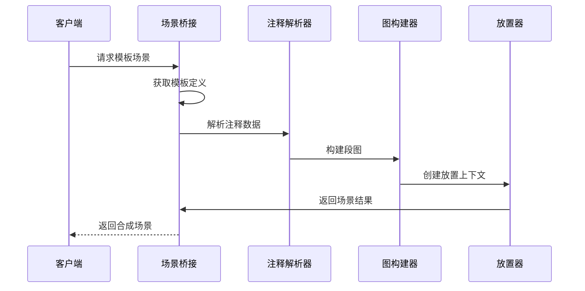

**图表来源**
- [graph_template_scene_bridge.py:28-60](file://src/roadgen3d/graph_template_scene_bridge.py#L28-L60)
- [reference_annotation_scene_bridge.py:117-175](file://src/roadgen3d/reference_annotation_scene_bridge.py#L117-L175)

**章节来源**
- [graph_templates.py:41-120](file://src/roadgen3d/graph_templates.py#L41-L120)
- [graph_template_scene_bridge.py:16-67](file://src/roadgen3d/graph_template_scene_bridge.py#L16-L67)

## 架构概览

图模板系统采用分层架构设计，确保了模块间的清晰分离和高内聚低耦合：

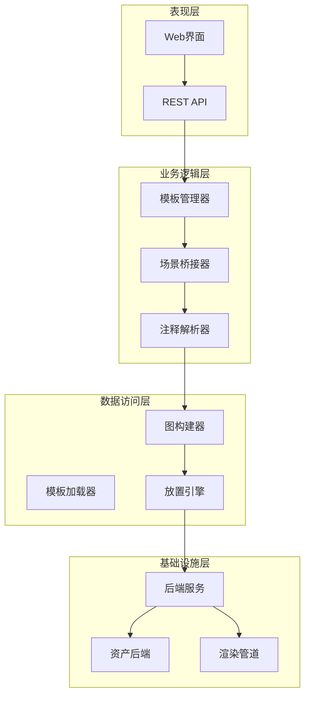

**图表来源**
- [graph_template_scene_bridge.py:28-60](file://src/roadgen3d/graph_template_scene_bridge.py#L28-L60)
- [reference_annotation_scene_bridge.py:117-175](file://src/roadgen3d/reference_annotation_scene_bridge.py#L117-L175)

## 详细组件分析

### 数据结构设计

#### 节点类型定义

系统定义了多种节点类型来表示街道场景的不同元素：

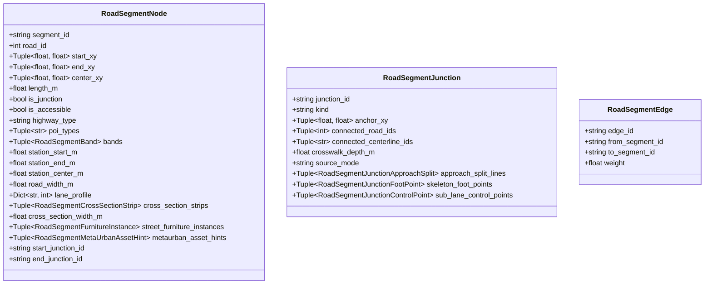

**图表来源**
- [types.py:626-713](file://src/roadgen3d/types.py#L626-L713)

#### 边关系定义

边关系用于描述节点之间的连接和交互关系：

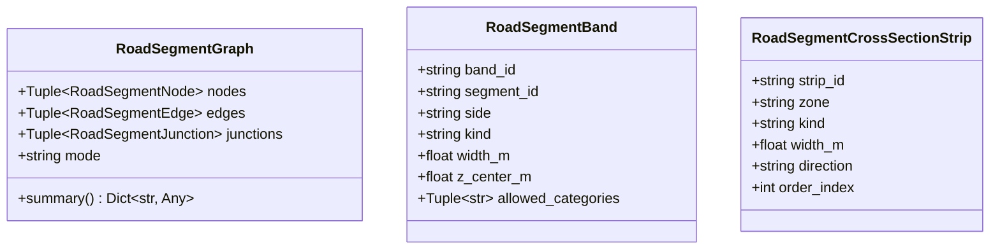

**图表来源**
- [types.py:699-713](file://src/roadgen3d/types.py#L699-L713)

**章节来源**
- [types.py:626-772](file://src/roadgen3d/types.py#L626-L772)

### 模板解析器实现

#### 语法分析流程

模板解析器负责将 JSON 格式的注释数据转换为内部数据结构：

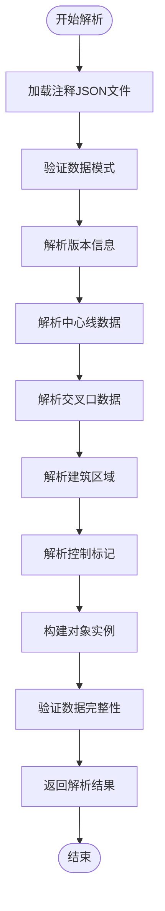

**图表来源**
- [reference_annotation.py:748-775](file://src/roadgen3d/reference_annotation.py#L748-L775)

#### 语义验证机制

系统实现了多层次的语义验证来确保数据的有效性：

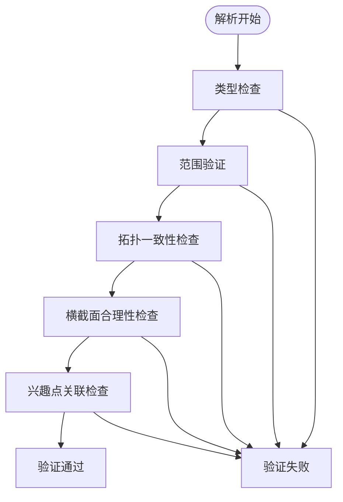

**图表来源**
- [reference_annotation.py:778-800](file://src/roadgen3d/reference_annotation.py#L778-L800)

**章节来源**
- [reference_annotation.py:748-800](file://src/roadgen3d/reference_annotation.py#L748-L800)

### 场景桥接机制

#### 模板到场景的映射

场景桥接器负责将图模板转换为可执行的场景生成流程：

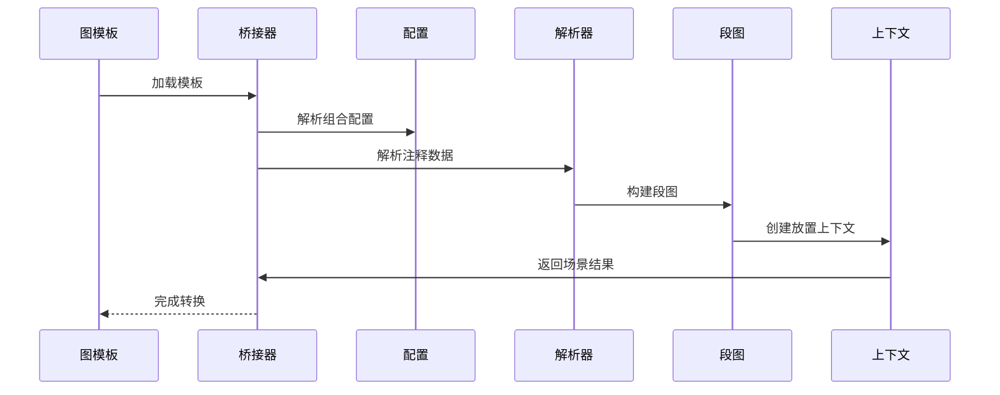

**图表来源**
- [graph_template_scene_bridge.py:28-60](file://src/roadgen3d/graph_template_scene_bridge.py#L28-L60)

#### 参数绑定与渲染接口

系统提供了灵活的参数绑定机制和标准化的渲染接口：

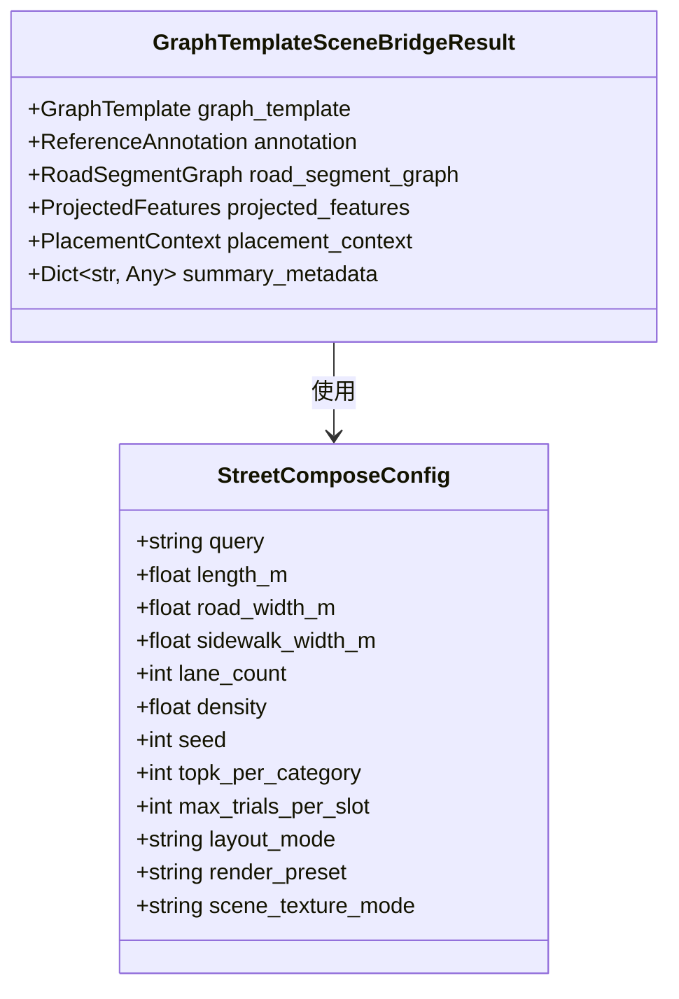

**图表来源**
- [graph_template_scene_bridge.py:16-26](file://src/roadgen3d/graph_template_scene_bridge.py#L16-L26)

**章节来源**
- [graph_template_scene_bridge.py:16-67](file://src/roadgen3d/graph_template_scene_bridge.py#L16-L67)

### 模板扩展方法

#### 自定义节点类型

系统支持通过扩展 `AnnotatedCenterline` 和相关类来添加新的节点类型：

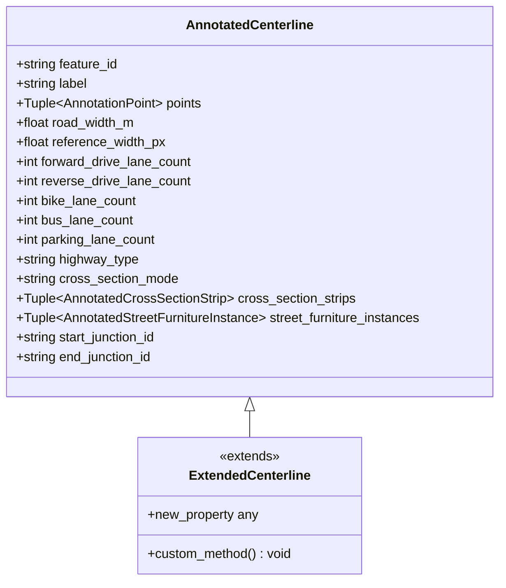

**图表来源**
- [reference_annotation.py:582-660](file://src/roadgen3d/reference_annotation.py#L582-L660)

#### 新关系定义

通过扩展 `RoadSegmentJunction` 和相关类来支持新的关系类型：

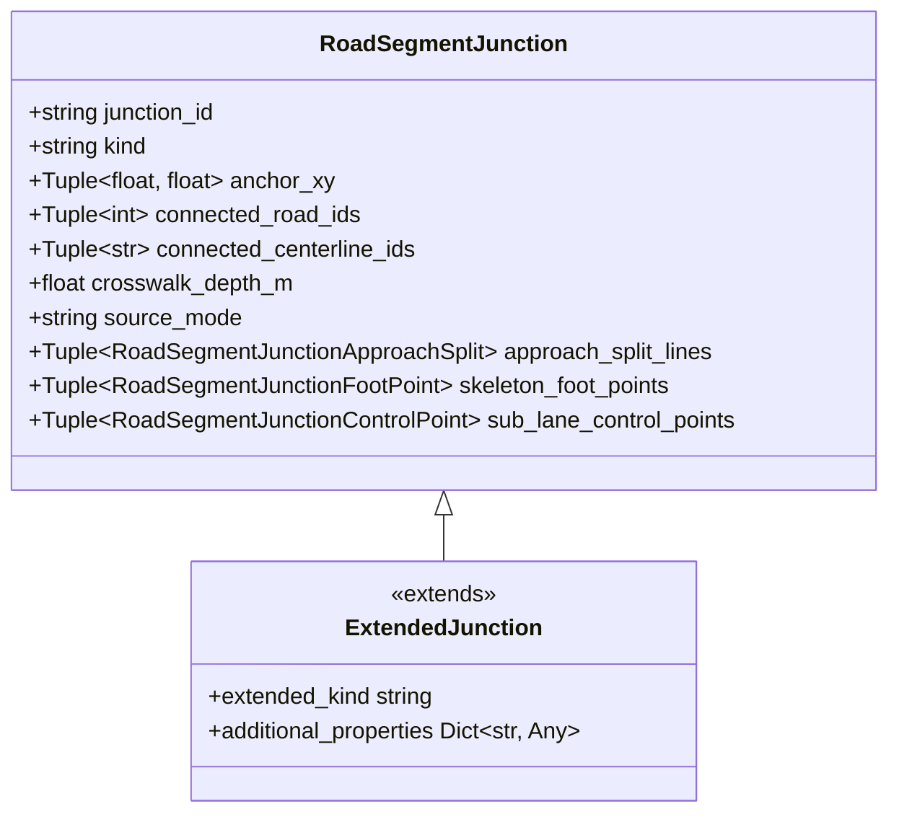

**图表来源**
- [types.py:596-622](file://src/roadgen3d/types.py#L596-L622)

#### 渲染后端扩展

系统支持通过实现 `ObjectAssetBackend` 接口来扩展新的渲染后端：

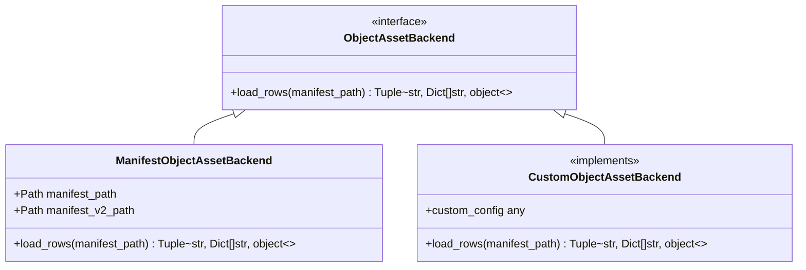

**图表来源**
- [services/scene_backends.py:96-101](file://src/roadgen3d/services/scene_backends.py#L96-L101)

**章节来源**
- [reference_annotation.py:582-660](file://src/roadgen3d/reference_annotation.py#L582-L660)
- [services/scene_backends.py:96-235](file://src/roadgen3d/services/scene_backends.py#L96-L235)

## 依赖关系分析

图模板系统的依赖关系呈现清晰的层次结构：

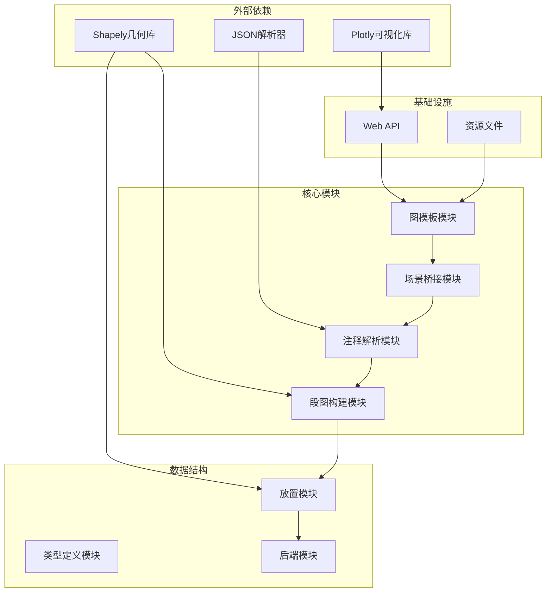

**图表来源**
- [graph_templates.py:1-120](file://src/roadgen3d/graph_templates.py#L1-L120)
- [graph_template_scene_bridge.py:1-67](file://src/roadgen3d/graph_template_scene_bridge.py#L1-L67)

**章节来源**
- [graph_templates.py:1-120](file://src/roadgen3d/graph_templates.py#L1-L120)
- [graph_template_scene_bridge.py:1-67](file://src/roadgen3d/graph_template_scene_bridge.py#L1-L67)

## 性能考虑

### 缓存策略

系统实现了多级缓存机制来提升性能：

1. **模板缓存**：使用 LRU 缓存存储已加载的模板数据
2. **解析缓存**：缓存注释解析结果以避免重复计算
3. **几何缓存**：缓存复杂的几何计算结果

### 内存优化

- 使用 `@dataclass(frozen=True)` 确保不可变数据结构
- 实现 `to_dict()` 方法进行序列化时的内存优化
- 合理使用元组而非列表以减少内存占用

### 并行处理

系统支持并行处理多个模板实例，通过异步操作提升整体吞吐量。

## 故障排除指南

### 常见问题诊断

#### 模板加载失败

当遇到模板加载问题时，可以检查以下方面：

1. **文件路径验证**：确认模板文件存在且路径正确
2. **JSON格式验证**：检查注释文件的 JSON 格式是否正确
3. **权限检查**：确保有足够的文件读取权限

#### 场景生成错误

场景生成过程中可能遇到的问题：

1. **几何冲突**：检查道路宽度和车道数量的合理性
2. **放置约束**：验证放置区域的可用性和约束条件
3. **资源缺失**：确认所需的纹理和模型文件存在

**章节来源**
- [test_graph_templates.py:16-35](file://tests/test_graph_templates.py#L16-L35)
- [test_graph_template_scene_bridge.py:19-35](file://tests/test_graph_template_scene_bridge.py#L19-L35)

## 结论

图模板系统为 RoadGen3D 提供了一个强大而灵活的街道场景生成框架。通过模块化的架构设计、清晰的数据结构定义和完善的扩展机制，系统能够支持各种复杂的街道场景生成需求。

系统的主要优势包括：
- **高度模块化**：各组件职责明确，易于维护和扩展
- **强类型安全**：使用 dataclass 和类型注解确保数据完整性
- **可扩展性**：支持自定义节点类型、关系和渲染后端
- **性能优化**：实现了多级缓存和并行处理机制

未来的发展方向可以包括：
- 增强可视化编辑器功能
- 扩展更多的模板类型和场景风格
- 优化大规模场景的生成性能
- 集成更多的第三方渲染引擎

## 附录

### API 参考

#### 图模板 API

| 端点 | 方法 | 描述 |
|------|------|------|
| `/api/graph-templates` | GET | 获取所有可用的图模板列表 |
| `/api/graph-templates/{template_id}/image` | GET | 获取指定模板的预览图片 |

#### 场景生成 API

| 端点 | 方法 | 描述 |
|------|------|------|
| `/api/scene/generate` | POST | 生成场景 |
| `/api/scene/status/{job_id}` | GET | 查询场景生成状态 |

**章节来源**
- [main.py:125-142](file://web/api/main.py#L125-L142)

### 最佳实践指南

#### 模板复用

1. **标准化命名**：使用一致的模板命名约定
2. **版本管理**：为模板建立版本控制系统
3. **文档维护**：为每个模板编写详细的使用说明

#### 模板开发

1. **渐进式开发**：从简单的模板开始，逐步增加复杂度
2. **测试驱动**：为新模板编写完整的测试用例
3. **性能监控**：监控模板的生成性能和资源消耗

#### 版本管理

1. **语义化版本**：使用语义化版本控制模板变更
2. **向后兼容**：确保新版本与旧版本的兼容性
3. **迁移指南**：为重大变更提供迁移指导

#### 性能优化策略

1. **缓存策略**：合理设置缓存失效时间
2. **批量处理**：对相似场景进行批量生成
3. **资源池化**：复用昂贵的资源对象
4. **异步处理**：使用异步操作提升响应速度