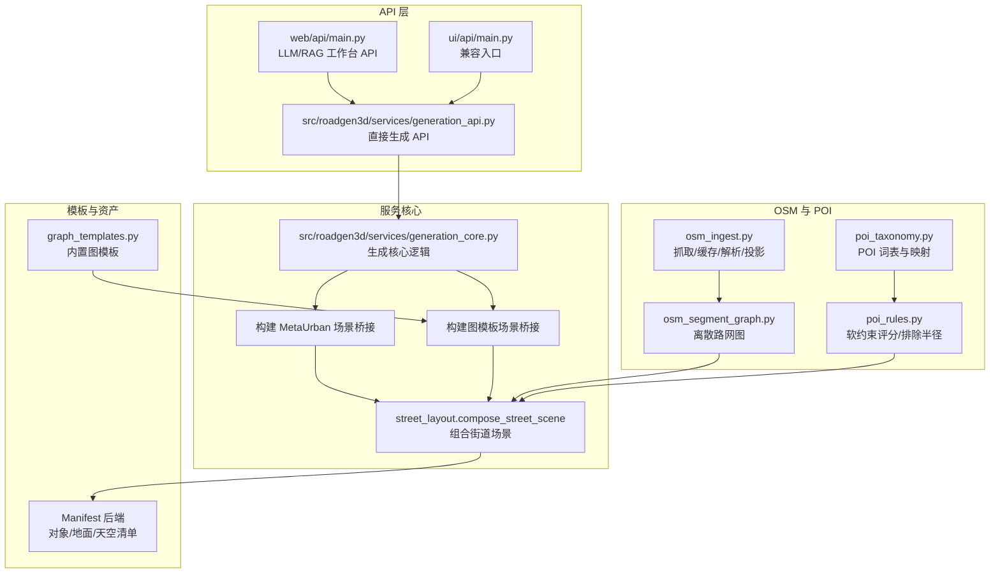
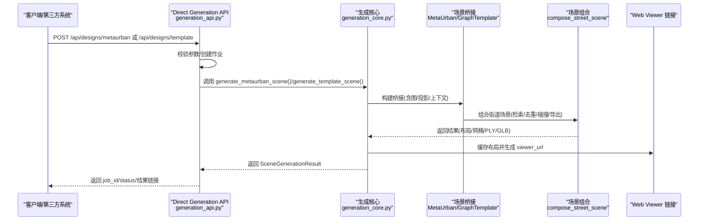
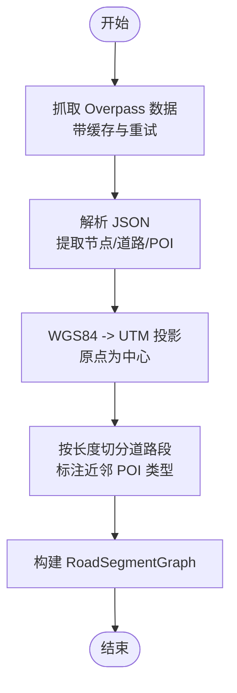
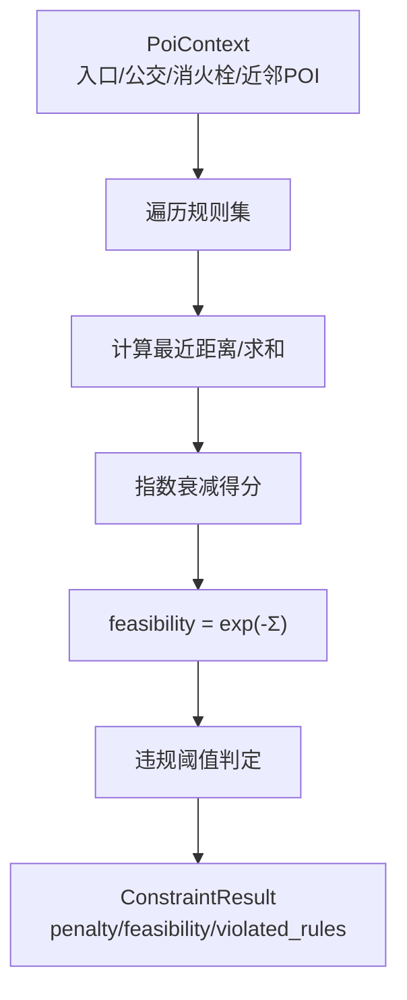
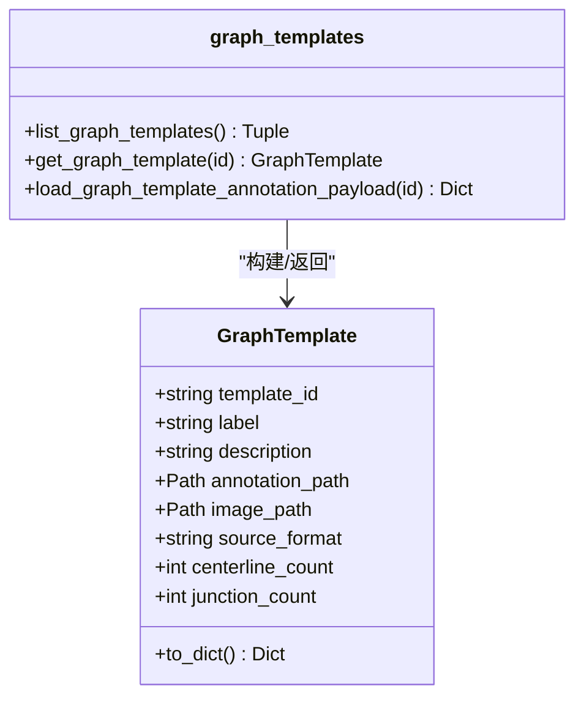
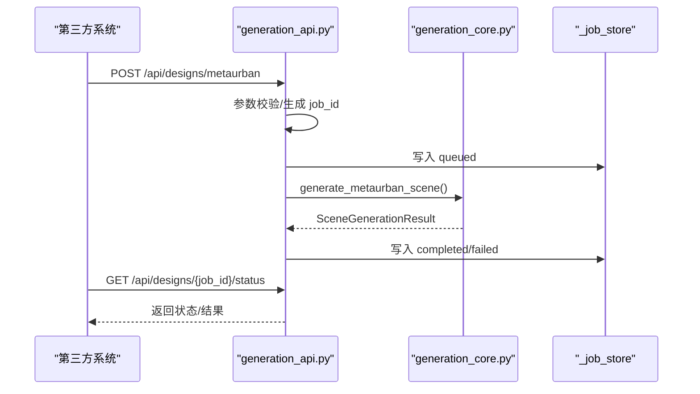
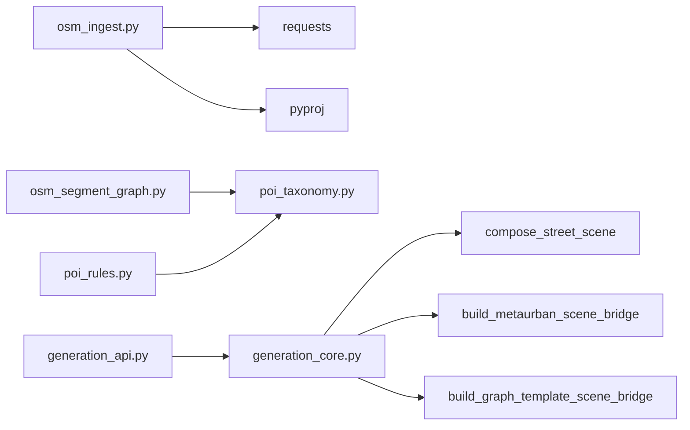

# 第三方系统对接

<cite>
**本文引用的文件**
- [README.md](file://README.md)
- [API_GUIDE.md](file://API_GUIDE.md)
- [osm_ingest.py](file://src/roadgen3d/osm_ingest.py)
- [poi_taxonomy.py](file://src/roadgen3d/poi_taxonomy.py)
- [poi_rules.py](file://src/roadgen3d/poi_rules.py)
- [osm_segment_graph.py](file://src/roadgen3d/osm_segment_graph.py)
- [graph_templates.py](file://src/roadgen3d/graph_templates.py)
- [generation_api.py](file://src/roadgen3d/services/generation_api.py)
- [generation_core.py](file://src/roadgen3d/services/generation_core.py)
- [web/api/main.py](file://web/api/main.py)
- [ui/api/main.py](file://ui/api/main.py)
- [m5_osm_poi_constraints.md](file://docs/m5_osm_poi_constraints.md)
- [m6_neurosymbolic_street_generation.md](file://docs/m6_neurosymbolic_street_generation.md)
</cite>

## 目录
1. [简介](#简介)
2. [项目结构](#项目结构)
3. [核心组件](#核心组件)
4. [架构总览](#架构总览)
5. [详细组件分析](#详细组件分析)
6. [依赖关系分析](#依赖关系分析)
7. [性能考虑](#性能考虑)
8. [故障排查指南](#故障排查指南)
9. [结论](#结论)
10. [附录](#附录)

## 简介
本技术指南面向第三方系统对接 RoadGen3D，重点覆盖以下能力：
- 与 OpenStreetMap 的集成：数据获取、解析、投影与预处理，以及基于道路与 POI 的布局约束。
- POI 规则系统：兴趣点分类、软约束评分与可视化排除半径。
- 图模板系统扩展：自定义模板格式、解析器与渲染接口。
- 与 CAD/3D 工具对接：文件格式转换、元数据提取与批量处理建议。
- API 扩展：认证机制、请求处理、响应格式与任务队列。
- 数据验证、错误处理与兼容性保障。
- 大规模数据集成与性能优化策略。

## 项目结构
RoadGen3D 采用分层模块化组织，核心在 src/roadgen3d，服务入口位于 web/api/main.py 与 ui/api/main.py，CLI 脚本位于 scripts/，文档位于 docs/。

**图表来源**
- [web/api/main.py:1-286](file://web/api/main.py#L1-L286)
- [ui/api/main.py:1-6](file://ui/api/main.py#L1-L6)
- [generation_api.py:1-294](file://src/roadgen3d/services/generation_api.py#L1-L294)
- [generation_core.py:1-445](file://src/roadgen3d/services/generation_core.py#L1-L445)
- [osm_ingest.py:1-331](file://src/roadgen3d/osm_ingest.py#L1-L331)
- [osm_segment_graph.py:1-166](file://src/roadgen3d/osm_segment_graph.py#L1-L166)
- [poi_taxonomy.py:1-416](file://src/roadgen3d/poi_taxonomy.py#L1-L416)
- [poi_rules.py:1-433](file://src/roadgen3d/poi_rules.py#L1-L433)
- [graph_templates.py:1-120](file://src/roadgen3d/graph_templates.py#L1-L120)

**章节来源**
- [README.md:107-130](file://README.md#L107-L130)
- [web/api/main.py:81-267](file://web/api/main.py#L81-L267)
- [ui/api/main.py:1-6](file://ui/api/main.py#L1-L6)
- [generation_api.py:1-294](file://src/roadgen3d/services/generation_api.py#L1-L294)
- [generation_core.py:1-445](file://src/roadgen3d/services/generation_core.py#L1-L445)

## 核心组件
- OSM 数据管线：Overpass 抓取、JSON 解析、WGS84 到 UTM 投影、缓存与重试。
- POI 体系：标准化 POI 类型、Overpass 查询片段、聚类与统计。
- POI 规则引擎：基于指数衰减的软约束评分、可行度与违规判定。
- 图模板系统：内置模板定义、注解载入与渲染接口。
- 生成 API：直接场景生成路由、作业状态查询、健康检查。
- 生成核心：参数到配置映射、桥接构建、组合输出与 Web Viewer 链接生成。

**章节来源**
- [osm_ingest.py:126-331](file://src/roadgen3d/osm_ingest.py#L126-L331)
- [poi_taxonomy.py:10-416](file://src/roadgen3d/poi_taxonomy.py#L10-L416)
- [poi_rules.py:213-433](file://src/roadgen3d/poi_rules.py#L213-L433)
- [graph_templates.py:41-120](file://src/roadgen3d/graph_templates.py#L41-L120)
- [generation_api.py:131-294](file://src/roadgen3d/services/generation_api.py#L131-L294)
- [generation_core.py:157-445](file://src/roadgen3d/services/generation_core.py#L157-L445)

## 架构总览
下图展示从 Web Viewer 到场景生成的端到端流程，以及 OSM/POI 在其中的位置。

**图表来源**
- [generation_api.py:131-294](file://src/roadgen3d/services/generation_api.py#L131-L294)
- [generation_core.py:267-445](file://src/roadgen3d/services/generation_core.py#L267-L445)
- [web/api/main.py:188-267](file://web/api/main.py#L188-L267)

## 详细组件分析

### OSM 数据集成与预处理
- 数据获取：基于 Overpass API 的 QL 查询，支持道路、建筑与 POI；带缓存与指数退避重试。
- 解析与投影：将节点坐标映射为道路几何，提取 POI 类型，WGS84 投影到 UTM 局部坐标系，中心点为 bbox 中心。
- 预处理：按 segment_length 将道路线性切分为离散段，记录近邻 POI 类型，构建 RoadSegmentGraph。

**图表来源**
- [osm_ingest.py:126-331](file://src/roadgen3d/osm_ingest.py#L126-L331)
- [osm_segment_graph.py:68-166](file://src/roadgen3d/osm_segment_graph.py#L68-L166)

**章节来源**
- [osm_ingest.py:126-331](file://src/roadgen3d/osm_ingest.py#L126-L331)
- [osm_segment_graph.py:68-166](file://src/roadgen3d/osm_segment_graph.py#L68-L166)
- [m5_osm_poi_constraints.md:14-61](file://docs/m5_osm_poi_constraints.md#L14-L61)

### POI 规则系统
- POI 分类与映射：统一 canonical 类型、显示名、权重、是否核心、资产类别、聚类半径、Overpass 查询片段等。
- 规则集：多条软约束规则，针对不同 POI 类型设置 clearance_sigma_m 与类别惩罚权重。
- 评分与可视化：单点规则贡献为指数衰减，总惩罚与可行度通过 exp(-penalty) 计算；可计算每 POI 的排除半径。

**图表来源**
- [poi_taxonomy.py:10-416](file://src/roadgen3d/poi_taxonomy.py#L10-L416)
- [poi_rules.py:213-433](file://src/roadgen3d/poi_rules.py#L213-L433)

**章节来源**
- [poi_taxonomy.py:10-416](file://src/roadgen3d/poi_taxonomy.py#L10-L416)
- [poi_rules.py:213-433](file://src/roadgen3d/poi_rules.py#L213-L433)
- [m5_osm_poi_constraints.md:62-95](file://docs/m5_osm_poi_constraints.md#L62-L95)

### 图模板系统扩展
- 内置模板：以 JSON 注解形式存储，包含版本、中心线/交叉口数量等元信息。
- 加载与校验：LRU 缓存注解 JSON；校验注解对象结构；注入图像路径。
- 渲染接口：对外暴露模板列表与图像文件服务端点。

**图表来源**
- [graph_templates.py:15-120](file://src/roadgen3d/graph_templates.py#L15-L120)

**章节来源**
- [graph_templates.py:41-120](file://src/roadgen3d/graph_templates.py#L41-L120)
- [web/api/main.py:125-143](file://web/api/main.py#L125-L143)

### API 接口扩展
- 直接生成 API：/api/designs/metaurban、/api/designs/template、/api/designs/osm（占位）、/api/designs/{job_id}/status、/api/scenes/{job_id}、/api/health。
- 请求体参数：包含参考方案/模板 ID、道路宽度、长度、块序列、随机种子等。
- 响应：作业状态、结果路径、Web Viewer URL；失败时返回错误信息。
- 兼容性：保留 /api/health 与 /api/scenes/recent 等旧端点（工作台使用）。

**图表来源**
- [generation_api.py:131-294](file://src/roadgen3d/services/generation_api.py#L131-L294)
- [generation_core.py:267-445](file://src/roadgen3d/services/generation_core.py#L267-L445)

**章节来源**
- [generation_api.py:131-294](file://src/roadgen3d/services/generation_api.py#L131-L294)
- [API_GUIDE.md:75-185](file://API_GUIDE.md#L75-L185)
- [web/api/main.py:188-267](file://web/api/main.py#L188-L267)

### 与 CAD/3D 工具对接建议
- 文件格式转换：RoadGen3D 默认导出 GLB（显示）与 PLY（调试）。第三方可基于导出路径进行二次转换（如 FBX/OBJ），需保留材质与纹理信息。
- 元数据提取：场景布局 JSON 包含摘要与实例统计，可作为 CAD 工具的批处理输入；Web Viewer URL 可用于快速预览。
- 批量处理：结合 /api/scenes/recent 与 /api/scenes/{job_id} 获取批量场景结果，再驱动外部工具链。

**章节来源**
- [generation_core.py:228-265](file://src/roadgen3d/services/generation_core.py#L228-L265)
- [web/api/main.py:217-222](file://web/api/main.py#L217-L222)

## 依赖关系分析
- OSM 依赖：requests、pyproj（UTM 投影）、shapely（后续可能引入）。
- 生成依赖：torch（网格导出）、FAISS（检索）、CLIP（特征）。
- API 依赖：FastAPI、uvicorn（生产部署建议）。

**图表来源**
- [osm_ingest.py:126-331](file://src/roadgen3d/osm_ingest.py#L126-L331)
- [osm_segment_graph.py:68-166](file://src/roadgen3d/osm_segment_graph.py#L68-L166)
- [poi_rules.py:213-433](file://src/roadgen3d/poi_rules.py#L213-L433)
- [generation_api.py:17-25](file://src/roadgen3d/services/generation_api.py#L17-L25)
- [generation_core.py:17-31](file://src/roadgen3d/services/generation_core.py#L17-L31)

**章节来源**
- [m5_osm_poi_constraints.md:7-12](file://docs/m5_osm_poi_constraints.md#L7-L12)
- [README.md:145-156](file://README.md#L145-L156)

## 性能考虑
- OSM 抓取与缓存：利用本地缓存避免重复网络请求；合理设置 segment_length 以平衡精度与计算量。
- 投影与几何：UTM 投影减少投影误差；对 POI 近邻搜索设置阈值，降低复杂度。
- 规则评分：指数衰减可向量化评估；聚合模式“sum”用于热力图可视化，单点评分“nearest”用于放置打分。
- 生成流水线：对象清单后端、设备选择与导出格式影响吞吐；建议在 GPU 上运行以加速网格导出。
- 任务队列：当前内存作业存储仅适合开发环境；生产建议替换为持久化存储与后台任务队列（如 Celery/RQ）。

**章节来源**
- [osm_ingest.py:126-168](file://src/roadgen3d/osm_ingest.py#L126-L168)
- [osm_segment_graph.py:25-36](file://src/roadgen3d/osm_segment_graph.py#L25-L36)
- [poi_rules.py:242-299](file://src/roadgen3d/poi_rules.py#L242-L299)
- [generation_core.py:84-135](file://src/roadgen3d/services/generation_core.py#L84-L135)
- [API_GUIDE.md:330-337](file://API_GUIDE.md#L330-L337)

## 故障排查指南
- 作业状态长期 queued：首次加载模型或资源不足导致；可等待或检查日志。
- “Reference plan not found”：确认 reference_plan_id 是否在内置方案中。
- “Graph template not found”：确认 template_id 是否存在于内置模板定义。
- OSM 生成失败：新 API 的 OSM 端点仍为占位；请使用 M5 CLI 流程或等待实现。
- torch 未安装：安装 PyTorch 以支持网格导出。

**章节来源**
- [API_GUIDE.md:303-337](file://API_GUIDE.md#L303-L337)
- [generation_api.py:213-248](file://src/roadgen3d/services/generation_api.py#L213-L248)
- [generation_core.py:327-411](file://src/roadgen3d/services/generation_core.py#L327-L411)

## 结论
本指南提供了 RoadGen3D 与第三方系统对接的完整路径：从 OSM 数据获取与 POI 规则评分，到图模板扩展与 API 调用，再到 CAD/3D 工具的文件转换与批量处理。通过合理的数据验证、错误处理与性能优化，可在工程环境中稳定集成并扩展系统能力。

## 附录
- 神经符号化管线概览：M6 将场景生成拆分为 StreetProgram、ConstraintSet、LayoutSolver 三层，提升可编辑性与可解释性。
- OSM 约束与合规评估：M5 引入软约束评分与合规报告字段，便于第三方系统进行质量控制与审计。

**章节来源**
- [m6_neurosymbolic_street_generation.md:1-60](file://docs/m6_neurosymbolic_street_generation.md#L1-L60)
- [m5_osm_poi_constraints.md:81-101](file://docs/m5_osm_poi_constraints.md#L81-L101)