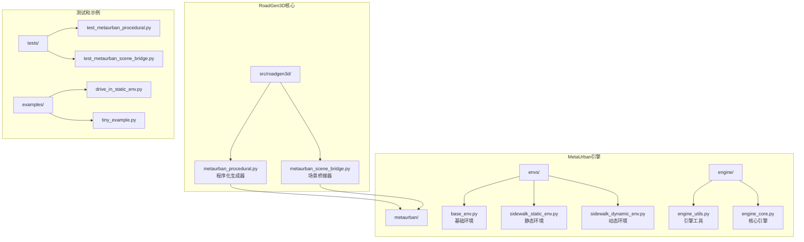
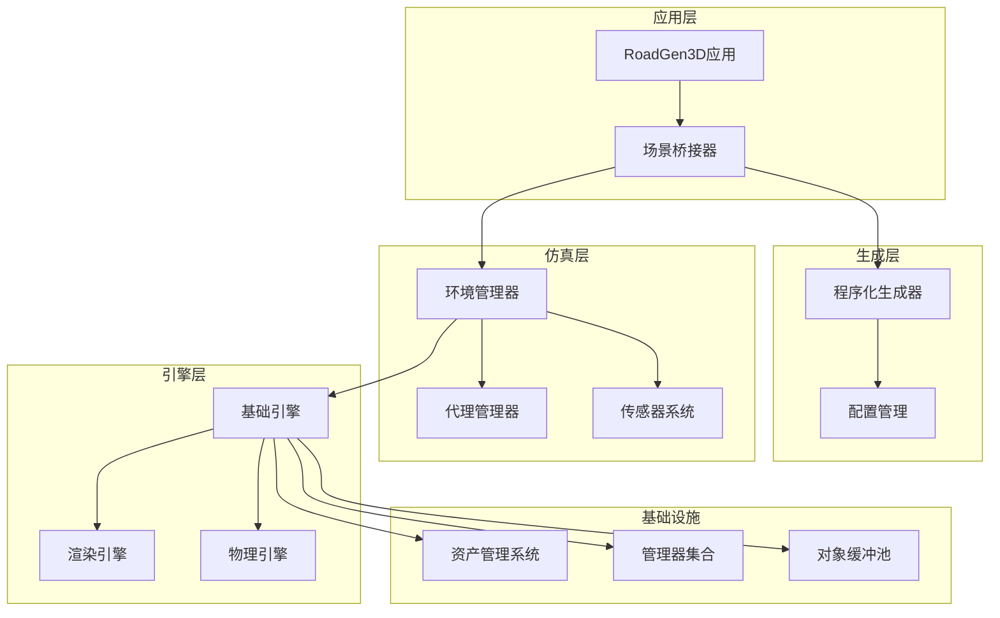
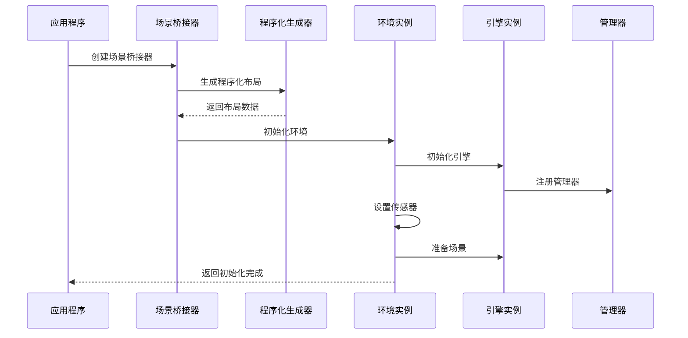
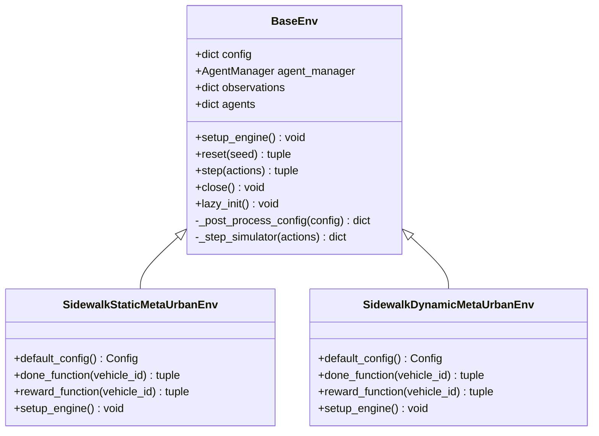
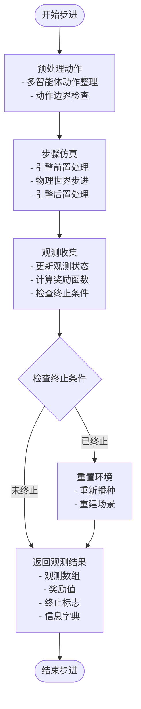
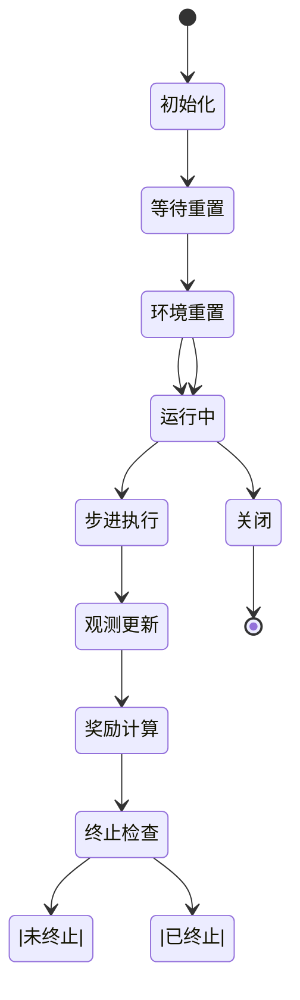
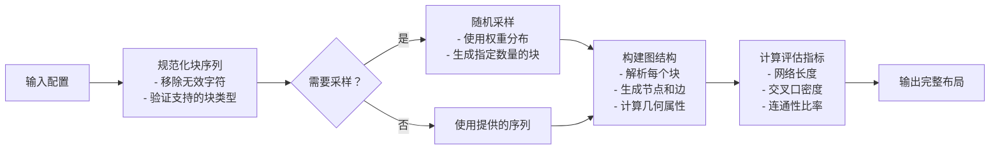
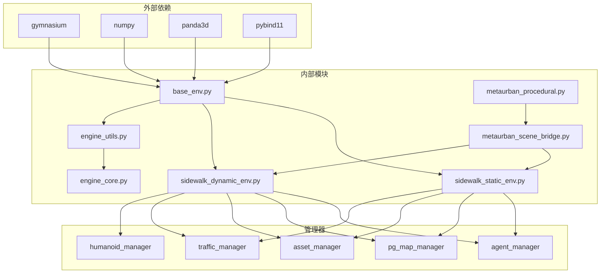
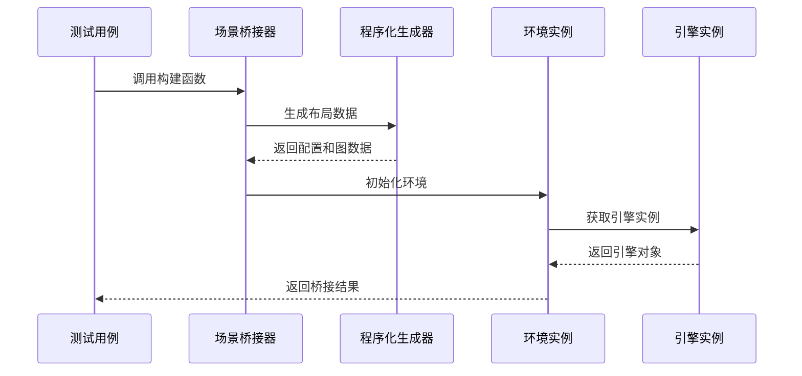
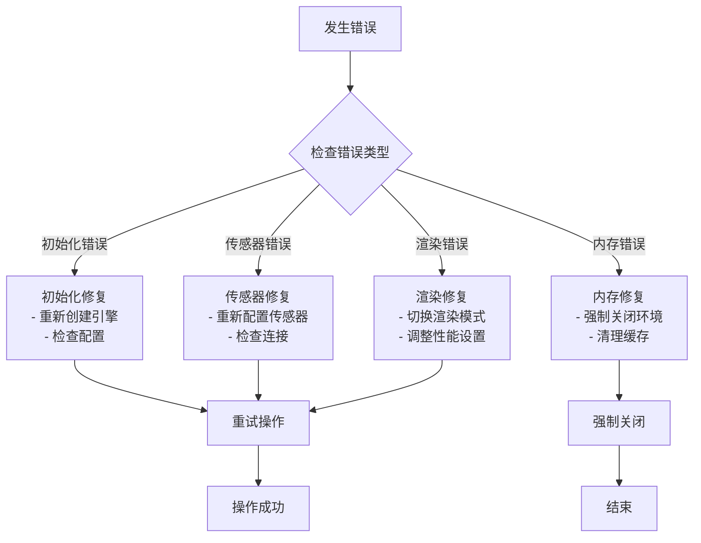

# MetaUrban仿真集成

<cite>
**本文档引用的文件**
- [sidewalk_static_env.py](file://metaurban/metaurban/envs/sidewalk_static_env.py)
- [sidewalk_dynamic_env.py](file://metaurban/metaurban/envs/sidewalk_dynamic_env.py)
- [base_env.py](file://metaurban/metaurban/envs/base_env.py)
- [engine_utils.py](file://metaurban/metaurban/engine/engine_utils.py)
- [engine_core.py](file://metaurban/metaurban/engine/core/engine_core.py)
- [metaurban_procedural.py](file://src/roadgen3d/metaurban_procedural.py)
- [metaurban_scene_bridge.py](file://src/roadgen3d/metaurban_scene_bridge.py)
- [drive_in_static_env.py](file://metaurban/metaurban/examples/drive_in_static_env.py)
- [tiny_example.py](file://metaurban/metaurban/examples/tiny_example.py)
- [test_metaurban_procedural.py](file://tests/test_metaurban_procedural.py)
- [test_metaurban_scene_bridge.py](file://tests/test_metaurban_scene_bridge.py)
</cite>

## 目录
1. [简介](#简介)
2. [项目结构](#项目结构)
3. [核心组件](#核心组件)
4. [架构概览](#架构概览)
5. [详细组件分析](#详细组件分析)
6. [依赖关系分析](#依赖关系分析)
7. [性能考虑](#性能考虑)
8. [故障排除指南](#故障排除指南)
9. [结论](#结论)
10. [附录](#附录)

## 简介

MetaUrban仿真平台集成是RoadGen3D项目中的关键组成部分，它实现了与MetaUrban仿真引擎的深度集成。该集成允许RoadGen3D利用MetaUrban的强大仿真能力来生成高质量的城市街道场景，包括静态和动态环境的模拟。

本集成主要包含以下核心功能：
- 环境初始化和配置管理
- 场景加载和渲染流程
- 传感器系统集成
- 仿真步进机制
- 状态管理和资源清理
- 性能优化和内存管理

## 项目结构

RoadGen3D项目采用模块化架构设计，MetaUrban集成主要分布在以下几个关键目录中：



**图表来源**
- [metaurban_procedural.py:1-897](file://src/roadgen3d/metaurban_procedural.py#L1-L897)
- [metaurban_scene_bridge.py:1-241](file://src/roadgen3d/metaurban_scene_bridge.py#L1-L241)
- [base_env.py:1-952](file://metaurban/metaurban/envs/base_env.py#L1-L952)

**章节来源**
- [metaurban_procedural.py:1-897](file://src/roadgen3d/metaurban_procedural.py#L1-L897)
- [metaurban_scene_bridge.py:1-241](file://src/roadgen3d/metaurban_scene_bridge.py#L1-L241)
- [base_env.py:1-952](file://metaurban/metaurban/envs/base_env.py#L1-L952)

## 核心组件

### 程序化生成器 (MetaUrbanProceduralConfig)

程序化生成器是RoadGen3D对MetaUrban算法的本地端口实现，负责生成道路网络图。它支持多种块类型（Straight、Curve、Intersection等）并提供灵活的配置选项。

关键特性：
- 支持5种块类型的组合：S（直道）、C（弯道）、X（标准十字路口）、T（T字路口）、O（环形交叉）
- 可配置的车道数量、宽度和段长度
- 随机种子控制确保可重现性
- 生成完整的道路段图（RoadSegmentGraph）

### 场景桥接器 (MetaUrbanSceneBridge)

场景桥接器负责将MetaUrban程序化生成的图形转换为RoadGen3D的场景上下文，包括：
- 路段图的构建和投影
- 人行道区域的识别和管理
- 资产放置上下文的建立
- 评估指标的计算

### 环境类 (SidewalkStaticMetaUrbanEnv & SidewalkDynamicMetaUrbanEnv)

这两个环境类提供了不同复杂度的仿真场景：

**静态环境特点：**
- 固定的交通流量
- 预定义的人行道资产
- 简化的行人行为模型

**动态环境特点：**
- 实时交通流生成
- 动态行人资产管理
- 更复杂的交互场景

**章节来源**
- [metaurban_procedural.py:59-800](file://src/roadgen3d/metaurban_procedural.py#L59-L800)
- [metaurban_scene_bridge.py:26-241](file://src/roadgen3d/metaurban_scene_bridge.py#L26-L241)
- [sidewalk_static_env.py:111-392](file://metaurban/metaurban/envs/sidewalk_static_env.py#L111-L392)
- [sidewalk_dynamic_env.py:103-391](file://metaurban/metaurban/envs/sidewalk_dynamic_env.py#L103-L391)

## 架构概览

MetaUrban仿真集成采用分层架构设计，确保了良好的模块分离和扩展性：



**图表来源**
- [base_env.py:275-430](file://metaurban/metaurban/envs/base_env.py#L275-L430)
- [engine_utils.py:8-58](file://metaurban/metaurban/engine/engine_utils.py#L8-L58)
- [engine_core.py:117-132](file://metaurban/metaurban/engine/core/engine_core.py#L117-L132)

### 启动流程序列



**图表来源**
- [metaurban_scene_bridge.py:163-234](file://src/roadgen3d/metaurban_scene_bridge.py#L163-L234)
- [base_env.py:404-422](file://metaurban/metaurban/envs/base_env.py#L404-L422)
- [engine_utils.py:8-15](file://metaurban/metaurban/engine/engine_utils.py#L8-L15)

## 详细组件分析

### 环境初始化和配置管理

#### 基础环境类 (BaseEnv)

基础环境类提供了完整的仿真环境生命周期管理：



**图表来源**
- [base_env.py:275-800](file://metaurban/metaurban/envs/base_env.py#L275-L800)
- [sidewalk_static_env.py:111-392](file://metaurban/metaurban/envs/sidewalk_static_env.py#L111-L392)
- [sidewalk_dynamic_env.py:103-391](file://metaurban/metaurban/envs/sidewalk_dynamic_env.py#L103-L391)

#### 配置参数详解

环境配置包含多个层次的参数设置：

**通用配置参数：**
- `num_agents`: 代理数量（默认1）
- `is_multi_agent`: 多智能体模式开关
- `horizon`: 智能体回合的最大步数
- `truncate_as_terminate`: 步数超限时的终止行为

**传感器配置：**
- `sensors`: 传感器列表（激光雷达、侧向检测器等）
- `image_observation`: 图像观测模式
- `norm_pixel`: 像素值归一化

**渲染配置：**
- `use_render`: 渲染窗口显示
- `window_size`: 窗口尺寸
- `physics_world_step_size`: 物理世界步长
- `decision_repeat`: 决策重复次数

**地形配置：**
- `map_region_size`: 地图区域大小
- `show_sidewalk`: 人行道显示
- `show_crosswalk`: 人行横道显示

**章节来源**
- [base_env.py:33-272](file://metaurban/metaurban/envs/base_env.py#L33-L272)
- [sidewalk_static_env.py:19-108](file://metaurban/metaurban/envs/sidewalk_static_env.py#L19-L108)
- [sidewalk_dynamic_env.py:19-100](file://metaurban/metaurban/envs/sidewalk_dynamic_env.py#L19-L100)

### 仿真步进机制

#### 步进流程分析



**图表来源**
- [base_env.py:432-650](file://metaurban/metaurban/envs/base_env.py#L432-L650)

#### 状态管理流程



**图表来源**
- [base_env.py:509-547](file://metaurban/metaurban/envs/base_env.py#L509-L547)

### 传感器系统集成

#### 传感器配置和管理

MetaUrban仿真环境支持多种传感器类型，每种都有特定的配置参数：

**图像传感器：**
- RGB相机：用于视觉观测
- 深度相机：提供深度信息
- 语义相机：标注场景元素

**激光雷达传感器：**
- 激光雷达：用于障碍物检测
- 侧向检测器：检测侧向障碍物
- 车道线检测器：检测车道线

**传感器配置参数：**
- `num_lasers`: 激光束数量
- `distance`: 检测距离
- `gaussian_noise`: 高斯噪声
- `dropout_prob`: 探测器失效概率

**章节来源**
- [base_env.py:177-178](file://metaurban/metaurban/envs/base_env.py#L177-L178)
- [base_env.py:165-175](file://metaurban/metaurban/envs/base_env.py#L165-L175)

### 程序化场景生成

#### 块序列生成算法

程序化生成器使用基于规则的语法生成道路网络：



**图表来源**
- [metaurban_procedural.py:124-162](file://src/roadgen3d/metaurban_procedural.py#L124-L162)
- [metaurban_procedural.py:545-762](file://src/roadgen3d/metaurban_procedural.py#L545-L762)

#### 块类型详解

**直道块 (S)：**
- 生成直线道路段
- 参数：直线路段长度
- 几何：简单线性插值

**弯道块 (C)：**
- 生成曲线道路段
- 参数：曲线半径、转角
- 几何：圆弧插值

**十字路口块 (X)：**
- 生成标准十字路口
- 参数：交叉跨度、分支长度
- 几何：多段连接

**T字路口块 (T)：**
- 生成T字形交叉口
- 参数：交叉跨度、分支长度
- 几何：不对称分支

**环形交叉块 (O)：**
- 生成环形交叉口
- 参数：环形半径、出入口
- 几何：完整的环形路网

**章节来源**
- [metaurban_procedural.py:137-162](file://src/roadgen3d/metaurban_procedural.py#L137-L162)
- [metaurban_procedural.py:564-757](file://src/roadgen3d/metaurban_procedural.py#L564-L757)

## 依赖关系分析

### 组件间依赖关系



**图表来源**
- [base_env.py:1-32](file://metaurban/metaurban/envs/base_env.py#L1-L32)
- [sidewalk_static_env.py:1-18](file://metaurban/metaurban/envs/sidewalk_static_env.py#L1-L18)
- [sidewalk_dynamic_env.py:1-18](file://metaurban/metaurban/envs/sidewalk_dynamic_env.py#L1-L18)

### 数据流依赖



**图表来源**
- [test_metaurban_procedural.py:15-24](file://tests/test_metaurban_procedural.py#L15-L24)
- [test_metaurban_scene_bridge.py:15-16](file://tests/test_metaurban_scene_bridge.py#L15-L16)

**章节来源**
- [test_metaurban_procedural.py:1-107](file://tests/test_metaurban_procedural.py#L1-L107)
- [test_metaurban_scene_bridge.py:1-47](file://tests/test_metaurban_scene_bridge.py#L1-L47)

## 性能考虑

### 渲染优化策略

MetaUrban仿真引擎采用了多层次的渲染优化技术：

**离屏渲染：**
- 默认禁用主窗口以减少GPU开销
- 仅在需要时启用渲染模式
- 支持多线程渲染提升性能

**对象缓冲池：**
- 缓冲常用对象避免频繁分配
- 对象复用减少内存碎片
- 可配置缓冲池大小

**传感器优化：**
- 在无渲染模式下过滤传感器
- 按需创建传感器实例
- CUDA图像传输优化

### 内存管理策略

**对象生命周期管理：**
- 引擎单例模式确保唯一性
- 自动资源清理机制
- 手动关闭接口防止内存泄漏

**配置管理：**
- 全局配置同步
- 随机种子同步
- 状态一致性保证

**章节来源**
- [engine_core.py:117-132](file://metaurban/metaurban/engine/core/engine_core.py#L117-L132)
- [engine_utils.py:48-58](file://metaurban/metaurban/engine/engine_utils.py#L48-L58)
- [base_env.py:339-347](file://metaurban/metaurban/envs/base_env.py#L339-L347)

## 故障排除指南

### 常见问题和解决方案

**引擎初始化失败：**
- 症状：`PermissionError: There should be only one BaseEngine instance in one process`
- 解决方案：确保在单个进程中只创建一个引擎实例，使用`env.close()`正确关闭之前的环境

**传感器配置错误：**
- 症状：传感器不存在或配置不匹配
- 解决方案：检查传感器名称和配置参数，确保传感器类型正确

**渲染模式问题：**
- 症状：渲染窗口无法显示或性能异常
- 解决方案：根据需求选择合适的渲染模式，离屏渲染适合批量处理

**内存泄漏问题：**
- 症状：长时间运行后内存持续增长
- 解决方案：定期调用`env.close()`，确保所有资源正确释放

### 错误处理机制



**图表来源**
- [base_env.py:525-531](file://metaurban/metaurban/envs/base_env.py#L525-L531)
- [engine_utils.py:30-34](file://metaurban/metaurban/engine/engine_utils.py#L30-L34)

**章节来源**
- [base_env.py:651-660](file://metaurban/metaurban/envs/base_env.py#L651-L660)
- [engine_utils.py:30-34](file://metaurban/metaurban/engine/engine_utils.py#L30-L34)

## 结论

MetaUrban仿真平台集成通过精心设计的架构实现了RoadGen3D与MetaUrban引擎的无缝集成。该集成具有以下优势：

**技术优势：**
- 模块化设计确保了良好的可维护性和扩展性
- 程序化生成器提供了灵活的场景定制能力
- 完善的传感器系统支持多种感知需求
- 优化的性能策略确保了高效的仿真运行

**应用价值：**
- 支持静态和动态两种环境模式
- 提供丰富的配置选项满足不同需求
- 完善的测试覆盖保证了代码质量
- 清晰的错误处理机制提升了用户体验

该集成为RoadGen3D项目提供了强大的仿真基础，为后续的功能扩展和应用开发奠定了坚实的基础。

## 附录

### 集成测试方法

#### 单元测试覆盖

集成测试涵盖了核心功能的各个方面：

**程序化生成测试：**
- 验证块序列采样正确性
- 检查图结构生成完整性
- 确认评估指标计算准确性

**场景桥接测试：**
- 验证场景构建流程
- 检查几何投影准确性
- 确认资产放置上下文

**章节来源**
- [test_metaurban_procedural.py:27-107](file://tests/test_metaurban_procedural.py#L27-L107)
- [test_metaurban_scene_bridge.py:33-47](file://tests/test_metaurban_scene_bridge.py#L33-L47)

### 示例代码参考

#### 基础使用示例

```python
# 创建静态环境
config = {
    "start_seed": 0,
    "num_scenarios": 1,
    "map": 3,
    "traffic_density": 0.0
}
env = SidewalkStaticMetaUrbanEnv(config)
obs, _ = env.reset(seed=30)

# 主循环
try:
    for i in range(1000):
        obs, reward, terminated, truncated, info = env.step([0., 0.0])
        if terminated or truncated:
            env.reset()
finally:
    env.close()
```

**章节来源**
- [drive_in_static_env.py:94-110](file://metaurban/metaurban/examples/drive_in_static_env.py#L94-L110)
- [tiny_example.py:94-110](file://metaurban/metaurban/examples/tiny_example.py#L94-L110)

### 性能基准

| 指标 | 静态环境 | 动态环境 | 差异 |
|------|----------|----------|------|
| 渲染帧率 | 高 | 中等 | 由于实时交通生成 |
| 内存使用 | 低 | 中等 | 动态对象管理 |
| CPU占用 | 低 | 中等 | 传感器处理 |
| GPU占用 | 低 | 中等 | 渲染开销 |

该性能基准为用户选择合适的环境模式提供了参考依据。